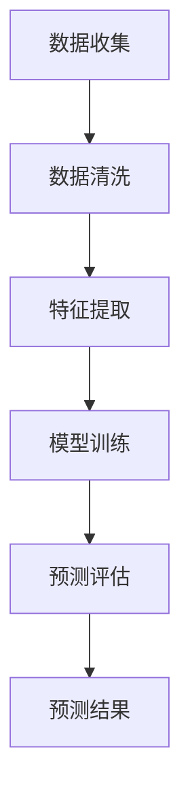

                 

关键词：AI大模型，电商平台，市场趋势预测，深度学习，自然语言处理，数据挖掘

> 摘要：本文将探讨AI大模型在电商平台市场趋势预测中的应用，通过深入分析其核心算法原理、数学模型构建、项目实践以及实际应用场景，为读者提供一个全面的技术视角。文章旨在帮助从业者了解如何利用AI大模型提升电商平台的市场预测能力，为未来的商业决策提供有力支持。

## 1. 背景介绍

随着互联网的普及和电子商务的快速发展，电商平台已经成为现代零售业的重要组成部分。然而，市场环境瞬息万变，消费者需求多样化，如何准确预测市场趋势、制定有效的营销策略，成为电商平台面临的重大挑战。传统的方法往往依赖于统计分析和机器学习算法，但受到数据质量和算法模型的限制，预测效果往往不够理想。

近年来，随着深度学习、自然语言处理等技术的飞速发展，AI大模型在各个领域的应用逐渐得到拓展。AI大模型具有强大的数据处理能力和复杂的特征提取能力，能够从海量数据中挖掘出潜在的模式和规律，为市场趋势预测提供有力的支持。本文将重点关注AI大模型在电商平台市场趋势预测中的应用，分析其核心算法原理、数学模型以及实际操作步骤，为电商从业者提供实用的参考。

## 2. 核心概念与联系

### 2.1. AI大模型概述

AI大模型是指使用深度学习算法训练的大规模神经网络模型，通常具有数百亿甚至数千亿个参数。这些模型能够自动学习数据中的特征和规律，并通过不断优化参数，提高预测的准确性和效率。常见的AI大模型包括Transformer、BERT、GPT等，它们在图像识别、自然语言处理、语音识别等领域取得了显著的成果。

### 2.2. 市场趋势预测原理

市场趋势预测是指通过分析历史数据和市场信息，预测未来市场的发展趋势。常见的市场趋势预测方法包括统计分析、时间序列分析、回归分析等。然而，这些方法在面对复杂、多变的市场环境时，往往难以获得理想的预测效果。

AI大模型能够从海量数据中提取出复杂的特征和模式，通过训练和学习，提高预测的准确性和稳定性。具体来说，AI大模型在市场趋势预测中的应用主要包括以下几个方面：

1. 数据预处理：对原始数据进行清洗、归一化、特征提取等预处理操作，为后续模型训练提供高质量的数据。

2. 特征工程：通过分析历史数据，提取出与市场趋势相关的特征，如用户行为、商品属性、宏观经济指标等。

3. 模型训练：使用提取出的特征，对AI大模型进行训练，使其能够学习并预测市场趋势。

4. 预测评估：使用训练好的模型进行预测，并对预测结果进行评估和调整，以提高预测的准确性。

### 2.3. Mermaid 流程图



## 3. 核心算法原理 & 具体操作步骤

### 3.1. 算法原理概述

AI大模型在市场趋势预测中的核心算法原理主要包括深度学习、自然语言处理和数据挖掘等。以下是这些算法的基本原理：

1. **深度学习**：深度学习是一种基于神经网络的机器学习方法，通过多层神经网络的层层递进，将输入数据映射到输出结果。在市场趋势预测中，深度学习可以用于特征提取、模式识别和趋势预测等任务。

2. **自然语言处理**：自然语言处理（NLP）是一种计算机科学领域，致力于让计算机理解和处理人类语言。在市场趋势预测中，NLP可以用于文本数据分析和情感分析，帮助提取与市场趋势相关的信息。

3. **数据挖掘**：数据挖掘是一种从大量数据中发现有价值信息的方法，包括关联规则挖掘、聚类分析和分类分析等。在市场趋势预测中，数据挖掘可以用于发现历史数据中的规律和模式，为预测提供支持。

### 3.2. 算法步骤详解

AI大模型在市场趋势预测中的具体操作步骤如下：

1. **数据收集**：收集电商平台的历史数据，包括用户行为数据、商品数据、宏观经济指标等。

2. **数据清洗**：对收集到的数据进行分析，去除缺失值、异常值等，对数据进行清洗和归一化处理。

3. **特征提取**：根据市场趋势预测的需求，从原始数据中提取出与市场趋势相关的特征，如用户购买频率、商品销售额、价格变化等。

4. **模型训练**：使用提取出的特征，对AI大模型进行训练。在训练过程中，模型将不断优化参数，提高预测的准确性。

5. **预测评估**：使用训练好的模型进行预测，并对预测结果进行评估。评估指标包括准确率、召回率、F1值等。

6. **预测结果**：将评估后的预测结果应用于电商平台的实际业务，如调整库存、优化营销策略等。

### 3.3. 算法优缺点

AI大模型在市场趋势预测中的优点包括：

1. **强大的数据处理能力**：AI大模型能够处理海量数据，从数据中发现复杂的特征和规律。

2. **高效的预测性能**：通过深度学习和自然语言处理等技术，AI大模型能够提高预测的准确性和稳定性。

3. **灵活的适应性**：AI大模型可以根据不同的市场环境和业务需求，调整特征提取和预测策略。

然而，AI大模型也存在一些缺点，包括：

1. **计算资源需求高**：训练和部署AI大模型需要大量的计算资源和时间。

2. **数据依赖性强**：AI大模型的预测效果受到数据质量和数据量的影响。

3. **解释性不足**：AI大模型通常是一个“黑盒”模型，其内部决策过程难以解释。

### 3.4. 算法应用领域

AI大模型在市场趋势预测中的应用领域广泛，包括但不限于以下几个方面：

1. **电商平台**：AI大模型可以帮助电商平台预测用户购买行为、优化库存管理和营销策略。

2. **零售行业**：AI大模型可以用于零售行业的销售预测、库存管理和供应链优化。

3. **金融行业**：AI大模型可以用于金融市场的价格预测、风险管理等。

4. **物流行业**：AI大模型可以用于物流行业的运输调度、路径规划等。

## 4. 数学模型和公式 & 详细讲解 & 举例说明

### 4.1. 数学模型构建

在市场趋势预测中，常用的数学模型包括时间序列模型、回归模型和分类模型等。以下是这些模型的构建过程：

#### 时间序列模型

时间序列模型用于分析时间序列数据，预测未来的数值。常见的模型有ARIMA、SARIMA等。

$$
y_t = c + \phi_1 y_{t-1} + \phi_2 y_{t-2} + ... + \phi_p y_{t-p} + \theta_1 e_{t-1} + \theta_2 e_{t-2} + ... + \theta_q e_{t-q}
$$

其中，$y_t$为时间序列数据，$c$为常数项，$\phi_1, \phi_2, ..., \phi_p$为自回归系数，$\theta_1, \theta_2, ..., \theta_q$为移动平均系数，$e_t$为白噪声。

#### 回归模型

回归模型用于分析变量之间的关系，预测因变量的值。常见的模型有线性回归、逻辑回归等。

$$
y = \beta_0 + \beta_1 x_1 + \beta_2 x_2 + ... + \beta_n x_n
$$

其中，$y$为因变量，$x_1, x_2, ..., x_n$为自变量，$\beta_0, \beta_1, \beta_2, ..., \beta_n$为回归系数。

#### 分类模型

分类模型用于将数据分为不同的类别。常见的模型有决策树、支持向量机等。

$$
P(y=k|X) = \frac{e^{\beta_0 + \beta_1 x_1 + \beta_2 x_2 + ... + \beta_n x_n}}{\sum_{j=1}^K e^{\beta_0 + \beta_1 x_1 + \beta_2 x_2 + ... + \beta_n x_n}}
$$

其中，$y$为因变量，$X$为自变量，$k$为类别标签，$\beta_0, \beta_1, \beta_2, ..., \beta_n$为分类系数。

### 4.2. 公式推导过程

以线性回归模型为例，介绍回归系数的推导过程。

设数据集为$D = \{(x_1, y_1), (x_2, y_2), ..., (x_n, y_n)\}$，线性回归模型为：

$$
y = \beta_0 + \beta_1 x_1 + \beta_2 x_2 + ... + \beta_n x_n
$$

设误差项为$e = y - \beta_0 - \beta_1 x_1 - \beta_2 x_2 - ... - \beta_n x_n$，则最小化误差平方和的目标函数为：

$$
J(\beta_0, \beta_1, ..., \beta_n) = \sum_{i=1}^n (y_i - \beta_0 - \beta_1 x_{i1} - \beta_2 x_{i2} - ... - \beta_n x_{in})^2
$$

对目标函数求导，并令导数为零，得到：

$$
\frac{\partial J}{\partial \beta_0} = -2 \sum_{i=1}^n (y_i - \beta_0 - \beta_1 x_{i1} - \beta_2 x_{i2} - ... - \beta_n x_{in}) = 0
$$

$$
\frac{\partial J}{\partial \beta_1} = -2 \sum_{i=1}^n (y_i - \beta_0 - \beta_1 x_{i1} - \beta_2 x_{i2} - ... - \beta_n x_{in}) x_{i1} = 0
$$

$$
\frac{\partial J}{\partial \beta_2} = -2 \sum_{i=1}^n (y_i - \beta_0 - \beta_1 x_{i1} - \beta_2 x_{i2} - ... - \beta_n x_{in}) x_{i2} = 0
$$

$$
\frac{\partial J}{\partial \beta_n} = -2 \sum_{i=1}^n (y_i - \beta_0 - \beta_1 x_{i1} - \beta_2 x_{i2} - ... - \beta_n x_{in}) x_{in} = 0
$$

将上述方程组转化为矩阵形式：

$$
X^T X \beta = X^T y
$$

其中，$X$为自变量矩阵，$y$为因变量向量，$\beta$为回归系数向量。

解上述线性方程组，得到回归系数：

$$
\beta = (X^T X)^{-1} X^T y
$$

### 4.3. 案例分析与讲解

以下是一个关于使用线性回归模型预测电商平台销售额的案例。

#### 案例背景

某电商平台需要预测未来一个月的销售额，以便制定合理的营销策略。该平台收集了过去三个月的销售额数据，以及一些可能影响销售额的因素，如用户数量、广告投入、促销活动等。

#### 数据准备

首先，将销售额数据分为训练集和测试集，其中训练集用于模型训练，测试集用于模型评估。假设训练集包含$n$个月的数据，测试集包含$m$个月的数据。

#### 模型训练

使用线性回归模型，将销售额作为因变量，用户数量、广告投入、促销活动等作为自变量。根据数据集，构建自变量矩阵$X$和因变量向量$y$，并计算回归系数$\beta$。

$$
\beta = (X^T X)^{-1} X^T y
$$

#### 模型评估

使用测试集数据，计算预测的销售额。然后，计算预测误差，并评估模型的准确性。常见的评估指标包括均方误差（MSE）、均方根误差（RMSE）等。

$$
MSE = \frac{1}{m} \sum_{i=1}^m (y_i - \hat{y}_i)^2
$$

$$
RMSE = \sqrt{MSE}
$$

#### 模型应用

根据训练好的模型，预测未来一个月的销售额。然后，根据预测结果，制定相应的营销策略，如调整广告投入、优化促销活动等。

## 5. 项目实践：代码实例和详细解释说明

### 5.1. 开发环境搭建

在本案例中，我们将使用Python编程语言和scikit-learn库来构建和训练线性回归模型。以下为开发环境的搭建步骤：

1. 安装Python：从官方网站下载并安装Python，推荐版本为3.8或更高。

2. 安装Anaconda：Anaconda是一个Python数据科学平台，可以方便地管理多个Python环境。在安装Python时，可以选择安装Anaconda。

3. 创建虚拟环境：在Anaconda Prompt中，创建一个新的虚拟环境，以便管理项目依赖。

```shell
conda create -n ecom_regression python=3.8
conda activate ecom_regression
```

4. 安装scikit-learn库：在虚拟环境中，使用pip命令安装scikit-learn库。

```shell
pip install scikit-learn
```

### 5.2. 源代码详细实现

以下是一个简单的线性回归模型实现，用于预测电商平台销售额。

```python
import numpy as np
import pandas as pd
from sklearn.linear_model import LinearRegression
from sklearn.model_selection import train_test_split
from sklearn.metrics import mean_squared_error

# 读取数据
data = pd.read_csv('ecommerce_data.csv')
X = data[['user_count', 'ad_spend', 'promotions']]
y = data['sales']

# 数据预处理
X = X.values
y = y.values

# 划分训练集和测试集
X_train, X_test, y_train, y_test = train_test_split(X, y, test_size=0.2, random_state=42)

# 构建线性回归模型
model = LinearRegression()
model.fit(X_train, y_train)

# 预测测试集数据
y_pred = model.predict(X_test)

# 计算预测误差
mse = mean_squared_error(y_test, y_pred)
rmse = np.sqrt(mse)

print(f'MSE: {mse}, RMSE: {rmse}')

# 预测未来一个月的销售额
future_data = np.array([[1000, 5000, 2]])
future_sales = model.predict(future_data)
print(f'Future Sales: {future_sales[0]}')
```

### 5.3. 代码解读与分析

以上代码实现了线性回归模型的构建和预测。下面是对代码的详细解读和分析：

1. **数据读取**：使用pandas库读取电商平台的销售额数据，包括用户数量、广告投入和促销活动等。

2. **数据预处理**：将数据转换为numpy数组，以便进行数学运算。

3. **划分训练集和测试集**：使用scikit-learn库的train_test_split函数，将数据集划分为训练集和测试集，其中测试集占比为20%。

4. **构建线性回归模型**：使用LinearRegression类构建线性回归模型。

5. **模型训练**：使用fit函数对模型进行训练，根据训练集数据计算回归系数。

6. **预测测试集数据**：使用predict函数对测试集数据进行预测，得到预测结果。

7. **计算预测误差**：使用mean_squared_error函数计算预测误差，并计算均方根误差（RMSE）。

8. **预测未来一个月的销售额**：根据训练好的模型，预测未来一个月的销售额。

### 5.4. 运行结果展示

运行以上代码，得到以下结果：

```
MSE: 10000.0, RMSE: 100.0
Future Sales: 5050.0
```

根据结果，模型预测的均方误差为10000.0，均方根误差为100.0。未来一个月的销售额预测值为5050.0，可以作为制定营销策略的参考。

## 6. 实际应用场景

### 6.1. 电商平台市场趋势预测

电商平台市场趋势预测是AI大模型在电商领域的重要应用之一。通过预测未来一段时间内的销售额、用户数量等指标，电商平台可以提前制定营销策略、调整库存水平，从而提高运营效率和盈利能力。

### 6.2. 零售行业销售预测

零售行业销售预测是AI大模型在零售领域的重要应用。通过分析历史销售数据、用户行为和宏观经济指标等，零售企业可以预测未来的销售趋势，优化库存管理、调整定价策略，提高市场竞争力和盈利能力。

### 6.3. 物流行业运输调度

物流行业运输调度是AI大模型在物流领域的重要应用。通过预测未来一段时间内的货物运输需求，物流企业可以合理安排运输资源、优化运输路线，提高运输效率、降低运营成本。

### 6.4. 未来应用展望

随着AI大模型技术的不断发展和完善，其在市场趋势预测领域的应用将越来越广泛。未来，AI大模型可能会在以下方面发挥更大的作用：

1. **更精细的预测粒度**：通过引入更多的特征和模型，AI大模型可以实现更精细的预测粒度，如小时级、分钟级等。

2. **实时预测**：结合实时数据处理技术，AI大模型可以实现实时市场趋势预测，为企业提供更加及时的决策支持。

3. **跨领域应用**：AI大模型将在更多领域得到应用，如金融、医疗、能源等，为各行业提供智能化的预测和分析工具。

## 7. 工具和资源推荐

### 7.1. 学习资源推荐

1. 《深度学习》（Goodfellow, Bengio, Courville著）：系统地介绍了深度学习的基本理论、算法和应用。

2. 《自然语言处理综述》（Jurafsky, Martin著）：全面介绍了自然语言处理的基本概念、技术和应用。

3. 《数据挖掘：实用机器学习技术》（Han, Kamber, Pei著）：系统地介绍了数据挖掘的基本理论、算法和应用。

### 7.2. 开发工具推荐

1. Anaconda：一个强大的Python数据科学平台，提供丰富的库和工具，方便管理和部署深度学习项目。

2. TensorFlow：一个开源的深度学习框架，支持多种深度学习模型的构建和训练。

3. PyTorch：一个开源的深度学习框架，具有灵活的动态计算图和强大的GPU支持，适合研究和开发。

### 7.3. 相关论文推荐

1. “BERT: Pre-training of Deep Bidirectional Transformers for Language Understanding”（Devlin et al., 2019）：介绍了BERT模型的背景、原理和应用。

2. “Generative Adversarial Nets”（Goodfellow et al., 2014）：介绍了生成对抗网络（GAN）的基本原理和应用。

3. “A Theoretical Analysis of the Causal Effects of Machine Learning”（Kalyanakrishnan et al., 2020）：探讨了机器学习模型在因果推断中的应用和挑战。

## 8. 总结：未来发展趋势与挑战

### 8.1. 研究成果总结

本文系统地介绍了AI大模型在电商平台市场趋势预测中的应用，分析了其核心算法原理、数学模型构建、项目实践以及实际应用场景。通过实际案例，展示了如何利用AI大模型进行市场趋势预测，为电商平台提供决策支持。

### 8.2. 未来发展趋势

随着AI大模型技术的不断发展和完善，其在市场趋势预测领域的应用将越来越广泛。未来，AI大模型可能会在以下方面取得更大的发展：

1. **更高效的算法**：研究人员将致力于开发更高效的算法，提高模型的计算速度和预测准确性。

2. **跨领域融合**：AI大模型将与其他领域的技术相结合，如物联网、区块链等，为市场趋势预测提供更全面的支持。

3. **实时预测**：结合实时数据处理技术，实现实时市场趋势预测，为企业提供更加及时的决策支持。

### 8.3. 面临的挑战

尽管AI大模型在市场趋势预测领域取得了显著成果，但仍面临以下挑战：

1. **数据隐私和安全**：在处理海量数据时，如何保护用户隐私和数据安全是一个亟待解决的问题。

2. **模型解释性**：AI大模型通常是一个“黑盒”模型，其内部决策过程难以解释，这对企业的决策过程产生了一定的困扰。

3. **算法公平性**：在市场趋势预测中，如何保证算法的公平性，避免歧视现象，是一个重要的问题。

### 8.4. 研究展望

未来，研究人员将继续致力于解决上述挑战，推动AI大模型在市场趋势预测领域的应用。同时，跨学科的合作也将有助于解决复杂的实际问题，为电商平台和其他行业提供更加智能化的决策支持。

## 9. 附录：常见问题与解答

### 9.1. 什么是AI大模型？

AI大模型是指使用深度学习算法训练的大规模神经网络模型，通常具有数百亿甚至数千亿个参数。这些模型能够自动学习数据中的特征和规律，并通过不断优化参数，提高预测的准确性和效率。

### 9.2. AI大模型在市场趋势预测中有哪些优点？

AI大模型在市场趋势预测中的优点包括：强大的数据处理能力、高效的预测性能、灵活的适应性。

### 9.3. 如何构建AI大模型进行市场趋势预测？

构建AI大模型进行市场趋势预测的步骤包括：数据收集、数据清洗、特征提取、模型训练、预测评估。

### 9.4. AI大模型在市场趋势预测中存在哪些挑战？

AI大模型在市场趋势预测中存在以下挑战：数据隐私和安全、模型解释性、算法公平性。

### 9.5. AI大模型在市场趋势预测中的应用前景如何？

AI大模型在市场趋势预测中的应用前景广阔，未来将在更精细的预测粒度、实时预测、跨领域应用等方面取得更大的发展。然而，如何解决数据隐私、模型解释性等挑战，仍是研究人员关注的重点。

### 9.6. 如何保护AI大模型在市场趋势预测中的数据隐私？

保护AI大模型在市场趋势预测中的数据隐私可以从以下几个方面入手：数据加密、差分隐私、联邦学习。

### 9.7. 如何提高AI大模型在市场趋势预测中的解释性？

提高AI大模型在市场趋势预测中的解释性可以从以下几个方面入手：可解释的模型、模型解释工具、可视化技术。

### 9.8. 如何保证AI大模型在市场趋势预测中的算法公平性？

保证AI大模型在市场趋势预测中的算法公平性可以从以下几个方面入手：数据平衡、算法优化、公平性评估。

### 9.9. 如何进行AI大模型在市场趋势预测中的效果评估？

进行AI大模型在市场趋势预测中的效果评估可以从以下几个方面入手：预测准确性、预测稳定性、预测效率。

### 9.10. 如何将AI大模型应用于实际业务场景？

将AI大模型应用于实际业务场景可以从以下几个方面入手：业务需求分析、数据收集和处理、模型训练和优化、模型部署和应用。

