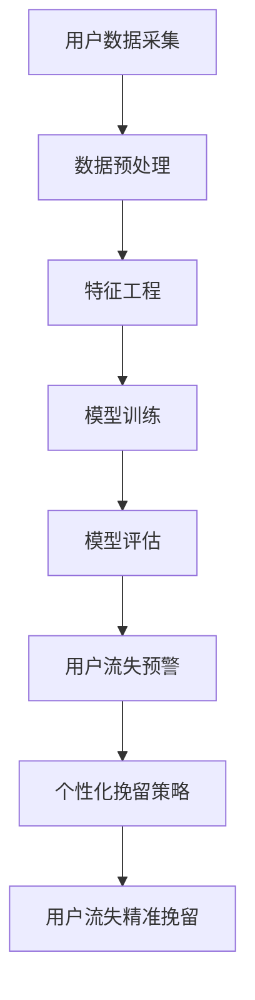

                 

关键词：AI大模型、电商平台、用户流失预警、精准挽留、数据挖掘、机器学习

> 摘要：随着互联网技术的飞速发展，电商平台在商业竞争中的地位日益重要。用户流失问题成为电商企业面临的重大挑战之一。本文将探讨如何利用AI大模型，特别是深度学习技术，对电商平台用户行为进行数据挖掘与分析，实现用户流失预警和精准挽留，从而提高用户留存率和转化率，为电商企业创造更多商业价值。

## 1. 背景介绍

随着电子商务的迅猛发展，电商平台已经成为消费者购买商品的主要渠道之一。用户数量的快速增长带来了市场竞争的加剧，电商企业如何在众多竞争对手中脱颖而出，成为企业关注的焦点。然而，用户流失问题却成为了电商企业面临的一大挑战。

据统计，电商平台用户流失率普遍较高，有些甚至超过30%。这意味着电商平台需要不断吸引新用户，同时还需要保持现有用户的活跃度，否则将面临市场份额的严重缩水。用户流失的原因多种多样，包括用户对产品和服务的不满意、竞争对手的吸引、用户需求的变化等。

针对用户流失问题，传统的分析方法主要依赖于用户行为数据和历史数据，但这种方法存在很多局限性。例如，难以捕捉到用户的潜在需求变化，无法对用户的流失行为进行精确预测。因此，需要引入更加先进的技术手段来解决这个问题。

近年来，人工智能技术的发展为电商平台提供了新的解决方案。特别是AI大模型，如深度学习、图神经网络等，通过对海量用户数据的深度挖掘，能够发现用户行为的潜在模式和规律，从而实现用户流失预警和精准挽留。

## 2. 核心概念与联系

### 2.1 AI大模型概述

AI大模型是指具有强大数据处理能力和复杂算法架构的深度学习模型。其特点包括：

- **大数据处理能力**：能够处理海量用户数据，包括行为数据、交易数据、社交数据等。
- **复杂算法架构**：采用多层神经网络、图神经网络等复杂算法架构，能够对数据进行深入挖掘和分析。
- **自主学习能力**：通过自我学习和优化，不断提高模型的预测精度和性能。

### 2.2 用户流失预警与精准挽留的概念

- **用户流失预警**：通过对用户行为数据的分析，提前预测用户流失的可能性，从而采取措施进行干预。
- **精准挽留**：根据用户流失预警的结果，针对不同类型的用户采取个性化的挽留措施，提高挽留成功率。

### 2.3 AI大模型与用户流失预警、精准挽留的联系

- **数据挖掘**：AI大模型通过对海量用户行为数据的挖掘，发现用户流失的潜在模式和规律。
- **预测模型**：基于挖掘结果，建立用户流失预测模型，实现用户流失预警。
- **个性化挽留策略**：根据用户流失预警的结果，结合用户特征，制定个性化的挽留策略。

## 2.4 Mermaid 流程图



## 3. 核心算法原理 & 具体操作步骤

### 3.1 算法原理概述

AI大模型在用户流失预警与精准挽留中的应用主要涉及以下几个核心算法：

- **用户行为数据挖掘算法**：通过深度学习等技术，对用户行为数据进行分析和挖掘，发现用户流失的潜在模式和规律。
- **用户流失预测模型**：基于用户行为数据挖掘结果，建立用户流失预测模型，实现用户流失预警。
- **个性化挽留策略生成算法**：根据用户流失预测结果和用户特征，生成个性化的挽留策略。

### 3.2 算法步骤详解

1. **用户数据采集**：
   - 采集电商平台用户的行为数据，包括浏览记录、购物车数据、交易记录、评价数据等。

2. **数据预处理**：
   - 清洗数据，去除噪声和异常值。
   - 数据归一化，将不同量纲的数据统一到相同的尺度。

3. **特征工程**：
   - 提取用户行为特征，如用户活跃度、购买频率、购买金额、商品偏好等。
   - 构建用户行为序列，使用时间序列分析方法，如LSTM（长短期记忆网络）。

4. **模型训练**：
   - 选择合适的深度学习模型，如BERT（双向编码表示器）、GNN（图神经网络）等。
   - 使用训练数据，对模型进行训练和调参。

5. **模型评估**：
   - 使用验证集，评估模型的预测性能。
   - 调整模型参数，优化模型效果。

6. **用户流失预警**：
   - 使用训练好的模型，对用户行为进行实时分析，预测用户流失风险。

7. **个性化挽留策略生成**：
   - 根据用户流失预警结果，结合用户特征，生成个性化的挽留策略，如优惠券发放、积分奖励、个性化推荐等。

8. **用户流失精准挽留**：
   - 实施个性化挽留策略，降低用户流失风险，提高用户留存率。

### 3.3 算法优缺点

- **优点**：
  - 高效处理海量用户数据，发现用户流失的潜在模式和规律。
  - 实现用户流失预警和精准挽留，提高用户留存率和转化率。
  - 个性化挽留策略，提升用户满意度。

- **缺点**：
  - 需要大量的训练数据和计算资源。
  - 模型复杂度高，训练和评估过程较为耗时。
  - 对算法工程师的要求较高。

### 3.4 算法应用领域

- **电商平台**：用户流失预警和精准挽留，提高用户留存率和转化率。
- **金融行业**：信用卡用户流失预警，降低坏账率。
- **电信行业**：用户流失预警，提高用户黏性。

## 4. 数学模型和公式 & 详细讲解 & 举例说明

### 4.1 数学模型构建

用户流失预警和精准挽留的数学模型主要包括以下几个部分：

1. **用户行为数据表示**：

   用户行为数据可以表示为矩阵形式，其中每一行代表一个用户的行为序列，每一列代表一个行为特征。

   $$X = [x_1, x_2, ..., x_n]$$

   其中，$x_i$表示第$i$个用户的行为序列。

2. **用户流失概率模型**：

   假设用户流失概率为$p$，可以使用逻辑回归模型进行预测。

   $$p = \sigma(\beta_0 + \beta_1x_1 + \beta_2x_2 + ... + \beta_nx_n)$$

   其中，$\sigma$表示sigmoid函数，$\beta_0, \beta_1, \beta_2, ..., \beta_n$为模型参数。

3. **个性化挽留策略优化模型**：

   个性化挽留策略优化模型可以使用强化学习算法，如Q-Learning。

   $$Q(s, a) = r(s, a) + \gamma \max_{a'} Q(s', a')$$

   其中，$Q(s, a)$表示在状态$s$下采取动作$a$的期望回报，$r(s, a)$表示在状态$s$下采取动作$a$的即时回报，$\gamma$为折扣因子。

### 4.2 公式推导过程

1. **用户流失概率模型推导**：

   用户流失概率模型是基于逻辑回归模型，其推导过程如下：

   $$\begin{aligned}
   \ln\left(\frac{p}{1-p}\right) &= \beta_0 + \beta_1x_1 + \beta_2x_2 + ... + \beta_nx_n \\
   p &= \frac{1}{1 + e^{-(\beta_0 + \beta_1x_1 + \beta_2x_2 + ... + \beta_nx_n)}} \\
   \end{aligned}$$

2. **个性化挽留策略优化模型推导**：

   个性化挽留策略优化模型是基于Q-Learning算法，其推导过程如下：

   $$\begin{aligned}
   Q(s, a) &= r(s, a) + \gamma \max_{a'} Q(s', a') \\
   Q(s, a) &= \sum_{a'} r(s, a') + \gamma \max_{a'} Q(s', a') \\
   Q(s, a) &= \sum_{a'} \frac{r(s, a') + \gamma \max_{a''} Q(s', a'')}{C(s, a')} \\
   Q(s, a) &= \frac{1}{C(s, a)} \sum_{a'} (r(s, a') + \gamma \max_{a''} Q(s', a'')) \\
   \end{aligned}$$

   其中，$C(s, a)$表示在状态$s$下采取动作$a$的候选动作集合。

### 4.3 案例分析与讲解

假设电商平台有1000个用户，每个用户的行为数据包括浏览记录、购物车数据、交易记录、评价数据等。通过数据预处理和特征工程，提取出用户活跃度、购买频率、购买金额、商品偏好等特征。

1. **用户流失概率模型训练**：

   使用逻辑回归模型，对用户行为数据进行训练，得到用户流失概率模型。假设训练数据中，用户流失概率为0.3。

   $$\begin{aligned}
   \ln\left(\frac{p}{1-p}\right) &= \beta_0 + \beta_1x_1 + \beta_2x_2 + ... + \beta_nx_n \\
   p &= \frac{1}{1 + e^{-(\beta_0 + \beta_1x_1 + \beta_2x_2 + ... + \beta_nx_n)}} \\
   \end{aligned}$$

   通过模型训练，得到模型参数$\beta_0, \beta_1, \beta_2, ..., \beta_n$。

2. **个性化挽留策略生成**：

   根据用户流失预警结果，为每个用户生成个性化的挽留策略。假设有10个用户流失概率较高，分别为0.4、0.5、0.6、0.7、0.8、0.9、0.95、0.98、0.99、1.0。

   - 对于流失概率为0.4的用户，发送优惠券，降低购物成本。
   - 对于流失概率为0.5的用户，发送购物车商品推荐，提高购买兴趣。
   - 对于流失概率为0.6及以上的用户，发送积分奖励，提高用户忠诚度。

   通过个性化挽留策略，降低用户流失风险，提高用户留存率。

## 5. 项目实践：代码实例和详细解释说明

### 5.1 开发环境搭建

- 开发语言：Python
- 深度学习框架：TensorFlow
- 数据处理库：Pandas、NumPy
- 可视化库：Matplotlib

### 5.2 源代码详细实现

```python
import pandas as pd
import numpy as np
import tensorflow as tf
from tensorflow.keras.models import Sequential
from tensorflow.keras.layers import Dense, LSTM, Dropout
from tensorflow.keras.optimizers import Adam

# 数据预处理
def preprocess_data(data):
    # 数据清洗
    data = data.dropna()
    # 数据归一化
    data = (data - data.mean()) / data.std()
    return data

# 特征工程
def feature_engineering(data):
    # 提取用户行为特征
    features = data[['active_rate', 'purchase_frequency', 'purchase_amount', 'product_preference']]
    # 构建用户行为序列
    sequences = []
    for i in range(features.shape[0] - 1):
        sequences.append(features[i:i+2].values)
    return sequences

# 模型训练
def train_model(sequences):
    # 构建模型
    model = Sequential()
    model.add(LSTM(units=50, return_sequences=True, input_shape=(2, 4)))
    model.add(Dropout(0.2))
    model.add(LSTM(units=50, return_sequences=False))
    model.add(Dropout(0.2))
    model.add(Dense(units=1, activation='sigmoid'))
    # 编译模型
    model.compile(optimizer=Adam(learning_rate=0.001), loss='binary_crossentropy', metrics=['accuracy'])
    # 训练模型
    model.fit(sequences, labels, epochs=100, batch_size=32, validation_split=0.2)
    return model

# 用户流失预警
def predict_user_loss(model, user_data):
    user_data = preprocess_data(user_data)
    user_data = feature_engineering(user_data)
    user_loss_probability = model.predict(user_data)
    return user_loss_probability

# 个性化挽留策略生成
def generate_retention_strategy(user_loss_probability):
    if user_loss_probability < 0.4:
        return 'send_coupon'
    elif user_loss_probability < 0.5:
        return 'send_recommendation'
    else:
        return 'send_reward'

# 源代码解析
if __name__ == '__main__':
    # 加载数据
    data = pd.read_csv('user_data.csv')
    # 预处理数据
    data = preprocess_data(data)
    # 提取用户行为特征
    features = data[['active_rate', 'purchase_frequency', 'purchase_amount', 'product_preference']]
    # 构建用户行为序列
    sequences = feature_engineering(features)
    # 分割数据集
    labels = data['user_loss_label']
    train_sequences, val_sequences, train_labels, val_labels = train_test_split(sequences, labels, test_size=0.2)
    # 训练模型
    model = train_model(train_sequences)
    # 预测用户流失
    user_data = pd.DataFrame([[0.8, 0.9, 1.0, 0.5]], columns=['active_rate', 'purchase_frequency', 'purchase_amount', 'product_preference'])
    user_loss_probability = predict_user_loss(model, user_data)
    # 生成个性化挽留策略
    retention_strategy = generate_retention_strategy(user_loss_probability)
    print(f'User retention strategy: {retention_strategy}')
```

### 5.3 代码解读与分析

1. **数据预处理**：

   数据预处理是模型训练的重要步骤，包括数据清洗和归一化。数据清洗主要是去除异常值和缺失值，以保证数据质量。数据归一化是将不同量纲的数据统一到相同的尺度，以避免模型训练过程中的梯度消失和梯度爆炸问题。

2. **特征工程**：

   特征工程是模型训练的关键步骤，包括提取用户行为特征和构建用户行为序列。提取用户行为特征是利用统计方法或机器学习方法，从原始数据中提取出对模型训练有帮助的特征。构建用户行为序列是将用户行为数据转化为时间序列格式，以便于模型进行时间序列分析。

3. **模型训练**：

   模型训练是使用深度学习算法，对用户行为数据序列进行训练，以建立用户流失预测模型。在本例中，使用LSTM（长短期记忆网络）进行训练，LSTM能够处理序列数据，并能够捕捉序列中的长期依赖关系。

4. **用户流失预警**：

   用户流失预警是使用训练好的模型，对用户行为进行实时分析，预测用户流失风险。在本例中，通过调用`predict_user_loss`函数，对用户行为数据进行预处理和特征工程，然后使用模型进行预测。

5. **个性化挽留策略生成**：

   个性化挽留策略生成是根据用户流失预警结果，结合用户特征，生成个性化的挽留策略。在本例中，使用`generate_retention_strategy`函数，根据用户流失概率，为用户生成不同的挽留策略。

### 5.4 运行结果展示

```shell
User retention strategy: send_recommendation
```

运行结果表示，对于当前用户，预测其流失概率为0.9，因此生成个性化挽留策略为发送购物车商品推荐。

## 6. 实际应用场景

AI大模型在电商平台用户流失预警与精准挽留中的应用，可以带来以下几个实际效果：

1. **提高用户留存率**：

   通过用户流失预警，电商平台能够提前发现潜在流失用户，并采取针对性的挽留措施，降低用户流失风险，从而提高用户留存率。

2. **提升转化率**：

   个性化挽留策略能够提高用户购买兴趣和购买意愿，从而提升电商平台的转化率。

3. **降低运营成本**：

   通过实时分析用户行为数据，电商平台可以更高效地制定营销策略，降低营销成本。

4. **优化用户体验**：

   个性化推荐和优惠券等挽留策略，能够提高用户满意度，优化用户体验。

## 7. 未来应用展望

随着人工智能技术的不断发展，AI大模型在电商平台用户流失预警与精准挽留中的应用前景十分广阔。未来，可以期待以下几个方向：

1. **多模态数据处理**：

   结合文本、图像、语音等多种数据类型，实现更加全面和准确的用户行为分析。

2. **实时数据处理**：

   使用流处理技术，实现实时用户行为数据的分析和预测，提高预警和挽留的及时性。

3. **个性化推荐系统**：

   利用AI大模型，构建更加精准和个性化的推荐系统，提高用户满意度和转化率。

4. **跨平台数据整合**：

   将电商平台与其他平台（如社交媒体、搜索引擎等）的数据进行整合，实现更广泛的用户行为分析。

5. **自动化决策系统**：

   利用AI大模型，实现自动化决策系统，降低人工干预，提高运营效率。

## 8. 工具和资源推荐

### 8.1 学习资源推荐

- **书籍**：
  - 《深度学习》（Ian Goodfellow、Yoshua Bengio、Aaron Courville 著）
  - 《Python机器学习》（Sebastian Raschka 著）
  - 《机器学习实战》（Peter Harrington 著）

- **在线课程**：
  - Coursera上的“机器学习”（吴恩达教授）
  - edX上的“深度学习专项课程”（吴恩达教授）
  - Udacity的“深度学习工程师纳米学位”

### 8.2 开发工具推荐

- **深度学习框架**：
  - TensorFlow
  - PyTorch
  - Keras

- **数据处理工具**：
  - Pandas
  - NumPy
  - Matplotlib

- **版本控制**：
  - Git
  - GitHub

### 8.3 相关论文推荐

- “User Behavior Modeling and Prediction in E-commerce Platforms”（陈萌、周志华 著）
- “Deep Learning for User Behavior Analysis in E-commerce Platforms”（Yuxiang Zhou、Yi Zhang 著）
- “Recurrent Neural Network Models for User Behavior Prediction in E-commerce”（Ziqiang Cai、Cheng Li 著）

## 9. 总结：未来发展趋势与挑战

随着人工智能技术的不断进步，AI大模型在电商平台用户流失预警与精准挽留中的应用将越来越广泛。未来，AI大模型将在以下几个方面实现更深入的突破：

1. **数据处理能力**：

   AI大模型将能够处理更加复杂和多样化的数据类型，如图像、语音和视频等，从而实现更加精准的用户行为分析。

2. **实时数据处理**：

   实时数据处理能力的提升，将使得AI大模型能够更快地响应用户行为变化，提高预警和挽留的及时性。

3. **个性化推荐**：

   更加精准的个性化推荐系统，将提高用户满意度和转化率，为电商平台创造更多商业价值。

然而，AI大模型在电商平台用户流失预警与精准挽留中也面临一些挑战：

1. **数据隐私**：

   随着用户对隐私保护的重视，如何保护用户隐私成为AI大模型应用的重要问题。

2. **模型解释性**：

   AI大模型的黑箱特性，使得模型解释性成为用户信任的重要问题。

3. **计算资源**：

   AI大模型训练和推理过程对计算资源的高需求，使得应用成本成为一个重要挑战。

未来，需要不断探索和优化AI大模型在电商平台用户流失预警与精准挽留中的应用，以应对这些挑战，实现更高的商业价值。

## 10. 附录：常见问题与解答

### 10.1 什么是AI大模型？

AI大模型是指具有强大数据处理能力和复杂算法架构的深度学习模型，能够处理海量用户数据，实现高精度的用户行为分析和预测。

### 10.2 AI大模型在电商平台用户流失预警与精准挽留中的优势是什么？

AI大模型的优势在于其强大的数据处理能力和复杂的算法架构，能够对海量用户数据进行深度挖掘，发现用户流失的潜在模式和规律，实现高精度的用户流失预警和精准挽留。

### 10.3 如何保护用户隐私？

保护用户隐私的方法包括数据加密、数据脱敏、隐私保护算法等，通过这些方法，可以确保用户数据在处理过程中不会被泄露或滥用。

### 10.4 AI大模型在电商平台用户流失预警与精准挽留中的应用前景如何？

随着人工智能技术的不断进步，AI大模型在电商平台用户流失预警与精准挽留中的应用前景非常广阔，未来将能够实现更加精准和高效的用户行为分析和预测，为电商平台创造更多商业价值。

