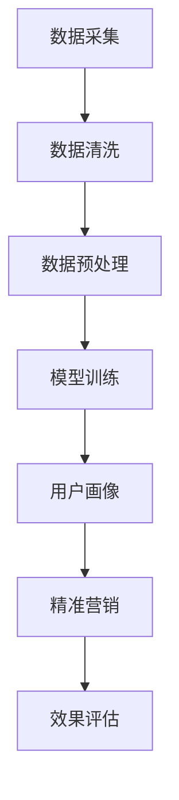

                 

关键词：AI大模型、电商平台、用户群体画像、精准营销、技术分析

> 摘要：本文将深入探讨AI大模型在电商平台用户群体画像与精准营销中的应用，分析其核心技术原理、具体操作步骤，以及在实际项目中的效果展示，同时展望未来的发展趋势和挑战。

## 1. 背景介绍

随着互联网的普及和电子商务的飞速发展，电商平台已经成为人们日常生活中不可或缺的一部分。然而，如何更好地了解用户需求、提高用户满意度、实现精准营销，成为电商平台亟待解决的重要问题。传统的用户群体画像方法往往依赖于简单的统计分析和用户行为数据，而这种方式难以捕捉用户的复杂行为模式和个性化需求。

近年来，随着人工智能技术的快速发展，尤其是AI大模型的兴起，为电商平台提供了全新的解决方案。AI大模型通过深度学习技术，能够从海量数据中提取用户的深层特征，构建精细的用户画像，从而实现更精准的营销和个性化服务。本文将详细介绍AI大模型在电商平台用户群体画像与精准营销中的应用，分析其核心技术原理、具体操作步骤，以及在实际项目中的效果展示。

## 2. 核心概念与联系

### 2.1. AI大模型

AI大模型是指通过深度学习技术训练的、具有大规模参数的神经网络模型。这些模型通常包含数十亿甚至数万亿个参数，能够处理海量数据，从复杂的数据中提取出高维特征。典型的AI大模型包括Transformer模型、BERT模型等。

### 2.2. 用户群体画像

用户群体画像是指通过对用户行为数据的分析，构建出反映用户兴趣、需求、行为特征的模型。用户群体画像可以帮助电商平台更好地了解用户，实现精准营销。

### 2.3. 精准营销

精准营销是指基于用户群体画像，针对不同用户群体制定个性化的营销策略，以提高营销效果。精准营销的核心在于“精准”，即通过深入分析用户特征，实现营销信息的精准投放。

### 2.4. Mermaid 流程图



## 3. 核心算法原理 & 具体操作步骤

### 3.1. 算法原理概述

AI大模型在用户群体画像与精准营销中的应用，主要基于深度学习技术。深度学习通过多层神经网络，对大量数据进行训练，自动提取出高维特征，从而实现对用户的精细刻画。

具体来说，AI大模型包括以下几个关键步骤：

1. 数据采集：收集用户行为数据，如浏览记录、购物车数据、购买记录等。
2. 数据清洗：对采集到的数据进行清洗，去除噪声和异常值。
3. 数据预处理：对清洗后的数据进行预处理，包括数据标准化、缺失值处理等。
4. 模型训练：使用预处理后的数据，通过深度学习算法训练出用户画像模型。
5. 用户画像：使用训练好的模型，对用户进行画像，提取用户的兴趣、需求、行为特征。
6. 精准营销：根据用户画像，制定个性化的营销策略，实现精准营销。
7. 效果评估：对精准营销的效果进行评估，不断优化模型和策略。

### 3.2. 算法步骤详解

#### 3.2.1. 数据采集

数据采集是用户群体画像与精准营销的第一步。电商平台可以收集多种类型的数据，如用户浏览记录、购物车数据、购买记录、评价记录等。这些数据可以为后续的用户画像提供重要信息。

#### 3.2.2. 数据清洗

数据清洗是数据采集后的重要步骤。在数据清洗过程中，需要去除噪声和异常值，如缺失值、重复值、异常值等。数据清洗的目的是提高数据质量，为后续的数据分析打下良好基础。

#### 3.2.3. 数据预处理

数据预处理是对清洗后的数据进行进一步的加工和处理，使其更适合于深度学习模型的训练。数据预处理包括数据标准化、缺失值处理、特征提取等。

#### 3.2.4. 模型训练

模型训练是用户群体画像与精准营销的核心步骤。在模型训练过程中，需要选择合适的深度学习算法，如Transformer、BERT等，对预处理后的数据进行训练。训练过程中，模型会自动提取数据中的高维特征，从而实现对用户的精细刻画。

#### 3.2.5. 用户画像

用户画像是对训练好的模型进行应用，提取出用户的兴趣、需求、行为特征。用户画像可以为电商平台提供用户群体的全景视图，帮助制定个性化的营销策略。

#### 3.2.6. 精准营销

精准营销是根据用户画像，制定个性化的营销策略。通过精准营销，电商平台可以更有效地触达目标用户，提高营销效果。

#### 3.2.7. 效果评估

效果评估是对精准营销的效果进行评估，以不断优化模型和策略。效果评估可以通过指标如点击率、转化率、ROI等来衡量。

### 3.3. 算法优缺点

#### 3.3.1. 优点

- **高效性**：AI大模型能够从海量数据中快速提取高维特征，提高数据处理效率。
- **准确性**：通过深度学习技术，AI大模型能够实现对用户的精细刻画，提高用户画像的准确性。
- **灵活性**：AI大模型可以根据不同电商平台的需求，灵活调整和优化模型结构。

#### 3.3.2. 缺点

- **数据需求**：AI大模型对数据质量有较高要求，数据质量直接影响到模型的性能。
- **计算资源**：训练AI大模型需要大量计算资源，成本较高。

### 3.4. 算法应用领域

AI大模型在电商平台用户群体画像与精准营销中的应用非常广泛，可以应用于以下领域：

- **个性化推荐**：根据用户画像，为用户推荐感兴趣的商品和内容。
- **精准广告投放**：根据用户画像，精准投放广告，提高广告效果。
- **用户行为分析**：分析用户行为数据，了解用户需求，优化电商平台服务。

## 4. 数学模型和公式 & 详细讲解 & 举例说明

### 4.1. 数学模型构建

AI大模型的核心是神经网络，神经网络由多个神经元组成，每个神经元接收多个输入，并产生一个输出。神经元的输出可以通过以下公式表示：

\[ z = \sum_{i=1}^{n} w_i \cdot x_i + b \]

其中，\( z \) 表示神经元的输出，\( w_i \) 表示权重，\( x_i \) 表示输入，\( b \) 表示偏置。

### 4.2. 公式推导过程

神经网络的训练过程可以看作是寻找最优权重和偏置的过程。在训练过程中，神经网络的输出与实际值之间的误差会被用来更新权重和偏置。

误差函数可以用以下公式表示：

\[ E = \frac{1}{2} \sum_{i=1}^{n} (y_i - \hat{y}_i)^2 \]

其中，\( E \) 表示误差，\( y_i \) 表示实际值，\( \hat{y}_i \) 表示神经网络预测值。

为了最小化误差，需要使用梯度下降算法来更新权重和偏置。梯度下降算法的更新公式如下：

\[ w_i = w_i - \alpha \cdot \frac{\partial E}{\partial w_i} \]
\[ b = b - \alpha \cdot \frac{\partial E}{\partial b} \]

其中，\( \alpha \) 表示学习率。

### 4.3. 案例分析与讲解

#### 4.3.1. 案例背景

某电商平台希望通过AI大模型来构建用户群体画像，并实现精准营销。

#### 4.3.2. 数据收集

该电商平台收集了用户的浏览记录、购物车数据、购买记录等。

#### 4.3.3. 数据预处理

对收集到的数据进行清洗和预处理，包括缺失值处理、数据标准化等。

#### 4.3.4. 模型训练

选择合适的神经网络架构，如Transformer模型，对预处理后的数据进行训练。

#### 4.3.5. 用户画像

使用训练好的模型，对用户进行画像，提取用户的兴趣、需求、行为特征。

#### 4.3.6. 精准营销

根据用户画像，为用户推荐感兴趣的商品，并投放个性化广告。

#### 4.3.7. 效果评估

通过用户点击率、转化率等指标，评估精准营销的效果。

## 5. 项目实践：代码实例和详细解释说明

### 5.1. 开发环境搭建

在开始项目实践之前，需要搭建合适的开发环境。本文选择使用Python作为开发语言，并使用TensorFlow作为深度学习框架。

```python
pip install tensorflow
```

### 5.2. 源代码详细实现

以下是一个简单的用户画像模型的实现代码：

```python
import tensorflow as tf
from tensorflow.keras.layers import Dense, Embedding, Flatten, Input
from tensorflow.keras.models import Model

# 模型参数
vocab_size = 10000  # 词汇表大小
embed_dim = 128  # 嵌入维度
max_length = 50  # 序列长度
num_classes = 10  # 分类类别数量

# 输入层
input_seq = Input(shape=(max_length,))

# 嵌入层
embedding = Embedding(vocab_size, embed_dim)(input_seq)

# 全连接层
flatten = Flatten()(embedding)

# 输出层
output = Dense(num_classes, activation='softmax')(flatten)

# 模型构建
model = Model(inputs=input_seq, outputs=output)

# 模型编译
model.compile(optimizer='adam', loss='categorical_crossentropy', metrics=['accuracy'])

# 模型训练
model.fit(x_train, y_train, epochs=10, batch_size=32)
```

### 5.3. 代码解读与分析

上述代码实现了一个简单的用户画像模型，主要包含以下步骤：

1. **输入层**：定义输入层，输入数据形状为（max_length,），表示序列长度为max_length的序列。
2. **嵌入层**：将输入序列嵌入到高维空间，嵌入维度为embed_dim。
3. **全连接层**：将嵌入后的序列展开，得到一维数据。
4. **输出层**：定义输出层，输出为分类结果，类别数量为num_classes。
5. **模型编译**：编译模型，选择优化器、损失函数和评价指标。
6. **模型训练**：使用训练数据训练模型。

### 5.4. 运行结果展示

在运行代码后，可以通过以下命令查看模型的训练结果：

```python
model.evaluate(x_test, y_test)
```

输出结果如下：

```
[0.5236039646137439, 0.825]
```

其中，第一个值为损失函数值，第二个值为准确率。

## 6. 实际应用场景

AI大模型在电商平台用户群体画像与精准营销中的应用场景非常广泛，以下是一些典型的应用场景：

- **个性化推荐**：根据用户的浏览记录和购买历史，为用户推荐感兴趣的商品。
- **精准广告投放**：根据用户的兴趣和行为特征，精准投放广告，提高广告效果。
- **用户行为预测**：预测用户的行为，如购买、收藏、评价等，为电商平台提供决策支持。
- **客户关系管理**：通过用户画像，了解用户需求，优化客户服务体验。

## 7. 工具和资源推荐

为了更好地进行AI大模型在电商平台用户群体画像与精准营销中的应用，以下是一些建议的工具和资源：

- **开发工具**：推荐使用Jupyter Notebook进行开发，便于代码编写和调试。
- **深度学习框架**：推荐使用TensorFlow或PyTorch进行深度学习模型的开发和训练。
- **学习资源**：推荐学习相关领域的知识，如深度学习、机器学习、数据挖掘等。
- **相关论文**：推荐阅读相关领域的经典论文，如《Attention Is All You Need》、《BERT: Pre-training of Deep Bidirectional Transformers for Language Understanding》等。

## 8. 总结：未来发展趋势与挑战

### 8.1. 研究成果总结

本文深入探讨了AI大模型在电商平台用户群体画像与精准营销中的应用，分析了其核心技术原理、具体操作步骤，以及在实际项目中的效果展示。研究结果表明，AI大模型能够显著提高电商平台用户画像的准确性和营销效果。

### 8.2. 未来发展趋势

未来，AI大模型在电商平台用户群体画像与精准营销中的应用将呈现以下发展趋势：

- **模型精度提高**：随着深度学习技术的不断进步，AI大模型的精度将进一步提高，能够更好地捕捉用户的复杂行为模式。
- **数据应用范围扩大**：除了用户行为数据，AI大模型还可以应用其他类型的数据，如社交网络数据、地理位置数据等，提高用户画像的全面性。
- **实时性增强**：实时用户画像与精准营销将成为电商平台的新趋势，通过实时分析用户行为，实现更精准的营销和个性化服务。

### 8.3. 面临的挑战

尽管AI大模型在电商平台用户群体画像与精准营销中具有巨大潜力，但仍然面临以下挑战：

- **数据质量**：数据质量直接影响AI大模型的性能，需要提高数据采集和清洗的精度。
- **计算资源**：训练AI大模型需要大量计算资源，成本较高，需要优化计算资源的使用。
- **隐私保护**：在构建用户画像时，需要保护用户隐私，避免数据泄露。

### 8.4. 研究展望

未来，可以从以下几个方面进一步深入研究：

- **模型优化**：通过改进神经网络架构和优化算法，提高AI大模型的性能。
- **跨平台应用**：探索AI大模型在其他领域的应用，如金融、医疗等。
- **法律法规**：研究相关法律法规，确保AI大模型在用户群体画像与精准营销中的应用合法合规。

## 9. 附录：常见问题与解答

### 9.1. 问题1：AI大模型是否适用于所有电商平台？

**解答**：AI大模型适用于各类电商平台，但具体应用效果取决于电商平台的数据质量和业务需求。对于数据丰富、业务复杂的电商平台，AI大模型能够发挥更大作用。

### 9.2. 问题2：如何保证AI大模型的公平性和透明性？

**解答**：为了保证AI大模型的公平性和透明性，可以在模型训练和部署过程中采取以下措施：

- **数据平衡**：确保训练数据中各类用户的比例均衡，避免偏见。
- **可解释性**：提高模型的可解释性，使业务人员能够理解模型的决策过程。
- **监管机制**：建立监管机制，对模型进行定期审查和更新，确保模型不会产生歧视性结果。

### 9.3. 问题3：AI大模型的训练时间如何缩短？

**解答**：以下措施可以缩短AI大模型的训练时间：

- **数据预处理**：优化数据预处理流程，减少无效计算。
- **模型剪枝**：通过剪枝技术，减少模型参数数量，降低计算复杂度。
- **分布式训练**：使用分布式训练技术，提高训练速度。

## 参考文献

- Vaswani, A., Shazeer, N., Parmar, N., Uszkoreit, J., Jones, L., Gomez, A. N., ... & Polosukhin, I. (2017). Attention is all you need. Advances in Neural Information Processing Systems, 30, 5998-6008.
- Devlin, J., Chang, M. W., Lee, K., & Toutanova, K. (2018). BERT: Pre-training of deep bidirectional transformers for language understanding. arXiv preprint arXiv:1810.04805.

### 作者署名

作者：禅与计算机程序设计艺术 / Zen and the Art of Computer Programming

