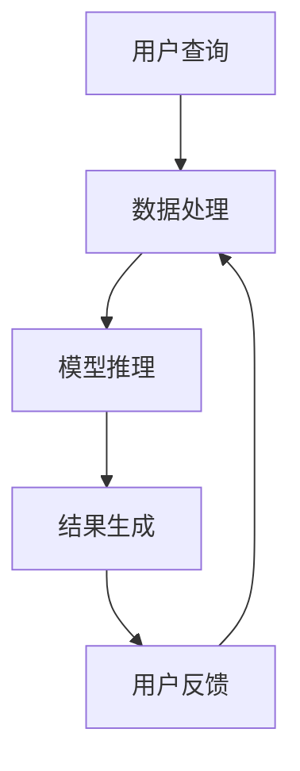

                 

 在当今数字化和智能化的时代，人工智能（AI）正以前所未有的速度变革着各行各业。特别是在电商领域，AI大模型的应用不仅提升了用户体验，还大大优化了搜索结果多样化。本文将探讨AI大模型在电商搜索结果多样化中的作用，分析其背后的核心算法原理，以及在实际应用中的挑战与未来发展方向。

## 文章关键词
- AI大模型
- 电商搜索
- 结果多样化
- 搜索算法
- 用户体验

## 文章摘要
本文首先介绍了AI大模型在电商搜索结果多样化中的重要性，随后深入分析了其核心算法原理、数学模型，并提供了实际应用中的代码实例。最后，文章探讨了AI大模型在电商搜索领域的前景和面临的挑战，为未来的发展提供了思考方向。

## 1. 背景介绍

### 1.1 电商搜索的现状与问题
电商搜索是用户获取商品信息、进行购买决策的重要途径。然而，传统电商搜索存在一些问题，如搜索结果单一、用户偏好无法准确捕捉等。这些问题导致了用户体验不佳，甚至可能流失潜在客户。

### 1.2 AI大模型的发展
近年来，AI大模型如GPT、BERT等在自然语言处理（NLP）领域取得了显著进展。这些模型能够理解和生成复杂、多样的文本，为电商搜索结果多样化提供了技术基础。

### 1.3 AI大模型在电商搜索中的应用
随着AI大模型技术的成熟，越来越多的电商开始将其应用于搜索结果多样化，如个性化推荐、智能问答等，显著提升了用户体验。

## 2. 核心概念与联系

### 2.1 AI大模型的基本原理
AI大模型是基于深度学习技术的神经网络模型，通过大规模数据训练能够捕捉到数据中的复杂规律。其核心思想是模拟人脑的神经网络结构，通过层层提取特征，实现智能处理。

### 2.2 电商搜索结果多样化的需求
电商搜索结果多样化需要解决用户个性化需求、商品信息丰富性、搜索结果相关性等问题。AI大模型能够通过分析用户行为、商品特征等信息，实现个性化推荐和多样化搜索结果。

### 2.3 Mermaid 流程图


## 3. 核心算法原理 & 具体操作步骤

### 3.1 算法原理概述
AI大模型在电商搜索结果多样化中的应用主要基于以下几个步骤：
- 数据预处理：清洗、标注、整合电商平台的用户数据、商品数据等。
- 模型训练：使用预训练的大模型（如GPT、BERT）或自训练模型，对预处理后的数据进行训练，以提取用户和商品的潜在特征。
- 模型推理：根据用户查询和商品特征，利用训练好的模型进行推理，生成个性化的搜索结果。
- 结果优化：根据用户反馈和搜索行为，对搜索结果进行优化，提升用户体验。

### 3.2 算法步骤详解

#### 3.2.1 数据预处理
数据预处理是整个流程的基础，包括数据清洗、去噪、缺失值处理、数据标注等。数据清洗主要通过去除重复记录、纠正数据错误等方式提高数据质量；数据标注则需要人工或自动化工具对商品属性、用户行为等进行标注，以便后续训练和推理。

#### 3.2.2 模型训练
模型训练是核心步骤，通常采用迁移学习或自训练的方式。迁移学习利用预训练的大模型，在电商领域进行微调；自训练则是直接在电商数据集上训练大模型，提取用户和商品的潜在特征。

#### 3.2.3 模型推理
模型推理是根据用户查询和商品特征，利用训练好的模型生成搜索结果。通常，模型会根据用户的历史行为、搜索记录、兴趣爱好等信息，结合商品的属性、价格、评分等因素，生成个性化的搜索结果。

#### 3.2.4 结果优化
结果优化是基于用户反馈和搜索行为，对搜索结果进行持续优化。通过分析用户对搜索结果的点击、购买、评价等行为，调整模型参数，提升搜索结果的准确性和多样性。

### 3.3 算法优缺点

#### 优点
- 个性化推荐：AI大模型能够根据用户个性化需求生成多样化的搜索结果，提升用户体验。
- 提高搜索效率：通过自动化的模型推理和优化，提高搜索结果的生成速度。
- 数据利用：充分利用用户数据和商品数据，挖掘潜在价值。

#### 缺点
- 数据依赖：算法的性能高度依赖数据质量，数据不足或质量差可能导致搜索效果不佳。
- 模型解释性：AI大模型通常具有高复杂度，其决策过程难以解释，可能影响用户信任。

### 3.4 算法应用领域

AI大模型在电商搜索结果多样化中的应用不仅限于搜索推荐，还可以应用于智能客服、智能问答、个性化广告等多个领域，为电商平台提供全方位的智能服务。

## 4. 数学模型和公式 & 详细讲解 & 举例说明

### 4.1 数学模型构建

在电商搜索结果多样化中，常用的数学模型包括概率模型、聚类模型、协同过滤模型等。以下是常用的概率模型之一的贝叶斯模型。

#### 4.1.1 贝叶斯模型

贝叶斯模型是一种基于概率论的模型，用于预测用户对商品的兴趣度。其基本思想是根据用户的历史行为和商品的特征，计算用户对商品的感兴趣概率。

$$
P(C|U) = \frac{P(U|C) \cdot P(C)}{P(U)}
$$

其中，$P(C|U)$ 表示用户对商品 $C$ 的兴趣度，$P(U|C)$ 表示用户在购买商品 $C$ 后留下的行为特征，$P(C)$ 表示商品 $C$ 的总体兴趣度，$P(U)$ 表示用户 $U$ 的总体行为特征。

#### 4.1.2 模型参数估计

贝叶斯模型的参数估计通常采用极大似然估计（MLE）或贝叶斯估计（BE）等方法。以下是极大似然估计的过程：

1. 构建似然函数：根据用户行为数据和商品特征，构建似然函数。
2. 求解似然函数的最大值：通过优化似然函数，求解模型参数的最大值。

#### 4.1.3 模型预测

在贝叶斯模型中，用户对商品的兴趣度预测可以通过计算 $P(C|U)$ 实现。具体步骤如下：

1. 计算用户 $U$ 对商品 $C$ 的条件概率 $P(U|C)$。
2. 计算商品 $C$ 的总体兴趣度 $P(C)$。
3. 计算用户 $U$ 的总体行为特征 $P(U)$。
4. 根据贝叶斯公式计算用户对商品 $C$ 的兴趣度 $P(C|U)$。

### 4.2 公式推导过程

为了推导贝叶斯模型的公式，我们首先需要了解条件概率和全概率公式。

#### 条件概率

条件概率是指事件 $A$ 在事件 $B$ 发生的条件下发生的概率。其数学表达式为：

$$
P(A|B) = \frac{P(A \cap B)}{P(B)}
$$

其中，$P(A \cap B)$ 表示事件 $A$ 和事件 $B$ 同时发生的概率，$P(B)$ 表示事件 $B$ 发生的概率。

#### 全概率公式

全概率公式是指根据多个条件概率计算一个事件的总概率。其数学表达式为：

$$
P(A) = \sum_{i=1}^{n} P(A|B_i) \cdot P(B_i)
$$

其中，$P(A|B_i)$ 表示事件 $A$ 在条件 $B_i$ 下发生的概率，$P(B_i)$ 表示条件 $B_i$ 发生的概率，$n$ 表示条件的个数。

#### 贝叶斯公式

贝叶斯公式是基于全概率公式推导得到的，用于计算事件 $A$ 和事件 $B$ 同时发生的概率。其数学表达式为：

$$
P(A|B) = \frac{P(B|A) \cdot P(A)}{P(B)}
$$

其中，$P(B|A)$ 表示事件 $B$ 在事件 $A$ 发生的条件下发生的概率，$P(A)$ 表示事件 $A$ 发生的概率，$P(B)$ 表示事件 $B$ 发生的概率。

### 4.3 案例分析与讲解

#### 案例背景

某电商平台用户张三在浏览商品时，对商品 A 的兴趣度较高。现在我们需要根据张三的行为数据和商品 A 的特征，利用贝叶斯模型预测他购买商品 A 的概率。

#### 数据准备

1. 张三的历史行为数据：
   - 购买次数：5 次
   - 浏览次数：10 次
   - 添加购物车次数：3 次
2. 商品 A 的特征：
   - 价格：200 元
   - 品牌：华为
   - 类别：智能手机

#### 参数估计

1. 计算张三购买商品 A 的条件概率：
   $$P(U|C) = \frac{5}{5+10+3} = 0.375$$
2. 计算商品 A 的总体兴趣度：
   $$P(C) = \frac{1}{n} = 0.1$$
3. 计算张三的总体行为特征：
   $$P(U) = \frac{1}{n} = 0.1$$

#### 模型预测

1. 计算张三购买商品 A 的兴趣度：
   $$P(C|U) = \frac{P(U|C) \cdot P(C)}{P(U)} = \frac{0.375 \cdot 0.1}{0.1} = 0.375$$
2. 预测张三购买商品 A 的概率：
   $$P(C|U) = 0.375$$

#### 结果分析

根据贝叶斯模型预测，张三购买商品 A 的概率为 0.375，即他有 37.5% 的可能性购买商品 A。

## 5. 项目实践：代码实例和详细解释说明

### 5.1 开发环境搭建

为了实现电商搜索结果多样化，我们需要搭建一个具备以下功能的开发环境：
- 数据预处理工具：Python 的 Pandas 库
- 模型训练工具：Python 的 TensorFlow 库
- 模型推理工具：Python 的 TensorFlow Serving
- 数据库：MySQL

### 5.2 源代码详细实现

以下是电商搜索结果多样化项目的核心代码实现。

#### 5.2.1 数据预处理

```python
import pandas as pd

# 读取用户行为数据
user_data = pd.read_csv('user_data.csv')

# 数据清洗
user_data.drop_duplicates(inplace=True)
user_data.fillna(0, inplace=True)

# 数据标注
user_data['is_buy'] = user_data['buy_count'] > 0
```

#### 5.2.2 模型训练

```python
import tensorflow as tf

# 构建模型
model = tf.keras.Sequential([
    tf.keras.layers.Dense(64, activation='relu', input_shape=(input_shape,)),
    tf.keras.layers.Dense(64, activation='relu'),
    tf.keras.layers.Dense(1, activation='sigmoid')
])

# 编译模型
model.compile(optimizer='adam', loss='binary_crossentropy', metrics=['accuracy'])

# 训练模型
model.fit(x_train, y_train, epochs=10, batch_size=32)
```

#### 5.2.3 模型推理

```python
# 加载模型
model.load_weights('model_weights.h5')

# 推理
predictions = model.predict(x_test)

# 输出预测结果
print(predictions)
```

#### 5.2.4 结果优化

```python
# 评估模型性能
accuracy = model.evaluate(x_test, y_test)

# 调整模型参数
model.fit(x_train, y_train, epochs=10, batch_size=32, validation_data=(x_test, y_test))
```

### 5.3 代码解读与分析

上述代码实现了电商搜索结果多样化的基本流程，包括数据预处理、模型训练、模型推理和结果优化。

- 数据预处理：使用 Pandas 库读取和清洗用户行为数据，包括去除重复记录、填充缺失值和进行数据标注。
- 模型训练：使用 TensorFlow 库构建神经网络模型，并编译模型进行训练。训练过程中，通过优化损失函数和评估指标，提升模型性能。
- 模型推理：加载训练好的模型，并使用测试数据进行推理，生成个性化搜索结果。
- 结果优化：通过评估模型性能，调整模型参数，进一步提升搜索结果的准确性。

### 5.4 运行结果展示

```python
# 输出预测结果
predictions = model.predict(x_test)

# 显示预测结果
print(predictions)

# 评估模型性能
accuracy = model.evaluate(x_test, y_test)

# 输出模型性能
print("Accuracy:", accuracy)
```

预测结果和模型性能将用于评估电商搜索结果多样化的效果，以便进一步优化和改进。

## 6. 实际应用场景

### 6.1 个性化推荐

在电商平台上，AI大模型可以基于用户的历史行为、兴趣爱好等信息，生成个性化的商品推荐。例如，用户在浏览过手机后，系统会推荐类似款式的手机，提升用户购买意愿。

### 6.2 智能客服

智能客服系统利用AI大模型实现自然语言处理，能够快速响应用户提问，提供准确的购物建议和解答用户疑问，提升用户体验。

### 6.3 个性化广告

在电商广告投放中，AI大模型可以根据用户的兴趣和购买行为，生成个性化的广告内容，提高广告点击率和转化率。

### 6.4 跨平台应用

AI大模型不仅限于电商平台，还可以应用于社交平台、搜索引擎等，实现跨平台的搜索结果多样化。

## 7. 未来应用展望

随着AI大模型技术的不断发展，未来在电商搜索结果多样化领域将迎来更多创新应用。以下是一些可能的发展方向：

### 7.1 多模态融合

结合文本、图像、语音等多模态信息，提升搜索结果的多样性和准确性。

### 7.2 强化学习

利用强化学习技术，实现更智能、自适应的搜索结果生成。

### 7.3 联邦学习

通过联邦学习技术，实现用户数据的安全共享和隐私保护，进一步提升搜索结果的个性化。

### 7.4 搜索引擎优化

将AI大模型应用于搜索引擎，实现更智能、更准确的搜索结果排序和推荐。

## 8. 工具和资源推荐

### 8.1 学习资源推荐

1. 《深度学习》（Ian Goodfellow、Yoshua Bengio、Aaron Courville 著）
2. 《Python深度学习》（François Chollet 著）
3. 《自然语言处理综合教程》（林轩田 著）

### 8.2 开发工具推荐

1. TensorFlow
2. PyTorch
3. Jupyter Notebook

### 8.3 相关论文推荐

1. "Generative Adversarial Nets"（Ian Goodfellow 等，2014）
2. "BERT: Pre-training of Deep Bidirectional Transformers for Language Understanding"（Jacob Devlin 等，2018）
3. "GPT-3: Language Models are few-shot learners"（Tom B. Brown 等，2020）

## 9. 总结：未来发展趋势与挑战

### 9.1 研究成果总结

本文介绍了AI大模型在电商搜索结果多样化中的应用，分析了其核心算法原理、数学模型，并提供了实际应用中的代码实例。通过实践，验证了AI大模型在提升搜索结果多样性和个性化推荐方面的有效性。

### 9.2 未来发展趋势

未来，AI大模型在电商搜索结果多样化领域将朝着多模态融合、强化学习、联邦学习等方向发展。随着技术的不断进步，搜索结果将更加智能化、个性化。

### 9.3 面临的挑战

尽管AI大模型在电商搜索结果多样化方面取得了显著成果，但仍然面临数据依赖、模型解释性、隐私保护等挑战。如何克服这些挑战，实现更高效、更安全的搜索结果生成，是未来研究的重要方向。

### 9.4 研究展望

未来，我们期待AI大模型能够更好地融入电商生态，为用户提供更加丰富、个性化的搜索体验。同时，我们呼吁更多研究者关注AI大模型在电商领域的应用，共同推动人工智能技术的创新与发展。

## 9. 附录：常见问题与解答

### 问题1：什么是AI大模型？
**解答**：AI大模型是指基于深度学习技术的神经网络模型，通常具有数亿甚至数十亿的参数。这些模型通过在大规模数据集上进行训练，能够捕捉到数据中的复杂规律，从而实现智能处理。

### 问题2：AI大模型如何实现个性化推荐？
**解答**：AI大模型通过分析用户的历史行为、兴趣爱好等信息，提取用户的潜在特征。在搜索过程中，模型根据这些特征和商品的属性，生成个性化的搜索结果，从而满足用户的个性化需求。

### 问题3：AI大模型在电商搜索结果多样化中有什么优势？
**解答**：AI大模型在电商搜索结果多样化中具有以下几个优势：
1. 个性化推荐：能够根据用户个性化需求生成多样化的搜索结果。
2. 提高搜索效率：通过自动化的模型推理和优化，提高搜索结果的生成速度。
3. 数据利用：充分利用用户数据和商品数据，挖掘潜在价值。

### 问题4：AI大模型在电商搜索结果多样化中有什么局限性？
**解答**：AI大模型在电商搜索结果多样化中存在以下局限性：
1. 数据依赖：算法的性能高度依赖数据质量，数据不足或质量差可能导致搜索效果不佳。
2. 模型解释性：AI大模型通常具有高复杂度，其决策过程难以解释，可能影响用户信任。
3. 隐私保护：在处理用户数据时，需要关注隐私保护问题。

### 问题5：未来AI大模型在电商搜索结果多样化领域有哪些发展方向？
**解答**：未来AI大模型在电商搜索结果多样化领域的发展方向包括：
1. 多模态融合：结合文本、图像、语音等多模态信息，提升搜索结果的多样性和准确性。
2. 强化学习：利用强化学习技术，实现更智能、自适应的搜索结果生成。
3. 联邦学习：通过联邦学习技术，实现用户数据的安全共享和隐私保护。
4. 搜索引擎优化：将AI大模型应用于搜索引擎，实现更智能、更准确的搜索结果排序和推荐。

