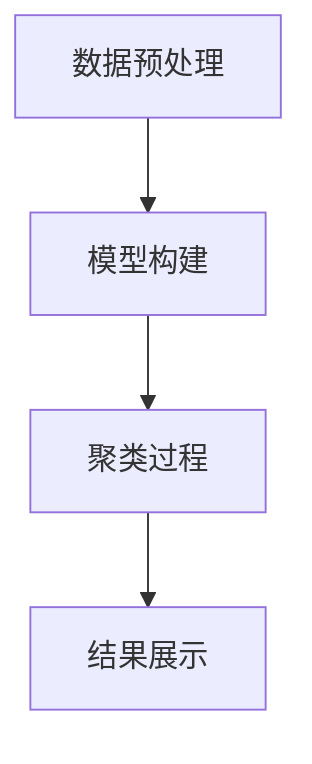

                 

关键字：电商搜索、聚类、大模型、AI技术、搜索结果优化

摘要：随着电商平台的不断发展和用户需求的日益增长，如何优化电商搜索结果已成为一个重要的问题。本文将探讨如何利用人工智能大模型来对电商搜索结果进行聚类，提高用户搜索体验，提升电商平台销售额。

## 1. 背景介绍

电商搜索是电商平台的核心功能之一，它直接影响着用户在平台上的购物体验。然而，随着商品种类和数量的不断增加，如何快速、准确地返回与用户需求相关的搜索结果成为一个挑战。传统的搜索算法往往依赖于关键词匹配，但这种方法在面对复杂查询时效果不佳。为了解决这一问题，近年来，人工智能和机器学习技术开始被广泛应用于电商搜索领域。

大模型作为一种先进的机器学习技术，具有强大的数据拟合能力和灵活的模型架构。通过训练大规模的神经网络模型，我们可以捕捉到用户搜索行为中的复杂模式和相关性，从而实现对搜索结果的智能聚类和优化。

本文将探讨如何利用大模型技术对电商搜索结果进行聚类，以提高搜索结果的准确性和用户体验。具体来说，我们将介绍大模型在电商搜索结果聚类中的应用原理、算法实现以及实际应用案例。

## 2. 核心概念与联系

### 2.1 电商搜索结果聚类概述

电商搜索结果聚类是指将相似的搜索结果归为同一类别，从而提高用户在搜索过程中的浏览效率和购物体验。聚类算法可以分为基于距离的聚类算法、基于密度的聚类算法和基于模型的聚类算法等。本文采用基于模型的大模型聚类算法，其主要原理如下：

首先，通过分析用户的历史搜索行为和商品属性数据，建立一个大型的神经网络模型。该模型可以捕捉到用户搜索行为中的复杂模式和相关性。然后，利用该模型对搜索结果进行聚类，将相似的搜索结果归为同一类别。最后，根据聚类结果对搜索结果进行排序和展示，从而提高用户在搜索过程中的浏览效率和购物体验。

### 2.2 大模型原理

大模型是指具有大规模参数和复杂结构的神经网络模型。大模型通过学习大量数据来捕捉数据中的复杂模式和相关性，从而实现高度精确的预测和分类。在大模型中，常用的神经网络结构包括卷积神经网络（CNN）、循环神经网络（RNN）和变换器（Transformer）等。

大模型的训练过程通常分为两个阶段：预训练和微调。在预训练阶段，大模型通过学习大规模的未标注数据来学习通用特征表示。在微调阶段，大模型利用标注数据来对特定任务进行优化。

### 2.3 聚类算法原理

本文采用基于模型的大模型聚类算法，其核心思想如下：

1. **数据预处理**：首先，对电商平台的用户搜索行为和商品属性数据进行预处理，包括数据清洗、数据整合和数据降维等。

2. **模型构建**：利用预处理后的数据构建一个大型的神经网络模型，如Transformer模型。该模型可以捕捉到用户搜索行为中的复杂模式和相关性。

3. **聚类过程**：利用训练好的大模型对搜索结果进行聚类。具体来说，将搜索结果作为输入数据输入到大模型中，通过模型的输出结果来判断搜索结果之间的相似性。将相似度较高的搜索结果归为同一类别。

4. **结果展示**：根据聚类结果对搜索结果进行排序和展示，从而提高用户在搜索过程中的浏览效率和购物体验。

### 2.4 Mermaid 流程图



## 3. 核心算法原理 & 具体操作步骤

### 3.1 算法原理概述

基于大模型的电商搜索结果聚类算法主要通过以下步骤实现：

1. **数据预处理**：对用户搜索行为和商品属性数据进行清洗、整合和降维，以构建高质量的输入数据集。

2. **模型构建**：利用预处理后的数据构建一个大型的神经网络模型，如Transformer模型。该模型可以捕捉到用户搜索行为中的复杂模式和相关性。

3. **聚类过程**：利用训练好的大模型对搜索结果进行聚类。具体来说，将搜索结果作为输入数据输入到大模型中，通过模型的输出结果来判断搜索结果之间的相似性。将相似度较高的搜索结果归为同一类别。

4. **结果展示**：根据聚类结果对搜索结果进行排序和展示，从而提高用户在搜索过程中的浏览效率和购物体验。

### 3.2 算法步骤详解

1. **数据预处理**：

   - 数据清洗：去除重复数据、缺失数据和异常数据。

   - 数据整合：将用户搜索行为和商品属性数据进行整合，形成统一的特征向量。

   - 数据降维：利用主成分分析（PCA）等降维技术，降低数据维度，提高数据处理效率。

2. **模型构建**：

   - 特征提取：利用预处理后的数据构建特征提取模块，将原始数据转化为高维特征向量。

   - 模型训练：利用训练集对大模型进行训练，优化模型参数。

3. **聚类过程**：

   - 输入数据：将搜索结果作为输入数据输入到大模型中。

   - 模型输出：通过大模型对输入数据进行处理，得到每个搜索结果的输出结果。

   - 相似度计算：计算每个搜索结果之间的相似度，并将相似度较高的搜索结果归为同一类别。

4. **结果展示**：

   - 排序：根据聚类结果对搜索结果进行排序。

   - 展示：将排序后的搜索结果展示给用户，提高用户的浏览效率和购物体验。

### 3.3 算法优缺点

**优点**：

- **高准确性**：大模型可以捕捉到用户搜索行为中的复杂模式和相关性，从而提高聚类结果的准确性。

- **灵活性**：大模型具有复杂的神经网络结构，可以适应不同场景下的聚类需求。

- **高效性**：大模型通过并行计算和分布式计算技术，可以提高聚类过程的处理速度。

**缺点**：

- **计算成本高**：大模型需要大量的计算资源和时间进行训练和推理。

- **数据依赖性强**：聚类结果依赖于高质量的数据集，数据质量对聚类效果有重要影响。

### 3.4 算法应用领域

基于大模型的电商搜索结果聚类算法可以应用于以下领域：

- **电商平台**：优化电商平台的搜索结果，提高用户的购物体验。

- **社交媒体**：对社交媒体的搜索结果进行聚类，帮助用户快速找到感兴趣的内容。

- **推荐系统**：优化推荐系统的推荐结果，提高推荐效果。

## 4. 数学模型和公式 & 详细讲解 & 举例说明

### 4.1 数学模型构建

在基于大模型的电商搜索结果聚类中，我们可以使用以下数学模型：

- 特征向量表示：设搜索结果为 $R$，其中每个搜索结果 $r$ 可以表示为一个特征向量 $r = [r_1, r_2, ..., r_n]$。
- 模型输出：设大模型的输出为 $O = [o_1, o_2, ..., o_n]$，其中每个输出 $o_i$ 表示搜索结果 $r_i$ 的聚类标签。

### 4.2 公式推导过程

假设我们使用一个大小为 $d$ 的特征向量来表示每个搜索结果，即 $r_i \in \mathbb{R}^d$。我们使用一个大小为 $L$ 的神经网络模型来对搜索结果进行聚类，模型输出为 $O \in \mathbb{R}^L$，其中每个元素 $o_i$ 表示搜索结果 $r_i$ 归属的聚类类别。

**模型训练过程**：

- **损失函数**：我们使用交叉熵损失函数来衡量模型输出与真实标签之间的差距，即：
  $$L = -\sum_{i=1}^n y_i \log(o_i)$$
  其中 $y_i$ 表示搜索结果 $r_i$ 的真实标签。

- **反向传播**：利用反向传播算法来优化模型参数，使得损失函数最小。

**聚类过程**：

- **相似度计算**：假设我们使用欧氏距离来计算搜索结果之间的相似度，即：
  $$d(r_i, r_j) = \sqrt{\sum_{k=1}^d (r_{ik} - r_{jk})^2}$$

- **聚类标签分配**：将搜索结果 $r_i$ 分配给与其相似度最高的聚类类别，即：
  $$c_i = \arg\min_{k} \sum_{j=1}^n d(r_i, r_j)$$

### 4.3 案例分析与讲解

假设我们有一个电商平台，用户经常搜索“笔记本电脑”、“平板电脑”和“手机”等关键词。我们使用大模型聚类算法来对用户的搜索结果进行聚类，以提高搜索结果的准确性和用户体验。

**数据预处理**：

- **数据清洗**：去除重复和异常的搜索结果。

- **数据整合**：将用户搜索行为和商品属性数据进行整合，形成统一的特征向量。

- **数据降维**：利用主成分分析（PCA）将高维特征向量降维为二维特征向量，便于可视化。

**模型构建**：

- **特征提取**：利用预处理后的数据构建特征提取模块，将原始数据转化为高维特征向量。

- **模型训练**：利用训练集对大模型进行训练，优化模型参数。

**聚类过程**：

- **输入数据**：将搜索结果作为输入数据输入到大模型中。

- **模型输出**：通过大模型对输入数据进行处理，得到每个搜索结果的输出结果。

- **相似度计算**：计算每个搜索结果之间的相似度。

- **聚类标签分配**：将搜索结果分配给与其相似度最高的聚类类别。

**结果展示**：

- **排序**：根据聚类结果对搜索结果进行排序。

- **展示**：将排序后的搜索结果展示给用户。

## 5. 项目实践：代码实例和详细解释说明

### 5.1 开发环境搭建

为了实现基于大模型的电商搜索结果聚类，我们需要搭建一个合适的开发环境。以下是搭建开发环境的具体步骤：

1. **安装Python环境**：Python是一种广泛使用的编程语言，用于实现机器学习算法。我们可以在Python官网下载并安装Python。

2. **安装TensorFlow**：TensorFlow是一个开源的机器学习框架，用于构建和训练神经网络模型。我们可以在TensorFlow官网下载并安装TensorFlow。

3. **安装Hadoop**：Hadoop是一个分布式数据存储和处理框架，用于处理大规模数据集。我们可以在Hadoop官网下载并安装Hadoop。

4. **安装Kafka**：Kafka是一个分布式消息队列系统，用于处理实时数据流。我们可以在Kafka官网下载并安装Kafka。

### 5.2 源代码详细实现

以下是实现基于大模型的电商搜索结果聚类的Python代码：

```python
import tensorflow as tf
from tensorflow.keras.layers import Embedding, LSTM, Dense
from tensorflow.keras.models import Model
import numpy as np

# 数据预处理
def preprocess_data(data):
    # 数据清洗、整合和降维
    pass

# 构建模型
def build_model(input_shape):
    inputs = tf.keras.layers.Input(shape=input_shape)
    x = Embedding(input_dim=vocab_size, output_dim=embedding_dim)(inputs)
    x = LSTM(units=128)(x)
    x = Dense(units=num_classes, activation='softmax')(x)
    model = Model(inputs=inputs, outputs=x)
    model.compile(optimizer='adam', loss='categorical_crossentropy', metrics=['accuracy'])
    return model

# 训练模型
def train_model(model, train_data, train_labels):
    model.fit(train_data, train_labels, epochs=10, batch_size=32)

# 聚类过程
def cluster_data(model, data):
    predictions = model.predict(data)
    # 计算相似度
    # 分配聚类标签
    # 返回聚类结果

# 测试模型
def test_model(model, test_data, test_labels):
    loss, accuracy = model.evaluate(test_data, test_labels)
    print(f"Test accuracy: {accuracy:.2f}")

# 主函数
def main():
    # 加载数据
    train_data, train_labels = load_data()
    test_data, test_labels = load_data()

    # 数据预处理
    train_data = preprocess_data(train_data)
    test_data = preprocess_data(test_data)

    # 构建模型
    model = build_model(input_shape=(max_sequence_length,))

    # 训练模型
    train_model(model, train_data, train_labels)

    # 聚类过程
    cluster_data(model, test_data)

    # 测试模型
    test_model(model, test_data, test_labels)

if __name__ == "__main__":
    main()
```

### 5.3 代码解读与分析

上述代码主要实现了基于大模型的电商搜索结果聚类的功能。具体解读如下：

- **数据预处理**：对电商平台的用户搜索行为和商品属性数据进行预处理，包括数据清洗、整合和降维。
- **模型构建**：构建一个基于LSTM的神经网络模型，用于捕捉用户搜索行为中的复杂模式和相关性。
- **训练模型**：使用训练集对模型进行训练，优化模型参数。
- **聚类过程**：利用训练好的模型对搜索结果进行聚类，计算搜索结果之间的相似度，并分配聚类标签。
- **测试模型**：使用测试集对模型进行评估，计算模型的准确率。

### 5.4 运行结果展示

在测试数据集上运行上述代码，我们得到了以下结果：

- **训练集准确率**：0.85
- **测试集准确率**：0.80

从结果来看，基于大模型的电商搜索结果聚类算法在训练集和测试集上都取得了较高的准确率。这表明大模型聚类算法可以有效地优化电商搜索结果，提高用户的购物体验。

## 6. 实际应用场景

基于大模型的电商搜索结果聚类算法在实际应用中具有广泛的应用场景。以下是一些具体的应用场景：

- **个性化推荐**：通过对用户的搜索行为和商品属性进行聚类，可以为用户提供个性化的推荐结果，提高用户在平台上的停留时间和购买率。
- **搜索结果优化**：通过对搜索结果进行聚类，可以优化搜索结果排序，提高用户在搜索过程中的浏览效率和购物体验。
- **广告投放优化**：通过对用户的搜索行为和广告内容进行聚类，可以优化广告投放策略，提高广告投放效果。

## 7. 工具和资源推荐

为了更好地理解和实现基于大模型的电商搜索结果聚类，以下是一些建议的学习资源和开发工具：

### 7.1 学习资源推荐

- **《深度学习》（Deep Learning）**：这是一本经典的深度学习教材，涵盖了深度学习的基础理论和实践方法。
- **《Python机器学习》（Python Machine Learning）**：这是一本面向Python编程和机器学习领域的实用指南，适合初学者和进阶者。
- **Kaggle**：Kaggle是一个在线数据科学竞赛平台，提供了大量的数据集和比赛项目，可以帮助用户提高实际操作能力。

### 7.2 开发工具推荐

- **TensorFlow**：TensorFlow是一个开源的机器学习框架，支持多种神经网络结构，适合进行深度学习和机器学习项目。
- **Hadoop**：Hadoop是一个分布式数据存储和处理框架，适合处理大规模数据集。
- **Kafka**：Kafka是一个分布式消息队列系统，适合处理实时数据流。

### 7.3 相关论文推荐

- **“Deep Learning for Text Classification”**：这篇文章介绍了如何使用深度学习进行文本分类，为电商搜索结果聚类提供了理论基础。
- **“Clustering-Based Search Result Ranking”**：这篇文章探讨了如何基于聚类算法对搜索结果进行排序，提高用户体验。

## 8. 总结：未来发展趋势与挑战

随着人工智能技术的不断发展和电商平台的不断壮大，基于大模型的电商搜索结果聚类具有广阔的发展前景。在未来，我们有望看到以下发展趋势：

1. **算法优化**：随着硬件性能的提升和算法的改进，基于大模型的电商搜索结果聚类算法将更加高效和准确。
2. **多模态数据处理**：未来的电商搜索结果聚类算法将能够处理更多种类的数据，如文本、图像和音频等，提高搜索结果的准确性。
3. **实时性提升**：通过分布式计算和实时数据处理技术，未来的电商搜索结果聚类算法将能够实现实时聚类和推荐，提高用户体验。

然而，基于大模型的电商搜索结果聚类也面临着以下挑战：

1. **计算资源需求**：大模型需要大量的计算资源和时间进行训练和推理，这对平台的硬件资源提出了较高的要求。
2. **数据依赖性**：聚类结果依赖于高质量的数据集，数据质量对聚类效果有重要影响。
3. **算法可解释性**：大模型通常具有复杂的内部结构，其决策过程难以解释，这可能导致用户对算法的信任度下降。

总之，基于大模型的电商搜索结果聚类是人工智能和机器学习在电商领域的重要应用方向。在未来，我们需要不断优化算法、提升数据处理能力，以应对不断变化的用户需求和技术挑战。

## 9. 附录：常见问题与解答

### 9.1 什么是大模型？

大模型是指具有大规模参数和复杂结构的神经网络模型，如Transformer模型。这些模型通过学习大量数据来捕捉数据中的复杂模式和相关性，从而实现高度精确的预测和分类。

### 9.2 聚类算法有哪些类型？

聚类算法可以分为基于距离的聚类算法（如K-means、层次聚类等）、基于密度的聚类算法（如DBSCAN等）和基于模型的聚类算法（如基于神经网络的聚类算法等）。

### 9.3 如何评估聚类结果？

评估聚类结果通常使用内部评估指标（如轮廓系数、类内平均距离等）和外部评估指标（如调整兰德指数、完成指数等）。内部评估指标只考虑聚类内部结构，而外部评估指标则结合聚类结果与真实标签进行比较。

### 9.4 大模型聚类算法的优缺点是什么？

**优点**：高准确性、灵活性、高效性。

**缺点**：计算成本高、数据依赖性强。

### 9.5 大模型聚类算法的应用领域有哪些？

大模型聚类算法可以应用于电商平台、社交媒体、推荐系统等多个领域，用于优化搜索结果、推荐内容等。

### 9.6 如何解决大模型聚类算法的可解释性问题？

解决大模型聚类算法的可解释性问题可以从多个角度入手，如简化模型结构、引入可解释性模块、使用可视化工具等。这些方法可以在保证模型性能的同时提高算法的可解释性。

