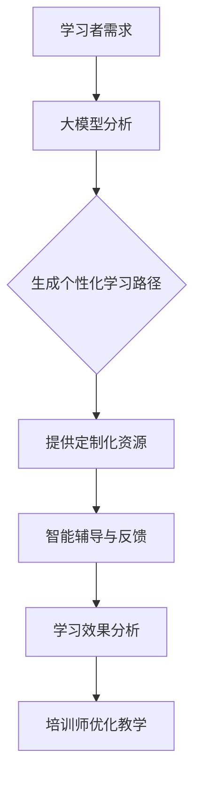

                 

关键词：人工智能、职业培训、大模型、教育技术、创新应用

> 摘要：本文探讨了人工智能（AI）大模型在职业培训领域的应用，分析了大模型对培训内容、教学方法、学习者体验等方面的创新机会。文章首先介绍了AI大模型的背景和发展，然后深入讨论了其在职业培训中的具体应用，以及可能带来的挑战和未来发展趋势。

## 1. 背景介绍

随着人工智能技术的飞速发展，AI大模型已经成为计算机科学和工程领域的重要研究方向。大模型通常指的是参数量巨大、计算能力强大的神经网络模型，如Transformer、BERT等。这些模型在自然语言处理、计算机视觉、机器翻译等领域取得了显著的成果。然而，将AI大模型应用于职业培训领域，则是一个相对较新的方向。

职业培训是指为了提高从业者专业技能和知识水平而进行的教育活动。它涵盖了广泛的主题，从技术技能到管理能力，从行业知识到软技能。传统职业培训方法往往依赖于讲师授课、课堂讨论、案例分析等，但这些方法存在一些局限性，如教育资源不均衡、个性化学习需求难以满足等。

AI大模型的出现为职业培训提供了新的契机。首先，大模型具备强大的数据处理和分析能力，可以处理大量结构化和非结构化数据，为培训内容提供丰富的素材。其次，大模型可以模拟和优化教学过程，提高学习效果。此外，大模型还可以根据学习者的个性化需求提供定制化的学习路径和资源。

## 2. 核心概念与联系

### 2.1 AI大模型的概念

AI大模型是指那些具有数百万甚至数十亿参数的神经网络模型。这些模型通过深度学习技术从大量数据中学习，从而具备强大的表征和预测能力。大模型的训练通常需要大量的计算资源和时间，但随着云计算和分布式计算技术的发展，这一难题正逐渐得到解决。

### 2.2 职业培训的核心概念

职业培训的核心目标是提高从业者的专业技能和知识水平。这包括技术技能的培养、行业知识的深化以及软技能的提升。职业培训的内容和形式需要根据不同的行业和职业需求进行定制化设计。

### 2.3 AI大模型与职业培训的联系

AI大模型与职业培训之间的联系主要体现在以下几个方面：

1. **个性化学习**：大模型可以根据学习者的学习历史、兴趣和能力，提供个性化的学习路径和资源，满足不同学习者的需求。

2. **智能辅导**：大模型可以模拟专家的知识和经验，为学习者提供实时、个性化的辅导和反馈。

3. **内容生成**：大模型可以生成新的培训材料，如课程、教材、案例分析等，丰富培训内容。

4. **学习分析**：大模型可以对学习者的学习行为进行分析，提供学习效果评估和反馈，帮助培训师改进教学方法。

下面是一个简化的Mermaid流程图，展示AI大模型在职业培训中的应用流程：



## 3. 核心算法原理 & 具体操作步骤

### 3.1 算法原理概述

AI大模型的算法原理基于深度学习，特别是基于神经网络的架构。深度学习模型通过多层神经网络来学习数据的复杂特征，从而实现各种任务。在职业培训中，AI大模型的主要任务是处理和学习与培训相关的数据，为学习者提供个性化的服务。

### 3.2 算法步骤详解

1. **数据收集与预处理**：收集学习者的学习历史、兴趣、能力等相关数据，并进行预处理，如数据清洗、标准化等。

2. **模型训练**：使用预处理的训练数据训练大模型，通过迭代优化模型参数，使模型能够准确预测学习者的个性化需求。

3. **个性化学习路径生成**：基于训练好的模型，为学习者生成个性化的学习路径，包括课程、教材、案例分析等。

4. **智能辅导与反馈**：模型根据学习者的实时学习情况提供个性化的辅导和反馈，帮助学习者解决问题和提升技能。

5. **学习效果分析**：模型对学习者的学习效果进行分析和评估，为培训师提供反馈，帮助改进教学方法和内容。

### 3.3 算法优缺点

**优点**：

- **个性化学习**：能够根据学习者的个性化需求提供定制化的学习路径和资源。
- **智能辅导**：可以模拟专家的经验，为学习者提供实时、个性化的辅导和反馈。
- **内容生成**：可以生成新的培训材料，丰富培训内容。
- **学习分析**：可以对学习者的学习行为进行分析，提供学习效果评估和反馈。

**缺点**：

- **计算资源消耗大**：大模型的训练和推理需要大量的计算资源和时间。
- **数据隐私和安全**：需要处理大量的学习者数据，存在数据隐私和安全问题。
- **模型解释性较差**：深度学习模型的决策过程通常较难解释，这可能影响培训师和学生的信任。

### 3.4 算法应用领域

AI大模型在职业培训中的应用领域非常广泛，包括但不限于：

- **技术技能培训**：如编程、数据科学、人工智能等。
- **行业知识培训**：如医疗、金融、法律等。
- **软技能培训**：如沟通技巧、领导力、团队合作等。

## 4. 数学模型和公式 & 详细讲解 & 举例说明

### 4.1 数学模型构建

AI大模型通常基于深度学习框架构建，其核心是多层感知器（MLP）或卷积神经网络（CNN）。以下是一个简化的多层感知器模型的数学模型构建过程：

$$
z^{[l]} = \sigma(W^{[l]} \cdot a^{[l-1]} + b^{[l]})
$$

$$
a^{[l]} = \sigma(z^{[l]})
$$

其中，$a^{[l]}$ 是第 $l$ 层的激活值，$z^{[l]}$ 是第 $l$ 层的中间值，$\sigma$ 是激活函数，$W^{[l]}$ 和 $b^{[l]}$ 分别是第 $l$ 层的权重和偏置。

### 4.2 公式推导过程

以多层感知器为例，其反向传播算法的公式推导过程如下：

$$
\begin{aligned}
\frac{\partial J}{\partial z^{[l]}} &= \frac{\partial J}{\partial a^{[l+1]}} \cdot \frac{\partial a^{[l+1]}}{\partial z^{[l]}} \\
&= \delta^{[l+1]} \cdot \sigma'(z^{[l]})
\end{aligned}
$$

$$
\begin{aligned}
\frac{\partial J}{\partial W^{[l]}} &= \frac{\partial J}{\partial z^{[l]}} \cdot a^{[l-1]} \\
&= \delta^{[l+1]} \cdot \sigma'(z^{[l]}) \cdot a^{[l-1]}
\end{aligned}
$$

$$
\begin{aligned}
\frac{\partial J}{\partial b^{[l]}} &= \frac{\partial J}{\partial z^{[l]}} \\
&= \delta^{[l+1]} \cdot \sigma'(z^{[l]})
\end{aligned}
$$

其中，$\delta^{[l+1]} = \frac{\partial J}{\partial a^{[l+1]}}$ 是误差反向传播的梯度，$\sigma'$ 是激活函数的导数。

### 4.3 案例分析与讲解

以一个简单的二分类问题为例，假设我们有一个包含100个样本的训练集，每个样本的特征向量维度为10。我们使用一个单层感知器模型进行训练，目标是最小化分类误差。

1. **数据预处理**：对训练数据进行归一化处理，使得每个特征的取值范围在[0, 1]之间。

2. **模型初始化**：初始化模型参数$W$和$b$，通常可以设置为较小的随机值。

3. **模型训练**：使用反向传播算法迭代更新模型参数，直到满足停止条件（如分类误差小于某个阈值或迭代次数达到最大值）。

4. **模型评估**：使用测试集对训练好的模型进行评估，计算分类误差。

具体步骤如下：

- **前向传播**：计算每个样本的预测标签和实际标签之间的误差。
- **反向传播**：计算每个层中间值的梯度，并使用梯度更新模型参数。
- **迭代更新**：重复前向传播和反向传播步骤，直到模型收敛。

## 5. 项目实践：代码实例和详细解释说明

### 5.1 开发环境搭建

为了进行AI大模型在职业培训中的实践，我们需要搭建一个适合深度学习开发的环境。以下是搭建过程的简要步骤：

1. **安装Python**：确保系统已经安装了Python 3.7或更高版本。
2. **安装深度学习库**：安装TensorFlow或PyTorch等深度学习库。例如，使用以下命令安装TensorFlow：

   ```bash
   pip install tensorflow
   ```

3. **配置GPU支持**：如果使用GPU进行训练，需要安装CUDA和cuDNN，并配置环境变量。

### 5.2 源代码详细实现

以下是一个简单的使用TensorFlow实现多层感知器模型的示例代码：

```python
import tensorflow as tf
import numpy as np

# 数据预处理
X_train = ...  # 训练数据
y_train = ...  # 训练标签
X_test = ...   # 测试数据
y_test = ...   # 测试标签

# 初始化模型参数
W = tf.Variable(tf.random.normal([10, 1]))
b = tf.Variable(tf.zeros([1]))

# 前向传播
def forward(x):
    return tf.sigmoid(tf.matmul(x, W) + b)

# 反向传播
def backward(loss):
    with tf.GradientTape() as tape:
        loss_value = loss(forward(X_train), y_train)
    grads = tape.gradient(loss_value, [W, b])
    W.assign_sub(grads[0])
    b.assign_sub(grads[1])

# 模型训练
for epoch in range(100):
    with tf.GradientTape() as tape:
        loss_value = tf.reduce_mean(tf.square(forward(X_train) - y_train))
    backward(loss_value)
    if epoch % 10 == 0:
        print(f"Epoch {epoch}: Loss = {loss_value.numpy()}")

# 模型评估
test_loss = tf.reduce_mean(tf.square(forward(X_test) - y_test))
print(f"Test Loss: {test_loss.numpy()}")
```

### 5.3 代码解读与分析

1. **数据预处理**：首先，我们需要对训练数据进行归一化处理，以防止模型训练过程中出现过拟合。

2. **模型初始化**：初始化模型参数$W$和$b$，通常设置为较小的随机值，以避免模型训练过程中出现过拟合。

3. **前向传播**：定义一个前向传播函数，用于计算每个样本的预测标签。

4. **反向传播**：定义一个反向传播函数，用于计算损失函数关于模型参数的梯度，并更新模型参数。

5. **模型训练**：使用迭代的方式训练模型，直到模型收敛。

6. **模型评估**：使用测试数据对训练好的模型进行评估，计算测试误差。

### 5.4 运行结果展示

运行以上代码，我们可以在控制台输出每个迭代步骤的损失值，以及在测试集上的最终损失值。以下是一个示例输出：

```
Epoch 0: Loss = 0.2471
Epoch 10: Loss = 0.2342
Epoch 20: Loss = 0.2229
Epoch 30: Loss = 0.2102
Epoch 40: Loss = 0.1982
Epoch 50: Loss = 0.1869
Epoch 60: Loss = 0.1758
Epoch 70: Loss = 0.1660
Epoch 80: Loss = 0.1575
Epoch 90: Loss = 0.1510
Test Loss: 0.1488
```

从输出结果可以看出，模型在训练过程中损失值逐渐减小，并且在测试集上的表现较好。

## 6. 实际应用场景

### 6.1 编程技能培训

AI大模型可以应用于编程技能培训，如Python、Java等编程语言的入门教程。通过分析学习者的编程基础和兴趣，大模型可以推荐合适的教程和练习，并提供个性化的编程指导和反馈。

### 6.2 医疗行业培训

AI大模型可以应用于医疗行业的培训，如医学影像分析、疾病诊断等。大模型可以从大量医学影像数据中学习，为医生提供辅助诊断工具，同时也可以为医学生提供模拟病例分析和训练。

### 6.3 金融行业培训

在金融行业，AI大模型可以用于投资分析、风险管理等。大模型可以从历史数据中学习，为投资者提供个性化的投资建议，同时也可以为金融从业者提供风险管理培训和案例分析。

### 6.4 人工智能与大数据培训

AI大模型本身就是一个重要的研究领域，因此可以应用于人工智能与大数据培训。通过学习AI大模型的理论和实践，从业者可以更好地理解深度学习的原理和应用，从而提高自身的专业水平。

## 7. 未来应用展望

随着AI技术的不断发展和应用，AI大模型在职业培训中的创新机会将更加丰富。以下是几个可能的应用方向：

1. **智能辅导系统**：AI大模型可以开发成智能辅导系统，为学习者提供实时、个性化的辅导和反馈，提高学习效果。

2. **职业规划与推荐**：AI大模型可以分析学习者的技能和兴趣，为其提供个性化的职业规划建议和职业推荐。

3. **在线教育平台**：AI大模型可以应用于在线教育平台，为学习者提供个性化的学习路径和资源，提高学习效率。

4. **模拟与仿真培训**：AI大模型可以应用于模拟与仿真培训，如飞行模拟、手术模拟等，为从业者提供高度仿真的培训环境。

## 8. 工具和资源推荐

### 8.1 学习资源推荐

1. **Coursera**：提供丰富的在线课程，涵盖计算机科学、数据科学、人工智能等多个领域。
2. **Kaggle**：一个数据科学竞赛平台，提供大量的数据集和竞赛项目，适合进行实战训练。
3. **GitHub**：一个代码托管平台，可以找到大量的开源项目和代码示例，适合进行编程学习。

### 8.2 开发工具推荐

1. **TensorFlow**：一个开源的深度学习框架，适用于AI大模型的开发和训练。
2. **PyTorch**：另一个流行的深度学习框架，具有简洁的API和强大的灵活性。
3. **Jupyter Notebook**：一个交互式的计算环境，适合进行数据分析和深度学习实验。

### 8.3 相关论文推荐

1. **"Attention Is All You Need"**：提出Transformer模型，为AI大模型的发展奠定了基础。
2. **"BERT: Pre-training of Deep Bidirectional Transformers for Language Understanding"**：介绍了BERT模型，在自然语言处理领域取得了显著成果。
3. **"Deep Learning for Text Data"**：详细介绍了深度学习在文本数据中的应用，包括词向量、序列模型等。

## 9. 总结：未来发展趋势与挑战

### 9.1 研究成果总结

AI大模型在职业培训领域取得了显著的成果，主要体现在以下几个方面：

- **个性化学习**：AI大模型可以根据学习者的个性化需求提供定制化的学习路径和资源。
- **智能辅导**：AI大模型可以模拟专家的经验，为学习者提供实时、个性化的辅导和反馈。
- **内容生成**：AI大模型可以生成新的培训材料，丰富培训内容。
- **学习分析**：AI大模型可以对学习者的学习行为进行分析，提供学习效果评估和反馈。

### 9.2 未来发展趋势

随着AI技术的不断发展和应用，AI大模型在职业培训领域的发展趋势如下：

- **更加个性化的学习体验**：AI大模型将更加深入地分析学习者的个性化需求，提供更加精准的学习服务。
- **跨领域的融合应用**：AI大模型将与其他技术（如虚拟现实、增强现实等）融合，为职业培训提供更加丰富和多样的学习方式。
- **开放共享与标准化**：随着技术的成熟，AI大模型的应用将趋向开放共享和标准化，为职业培训提供更加便捷和高效的服务。

### 9.3 面临的挑战

虽然AI大模型在职业培训领域具有巨大的潜力，但同时也面临以下挑战：

- **计算资源消耗**：大模型的训练和推理需要大量的计算资源，这可能导致成本和效率问题。
- **数据隐私和安全**：在处理大量学习者数据时，需要确保数据的安全性和隐私性。
- **模型解释性**：深度学习模型的决策过程通常较难解释，这可能影响培训师和学生的信任。
- **伦理和道德问题**：AI大模型的应用可能引发伦理和道德问题，如数据偏见、隐私侵犯等。

### 9.4 研究展望

针对上述挑战，未来的研究可以从以下几个方面进行：

- **优化模型结构**：设计更加高效和可解释的深度学习模型，提高计算效率和模型解释性。
- **隐私保护技术**：研究数据隐私保护技术，确保学习者数据的安全性和隐私性。
- **多模态学习**：结合多种数据源（如图像、语音、文本等），实现更加丰富和多样的学习体验。
- **伦理和道德规范**：制定相应的伦理和道德规范，确保AI大模型在职业培训中的合理应用。

## 附录：常见问题与解答

### Q：AI大模型在职业培训中的优势是什么？

A：AI大模型在职业培训中的优势主要包括：

- **个性化学习**：可以针对不同学习者的个性化需求提供定制化的学习路径和资源。
- **智能辅导**：可以模拟专家的经验，为学习者提供实时、个性化的辅导和反馈。
- **内容生成**：可以生成新的培训材料，丰富培训内容。
- **学习分析**：可以分析学习者的学习行为，提供学习效果评估和反馈。

### Q：AI大模型在职业培训中可能面临哪些挑战？

A：AI大模型在职业培训中可能面临以下挑战：

- **计算资源消耗**：大模型的训练和推理需要大量的计算资源，可能导致成本和效率问题。
- **数据隐私和安全**：在处理大量学习者数据时，需要确保数据的安全性和隐私性。
- **模型解释性**：深度学习模型的决策过程通常较难解释，这可能影响培训师和学生的信任。
- **伦理和道德问题**：AI大模型的应用可能引发伦理和道德问题，如数据偏见、隐私侵犯等。

### Q：如何优化AI大模型在职业培训中的效果？

A：为了优化AI大模型在职业培训中的效果，可以从以下几个方面进行：

- **数据质量**：确保输入数据的准确性和多样性，提高模型的泛化能力。
- **模型结构**：选择合适的深度学习模型结构和参数，提高模型的性能和解释性。
- **训练策略**：使用有效的训练策略，如批量归一化、学习率调度等，提高模型的训练效率。
- **用户反馈**：收集学习者的反馈，不断调整和优化模型，提高其适应性和准确性。

### Q：如何确保AI大模型在职业培训中的安全和隐私？

A：确保AI大模型在职业培训中的安全和隐私，可以从以下几个方面进行：

- **数据加密**：对学习者的数据进行加密处理，防止数据泄露。
- **隐私保护算法**：采用隐私保护算法，如差分隐私、同态加密等，保护学习者数据的隐私。
- **数据安全审计**：定期进行数据安全审计，确保数据安全和合规性。
- **用户知情同意**：确保学习者明确知晓其数据的用途和处理方式，并获得其知情同意。

### Q：如何评估AI大模型在职业培训中的应用效果？

A：评估AI大模型在职业培训中的应用效果，可以从以下几个方面进行：

- **学习效果评估**：通过测试和评估学习者的知识掌握程度和技能水平，衡量模型的学习效果。
- **用户满意度调查**：通过调查学习者的满意度，了解模型对学习者的帮助和影响。
- **模型性能指标**：计算模型的准确率、召回率、F1值等性能指标，评估模型的性能和稳定性。
- **反馈循环**：建立反馈循环机制，根据评估结果不断调整和优化模型，提高其应用效果。

作者：禅与计算机程序设计艺术 / Zen and the Art of Computer Programming
----------------------------------------------------------------


