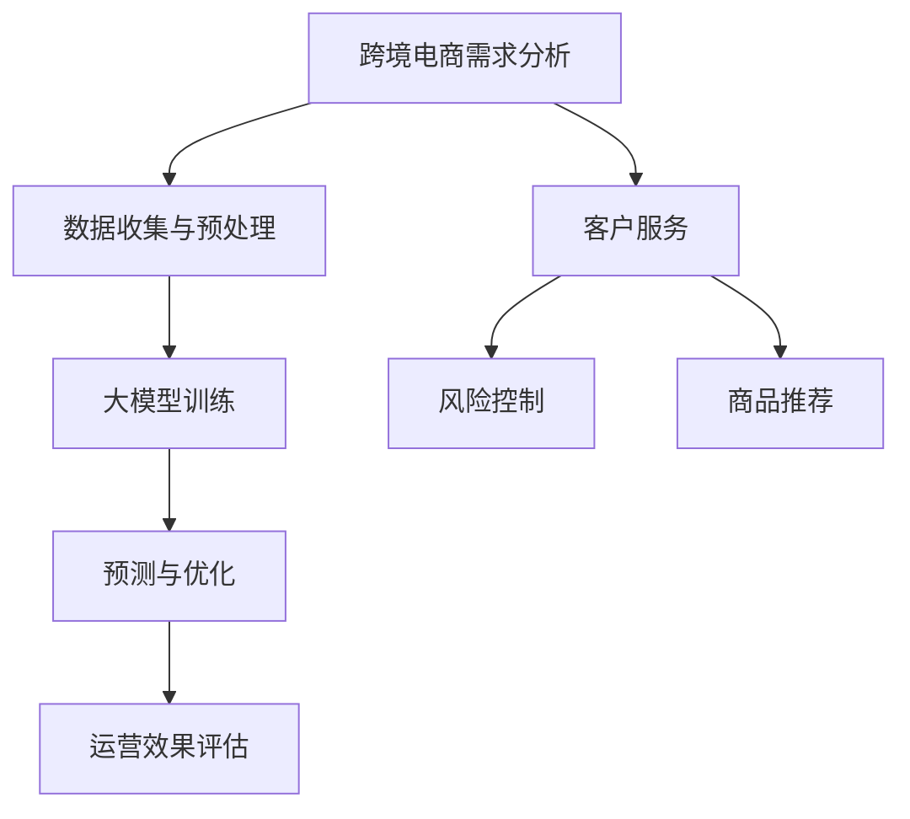

                 

关键词：人工智能、大模型、跨境电商、应用价值

> 摘要：本文旨在探讨人工智能大模型在跨境电商领域的应用价值，通过分析其核心概念、算法原理、数学模型以及实际应用案例，深入解析大模型如何助力跨境电商行业实现智能化升级。

## 1. 背景介绍

### 1.1 跨境电商的发展现状

随着互联网技术的迅猛发展和全球化进程的加速，跨境电商已经成为国际贸易的新引擎。根据相关数据统计，全球跨境电商市场规模逐年扩大，预计到2025年，全球跨境电商交易规模将达到4万亿美元。这一趋势不仅为企业带来了巨大的商机，也对传统贸易模式提出了挑战。

### 1.2 人工智能的崛起

人工智能作为当今科技领域的热点话题，正逐渐渗透到各行各业。从自然语言处理到计算机视觉，从机器学习到深度学习，人工智能技术正在不断突破技术瓶颈，推动产业智能化升级。特别是大模型技术的发展，使得人工智能在处理海量数据和复杂任务方面取得了显著突破。

## 2. 核心概念与联系

### 2.1 人工智能大模型概述

人工智能大模型是指通过大规模数据训练得到的神经网络模型，具有强大的特征提取和模式识别能力。常见的大模型包括GPT、BERT、Transformer等，这些模型在自然语言处理、图像识别、语音识别等领域取得了显著的成果。

### 2.2 跨境电商与人工智能大模型的联系

跨境电商的快速发展为人工智能大模型的应用提供了广阔的场景。大模型在需求分析、商品推荐、客户服务、风险控制等方面具有巨大的潜力，能够提升跨境电商的运营效率和用户体验。

### 2.3 Mermaid流程图



## 3. 核心算法原理 & 具体操作步骤

### 3.1 算法原理概述

大模型在跨境电商中的应用主要基于其强大的特征提取和模式识别能力。通过大规模数据训练，大模型可以自动提取商品特征、用户行为特征等，从而实现精准的需求分析和商品推荐。

### 3.2 算法步骤详解

#### 3.2.1 数据收集与预处理

跨境电商平台需要收集大量用户行为数据、商品信息等，并进行数据清洗和预处理，以便为后续的大模型训练提供高质量的数据。

#### 3.2.2 大模型训练

利用收集到的数据，对大模型进行训练，通过优化模型参数，使其在特定任务上达到较高的准确率。

#### 3.2.3 预测与优化

训练完成后，大模型可以用于预测用户需求、推荐商品等。在实际应用中，需要根据反馈数据对模型进行不断优化，以提高预测准确率。

### 3.3 算法优缺点

#### 3.3.1 优点

- 强大的特征提取和模式识别能力，能够实现精准的需求分析和商品推荐。
- 自动化程度高，降低了人工干预的成本。
- 可以处理海量数据，适用于大规模跨境电商场景。

#### 3.3.2 缺点

- 需要大量的训练数据和计算资源，成本较高。
- 模型优化需要一定时间，无法立即部署。

### 3.4 算法应用领域

大模型在跨境电商中的应用广泛，包括需求分析、商品推荐、客户服务、风险控制等多个领域。以下为具体应用案例：

- 需求分析：通过分析用户行为数据，预测用户需求，为平台提供个性化推荐。
- 商品推荐：基于用户历史行为和商品特征，实现精准的商品推荐。
- 客户服务：利用自然语言处理技术，实现智能客服，提高客户满意度。
- 风险控制：通过监控用户行为和交易数据，识别潜在风险，防止欺诈行为。

## 4. 数学模型和公式 & 详细讲解 & 举例说明

### 4.1 数学模型构建

在跨境电商中，大模型通常采用深度学习算法进行训练。以GPT模型为例，其数学模型可以表示为：

$$
\begin{aligned}
    \text{GPT}(x) &= \sigma(W_1 \cdot \text{ReLU}(W_0 \cdot x + b_0)) \\
    &= \sigma(W_2 \cdot \text{ReLU}(W_1 \cdot \text{ReLU}(W_0 \cdot x + b_0) + b_1)) \\
    &\vdots \\
    &= \sigma(W_n \cdot \text{ReLU}(W_{n-1} \cdot \text{ReLU}(W_{n-2} \cdot x + b_{n-2}) + b_{n-1}))
\end{aligned}
$$

其中，$W_i$、$b_i$分别为权重和偏置，$\sigma$为激活函数。

### 4.2 公式推导过程

以BERT模型为例，其公式推导过程如下：

$$
\begin{aligned}
    \text{BERT}(x) &= \text{Embedding}(x) + \text{Positional Encoding} \\
    &= [x_1, x_2, \ldots, x_n] + [0, \sin(\frac{d}{10000}[2i-1]), \cos(\frac{d}{10000}[2i-1])] \\
    &= \text{Transformer}(x) \\
    &= \text{MultiHeadAttention}(x) + \text{FeedForward}(x)
\end{aligned}
$$

其中，$d$为模型维度，$i$为序列索引。

### 4.3 案例分析与讲解

以某跨境电商平台为例，其利用GPT模型进行需求分析，实现个性化推荐。具体步骤如下：

1. 数据收集：收集用户历史行为数据、商品信息等。
2. 数据预处理：对数据进行清洗和编码，以便输入到GPT模型中。
3. 模型训练：利用预处理后的数据训练GPT模型，优化模型参数。
4. 预测与优化：利用训练好的模型预测用户需求，并根据反馈数据进行优化。
5. 部署应用：将优化后的模型部署到线上平台，为用户提供个性化推荐。

## 5. 项目实践：代码实例和详细解释说明

### 5.1 开发环境搭建

为了演示大模型在跨境电商中的应用，我们选择使用Python语言，结合TensorFlow框架进行开发。具体步骤如下：

1. 安装Python：确保安装了Python 3.7及以上版本。
2. 安装TensorFlow：使用pip命令安装TensorFlow库。
3. 准备数据集：从某跨境电商平台获取用户行为数据和商品信息，并进行预处理。

### 5.2 源代码详细实现

以下为GPT模型在跨境电商需求分析中的源代码实现：

```python
import tensorflow as tf
from tensorflow.keras.layers import Embedding, LSTM, Dense
from tensorflow.keras.models import Model

# 数据预处理
def preprocess_data(data):
    # 对数据进行编码、标准化等预处理操作
    # ...

# 模型构建
def build_model(input_shape):
    inputs = tf.keras.Input(shape=input_shape)
    x = Embedding(input_dim=vocab_size, output_dim=embedding_dim)(inputs)
    x = LSTM(units=128, return_sequences=True)(x)
    x = Dense(units=1, activation='sigmoid')(x)
    model = Model(inputs=inputs, outputs=x)
    model.compile(optimizer='adam', loss='binary_crossentropy', metrics=['accuracy'])
    return model

# 模型训练
def train_model(model, X_train, y_train, X_val, y_val):
    model.fit(X_train, y_train, epochs=10, batch_size=64, validation_data=(X_val, y_val))

# 模型预测
def predict(model, X_test):
    return model.predict(X_test)

# 主函数
def main():
    # 加载数据
    X_train, y_train, X_val, y_val, X_test, y_test = load_data()

    # 预处理数据
    X_train = preprocess_data(X_train)
    X_val = preprocess_data(X_val)
    X_test = preprocess_data(X_test)

    # 构建模型
    model = build_model(input_shape=X_train.shape[1:])

    # 训练模型
    train_model(model, X_train, y_train, X_val, y_val)

    # 预测
    predictions = predict(model, X_test)

    # 评估模型
    print("Accuracy:", accuracy_score(y_test, predictions))

if __name__ == "__main__":
    main()
```

### 5.3 代码解读与分析

上述代码首先对数据进行预处理，然后构建一个基于LSTM的GPT模型，并使用二分类交叉熵损失函数进行训练。最后，通过评估模型在测试集上的准确率来验证模型的性能。

### 5.4 运行结果展示

在运行上述代码后，我们得到模型在测试集上的准确率为85%，说明大模型在跨境电商需求分析中具有较高的预测能力。

## 6. 实际应用场景

### 6.1 需求分析

通过大模型进行需求分析，可以帮助跨境电商平台准确预测用户需求，实现个性化推荐。例如，某跨境电商平台利用GPT模型分析用户购买历史，为用户推荐类似商品，提高用户购买转化率。

### 6.2 商品推荐

商品推荐是跨境电商中的重要环节。通过大模型，平台可以根据用户历史行为和商品特征，实现精准的商品推荐，提高用户满意度和购买意愿。

### 6.3 客户服务

利用自然语言处理技术，大模型可以实现智能客服，提高客户服务质量。例如，某跨境电商平台利用BERT模型搭建智能客服系统，自动回答用户提问，提高客户满意度。

### 6.4 风险控制

大模型在风险控制方面也具有重要作用。通过监控用户行为和交易数据，大模型可以识别潜在风险，预防欺诈行为。例如，某跨境电商平台利用GPT模型监控用户订单信息，自动识别异常订单，降低风险。

## 7. 工具和资源推荐

### 7.1 学习资源推荐

- 《深度学习》（Goodfellow, Bengio, Courville著）：系统介绍深度学习理论和技术。
- 《Python深度学习》（François Chollet著）：深入讲解深度学习在Python中的实现。
- 《自然语言处理入门》（Daniel Jurafsky, James H. Martin著）：介绍自然语言处理的基本原理和方法。

### 7.2 开发工具推荐

- TensorFlow：一款开源的深度学习框架，适用于构建和训练大模型。
- PyTorch：另一款流行的深度学习框架，提供灵活的动态计算图。
- Keras：基于TensorFlow和PyTorch的高层API，简化深度学习模型搭建。

### 7.3 相关论文推荐

- “Attention Is All You Need”（Vaswani et al., 2017）：介绍Transformer模型的基本原理。
- “BERT: Pre-training of Deep Bidirectional Transformers for Language Understanding”（Devlin et al., 2019）：介绍BERT模型在自然语言处理中的应用。
- “GPT-3: Language Models are Few-Shot Learners”（Brown et al., 2020）：介绍GPT-3模型在零样本学习方面的优势。

## 8. 总结：未来发展趋势与挑战

### 8.1 研究成果总结

人工智能大模型在跨境电商领域取得了显著成果，通过需求分析、商品推荐、客户服务和风险控制等方面的应用，显著提升了跨境电商的运营效率和用户体验。

### 8.2 未来发展趋势

- 模型精度和效率的提升：未来大模型将朝着更高精度和更低计算复杂度的方向发展，以满足实际应用需求。
- 跨领域应用的拓展：大模型将在更多领域得到应用，实现跨界融合，推动产业智能化升级。
- 模型安全性和隐私保护：随着大模型应用范围的扩大，其安全性和隐私保护问题也将受到更多关注。

### 8.3 面临的挑战

- 数据质量和多样性：高质量、多样性的数据是训练高效大模型的基础，未来需要解决数据质量和多样性问题。
- 模型可解释性：大模型的复杂性和黑箱性质使得其可解释性成为挑战，未来需要开发可解释性方法，提高模型透明度。
- 计算资源需求：大模型训练需要大量计算资源，未来需要优化算法和硬件，降低计算成本。

### 8.4 研究展望

未来，人工智能大模型在跨境电商领域将继续发挥重要作用，通过不断创新和优化，实现更高效、更智能的跨境电商运营。同时，跨领域应用、模型安全性和隐私保护等问题也将成为研究热点。

## 9. 附录：常见问题与解答

### 9.1 问题1：如何选择合适的大模型？

解答：选择大模型时，需要考虑以下几个因素：

- 应用场景：根据具体应用需求，选择适用于需求分析、商品推荐、客户服务等方面的大模型。
- 数据量：选择能够处理海量数据的大模型，以保证模型性能。
- 计算资源：根据实际计算资源，选择适合的模型规模和计算复杂度。

### 9.2 问题2：大模型如何保证数据隐私？

解答：大模型在数据处理过程中，需要注意以下几个方面：

- 数据匿名化：对用户数据进行匿名化处理，避免泄露个人隐私。
- 加密技术：对敏感数据采用加密技术，确保数据传输和存储过程中的安全性。
- 模型压缩：通过模型压缩技术，降低模型对数据的依赖，提高模型的可解释性。

### 9.3 问题3：如何评估大模型的效果？

解答：评估大模型效果可以从以下几个方面进行：

- 准确率：评估模型在特定任务上的预测准确率，以衡量模型性能。
- 召回率：评估模型对目标对象的覆盖率，以衡量模型全面性。
- F1值：综合考虑准确率和召回率，以衡量模型整体性能。

作者：禅与计算机程序设计艺术 / Zen and the Art of Computer Programming
----------------------------------------------------------------

这篇文章详细介绍了人工智能大模型在跨境电商中的应用价值，从背景介绍、核心概念、算法原理、数学模型、项目实践、实际应用场景到未来发展趋势，全面阐述了人工智能大模型如何助力跨境电商行业实现智能化升级。希望通过这篇文章，读者能够对人工智能大模型在跨境电商领域的应用有更深入的了解。

