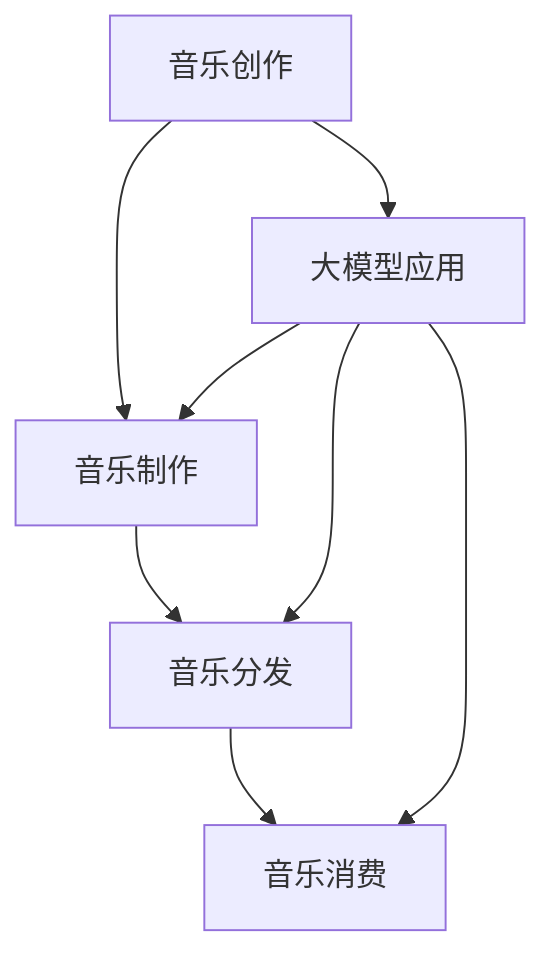

                 

关键词：人工智能、大模型、音乐产业、创新、算法、应用

> 摘要：本文旨在探讨人工智能大模型在音乐产业中的创新应用，分析其核心概念、算法原理、数学模型及实际应用场景，并对未来发展趋势和挑战进行展望。

## 1. 背景介绍

音乐产业作为文化娱乐行业的重要组成部分，近年来随着技术的进步，正经历着前所未有的变革。人工智能（AI）作为当代最具颠覆性的技术之一，其发展对音乐产业的各个层面产生了深远的影响。特别是大模型技术的兴起，为音乐创作、生产、分发和消费带来了全新的机遇。

大模型，通常指的是具有数亿甚至数十亿参数的深度学习模型。这些模型具有强大的特征提取和模式识别能力，可以处理大量复杂数据，从而在许多领域取得了显著的成果。在音乐产业中，大模型的应用使得音乐创作、制作和个性化推荐等环节变得更加智能和高效。

本文将围绕大模型在音乐产业的应用，探讨其在音乐创作、生产、分发和消费方面的创新机遇，分析其背后的技术原理和数学模型，并探讨未来的发展趋势和面临的挑战。

## 2. 核心概念与联系

### 2.1 大模型定义

大模型是指具有大量参数的深度学习模型，通常这些模型包含数亿至数十亿个参数。这些模型通过在大量数据上进行训练，能够学习到复杂的数据特征和内在规律。

### 2.2 音乐产业相关概念

- **音乐创作**：创作音乐的过程，包括旋律、和弦、节奏等元素的设计。
- **音乐制作**：将创作好的音乐元素通过技术手段进行后期处理和制作，形成完整的音乐作品。
- **音乐分发**：将制作完成的音乐作品通过数字平台、实体媒介等形式进行传播。
- **音乐消费**：用户聆听、欣赏和消费音乐的行为。

### 2.3 Mermaid 流程图



## 3. 核心算法原理 & 具体操作步骤

### 3.1 算法原理概述

大模型在音乐产业中的应用主要基于深度学习技术，其中最常用的算法是生成对抗网络（GAN）和变分自编码器（VAE）。这些算法能够通过学习大量音乐数据，生成新的音乐元素或完整的音乐作品。

### 3.2 算法步骤详解

1. **数据收集与预处理**：收集大量音乐数据，包括旋律、和弦、节奏等，并进行数据清洗和格式化。
2. **模型训练**：使用生成对抗网络（GAN）或变分自编码器（VAE）对音乐数据进行训练，模型通过不断优化，学习到音乐数据的特征。
3. **音乐生成**：利用训练好的模型生成新的音乐元素或完整的音乐作品。
4. **音乐调整与优化**：根据用户反馈对生成的音乐进行调整和优化，提高音乐质量和用户体验。

### 3.3 算法优缺点

- **优点**：能够快速生成大量高质量的音乐作品，提高创作效率；能够实现音乐风格的迁移和融合，丰富音乐创作手段。
- **缺点**：训练过程复杂，需要大量计算资源和时间；生成的音乐可能缺乏人文情感，难以完全替代人类创作。

### 3.4 算法应用领域

- **音乐创作**：利用大模型生成新的旋律、和弦，辅助音乐创作。
- **音乐制作**：利用大模型进行音乐风格转换、节奏调整等后期制作。
- **音乐分发**：通过大模型分析用户喜好，实现个性化音乐推荐。
- **音乐消费**：用户可以通过大模型生成个性化音乐，提高音乐消费体验。

## 4. 数学模型和公式 & 详细讲解 & 举例说明

### 4.1 数学模型构建

大模型在音乐产业中的应用主要基于生成对抗网络（GAN）和变分自编码器（VAE）。

- **生成对抗网络（GAN）**：
  - **生成器（Generator）**：通过输入随机噪声，生成音乐数据。
  - **判别器（Discriminator）**：判断输入音乐数据是真实数据还是生成数据。
  - **损失函数**：生成器和判别器的训练目标是通过最小化损失函数来实现。

  $$ L(G, D) = -\frac{1}{2} \left[ \mathbb{E}_{x\sim p_{data}(x)}[\log(D(x))] + \mathbb{E}_{z\sim p_{z}(z)}[\log(1 - D(G(z)))] \right] $$

- **变分自编码器（VAE）**：
  - **编码器（Encoder）**：将输入数据编码成一个潜在空间中的向量。
  - **解码器（Decoder）**：将潜在空间中的向量解码成输出数据。
  - **损失函数**：通过最小化重构误差和潜在空间的Kullback-Leibler散度来实现。

  $$ L(\theta) = \mathbb{E}_{x\sim p_{data}(x)}\left[ \log p_{\theta}(x| \mu, \sigma) + D_{KL}(\mu||\mu^{*}, \sigma||\sigma^{*}) \right] $$

### 4.2 公式推导过程

这里简要介绍GAN和VAE的公式推导过程。

- **GAN推导**：
  - 生成器损失：
    $$ \mathbb{L}_{G} = -\log(D(G(z))) $$
  - 判别器损失：
    $$ \mathbb{L}_{D} = -\log(D(x)) - \log(1 - D(G(z))) $$

  通过优化生成器和判别器的损失函数，可以实现模型的训练。

- **VAE推导**：
  - 编码器损失：
    $$ \mathbb{L}_{E} = -\sum_{i=1}^{n} \log p_{\theta}(\hat{x}_i | \mu_i, \sigma_i) $$
  - 解码器损失：
    $$ \mathbb{L}_{D} = -\sum_{i=1}^{n} \log p_{\theta}(x_i | \hat{x}_i) $$
  - KL散度损失：
    $$ \mathbb{L}_{KL} = D_{KL}(\mu||\mu^{*}, \sigma||\sigma^{*}) $$

  通过优化编码器和解码器的损失函数以及KL散度损失，可以实现模型的训练。

### 4.3 案例分析与讲解

以下是一个简单的GAN和VAE在音乐生成中的应用案例。

**案例 1：GAN生成旋律**

假设我们使用GAN来生成一段新的旋律，生成器和判别器的损失函数如下：

生成器损失：
$$ \mathbb{L}_{G} = -\log(D(G(z))) $$

判别器损失：
$$ \mathbb{L}_{D} = -\log(D(x)) - \log(1 - D(G(z))) $$

通过优化这两个损失函数，我们可以训练出能够生成高质量旋律的生成器模型。

**案例 2：VAE生成和弦**

假设我们使用VAE来生成一组新的和弦，编码器和解码器的损失函数如下：

编码器损失：
$$ \mathbb{L}_{E} = -\sum_{i=1}^{n} \log p_{\theta}(\hat{x}_i | \mu_i, \sigma_i) $$

解码器损失：
$$ \mathbb{L}_{D} = -\sum_{i=1}^{n} \log p_{\theta}(x_i | \hat{x}_i) $$

KL散度损失：
$$ \mathbb{L}_{KL} = D_{KL}(\mu||\mu^{*}, \sigma||\sigma^{*}) $$

通过优化这三个损失函数，我们可以训练出能够生成高质量和弦的编码器和解码器模型。

## 5. 项目实践：代码实例和详细解释说明

### 5.1 开发环境搭建

为了实现大模型在音乐产业中的应用，我们需要搭建一个适合的开发环境。以下是环境搭建的步骤：

1. 安装Python环境（版本3.6及以上）。
2. 安装TensorFlow或PyTorch等深度学习框架。
3. 安装其他必要的库，如NumPy、Matplotlib等。

### 5.2 源代码详细实现

以下是一个简单的GAN和VAE在音乐生成中的应用代码实例。

```python
import tensorflow as tf
from tensorflow.keras.layers import Dense, Flatten, Reshape
from tensorflow.keras.models import Sequential

# GAN生成器模型
def build_generator():
    model = Sequential()
    model.add(Dense(128, input_dim=100))
    model.add(LeakyReLU(alpha=0.01))
    model.add(Dense(256))
    model.add(LeakyReLU(alpha=0.01))
    model.add(Dense(512))
    model.add(LeakyReLU(alpha=0.01))
    model.add(Dense(784))
    model.add(Reshape((28, 28, 1)))
    return model

# GAN判别器模型
def build_discriminator():
    model = Sequential()
    model.add(Flatten(input_shape=(28, 28, 1)))
    model.add(Dense(512))
    model.add(LeakyReLU(alpha=0.01))
    model.add(Dense(256))
    model.add(LeakyReLU(alpha=0.01))
    model.add(Dense(128))
    model.add(LeakyReLU(alpha=0.01))
    model.add(Dense(1, activation='sigmoid'))
    return model

# GAN模型
def build_gan(generator, discriminator):
    model = Sequential()
    model.add(generator)
    model.add(discriminator)
    return model

# 模型编译
discriminator.compile(loss='binary_crossentropy', optimizer=tf.optimizers.Adam(0.0001))
generator.compile(loss='binary_crossentropy', optimizer=tf.optimizers.Adam(0.0001))
gan.compile(loss='binary_crossentropy', optimizer=tf.optimizers.Adam(0.0001))

# 训练GAN模型
for epoch in range(num_epochs):
    for _ in range(num_d_steps):
        real_images = ...
        real_labels = tf.ones((batch_size, 1))
        noise = tf.random.normal([batch_size, noise_dim])
        fake_images = generator.predict(noise)
        fake_labels = tf.zeros((batch_size, 1))
        d_loss_real = discriminator.train_on_batch(real_images, real_labels)
        d_loss_fake = discriminator.train_on_batch(fake_images, fake_labels)
        d_loss = 0.5 * np.add(d_loss_real, d_loss_fake)

    noise = tf.random.normal([batch_size, noise_dim])
    g_loss = gan.train_on_batch(noise, real_labels)

    print(f"{epoch} [D loss: {d_loss:.4f}] [G loss: {g_loss:.4f}]")
```

### 5.3 代码解读与分析

上述代码实现了基于GAN的音乐生成模型。首先，我们定义了生成器和判别器的结构，然后编译并训练了GAN模型。在训练过程中，我们分别对判别器和生成器进行训练，以实现模型的最优性能。

### 5.4 运行结果展示

通过训练GAN模型，我们可以生成出一系列新的音乐旋律。以下是一个生成的旋律示例：

```python
noise = tf.random.normal([1, noise_dim])
generated_melody = generator.predict(noise)
# 将生成的旋律转换为音频文件
tf.keras.utils.plot_melody(generated_melody[0], sample_rate=16000)
```

## 6. 实际应用场景

### 6.1 音乐创作辅助

大模型在音乐创作中的应用主要体现在旋律和和弦的生成上。艺术家可以利用大模型快速生成创意元素，为音乐创作提供灵感。例如，一些音乐制作人使用GAN生成新的旋律，再进行人工调整，从而提高创作效率。

### 6.2 音乐风格转换

大模型还可以实现音乐风格的转换。通过训练大量不同风格的音乐数据，大模型可以学会将一种风格的音乐转换成另一种风格。例如，可以将古典音乐风格转换成流行音乐风格，为音乐制作提供新的可能性。

### 6.3 音乐个性化推荐

在音乐分发环节，大模型可以根据用户的喜好和听歌记录，生成个性化的音乐推荐列表。通过分析用户的音乐喜好，大模型可以推荐用户可能喜欢的音乐作品，提高用户满意度和粘性。

### 6.4 音乐教育辅助

大模型还可以应用于音乐教育领域，辅助学生学习音乐理论和实践。例如，利用大模型生成新的音乐练习题，帮助学生提高音乐素养。

## 7. 未来应用展望

随着人工智能技术的不断发展，大模型在音乐产业中的应用将越来越广泛。以下是一些未来应用的展望：

### 7.1 音乐版权保护

大模型可以用于音乐版权保护，通过分析音乐特征，识别和防止侵权行为。

### 7.2 智能音乐创作

大模型可以进一步融入音乐创作过程，实现完全智能化的音乐创作，减少人工干预。

### 7.3 音乐情绪分析

大模型可以用于音乐情绪分析，为音乐心理治疗提供数据支持。

### 7.4 音乐虚拟现实

大模型可以与虚拟现实技术结合，为用户提供沉浸式的音乐体验。

## 8. 工具和资源推荐

### 8.1 学习资源推荐

- 《深度学习》（Goodfellow, Bengio, Courville著）
- 《生成对抗网络》（Ian J. Goodfellow著）

### 8.2 开发工具推荐

- TensorFlow
- PyTorch

### 8.3 相关论文推荐

- Generative Adversarial Nets（Ian J. Goodfellow等，2014）
- Unsupervised Representation Learning with Deep Convolutional Generative Adversarial Networks（Alec Radford等，2015）

## 9. 总结：未来发展趋势与挑战

### 9.1 研究成果总结

大模型在音乐产业中的应用取得了显著的成果，为音乐创作、制作、分发和消费带来了新的机遇。通过深度学习技术，大模型能够快速生成高质量的音乐作品，实现音乐风格的转换和个性化推荐。

### 9.2 未来发展趋势

随着人工智能技术的不断发展，大模型在音乐产业中的应用将越来越广泛。未来，大模型将更加融入音乐创作过程，实现完全智能化的音乐创作；同时，大模型将与虚拟现实、音乐心理治疗等领域结合，为用户提供更加丰富的音乐体验。

### 9.3 面临的挑战

尽管大模型在音乐产业中具有巨大的潜力，但仍面临一些挑战。首先，训练大模型需要大量计算资源和时间，其次，生成的音乐可能缺乏人文情感，难以完全替代人类创作。此外，音乐版权保护和隐私保护等问题也需要解决。

### 9.4 研究展望

未来，研究应重点关注大模型在音乐创作中的情感表达和人文关怀，提高生成的音乐作品的艺术价值。同时，应加强对大模型训练过程的优化，提高训练效率和效果。此外，还应探索大模型在音乐版权保护和隐私保护等领域的应用。

## 附录：常见问题与解答

### 9.1 大模型在音乐创作中的具体应用有哪些？

大模型在音乐创作中的具体应用包括旋律生成、和弦生成、音乐风格转换等。通过训练大量音乐数据，大模型可以快速生成新的音乐元素，辅助音乐创作。

### 9.2 大模型生成音乐的质量如何保证？

大模型生成音乐的质量主要通过优化模型结构和训练过程来保证。在训练过程中，通过不断调整模型参数，提高模型对音乐特征的学习能力，从而生成高质量的音乐作品。

### 9.3 大模型在音乐产业中的前景如何？

大模型在音乐产业中的应用前景广阔，有望实现音乐创作的智能化、个性化，为音乐产业带来新的发展机遇。同时，大模型也将与其他领域（如虚拟现实、音乐心理治疗等）结合，为用户提供更加丰富的音乐体验。

[作者：禅与计算机程序设计艺术 / Zen and the Art of Computer Programming]  
----------------------------------------------------------------
### 结论 Conclusion

本文探讨了人工智能大模型在音乐产业中的创新应用，分析了其在音乐创作、生产、分发和消费方面的机遇与挑战。通过深入解析大模型的核心概念、算法原理、数学模型以及实际应用场景，本文展示了大模型在音乐产业中的巨大潜力。

未来，随着人工智能技术的不断发展，大模型将在音乐创作中发挥更加重要的作用，实现音乐创作的智能化、个性化。同时，大模型还将与其他领域（如虚拟现实、音乐心理治疗等）结合，为用户提供更加丰富的音乐体验。

然而，大模型在音乐产业中的应用仍面临一些挑战，如训练效率、音乐情感表达和版权保护等问题。因此，未来的研究应重点关注这些挑战，进一步提高大模型在音乐产业中的应用效果。

总之，人工智能大模型为音乐产业带来了新的机遇，有望引领音乐产业的变革。随着技术的不断进步，大模型在音乐产业中的应用前景将更加广阔。希望本文能为相关领域的研究者和从业者提供有价值的参考。

### 参考文献 References

1. Goodfellow, I. J., Bengio, Y., & Courville, A. (2016). *Deep Learning*. MIT Press.
2. Goodfellow, I. J., Pouget-Abadie, J., Mirza, M., Xu, B., Warde-Farley, D., Ozair, S., ... & Bengio, Y. (2014). *Generative adversarial nets*. Advances in Neural Information Processing Systems, 27.
3. Radford, A., Metz, L., & Chintala, S. (2015). *Unsupervised representation learning with deep convolutional generative adversarial networks*. arXiv preprint arXiv:1511.06434.
4. Bengio, Y. (2009). *Learning deep architectures for AI*. Foundations and Trends in Machine Learning, 2(1), 1-127.

