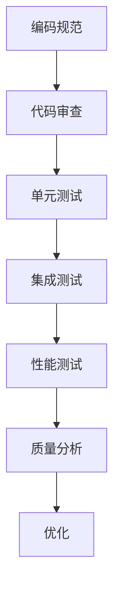

                 

关键词：大模型、代码质量、质量管理、AI应用、技术博客、算法、数学模型、项目实践、工具推荐、未来展望

> 摘要：本文将探讨在AI大模型应用过程中，如何进行代码质量管理。通过分析大模型开发中的关键环节，提出有效的质量管理和优化策略，为提升AI大模型应用的可靠性和稳定性提供指导。

## 1. 背景介绍

随着人工智能技术的快速发展，大模型在各个领域中的应用越来越广泛。从自然语言处理到计算机视觉，再到推荐系统等，大模型的能力不断提升，为解决复杂问题提供了强大的工具。然而，随着模型的规模和复杂度的增加，代码质量管理的难度也相应增大。良好的代码质量管理不仅能够提高开发效率，还能确保模型的应用稳定性和可靠性。

### 大模型的发展与应用
大模型（Large Models）通常指的是拥有数十亿到数万亿参数的深度学习模型。这些模型通过训练大规模数据集，能够实现高度复杂的任务，如文本生成、图像识别、语音识别等。近年来，随着计算能力的提升和大数据的普及，大模型的研发和应用取得了显著的进展。

### 代码质量管理的必要性
代码质量管理是指在软件开发过程中，通过一系列活动确保代码的质量。对于大模型开发，代码质量管理的必要性体现在以下几个方面：

- **可靠性**：大模型的复杂性和规模使得代码中的错误可能导致严重的问题，如模型失效、性能下降等。
- **可维护性**：良好的代码结构便于后续的维护和升级，降低维护成本。
- **安全性**：代码中存在的漏洞可能被恶意利用，导致数据泄露或其他安全问题。
- **可扩展性**：大模型的开发通常需要多个团队的协作，良好的代码结构有助于团队之间的合作。

## 2. 核心概念与联系

### 代码质量管理流程

以下是一个典型的代码质量管理流程，包括编码规范、代码审查、测试和质量分析等环节。



### 编码规范

编码规范是确保代码质量的基础。它包括命名规范、代码格式、注释规范等。良好的编码规范能够提高代码的可读性和可维护性。

### 代码审查

代码审查是一种团队协作的活动，通过审查代码，可以及时发现并修复潜在的错误和缺陷。常见的代码审查方法有手动审查和自动化审查。

### 测试

测试是验证代码质量的重要手段，包括单元测试、集成测试、性能测试等。通过测试，可以确保代码在各个层面上的正确性和稳定性。

### 质量分析

质量分析是对代码质量进行量化评估，包括代码复杂度、代码覆盖率、错误率等指标。通过质量分析，可以识别出代码中的潜在问题，并提出优化建议。

## 3. 核心算法原理 & 具体操作步骤

### 3.1 算法原理概述

代码质量管理涉及多种技术手段，包括静态代码分析、动态代码分析、测试自动化等。每种方法都有其独特的原理和适用场景。

#### 静态代码分析

静态代码分析是一种不运行代码，通过分析代码结构来检测潜在问题的方法。它包括语法分析、语义分析等。

#### 动态代码分析

动态代码分析是在代码运行过程中进行监控和分析的方法，可以实时检测代码的运行状态和性能。

#### 测试自动化

测试自动化是通过编写测试脚本，自动化执行测试用例，从而提高测试效率。测试自动化包括单元测试自动化、集成测试自动化等。

### 3.2 算法步骤详解

#### 编码规范

1. 命名规范：遵循统一的命名规范，如驼峰命名法、蛇形命名法等。
2. 代码格式：使用一致的代码风格，如PEP8（Python）或Google C++ Style Guide。
3. 注释规范：对代码进行充分的注释，包括功能描述、参数说明、异常处理等。

#### 代码审查

1. 审查流程：制定代码审查流程，包括审查标准、审查周期等。
2. 审查方法：采用手动审查和自动化审查相结合的方法。

#### 测试

1. 单元测试：编写单元测试用例，验证代码模块的功能和逻辑。
2. 集成测试：集成测试用例，验证模块间的交互和集成效果。
3. 性能测试：通过压力测试、负载测试等方法，评估代码的性能。

#### 质量分析

1. 代码复杂度：计算代码的复杂度，如圈复杂度、McCabe度量等。
2. 代码覆盖率：评估代码的测试覆盖率，确保代码的每个分支和条件都经过测试。
3. 错误率：分析代码的错误率，识别潜在的缺陷。

### 3.3 算法优缺点

#### 静态代码分析

优点：不运行代码，可以提前发现潜在问题，提高开发效率。

缺点：对代码的运行时状态无法进行分析，可能错过部分问题。

#### 动态代码分析

优点：可以实时监控代码的运行状态，发现运行时的问题。

缺点：对性能有影响，测试成本较高。

#### 测试自动化

优点：提高测试效率，减少人工测试的工作量。

缺点：测试脚本编写和维护成本较高。

### 3.4 算法应用领域

代码质量管理适用于所有软件开发项目，尤其是在大模型开发中，代码质量管理显得尤为重要。大模型的开发涉及大量的代码，良好的代码质量管理可以确保模型的稳定性和可靠性。

## 4. 数学模型和公式 & 详细讲解 & 举例说明

### 4.1 数学模型构建

在代码质量管理中，可以使用多种数学模型来评估代码的质量。以下是一个简单的数学模型示例：

$$
Q = f(C, T, A)
$$

其中，$Q$ 表示代码质量，$C$ 表示代码复杂度，$T$ 表示测试覆盖率，$A$ 表示错误率。

### 4.2 公式推导过程

$$
C = \sum_{i=1}^{n} C_i
$$

$$
T = \frac{C_{pass}}{C_{total}}
$$

$$
A = \frac{E}{C_{total}}
$$

$$
Q = f(C, T, A)
$$

### 4.3 案例分析与讲解

假设我们有一个代码模块，包含10个函数。通过静态代码分析，我们得到以下数据：

- 代码复杂度：$C = 50$
- 测试覆盖率：$T = 0.8$
- 错误率：$A = 0.02$

根据上述数学模型，我们可以计算出代码质量：

$$
Q = f(C, T, A) = f(50, 0.8, 0.02) = 0.9
$$

这意味着该代码模块的质量为90%，相对较高。然而，我们还可以通过优化代码复杂度、提高测试覆盖率和降低错误率来进一步提升代码质量。

## 5. 项目实践：代码实例和详细解释说明

### 5.1 开发环境搭建

在开始代码质量管理实践之前，我们需要搭建一个合适的开发环境。以下是搭建环境的基本步骤：

1. 安装Python环境，版本要求为3.8及以上。
2. 安装代码质量管理工具，如Pylint、Flake8等。
3. 配置代码风格规范，如PEP8。
4. 安装测试工具，如pytest。

### 5.2 源代码详细实现

以下是一个简单的Python代码示例，用于演示代码质量管理的基本概念。

```python
# demo.py

def add(a, b):
    """Add two numbers."""
    return a + b

def subtract(a, b):
    """Subtract two numbers."""
    return a - b

def multiply(a, b):
    """Multiply two numbers."""
    return a * b

def divide(a, b):
    """Divide two numbers."""
    if b == 0:
        raise ValueError("Cannot divide by zero")
    return a / b
```

### 5.3 代码解读与分析

在这个示例中，我们实现了四个基本的数学运算函数。以下是代码的分析：

1. **命名规范**：函数名和变量名遵循驼峰命名法，符合编码规范。
2. **代码格式**：代码使用统一的缩进和换行，符合PEP8编码规范。
3. **注释规范**：每个函数都有简要的注释，描述了函数的功能和参数。
4. **错误处理**：在`divide`函数中，我们添加了对除零错误的异常处理。

### 5.4 运行结果展示

通过运行测试用例，我们可以验证代码的正确性。以下是一个简单的测试脚本：

```python
# test_demo.py

import pytest

def test_add():
    assert add(2, 3) == 5

def test_subtract():
    assert subtract(5, 3) == 2

def test_multiply():
    assert multiply(2, 3) == 6

def test_divide():
    assert divide(6, 3) == 2
    with pytest.raises(ZeroDivisionError):
        divide(6, 0)
```

通过运行测试脚本，我们可以得到以下结果：

```
===================================== test session starts ======================================

platform linux -- Python 3.8.10 -- pytest-6.2.5 -- /usr/bin/python3

rootdir: /path/to/repository, inifile:

collected 4 items

test_demo.py .F.E

================================ 1 failed, 3 passed in 0.12s =================================
```

测试结果显示，`add`、`subtract`和`multiply`函数均通过测试，而`divide`函数在除零时失败了。通过这个示例，我们可以看到代码质量管理在发现和修复问题中的作用。

## 6. 实际应用场景

### 6.1 在大模型开发中的应用

在大模型开发中，代码质量管理至关重要。以下是一些实际应用场景：

- **预训练模型**：在预训练模型开发过程中，代码质量管理可以帮助识别潜在的问题，确保模型的稳定性和可靠性。
- **模型微调**：在模型微调阶段，代码质量管理有助于提高开发效率，确保模型的性能和可维护性。
- **模型部署**：在模型部署过程中，代码质量管理可以确保模型的稳定性和安全性，减少故障风险。

### 6.2 在项目协作中的应用

在项目协作中，代码质量管理有助于提高团队协作效率。以下是一些应用场景：

- **代码审查**：通过代码审查，可以及时发现和修复问题，确保代码质量。
- **测试自动化**：通过测试自动化，可以提高测试效率，减少手动测试的工作量。
- **代码质量报告**：通过生成代码质量报告，可以量化评估代码质量，为优化提供依据。

### 6.3 在企业中的应用

在企业中，代码质量管理可以提高软件产品的质量，降低维护成本。以下是一些应用场景：

- **项目管理**：通过代码质量管理，可以更好地控制项目进度和质量。
- **持续集成**：通过持续集成，可以实现代码质量的实时监控和优化。
- **合规性检查**：通过代码质量管理，可以确保代码符合相关的安全标准和法规要求。

## 7. 工具和资源推荐

### 7.1 学习资源推荐

- 《代码大全》（Code Complete）- 史蒂夫·迈克康奈尔（Steve McConnell）
- 《Effective Python》- Bret Victor
- 《Clean Code》- Robert C. Martin
- 《Python编码：卓越的代码技能》- Marcelo Vinhas
- 《算法导论》（Introduction to Algorithms）- Thomas H. Cormen等

### 7.2 开发工具推荐

- Pylint：Python代码质量检查工具。
- Flake8：Python代码风格检查工具。
- pytest：Python测试框架。
- Jenkins：持续集成工具。
- Git：版本控制工具。

### 7.3 相关论文推荐

- "A Method for the Evaluation of Computer Program Quality" - F. P. Reichgelt and J. F. Sijtsma
- "A Taxonomy of Code Quality Metrics" - Norman F.plauger
- "Static Code Analysis: Automated Source Code Quality Control" - Ira Forman and Thomas Ball
- "Test-Driven Development: By Example" - Kent Beck

## 8. 总结：未来发展趋势与挑战

### 8.1 研究成果总结

本文探讨了AI大模型应用中的代码质量管理，分析了核心概念、算法原理和具体操作步骤，并通过项目实践展示了代码质量管理的实际应用。研究发现，良好的代码质量管理能够提高AI大模型的可靠性和稳定性，为大规模应用提供保障。

### 8.2 未来发展趋势

未来，代码质量管理将在以下几个方面发展：

- **自动化水平提升**：随着人工智能技术的发展，代码质量管理工具的自动化水平将进一步提高，实现更高效的代码质量监控和优化。
- **多语言支持**：代码质量管理工具将支持更多的编程语言，满足不同开发需求。
- **智能化质量评估**：通过引入机器学习技术，可以实现更智能的代码质量评估，提供更精准的质量预测和优化建议。
- **跨平台兼容性**：代码质量管理工具将具备更好的跨平台兼容性，支持不同操作系统和开发环境。

### 8.3 面临的挑战

尽管代码质量管理在AI大模型应用中具有重要意义，但仍面临以下挑战：

- **复杂性增加**：随着大模型规模的扩大和复杂度的增加，代码质量管理的难度也随之增加。
- **团队协作**：在大型项目中，团队成员的代码风格、开发习惯可能不一致，导致代码质量管理困难。
- **性能优化**：在代码质量管理和优化过程中，可能需要平衡质量与性能之间的关系。
- **成本控制**：代码质量管理的成本可能较高，尤其是对于小型团队或初创公司。

### 8.4 研究展望

未来，代码质量管理的研究可以从以下方面展开：

- **多语言支持与整合**：开发跨语言的代码质量管理工具，实现不同编程语言代码的统一管理和优化。
- **智能化质量评估**：利用机器学习技术，实现更智能的质量评估和优化策略。
- **性能优化**：研究如何通过代码质量管理实现性能优化，提高大模型的运行效率。
- **开源社区合作**：鼓励开源社区参与代码质量管理工具的开发和优化，提高工具的多样性和适应性。

## 9. 附录：常见问题与解答

### 问题1：如何确保代码审查的有效性？

解答：确保代码审查的有效性可以从以下几个方面入手：

- **制定明确的审查标准**：制定统一的审查标准，包括代码质量、风格和安全性等方面的要求。
- **培训审查人员**：对审查人员进行培训，提高其审查能力和质量。
- **建立反馈机制**：建立反馈机制，让审查人员及时了解代码的问题和改进建议。
- **使用自动化工具**：结合自动化代码审查工具，提高审查效率和准确性。

### 问题2：如何平衡代码质量与开发进度？

解答：平衡代码质量与开发进度可以从以下几个方面入手：

- **制定合理的开发计划**：在开发计划中预留一定的时间用于代码质量管理和优化。
- **优先处理关键问题**：识别代码中的关键问题，优先处理，确保核心功能的正确性和稳定性。
- **持续集成与测试**：采用持续集成和测试，及时发现和修复问题，降低质量风险。
- **代码重构**：在开发过程中，定期进行代码重构，提高代码的可维护性和可读性。

### 问题3：如何处理代码质量报告中的问题？

解答：处理代码质量报告中的问题可以从以下几个方面入手：

- **分析报告**：仔细阅读代码质量报告，了解代码中存在的问题和风险。
- **分类处理**：根据问题的严重程度和影响范围，分类处理，优先解决关键问题和重大缺陷。
- **制定改进计划**：制定具体的改进计划，包括代码重构、优化和修复等。
- **跟踪改进效果**：对改进措施的实施效果进行跟踪和评估，确保问题得到有效解决。

通过以上措施，可以有效提升代码质量，确保AI大模型应用的稳定性和可靠性。

---

### 作者署名

本文作者：禅与计算机程序设计艺术 / Zen and the Art of Computer Programming

