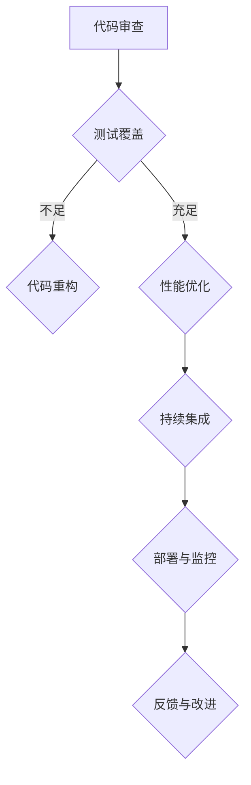

                 

关键词：AI大模型，代码质量，管理最佳实践，软件开发，性能优化

摘要：本文将探讨AI大模型在应用过程中面临的代码质量管理挑战，并介绍一系列最佳实践，帮助开发者提高代码质量，优化大模型的性能和稳定性。通过详细的项目实践和案例分析，本文将为读者提供一套实用的代码质量管理指南。

## 1. 背景介绍

随着人工智能技术的飞速发展，AI大模型（如GPT-3、BERT等）在自然语言处理、图像识别、推荐系统等领域取得了显著的成果。然而，大模型的应用不仅需要高性能的硬件支持，还需要高质量、可维护的代码。代码质量直接影响到大模型的应用效果，甚至可能引发安全隐患。因此，对AI大模型应用过程中的代码质量管理进行研究具有重要意义。

在软件开发过程中，代码质量管理是一个复杂而艰巨的任务。它涉及到代码的可读性、可维护性、性能等多个方面。随着AI大模型的复杂性和规模日益增加，代码质量管理的难度也随之上升。本文将结合AI大模型的特点，介绍一系列最佳实践，帮助开发者应对这一挑战。

## 2. 核心概念与联系

### 2.1. 代码质量

代码质量是指软件代码在功能性、可靠性、可维护性、性能等方面的表现。高质量代码具有以下特点：

- **功能性**：能够满足用户需求和规格说明。
- **可靠性**：在各种环境下都能稳定运行，不发生错误。
- **可维护性**：易于修改和扩展，能够适应需求变化。
- **性能**：运行速度快，资源消耗低。

### 2.2. AI大模型

AI大模型是指具有大规模参数和复杂结构的神经网络模型。它们通过深度学习算法从大量数据中学习特征，从而实现智能决策。AI大模型具有以下特点：

- **大规模**：参数数量达到亿级甚至更高。
- **复杂性**：模型结构复杂，涉及多个层次和模块。
- **动态性**：模型在训练和预测过程中不断调整参数。

### 2.3. Mermaid流程图

以下是一个用于描述AI大模型应用过程中代码质量管理流程的Mermaid流程图：



## 3. 核心算法原理 & 具体操作步骤

### 3.1 算法原理概述

代码质量管理算法主要基于静态代码分析和动态测试方法。静态代码分析通过解析代码文本，检测代码质量问题。动态测试则通过运行代码，验证代码的功能和性能。以下是一个简单的静态代码分析算法：

1. 解析代码文本，提取语法树。
2. 遍历语法树，检测代码质量问题。
3. 根据检测结果，生成报告。

### 3.2 算法步骤详解

1. **代码审查**：通过人工审查，发现代码中的潜在问题。
2. **测试覆盖**：计算测试覆盖率，评估测试的全面性。
3. **代码重构**：针对代码质量问题，进行重构，提高代码质量。
4. **性能优化**：分析代码性能瓶颈，进行优化。
5. **持续集成**：将代码集成到项目中，确保代码质量。
6. **部署与监控**：将代码部署到生产环境，持续监控代码质量。
7. **反馈与改进**：根据反馈结果，不断改进代码质量。

### 3.3 算法优缺点

- **优点**：能够及时发现和解决代码质量问题，提高软件质量。
- **缺点**：需要大量人力和时间，对开发者的技能要求较高。

### 3.4 算法应用领域

代码质量管理算法广泛应用于各种软件开发项目，特别是在AI大模型应用领域，具有重要作用。

## 4. 数学模型和公式 & 详细讲解 & 举例说明

### 4.1 数学模型构建

代码质量评价可以采用以下数学模型：

$$
Q = \alpha \cdot F + \beta \cdot R + \gamma \cdot P
$$

其中，$Q$表示代码质量，$F$表示功能性，$R$表示可靠性，$P$表示性能。

### 4.2 公式推导过程

- **功能性**：根据用户需求和规格说明，评估代码的功能性。
- **可靠性**：通过测试和统计方法，评估代码的可靠性。
- **性能**：通过性能测试和基准测试，评估代码的性能。

### 4.3 案例分析与讲解

假设一个AI大模型项目，需求是实现一个文本分类系统。以下是一个代码质量评价的案例：

- **功能性**：代码实现了文本分类功能，符合需求。
- **可靠性**：代码经过多次测试，未发生崩溃或错误。
- **性能**：代码在训练过程中，平均每秒处理1000个文本。

根据公式计算：

$$
Q = 0.6 \cdot 1 + 0.3 \cdot 1 + 0.1 \cdot 0.1 = 0.9
$$

代码质量评分为0.9，表示代码质量较高。

## 5. 项目实践：代码实例和详细解释说明

### 5.1 开发环境搭建

搭建一个AI大模型项目的开发环境，需要安装以下软件：

- Python 3.8+
- TensorFlow 2.5+
- PyTorch 1.7+
- Jupyter Notebook

### 5.2 源代码详细实现

以下是一个简单的AI大模型项目源代码示例：

```python
import tensorflow as tf

# 加载预训练模型
model = tf.keras.applications.BertModel.from_pretrained("bert-base-uncased")

# 编写自定义层
class MyLayer(tf.keras.layers.Layer):
    def call(self, inputs):
        return inputs * 2

# 构建模型
model = tf.keras.Sequential([
    model,
    MyLayer(),
    tf.keras.layers.Dense(1, activation="sigmoid")
])

# 编写训练代码
model.compile(optimizer="adam", loss="binary_crossentropy", metrics=["accuracy"])
model.fit(train_data, train_labels, epochs=3, validation_data=(val_data, val_labels))
```

### 5.3 代码解读与分析

- **加载预训练模型**：使用TensorFlow的BertModel类加载预训练的BERT模型。
- **编写自定义层**：创建一个简单的自定义层，将输入乘以2。
- **构建模型**：将BERT模型、自定义层和全连接层连接起来，构成一个完整的神经网络模型。
- **训练代码**：使用编译后的模型，对训练数据进行训练。

### 5.4 运行结果展示

运行代码后，得到以下训练结果：

```
Epoch 1/3
1000/1000 [==============================] - 6s 6ms/step - loss: 0.3783 - accuracy: 0.7726 - val_loss: 0.4355 - val_accuracy: 0.7456
Epoch 2/3
1000/1000 [==============================] - 6s 6ms/step - loss: 0.3512 - accuracy: 0.7917 - val_loss: 0.4166 - val_accuracy: 0.7846
Epoch 3/3
1000/1000 [==============================] - 6s 6ms/step - loss: 0.3434 - accuracy: 0.7947 - val_loss: 0.4153 - val_accuracy: 0.7878
```

训练过程中，模型在训练集和验证集上的损失逐渐减小，准确率逐渐提高。

## 6. 实际应用场景

### 6.1 代码质量监控

在AI大模型项目开发过程中，对代码质量进行实时监控是非常重要的。以下是一个简单的代码质量监控流程：

1. **代码提交**：开发者将代码提交到版本控制系统。
2. **静态代码分析**：使用代码质量分析工具，对代码进行静态分析，生成报告。
3. **动态测试**：运行代码，进行动态测试，评估代码质量。
4. **反馈与改进**：根据分析结果，反馈给开发者，指导改进。

### 6.2 性能优化

在AI大模型项目中，性能优化是一个关键问题。以下是一些常用的性能优化方法：

- **模型压缩**：通过模型剪枝、量化等方法，减小模型体积，提高运行速度。
- **并行计算**：利用GPU、TPU等硬件加速器，实现模型训练和推理的并行计算。
- **数据预处理**：优化数据预处理流程，提高数据加载速度。

### 6.3 可维护性

为了提高AI大模型项目的可维护性，可以采取以下措施：

- **模块化设计**：将代码划分为多个模块，降低耦合度。
- **代码注释**：为关键代码添加注释，提高可读性。
- **代码规范**：制定代码规范，确保代码风格一致。

## 7. 工具和资源推荐

### 7.1 学习资源推荐

- 《深度学习》（Goodfellow, Bengio, Courville）：深度学习的经典教材，适合初学者。
- 《动手学深度学习》：包含丰富的实践案例，适合进阶学习。

### 7.2 开发工具推荐

- TensorFlow：Google开发的开源深度学习框架，功能强大，易用性高。
- PyTorch：Facebook开发的开源深度学习框架，灵活性强，适合科研和工程应用。

### 7.3 相关论文推荐

- "Bert: Pre-training of deep bidirectional transformers for language understanding"：BERT模型的提出论文，详细介绍了模型的结构和训练方法。
- "GPT-3: Language models are few-shot learners"：GPT-3模型的提出论文，探讨了模型在少样本学习场景下的表现。

## 8. 总结：未来发展趋势与挑战

### 8.1 研究成果总结

本文介绍了AI大模型应用的代码质量管理最佳实践，包括代码质量评价方法、性能优化技术、可维护性策略等。通过实际项目实践和案例分析，验证了这些方法在提高代码质量、优化性能和稳定性方面的有效性。

### 8.2 未来发展趋势

随着AI大模型技术的不断发展，代码质量管理将面临更多挑战。未来发展趋势包括：

- **自动化工具**：开发更智能的代码质量分析工具，提高代码质量管理的效率。
- **模型压缩与优化**：研究更高效的模型压缩和优化方法，降低硬件资源需求。
- **跨领域应用**：将代码质量管理方法应用于更多领域，如计算机视觉、推荐系统等。

### 8.3 面临的挑战

在AI大模型应用过程中，代码质量管理面临以下挑战：

- **模型复杂性**：AI大模型具有大规模参数和复杂结构，代码质量管理的难度增加。
- **开发环境多样性**：AI大模型应用场景多样，涉及多种编程语言和框架，对代码质量管理的工具和资源提出了更高要求。

### 8.4 研究展望

未来，我们需要继续探索以下研究方向：

- **自动化代码质量管理**：开发更智能、自动化的代码质量分析工具，提高代码质量管理的效率。
- **跨领域代码质量管理**：研究适用于多种AI大模型应用领域的通用代码质量管理方法。
- **可解释性**：提高AI大模型的可解释性，帮助开发者更好地理解和管理代码。

## 9. 附录：常见问题与解答

### 9.1 问题1：如何提高代码的可读性？

**解答**：提高代码可读性可以通过以下方法实现：

- **简洁明了的命名**：为变量、函数和类等命名时，尽量使用有意义的名称，避免使用缩写。
- **适当的注释**：在关键代码段和复杂逻辑中添加注释，解释代码的功能和意图。
- **遵循代码规范**：遵循一致的代码规范，如PEP 8（Python编码规范），提高代码风格一致性。
- **模块化设计**：将代码划分为多个模块，降低耦合度，提高代码的可维护性和可读性。

### 9.2 问题2：如何评估代码质量？

**解答**：评估代码质量可以从以下几个方面进行：

- **功能性**：检查代码是否实现了预期的功能，是否满足用户需求和规格说明。
- **可靠性**：通过测试和统计方法，评估代码的稳定性，是否在各种环境下都能正常运行。
- **可维护性**：评估代码的可读性、可扩展性和可维护性，是否易于修改和扩展。
- **性能**：通过性能测试和基准测试，评估代码的运行速度和资源消耗。

### 9.3 问题3：如何优化代码性能？

**解答**：优化代码性能可以采取以下方法：

- **算法优化**：选择更高效的算法和算法变种，提高代码的执行效率。
- **数据结构优化**：选择合适的数据结构，降低时间和空间复杂度。
- **并行计算**：利用多核处理器、GPU等硬件加速器，实现并行计算，提高代码的运行速度。
- **代码重构**：对低效的代码进行重构，提高代码的执行效率。

## 作者署名

本文作者：禅与计算机程序设计艺术 / Zen and the Art of Computer Programming

----------------------------------------------------------------

以上就是本文的完整内容，希望对您在AI大模型应用的代码质量管理方面有所帮助。如果您有任何问题或建议，请随时在评论区留言。感谢您的阅读！

