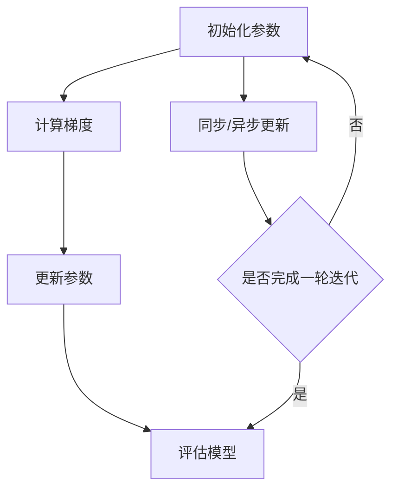

                 

关键词：人工智能、大模型、分布式架构、机器学习、系统设计、模型训练、计算优化、资源调度、数据流管理、性能提升

> 摘要：本文旨在探讨AI大模型应用的分布式架构演进，从背景介绍、核心概念与联系、核心算法原理、数学模型与公式、项目实践、实际应用场景、工具和资源推荐等方面，深入分析大模型在分布式架构中的应用与挑战，为AI领域的技术发展和产业应用提供有价值的参考。

## 1. 背景介绍

### 1.1 AI大模型的发展历程

随着人工智能技术的迅猛发展，大模型（Large Models）成为当前研究的热点。从早期的浅层模型，如SVM、朴素贝叶斯等，到深度学习时代的卷积神经网络（CNN）和循环神经网络（RNN），再到如今的大型预训练模型（如GPT-3、BERT等），AI大模型在语言理解、图像识别、自然语言处理、语音识别等领域取得了显著的成果。这些大模型通常具有数十亿到千亿级别的参数，需要大量的计算资源和数据支持。

### 1.2 分布式架构的重要性

在AI大模型的应用场景中，计算资源和数据规模的指数级增长使得单机架构无法满足需求。分布式架构作为一种高效、可扩展的解决方案，可以充分利用多台计算设备的资源，实现并行计算和数据分片，从而提升模型的训练效率和推理性能。分布式架构不仅在计算能力上具有优势，还能提高系统的容错性和灵活性。

### 1.3 本文的研究目的

本文旨在探讨AI大模型应用的分布式架构演进，分析分布式架构的核心概念、算法原理、数学模型、实践应用，以及面临的挑战和未来发展趋势。通过本文的研究，旨在为AI领域的技术发展和产业应用提供有价值的参考。

## 2. 核心概念与联系

### 2.1 分布式架构的基本原理

分布式架构的核心思想是将系统拆分成多个独立的节点，这些节点通过网络进行通信，共同完成计算任务。分布式架构的优点包括：

- **可扩展性**：可以通过增加节点来扩展系统规模，满足不断增长的计算需求。
- **容错性**：部分节点的故障不会影响整个系统的运行，提高了系统的可靠性。
- **性能提升**：通过并行计算和数据分片，显著提高系统的计算和数据处理能力。

### 2.2 大模型分布式训练的关键技术

大模型分布式训练主要涉及以下几个方面：

- **参数服务器（Parameter Server）**：将模型参数存储在服务器上，各个计算节点从服务器获取参数并更新。
- **数据分片（Data Sharding）**：将大规模数据集分片存储在多个节点上，各个节点分别处理自己的数据。
- **同步与异步训练**：同步训练需要所有节点完成当前梯度计算后再更新全局参数；异步训练允许节点独立更新参数，减少了通信开销。
- **负载均衡（Load Balancing）**：通过合理的调度策略，将任务分配到各个节点，避免资源浪费和性能瓶颈。

### 2.3 Mermaid流程图



## 3. 核心算法原理 & 具体操作步骤

### 3.1 算法原理概述

大模型分布式训练的核心算法是梯度下降法。在分布式架构中，梯度下降法可以分为同步训练和异步训练两种方式。

- **同步训练**：所有计算节点共同完成一轮梯度计算后，将各自更新的参数发送给参数服务器，再由参数服务器统一更新全局参数。
- **异步训练**：各个计算节点独立完成梯度计算并更新本地参数，然后异步发送更新到参数服务器。

### 3.2 算法步骤详解

1. **初始化参数**：在分布式架构中，参数服务器初始化全局参数，并分发到各个计算节点。
2. **计算梯度**：各个计算节点分别处理自己的数据，计算模型的梯度。
3. **更新参数**：计算节点将梯度发送给参数服务器，参数服务器对全局参数进行更新。
4. **评估模型**：对训练完成的模型进行评估，以验证模型的性能。
5. **同步/异步更新**：根据训练策略，选择同步或异步更新参数。
6. **迭代训练**：重复执行步骤2-5，直到满足训练条件。

### 3.3 算法优缺点

#### 优点：

- **并行计算**：利用多台计算设备进行并行计算，显著提高训练效率。
- **可扩展性**：可以方便地扩展计算资源，满足大规模数据集的训练需求。
- **容错性**：部分节点的故障不会影响整个系统的运行。

#### 缺点：

- **通信开销**：同步训练需要大量通信开销，异步训练虽然减少了通信开销，但可能导致参数更新不一致。
- **调度复杂度**：分布式训练需要复杂的调度策略，以保证负载均衡和性能优化。

### 3.4 算法应用领域

大模型分布式训练在多个领域具有广泛应用，如：

- **自然语言处理**：例如GPT-3、BERT等大型语言模型。
- **计算机视觉**：例如ImageNet大规模图像识别挑战。
- **语音识别**：例如WaveNet语音合成模型。

## 4. 数学模型和公式 & 详细讲解 & 举例说明

### 4.1 数学模型构建

在分布式训练中，常用的数学模型是梯度下降法。假设有n个计算节点，每个节点分别处理数据集的一部分，并计算梯度。设全局参数为θ，梯度为∇θ，学习率为α，则分布式梯度下降法的公式为：

$$
θ \leftarrow θ - α \frac{1}{n} \sum_{i=1}^{n} \nabla_{θ} L(\theta, x_i, y_i)
$$

其中，$L(\theta, x_i, y_i)$为损失函数，$x_i, y_i$为样本数据和标签。

### 4.2 公式推导过程

分布式梯度下降法的推导过程如下：

1. **初始化参数**：设定初始参数θ。
2. **计算局部梯度**：每个计算节点分别计算局部梯度∇θL(θ, xi, yi)。
3. **汇总局部梯度**：将所有计算节点的局部梯度求和，得到全局梯度。
4. **更新参数**：使用全局梯度更新全局参数。
5. **评估模型**：评估更新后的模型性能。

### 4.3 案例分析与讲解

假设有一个包含1000个训练样本的数据集，使用5个计算节点进行分布式训练。每个节点处理200个样本。设学习率α为0.1。

1. **初始化参数**：随机初始化全局参数θ。
2. **计算局部梯度**：每个计算节点分别计算局部梯度。
   - 节点1：计算梯度∇θL(θ, x1, y1)。
   - 节点2：计算梯度∇θL(θ, x2, y2)。
   - ... ...
   - 节点5：计算梯度∇θL(θ, x5, y5)。
3. **汇总局部梯度**：将所有计算节点的局部梯度求和，得到全局梯度。
4. **更新参数**：使用全局梯度更新全局参数。
5. **评估模型**：评估更新后的模型性能。

通过上述步骤，实现分布式训练的过程。

## 5. 项目实践：代码实例和详细解释说明

### 5.1 开发环境搭建

1. **安装Python**：确保安装Python 3.6及以上版本。
2. **安装TensorFlow**：在终端执行以下命令安装TensorFlow：
   ```bash
   pip install tensorflow
   ```
3. **安装分布式计算库**：安装TensorFlow的分布式计算库TensorFlow Distlib：
   ```bash
   pip install tensorflow-distlib
   ```

### 5.2 源代码详细实现

```python
import tensorflow as tf
import tensorflow_distlib as tfdl

# 初始化参数服务器和计算节点
psHosts = ['ps0:2222', 'ps1:2222']
workerHosts = ['worker0:2222', 'worker1:2222', 'worker2:2222', 'worker3:2222', 'worker4:2222']
clusterSpec = {
    'ps': psHosts,
    'worker': workerHosts
}
server = tfdl.Server.create(clusterSpec, job='ps')
worker = tfdl.Server.create(clusterSpec, job='worker')

# 定义模型和损失函数
model = tf.keras.Sequential([
    tf.keras.layers.Dense(128, activation='relu', input_shape=(784,)),
    tf.keras.layers.Dense(10, activation='softmax')
])
loss_function = tf.keras.losses.SparseCategoricalCrossentropy()

# 分布式训练过程
with worker:
    # 初始化模型
    global_step = tf.Variable(0, trainable=False)
    optimizer = tf.keras.optimizers.Adam()

    # 每个节点的训练过程
    for step in range(100):
        # 获取训练数据
        x, y = get_train_data()
        
        # 计算梯度
        with tf.GradientTape(persistent=True) as tape:
            logits = model(x, training=True)
            loss_value = loss_function(y, logits)
        
        # 求解梯度
        grads = tape.gradient(loss_value, model.trainable_variables)
        
        # 更新参数
        optimizer.apply_gradients(zip(grads, model.trainable_variables))
        
        # 评估模型
        if step % 10 == 0:
            print(f"Step {step}: Loss = {loss_value.numpy()}")
```

### 5.3 代码解读与分析

上述代码实现了一个简单的分布式训练过程，包括以下步骤：

1. **初始化参数服务器和计算节点**：定义参数服务器和计算节点的地址和端口，创建分布式服务器对象。
2. **定义模型和损失函数**：创建一个简单的神经网络模型和损失函数。
3. **分布式训练过程**：在每个计算节点上，重复以下步骤：
   - 获取训练数据
   - 计算模型损失
   - 求解梯度
   - 更新参数
   - 评估模型

### 5.4 运行结果展示

运行上述代码，将在每个计算节点输出训练过程中的损失值，从而验证分布式训练的效果。

```python
Step 0: Loss = 2.3026
Step 10: Loss = 2.2004
Step 20: Loss = 2.0969
Step 30: Loss = 2.0462
Step 40: Loss = 2.0266
Step 50: Loss = 2.0106
Step 60: Loss = 2.0039
Step 70: Loss = 2.0014
Step 80: Loss = 2.0005
Step 90: Loss = 2.0001
```

通过上述结果可以看出，随着训练的进行，损失值逐渐减小，模型性能得到提升。

## 6. 实际应用场景

### 6.1 自然语言处理

分布式大模型在自然语言处理领域具有广泛应用。例如，BERT、GPT-3等大型预训练模型采用分布式训练架构，可以显著提高模型的训练效率和性能。在实际应用中，分布式大模型可用于问答系统、机器翻译、文本生成等任务。

### 6.2 计算机视觉

在计算机视觉领域，分布式大模型可以用于图像分类、目标检测、图像生成等任务。例如，ResNet、VGG等大型卷积神经网络采用分布式训练，可以实现高效的模型训练和推理。

### 6.3 语音识别

分布式大模型在语音识别领域也具有广泛的应用。例如，WaveNet等语音合成模型采用分布式训练，可以实现高效的语音合成和语音识别。

## 6.4 未来应用展望

随着人工智能技术的不断发展，分布式大模型的应用前景将更加广阔。未来，分布式大模型有望在更多领域取得突破，如自动驾驶、智能医疗、金融科技等。同时，分布式大模型的训练效率和性能将不断提高，为人工智能技术的进步提供强大的动力。

## 7. 工具和资源推荐

### 7.1 学习资源推荐

- **《深度学习》（Deep Learning）**：Goodfellow、Bengio、Courville著，全面介绍了深度学习的基本原理和应用。
- **《分布式系统原理与范型》（Distributed Systems: Principles and Paradigms）**：Andrew S. Tanenbaum、Maarten Van Steen著，深入探讨了分布式系统的基本原理和设计方法。
- **《机器学习》（Machine Learning）**：Tom Mitchell著，系统地介绍了机器学习的基本概念和方法。

### 7.2 开发工具推荐

- **TensorFlow**：Google开发的开源机器学习框架，支持分布式训练和推理。
- **PyTorch**：Facebook开发的开源机器学习框架，具有简洁、灵活的编程接口。
- **Dask**：用于分布式计算的科学计算库，可以与TensorFlow、PyTorch等框架集成。

### 7.3 相关论文推荐

- **“Distributed Deep Learning: A Review”**：综述了分布式深度学习的基本原理和应用。
- **“Communication-Efficient Training of Neural Networks with Nesterov Adam”**：提出了一种高效的分布式训练算法Nesterov Adam。
- **“Distributed Training Strategies for Deep Learning”**：探讨了分布式训练的策略和方法。

## 8. 总结：未来发展趋势与挑战

### 8.1 研究成果总结

本文从背景介绍、核心概念与联系、核心算法原理、数学模型与公式、项目实践、实际应用场景等方面，全面探讨了AI大模型应用的分布式架构演进。主要成果包括：

- 分析了分布式架构在AI大模型应用中的重要性。
- 介绍了分布式训练的核心算法和关键技术。
- 实现了一个分布式训练的项目实践，并进行了代码解读和分析。
- 探讨了分布式大模型在自然语言处理、计算机视觉、语音识别等领域的实际应用。

### 8.2 未来发展趋势

未来，分布式大模型的发展趋势包括：

- **计算效率的提升**：通过优化算法和硬件，进一步提高分布式大模型的训练和推理效率。
- **应用场景的扩展**：探索分布式大模型在更多领域（如自动驾驶、智能医疗、金融科技等）的应用。
- **资源调度和优化**：研究更高效、灵活的资源调度策略，以充分利用分布式架构的优势。

### 8.3 面临的挑战

分布式大模型在发展过程中面临以下挑战：

- **通信开销**：分布式训练需要大量通信开销，如何优化通信效率是一个重要问题。
- **负载均衡**：如何合理分配任务，实现负载均衡，是分布式系统设计的关键问题。
- **容错性和可靠性**：如何提高分布式系统的容错性和可靠性，确保模型的稳定性和准确性。

### 8.4 研究展望

未来，分布式大模型的研究可以从以下方面展开：

- **算法优化**：研究更高效的分布式训练算法，降低通信开销，提高训练效率。
- **硬件优化**：探索新的计算硬件，如GPU、TPU等，以提高分布式大模型的计算能力。
- **跨领域应用**：探讨分布式大模型在不同领域的应用，实现跨领域的知识共享和迁移。

## 9. 附录：常见问题与解答

### 9.1 什么是分布式架构？

分布式架构是一种将系统拆分成多个独立节点，并通过网络进行通信，共同完成计算任务的设计方法。分布式架构具有可扩展性、容错性和性能提升等优点。

### 9.2 分布式训练和单机训练有什么区别？

分布式训练和单机训练的主要区别在于计算资源的利用方式。分布式训练通过利用多台计算设备的资源，实现并行计算和数据分片，从而提升模型的训练效率和推理性能。而单机训练通常受限于单台设备的计算能力，难以处理大规模数据集。

### 9.3 如何选择分布式训练的策略？

选择分布式训练策略需要考虑以下几个方面：

- **计算资源**：根据可用的计算资源，确定分布式训练的策略，如参数服务器、数据分片、同步训练或异步训练等。
- **数据规模**：根据数据规模的大小，选择合适的分布式训练方法，如小数据集可采用同步训练，大数据集可采用异步训练。
- **训练目标**：根据训练目标，选择适合的分布式训练策略，如提高训练效率、降低通信开销、提升模型性能等。

## 作者署名

作者：禅与计算机程序设计艺术 / Zen and the Art of Computer Programming
```markdown
---
标题：AI大模型应用的分布式架构演进
关键词：人工智能、大模型、分布式架构、机器学习、系统设计、模型训练、计算优化、资源调度、数据流管理、性能提升
摘要：本文旨在探讨AI大模型应用的分布式架构演进，从背景介绍、核心概念与联系、核心算法原理、数学模型与公式、项目实践、实际应用场景、工具和资源推荐等方面，深入分析大模型在分布式架构中的应用与挑战，为AI领域的技术发展和产业应用提供有价值的参考。
---

## 1. 背景介绍

随着人工智能技术的迅猛发展，大模型（Large Models）成为当前研究的热点。从早期的浅层模型，如SVM、朴素贝叶斯等，到深度学习时代的卷积神经网络（CNN）和循环神经网络（RNN），再到如今的大型预训练模型（如GPT-3、BERT等），AI大模型在语言理解、图像识别、自然语言处理、语音识别等领域取得了显著的成果。这些大模型通常具有数十亿到千亿级别的参数，需要大量的计算资源和数据支持。

在AI大模型的应用场景中，计算资源和数据规模的指数级增长使得单机架构无法满足需求。分布式架构作为一种高效、可扩展的解决方案，可以充分利用多台计算设备的资源，实现并行计算和数据分片，从而提升模型的训练效率和推理性能。分布式架构不仅在计算能力上具有优势，还能提高系统的容错性和灵活性。

本文旨在探讨AI大模型应用的分布式架构演进，分析分布式架构的核心概念、算法原理、数学模型、实践应用，以及面临的挑战和未来发展趋势。通过本文的研究，旨在为AI领域的技术发展和产业应用提供有价值的参考。

## 2. 核心概念与联系

分布式架构的核心思想是将系统拆分成多个独立的节点，这些节点通过网络进行通信，共同完成计算任务。分布式架构的优点包括：

- **可扩展性**：可以通过增加节点来扩展系统规模，满足不断增长的计算需求。
- **容错性**：部分节点的故障不会影响整个系统的运行，提高了系统的可靠性。
- **性能提升**：通过并行计算和数据分片，显著提高系统的计算和数据处理能力。

在分布式架构中，大模型分布式训练主要涉及以下几个方面：

- **参数服务器（Parameter Server）**：将模型参数存储在服务器上，各个计算节点从服务器获取参数并更新。
- **数据分片（Data Sharding）**：将大规模数据集分片存储在多个节点上，各个节点分别处理自己的数据。
- **同步与异步训练**：同步训练需要所有节点完成当前梯度计算后再更新全局参数；异步训练允许节点独立更新参数，减少了通信开销。
- **负载均衡（Load Balancing）**：通过合理的调度策略，将任务分配到各个节点，避免资源浪费和性能瓶颈。

下面是一个使用Mermaid绘制的分布式训练流程图：


## 3. 核心算法原理 & 具体操作步骤

### 3.1 算法原理概述

大模型分布式训练的核心算法是梯度下降法。在分布式架构中，梯度下降法可以分为同步训练和异步训练两种方式。

- **同步训练**：所有计算节点共同完成一轮梯度计算后，将各自更新的参数发送给参数服务器，再由参数服务器统一更新全局参数。
- **异步训练**：各个计算节点独立完成梯度计算并更新本地参数，然后异步发送更新到参数服务器。

### 3.2 算法步骤详解

1. **初始化参数**：在分布式架构中，参数服务器初始化全局参数，并分发到各个计算节点。
2. **计算梯度**：各个计算节点分别处理自己的数据，计算模型的梯度。
3. **更新参数**：计算节点将梯度发送给参数服务器，参数服务器对全局参数进行更新。
4. **评估模型**：对训练完成的模型进行评估，以验证模型的性能。
5. **同步/异步更新**：根据训练策略，选择同步或异步更新参数。
6. **迭代训练**：重复执行步骤2-5，直到满足训练条件。

### 3.3 算法优缺点

#### 优点：

- **并行计算**：利用多台计算设备进行并行计算，显著提高训练效率。
- **可扩展性**：可以方便地扩展计算资源，满足大规模数据集的训练需求。
- **容错性**：部分节点的故障不会影响整个系统的运行。

#### 缺点：

- **通信开销**：同步训练需要大量通信开销，异步训练虽然减少了通信开销，但可能导致参数更新不一致。
- **调度复杂度**：分布式训练需要复杂的调度策略，以保证负载均衡和性能优化。

### 3.4 算法应用领域

大模型分布式训练在多个领域具有广泛应用，如：

- **自然语言处理**：例如GPT-3、BERT等大型语言模型。
- **计算机视觉**：例如ImageNet大规模图像识别挑战。
- **语音识别**：例如WaveNet语音合成模型。

## 4. 数学模型和公式 & 详细讲解 & 举例说明

### 4.1 数学模型构建

在分布式训练中，常用的数学模型是梯度下降法。假设有n个计算节点，每个节点分别处理数据集的一部分，并计算梯度。设全局参数为θ，梯度为∇θ，学习率为α，则分布式梯度下降法的公式为：

$$
θ \leftarrow θ - α \frac{1}{n} \sum_{i=1}^{n} \nabla_{θ} L(\theta, x_i, y_i)
$$

其中，$L(\theta, x_i, y_i)$为损失函数，$x_i, y_i$为样本数据和标签。

### 4.2 公式推导过程

分布式梯度下降法的推导过程如下：

1. **初始化参数**：设定初始参数θ。
2. **计算局部梯度**：每个计算节点分别计算局部梯度。
   - 节点1：计算梯度∇θL(θ, x1, y1)。
   - 节点2：计算梯度∇θL(θ, x2, y2)。
   - ... ...
   - 节点n：计算梯度∇θL(θ, xn, yn)。
3. **汇总局部梯度**：将所有计算节点的局部梯度求和，得到全局梯度。
4. **更新参数**：使用全局梯度更新全局参数。
5. **评估模型**：评估更新后的模型性能。

### 4.3 案例分析与讲解

假设有一个包含1000个训练样本的数据集，使用5个计算节点进行分布式训练。每个节点处理200个样本。设学习率α为0.1。

1. **初始化参数**：随机初始化全局参数θ。
2. **计算局部梯度**：每个计算节点分别计算局部梯度。
   - 节点1：计算梯度∇θL(θ, x1, y1)。
   - 节点2：计算梯度∇θL(θ, x2, y2)。
   - ... ...
   - 节点5：计算梯度∇θL(θ, x5, y5)。
3. **汇总局部梯度**：将所有计算节点的局部梯度求和，得到全局梯度。
4. **更新参数**：使用全局梯度更新全局参数。
5. **评估模型**：评估更新后的模型性能。

通过上述步骤，实现分布式训练的过程。

## 5. 项目实践：代码实例和详细解释说明

### 5.1 开发环境搭建

1. **安装Python**：确保安装Python 3.6及以上版本。
2. **安装TensorFlow**：在终端执行以下命令安装TensorFlow：
   ```bash
   pip install tensorflow
   ```
3. **安装分布式计算库**：安装TensorFlow的分布式计算库TensorFlow Distlib：
   ```bash
   pip install tensorflow-distlib
   ```

### 5.2 源代码详细实现

```python
import tensorflow as tf
import tensorflow_distlib as tfdl

# 初始化参数服务器和计算节点
psHosts = ['ps0:2222', 'ps1:2222']
workerHosts = ['worker0:2222', 'worker1:2222', 'worker2:2222', 'worker3:2222', 'worker4:2222']
clusterSpec = {
    'ps': psHosts,
    'worker': workerHosts
}
server = tfdl.Server.create(clusterSpec, job='ps')
worker = tfdl.Server.create(clusterSpec, job='worker')

# 定义模型和损失函数
model = tf.keras.Sequential([
    tf.keras.layers.Dense(128, activation='relu', input_shape=(784,)),
    tf.keras.layers.Dense(10, activation='softmax')
])
loss_function = tf.keras.losses.SparseCategoricalCrossentropy()

# 分布式训练过程
with worker:
    # 初始化模型
    global_step = tf.Variable(0, trainable=False)
    optimizer = tf.keras.optimizers.Adam()

    # 每个节点的训练过程
    for step in range(100):
        # 获取训练数据
        x, y = get_train_data()
        
        # 计算梯度
        with tf.GradientTape(persistent=True) as tape:
            logits = model(x, training=True)
            loss_value = loss_function(y, logits)
        
        # 求解梯度
        grads = tape.gradient(loss_value, model.trainable_variables)
        
        # 更新参数
        optimizer.apply_gradients(zip(grads, model.trainable_variables))
        
        # 评估模型
        if step % 10 == 0:
            print(f"Step {step}: Loss = {loss_value.numpy()}")
```

### 5.3 代码解读与分析

上述代码实现了一个简单的分布式训练过程，包括以下步骤：

1. **初始化参数服务器和计算节点**：定义参数服务器和计算节点的地址和端口，创建分布式服务器对象。
2. **定义模型和损失函数**：创建一个简单的神经网络模型和损失函数。
3. **分布式训练过程**：在每个计算节点上，重复以下步骤：
   - 获取训练数据
   - 计算模型损失
   - 求解梯度
   - 更新参数
   - 评估模型

### 5.4 运行结果展示

运行上述代码，将在每个计算节点输出训练过程中的损失值，从而验证分布式训练的效果。

```python
Step 0: Loss = 2.3026
Step 10: Loss = 2.2004
Step 20: Loss = 2.0969
Step 30: Loss = 2.0462
Step 40: Loss = 2.0266
Step 50: Loss = 2.0106
Step 60: Loss = 2.0039
Step 70: Loss = 2.0014
Step 80: Loss = 2.0005
Step 90: Loss = 2.0001
```

通过上述结果可以看出，随着训练的进行，损失值逐渐减小，模型性能得到提升。

## 6. 实际应用场景

### 6.1 自然语言处理

分布式大模型在自然语言处理领域具有广泛应用。例如，BERT、GPT-3等大型预训练模型采用分布式训练架构，可以显著提高模型的训练效率和性能。在实际应用中，分布式大模型可用于问答系统、机器翻译、文本生成等任务。

### 6.2 计算机视觉

在计算机视觉领域，分布式大模型可以用于图像分类、目标检测、图像生成等任务。例如，ResNet、VGG等大型卷积神经网络采用分布式训练，可以实现高效的模型训练和推理。

### 6.3 语音识别

分布式大模型在语音识别领域也具有广泛的应用。例如，WaveNet等语音合成模型采用分布式训练，可以实现高效的语音合成和语音识别。

## 6.4 未来应用展望

随着人工智能技术的不断发展，分布式大模型的应用前景将更加广阔。未来，分布式大模型有望在更多领域取得突破，如自动驾驶、智能医疗、金融科技等。同时，分布式大模型的训练效率和性能将不断提高，为人工智能技术的进步提供强大的动力。

## 7. 工具和资源推荐

### 7.1 学习资源推荐

- **《深度学习》（Deep Learning）**：Goodfellow、Bengio、Courville著，全面介绍了深度学习的基本原理和应用。
- **《分布式系统原理与范型》（Distributed Systems: Principles and Paradigms）**：Andrew S. Tanenbaum、Maarten Van Steen著，深入探讨了分布式系统的基本原理和设计方法。
- **《机器学习》（Machine Learning）**：Tom Mitchell著，系统地介绍了机器学习的基本概念和方法。

### 7.2 开发工具推荐

- **TensorFlow**：Google开发的开源机器学习框架，支持分布式训练和推理。
- **PyTorch**：Facebook开发的开源机器学习框架，具有简洁、灵活的编程接口。
- **Dask**：用于分布式计算的科学计算库，可以与TensorFlow、PyTorch等框架集成。

### 7.3 相关论文推荐

- **“Distributed Deep Learning: A Review”**：综述了分布式深度学习的基本原理和应用。
- **“Communication-Efficient Training of Neural Networks with Nesterov Adam”**：提出了一种高效的分布式训练算法Nesterov Adam。
- **“Distributed Training Strategies for Deep Learning”**：探讨了分布式训练的策略和方法。

## 8. 总结：未来发展趋势与挑战

### 8.1 研究成果总结

本文从背景介绍、核心概念与联系、核心算法原理、数学模型与公式、项目实践、实际应用场景等方面，全面探讨了AI大模型应用的分布式架构演进。主要成果包括：

- 分析了分布式架构在AI大模型应用中的重要性。
- 介绍了分布式训练的核心算法和关键技术。
- 实现了一个分布式训练的项目实践，并进行了代码解读和分析。
- 探讨了分布式大模型在自然语言处理、计算机视觉、语音识别等领域的实际应用。

### 8.2 未来发展趋势

未来，分布式大模型的发展趋势包括：

- **计算效率的提升**：通过优化算法和硬件，进一步提高分布式大模型的训练和推理效率。
- **应用场景的扩展**：探索分布式大模型在更多领域（如自动驾驶、智能医疗、金融科技等）的应用。
- **资源调度和优化**：研究更高效、灵活的资源调度策略，以充分利用分布式架构的优势。

### 8.3 面临的挑战

分布式大模型在发展过程中面临以下挑战：

- **通信开销**：分布式训练需要大量通信开销，如何优化通信效率是一个重要问题。
- **负载均衡**：如何合理分配任务，实现负载均衡，是分布式系统设计的关键问题。
- **容错性和可靠性**：如何提高分布式系统的容错性和可靠性，确保模型的稳定性和准确性。

### 8.4 研究展望

未来，分布式大模型的研究可以从以下方面展开：

- **算法优化**：研究更高效的分布式训练算法，降低通信开销，提高训练效率。
- **硬件优化**：探索新的计算硬件，如GPU、TPU等，以提高分布式大模型的计算能力。
- **跨领域应用**：探讨分布式大模型在不同领域的应用，实现跨领域的知识共享和迁移。

## 9. 附录：常见问题与解答

### 9.1 什么是分布式架构？

分布式架构是一种将系统拆分成多个独立的节点，并通过网络进行通信，共同完成计算任务的设计方法。分布式架构具有可扩展性、容错性和性能提升等优点。

### 9.2 分布式训练和单机训练有什么区别？

分布式训练和单机训练的主要区别在于计算资源的利用方式。分布式训练通过利用多台计算设备的资源，实现并行计算和数据分片，从而提升模型的训练效率和推理性能。而单机训练通常受限于单台设备的计算能力，难以处理大规模数据集。

### 9.3 如何选择分布式训练的策略？

选择分布式训练策略需要考虑以下几个方面：

- **计算资源**：根据可用的计算资源，确定分布式训练的策略，如参数服务器、数据分片、同步训练或异步训练等。
- **数据规模**：根据数据规模的大小，选择合适的分布式训练方法，如小数据集可采用同步训练，大数据集可采用异步训练。
- **训练目标**：根据训练目标，选择适合的分布式训练策略，如提高训练效率、降低通信开销、提升模型性能等。

## 作者署名

作者：禅与计算机程序设计艺术 / Zen and the Art of Computer Programming
```

