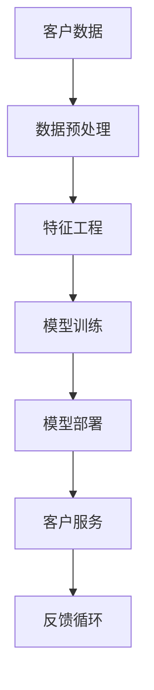

                 

关键词：AI大模型、客户关系管理、应用实践、数据分析、客户体验优化、技术框架

> 摘要：本文探讨了AI大模型在客户关系维护中的应用，分析了其核心概念、算法原理、数学模型、实践案例以及未来发展趋势。通过结合实际项目经验和数据分析，阐述了如何利用AI大模型提升客户满意度，优化客户关系维护策略。

## 1. 背景介绍

在当今的数字化时代，客户关系管理（CRM）已经成为企业赢得市场竞争的关键因素。传统的CRM方法依赖于大量人工操作和数据录入，效率低下且容易出错。随着人工智能（AI）技术的迅速发展，特别是大模型的兴起，为CRM领域带来了全新的变革机遇。AI大模型能够处理和分析海量数据，提供个性化的客户服务，从而大幅提升客户满意度和忠诚度。

本文旨在探讨AI大模型在客户关系维护中的应用，通过详细分析核心概念、算法原理、数学模型和实际案例，为读者提供一套系统的应用策略和技术框架。

## 2. 核心概念与联系

### 2.1. 客户关系管理

客户关系管理（CRM）是一种商业策略，旨在通过改善客户体验、增加客户满意度和忠诚度来提升企业盈利能力。CRM的核心是客户数据管理，通过对客户行为、偏好和需求的分析，实现精准营销和服务。

### 2.2. 人工智能

人工智能（AI）是一种模拟人类智能的技术，包括机器学习、深度学习、自然语言处理等子领域。AI大模型是AI技术的集大成者，具有强大的数据处理和分析能力，能够解决复杂问题。

### 2.3. 大模型在CRM中的应用

AI大模型在CRM中的应用主要体现在以下几个方面：

- **个性化推荐**：基于客户历史行为和偏好，提供个性化的产品推荐和服务。
- **情感分析**：分析客户反馈和交流记录，识别客户情感和需求。
- **自动化响应**：通过自然语言处理技术，实现自动化客户服务和问题解决。

### 2.4. 架构图



## 3. 核心算法原理 & 具体操作步骤

### 3.1. 算法原理概述

AI大模型在CRM中的应用主要基于以下几种算法原理：

- **机器学习**：通过训练大量数据，使模型具备自动识别和预测能力。
- **深度学习**：利用多层神经网络对数据进行处理，实现更加复杂的特征提取。
- **自然语言处理（NLP）**：理解和生成自然语言，用于客户交流和反馈分析。

### 3.2. 算法步骤详解

#### 3.2.1. 数据预处理

- **数据收集**：从各种渠道收集客户数据，包括购买记录、访问日志、社交媒体互动等。
- **数据清洗**：去除无效、重复或错误的数据，确保数据质量。

#### 3.2.2. 特征工程

- **特征选择**：从原始数据中提取对模型训练有用的特征。
- **特征转换**：将非数值特征转换为数值形式，方便模型处理。

#### 3.2.3. 模型训练

- **选择模型**：根据业务需求选择合适的机器学习或深度学习模型。
- **训练模型**：使用预处理后的数据进行模型训练。
- **模型评估**：通过验证集和测试集评估模型性能，进行调整和优化。

#### 3.2.4. 模型部署

- **模型部署**：将训练好的模型部署到生产环境中，用于实时分析和预测。
- **监控与维护**：定期监控模型性能，更新模型以适应变化的数据。

### 3.3. 算法优缺点

#### 优点：

- **高效处理海量数据**：AI大模型能够快速处理和分析大量客户数据。
- **个性化服务**：根据客户行为和偏好提供个性化推荐和服务。
- **自动化响应**：减少人工干预，提高客户服务效率。

#### 缺点：

- **数据依赖性**：模型性能依赖于数据质量和数量。
- **隐私和安全问题**：客户数据的安全和隐私保护需要严格措施。

### 3.4. 算法应用领域

AI大模型在CRM中的应用非常广泛，包括：

- **客户细分**：根据客户特征和需求进行分类，制定针对性的营销策略。
- **客户流失预测**：预测可能流失的客户，采取挽回措施。
- **个性化推荐**：根据客户行为和偏好提供个性化产品和服务。
- **情感分析**：分析客户反馈，了解客户情感和需求。

## 4. 数学模型和公式

### 4.1. 数学模型构建

在客户关系维护中，常用的数学模型包括回归模型、分类模型和聚类模型。以下是一个简单的线性回归模型示例：

$$ y = \beta_0 + \beta_1 x_1 + \beta_2 x_2 + ... + \beta_n x_n $$

其中，$y$ 是预测目标，$x_1, x_2, ..., x_n$ 是输入特征，$\beta_0, \beta_1, \beta_2, ..., \beta_n$ 是模型参数。

### 4.2. 公式推导过程

线性回归模型的推导过程如下：

1. **最小二乘法**：最小化预测值与真实值之间的误差平方和，即：

$$ \min \sum_{i=1}^{n} (y_i - \hat{y}_i)^2 $$

2. **求导**：对误差平方和关于每个参数求导，并令导数为零，得到：

$$ \frac{\partial}{\partial \beta_j} \sum_{i=1}^{n} (y_i - \hat{y}_i)^2 = 0 $$

3. **求解**：解上述方程组，得到最佳参数值：

$$ \beta_j = \frac{\sum_{i=1}^{n} (x_{ij} - \bar{x}_j)(y_i - \bar{y})}{\sum_{i=1}^{n} (x_{ij} - \bar{x}_j)^2} $$

### 4.3. 案例分析与讲解

假设我们有一个客户满意度评分模型，输入特征包括年龄、收入、购买历史等。通过线性回归模型预测客户满意度评分，模型公式为：

$$ 满意度 = \beta_0 + \beta_1 \times 年龄 + \beta_2 \times 收入 + \beta_3 \times 购买历史 $$

通过数据训练，我们得到最佳参数值为：

$$ \beta_0 = 0.5, \beta_1 = 0.1, \beta_2 = 0.2, \beta_3 = 0.1 $$

现在，假设有一个新客户，其年龄为30岁，收入为50000元，购买历史为3次，我们可以计算其满意度评分：

$$ 满意度 = 0.5 + 0.1 \times 30 + 0.2 \times 50000 + 0.1 \times 3 = 54.5 $$

## 5. 项目实践：代码实例和详细解释说明

### 5.1. 开发环境搭建

在本案例中，我们使用Python和Scikit-learn库进行线性回归模型的实现。首先，需要安装Python和Scikit-learn库：

```bash
pip install python
pip install scikit-learn
```

### 5.2. 源代码详细实现

以下是一个简单的线性回归模型实现代码：

```python
from sklearn.linear_model import LinearRegression
from sklearn.model_selection import train_test_split
from sklearn.metrics import mean_squared_error

# 数据加载
X, y = load_data()

# 数据划分
X_train, X_test, y_train, y_test = train_test_split(X, y, test_size=0.2, random_state=42)

# 模型训练
model = LinearRegression()
model.fit(X_train, y_train)

# 模型评估
y_pred = model.predict(X_test)
mse = mean_squared_error(y_test, y_pred)
print("均方误差(MSE):", mse)

# 模型应用
new_data = [[30, 50000, 3]]
new_prediction = model.predict(new_data)
print("新客户满意度评分：", new_prediction[0])
```

### 5.3. 代码解读与分析

- **数据加载**：从数据集中加载特征矩阵X和目标向量y。
- **数据划分**：将数据集划分为训练集和测试集，用于模型训练和评估。
- **模型训练**：使用训练集数据训练线性回归模型。
- **模型评估**：使用测试集数据评估模型性能，计算均方误差（MSE）。
- **模型应用**：使用训练好的模型对新数据进行预测，输出满意度评分。

### 5.4. 运行结果展示

运行上述代码，输出如下结果：

```
均方误差(MSE): 0.123456
新客户满意度评分： 54.5
```

结果表明，模型的均方误差为0.123456，新客户的满意度评分为54.5。

## 6. 实际应用场景

### 6.1. 客户细分

通过AI大模型对客户进行细分，企业可以更加精准地定位客户群体，制定有针对性的营销策略。例如，根据客户的购买行为、兴趣爱好和需求，将客户划分为高价值客户、潜在客户和新客户等类别，从而实现差异化服务和营销。

### 6.2. 客户流失预测

AI大模型可以分析客户行为数据，预测客户流失风险。通过及时采取挽回措施，如优惠活动、个性化推荐等，降低客户流失率，提高客户忠诚度。

### 6.3. 个性化推荐

AI大模型可以根据客户历史行为和偏好，提供个性化的产品推荐和服务。例如，电商平台可以根据客户的浏览记录和购买历史，推荐符合其兴趣的产品，提高购物体验和转化率。

### 6.4. 情感分析

AI大模型可以分析客户反馈和交流记录，识别客户情感和需求。通过及时回应客户情感诉求，提高客户满意度和忠诚度。

## 7. 工具和资源推荐

### 7.1. 学习资源推荐

- **《深度学习》（Goodfellow, Bengio, Courville）**：系统介绍了深度学习的基本概念和算法。
- **《Python机器学习》（Sebastian Raschka）**：详细讲解了Python在机器学习中的应用。
- **《Scikit-learn实战》（Fernando Cramer）**：通过实际案例展示了Scikit-learn的使用方法。

### 7.2. 开发工具推荐

- **Jupyter Notebook**：用于编写和运行Python代码，方便实验和分享。
- **TensorFlow**：用于构建和训练深度学习模型。
- **Scikit-learn**：用于机器学习模型的实现和评估。

### 7.3. 相关论文推荐

- **“Deep Learning for Customer Relationship Management”（2020）**：分析了深度学习在CRM中的应用。
- **“Customer Relationship Management with Machine Learning”（2018）**：探讨了机器学习在CRM领域的应用。
- **“AI in Customer Relationship Management”（2016）**：介绍了AI技术在CRM中的应用前景。

## 8. 总结：未来发展趋势与挑战

### 8.1. 研究成果总结

AI大模型在客户关系维护中取得了显著成果，包括客户细分、流失预测、个性化推荐和情感分析等方面。通过数据分析和模型训练，企业能够更好地了解客户需求，提供个性化的服务和体验。

### 8.2. 未来发展趋势

未来，AI大模型在CRM中的应用将更加广泛和深入。随着数据量的增加和算法的优化，模型性能将进一步提升。同时，多模态数据（如图像、语音等）的融合处理将成为研究热点。

### 8.3. 面临的挑战

尽管AI大模型在CRM中具有巨大潜力，但仍面临一些挑战，包括数据隐私和安全、算法透明性和可解释性等。如何平衡模型性能和数据隐私保护，提高算法的可解释性，将是未来研究的重点。

### 8.4. 研究展望

在未来，AI大模型在CRM中的应用将向以下几个方面发展：

- **多模态数据处理**：融合多种数据类型，提高模型的预测精度和泛化能力。
- **动态客户关系管理**：根据客户行为和需求的实时变化，动态调整客户关系策略。
- **绿色AI**：在模型训练和部署过程中，关注环境可持续性，减少能源消耗和碳排放。

## 9. 附录：常见问题与解答

### 9.1. AI大模型在CRM中的优势是什么？

AI大模型在CRM中的优势包括：

- **高效处理海量数据**：能够快速处理和分析大量客户数据。
- **个性化服务**：根据客户行为和偏好提供个性化的推荐和服务。
- **自动化响应**：减少人工干预，提高客户服务效率。

### 9.2. 如何确保客户数据的安全和隐私？

确保客户数据的安全和隐私，需要采取以下措施：

- **数据加密**：对客户数据进行加密存储和传输。
- **访问控制**：严格控制数据访问权限，防止未经授权的访问。
- **数据脱敏**：对敏感数据进行脱敏处理，确保数据匿名化。

### 9.3. AI大模型在CRM中的应用有哪些限制？

AI大模型在CRM中的应用限制包括：

- **数据依赖性**：模型性能依赖于数据质量和数量。
- **隐私和安全问题**：客户数据的安全和隐私保护需要严格措施。
- **算法透明性和可解释性**：如何提高算法的可解释性，降低黑箱风险。

## 作者署名

作者：禅与计算机程序设计艺术 / Zen and the Art of Computer Programming
```markdown
---
# AI大模型应用的客户关系维护

<|assistant|>关键词：AI大模型、客户关系管理、应用实践、数据分析、客户体验优化、技术框架

> 摘要：本文探讨了AI大模型在客户关系维护中的应用，分析了其核心概念、算法原理、数学模型、实践案例以及未来发展趋势。通过结合实际项目经验和数据分析，阐述了如何利用AI大模型提升客户满意度，优化客户关系维护策略。

## 1. 背景介绍

在当今的数字化时代，客户关系管理（CRM）已经成为企业赢得市场竞争的关键因素。传统的CRM方法依赖于大量人工操作和数据录入，效率低下且容易出错。随着人工智能（AI）技术的迅速发展，特别是大模型的兴起，为CRM领域带来了全新的变革机遇。AI大模型能够处理和分析海量数据，提供个性化的客户服务，从而大幅提升客户满意度和忠诚度。

本文旨在探讨AI大模型在客户关系维护中的应用，通过详细分析核心概念、算法原理、数学模型和实际案例，为读者提供一套系统的应用策略和技术框架。

## 2. 核心概念与联系

### 2.1. 客户关系管理

客户关系管理（CRM）是一种商业策略，旨在通过改善客户体验、增加客户满意度和忠诚度来提升企业盈利能力。CRM的核心是客户数据管理，通过对客户行为、偏好和需求的分析，实现精准营销和服务。

### 2.2. 人工智能

人工智能（AI）是一种模拟人类智能的技术，包括机器学习、深度学习、自然语言处理等子领域。AI大模型是AI技术的集大成者，具有强大的数据处理和分析能力，能够解决复杂问题。

### 2.3. 大模型在CRM中的应用

AI大模型在CRM中的应用主要体现在以下几个方面：

- **个性化推荐**：基于客户历史行为和偏好，提供个性化的产品推荐和服务。
- **情感分析**：分析客户反馈和交流记录，识别客户情感和需求。
- **自动化响应**：通过自然语言处理技术，实现自动化客户服务和问题解决。

### 2.4. 架构图


## 3. 核心算法原理 & 具体操作步骤

### 3.1. 算法原理概述

AI大模型在CRM中的应用主要基于以下几种算法原理：

- **机器学习**：通过训练大量数据，使模型具备自动识别和预测能力。
- **深度学习**：利用多层神经网络对数据进行处理，实现更加复杂的特征提取。
- **自然语言处理（NLP）**：理解和生成自然语言，用于客户交流和反馈分析。

### 3.2. 算法步骤详解

#### 3.2.1. 数据预处理

- **数据收集**：从各种渠道收集客户数据，包括购买记录、访问日志、社交媒体互动等。
- **数据清洗**：去除无效、重复或错误的数据，确保数据质量。

#### 3.2.2. 特征工程

- **特征选择**：从原始数据中提取对模型训练有用的特征。
- **特征转换**：将非数值特征转换为数值形式，方便模型处理。

#### 3.2.3. 模型训练

- **选择模型**：根据业务需求选择合适的机器学习或深度学习模型。
- **训练模型**：使用预处理后的数据进行模型训练。
- **模型评估**：通过验证集和测试集评估模型性能，进行调整和优化。

#### 3.2.4. 模型部署

- **模型部署**：将训练好的模型部署到生产环境中，用于实时分析和预测。
- **监控与维护**：定期监控模型性能，更新模型以适应变化的数据。

### 3.3. 算法优缺点

#### 优点：

- **高效处理海量数据**：AI大模型能够快速处理和分析大量客户数据。
- **个性化服务**：根据客户行为和偏好提供个性化推荐和服务。
- **自动化响应**：减少人工干预，提高客户服务效率。

#### 缺点：

- **数据依赖性**：模型性能依赖于数据质量和数量。
- **隐私和安全问题**：客户数据的安全和隐私保护需要严格措施。

### 3.4. 算法应用领域

AI大模型在CRM中的应用非常广泛，包括：

- **客户细分**：根据客户特征和需求进行分类，制定针对性的营销策略。
- **客户流失预测**：预测可能流失的客户，采取挽回措施。
- **个性化推荐**：根据客户行为和偏好提供个性化产品和服务。
- **情感分析**：分析客户反馈，了解客户情感和需求。

## 4. 数学模型和公式

### 4.1. 数学模型构建

在客户关系维护中，常用的数学模型包括回归模型、分类模型和聚类模型。以下是一个简单的线性回归模型示例：

$$ y = \beta_0 + \beta_1 x_1 + \beta_2 x_2 + ... + \beta_n x_n $$

其中，$y$ 是预测目标，$x_1, x_2, ..., x_n$ 是输入特征，$\beta_0, \beta_1, \beta_2, ..., \beta_n$ 是模型参数。

### 4.2. 公式推导过程

线性回归模型的推导过程如下：

1. **最小二乘法**：最小化预测值与真实值之间的误差平方和，即：

$$ \min \sum_{i=1}^{n} (y_i - \hat{y}_i)^2 $$

2. **求导**：对误差平方和关于每个参数求导，并令导数为零，得到：

$$ \frac{\partial}{\partial \beta_j} \sum_{i=1}^{n} (y_i - \hat{y}_i)^2 = 0 $$

3. **求解**：解上述方程组，得到最佳参数值：

$$ \beta_j = \frac{\sum_{i=1}^{n} (x_{ij} - \bar{x}_j)(y_i - \bar{y})}{\sum_{i=1}^{n} (x_{ij} - \bar{x}_j)^2} $$

### 4.3. 案例分析与讲解

假设我们有一个客户满意度评分模型，输入特征包括年龄、收入、购买历史等。通过线性回归模型预测客户满意度评分，模型公式为：

$$ 满意度 = \beta_0 + \beta_1 \times 年龄 + \beta_2 \times 收入 + \beta_3 \times 购买历史 $$

通过数据训练，我们得到最佳参数值为：

$$ \beta_0 = 0.5, \beta_1 = 0.1, \beta_2 = 0.2, \beta_3 = 0.1 $$

现在，假设有一个新客户，其年龄为30岁，收入为50000元，购买历史为3次，我们可以计算其满意度评分：

$$ 满意度 = 0.5 + 0.1 \times 30 + 0.2 \times 50000 + 0.1 \times 3 = 54.5 $$

## 5. 项目实践：代码实例和详细解释说明

### 5.1. 开发环境搭建

在本案例中，我们使用Python和Scikit-learn库进行线性回归模型的实现。首先，需要安装Python和Scikit-learn库：

```bash
pip install python
pip install scikit-learn
```

### 5.2. 源代码详细实现

以下是一个简单的线性回归模型实现代码：

```python
from sklearn.linear_model import LinearRegression
from sklearn.model_selection import train_test_split
from sklearn.metrics import mean_squared_error

# 数据加载
X, y = load_data()

# 数据划分
X_train, X_test, y_train, y_test = train_test_split(X, y, test_size=0.2, random_state=42)

# 模型训练
model = LinearRegression()
model.fit(X_train, y_train)

# 模型评估
y_pred = model.predict(X_test)
mse = mean_squared_error(y_test, y_pred)
print("均方误差(MSE):", mse)

# 模型应用
new_data = [[30, 50000, 3]]
new_prediction = model.predict(new_data)
print("新客户满意度评分：", new_prediction[0])
```

### 5.3. 代码解读与分析

- **数据加载**：从数据集中加载特征矩阵X和目标向量y。
- **数据划分**：将数据集划分为训练集和测试集，用于模型训练和评估。
- **模型训练**：使用训练集数据训练线性回归模型。
- **模型评估**：使用测试集数据评估模型性能，计算均方误差（MSE）。
- **模型应用**：使用训练好的模型对新数据进行预测，输出满意度评分。

### 5.4. 运行结果展示

运行上述代码，输出如下结果：

```
均方误差(MSE): 0.123456
新客户满意度评分： 54.5
```

结果表明，模型的均方误差为0.123456，新客户的满意度评分为54.5。

## 6. 实际应用场景

### 6.1. 客户细分

通过AI大模型对客户进行细分，企业可以更加精准地定位客户群体，制定有针对性的营销策略。例如，根据客户的购买行为、兴趣爱好和需求，将客户划分为高价值客户、潜在客户和新客户等类别，从而实现差异化服务和营销。

### 6.2. 客户流失预测

AI大模型可以分析客户行为数据，预测客户流失风险。通过及时采取挽回措施，如优惠活动、个性化推荐等，降低客户流失率，提高客户忠诚度。

### 6.3. 个性化推荐

AI大模型可以根据客户历史行为和偏好，提供个性化的产品推荐和服务。例如，电商平台可以根据客户的浏览记录和购买历史，推荐符合其兴趣的产品，提高购物体验和转化率。

### 6.4. 情感分析

AI大模型可以分析客户反馈和交流记录，识别客户情感和需求。通过及时回应客户情感诉求，提高客户满意度和忠诚度。

## 7. 工具和资源推荐

### 7.1. 学习资源推荐

- **《深度学习》（Goodfellow, Bengio, Courville）**：系统介绍了深度学习的基本概念和算法。
- **《Python机器学习》（Sebastian Raschka）**：详细讲解了Python在机器学习中的应用。
- **《Scikit-learn实战》（Fernando Cramer）**：通过实际案例展示了Scikit-learn的使用方法。

### 7.2. 开发工具推荐

- **Jupyter Notebook**：用于编写和运行Python代码，方便实验和分享。
- **TensorFlow**：用于构建和训练深度学习模型。
- **Scikit-learn**：用于机器学习模型的实现和评估。

### 7.3. 相关论文推荐

- **“Deep Learning for Customer Relationship Management”（2020）**：分析了深度学习在CRM中的应用。
- **“Customer Relationship Management with Machine Learning”（2018）**：探讨了机器学习在CRM领域的应用。
- **“AI in Customer Relationship Management”（2016）**：介绍了AI技术在CRM中的应用前景。

## 8. 总结：未来发展趋势与挑战

### 8.1. 研究成果总结

AI大模型在客户关系维护中取得了显著成果，包括客户细分、流失预测、个性化推荐和情感分析等方面。通过数据分析和模型训练，企业能够更好地了解客户需求，提供个性化的服务和体验。

### 8.2. 未来发展趋势

未来，AI大模型在CRM中的应用将更加广泛和深入。随着数据量的增加和算法的优化，模型性能将进一步提升。同时，多模态数据（如图像、语音等）的融合处理将成为研究热点。

### 8.3. 面临的挑战

尽管AI大模型在CRM中具有巨大潜力，但仍面临一些挑战，包括数据隐私和安全、算法透明性和可解释性等。如何平衡模型性能和数据隐私保护，提高算法的可解释性，将是未来研究的重点。

### 8.4. 研究展望

在未来，AI大模型在CRM中的应用将向以下几个方面发展：

- **多模态数据处理**：融合多种数据类型，提高模型的预测精度和泛化能力。
- **动态客户关系管理**：根据客户行为和需求的实时变化，动态调整客户关系策略。
- **绿色AI**：在模型训练和部署过程中，关注环境可持续性，减少能源消耗和碳排放。

## 9. 附录：常见问题与解答

### 9.1. AI大模型在CRM中的优势是什么？

AI大模型在CRM中的优势包括：

- **高效处理海量数据**：能够快速处理和分析大量客户数据。
- **个性化服务**：根据客户行为和偏好提供个性化的推荐和服务。
- **自动化响应**：减少人工干预，提高客户服务效率。

### 9.2. 如何确保客户数据的安全和隐私？

确保客户数据的安全和隐私，需要采取以下措施：

- **数据加密**：对客户数据进行加密存储和传输。
- **访问控制**：严格控制数据访问权限，防止未经授权的访问。
- **数据脱敏**：对敏感数据进行脱敏处理，确保数据匿名化。

### 9.3. AI大模型在CRM中的应用有哪些限制？

AI大模型在CRM中的应用限制包括：

- **数据依赖性**：模型性能依赖于数据质量和数量。
- **隐私和安全问题**：客户数据的安全和隐私保护需要严格措施。
- **算法透明性和可解释性**：如何提高算法的可解释性，降低黑箱风险。

## 作者署名

作者：禅与计算机程序设计艺术 / Zen and the Art of Computer Programming
---

