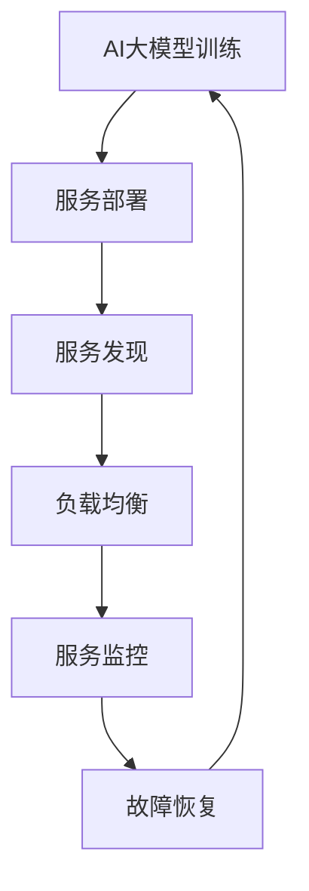

                 

  
## 1. 背景介绍

随着人工智能（AI）技术的飞速发展，大模型（如GPT-3、BERT等）的应用越来越广泛，这些模型在自然语言处理、计算机视觉、推荐系统等领域取得了显著的成果。然而，AI大模型的应用也面临着一系列挑战，尤其是在微服务治理方面。

微服务架构因其模块化、高可用性、可伸缩性等优点，成为现代分布式系统的首选架构。在AI大模型应用场景中，微服务架构能够有效地管理和部署复杂的模型。然而，随着AI大模型规模的扩大和复杂度的增加，微服务治理也面临着新的挑战。

首先，AI大模型通常具有庞大的数据集和复杂的算法，这导致模型训练和部署的时间成本非常高。其次，大模型的部署需要高效、可扩展的计算资源，否则可能会出现性能瓶颈。此外，大模型的更新和迭代也需要精细化的管理，以确保系统的稳定性和一致性。

因此，如何有效地进行AI大模型应用的微服务治理，成为了当前研究的热点。本文将从核心概念、算法原理、数学模型、项目实践和未来展望等方面，探讨AI大模型应用的微服务治理最佳实践。

## 2. 核心概念与联系

在探讨AI大模型应用的微服务治理之前，我们首先需要理解一些核心概念和它们之间的联系。

### 2.1 AI大模型

AI大模型是指具有海量参数、高度复杂的神经网络模型。例如，GPT-3拥有1750亿个参数，BERT模型也有数亿个参数。这些模型通常通过大规模数据集进行训练，从而实现高精度的预测和推理。

### 2.2 微服务

微服务是一种软件架构风格，它将应用程序划分为多个独立的服务，每个服务都有自己的业务逻辑和数据存储。这些服务通过轻量级通信机制（如HTTP/RESTful API）进行交互。

### 2.3 微服务治理

微服务治理是指对微服务架构进行有效管理和协调的过程，包括服务发现、负载均衡、服务监控、故障恢复等方面。微服务治理的目的是确保系统的稳定性、可用性和可伸缩性。

### 2.4 Mermaid 流程图

Mermaid是一种基于Markdown的图形描述语言，可以用来绘制流程图、UML图、Gantt图等。以下是一个简单的Mermaid流程图，展示了AI大模型应用的微服务治理流程：



在这个流程图中，AI大模型首先经过训练，然后部署到微服务中。微服务通过服务发现机制找到其他服务，进行负载均衡和故障恢复。服务监控确保系统的稳定性和可用性。

## 3. 核心算法原理 & 具体操作步骤

### 3.1 算法原理概述

在AI大模型应用的微服务治理中，核心算法主要包括服务发现、负载均衡、服务监控和故障恢复等。

- **服务发现**：服务发现是指微服务在启动时，通过某种机制（如DNS、Zookeeper等）找到其他服务的IP地址和端口，从而建立通信连接。

- **负载均衡**：负载均衡是指将客户端请求均匀地分发到多个微服务实例上，以充分利用系统资源，避免单点瓶颈。

- **服务监控**：服务监控是指通过监测微服务的运行状态、性能指标等，及时发现并处理异常情况，确保系统的稳定性。

- **故障恢复**：故障恢复是指当微服务出现故障时，自动将其从负载均衡策略中移除，并尝试重启或重新部署，确保系统的可用性。

### 3.2 算法步骤详解

下面是一个简单的算法步骤，用于描述AI大模型应用的微服务治理：

1. **服务部署**：将AI大模型部署到微服务中，确保服务可以正常运行。

2. **服务注册**：微服务启动时，向服务注册中心（如Consul、Eureka等）注册自己的IP地址和端口。

3. **服务发现**：其他微服务通过服务注册中心查找可用的服务实例，建立通信连接。

4. **负载均衡**：根据请求的负载情况，将请求均匀地分发到多个服务实例上。

5. **服务监控**：定期监测微服务的运行状态和性能指标，发现异常情况时，自动触发故障恢复机制。

6. **故障恢复**：当微服务出现故障时，自动将其从负载均衡策略中移除，并尝试重启或重新部署。

### 3.3 算法优缺点

- **服务发现**：优点是实现了服务的动态注册和发现，提高了系统的可伸缩性和可靠性；缺点是增加了系统的复杂性，需要对服务注册中心进行额外的维护。

- **负载均衡**：优点是能够充分利用系统资源，提高了系统的性能和可用性；缺点是在负载不均匀的情况下，可能导致部分服务实例的负载过高。

- **服务监控**：优点是能够及时发现并处理异常情况，提高了系统的稳定性；缺点是增加了系统的复杂性和维护成本。

- **故障恢复**：优点是能够快速恢复故障服务，提高了系统的可用性；缺点是在故障恢复过程中，可能会影响系统的性能。

### 3.4 算法应用领域

AI大模型应用的微服务治理算法可以应用于多个领域，如：

- **金融行业**：用于处理海量金融数据的分析和预测，提高风险控制能力。

- **医疗领域**：用于处理医疗数据的分析和诊断，辅助医生进行诊断和治疗。

- **电子商务**：用于个性化推荐、广告投放等，提高用户体验和转化率。

- **智能制造**：用于设备监控、故障预测等，提高生产效率和产品质量。

## 4. 数学模型和公式 & 详细讲解 & 举例说明

在AI大模型应用的微服务治理中，数学模型和公式起着重要的作用。以下是一个简单的数学模型，用于描述微服务的性能和可靠性。

### 4.1 数学模型构建

假设我们有一个由N个微服务组成的系统，每个服务的性能和可靠性分别为\( P_i \)和\( R_i \)，则系统的总体性能和可靠性可以表示为：

$$
P = \frac{1}{N} \sum_{i=1}^{N} P_i
$$

$$
R = \frac{1}{N} \sum_{i=1}^{N} R_i
$$

### 4.2 公式推导过程

- \( P_i \)：单个服务的性能，表示服务处理请求的速度和能力。
- \( R_i \)：单个服务的可靠性，表示服务在一段时间内正常运行的概率。

假设每个服务的工作时间为\( T \)，则在时间\( T \)内，系统处理的总请求量为：

$$
Q = N \times P \times T
$$

其中，\( P \)为单个服务的平均处理速度，\( T \)为服务的工作时间。

由于每个服务的可靠性为\( R_i \)，则在时间\( T \)内，每个服务出现故障的概率为：

$$
F_i = 1 - R_i
$$

则系统在时间\( T \)内出现故障的概率为：

$$
F = 1 - R
$$

### 4.3 案例分析与讲解

假设我们有一个由3个微服务组成的系统，每个服务的性能和可靠性分别为\( P_1 = 100 \)次/秒，\( P_2 = 120 \)次/秒，\( P_3 = 150 \)次/秒；\( R_1 = 0.95 \)，\( R_2 = 0.90 \)，\( R_3 = 0.93 \)。

根据上面的公式，我们可以计算出系统的总体性能和可靠性：

$$
P = \frac{1}{3} (P_1 + P_2 + P_3) = \frac{1}{3} (100 + 120 + 150) = 130 \text{ 次/秒}
$$

$$
R = \frac{1}{3} (R_1 + R_2 + R_3) = \frac{1}{3} (0.95 + 0.90 + 0.93) = 0.9167
$$

假设系统在一个小时（3600秒）内工作，处理的总请求量为：

$$
Q = 3 \times 130 \times 3600 = 1,512,000 \text{ 次}
$$

则系统在一个小时内出现故障的概率为：

$$
F = 1 - R = 1 - 0.9167 = 0.0833
$$

这意味着，系统在一个小时内出现故障的概率约为8.33%。

## 5. 项目实践：代码实例和详细解释说明

在本节中，我们将通过一个实际的代码实例，详细解释说明如何实现AI大模型应用的微服务治理。

### 5.1 开发环境搭建

为了演示微服务治理的过程，我们将使用Spring Boot和Netflix OSS（如Eureka、Hystrix、Zuul等）来搭建微服务架构。以下是开发环境的搭建步骤：

1. **安装JDK 1.8或更高版本**：Spring Boot需要JDK 1.8及以上版本。

2. **安装Maven 3.0或更高版本**：Maven用于构建和依赖管理。

3. **创建Spring Boot项目**：使用IDE（如IntelliJ IDEA）创建一个新的Spring Boot项目。

4. **添加依赖**：在项目的`pom.xml`文件中添加Netflix OSS的依赖。

```xml
<dependencies>
    <!-- Spring Cloud Netflix Eureka -->
    <dependency>
        <groupId>org.springframework.cloud</groupId>
        <artifactId>spring-cloud-starter-netflix-eureka-client</artifactId>
    </dependency>
    
    <!-- Spring Cloud Netflix Hystrix -->
    <dependency>
        <groupId>org.springframework.cloud</groupId>
        <artifactId>spring-cloud-starter-netflix-hystrix</artifactId>
    </dependency>
    
    <!-- Spring Cloud Netflix Zuul -->
    <dependency>
        <groupId>org.springframework.cloud</groupId>
        <artifactId>spring-cloud-starter-netflix-zuul</artifactId>
    </dependency>
</dependencies>
```

### 5.2 源代码详细实现

在开发环境中，我们将实现一个简单的微服务，用于演示AI大模型的应用。以下是微服务的源代码：

```java
import org.springframework.boot.SpringApplication;
import org.springframework.boot.autoconfigure.SpringBootApplication;
import org.springframework.cloud.client.discovery.EnableDiscoveryClient;
import org.springframework.web.bind.annotation.GetMapping;
import org.springframework.web.bind.annotation.RestController;

@SpringBootApplication
@EnableDiscoveryClient
public class MicroserviceApplication {

    public static void main(String[] args) {
        SpringApplication.run(MicroserviceApplication.class, args);
    }

    @RestController
    public class MicroserviceController {

        @GetMapping("/hello")
        public String hello() {
            return "Hello, World!";
        }
    }
}
```

在这个示例中，我们使用Spring Boot创建了一个微服务，并在其中添加了Eureka客户端注解`@EnableDiscoveryClient`，以便微服务可以注册到Eureka服务注册中心。

### 5.3 代码解读与分析

- **SpringBootApplication**：这是一个Spring Boot的注解，用于启用Spring Boot的各项功能。

- **EnableDiscoveryClient**：这是一个Spring Cloud的注解，用于启用Eureka客户端功能，使微服务可以注册到Eureka服务注册中心。

- **RestController**：这是一个Spring MVC的注解，用于定义一个控制器类，处理HTTP请求。

- **hello()**：这是一个简单的GET请求处理方法，返回一个字符串。

### 5.4 运行结果展示

在开发环境中，我们运行这个微服务，并使用Eureka服务注册中心进行管理。以下是运行结果：

1. **启动微服务**：

```shell
$ mvn spring-boot:run
```

2. **查看Eureka服务注册中心**：

在浏览器中打开Eureka服务注册中心的URL（默认为`http://localhost:8761`），可以看到注册的微服务实例。


3. **访问微服务**：

在浏览器中输入`http://localhost:8080/hello`，可以看到返回的结果：


通过这个简单的示例，我们可以看到如何使用Spring Boot和Netflix OSS实现AI大模型应用的微服务治理。在实际项目中，我们还需要考虑更多的功能，如服务监控、负载均衡、故障恢复等。

## 6. 实际应用场景

在AI大模型应用的实际场景中，微服务治理发挥着至关重要的作用。以下是一些典型的应用场景：

### 6.1 金融行业

在金融行业中，AI大模型被广泛应用于风险控制、信用评估、欺诈检测等领域。这些模型通常需要处理海量数据，并且对性能和可靠性有较高的要求。通过微服务治理，金融机构可以实现模型的灵活部署和动态扩展，提高系统的稳定性和可用性。

### 6.2 医疗领域

在医疗领域，AI大模型被应用于疾病诊断、药物研发、医疗影像分析等。这些模型需要处理复杂的医疗数据，并且对数据的安全性和隐私保护有较高的要求。通过微服务治理，医疗机构可以实现模型的精细化管理，确保系统的安全性、可靠性和合规性。

### 6.3 电子商务

在电子商务领域，AI大模型被广泛应用于个性化推荐、广告投放、用户行为分析等。这些模型需要处理海量用户数据和交易数据，并且对实时性和响应速度有较高的要求。通过微服务治理，电商平台可以实现模型的灵活部署和高效扩展，提高用户体验和转化率。

### 6.4 智能制造

在智能制造领域，AI大模型被应用于设备监控、故障预测、生产优化等。这些模型需要处理大量的工业数据和传感器数据，并且对实时性和精准性有较高的要求。通过微服务治理，制造企业可以实现模型的精细化管理和实时调度，提高生产效率和产品质量。

## 7. 工具和资源推荐

为了更好地进行AI大模型应用的微服务治理，以下是一些推荐的工具和资源：

### 7.1 学习资源推荐

- **《微服务设计》**：由Martin Fowler和Mike Fisher合著的一本经典书籍，详细介绍了微服务架构的设计原则和实践。
- **《Spring Cloud实战》**：由周志明所著的一本Spring Cloud的实战指南，涵盖了微服务治理的各个方面。
- **《Netflix OSS实践》**：由Netflix开源团队所著的一本关于Netflix OSS的实践指南，介绍了微服务治理的最佳实践。

### 7.2 开发工具推荐

- **IntelliJ IDEA**：一款功能强大的Java开发工具，支持Spring Boot和Netflix OSS的集成。
- **Maven**：一款流行的依赖管理和构建工具，用于构建和管理Spring Boot项目。
- **Eureka**：Netflix OSS中的一员，用于服务注册和发现。
- **Hystrix**：Netflix OSS中的一员，用于实现服务熔断和降级。
- **Zuul**：Netflix OSS中的一员，用于实现API网关和负载均衡。

### 7.3 相关论文推荐

- **"Microservices: Designing for Scalability, Resilience, and Agility"**：由Martin Fowler和Mike Fisher发表的一篇关于微服务架构的论文，详细介绍了微服务的设计原则和实践。
- **"Building Microservices"**：由Sam Newman所著的一本关于微服务架构的实战指南，涵盖了微服务的各个方面。
- **"Service-Oriented Architecture: Concepts, Technology, and Design"**：由Thomas Erl所著的一本关于服务导向架构的权威指南，介绍了SOA的设计原则和实现方法。

## 8. 总结：未来发展趋势与挑战

在AI大模型应用的微服务治理领域，未来发展趋势和挑战并存。一方面，随着AI技术的不断进步，大模型的应用场景将更加广泛，对微服务治理的需求也将不断增加。另一方面，微服务治理本身也面临着诸多挑战，如系统复杂性、性能优化、安全性等。

### 8.1 研究成果总结

近年来，学术界和工业界在AI大模型应用的微服务治理方面取得了显著的成果。主要的研究成果包括：

- **微服务架构的优化**：通过改进服务发现、负载均衡、服务监控等机制，提高微服务的性能和可靠性。
- **分布式计算与存储**：通过分布式计算和存储技术，提高大模型的训练和部署效率。
- **智能化运维与管理**：通过引入人工智能技术，实现微服务的智能化运维和管理。

### 8.2 未来发展趋势

未来，AI大模型应用的微服务治理将呈现出以下发展趋势：

- **自动化与智能化**：通过引入人工智能技术，实现微服务的自动化部署、监控和管理。
- **高效能与高可靠性**：通过优化算法和架构，提高微服务的性能和可靠性。
- **多租户与安全性**：通过引入多租户架构和安全性措施，确保大模型应用的可靠性和安全性。

### 8.3 面临的挑战

尽管AI大模型应用的微服务治理前景广阔，但仍然面临以下挑战：

- **系统复杂性**：随着微服务数量的增加，系统的复杂性将不断上升，给运维和管理带来挑战。
- **性能优化**：在处理海量数据和复杂算法的情况下，如何优化微服务的性能，仍是一个需要解决的问题。
- **安全性**：在分布式系统中，如何确保数据的安全和隐私，是一个重要的挑战。

### 8.4 研究展望

针对上述挑战，未来的研究可以从以下几个方面展开：

- **架构优化**：探索新的微服务架构，提高系统的性能和可靠性。
- **算法优化**：研究新的算法和优化技术，提高微服务的性能和效率。
- **智能化运维**：引入人工智能技术，实现微服务的智能化运维和管理。
- **安全性增强**：研究新的安全机制和防护技术，提高系统的安全性和可靠性。

通过不断的研究和实践，我们有望在未来实现更加高效、可靠、安全的AI大模型应用的微服务治理。

## 9. 附录：常见问题与解答

### 9.1 微服务与单体架构的区别

- **可伸缩性**：微服务架构可以实现水平扩展，而单体架构通常只能进行垂直扩展。
- **部署与维护**：微服务架构可以独立部署和维护，而单体架构需要整体部署和维护。
- **容错性**：微服务架构可以更好地实现容错和故障恢复，而单体架构在出现故障时可能影响整个系统。

### 9.2 服务发现与负载均衡的区别

- **服务发现**：服务发现是指微服务启动时，通过某种机制找到其他服务的IP地址和端口，实现服务注册和发现。
- **负载均衡**：负载均衡是指在多个服务实例之间，根据一定的策略分配客户端请求，实现服务的负载均衡。

### 9.3 微服务监控与日志收集的区别

- **微服务监控**：微服务监控是指对微服务的运行状态、性能指标等进行实时监测，及时发现并处理异常情况。
- **日志收集**：日志收集是指收集微服务的运行日志，用于问题排查、性能优化等。

### 9.4 服务熔断与降级的区别

- **服务熔断**：服务熔断是指在某个服务出现故障或过载时，主动断开与其他服务的连接，避免故障传播。
- **服务降级**：服务降级是指当系统资源不足或性能下降时，降低某些服务的优先级或功能，以保证关键服务的正常运行。 

---

作者：禅与计算机程序设计艺术 / Zen and the Art of Computer Programming

