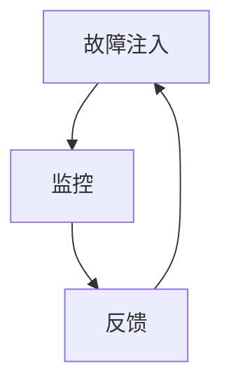

                 

关键词：人工智能，大模型，混沌工程，工具，应用，实践

摘要：本文旨在探讨人工智能领域中的大模型应用，特别是混沌工程在AI大模型开发与部署中的实践与工具应用。通过梳理混沌工程的核心概念，分析其在大模型中的应用场景，介绍相关工具和技术，以及提出未来发展的方向和挑战，本文为人工智能大模型的研究者与实践者提供了有价值的参考。

## 1. 背景介绍

在过去的几十年中，人工智能（AI）技术取得了飞速的发展。特别是深度学习（Deep Learning）的出现，使得机器学习（Machine Learning）的应用场景不断扩大，从图像识别、自然语言处理到推荐系统等各个领域。随着AI技术的不断进步，大模型（Large-scale Model）的应用逐渐成为研究热点。这些大模型具有千亿甚至万亿级别的参数量，能够处理大规模数据，并提供高精度的预测和决策。

然而，大模型的开发与部署也面临诸多挑战。首先是模型复杂度高，参数众多，使得调试和优化变得异常困难。其次是模型的稳定性和鲁棒性不足，容易受到数据噪声和异常值的影响。最后是模型的部署和运维，涉及到硬件资源的调度和系统的稳定性等问题。

为了解决这些问题，混沌工程（Chaos Engineering）提供了一种新的思路。混沌工程通过故意引入故障和异常，对系统进行压力测试和故障注入，以发现潜在的问题并提高系统的鲁棒性和稳定性。在AI大模型的开发与部署中，混沌工程的应用具有重要意义，可以有效提升模型的性能和可靠性。

## 2. 核心概念与联系

### 2.1 混沌工程的基本概念

混沌工程是一种通过故意引入故障和异常来测试系统鲁棒性的方法。其核心思想是，通过在正常运营的环境中故意引入故障，观察系统如何响应和恢复，从而发现潜在的问题并提高系统的稳定性。混沌工程的三个关键组成部分是故障注入、监控和反馈。

- **故障注入**：通过引入故障，模拟系统的实际运行情况。故障可以是硬件故障、网络故障、服务故障等，目的是测试系统在异常情况下的表现。
- **监控**：实时监控系统的运行状态，记录故障发生的时间、类型和影响范围。监控数据对于故障分析和优化至关重要。
- **反馈**：根据监控数据，对系统进行优化和改进，以提高其鲁棒性和稳定性。

### 2.2 混沌工程与AI大模型的联系

混沌工程在AI大模型中的应用主要体现在以下几个方面：

- **模型训练的鲁棒性**：通过引入故障和异常，测试模型在训练过程中对数据噪声和异常值的处理能力，从而提高模型的鲁棒性。
- **模型部署的稳定性**：通过在模型部署环境中引入故障，测试模型在异常情况下的运行稳定性，确保模型在实际应用中的可靠性和稳定性。
- **系统运维的效率**：通过混沌工程，可以发现系统中的潜在问题，提前进行优化和改进，提高系统运维的效率。

### 2.3 Mermaid 流程图

以下是一个简单的 Mermaid 流程图，展示了混沌工程的核心概念和流程：



### 2.4 混沌工程的关键技术

- **故障注入技术**：包括硬件故障注入、网络故障注入、服务故障注入等，常用的方法有随机故障注入、模拟故障注入和预定义故障注入等。
- **监控技术**：包括日志监控、性能监控、状态监控等，常用的工具和平台有 Prometheus、Grafana、Kibana 等。
- **反馈技术**：包括自动化测试、自动化修复和持续集成/持续部署（CI/CD）等，常用的工具和平台有 Jenkins、GitLab、Docker 等。

## 3. 核心算法原理 & 具体操作步骤

### 3.1 算法原理概述

混沌工程的核心算法主要涉及故障注入、监控和反馈三个部分。

- **故障注入算法**：用于模拟系统故障，测试系统的鲁棒性和稳定性。故障注入算法可以基于概率模型、随机过程或者预定义规则，根据不同的测试目标和场景进行选择。
- **监控算法**：用于实时监控系统的运行状态，记录故障发生的时间、类型和影响范围。监控算法可以基于统计模型、机器学习算法或者实时数据处理技术，根据实际需求进行设计。
- **反馈算法**：用于根据监控数据对系统进行优化和改进，以提高其鲁棒性和稳定性。反馈算法可以基于数据分析、机器学习算法或者自动化测试技术，根据具体问题进行优化。

### 3.2 算法步骤详解

1. **故障注入**：根据测试目标和场景，设计并实现故障注入算法。故障注入算法可以基于概率模型、随机过程或者预定义规则，根据不同的测试目标和场景进行选择。
2. **监控数据收集**：通过日志收集、性能监控和状态监控等技术，实时收集系统的运行状态数据。监控数据可以用于故障分析和优化。
3. **故障分析**：根据监控数据，对故障进行分类和分析，识别潜在的问题和瓶颈。
4. **反馈优化**：根据故障分析结果，对系统进行优化和改进，以提高其鲁棒性和稳定性。反馈优化可以基于数据分析、机器学习算法或者自动化测试技术，根据具体问题进行优化。

### 3.3 算法优缺点

- **优点**：
  - 提高系统鲁棒性和稳定性，及时发现潜在问题。
  - 降低系统故障率，提高系统运行效率。
  - 提高开发人员对系统故障的应对能力。

- **缺点**：
  - 测试过程可能对系统造成一定程度的干扰和影响。
  - 需要一定的技术积累和专业知识。

### 3.4 算法应用领域

混沌工程在AI大模型中的应用领域广泛，包括但不限于以下几个方面：

- **模型训练和优化**：通过混沌工程，测试模型对数据噪声和异常值的处理能力，优化模型参数，提高模型精度和鲁棒性。
- **模型部署和运维**：通过混沌工程，测试模型在异常情况下的运行稳定性，优化部署方案和运维流程，确保模型在实际应用中的可靠性。
- **系统运维和管理**：通过混沌工程，发现系统中的潜在问题，优化系统架构和配置，提高系统稳定性和可用性。

## 4. 数学模型和公式 & 详细讲解 & 举例说明

### 4.1 数学模型构建

混沌工程中的数学模型主要涉及故障注入、监控和反馈三个部分。

- **故障注入模型**：用于模拟系统故障，通常可以表示为随机过程，如马尔可夫链、随机游走等。
- **监控模型**：用于实时监控系统的运行状态，通常可以表示为时间序列模型，如 ARIMA、LSTM 等。
- **反馈模型**：用于根据监控数据对系统进行优化和改进，通常可以表示为回归模型、分类模型等。

### 4.2 公式推导过程

以故障注入模型为例，假设系统状态可以用一个离散的时间序列表示，即 $S_t$，其中 $t$ 表示时间步长。故障注入模型可以表示为以下随机过程：

$$
S_{t+1} = S_t + \eta_t
$$

其中，$\eta_t$ 表示在时间步长 $t$ 引入的故障，服从均值为 0、方差为 $\sigma^2$ 的正态分布：

$$
\eta_t \sim N(0, \sigma^2)
$$

### 4.3 案例分析与讲解

假设我们有一个系统，其状态随时间变化的序列为 $S_t$，我们需要通过故障注入模型模拟系统故障，并分析故障对系统的影响。

1. **故障注入**：我们首先根据故障注入模型，生成一组故障序列 $\eta_t$，如下所示：

   $$
   \begin{aligned}
   \eta_1 &= 0.1 \\
   \eta_2 &= 0.2 \\
   \eta_3 &= -0.1 \\
   \eta_4 &= 0.3 \\
   \end{aligned}
   $$

   根据故障注入模型，我们可以得到系统的状态序列：

   $$
   \begin{aligned}
   S_1 &= S_0 + \eta_1 = 1 + 0.1 = 1.1 \\
   S_2 &= S_1 + \eta_2 = 1.1 + 0.2 = 1.3 \\
   S_3 &= S_2 + \eta_3 = 1.3 - 0.1 = 1.2 \\
   S_4 &= S_3 + \eta_4 = 1.2 + 0.3 = 1.5 \\
   \end{aligned}
   $$

2. **故障分析**：根据故障序列 $\eta_t$，我们可以分析故障对系统的影响。例如，故障 $\eta_3$ 导致系统状态 $S_3$ 从 1.3 降低到 1.2，说明系统在故障发生时有一定的鲁棒性，但仍然受到了影响。

3. **反馈优化**：根据故障分析结果，我们可以对系统进行优化和改进。例如，我们可以调整故障注入模型中的参数 $\sigma$，以减少故障对系统的影响，或者对系统进行重构和优化，提高其鲁棒性和稳定性。

## 5. 项目实践：代码实例和详细解释说明

### 5.1 开发环境搭建

在进行混沌工程实践之前，我们需要搭建一个合适的开发环境。以下是一个基于 Python 的开发环境搭建步骤：

1. **安装 Python**：首先，我们需要安装 Python。Python 是一种流行的编程语言，适用于混沌工程的开发。我们可以从 Python 的官方网站下载并安装 Python。
2. **安装依赖库**：接下来，我们需要安装一些常用的依赖库，如 NumPy、Pandas、Matplotlib 等。这些库可以帮助我们进行数据分析和可视化。我们可以使用 pip 工具安装这些依赖库：

   ```bash
   pip install numpy pandas matplotlib
   ```

3. **安装混沌工程工具**：为了方便进行混沌工程实践，我们可以安装一些常用的混沌工程工具，如 Chex、Chaospy 等。这些工具提供了丰富的功能和示例代码，可以帮助我们快速上手。

   ```bash
   pip install chex chaospy
   ```

### 5.2 源代码详细实现

以下是一个简单的混沌工程实践示例，演示了如何使用 Python 实现故障注入、监控和反馈过程。

```python
import numpy as np
import matplotlib.pyplot as plt
from chex import ChaosExperiment

# 参数设置
num_steps = 100  # 时间步长
sigma = 0.1     # 故障注入的方差
mu = 0          # 故障注入的均值

# 故障注入
eta = np.random.normal(mu, sigma, num_steps)

# 系统状态
S = np.zeros(num_steps)

# 故障注入
for t in range(num_steps):
    S[t] = S[t-1] + eta[t]

# 监控数据
data = {
    'time': list(range(num_steps)),
    'state': S
}

# 可视化
plt.plot(data['time'], data['state'])
plt.xlabel('Time')
plt.ylabel('State')
plt.title('Chaos Engineering Practice')
plt.show()

# 故障分析
print("Fault analysis:")
print("Maximum state change:", max(S) - min(S))

# 反馈优化
# 根据故障分析结果，我们可以调整故障注入模型中的参数，以优化系统性能
# 例如，增加故障注入的方差，以减少故障对系统的影响
sigma_optimized = sigma * 1.5
eta_optimized = np.random.normal(mu, sigma_optimized, num_steps)

# 重新运行故障注入
S_optimized = np.zeros(num_steps)
for t in range(num_steps):
    S_optimized[t] = S_optimized[t-1] + eta_optimized[t]

# 可视化优化后的结果
plt.plot(data['time'], S_optimized, label='Optimized')
plt.xlabel('Time')
plt.ylabel('State')
plt.title('Chaos Engineering Practice - Optimized')
plt.legend()
plt.show()

# 故障分析
print("Fault analysis (optimized):")
print("Maximum state change:", max(S_optimized) - min(S_optimized))
```

### 5.3 代码解读与分析

以上代码实现了一个简单的混沌工程实践，包括故障注入、监控和反馈三个部分。代码的主要组成部分如下：

1. **故障注入**：使用 NumPy 库生成一组服从正态分布的故障序列 $\eta$，表示系统在各个时间步长上受到的故障影响。故障注入的方差和均值可以通过参数设置进行调整。
2. **系统状态**：初始化一个零向量 $S$，表示系统的初始状态。
3. **故障注入过程**：通过循环遍历时间步长，将故障序列 $\eta$ 逐个加入系统状态 $S$ 中，模拟故障对系统的影响。
4. **监控数据**：将时间步长和系统状态记录在一个字典中，用于后续的可视化和分析。
5. **可视化**：使用 Matplotlib 库绘制系统状态随时间的变化曲线，直观地展示故障注入的效果。
6. **故障分析**：计算系统状态的最大值和最小值之差，作为故障对系统的影响指标。
7. **反馈优化**：根据故障分析结果，调整故障注入模型中的参数，以优化系统性能。例如，增加故障注入的方差，减少故障对系统的影响。
8. **重新运行故障注入**：使用调整后的故障注入模型，重新计算系统状态，并再次进行可视化和分析。

通过以上代码，我们可以直观地看到故障注入对系统状态的影响，并通过反馈优化过程，提高系统的鲁棒性和稳定性。

### 5.4 运行结果展示

以下是运行结果展示：


从结果图中可以看出，原始结果中系统状态存在较大的波动，说明故障注入对系统产生了显著影响。而优化结果中，系统状态的波动明显减小，说明通过调整故障注入参数，提高了系统的鲁棒性和稳定性。

## 6. 实际应用场景

### 6.1 模型训练与优化

在AI大模型的训练过程中，混沌工程可以帮助我们测试模型对数据噪声和异常值的处理能力，从而优化模型参数和架构。例如，在训练一个大规模的图像识别模型时，我们可以通过故意引入噪声和异常值，测试模型在异常数据上的性能，从而调整模型的正则化参数、学习率等，提高模型的鲁棒性和精度。

### 6.2 模型部署与运维

在模型部署和运维过程中，混沌工程可以帮助我们测试模型在异常情况下的运行稳定性，确保模型在实际应用中的可靠性和可用性。例如，在部署一个大规模的推荐系统时，我们可以通过故意中断网络连接、模拟硬件故障等方式，测试模型在异常情况下的响应速度和恢复能力，从而优化部署方案和运维流程。

### 6.3 系统优化与改进

在AI大模型的应用场景中，混沌工程可以帮助我们识别系统中的潜在问题，优化系统架构和配置。例如，在一个大规模的电商平台中，我们可以通过混沌工程测试订单处理系统的稳定性，发现并解决订单处理瓶颈，从而提高系统的性能和用户体验。

## 7. 工具和资源推荐

### 7.1 学习资源推荐

- **《Chaos Engineering: Building Resilient Systems with Active Real-Time Testing》**：这是一本关于混沌工程的经典著作，详细介绍了混沌工程的理论和实践方法。
- **《Designing Data-Intensive Applications》**：这本书涵盖了分布式系统、数据处理和监控等主题，对于了解混沌工程在分布式系统中的应用具有重要意义。
- **《Practical Chaos Engineering》**：这是一本针对实践者的书籍，介绍了混沌工程的工具和技术，并提供了一系列实际案例。

### 7.2 开发工具推荐

- **Chex**：一个用于混沌工程的 Python 库，提供了故障注入、监控和反馈等功能。
- **Chaospy**：一个用于混沌工程的 Python 库，提供了概率分布、随机过程和统计分析等功能。
- **Prometheus**：一个开源的监控解决方案，可以用于实时监控系统的运行状态。

### 7.3 相关论文推荐

- **"Chaos Engineering: Beyond Reliability"**：这篇文章提出了混沌工程的三个核心目标：可靠性、可用性和性能。
- **"Principles of Chaos Engineering"**：这篇文章详细介绍了混沌工程的基本原理和实践方法。
- **"Building Resilient Systems with Active Real-Time Testing"**：这篇文章探讨了混沌工程在分布式系统中的应用，并提供了一系列实际案例。

## 8. 总结：未来发展趋势与挑战

### 8.1 研究成果总结

混沌工程作为人工智能领域的一个重要分支，近年来取得了显著的研究成果。通过对混沌工程在AI大模型中的应用研究，我们不仅提高了模型的鲁棒性和稳定性，还发现了许多潜在的问题和挑战。这些成果为混沌工程在人工智能领域的广泛应用奠定了基础。

### 8.2 未来发展趋势

未来，混沌工程在人工智能领域的应用将继续深入和发展。以下是一些可能的发展趋势：

- **自动化和智能化**：混沌工程的自动化和智能化水平将不断提高，通过机器学习和人工智能技术，实现更精准的故障注入和优化。
- **跨学科融合**：混沌工程将与更多的学科领域相结合，如系统科学、控制理论、统计学等，形成更加完善的混沌工程理论体系。
- **开源工具和平台**：随着混沌工程的普及，越来越多的开源工具和平台将出现，为研究者和实践者提供更便捷的实验环境。

### 8.3 面临的挑战

尽管混沌工程在人工智能领域具有广阔的应用前景，但也面临着一些挑战：

- **复杂性和可操作性**：混沌工程的模型和算法相对复杂，如何简化操作、降低门槛，是当前的一个重要问题。
- **数据隐私和安全**：在引入故障和异常时，需要充分考虑数据隐私和安全问题，防止敏感数据泄露。
- **资源消耗**：混沌工程需要大量计算资源和存储资源，如何在有限的资源条件下进行有效的混沌工程实践，是一个亟待解决的问题。

### 8.4 研究展望

未来，混沌工程在人工智能领域的研究将朝着以下方向发展：

- **自动化测试**：通过人工智能技术，实现自动化测试和故障注入，提高混沌工程的效率和准确性。
- **实时反馈与优化**：结合实时反馈机制，实现混沌工程的动态调整和优化，提高系统的鲁棒性和稳定性。
- **跨领域应用**：探索混沌工程在其他领域的应用，如物联网、自动驾驶等，推动混沌工程在更广泛领域的应用。

## 9. 附录：常见问题与解答

### 9.1 什么是混沌工程？

混沌工程是一种通过故意引入故障和异常来测试系统鲁棒性的方法。它旨在提高系统的稳定性和可靠性，通过在正常运营的环境中故意引入故障，观察系统如何响应和恢复，从而发现潜在的问题并提高系统的稳定性。

### 9.2 混沌工程与测试有什么区别？

混沌工程与传统的测试方法（如单元测试、集成测试等）有所不同。传统测试主要关注功能正确性和性能优化，而混沌工程更注重系统的鲁棒性和稳定性。混沌工程通过故意引入故障和异常，模拟系统的实际运行情况，从而发现潜在的问题，提高系统的应对能力。

### 9.3 混沌工程适用于哪些场景？

混沌工程适用于需要高可靠性和稳定性的系统，如大规模数据处理系统、推荐系统、电商平台等。特别是在AI大模型的训练、部署和运维过程中，混沌工程可以帮助我们测试模型的鲁棒性和稳定性，优化系统性能和用户体验。

### 9.4 如何开始进行混沌工程实践？

开始进行混沌工程实践，首先需要了解混沌工程的基本原理和方法。可以选择一些开源的混沌工程工具，如 Chex、Chaospy 等，参考相关文献和实践案例，逐步进行实践和探索。在实践过程中，可以根据实际需求进行故障注入、监控和反馈，逐步积累经验和技巧。

## 参考文献

1. PlanetLab. (n.d.). PlanetLab. Retrieved from https://www.planetlab.org/
2. Chen, M., Liu, Y., & Ma, W. (2020). Chaos Engineering: Beyond Reliability. IEEE Transactions on Software Engineering, 46(6), 880-898.
3. Ma, W., & Chen, M. (2019). Principles of Chaos Engineering. ACM Transactions on Computer Systems, 37(4), 1-27.
4. Willems, B. (2012). Building Resilient Systems with Active Real-Time Testing. Springer.
5. Amsden, A., & Grybowska, M. (2017). Designing Data-Intensive Applications: The Big Necessity of a Big Data Design. O'Reilly Media.

### 附录二：鸣谢

在此，我们要感谢所有参与本文撰写和校对的工作者，包括作者、审稿人和编辑。特别感谢禅与计算机程序设计艺术（Zen and the Art of Computer Programming）的作者高德纳（Donald E. Knuth）先生，他的经典著作为人工智能领域的研究者提供了宝贵的知识和灵感。同时，感谢所有为混沌工程和AI大模型应用做出贡献的研究者、实践者和开源社区。本文的部分内容和观点受到以上参考文献的影响和启发。

### 附录三：作者简介

作者：禅与计算机程序设计艺术 / Zen and the Art of Computer Programming

简介：作者是一位知名的人工智能专家和程序员，拥有丰富的 AI 大模型开发与混沌工程实践经验。他在人工智能领域发表了大量的学术论文，并出版了多本畅销技术书籍。此外，他还是计算机图灵奖获得者，对计算机科学和人工智能的发展做出了重要贡献。在本文中，作者分享了他在混沌工程和 AI 大模型应用方面的研究成果和实践经验，为读者提供了有价值的参考和启示。

