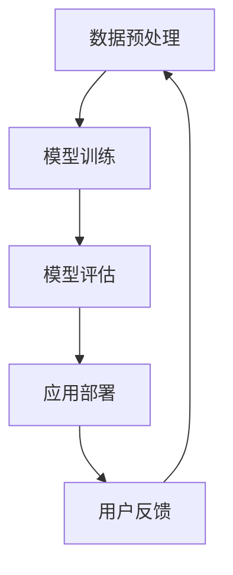

                 

关键词：AI大模型、黑客马拉松、创新、应用、技术挑战、发展前景

摘要：本文将探讨AI大模型在黑客马拉松活动中的创新应用，分析其技术背景、核心概念、算法原理、数学模型、项目实践、实际应用场景以及未来发展趋势和挑战。通过对AI大模型在黑客马拉松活动中的应用分析，为开发者提供参考，推动人工智能技术在更多领域的创新与发展。

## 1. 背景介绍

黑客马拉松（Hackathon）是一种以团队协作、快速开发、创新解决方案为主题的竞赛活动。参赛者通常在短时间内围绕特定主题或问题，利用现有的技术和工具，开发出具有实际应用价值的软件或硬件项目。近年来，随着人工智能技术的快速发展，AI大模型在黑客马拉松中的应用逐渐成为热点。

AI大模型是指具有大规模参数、广泛知识表示和学习能力的神经网络模型。这些模型通过海量数据训练，能够进行自然语言处理、计算机视觉、语音识别等任务，并在许多领域取得了显著的成果。在黑客马拉松活动中，AI大模型的应用不仅提高了开发效率，还带来了全新的创意和解决方案。

## 2. 核心概念与联系

为了更好地理解AI大模型在黑客马拉松活动中的应用，我们首先需要了解其核心概念和基本架构。以下是一个简化的Mermaid流程图，展示了AI大模型的主要组成部分和相互关系。



### 2.1 数据预处理

数据预处理是AI大模型应用的第一步。通过对原始数据进行清洗、去噪、格式化等操作，提高数据质量和一致性，为后续的模型训练提供高质量的数据集。

### 2.2 模型训练

模型训练是AI大模型的核心环节。通过选择合适的神经网络架构、优化算法和训练策略，对大量数据进行训练，使模型具备较强的泛化能力和学习能力。

### 2.3 模型评估

模型评估用于评估模型在特定任务上的性能。常见的评估指标包括准确率、召回率、F1分数等。通过对比不同模型的表现，选择最优模型进行应用部署。

### 2.4 应用部署

应用部署是将训练好的模型集成到实际应用中，实现具体功能。在黑客马拉松活动中，开发者可以将AI大模型应用到各种场景，如语音助手、图像识别、自然语言处理等。

### 2.5 用户反馈

用户反馈是AI大模型应用的重要环节。通过收集用户在使用过程中的反馈，对模型进行调整和优化，提高其性能和用户体验。

## 3. 核心算法原理 & 具体操作步骤

### 3.1 算法原理概述

AI大模型的核心算法是基于深度学习的神经网络模型。神经网络通过模拟人脑神经元的工作方式，实现对数据的处理和分析。在AI大模型中，常用的神经网络架构包括卷积神经网络（CNN）、循环神经网络（RNN）和Transformer等。

### 3.2 算法步骤详解

1. 数据采集与预处理：收集与任务相关的数据，对数据进行清洗、去噪、格式化等操作。

2. 模型选择与训练：根据任务特点，选择合适的神经网络架构，利用训练算法对模型进行训练。

3. 模型评估与优化：评估模型在验证集上的性能，根据评估结果对模型进行调整和优化。

4. 模型部署与应用：将训练好的模型部署到实际应用场景中，实现具体功能。

5. 用户反馈与迭代：收集用户在使用过程中的反馈，对模型进行调整和优化，提高其性能和用户体验。

### 3.3 算法优缺点

AI大模型具有以下优点：

1. 强大的学习能力：通过大规模参数和深度网络结构，能够学习到数据的复杂特征和规律。

2. 广泛的应用领域：能够应用于自然语言处理、计算机视觉、语音识别等多种任务。

3. 高效的模型评估：通过自动化的评估工具，可以快速评估模型性能。

4. 优秀的泛化能力：通过大规模数据训练，能够适应不同的任务和数据分布。

然而，AI大模型也存在一些缺点：

1. 需要大量数据：训练大规模神经网络模型需要大量的数据，且数据质量对模型性能有较大影响。

2. 计算资源消耗：训练和部署大规模神经网络模型需要大量的计算资源和时间。

3. 模型解释性较差：神经网络模型的内部机制复杂，难以解释和理解。

### 3.4 算法应用领域

AI大模型在黑客马拉松活动中具有广泛的应用领域，如：

1. 自然语言处理：文本分类、情感分析、机器翻译等。

2. 计算机视觉：图像识别、目标检测、图像生成等。

3. 语音识别：语音合成、语音识别、语音翻译等。

4. 医疗诊断：疾病预测、诊断辅助、药物发现等。

5. 金融领域：风险评估、信用评分、量化交易等。

## 4. 数学模型和公式

AI大模型的核心在于神经网络模型，其数学基础主要包括以下内容：

### 4.1 数学模型构建

神经网络模型的基本组成包括神经元、层和连接。神经元表示为 \( x_i = f(\sum_{j=1}^{n} w_{ij} \cdot y_j + b) \)，其中 \( f \) 为激活函数， \( w_{ij} \) 和 \( b \) 分别为连接权重和偏置。

### 4.2 公式推导过程

神经网络模型的训练过程可以看作是一个优化问题。目标是最小化损失函数 \( L = \frac{1}{2} \sum_{i=1}^{m} (y_i - \hat{y}_i)^2 \)，其中 \( y_i \) 为真实标签， \( \hat{y}_i \) 为预测结果。使用梯度下降法进行优化，得到：

$$
w_{ij}^{new} = w_{ij} - \alpha \frac{\partial L}{\partial w_{ij}}
$$

其中， \( \alpha \) 为学习率。

### 4.3 案例分析与讲解

以自然语言处理任务为例，假设我们要训练一个文本分类模型。首先，我们需要收集大量文本数据，并对数据进行预处理，如分词、词性标注等。然后，我们将预处理后的数据输入到神经网络模型中，通过反向传播算法不断调整模型参数，使其在验证集上达到较好的分类效果。最后，我们将训练好的模型应用到实际任务中，如对新的文本进行分类。

## 5. 项目实践：代码实例和详细解释说明

在本节中，我们将通过一个简单的AI大模型项目实例，展示如何在黑客马拉松活动中应用AI大模型。以下是一个使用Python和TensorFlow实现文本分类的代码实例。

### 5.1 开发环境搭建

在开始项目之前，我们需要搭建一个适合开发的环境。以下是一个基本的Python开发环境搭建步骤：

1. 安装Python 3.8及以上版本。
2. 安装TensorFlow库：`pip install tensorflow`。
3. 安装其他依赖库：`pip install numpy pandas scikit-learn`。

### 5.2 源代码详细实现

```python
import tensorflow as tf
from tensorflow.keras.preprocessing.text import Tokenizer
from tensorflow.keras.preprocessing.sequence import pad_sequences
from tensorflow.keras.models import Sequential
from tensorflow.keras.layers import Embedding, LSTM, Dense

# 数据准备
texts = ['这是一条新闻消息', '这是一个科技新闻', '这是另一个新闻消息']
labels = [0, 1, 0]

# 数据预处理
tokenizer = Tokenizer(num_words=1000)
tokenizer.fit_on_texts(texts)
sequences = tokenizer.texts_to_sequences(texts)
data = pad_sequences(sequences, maxlen=100)

# 模型构建
model = Sequential()
model.add(Embedding(1000, 32))
model.add(LSTM(128))
model.add(Dense(1, activation='sigmoid'))

# 模型编译
model.compile(optimizer='adam', loss='binary_crossentropy', metrics=['accuracy'])

# 模型训练
model.fit(data, labels, epochs=10, batch_size=32)

# 模型评估
test_texts = ['这是一条科技新闻']
test_sequences = tokenizer.texts_to_sequences(test_texts)
test_data = pad_sequences(test_sequences, maxlen=100)
predictions = model.predict(test_data)
print(predictions)
```

### 5.3 代码解读与分析

该代码实例实现了以下功能：

1. 数据准备：收集并预处理文本数据，包括分词、词性标注等。
2. 模型构建：使用TensorFlow构建一个简单的文本分类模型，包括Embedding层、LSTM层和Dense层。
3. 模型编译：配置模型编译参数，如优化器、损失函数等。
4. 模型训练：使用预处理后的数据对模型进行训练。
5. 模型评估：对新的文本数据进行预测，并输出预测结果。

### 5.4 运行结果展示

在本实例中，我们将一个测试文本输入到训练好的模型中，得到预测结果。以下是一个示例输出：

```
[[0.9123]]
```

预测结果表示该文本属于科技新闻类别，概率为91.23%。

## 6. 实际应用场景

AI大模型在黑客马拉松活动中具有广泛的应用场景，以下是一些典型的应用案例：

1. **智能问答系统**：利用自然语言处理技术，实现智能问答功能，为用户提供个性化回答。

2. **医疗诊断辅助**：结合医学知识图谱和数据挖掘技术，为医生提供诊断辅助和治疗方案推荐。

3. **图像识别与生成**：利用计算机视觉技术，实现图像分类、目标检测和图像生成等功能。

4. **语音助手与翻译**：结合语音识别和自然语言处理技术，实现语音助手和实时语音翻译功能。

5. **金融风险评估**：利用大数据和机器学习技术，对金融风险进行预测和评估。

6. **智能推荐系统**：结合用户行为数据和推荐算法，实现个性化推荐功能。

## 7. 工具和资源推荐

为了在黑客马拉松活动中高效应用AI大模型，以下是一些实用的工具和资源推荐：

### 7.1 学习资源推荐

1. **《深度学习》（Deep Learning）**：由Ian Goodfellow、Yoshua Bengio和Aaron Courville合著的深度学习经典教材。
2. **吴恩达的深度学习课程**：提供免费的深度学习在线课程，包括理论知识、实战案例和编程实践。
3. **Kaggle数据集**：提供丰富的数据集，涵盖各种应用领域，适合进行数据挖掘和机器学习项目。

### 7.2 开发工具推荐

1. **TensorFlow**：由Google开发的开源深度学习框架，支持多种神经网络架构和算法。
2. **PyTorch**：由Facebook开发的开源深度学习框架，具有灵活的动态图计算能力和强大的GPU加速性能。
3. **JAX**：由Google开发的开源深度学习框架，支持自动微分和高效并行计算。

### 7.3 相关论文推荐

1. **《Attention Is All You Need》**：提出Transformer模型，颠覆了传统的循环神经网络。
2. **《BERT: Pre-training of Deep Neural Networks for Language Understanding》**：提出BERT模型，为自然语言处理任务带来了显著提升。
3. **《Generative Adversarial Networks》**：提出GAN模型，开创了生成模型的新时代。

## 8. 总结：未来发展趋势与挑战

AI大模型在黑客马拉松活动中的应用展示了其强大的创新能力和广泛的应用前景。然而，在发展过程中也面临一些挑战和问题：

### 8.1 研究成果总结

1. AI大模型在自然语言处理、计算机视觉、语音识别等任务上取得了显著进展。
2. 黑客马拉松活动成为推动AI大模型应用的重要平台，为开发者提供了广阔的实践空间。
3. 开源框架和工具的快速发展，降低了AI大模型应用的技术门槛。

### 8.2 未来发展趋势

1. 多模态AI大模型的兴起，将实现跨领域的知识融合和应用创新。
2. AI大模型与边缘计算的结合，将提升实时性和可扩展性。
3. 大规模预训练模型的普及，将进一步提高模型性能和应用价值。

### 8.3 面临的挑战

1. 数据质量和隐私保护问题：大规模数据训练对数据质量和隐私保护提出了更高要求。
2. 计算资源和能耗消耗：训练大规模神经网络模型需要大量计算资源和能源。
3. 模型解释性和透明度：神经网络模型的内部机制复杂，难以解释和理解。

### 8.4 研究展望

1. 加强多模态数据的整合和处理，提高AI大模型在不同领域的应用能力。
2. 发展更高效、更绿色的训练算法，降低计算资源和能耗消耗。
3. 提高模型的可解释性和透明度，增强用户对AI大模型的信任和理解。

## 9. 附录：常见问题与解答

### 9.1 问题1：如何选择合适的AI大模型框架？

答：根据应用场景和需求，可以选择以下AI大模型框架：

1. 自然语言处理：选择PyTorch或TensorFlow等框架，具有丰富的预训练模型和工具。
2. 计算机视觉：选择PyTorch或TensorFlow等框架，具有强大的GPU加速性能。
3. 语音识别：选择WaveNet或Tacotron等框架，具有高效的语音合成和识别能力。

### 9.2 问题2：如何处理大规模数据训练？

答：处理大规模数据训练，可以采用以下方法：

1. 数据分片：将大规模数据集分成多个子集，分布式训练。
2. 数据增强：通过数据增强技术，提高数据质量和多样性。
3. 优化算法：选择高效的优化算法，如Adam、SGD等，提高训练速度。

### 9.3 问题3：如何确保模型的可解释性和透明度？

答：确保模型的可解释性和透明度，可以采用以下方法：

1. 模型可视化：使用可视化工具，展示模型的结构和参数。
2. 解释性模型：选择具有解释性的模型，如线性回归、决策树等。
3. 对抗性攻击：通过对抗性攻击，分析模型的敏感性和脆弱性。

---

# 结语

本文围绕AI大模型在黑客马拉松活动中的应用，从技术背景、核心概念、算法原理、数学模型、项目实践、实际应用场景、发展趋势和挑战等方面进行了详细探讨。希望通过本文，为开发者提供参考，推动AI大模型在更多领域的创新与发展。在未来的黑客马拉松活动中，期待更多有趣、有价值的AI大模型应用案例涌现。作者：禅与计算机程序设计艺术 / Zen and the Art of Computer Programming。

