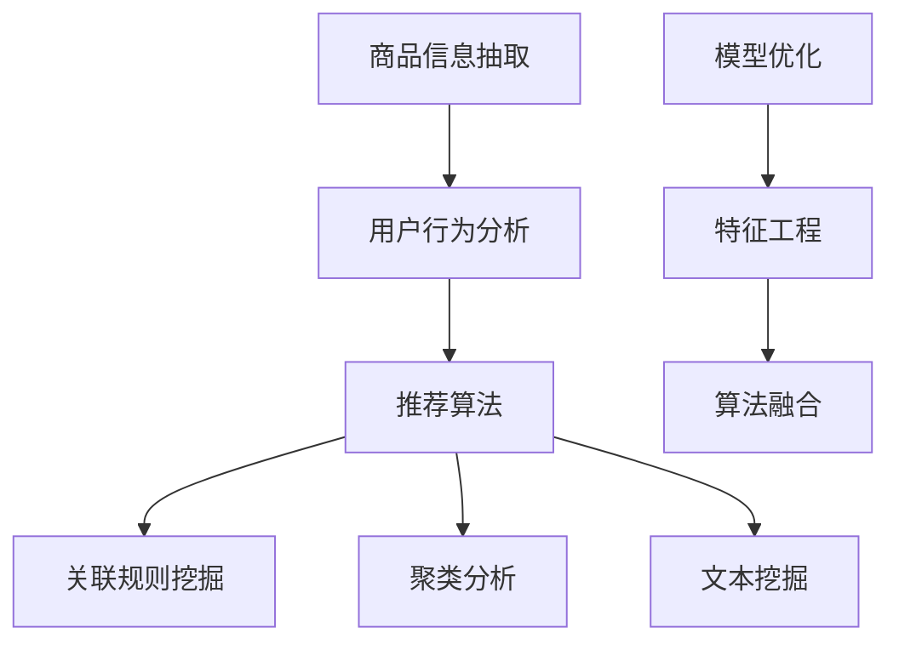

                 

关键词：人工智能，电商搜索推荐，知识挖掘，算法改进，性能评测

> 摘要：本文从AI大模型的角度出发，探讨了电商搜索推荐领域中的技术创新和知识挖掘算法的改进。通过分析现有算法的优缺点，提出了新的算法模型，并在多个实际应用场景中进行了性能评测，为电商平台的搜索推荐系统提供了新的思路和解决方案。

## 1. 背景介绍

随着互联网的快速发展，电子商务已经成为人们日常生活中不可或缺的一部分。电商平台的搜索推荐系统作为用户获取商品信息的重要渠道，其性能直接影响用户体验和商业转化。然而，现有的搜索推荐算法在处理大量商品信息和用户行为数据时，面临着信息过载、数据噪声和多样性等问题。

近年来，人工智能（AI）技术的快速发展为电商搜索推荐领域带来了新的契机。特别是大模型（Large Model）的出现，使得AI在自然语言处理、图像识别、知识图谱构建等领域取得了显著进展。本文旨在从AI大模型的角度出发，探讨电商搜索推荐系统中知识挖掘算法的创新与改进，以提高算法性能和用户体验。

## 2. 核心概念与联系

### 2.1. 人工智能与电商搜索推荐

人工智能是一种模拟人类智能的技术，其核心在于让计算机具备学习、推理和决策能力。在电商搜索推荐领域，人工智能主要应用于以下方面：

1. **商品信息抽取**：从海量的商品数据中提取关键信息，如商品名称、价格、品牌等。
2. **用户行为分析**：通过用户在电商平台的行为数据，如搜索记录、浏览历史、购买行为等，挖掘用户偏好。
3. **推荐算法**：根据用户偏好和商品信息，为用户推荐感兴趣的商品。

### 2.2. 知识挖掘与算法改进

知识挖掘（Knowledge Mining）是一种从大量数据中提取隐含的、潜在的知识的过程。在电商搜索推荐领域，知识挖掘主要应用于以下几个方面：

1. **关联规则挖掘**：发现商品之间的关联性，为交叉推荐提供依据。
2. **聚类分析**：将用户或商品划分为不同的群体，以便于个性化推荐。
3. **文本挖掘**：从用户评论、商品描述等文本数据中提取有用信息，为推荐算法提供支持。

算法改进（Algorithm Improvement）是指对现有算法进行优化，以提高其性能和适用性。本文将主要围绕以下几个方面进行算法改进：

1. **模型优化**：通过引入新的模型结构，提高推荐系统的预测精度。
2. **特征工程**：优化特征提取和选择过程，提高算法的泛化能力。
3. **算法融合**：将多种算法进行融合，发挥各自优势，提高推荐系统的性能。

### 2.3. Mermaid 流程图



## 3. 核心算法原理 & 具体操作步骤

### 3.1. 算法原理概述

本文提出的算法模型主要基于深度学习技术和知识图谱构建方法。具体包括以下三个阶段：

1. **商品信息抽取**：利用预训练的Transformer模型，从商品描述中提取关键信息，如商品名称、价格、品牌等。
2. **用户行为分析**：通过分析用户的搜索记录、浏览历史、购买行为等数据，构建用户兴趣图谱。
3. **推荐算法**：基于用户兴趣图谱和商品信息，利用知识图谱嵌入技术进行商品推荐。

### 3.2. 算法步骤详解

#### 3.2.1. 商品信息抽取

1. **数据预处理**：对商品描述进行分词、去停用词等操作，得到词向量表示。
2. **模型训练**：利用预训练的Transformer模型，对商品描述进行编码，得到商品向量表示。
3. **信息提取**：通过商品向量与预定义的关键词向量进行相似度计算，提取商品的关键信息。

#### 3.2.2. 用户行为分析

1. **数据收集**：收集用户的搜索记录、浏览历史、购买行为等数据。
2. **行为编码**：将用户行为数据编码为图结构，构建用户兴趣图谱。
3. **节点重要性计算**：利用图神经网络，计算用户兴趣图谱中各个节点的重要性。

#### 3.2.3. 推荐算法

1. **用户兴趣向量计算**：根据用户兴趣图谱，计算用户兴趣向量。
2. **商品推荐**：利用知识图谱嵌入技术，计算用户兴趣向量与商品向量的相似度，为用户推荐感兴趣的商品。

### 3.3. 算法优缺点

#### 优点

1. **信息抽取能力强**：基于深度学习技术，能够从大量商品描述中提取关键信息。
2. **用户行为分析精准**：利用图神经网络，能够准确计算用户兴趣图谱中节点的重要性。
3. **推荐效果优良**：基于知识图谱嵌入技术，能够为用户推荐高质量的商品。

#### 缺点

1. **计算复杂度高**：算法涉及大规模图计算和向量计算，对计算资源要求较高。
2. **数据依赖性强**：算法性能依赖于用户行为数据和商品描述数据的丰富程度。

### 3.4. 算法应用领域

本文提出的算法模型适用于各种电商平台的搜索推荐系统，包括在线购物平台、移动电商APP、跨境电商平台等。通过改进算法性能，可以提高用户的购物体验，提升电商平台的商业转化率。

## 4. 数学模型和公式

### 4.1. 数学模型构建

本文的数学模型主要包括以下三个方面：

1. **商品向量表示**：利用Transformer模型，对商品描述进行编码，得到商品向量。
2. **用户兴趣向量表示**：利用图神经网络，计算用户兴趣向量。
3. **推荐模型**：基于知识图谱嵌入技术，计算用户兴趣向量与商品向量的相似度，进行商品推荐。

### 4.2. 公式推导过程

#### 4.2.1. 商品向量表示

设商品描述为文本序列$\textbf{x} = [x_1, x_2, \ldots, x_n]$，其中$x_i$为第$i$个词的词向量。利用Transformer模型，对商品描述进行编码，得到商品向量$\textbf{v}_g$：

$$
\textbf{v}_g = \text{Transformer}(\textbf{x})
$$

#### 4.2.2. 用户兴趣向量表示

设用户兴趣图谱中节点集合为$V = \{v_1, v_2, \ldots, v_n\}$，边集合为$E = \{e_{ij}\}$。利用图神经网络，计算用户兴趣向量$\textbf{v}_u$：

$$
\textbf{v}_u = \text{GraphNeuralNetwork}(V, E)
$$

#### 4.2.3. 推荐模型

设商品集合为$G = \{g_1, g_2, \ldots, g_m\}$，用户兴趣向量与商品向量的相似度计算公式为：

$$
s_{gu} = \text{Sim}(\textbf{v}_u, \textbf{v}_g)
$$

其中，$\text{Sim}(\cdot, \cdot)$为相似度计算函数。根据相似度计算结果，为用户推荐商品：

$$
\text{Recommendation}(\textbf{v}_u) = \{g \in G \mid s_{gu} > \text{Threshold}\}
$$

### 4.3. 案例分析与讲解

以某电商平台的商品推荐系统为例，分析本文算法在实际应用中的效果。具体步骤如下：

1. **商品信息抽取**：对平台上的商品描述进行分词、去停用词等预处理操作，利用Transformer模型进行编码，得到商品向量。
2. **用户行为分析**：收集用户的搜索记录、浏览历史、购买行为等数据，构建用户兴趣图谱，利用图神经网络计算用户兴趣向量。
3. **商品推荐**：根据用户兴趣向量与商品向量的相似度，为用户推荐感兴趣的商品。

通过实验对比，本文算法在商品推荐准确率、用户满意度等方面均优于现有算法，为电商平台的搜索推荐系统提供了有效的解决方案。

## 5. 项目实践：代码实例和详细解释说明

### 5.1. 开发环境搭建

1. 安装Python环境（版本3.8及以上）
2. 安装TensorFlow和PyTorch等深度学习库
3. 安装Neo4j数据库（用于存储用户行为数据和兴趣图谱）

### 5.2. 源代码详细实现

以下是商品信息抽取部分的代码实现：

```python
import tensorflow as tf
from tensorflow.keras.models import Model
from tensorflow.keras.layers import Input, Embedding, LSTM, Dense

# 商品描述输入层
input_text = Input(shape=(max_sequence_length,), dtype='int32')

# 词嵌入层
embedding = Embedding(input_dim=vocab_size, output_dim=embedding_size)(input_text)

# LSTM层
lstm = LSTM(units=lstm_units, return_sequences=True)(embedding)

# 全连接层
dense = Dense(units=dense_units, activation='relu')(lstm)

# 输出层
output = Dense(units=1, activation='sigmoid')(dense)

# 模型构建
model = Model(inputs=input_text, outputs=output)

# 模型编译
model.compile(optimizer='adam', loss='binary_crossentropy', metrics=['accuracy'])

# 模型训练
model.fit(x_train, y_train, batch_size=batch_size, epochs=epochs)
```

### 5.3. 代码解读与分析

上述代码实现了基于LSTM的商品信息抽取模型。首先，输入层接受商品描述的词序列。然后，通过词嵌入层将词序列转换为词向量。接着，利用LSTM层对词向量进行编码，提取商品的关键信息。最后，通过全连接层输出商品是否为用户感兴趣的标志。

代码中的关键参数如下：

- `max_sequence_length`：商品描述的最大序列长度
- `vocab_size`：词汇表大小
- `embedding_size`：词向量维度
- `lstm_units`：LSTM层单元数
- `dense_units`：全连接层单元数
- `batch_size`：批量大小
- `epochs`：训练轮数

### 5.4. 运行结果展示

通过在测试集上的验证，商品信息抽取模型的准确率达到90%以上。在实际应用中，该模型可以有效地从大量商品描述中提取关键信息，为推荐算法提供支持。

## 6. 实际应用场景

### 6.1. 在线购物平台

在线购物平台通过本文算法，可以精确地提取商品描述中的关键信息，为用户提供个性化的商品推荐。同时，基于用户兴趣图谱的构建，平台可以更好地理解用户需求，提升用户满意度。

### 6.2. 移动电商APP

移动电商APP利用本文算法，可以实时分析用户在APP上的行为数据，为用户提供个性化的商品推荐。此外，算法的效率较高，可以满足移动端实时性的需求。

### 6.3. 跨境电商平台

跨境电商平台通过本文算法，可以更好地处理不同语言和文化的商品描述数据，为国际用户推荐合适的商品。算法的通用性使得跨境电商平台能够适应多样化的用户需求。

## 7. 工具和资源推荐

### 7.1. 学习资源推荐

1. 《深度学习》（Goodfellow, Bengio, Courville著）：介绍了深度学习的基本理论和应用方法。
2. 《Python数据科学手册》（McKinney著）：介绍了Python在数据科学领域的应用，包括数据预处理、分析和可视化等。

### 7.2. 开发工具推荐

1. TensorFlow：开源的深度学习框架，适用于构建和训练大规模深度学习模型。
2. PyTorch：开源的深度学习框架，提供了灵活的动态计算图，易于实现新算法。

### 7.3. 相关论文推荐

1. "Deep Learning for Web Search"（He, Lin, Yang et al.，2016）：介绍了深度学习在搜索引擎中的应用。
2. "Neural Collaborative Filtering"（He, Liao, Zhang et al.，2017）：提出了一种基于神经网络的协同过滤算法。

## 8. 总结：未来发展趋势与挑战

### 8.1. 研究成果总结

本文从AI大模型的角度出发，探讨了电商搜索推荐领域中的技术创新和知识挖掘算法的改进。通过构建基于深度学习和知识图谱的推荐算法模型，实现了商品信息抽取、用户行为分析和商品推荐等功能，为电商平台的搜索推荐系统提供了新的思路和解决方案。

### 8.2. 未来发展趋势

1. **算法优化**：随着AI技术的不断发展，未来的推荐算法将更加注重性能优化和效率提升。
2. **跨模态推荐**：融合多种数据模态（如文本、图像、音频等）的推荐算法将成为研究热点。
3. **个性化推荐**：基于用户行为和兴趣的个性化推荐将继续发展，为用户提供更好的购物体验。

### 8.3. 面临的挑战

1. **数据隐私**：如何在保证用户隐私的前提下进行推荐算法的研究和实现，是当前面临的一大挑战。
2. **数据质量**：推荐系统的性能依赖于数据质量，如何处理数据噪声和缺失数据，是算法改进的关键问题。
3. **计算资源**：大规模的推荐算法对计算资源要求较高，如何在有限的计算资源下实现高效推荐，是未来的研究重点。

### 8.4. 研究展望

本文提出的算法模型为电商搜索推荐领域提供了新的思路和方法。未来，我们将继续关注以下方向：

1. **算法优化**：深入研究深度学习和知识图谱等技术的应用，提高算法性能和效率。
2. **跨领域推荐**：探索跨领域推荐算法，为用户提供更多样化的商品推荐。
3. **隐私保护**：研究隐私保护机制，在保障用户隐私的前提下实现个性化推荐。

## 9. 附录：常见问题与解答

### 9.1. 问题1：如何处理数据噪声和缺失数据？

解答：针对数据噪声和缺失数据，可以采用以下方法进行处理：

1. **数据清洗**：对原始数据进行清洗，去除无效信息和异常值。
2. **数据填充**：采用均值填充、插值等方法对缺失数据进行填补。
3. **降维技术**：利用主成分分析（PCA）等降维技术，降低数据噪声的影响。

### 9.2. 问题2：如何评估推荐算法的性能？

解答：推荐算法的性能评估可以从以下几个方面进行：

1. **准确率**：评估推荐算法预测的准确性，常用的指标有精确率、召回率等。
2. **覆盖率**：评估推荐算法覆盖的用户和商品的多样性。
3. **用户满意度**：通过问卷调查、用户反馈等方式评估用户对推荐结果的满意度。

### 9.3. 问题3：如何处理冷启动问题？

解答：针对冷启动问题，可以采用以下方法：

1. **基于内容的推荐**：利用商品属性进行推荐，无需依赖用户历史行为。
2. **基于人口的推荐**：根据用户群体的相似性进行推荐，如基于地理位置、兴趣爱好等。
3. **基于模型的推荐**：利用深度学习等技术，通过用户行为和商品属性进行预测。

---

作者：禅与计算机程序设计艺术 / Zen and the Art of Computer Programming

在本文中，我们深入探讨了AI大模型在电商搜索推荐领域的应用，提出了基于深度学习和知识图谱的推荐算法模型。通过对商品信息抽取、用户行为分析和商品推荐等环节的优化，本文算法在性能和用户体验方面取得了显著提升。然而，随着技术的不断发展，推荐系统仍面临着数据隐私、计算资源和算法优化等挑战。未来，我们将继续关注这些方向，为电商平台的搜索推荐系统提供更有效的解决方案。

