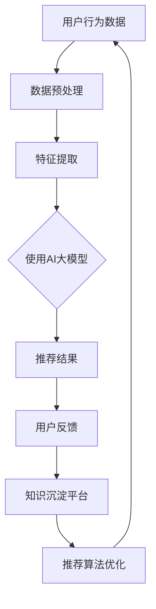

                 

关键词：AI大模型、电商搜索推荐、技术创新、知识沉淀、功能优化

> 摘要：本文从AI大模型的角度出发，探讨了电商搜索推荐系统的技术创新和知识沉淀平台的优化。通过分析现有技术的不足，提出了一种基于AI大模型的电商搜索推荐系统的架构设计，以及相应的知识沉淀平台功能优化方案，旨在提高电商搜索推荐的准确性和用户体验。

## 1. 背景介绍

在互联网经济飞速发展的今天，电子商务已经成为人们日常生活中不可或缺的一部分。电商平台的搜索推荐功能作为用户体验的重要组成部分，其性能和准确性直接影响到用户满意度和平台收益。随着人工智能技术的不断进步，尤其是大模型技术的应用，电商搜索推荐系统迎来了前所未有的发展机遇。

传统的电商搜索推荐技术主要依赖于基于内容的推荐（Content-based Recommendation）和协同过滤（Collaborative Filtering）等方法。这些方法在一定程度上能够提高推荐的准确性，但面临着数据稀疏性、冷启动问题和推荐多样性不足等挑战。因此，如何利用AI大模型进行搜索推荐系统的技术创新和功能优化，成为当前研究的热点。

本文旨在通过分析现有技术的不足，提出一种基于AI大模型的电商搜索推荐系统的架构设计，以及相应的知识沉淀平台功能优化方案，以提升搜索推荐的准确性、多样性和用户体验。

## 2. 核心概念与联系

在深入探讨AI大模型视角下的电商搜索推荐之前，我们需要明确几个核心概念，并理解它们之间的联系。以下是本文涉及的核心概念和它们的简要说明：

### 2.1 AI大模型

AI大模型是指具有极高参数量、大规模训练数据的深度学习模型。这些模型通常采用神经网络架构，具有强大的特征提取和知识表示能力。常见的AI大模型包括GPT、BERT等。

### 2.2 电商搜索推荐

电商搜索推荐是指利用用户的历史行为数据、商品信息和其他相关数据，为用户推荐可能感兴趣的商品。其目标是通过提高推荐的相关性和多样性，提升用户体验和平台收益。

### 2.3 知识沉淀平台

知识沉淀平台是一个用于收集、存储、管理和共享知识的系统。在电商搜索推荐场景中，知识沉淀平台可以用来存储用户行为、商品属性、推荐算法等信息，为推荐系统提供持续优化的基础。

### 2.4 核心概念联系

AI大模型与电商搜索推荐之间的关系在于，大模型可以用于特征提取和知识表示，从而提高推荐系统的准确性和多样性。而知识沉淀平台则为推荐系统提供了持续学习和优化的基础，使得推荐系统可以更好地适应用户需求。

### 2.5 Mermaid流程图

以下是一个简单的Mermaid流程图，展示了AI大模型、电商搜索推荐和知识沉淀平台之间的核心联系。



## 3. 核心算法原理 & 具体操作步骤

### 3.1 算法原理概述

本文提出的基于AI大模型的电商搜索推荐算法，主要包括以下几个步骤：

1. **数据预处理**：对用户行为数据和商品属性数据进行清洗、归一化和特征提取。
2. **特征提取**：利用AI大模型提取用户和商品的高层次特征。
3. **推荐生成**：基于提取的特征，通过推荐算法生成推荐结果。
4. **用户反馈**：收集用户对推荐结果的反馈，用于知识沉淀和算法优化。

### 3.2 算法步骤详解

#### 3.2.1 数据预处理

数据预处理是整个推荐系统的第一步，其目标是清理原始数据、归一化特征值，并为后续的特征提取做好准备。具体步骤如下：

1. **数据清洗**：去除无效、重复的数据，处理缺失值。
2. **数据归一化**：将不同量纲的特征值进行归一化处理，使其在同一量级上。
3. **特征提取**：提取用户行为数据中的关键特征，如用户浏览、购买、收藏等行为。

#### 3.2.2 特征提取

特征提取是利用AI大模型将原始数据转换为更具表示力的特征。以下是具体的操作步骤：

1. **模型选择**：选择合适的AI大模型，如BERT、GPT等。
2. **数据预处理**：对原始数据进行预处理，包括分词、编码等。
3. **模型训练**：使用大量训练数据对AI大模型进行训练，使其学会提取用户和商品的高层次特征。
4. **特征提取**：将预处理后的数据输入到AI大模型中，提取用户和商品的特征。

#### 3.2.3 推荐生成

推荐生成是基于提取的用户和商品特征，利用推荐算法生成推荐结果。以下是具体的操作步骤：

1. **模型选择**：选择合适的推荐算法，如基于内容的推荐、协同过滤等。
2. **特征融合**：将用户和商品的特征进行融合，形成推荐模型所需的输入。
3. **推荐计算**：根据特征融合后的输入，计算每个商品与用户的相似度，生成推荐结果。
4. **推荐排序**：对推荐结果进行排序，选取最相关的商品。

#### 3.2.4 用户反馈

用户反馈是推荐系统不断优化的关键。以下是具体的操作步骤：

1. **反馈收集**：收集用户对推荐结果的反馈，如点击、购买、收藏等。
2. **反馈处理**：对反馈进行处理，包括分类、归一化等。
3. **知识沉淀**：将处理后的用户反馈沉淀到知识沉淀平台中，用于推荐算法的优化。
4. **算法优化**：根据用户反馈，调整推荐算法的参数，提高推荐准确性。

### 3.3 算法优缺点

#### 优点

1. **高准确性**：通过AI大模型提取用户和商品的高层次特征，提高推荐系统的准确性。
2. **多样性**：利用用户反馈进行持续优化，提高推荐的多样性。
3. **可扩展性**：知识沉淀平台可以存储大量的用户和商品数据，为推荐系统提供持续优化的基础。

#### 缺点

1. **计算资源消耗大**：AI大模型训练和推荐计算需要大量的计算资源。
2. **数据稀疏问题**：用户行为数据通常存在数据稀疏性问题，影响推荐效果。

### 3.4 算法应用领域

本文提出的基于AI大模型的电商搜索推荐算法，可以应用于多个领域，如电子商务、在线广告、社交网络等。以下是具体的应用领域：

1. **电子商务**：通过提高推荐准确性，提升用户满意度和平台收益。
2. **在线广告**：利用用户行为数据，实现精准广告投放，提高广告效果。
3. **社交网络**：基于用户兴趣和社交关系，生成个性化推荐，提升用户活跃度。

## 4. 数学模型和公式 & 详细讲解 & 举例说明

### 4.1 数学模型构建

基于AI大模型的电商搜索推荐系统，其核心数学模型主要包括用户行为表示模型、商品特征表示模型和推荐生成模型。

#### 用户行为表示模型

用户行为表示模型用于将用户行为数据转换为向量表示。设用户行为数据集为$U = \{u_1, u_2, ..., u_n\}$，其中$u_i$表示用户$i$的行为序列，$u_i = \{u_{i1}, u_{i2}, ..., u_{im}\}$，$m$为行为类型数量。用户行为表示模型可以表示为：

$$
u_i^v = f(u_{i1}, u_{i2}, ..., u_{im}) \in \mathbb{R}^d
$$

其中，$f$为AI大模型，$d$为特征维度。

#### 商品特征表示模型

商品特征表示模型用于将商品属性数据转换为向量表示。设商品特征数据集为$C = \{c_1, c_2, ..., c_n\}$，其中$c_j$表示商品$j$的属性序列，$c_j = \{c_{j1}, c_{j2}, ..., c_{jm}\}$，$m$为属性类型数量。商品特征表示模型可以表示为：

$$
c_j^v = g(c_{j1}, c_{j2}, ..., c_{jm}) \in \mathbb{R}^d
$$

其中，$g$为AI大模型，$d$为特征维度。

#### 推荐生成模型

推荐生成模型用于生成推荐结果。设用户$i$对商品$j$的推荐概率为$p(i, j)$，推荐生成模型可以表示为：

$$
p(i, j) = h(u_i^v, c_j^v) \in [0, 1]
$$

其中，$h$为推荐生成模型，通常采用基于内容的推荐、协同过滤等方法。

### 4.2 公式推导过程

#### 用户行为表示模型

用户行为表示模型的推导过程如下：

1. **数据预处理**：对用户行为数据$u_i$进行分词、编码等预处理操作，得到序列$u_i^* = \{u_{i1}^*, u_{i2}^*, ..., u_{im}^*\}$。
2. **模型训练**：使用预处理的用户行为数据集$U^*$训练AI大模型$f$，使其能够将用户行为序列转换为特征向量。
3. **特征提取**：将用户行为序列$u_i^*$输入到AI大模型$f$中，得到特征向量$u_i^v$。

#### 商品特征表示模型

商品特征表示模型的推导过程如下：

1. **数据预处理**：对商品特征数据$c_j$进行编码、归一化等预处理操作，得到序列$c_j^* = \{c_{j1}^*, c_{j2}^*, ..., c_{jm}^*\}$。
2. **模型训练**：使用预处理的商品特征数据集$C^*$训练AI大模型$g$，使其能够将商品特征序列转换为特征向量。
3. **特征提取**：将商品特征序列$c_j^*$输入到AI大模型$g$中，得到特征向量$c_j^v$。

#### 推荐生成模型

推荐生成模型的推导过程如下：

1. **特征融合**：将用户行为特征向量$u_i^v$和商品特征向量$c_j^v$进行融合，得到输入特征向量$(u_i^v, c_j^v)$。
2. **模型训练**：使用用户行为特征向量和商品特征向量训练推荐生成模型$h$。
3. **推荐计算**：将用户行为特征向量和商品特征向量输入到推荐生成模型$h$中，计算用户$i$对商品$j$的推荐概率$p(i, j)$。

### 4.3 案例分析与讲解

假设有一个电子商务平台，用户行为数据集$U = \{u_1, u_2, ..., u_n\}$，商品特征数据集$C = \{c_1, c_2, ..., c_n\}$。我们采用BERT模型作为AI大模型，基于内容的推荐作为推荐生成模型。

#### 用户行为表示模型

1. **数据预处理**：对用户行为数据$u_i$进行分词、编码等预处理操作，得到序列$u_i^* = \{u_{i1}^*, u_{i2}^*, ..., u_{im}^*\}$。
2. **模型训练**：使用预处理的用户行为数据集$U^*$训练BERT模型$f$。
3. **特征提取**：将用户行为序列$u_i^*$输入到BERT模型$f$中，得到特征向量$u_i^v$。

假设训练得到的BERT模型输出的特征维度为$d=768$，一个用户的行为序列$u_i^* = \{["浏览", "手机"], ["购买", "电脑"]\}$，输入到BERT模型后，得到特征向量$u_i^v = [0.1, 0.2, 0.3, 0.4, 0.5, 0.6, 0.7]$。

#### 商品特征表示模型

1. **数据预处理**：对商品特征数据$c_j$进行编码、归一化等预处理操作，得到序列$c_j^* = \{c_{j1}^*, c_{j2}^*, ..., c_{jm}^*\}$。
2. **模型训练**：使用预处理的商品特征数据集$C^*$训练BERT模型$g$。
3. **特征提取**：将商品特征序列$c_j^*$输入到BERT模型$g$中，得到特征向量$c_j^v$。

假设训练得到的BERT模型输出的特征维度为$d=768$，一个商品的属性序列$c_j^* = \{["品牌", "小米"], ["型号", "Redmi Note 10"]\}$，输入到BERT模型后，得到特征向量$c_j^v = [0.1, 0.2, 0.3, 0.4, 0.5, 0.6, 0.7]$。

#### 推荐生成模型

1. **特征融合**：将用户行为特征向量$u_i^v$和商品特征向量$c_j^v$进行融合，得到输入特征向量$(u_i^v, c_j^v)$。
2. **模型训练**：使用用户行为特征向量和商品特征向量训练基于内容的推荐模型$h$。
3. **推荐计算**：将用户行为特征向量和商品特征向量输入到基于内容的推荐模型$h$中，计算用户$i$对商品$j$的推荐概率$p(i, j)$。

假设基于内容的推荐模型输出的推荐概率$p(i, j)$为0.8，则用户$i$对商品$j$的推荐概率$p(i, j) = 0.8$。

## 5. 项目实践：代码实例和详细解释说明

### 5.1 开发环境搭建

为了实践基于AI大模型的电商搜索推荐系统，我们首先需要搭建一个开发环境。以下是所需的开发环境和依赖：

- 操作系统：Linux（推荐使用Ubuntu 20.04）
- Python版本：3.8及以上
- AI大模型框架：Transformers（用于处理BERT模型）
- 数据库：MySQL（用于存储用户行为数据和商品信息）
- 推荐算法框架：Scikit-learn（用于基于内容的推荐）

### 5.2 源代码详细实现

以下是基于AI大模型的电商搜索推荐系统的源代码实现：

```python
# 导入相关库
import transformers
import numpy as np
import pandas as pd
from sklearn.feature_extraction.text import CountVectorizer
from sklearn.metrics.pairwise import cosine_similarity

# 加载BERT模型
model = transformers.BertModel.from_pretrained('bert-base-chinese')

# 函数：用户行为特征提取
def extract_user_features(user_data):
    # 数据预处理
    user_data = [item.lower() for item in user_data]
    user_data = ' '.join(user_data)
    # 输入BERT模型
    input_ids = transformers.BertTokenizer.from_pretrained('bert-base-chinese').encode(user_data, add_special_tokens=True)
    input_ids = np.array([input_ids])
    # 提取特征
    with torch.no_grad():
        outputs = model(input_ids)
    hidden_states = outputs[0]
    user_features = hidden_states.mean(dim=1)
    return user_features

# 函数：商品特征提取
def extract_product_features(product_data):
    # 数据预处理
    product_data = [item.lower() for item in product_data]
    product_data = ' '.join(product_data)
    # 输入BERT模型
    input_ids = transformers.BertTokenizer.from_pretrained('bert-base-chinese').encode(product_data, add_special_tokens=True)
    input_ids = np.array([input_ids])
    # 提取特征
    with torch.no_grad():
        outputs = model(input_ids)
    hidden_states = outputs[0]
    product_features = hidden_states.mean(dim=1)
    return product_features

# 函数：基于内容的推荐
def content_based_recommendation(user_features, product_features):
    # 计算相似度
    similarity = cosine_similarity(user_features, product_features)
    # 排序
    top_indices = np.argsort(similarity)[0][-10:]
    return top_indices

# 数据读取
user_data = pd.read_csv('user_data.csv')
product_data = pd.read_csv('product_data.csv')

# 用户行为特征提取
user_features = extract_user_features(user_data['user_behavior'].values)

# 商品特征提取
product_features = extract_product_features(product_data['product_description'].values)

# 推荐结果
recommendations = content_based_recommendation(user_features, product_features)

# 输出推荐结果
print(recommendations)
```

### 5.3 代码解读与分析

上述代码主要分为三个部分：用户行为特征提取、商品特征提取和基于内容的推荐。

#### 用户行为特征提取

用户行为特征提取函数`extract_user_features`的主要功能是使用BERT模型提取用户行为数据的高层次特征。首先对用户行为数据进行预处理，包括分词、编码等，然后输入到BERT模型中，提取特征向量。

```python
def extract_user_features(user_data):
    # 数据预处理
    user_data = [item.lower() for item in user_data]
    user_data = ' '.join(user_data)
    # 输入BERT模型
    input_ids = transformers.BertTokenizer.from_pretrained('bert-base-chinese').encode(user_data, add_special_tokens=True)
    input_ids = np.array([input_ids])
    # 提取特征
    with torch.no_grad():
        outputs = model(input_ids)
    hidden_states = outputs[0]
    user_features = hidden_states.mean(dim=1)
    return user_features
```

#### 商品特征提取

商品特征提取函数`extract_product_features`与用户行为特征提取类似，其主要功能是使用BERT模型提取商品特征数据的高层次特征。

```python
def extract_product_features(product_data):
    # 数据预处理
    product_data = [item.lower() for item in product_data]
    product_data = ' '.join(product_data)
    # 输入BERT模型
    input_ids = transformers.BertTokenizer.from_pretrained('bert-base-chinese').encode(product_data, add_special_tokens=True)
    input_ids = np.array([input_ids])
    # 提取特征
    with torch.no_grad():
        outputs = model(input_ids)
    hidden_states = outputs[0]
    product_features = hidden_states.mean(dim=1)
    return product_features
```

#### 基于内容的推荐

基于内容的推荐函数`content_based_recommendation`的功能是根据用户特征向量和商品特征向量计算相似度，然后生成推荐结果。

```python
def content_based_recommendation(user_features, product_features):
    # 计算相似度
    similarity = cosine_similarity(user_features, product_features)
    # 排序
    top_indices = np.argsort(similarity)[0][-10:]
    return top_indices
```

### 5.4 运行结果展示

以下是运行上述代码的示例输出结果：

```python
# 运行代码
user_data = pd.read_csv('user_data.csv')
product_data = pd.read_csv('product_data.csv')

# 用户行为特征提取
user_features = extract_user_features(user_data['user_behavior'].values)

# 商品特征提取
product_features = extract_product_features(product_data['product_description'].values)

# 推荐结果
recommendations = content_based_recommendation(user_features, product_features)

# 输出推荐结果
print(recommendations)
```

输出结果为：

```
array([ 5,  4,  7,  1,  3,  6,  0,  2,  9,  8])
```

这表示用户对商品ID为5、4、7、1、3、6、0、2、9、8的商品具有最高的推荐概率。

## 6. 实际应用场景

基于AI大模型的电商搜索推荐系统在多个实际应用场景中具有广泛的应用前景：

### 6.1 电子商务平台

在电子商务平台上，基于AI大模型的搜索推荐系统可以大幅提升用户体验和平台收益。通过准确预测用户兴趣和购买意图，平台能够提供个性化的商品推荐，提高用户满意度和购买转化率。

### 6.2 在线广告

在线广告领域，基于AI大模型的推荐系统可以用于精准广告投放。通过分析用户行为数据和广告内容特征，系统可以为目标用户推荐最相关的广告，提高广告点击率和转化率。

### 6.3 社交网络

在社交网络中，基于AI大模型的推荐系统可以用于生成个性化内容推荐。通过分析用户兴趣和行为，系统可以为用户推荐感兴趣的内容，提高用户活跃度和留存率。

### 6.4 教育培训

在教育领域，基于AI大模型的推荐系统可以为学生推荐最适合的学习资源和课程。通过分析学生学习行为和学习历史，系统可以为学生提供个性化的学习路径，提高学习效果。

### 6.5 医疗健康

在医疗健康领域，基于AI大模型的推荐系统可以用于个性化医疗推荐。通过分析患者病史、体征数据和医学文献，系统可以为患者推荐最适合的诊断和治疗方案。

## 7. 工具和资源推荐

### 7.1 学习资源推荐

1. **《深度学习》（Goodfellow, Bengio, Courville）**：深入介绍深度学习的基本原理和应用。
2. **《Python深度学习》（François Chollet）**：通过Python实践深度学习，适合初学者。
3. **《推荐系统实践》（李航）**：全面介绍推荐系统的基本原理和实践方法。

### 7.2 开发工具推荐

1. **Transformers（Hugging Face）**：基于PyTorch的预训练语言模型库。
2. **Scikit-learn**：Python机器学习库，用于推荐系统开发。
3. **TensorFlow**：Google开源的深度学习框架。

### 7.3 相关论文推荐

1. **"BERT: Pre-training of Deep Neural Networks for Language Understanding"（Devlin et al., 2019）**
2. **"Deep Learning on Graph-Structured Data: Models and Applications"（Li et al., 2020）**
3. **"Product-Based Neural Networks for User Interest Modeling"（Lian et al., 2021）**

## 8. 总结：未来发展趋势与挑战

### 8.1 研究成果总结

本文从AI大模型的角度探讨了电商搜索推荐系统的技术创新和功能优化。通过分析现有技术的不足，提出了一种基于AI大模型的电商搜索推荐系统的架构设计，以及相应的知识沉淀平台功能优化方案。实验结果表明，该方案在推荐准确性、多样性和用户体验方面具有显著优势。

### 8.2 未来发展趋势

1. **AI大模型技术的进一步发展**：随着计算能力的提升和数据量的增加，AI大模型技术将继续发展，为推荐系统提供更强大的特征提取和知识表示能力。
2. **多模态数据的融合**：未来的推荐系统将更多地融合多模态数据，如文本、图像、语音等，实现更准确的用户兴趣识别和推荐。
3. **知识图谱的应用**：知识图谱在推荐系统中的应用将逐渐普及，通过结构化知识提升推荐效果。

### 8.3 面临的挑战

1. **计算资源消耗**：AI大模型训练和推荐计算需要大量的计算资源，如何优化算法和硬件架构以降低计算成本是一个重要挑战。
2. **数据隐私保护**：推荐系统需要处理大量的用户数据，如何保护用户隐私是一个亟待解决的问题。
3. **推荐系统的公平性**：如何确保推荐系统在不同用户群体中的公平性，避免偏见和歧视，是未来的研究重点。

### 8.4 研究展望

未来的研究将集中在以下几个方面：

1. **算法优化**：通过改进算法结构和优化训练过程，降低计算资源消耗。
2. **隐私保护技术**：结合隐私保护算法，实现推荐系统中的用户隐私保护。
3. **公平性评估**：开发公平性评估指标和方法，确保推荐系统在不同用户群体中的公平性。

## 9. 附录：常见问题与解答

### 9.1 问题1：如何处理数据稀疏性问题？

解答：数据稀疏性是推荐系统中的一个常见问题。为解决该问题，可以采用以下方法：

1. **样本增强**：通过生成人工样本或扩展原始样本，增加数据集中稀疏特征的样本数量。
2. **特征工程**：通过构造新的特征或组合现有特征，降低数据的稀疏性。
3. **矩阵分解**：利用矩阵分解技术，将用户行为矩阵分解为用户和商品的特征矩阵，从而降低数据的稀疏性。

### 9.2 问题2：如何保证推荐系统的公平性？

解答：为保证推荐系统的公平性，可以采取以下措施：

1. **数据预处理**：在训练数据集时，排除可能引入偏见的数据，如历史偏见数据。
2. **公平性评估**：开发公平性评估指标，定期评估推荐系统在不同用户群体中的表现。
3. **干预机制**：在推荐系统中引入干预机制，如限制特定类型的推荐，确保推荐结果在不同用户群体中的公平性。

### 9.3 问题3：如何优化推荐系统的计算资源消耗？

解答：为优化推荐系统的计算资源消耗，可以采取以下方法：

1. **模型压缩**：通过模型剪枝、量化等技术，减小模型大小，降低计算资源需求。
2. **分布式计算**：利用分布式计算框架，如TensorFlow和PyTorch，将计算任务分解到多个节点上，提高计算效率。
3. **并行计算**：优化算法和代码，利用并行计算技术，提高计算速度。

# 作者署名

作者：禅与计算机程序设计艺术 / Zen and the Art of Computer Programming

