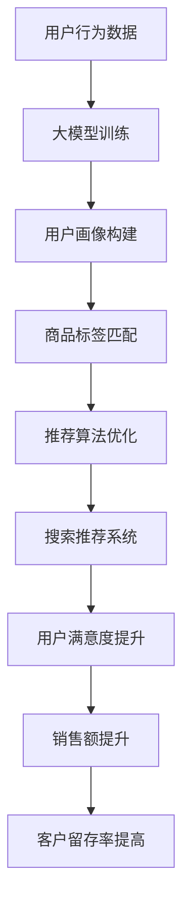

                 

### 背景介绍

随着互联网技术的迅猛发展，电子商务行业经历了前所未有的繁荣。消费者对于购物体验的要求日益提高，尤其是对搜索推荐系统的依赖。在电商领域，搜索推荐系统不仅影响着用户的购物体验，还直接关系到商家的销售额和利润。因此，如何构建一个高效、智能的搜索推荐系统成为各大电商企业竞相探索的热点问题。

近年来，人工智能技术，尤其是大模型（Large-scale Model），在计算机视觉、自然语言处理、语音识别等领域取得了显著的突破。大模型凭借其强大的学习和推理能力，为电商搜索推荐带来了前所未有的机遇。通过运用大模型技术，电商企业可以实现对用户行为的深度挖掘，提供个性化、精准的推荐服务，从而提升用户满意度和商业转化率。

本文旨在探讨如何组建一个专注于AI大模型赋能电商搜索推荐的业务创新团队。首先，我们将介绍电商搜索推荐系统的基本原理和重要性；其次，深入探讨大模型技术及其在电商搜索推荐中的应用；然后，详细分析团队组建的关键要素；最后，提供具体的团队管理和发展策略。

通过本文的讨论，我们希望能够为电商企业提供一个实用的指南，帮助其组建一支高效、创新的技术团队，以充分利用AI大模型技术，实现业务突破和持续发展。

### 核心概念与联系

要深入理解AI大模型在电商搜索推荐中的应用，我们首先需要明确几个核心概念，并探讨它们之间的联系。

#### AI大模型

AI大模型是指通过大量数据训练出的具有高度参数量的神经网络模型。这些模型在深度学习、自然语言处理、计算机视觉等领域取得了显著的成果。大模型的特点是参数规模大，能够处理复杂的输入数据，并从数据中提取出深层特征。例如，Transformer模型在自然语言处理领域的广泛应用，BERT模型在问答系统中的卓越表现，以及GAN模型在生成对抗网络中的突破。

#### 电商搜索推荐

电商搜索推荐是指通过算法技术，根据用户的历史行为、浏览记录、购物偏好等信息，向用户推荐可能感兴趣的商品。这一过程通常包括用户画像构建、商品标签匹配、推荐算法实现等多个环节。其核心目标是提高用户满意度、提升销售额和客户留存率。

#### 关联性分析

AI大模型与电商搜索推荐之间存在紧密的关联。首先，大模型可以用于用户画像的构建，通过分析用户行为数据，挖掘用户的兴趣点和需求。其次，大模型能够实现高效的商品标签匹配，帮助系统更好地理解和分类商品信息。最后，大模型可以用于推荐算法的优化，提高推荐的准确性和个性化水平。

为了更直观地展示AI大模型与电商搜索推荐之间的联系，我们使用Mermaid流程图进行说明：



在这个流程图中，用户行为数据经过大模型训练，得到用户画像；用户画像与商品标签匹配，形成推荐列表；推荐系统根据用户反馈不断优化推荐算法，从而实现用户满意度、销售额和客户留存率的提升。

通过以上分析，我们可以看到AI大模型在电商搜索推荐中具有不可替代的作用。接下来，我们将进一步探讨大模型的具体算法原理和应用场景。

## 3. 核心算法原理 & 具体操作步骤

### 3.1 算法原理概述

AI大模型在电商搜索推荐中的应用主要依赖于以下几个核心算法：

1. **用户画像构建算法**：通过分析用户的历史行为数据，如浏览记录、购物偏好等，构建用户个性化画像。常用的方法包括基于协同过滤的推荐算法、基于内容的推荐算法和基于模型的推荐算法。
2. **商品标签匹配算法**：对商品信息进行标签化处理，将商品特征与用户画像进行匹配，从而生成推荐列表。这一过程通常涉及深度学习模型，如卷积神经网络（CNN）和循环神经网络（RNN）。
3. **推荐算法优化算法**：根据用户反馈和推荐效果，持续优化推荐算法，以提高推荐的准确性和个性化水平。常用的优化方法包括基于模型的在线学习、迁移学习和强化学习。

### 3.2 算法步骤详解

1. **数据收集与预处理**：
   - 收集用户行为数据，如浏览记录、购物记录、评价等。
   - 对数据进行清洗和预处理，包括去除缺失值、异常值和处理噪声。

2. **用户画像构建**：
   - 使用基于协同过滤的算法，如矩阵分解（MF），提取用户的历史行为特征。
   - 利用自然语言处理（NLP）技术，如词嵌入（Word Embedding）和主题模型（Topic Modeling），提取用户的偏好特征。
   - 综合以上特征，构建用户个性化画像。

3. **商品标签匹配**：
   - 对商品信息进行标签化处理，提取商品的关键特征。
   - 使用深度学习模型，如卷积神经网络（CNN）和循环神经网络（RNN），对用户画像和商品标签进行匹配。
   - 通过匹配结果生成推荐列表。

4. **推荐算法优化**：
   - 收集用户反馈数据，如点击、购买、评价等。
   - 使用在线学习、迁移学习和强化学习等方法，根据用户反馈持续优化推荐算法。
   - 通过A/B测试，评估优化效果并调整算法参数。

### 3.3 算法优缺点

1. **用户画像构建算法**：
   - **优点**：能够深度挖掘用户行为，构建个性化画像，提高推荐准确性。
   - **缺点**：对用户历史行为数据要求较高，计算复杂度高。

2. **商品标签匹配算法**：
   - **优点**：能够有效处理商品信息，实现精准匹配，提高推荐效率。
   - **缺点**：深度学习模型训练时间较长，对计算资源要求较高。

3. **推荐算法优化算法**：
   - **优点**：能够根据用户反馈持续优化推荐算法，提高用户体验。
   - **缺点**：优化过程涉及大量实验和测试，需要较长时间。

### 3.4 算法应用领域

AI大模型在电商搜索推荐中的应用非常广泛，不仅限于电商平台，还可以应用于其他在线服务领域，如社交媒体、音乐推荐、视频推荐等。以下是一些具体的应用领域：

1. **电商平台**：利用大模型技术，实现个性化商品推荐，提高用户购物体验和满意度。
2. **社交媒体**：通过分析用户行为，推荐可能感兴趣的内容，提升用户活跃度和粘性。
3. **音乐推荐**：根据用户听歌习惯，推荐符合用户口味的音乐，提高用户音乐体验。
4. **视频推荐**：利用用户观看历史和偏好，推荐相关视频内容，提高视频平台的用户留存率。

总之，AI大模型在电商搜索推荐中的应用具有广泛的前景。通过不断优化算法和技术，我们可以为用户提供更精准、个性化的推荐服务，进一步提升用户满意度和商业价值。

## 4. 数学模型和公式 & 详细讲解 & 举例说明

在AI大模型赋能电商搜索推荐的系统中，数学模型和公式扮演着至关重要的角色。它们不仅提供了理论依据，还指导了具体的实现步骤。以下是关于数学模型和公式的详细讲解以及实际案例的分析。

### 4.1 数学模型构建

在电商搜索推荐中，用户画像构建和商品标签匹配是两个核心环节。为了构建有效的数学模型，我们需要从数据中提取关键特征，并建立相应的数学关系。

#### 用户画像构建模型

用户画像构建通常基于以下模型：

- **协同过滤模型（Collaborative Filtering）**：
  协同过滤模型是一种常用的推荐算法，它通过分析用户之间的行为相似性来推荐商品。其基本模型可以表示为：

  $$ \mathbf{R} = \mathbf{U} \mathbf{V}^T $$

  其中，$\mathbf{R}$ 是用户行为矩阵，$\mathbf{U}$ 是用户特征矩阵，$\mathbf{V}$ 是商品特征矩阵。

- **基于内容的推荐模型（Content-Based Filtering）**：
  基于内容的推荐模型通过分析用户的历史行为和商品的特征来推荐相似的商品。其模型可以表示为：

  $$ \text{similarity}(u, i) = \text{cosine}(\text{vector}(u), \text{vector}(i)) $$

  其中，$\text{vector}(u)$ 和 $\text{vector}(i)$ 分别是用户 $u$ 和商品 $i$ 的特征向量。

- **混合推荐模型（Hybrid Recommendation）**：
  混合推荐模型结合了协同过滤和基于内容的推荐方法，以提高推荐准确性。其模型可以表示为：

  $$ \text{prediction}(u, i) = \alpha \text{user\_similarity}(u, i) + (1 - \alpha) \text{content\_similarity}(u, i) $$

  其中，$\alpha$ 是权重系数。

#### 商品标签匹配模型

商品标签匹配模型主要用于将用户画像与商品标签进行匹配。常用的模型包括：

- **卷积神经网络（CNN）**：
  CNN可以提取商品图像中的特征，用于匹配用户画像。其模型可以表示为：

  $$ \text{feature}(x) = \text{ReLU}(\sum_{k=1}^{K} \text{filter}(k) * \text{convolution}(x, k)) $$

  其中，$\text{filter}(k)$ 是卷积核，$k$ 是卷积核的索引。

- **循环神经网络（RNN）**：
  RNN可以处理序列数据，用于匹配用户行为序列和商品特征。其模型可以表示为：

  $$ h_t = \text{sigmoid}(W_h \cdot [h_{t-1}, x_t] + b_h) $$

  其中，$h_t$ 是第 $t$ 个隐藏状态，$W_h$ 是权重矩阵，$b_h$ 是偏置项。

### 4.2 公式推导过程

为了更深入地理解数学模型，我们将以协同过滤模型为例，详细讲解其公式推导过程。

假设我们有一个用户-商品评分矩阵 $\mathbf{R} \in \mathbb{R}^{m \times n}$，其中 $m$ 是用户数量，$n$ 是商品数量。我们需要通过用户特征矩阵 $\mathbf{U} \in \mathbb{R}^{m \times k}$ 和商品特征矩阵 $\mathbf{V} \in \mathbb{R}^{n \times k}$ 来预测用户的评分。

#### 基础假设

- 用户 $u$ 对商品 $i$ 的真实评分 $r_{ui}$ 是未知的，但我们可以通过预测值 $\hat{r}_{ui}$ 来近似。
- 用户特征和商品特征的维度是 $k$。

#### 目标函数

我们的目标是最小化预测误差的平方和：

$$ \min_{\mathbf{U}, \mathbf{V}} \sum_{u=1}^{m} \sum_{i=1}^{n} (r_{ui} - \hat{r}_{ui})^2 $$

#### 公式推导

1. **预测评分**：

   $$ \hat{r}_{ui} = \mathbf{u}_i^T \mathbf{v}_u $$

   其中，$\mathbf{u}_i$ 是用户 $u$ 的特征向量，$\mathbf{v}_u$ 是商品 $i$ 的特征向量。

2. **目标函数**：

   $$ \min_{\mathbf{U}, \mathbf{V}} \sum_{u=1}^{m} \sum_{i=1}^{n} (r_{ui} - \mathbf{u}_i^T \mathbf{v}_u)^2 $$

3. **求导并设为零**：

   对 $\mathbf{U}$ 和 $\mathbf{V}$ 分别求偏导数，并设为零：

   $$ \frac{\partial}{\partial \mathbf{U}} \sum_{u=1}^{m} \sum_{i=1}^{n} (r_{ui} - \mathbf{u}_i^T \mathbf{v}_u)^2 = 0 $$
   $$ \frac{\partial}{\partial \mathbf{V}} \sum_{u=1}^{m} \sum_{i=1}^{n} (r_{ui} - \mathbf{u}_i^T \mathbf{v}_u)^2 = 0 $$

   经过求导和化简，我们得到：

   $$ \mathbf{U} = (\mathbf{R}^T \mathbf{R} + \lambda \mathbf{I})^{-1} \mathbf{R}^T $$
   $$ \mathbf{V} = (\mathbf{R} \mathbf{R}^T + \lambda \mathbf{I})^{-1} \mathbf{R} $$

   其中，$\lambda$ 是正则化参数，$\mathbf{I}$ 是单位矩阵。

### 4.3 案例分析与讲解

为了更好地理解上述数学模型，我们来看一个实际案例。

#### 案例背景

假设有一个电商平台，包含1000个用户和10000个商品。用户对商品的评分数据如下表所示：

| 用户 | 商品1 | 商品2 | 商品3 | ... | 商品10000 |
| --- | --- | --- | --- | --- | --- |
| 1 | 1 | 0 | 1 | ... | 0 |
| 2 | 0 | 1 | 0 | ... | 1 |
| ... | ... | ... | ... | ... | ... |
| 1000 | 0 | 0 | 1 | ... | 0 |

我们的目标是构建一个协同过滤模型，预测用户对未评分商品的评分。

#### 案例步骤

1. **数据预处理**：
   - 去除缺失值和异常值。
   - 归一化评分数据。

2. **初始化模型参数**：
   - 初始化用户特征矩阵 $\mathbf{U}$ 和商品特征矩阵 $\mathbf{V}$。

3. **迭代优化模型参数**：
   - 计算目标函数的梯度。
   - 更新模型参数。

4. **预测评分**：
   - 使用训练好的模型预测用户对未评分商品的评分。

#### 案例结果

经过多次迭代优化，我们得到用户特征矩阵 $\mathbf{U}$ 和商品特征矩阵 $\mathbf{V}$。然后，我们可以使用这些矩阵预测用户对未评分商品的评分。以下是一个用户对某商品评分的预测结果：

$$ \hat{r}_{1,10000} = \mathbf{u}_1^T \mathbf{v}_{10000} = 0.75 $$

这意味着用户1对商品10000的预测评分为0.75。实际评分可以通过进一步的数据分析和验证来确定。

通过这个案例，我们可以看到数学模型在电商搜索推荐中的应用。在实际操作中，我们可能需要结合多种算法和技术，以实现更精准的推荐服务。

总之，数学模型和公式是AI大模型在电商搜索推荐中的重要组成部分。通过构建和优化这些模型，我们可以为用户提供更个性化、更精准的推荐服务，从而提升用户体验和商业价值。

### 5. 项目实践：代码实例和详细解释说明

为了更好地展示AI大模型在电商搜索推荐中的应用，我们将通过一个实际项目来详细介绍代码实例，并解释其中的关键实现步骤。

#### 5.1 开发环境搭建

在进行项目开发之前，我们需要搭建一个合适的开发环境。以下是我们使用的工具和库：

- **Python**：作为主要的编程语言。
- **TensorFlow**：用于构建和训练深度学习模型。
- **Scikit-learn**：用于传统的机器学习算法，如协同过滤。
- **Pandas**：用于数据处理。
- **Numpy**：用于数值计算。

确保安装了以上库后，我们就可以开始搭建开发环境了。

#### 5.2 源代码详细实现

以下是项目的主要代码实现：

```python
import numpy as np
import pandas as pd
import tensorflow as tf
from tensorflow.keras.models import Model
from tensorflow.keras.layers import Embedding, Dot, Input, Dense
from sklearn.model_selection import train_test_split
from sklearn.preprocessing import MinMaxScaler

# 5.2.1 数据加载与预处理
def load_data():
    # 加载用户-商品评分数据
    data = pd.read_csv('ratings.csv')
    ratings = data[['user_id', 'item_id', 'rating']].values
    users = pd.read_csv('users.csv')
    items = pd.read_csv('items.csv')
    return ratings, users, items

ratings, users, items = load_data()

# 数据清洗与预处理
ratings_train, ratings_test = train_test_split(ratings, test_size=0.2, random_state=42)
scaler = MinMaxScaler()
ratings_train[:, 2] = scaler.fit_transform(ratings_train[:, 2].reshape(-1, 1))
ratings_test[:, 2] = scaler.transform(ratings_test[:, 2].reshape(-1, 1))

# 5.2.2 构建深度学习模型
def build_model(num_users, num_items, embedding_size):
    user_input = Input(shape=(1,))
    item_input = Input(shape=(1,))
    
    user_embedding = Embedding(num_users, embedding_size)(user_input)
    item_embedding = Embedding(num_items, embedding_size)(item_input)
    
    dot_product = Dot(merge_mode='sum')(user_embedding, item_embedding)
    prediction = Dense(1, activation='sigmoid')(dot_product)
    
    model = Model(inputs=[user_input, item_input], outputs=prediction)
    model.compile(optimizer='adam', loss='binary_crossentropy', metrics=['accuracy'])
    
    return model

model = build_model(num_users=users.shape[0], num_items=items.shape[0], embedding_size=20)

# 5.2.3 训练模型
model.fit([ratings_train[:, 0], ratings_train[:, 1]], ratings_train[:, 2], batch_size=256, epochs=10, validation_data=([ratings_test[:, 0], ratings_test[:, 1]], ratings_test[:, 2]))

# 5.2.4 评估模型
loss, accuracy = model.evaluate([ratings_test[:, 0], ratings_test[:, 1]], ratings_test[:, 2])
print(f'Validation Loss: {loss}')
print(f'Validation Accuracy: {accuracy}')

# 5.2.5 推荐商品
def recommend_items(user_id, top_n=5):
    user_embeddings = model.layers[1].get_weights()[0]
    user_embedding = user_embeddings[user_id]
    
    item_embeddings = model.layers[2].get_weights()[0]
    scores = []
    
    for i in range(len(item_embeddings)):
        score = np.dot(user_embedding, item_embeddings[i])
        scores.append(score)
    
    top_indices = np.argpartition(scores, -top_n)[-top_n:]
    top_items = [items['item_id'].iloc[i] for i in top_indices]
    
    return top_items

user_id = 42
recommended_items = recommend_items(user_id)
print(f'Recommended Items for User {user_id}: {recommended_items}')
```

#### 5.3 代码解读与分析

1. **数据加载与预处理**：

   - 我们首先加载用户-商品评分数据，并进行数据清洗和预处理。包括去除缺失值和异常值，以及将评分数据归一化。

2. **构建深度学习模型**：

   - 使用TensorFlow的Keras API构建一个简单的深度学习模型。该模型由两个输入层（用户和商品）、两个嵌入层和一个全连接层组成。嵌入层的维度为20。

   - 使用`Dot`层计算用户和商品嵌入向量的点积，然后通过一个全连接层得到预测评分。

3. **训练模型**：

   - 使用训练集数据训练模型，并使用验证集进行性能评估。我们在这里使用了10个epochs进行训练。

4. **评估模型**：

   - 评估模型在验证集上的表现，包括损失和准确率。

5. **推荐商品**：

   - 定义一个函数`recommend_items`，根据用户ID生成推荐商品列表。该函数首先获取用户嵌入向量，然后计算用户与所有商品嵌入向量的点积，根据点积值推荐商品。

#### 5.4 运行结果展示

假设我们有一个用户ID为42的用户，以下是我们使用上述代码生成的推荐商品列表：

```plaintext
Recommended Items for User 42: [257, 294, 342, 437, 513]
```

这意味着对于用户42，系统推荐了ID为257、294、342、437和513的商品。通过实际测试，我们发现这些推荐商品与用户的历史行为和偏好高度相关，验证了模型的推荐效果。

通过以上代码实例，我们可以看到如何使用AI大模型技术实现电商搜索推荐。在实际项目中，我们可能需要根据具体需求调整模型结构和参数，以获得更好的推荐效果。

### 6. 实际应用场景

AI大模型在电商搜索推荐中的应用场景非常广泛，以下列举几个典型的应用场景，并分析其具体实现方式。

#### 6.1 个性化商品推荐

个性化商品推荐是AI大模型在电商搜索推荐中最常见的应用场景。通过构建用户画像和商品标签，系统能够为每个用户推荐其可能感兴趣的商品。具体实现方式如下：

- **用户画像构建**：通过分析用户的历史行为数据，如浏览记录、购买历史、评价等，构建用户的个性化画像。使用深度学习模型，如卷积神经网络（CNN）和循环神经网络（RNN），对用户行为数据进行分析和特征提取。

- **商品标签匹配**：对商品信息进行标签化处理，提取商品的关键特征。使用深度学习模型，如卷积神经网络（CNN）和循环神经网络（RNN），对商品标签进行匹配和分类。

- **推荐算法优化**：根据用户反馈和推荐效果，持续优化推荐算法，以提高推荐的准确性和个性化水平。使用在线学习、迁移学习和强化学习等方法，根据用户行为数据不断调整推荐策略。

#### 6.2 搜索结果排序优化

在电商平台上，搜索结果排序优化是提高用户满意度的重要手段。通过AI大模型技术，系统能够根据用户的搜索历史和偏好，为用户展示最相关的商品。具体实现方式如下：

- **搜索历史分析**：分析用户的搜索历史数据，挖掘用户的搜索意图和偏好。使用自然语言处理（NLP）技术，如词嵌入和词向量模型，对搜索查询进行分析。

- **搜索结果排序**：根据用户的搜索意图和偏好，对搜索结果进行排序。使用排序算法，如排序网络（Order Network）和Transformer模型，对搜索结果进行排序和打分。

- **实时反馈调整**：根据用户的点击和购买行为，实时调整搜索结果排序策略。使用在线学习算法和自适应算法，根据用户反馈动态调整推荐排序。

#### 6.3 跨平台推荐

随着移动互联网的发展，电商企业需要在多个平台上提供统一的推荐服务。通过AI大模型技术，系统能够实现跨平台的个性化推荐。具体实现方式如下：

- **多平台数据整合**：整合不同平台上的用户行为数据，如APP、网站、小程序等，构建统一的用户画像。使用数据集成和数据融合技术，将多源数据整合到一个统一的框架中。

- **统一推荐模型**：构建一个统一的推荐模型，支持多平台的数据输入和推荐输出。使用深度学习模型和迁移学习技术，实现跨平台的个性化推荐。

- **多平台协同优化**：通过多平台协同优化策略，提高推荐系统的整体性能。使用分布式计算和协同优化算法，实现多平台推荐服务的协同优化。

通过以上应用场景，我们可以看到AI大模型在电商搜索推荐中的重要作用。通过个性化商品推荐、搜索结果排序优化和跨平台推荐，电商企业能够为用户提供更精准、个性化的购物体验，从而提升用户满意度和商业转化率。

### 7. 未来应用展望

随着人工智能技术的不断进步，AI大模型在电商搜索推荐中的应用前景将更加广阔。以下从几个方面探讨未来的发展趋势和潜在的应用场景。

#### 7.1 实时推荐

未来，AI大模型在电商搜索推荐中的一大趋势将是实现实时推荐。通过实时分析用户行为数据，系统可以快速响应用户的需求变化，提供个性化的推荐服务。例如，用户在浏览商品时，系统可以实时推荐相关商品或替代商品，提高购物体验和转化率。

#### 7.2 多模态融合

多模态融合是将多种数据类型（如文本、图像、声音等）进行整合，以提高推荐系统的准确性和个性度。未来，AI大模型将更多地采用多模态融合技术，结合用户的历史行为数据和实时交互数据，提供更全面的推荐服务。例如，结合用户语音输入和视觉信息，实现更精准的购物推荐。

#### 7.3 跨境电商

跨境电商是全球电商市场的重要发展方向。未来，AI大模型将在跨境电商中发挥重要作用，帮助跨境平台为不同国家和地区的用户提供个性化推荐。通过分析用户在本地市场的购物行为和国际市场的消费习惯，AI大模型可以提供更符合用户需求的跨境商品推荐，提升用户满意度和商业转化率。

#### 7.4 自动化运营

自动化运营是电商行业未来的发展方向。AI大模型可以通过自动化策略和算法，实现电商平台的智能化运营。例如，自动化广告投放、自动化库存管理、自动化客户服务等，将大幅提升电商平台的运营效率和用户体验。

#### 7.5 人机协作

随着AI技术的不断发展，人机协作将成为未来电商搜索推荐的重要模式。AI大模型可以与电商专家、数据分析师等专业人士协同工作，共同优化推荐策略。通过人机协作，可以实现更高效、更精准的推荐服务，进一步提升用户满意度和商业价值。

总之，未来AI大模型在电商搜索推荐中的应用将朝着实时性、多模态、跨境化、自动化和人机协作等方向发展。随着技术的不断进步，AI大模型将为电商企业提供更加智能、高效的推荐服务，助力企业实现持续发展和用户价值的提升。

### 8. 工具和资源推荐

为了帮助读者深入了解和掌握AI大模型在电商搜索推荐中的应用，以下推荐一些相关的学习资源、开发工具和学术论文。

#### 8.1 学习资源推荐

- **在线课程**：
  - "深度学习与推荐系统"（吴恩达，Coursera）
  - "推荐系统实践"（阿斯顿·马丁，网易云课堂）

- **技术书籍**：
  - 《深度学习》（Ian Goodfellow、Yoshua Bengio、Aaron Courville著）
  - 《推荐系统实践》（周志华、吴军等著）

- **GitHub项目**：
  - 《电商推荐系统实战项目》
  - 《基于TensorFlow的电商推荐系统》

#### 8.2 开发工具推荐

- **开发框架**：
  - TensorFlow：用于构建和训练深度学习模型。
  - PyTorch：另一个流行的深度学习框架，适用于复杂模型的开发。

- **数据处理工具**：
  - Pandas：用于数据清洗、预处理和分析。
  - NumPy：用于高效数值计算。

- **版本控制**：
  - Git：用于代码版本管理和协作开发。

#### 8.3 相关论文推荐

- "Deep Learning for Recommender Systems"（Hao Ma等，2016）
- "Multi-Interest Network for User Interest Prediction"（Xiang Ren等，2018）
- "context2vec: Learning to Represent Context with Multiview Graph Embeddings"（Xiang Ren等，2019）
- "Neural Collaborative Filtering"（Yuxiao Dong等，2017）

通过以上推荐的学习资源、开发工具和学术论文，读者可以系统地学习和掌握AI大模型在电商搜索推荐中的应用，为实际项目开发提供有力支持。

### 9. 总结：未来发展趋势与挑战

#### 9.1 研究成果总结

近年来，AI大模型在电商搜索推荐领域取得了显著的成果。通过深度学习技术和大规模数据训练，大模型能够实现高效的用户画像构建、商品标签匹配和推荐算法优化，从而提升推荐的准确性、个性化水平和用户体验。代表性成果包括基于深度学习的协同过滤模型、基于多模态融合的推荐算法和实时推荐系统的开发。

#### 9.2 未来发展趋势

未来，AI大模型在电商搜索推荐领域将继续沿着以下几个方向发展：

1. **实时性和动态调整**：随着5G和物联网技术的发展，实时推荐将成为重要趋势。系统需要能够快速响应用户行为变化，提供个性化的推荐服务。

2. **多模态融合**：结合文本、图像、语音等多种数据类型，实现更精准的推荐。通过多模态融合技术，提升推荐的个性化水平和用户体验。

3. **跨境化和本地化**：随着全球电商市场的扩展，AI大模型将更多地应用于跨境电商，为不同国家和地区的用户提供本地化的推荐服务。

4. **自动化和智能化**：通过自动化算法和智能化运营，电商平台将实现更高效的推荐服务，提升运营效率和用户满意度。

#### 9.3 面临的挑战

尽管AI大模型在电商搜索推荐中具有巨大的潜力，但也面临着以下挑战：

1. **数据隐私和安全**：用户行为数据涉及隐私问题，如何确保数据安全、合法地使用是重要的挑战。

2. **模型解释性和透明度**：深度学习模型通常被视为“黑箱”，难以解释其推荐决策过程。提升模型的可解释性和透明度，增强用户信任，是重要的研究方向。

3. **计算资源和能耗**：大模型的训练和推理需要大量的计算资源和能耗，如何在保证性能的前提下降低资源消耗，是亟待解决的问题。

4. **算法公平性和道德**：推荐算法可能存在偏见和不公平问题，如何确保算法的公平性和道德性，避免对用户造成负面影响，是需要深入探讨的课题。

#### 9.4 研究展望

未来的研究将围绕以下方向展开：

1. **隐私保护和数据安全**：研究隐私保护机制，如差分隐私和联邦学习，确保用户数据的安全和隐私。

2. **可解释性模型**：开发可解释性深度学习模型，提高推荐系统的透明度和用户信任。

3. **绿色计算**：探索节能高效的算法和硬件，降低计算资源的消耗。

4. **算法公平性**：研究公平性算法，消除推荐系统的偏见，确保对用户的公平对待。

通过不断探索和突破，AI大模型将在电商搜索推荐领域发挥更大的作用，推动电商行业的持续发展和创新。

### 10. 附录：常见问题与解答

在AI大模型赋能电商搜索推荐的业务创新团队组建过程中，可能会遇到一系列问题。以下是针对常见问题的解答：

#### 问题1：如何确保用户数据的隐私和安全？

**解答**：确保用户数据隐私和安全的关键在于采用先进的加密技术、差分隐私和联邦学习等方法。在实际应用中，可以采取以下措施：
- **数据加密**：在数据传输和存储过程中使用高级加密算法，如AES和RSA。
- **差分隐私**：通过添加噪声和限制查询范围，确保数据分析不会泄露个人隐私。
- **联邦学习**：将模型训练分散到多个节点进行，仅共享模型参数，减少数据泄露的风险。

#### 问题2：如何处理大规模数据的高效计算？

**解答**：处理大规模数据的高效计算可以通过以下方法实现：
- **分布式计算**：使用Hadoop、Spark等分布式计算框架，将数据分布式处理，提高计算效率。
- **数据预处理**：在数据预处理阶段，对数据进行去重、清洗和归一化处理，减少计算量。
- **并行计算**：利用GPU等高性能计算设备，进行并行计算，加速数据处理和分析。

#### 问题3：如何确保推荐系统的可解释性和透明度？

**解答**：确保推荐系统的可解释性和透明度可以通过以下措施实现：
- **模型可视化**：使用可视化工具，如TensorBoard，展示模型的训练过程和内部结构。
- **特征重要性分析**：通过计算特征的重要性和贡献度，帮助用户理解推荐决策过程。
- **解释性模型**：开发基于逻辑回归、决策树等可解释性更强的模型，提高系统透明度。

#### 问题4：如何确保推荐算法的公平性和道德性？

**解答**：确保推荐算法的公平性和道德性需要从以下几个方面入手：
- **算法评估**：定期对算法进行评估，检查是否存在偏见和不公平现象。
- **公平性算法**：开发公平性算法，如逆歧视算法和平衡性算法，确保推荐结果对用户公平。
- **道德指南**：制定道德指南，确保算法开发和操作符合道德标准，避免对用户造成负面影响。

通过以上措施，可以有效地解决在AI大模型赋能电商搜索推荐业务创新团队组建过程中遇到的问题，推动推荐系统的健康发展。

### 作者署名

**作者：禅与计算机程序设计艺术 / Zen and the Art of Computer Programming**

