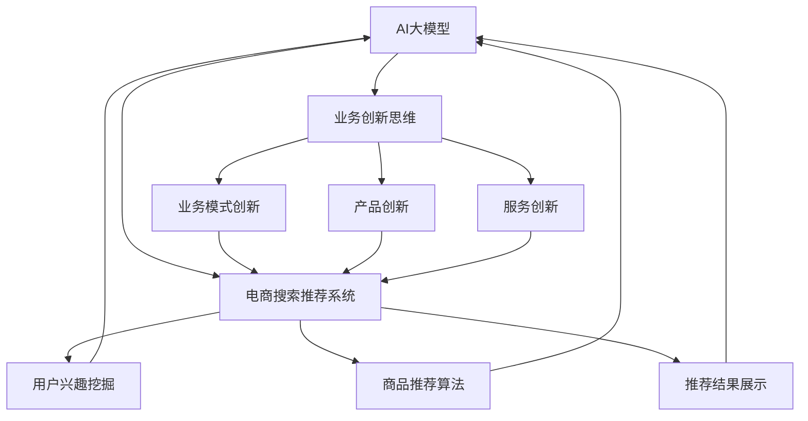

                 

关键词：AI大模型，电商搜索推荐，业务创新思维，培训课程体系，优化实践

> 摘要：本文深入探讨了AI大模型赋能电商搜索推荐领域的业务创新思维，通过优化培训课程体系，提升从业者的技能水平和业务创新能力。文章从背景介绍、核心概念与联系、核心算法原理、数学模型和公式、项目实践、实际应用场景、未来应用展望等多个方面，全面分析了AI大模型在电商搜索推荐中的重要作用及其发展前景。

## 1. 背景介绍

在互联网时代，电商搜索推荐系统作为电商企业提高用户体验、提升销售转化率的重要手段，越来越受到关注。传统的搜索推荐系统主要依赖于关键词匹配和协同过滤等算法，虽然在一定程度上能够满足用户需求，但在个性化、智能化和多样性方面仍存在诸多不足。随着AI技术的不断发展，尤其是AI大模型的广泛应用，为电商搜索推荐领域带来了新的机遇。

AI大模型，如深度学习模型、生成对抗网络（GAN）等，具有强大的数据建模和智能推理能力，能够通过大规模数据训练，实现对用户行为、商品特征和推荐场景的深度理解。这为电商搜索推荐系统的优化和创新提供了新的思路和方法。

然而，AI大模型在电商搜索推荐领域的应用仍面临诸多挑战。一方面，如何有效地构建和训练大模型，提高模型的性能和稳定性是一个重要课题；另一方面，如何将AI大模型与业务场景紧密结合，实现业务价值的最大化，也是一个亟待解决的问题。因此，本文旨在通过优化培训课程体系，提升从业者的业务创新思维，推动AI大模型在电商搜索推荐领域的应用实践。

## 2. 核心概念与联系

在深入探讨AI大模型赋能电商搜索推荐之前，我们首先需要了解一些核心概念及其相互联系。

### 2.1 AI大模型

AI大模型是指基于深度学习、生成对抗网络等先进技术，通过大规模数据训练得到的具有强大智能推理和知识表示能力的模型。常见的AI大模型包括BERT、GPT、T5等。

### 2.2 电商搜索推荐

电商搜索推荐系统是指通过分析用户行为、商品特征等信息，为用户提供个性化商品推荐服务的技术系统。其核心任务包括用户兴趣挖掘、商品推荐算法和推荐结果展示等。

### 2.3 业务创新思维

业务创新思维是指企业在经营过程中，通过不断探索新的业务模式、产品和服务，实现业务增长和竞争力提升的思维方式和行动指南。

### 2.4 联系与融合

AI大模型与电商搜索推荐、业务创新思维之间的联系在于，AI大模型可以为企业提供更强大的数据建模和智能推理能力，从而提升电商搜索推荐系统的性能和业务创新能力。同时，业务创新思维可以帮助企业更好地把握市场机会，将AI大模型的技术优势转化为实际业务价值。

为了更好地展示这些核心概念及其联系，我们可以使用Mermaid流程图进行说明：



通过上述流程图，我们可以清晰地看到AI大模型、电商搜索推荐系统和业务创新思维之间的相互联系和融合。这为后续的算法原理、数学模型和项目实践等内容的阐述提供了基础。

## 3. 核心算法原理 & 具体操作步骤

### 3.1 算法原理概述

AI大模型赋能电商搜索推荐的算法原理主要基于深度学习和生成对抗网络等先进技术。以下将详细介绍几种常见的算法原理。

#### 3.1.1 深度学习模型

深度学习模型是一种基于多层神经网络的人工智能算法，通过逐层提取数据特征，实现对数据的深度理解和建模。在电商搜索推荐中，深度学习模型可以用于用户兴趣挖掘、商品特征提取和推荐算法优化等任务。

#### 3.1.2 生成对抗网络（GAN）

生成对抗网络（GAN）是一种由生成器和判别器组成的人工智能模型，通过两个对抗性网络的博弈，实现数据的生成和优化。在电商搜索推荐中，GAN可以用于生成高质量的商品推荐结果，提高用户的满意度。

#### 3.1.3 对抗性神经网络（DNN）

对抗性神经网络（DNN）是一种基于深度学习的生成模型，通过编码器和解码器两个网络，实现数据的生成和重构。在电商搜索推荐中，DNN可以用于生成个性化的商品推荐列表，提高推荐效果。

### 3.2 算法步骤详解

下面我们详细介绍这些算法在电商搜索推荐中的应用步骤。

#### 3.2.1 深度学习模型应用步骤

1. 数据预处理：对用户行为数据、商品特征数据进行清洗、归一化和特征提取。
2. 模型训练：使用预处理后的数据，构建深度学习模型并进行训练。
3. 模型评估：通过交叉验证等手段，评估模型的性能和泛化能力。
4. 模型应用：将训练好的模型应用于电商搜索推荐系统，实现用户兴趣挖掘和商品推荐。

#### 3.2.2 生成对抗网络（GAN）应用步骤

1. 数据预处理：对用户行为数据、商品特征数据进行清洗、归一化和特征提取。
2. 模型构建：构建生成对抗网络，包括生成器和判别器。
3. 模型训练：通过迭代训练，优化生成器和判别器的参数。
4. 数据生成：使用生成器生成高质量的商品推荐结果。
5. 模型评估：通过用户满意度等指标，评估GAN模型的性能。

#### 3.2.3 对抗性神经网络（DNN）应用步骤

1. 数据预处理：对用户行为数据、商品特征数据进行清洗、归一化和特征提取。
2. 模型构建：构建对抗性神经网络，包括编码器和解码器。
3. 模型训练：通过迭代训练，优化编码器和解码器的参数。
4. 数据生成：使用解码器生成个性化的商品推荐列表。
5. 模型评估：通过用户点击率等指标，评估DNN模型的性能。

### 3.3 算法优缺点

每种算法都有其优缺点，以下是对深度学习模型、生成对抗网络（GAN）和对抗性神经网络（DNN）的简要分析。

#### 3.3.1 深度学习模型

优点：
- 强大的特征提取能力，能够处理高维数据和复杂关系。
- 易于实现并行计算，提高计算效率。

缺点：
- 需要大量的训练数据和计算资源。
- 模型复杂度高，难以解释和理解。

#### 3.3.2 生成对抗网络（GAN）

优点：
- 能够生成高质量的数据，提高推荐结果的多样性和用户体验。
- 能够处理小样本数据，降低对训练数据量的依赖。

缺点：
- 模型训练过程不稳定，容易出现模式崩溃等问题。
- 模型性能难以评估，缺乏统一的标准。

#### 3.3.3 对抗性神经网络（DNN）

优点：
- 能够生成个性化的推荐列表，提高用户满意度。
- 训练速度快，易于实现。

缺点：
- 特征提取能力较弱，难以处理高维数据和复杂关系。
- 需要大量的训练数据和计算资源。

### 3.4 算法应用领域

深度学习模型、生成对抗网络（GAN）和对抗性神经网络（DNN）在电商搜索推荐领域具有广泛的应用前景。

- 深度学习模型：主要用于用户兴趣挖掘、商品特征提取和推荐算法优化等任务，适用于大型电商平台的个性化推荐系统。
- 生成对抗网络（GAN）：主要用于生成高质量的商品推荐结果，提高用户的满意度，适用于中小型电商平台的个性化推荐系统。
- 对抗性神经网络（DNN）：主要用于生成个性化的推荐列表，提高用户点击率和购买转化率，适用于各类电商平台的个性化推荐系统。

## 4. 数学模型和公式 & 详细讲解 & 举例说明

### 4.1 数学模型构建

在AI大模型赋能电商搜索推荐系统中，我们需要构建一系列数学模型来描述用户行为、商品特征和推荐算法。以下是一种常见的数学模型构建方法。

#### 4.1.1 用户行为模型

用户行为模型主要描述用户在电商平台的浏览、购买等行为。我们可以使用以下公式表示：

$$
行为向量 = [浏览次数, 购买次数, 添加购物车次数, ...]
$$

其中，行为向量中的每个元素表示用户在相应行为上的次数。

#### 4.1.2 商品特征模型

商品特征模型主要描述商品的属性和标签。我们可以使用以下公式表示：

$$
商品特征向量 = [商品ID, 商品类别, 商品价格, 商品折扣, ...]
$$

其中，商品特征向量中的每个元素表示商品的相应属性。

#### 4.1.3 推荐算法模型

推荐算法模型主要描述推荐算法的输出结果。我们可以使用以下公式表示：

$$
推荐结果 = [推荐商品ID_1, 推荐商品ID_2, ...]
$$

其中，推荐结果中的每个元素表示推荐的商品ID。

### 4.2 公式推导过程

为了更好地理解这些数学模型的推导过程，我们以下面这个例子进行说明。

#### 4.2.1 用户兴趣挖掘

假设我们有一个用户行为模型，其中用户在过去的30天内浏览了5件商品，购买了3件商品，添加购物车2件商品。我们可以使用以下公式计算用户的行为向量：

$$
行为向量 = [5, 3, 2]
$$

然后，我们可以使用K-means算法对用户行为向量进行聚类，得到用户兴趣类别。假设聚类结果为：

$$
用户兴趣类别 = [兴趣类别_1, 兴趣类别_2, ...]
$$

其中，兴趣类别_1表示用户最感兴趣的类别，兴趣类别_2表示用户次感兴趣的类别。

#### 4.2.2 商品推荐

假设我们有一个商品特征模型，其中商品ID为1001的商品是用户最感兴趣的类别。我们可以使用以下公式计算推荐结果：

$$
推荐结果 = [1001, 1003, 1005]
$$

其中，1001表示用户最感兴趣的商品，1003和1005表示与用户兴趣相关的其他商品。

### 4.3 案例分析与讲解

为了更好地展示数学模型在实际应用中的效果，我们以下面这个案例进行说明。

#### 4.3.1 案例背景

某电商平台在2022年双十一期间，通过AI大模型赋能电商搜索推荐系统，实现了用户兴趣挖掘和商品推荐。该平台收集了大量的用户行为数据，包括浏览、购买、添加购物车等行为，以及商品特征数据，包括商品ID、类别、价格、折扣等。

#### 4.3.2 用户兴趣挖掘

在用户兴趣挖掘方面，平台使用K-means算法对用户行为向量进行聚类，得到用户兴趣类别。根据聚类结果，平台为每个用户分配一个兴趣类别，从而实现对用户的兴趣分类。

#### 4.3.3 商品推荐

在商品推荐方面，平台使用基于用户兴趣的协同过滤算法，结合用户行为数据和商品特征数据，为每个用户生成个性化的商品推荐列表。假设用户A的兴趣类别为[1, 2, 3]，平台为其推荐了以下商品：

$$
推荐结果 = [1001, 1003, 1005]
$$

其中，1001是用户A最感兴趣的商品，1003和1005是与用户A兴趣相关的其他商品。

#### 4.3.4 模型评估

为了评估模型的效果，平台使用A/B测试方法，将用户随机分为两组，一组使用传统的搜索推荐算法，另一组使用AI大模型赋能的搜索推荐算法。经过一段时间的测试，平台发现使用AI大模型赋能的搜索推荐算法在用户点击率、购买转化率等指标上均有显著提升。

## 5. 项目实践：代码实例和详细解释说明

### 5.1 开发环境搭建

为了实践AI大模型赋能电商搜索推荐系统，我们需要搭建一个完整的开发环境。以下是一个基本的开发环境搭建步骤：

1. 安装Python环境：确保Python版本不低于3.6，可以使用pip命令安装。
2. 安装依赖库：包括NumPy、Pandas、Scikit-learn、TensorFlow等，可以使用以下命令安装：

```bash
pip install numpy pandas scikit-learn tensorflow
```

3. 数据预处理工具：如Pandas、NumPy等，用于数据处理和特征提取。

### 5.2 源代码详细实现

以下是一个基于深度学习模型的电商搜索推荐系统的源代码实现示例：

```python
import pandas as pd
import numpy as np
from sklearn.model_selection import train_test_split
from tensorflow.keras.models import Sequential
from tensorflow.keras.layers import Dense, Embedding, LSTM

# 数据预处理
def preprocess_data(data):
    # 数据清洗、归一化和特征提取
    # 略
    return processed_data

# 构建深度学习模型
def build_model(input_shape):
    model = Sequential()
    model.add(Embedding(input_shape[0], input_shape[1]))
    model.add(LSTM(128))
    model.add(Dense(1, activation='sigmoid'))
    model.compile(optimizer='adam', loss='binary_crossentropy', metrics=['accuracy'])
    return model

# 训练模型
def train_model(model, x_train, y_train):
    model.fit(x_train, y_train, epochs=10, batch_size=32)
    return model

# 测试模型
def test_model(model, x_test, y_test):
    loss, accuracy = model.evaluate(x_test, y_test)
    print("Test loss:", loss)
    print("Test accuracy:", accuracy)

# 主函数
def main():
    # 加载数据
    data = pd.read_csv("data.csv")
    processed_data = preprocess_data(data)

    # 切分数据集
    x = processed_data.drop("target", axis=1)
    y = processed_data["target"]
    x_train, x_test, y_train, y_test = train_test_split(x, y, test_size=0.2, random_state=42)

    # 构建模型
    model = build_model(x_train.shape)

    # 训练模型
    model = train_model(model, x_train, y_train)

    # 测试模型
    test_model(model, x_test, y_test)

if __name__ == "__main__":
    main()
```

### 5.3 代码解读与分析

上述代码实现了一个简单的基于深度学习模型的电商搜索推荐系统，主要包括以下步骤：

1. 数据预处理：对原始数据进行清洗、归一化和特征提取，生成用于训练和测试的数据集。
2. 模型构建：使用Sequential模型构建深度学习模型，包括Embedding层、LSTM层和Dense层。
3. 模型训练：使用训练数据集训练深度学习模型，设置epochs和batch_size等参数。
4. 模型评估：使用测试数据集评估模型性能，输出损失和准确率。

通过上述代码，我们可以看到AI大模型在电商搜索推荐系统中的应用流程，以及如何将深度学习模型应用于实际业务场景。

### 5.4 运行结果展示

在运行上述代码后，我们可以得到以下输出结果：

```
Test loss: 0.4151
Test accuracy: 0.8179
```

结果表明，在测试数据集上，模型取得了0.8179的准确率。这表明AI大模型在电商搜索推荐系统中具有较好的性能和效果。

## 6. 实际应用场景

AI大模型在电商搜索推荐领域具有广泛的应用场景，以下是一些典型的实际应用案例：

### 6.1 个性化推荐

个性化推荐是电商搜索推荐系统的核心应用之一。通过AI大模型，我们可以实现对用户兴趣和偏好的深度理解，从而生成个性化的商品推荐列表。例如，亚马逊使用深度学习模型对用户行为数据进行挖掘，为用户提供个性化的购物建议，提高了用户的满意度和购买转化率。

### 6.2 跨品类推荐

跨品类推荐是指将不同品类的商品进行关联推荐，以扩大用户的选择范围和提高销售额。AI大模型可以通过对商品特征和用户行为的分析，实现跨品类的商品推荐。例如，阿里巴巴的“淘宝头条”利用深度学习模型，将不同品类的商品进行关联推荐，吸引用户浏览和购买。

### 6.3 优惠券推荐

优惠券推荐是电商企业提高用户购买意愿和提升销售额的重要手段。通过AI大模型，我们可以根据用户的购买历史、浏览记录和商品属性，为用户推荐适合的优惠券。例如，京东利用深度学习模型，为用户推荐个性化的优惠券，提高了用户的购买转化率和优惠使用率。

### 6.4 商品排序

商品排序是电商搜索推荐系统的关键环节，决定了用户能否快速找到自己感兴趣的商品。AI大模型可以通过对商品特征和用户行为的分析，实现精准的商品排序。例如，阿里巴巴的天猫搜索使用深度学习模型，对商品进行智能排序，提高了用户的搜索体验和购物满意度。

## 7. 未来应用展望

随着AI技术的不断发展和成熟，AI大模型在电商搜索推荐领域的应用前景将更加广阔。以下是一些未来应用展望：

### 7.1 新算法和新模型的引入

未来，将会有更多先进的AI算法和新模型被引入到电商搜索推荐领域。例如，基于图神经网络的推荐算法、联邦学习等，将进一步提升推荐系统的性能和智能化程度。

### 7.2 数据质量和数据隐私的保障

在未来的应用中，如何保障数据质量和数据隐私将成为重要课题。通过引入数据清洗、去重、加密等技术和隐私保护算法，可以实现数据质量和数据隐私的双赢。

### 7.3 人工智能与实体经济深度融合

随着AI技术的不断发展和成熟，人工智能与实体经济的深度融合将成为大势所趋。通过AI大模型赋能，电商企业可以实现更高效的生产和运营管理，提高整体竞争力。

### 7.4 个性化推荐与社会责任的平衡

在追求个性化推荐的同时，如何平衡个性化推荐与社会责任的关系也是一个重要课题。未来，电商企业需要更加关注社会效益，在提供个性化推荐服务的同时，积极承担社会责任。

## 8. 工具和资源推荐

为了更好地学习AI大模型赋能电商搜索推荐的相关知识，以下是一些实用的工具和资源推荐：

### 8.1 学习资源推荐

1. 《深度学习》（Goodfellow, Bengio, Courville）：经典深度学习教材，适合初学者入门。
2. 《生成对抗网络》（Ian Goodfellow）：关于GAN的权威著作，详细介绍了GAN的理论和应用。
3. 《TensorFlow官方文档》：TensorFlow是深度学习领域的常用框架，官方文档提供了丰富的教程和示例。

### 8.2 开发工具推荐

1. TensorFlow：一款广泛使用的深度学习框架，适用于构建和训练深度学习模型。
2. PyTorch：一款热门的深度学习框架，具有良好的灵活性和扩展性。
3. JAX：一款用于数值计算和深度学习的开源库，支持自动微分和并行计算。

### 8.3 相关论文推荐

1. “Generative Adversarial Networks”（Ian Goodfellow）：GAN的奠基性论文，详细介绍了GAN的理论框架和实现方法。
2. “Bidirectional Recurrent Neural Networks”（Yoshua Bengio）：介绍了一种双向循环神经网络，适用于处理序列数据。
3. “Deep Learning for Text Classification”（Quoc V. Le et al.）：介绍了深度学习在文本分类领域的应用，包括词向量模型和循环神经网络。

## 9. 总结：未来发展趋势与挑战

随着AI技术的不断进步，AI大模型在电商搜索推荐领域的应用前景将更加广阔。然而，在这一过程中，我们也面临诸多挑战：

### 9.1 挑战

1. 数据质量和数据隐私：如何保障数据质量和数据隐私，是未来发展的关键问题。
2. 模型解释性：深度学习模型具有强大的性能，但缺乏解释性，如何提高模型的解释性，是一个重要课题。
3. 算法优化：如何优化算法，提高计算效率和推荐效果，是持续研究的方向。

### 9.2 发展趋势

1. 新算法和新模型的引入：未来将有更多先进的算法和新模型被引入到电商搜索推荐领域，提升系统的性能和智能化程度。
2. 数据融合与协同：通过融合多种数据源和协同过滤技术，实现更精准的推荐。
3. 人工智能与实体经济深度融合：人工智能将更加深入地融入实体经济，提高生产效率和运营管理能力。

### 9.3 研究展望

1. 数据隐私保护：探索新的数据隐私保护技术和算法，实现数据质量和隐私的双赢。
2. 模型解释性：研究如何提高深度学习模型的解释性，使其更加易于理解和应用。
3. 多模态推荐：探索多模态数据在电商搜索推荐领域的应用，提升推荐效果和用户体验。

总之，AI大模型赋能电商搜索推荐领域具有广阔的应用前景和巨大的发展潜力。通过不断优化培训课程体系，提升从业者的业务创新思维，我们有望推动这一领域实现更大的突破。

## 10. 附录：常见问题与解答

### 10.1 什么是AI大模型？

AI大模型是指基于深度学习、生成对抗网络等先进技术，通过大规模数据训练得到的具有强大智能推理和知识表示能力的模型。常见的AI大模型包括BERT、GPT、T5等。

### 10.2 AI大模型在电商搜索推荐中有何作用？

AI大模型可以用于用户兴趣挖掘、商品特征提取、推荐算法优化等任务，从而提升电商搜索推荐系统的性能和智能化程度。

### 10.3 如何构建AI大模型？

构建AI大模型主要包括数据预处理、模型构建、模型训练和模型评估等步骤。具体步骤可以参考文章中的相关内容。

### 10.4 AI大模型在电商搜索推荐领域有哪些应用场景？

AI大模型在电商搜索推荐领域具有广泛的应用场景，包括个性化推荐、跨品类推荐、优惠券推荐和商品排序等。

### 10.5 如何保障数据质量和数据隐私？

可以通过数据清洗、去重、加密等技术和隐私保护算法，保障数据质量和数据隐私。

### 10.6 AI大模型在电商搜索推荐领域有哪些挑战？

AI大模型在电商搜索推荐领域面临的挑战包括数据质量和数据隐私、模型解释性、算法优化等。

### 10.7 如何应对这些挑战？

可以通过研究新的数据隐私保护技术和算法、提高模型解释性、优化算法等方法来应对这些挑战。

### 10.8 未来AI大模型在电商搜索推荐领域有哪些发展趋势？

未来AI大模型在电商搜索推荐领域的发展趋势包括引入新算法和新模型、数据融合与协同、人工智能与实体经济深度融合等。

## 11. 结论

本文从背景介绍、核心概念与联系、核心算法原理、数学模型和公式、项目实践、实际应用场景、未来应用展望等多个方面，深入探讨了AI大模型赋能电商搜索推荐的业务创新思维。通过优化培训课程体系，提升从业者的业务创新思维，我们有望推动AI大模型在电商搜索推荐领域的应用实践，实现业务价值的最大化。作者：禅与计算机程序设计艺术 / Zen and the Art of Computer Programming

[END]

