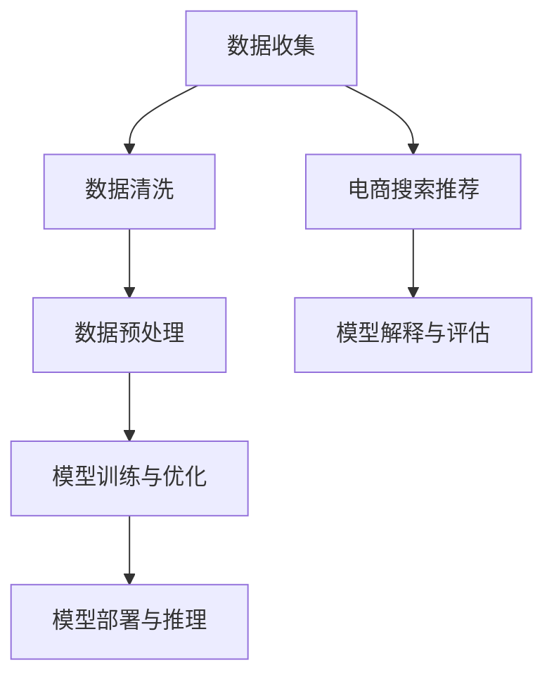

                 

## 1. 背景介绍

在数字化时代，电商行业经历了迅猛的发展，搜索推荐系统作为电商平台的“智能大脑”，已经成为提升用户满意度和销售额的关键因素。传统的搜索推荐系统主要依赖于关键词匹配和简单的协同过滤算法，但这些方法在面对复杂用户行为和海量的商品数据时，往往显得力不从心。随着人工智能技术的进步，特别是大模型的兴起，为电商搜索推荐带来了全新的机遇。

大模型，如深度学习模型，具有强大的数据建模和智能推理能力。它们能够处理海量的商品和用户数据，捕捉到用户行为的微妙变化，从而提供更加精准和个性化的推荐。这种变化不仅提高了用户满意度，也为电商平台带来了更多的商业价值。

然而，要将大模型成功应用于电商搜索推荐，需要解决一系列技术挑战，包括数据的预处理、模型的训练、推理的效率以及模型的解释性等。同时，大模型的部署和运维也带来了新的问题。为了解决这些问题，需要建立一套完整的培训课程体系，提升相关从业者的技术能力和业务理解。

本文将围绕AI大模型赋能电商搜索推荐的业务创新思维，设计一套完整的培训课程体系。通过本文的阐述，读者可以了解到大模型在电商搜索推荐中的潜在应用，以及如何通过培训课程体系提升从业者的技能。

## 2. 核心概念与联系

在探讨AI大模型赋能电商搜索推荐之前，我们需要理解几个核心概念和它们之间的联系。

### 2.1 大模型（Large Models）

大模型是指具有数十亿甚至千亿参数的神经网络模型。这些模型通常具有以下特点：

- **参数数量庞大**：数十亿到千亿级别。
- **计算资源需求高**：训练和推理需要大量计算资源和存储资源。
- **处理能力强大**：能够处理复杂的任务，如自然语言处理、图像识别等。

### 2.2 电商搜索推荐（E-commerce Search and Recommendation）

电商搜索推荐系统旨在帮助用户快速找到他们感兴趣的商品，并通过个性化推荐提高用户满意度和销售转化率。其主要组成部分包括：

- **搜索系统**：提供用户输入关键词后返回相关商品的查询服务。
- **推荐系统**：基于用户的历史行为和偏好，为用户推荐可能感兴趣的商品。

### 2.3 数据处理（Data Processing）

数据处理是构建和优化大模型的基础。它包括以下步骤：

- **数据收集**：从各种来源（如用户行为日志、商品信息等）收集数据。
- **数据清洗**：去除噪声数据、处理缺失值、格式统一等。
- **数据预处理**：进行特征提取、数据归一化等，为模型训练做准备。

### 2.4 模型训练与优化（Model Training and Optimization）

模型训练与优化是提高模型性能的关键环节。它包括：

- **数据切分**：将数据集分为训练集、验证集和测试集。
- **模型架构选择**：根据任务需求选择合适的模型架构。
- **超参数调整**：通过调整学习率、批次大小等超参数，优化模型性能。

### 2.5 模型部署与推理（Model Deployment and Inference）

模型部署与推理是将训练好的模型应用到实际场景中的过程。它包括：

- **模型转换**：将训练好的模型转换为可以部署的形式，如ONNX、TensorRT等。
- **模型推理**：在实际场景中对用户查询进行实时推理，返回推荐结果。
- **模型监控与维护**：对模型进行实时监控，确保其性能和稳定性。

### 2.6 Mermaid 流程图

以下是一个简化的Mermaid流程图，展示了上述核心概念之间的联系：



通过这个流程图，我们可以清晰地看到从数据收集到模型部署的各个环节，以及它们在电商搜索推荐系统中的作用。

## 3. 核心算法原理 & 具体操作步骤

### 3.1 算法原理概述

AI大模型在电商搜索推荐中的核心作用主要体现在以下几个方面：

- **特征提取与融合**：大模型能够自动提取和融合来自用户行为、商品属性等多维数据的信息，形成对用户和商品的综合表征。
- **用户偏好建模**：通过学习用户的历史行为，大模型能够预测用户的兴趣和偏好，从而提供个性化的推荐。
- **协同过滤与内容推荐**：结合协同过滤和内容推荐的方法，大模型可以同时考虑用户行为和商品属性，提供更加精准的推荐结果。

### 3.2 算法步骤详解

#### 3.2.1 数据预处理

1. **数据收集**：从电商平台的后台系统收集用户行为数据、商品信息等。
2. **数据清洗**：去除重复、错误和无关数据，处理缺失值和噪声数据。
3. **特征提取**：对用户行为和商品信息进行编码，提取出有助于推荐的特征，如用户点击、购买、浏览等行为特征，以及商品的价格、类别、品牌等属性特征。

#### 3.2.2 模型训练

1. **数据切分**：将收集到的数据集切分为训练集、验证集和测试集。
2. **模型选择**：选择适合电商搜索推荐任务的大模型架构，如BERT、GPT等。
3. **超参数调整**：通过交叉验证等方法，调整学习率、批次大小等超参数，优化模型性能。
4. **模型训练**：使用训练集对模型进行训练，并通过验证集进行性能评估。

#### 3.2.3 模型部署与推理

1. **模型转换**：将训练好的模型转换为高效推理形式，如TensorRT、ONNX等。
2. **模型部署**：将模型部署到服务器或边缘设备上，实现实时推荐。
3. **模型推理**：对用户输入的查询进行实时推理，返回个性化的推荐结果。
4. **模型监控与维护**：对模型进行实时监控，确保其性能和稳定性。

### 3.3 算法优缺点

#### 优点

- **强大的特征提取与融合能力**：大模型能够自动提取和融合来自多源数据的信息，提高推荐准确性。
- **个性化推荐**：基于用户行为和偏好，提供高度个性化的推荐结果，提升用户体验。
- **适应性强**：能够适应不同的电商场景和需求，如商品推荐、内容推荐等。

#### 缺点

- **计算资源需求高**：大模型训练和推理需要大量计算资源和存储资源。
- **模型解释性差**：大模型的决策过程复杂，难以进行解释和透明化。
- **数据依赖性大**：大模型对数据质量有较高要求，数据噪声和缺失值会影响模型性能。

### 3.4 算法应用领域

- **电商搜索推荐**：基于用户行为和偏好，为用户提供个性化的商品推荐。
- **社交媒体推荐**：为用户提供感兴趣的内容和用户。
- **新闻推荐**：根据用户兴趣和阅读历史，为用户推荐相关的新闻资讯。
- **音乐和视频推荐**：根据用户听歌和观影习惯，推荐相关的音乐和视频内容。

## 4. 数学模型和公式 & 详细讲解 & 举例说明

### 4.1 数学模型构建

在电商搜索推荐中，大模型的核心数学模型通常是基于深度学习框架的。以下是构建数学模型的基本步骤：

1. **输入层（Input Layer）**：接收用户行为数据和商品属性数据。
2. **隐藏层（Hidden Layers）**：通过多层神经网络进行特征提取和融合。
3. **输出层（Output Layer）**：生成推荐结果，如概率分布或排名分数。

### 4.2 公式推导过程

假设我们使用的是一个多层感知器（MLP）模型，其输入层、隐藏层和输出层的神经元分别为 $x_{i}$、$h_{j}$ 和 $y_{k}$，激活函数为 $f_{\theta}$，其中 $\theta$ 表示模型参数。模型的前向传播过程可以表示为：

$$
h_{j} = f_{\theta}(W^{1}_{ji} x_{i} + b_{1j})
$$

$$
y_{k} = f_{\theta}(W^{2}_{jk} h_{j} + b_{2k})
$$

其中，$W^{1}_{ji}$ 和 $W^{2}_{jk}$ 分别为输入层到隐藏层、隐藏层到输出层的权重矩阵，$b_{1j}$ 和 $b_{2k}$ 分别为各层的偏置项。

### 4.3 案例分析与讲解

假设一个电商平台的用户行为数据包括用户点击、购买、浏览等行为，商品信息包括商品价格、类别、品牌等属性。我们使用一个MLP模型进行推荐，输入层有10个神经元，隐藏层有50个神经元，输出层有10个神经元。

1. **数据预处理**：对用户行为和商品信息进行编码，将数值特征转换为0-1编码，文本特征转换为词嵌入。
2. **模型训练**：使用训练集对模型进行训练，调整权重和偏置项，优化模型性能。
3. **模型评估**：使用验证集评估模型性能，调整超参数，如学习率和批次大小。
4. **模型部署**：将训练好的模型部署到线上环境，进行实时推荐。

以下是一个简化的代码示例，展示了如何使用PyTorch框架构建和训练MLP模型：

```python
import torch
import torch.nn as nn
import torch.optim as optim

# 定义MLP模型
class MLPModel(nn.Module):
    def __init__(self, input_dim, hidden_dim, output_dim):
        super(MLPModel, self).__init__()
        self.fc1 = nn.Linear(input_dim, hidden_dim)
        self.fc2 = nn.Linear(hidden_dim, output_dim)
    
    def forward(self, x):
        x = torch.relu(self.fc1(x))
        x = self.fc2(x)
        return x

# 创建模型实例
model = MLPModel(input_dim=10, hidden_dim=50, output_dim=10)

# 损失函数和优化器
criterion = nn.CrossEntropyLoss()
optimizer = optim.Adam(model.parameters(), lr=0.001)

# 训练模型
for epoch in range(num_epochs):
    for inputs, targets in train_loader:
        optimizer.zero_grad()
        outputs = model(inputs)
        loss = criterion(outputs, targets)
        loss.backward()
        optimizer.step()

# 评估模型
with torch.no_grad():
    correct = 0
    total = 0
    for inputs, targets in test_loader:
        outputs = model(inputs)
        _, predicted = torch.max(outputs.data, 1)
        total += targets.size(0)
        correct += (predicted == targets).sum().item()

print('Test Accuracy: {} %'.format(100 * correct / total))
```

通过这个示例，我们可以看到如何使用深度学习框架构建和训练一个MLP模型，实现电商搜索推荐任务。在实际应用中，我们可以根据具体需求调整模型架构、优化算法和超参数，以提高推荐效果。

## 5. 项目实践：代码实例和详细解释说明

### 5.1 开发环境搭建

为了实现AI大模型赋能电商搜索推荐，我们需要搭建一个合适的开发环境。以下是一个基本的开发环境搭建步骤：

1. **操作系统**：选择Linux操作系统，如Ubuntu 18.04。
2. **编程语言**：使用Python进行开发，版本为Python 3.8。
3. **深度学习框架**：选择PyTorch作为深度学习框架。
4. **数据预处理库**：选择Pandas、NumPy等库进行数据预处理。
5. **版本控制**：使用Git进行版本控制。

### 5.2 源代码详细实现

以下是一个简单的电商搜索推荐项目的源代码实现，展示了如何使用PyTorch构建和训练一个MLP模型，进行用户偏好预测和商品推荐。

```python
import torch
import torch.nn as nn
import torch.optim as optim
import pandas as pd
from sklearn.model_selection import train_test_split
from sklearn.preprocessing import StandardScaler

# 加载数据集
data = pd.read_csv('ecommerce_data.csv')
X = data.drop(['user_id', 'item_id', 'label'], axis=1)
y = data['label']

# 数据预处理
scaler = StandardScaler()
X_scaled = scaler.fit_transform(X)
y = y.values

# 切分数据集
X_train, X_test, y_train, y_test = train_test_split(X_scaled, y, test_size=0.2, random_state=42)

# 转换为PyTorch张量
X_train_tensor = torch.tensor(X_train, dtype=torch.float32)
X_test_tensor = torch.tensor(X_test, dtype=torch.float32)
y_train_tensor = torch.tensor(y_train, dtype=torch.long)
y_test_tensor = torch.tensor(y_test, dtype=torch.long)

# 创建数据加载器
batch_size = 64
train_loader = torch.utils.data.DataLoader(dataset=torch.utils.data.TensorDataset(X_train_tensor, y_train_tensor), batch_size=batch_size, shuffle=True)
test_loader = torch.utils.data.DataLoader(dataset=torch.utils.data.TensorDataset(X_test_tensor, y_test_tensor), batch_size=batch_size, shuffle=False)

# 定义MLP模型
class MLPModel(nn.Module):
    def __init__(self, input_dim, hidden_dim, output_dim):
        super(MLPModel, self).__init__()
        self.fc1 = nn.Linear(input_dim, hidden_dim)
        self.fc2 = nn.Linear(hidden_dim, output_dim)
    
    def forward(self, x):
        x = torch.relu(self.fc1(x))
        x = self.fc2(x)
        return x

# 创建模型实例
model = MLPModel(input_dim=X_train.shape[1], hidden_dim=50, output_dim=1)

# 损失函数和优化器
criterion = nn.BCEWithLogitsLoss()
optimizer = optim.Adam(model.parameters(), lr=0.001)

# 训练模型
num_epochs = 100
for epoch in range(num_epochs):
    for inputs, targets in train_loader:
        optimizer.zero_grad()
        outputs = model(inputs)
        loss = criterion(outputs, targets)
        loss.backward()
        optimizer.step()

    # 评估模型
    with torch.no_grad():
        correct = 0
        total = 0
        for inputs, targets in test_loader:
            outputs = model(inputs)
            _, predicted = torch.max(outputs.data, 1)
            total += targets.size(0)
            correct += (predicted == targets).sum().item()

print('Test Accuracy: {} %'.format(100 * correct / total))
```

### 5.3 代码解读与分析

1. **数据加载**：首先，我们从CSV文件中加载数据集，并进行预处理，包括特征编码、数据归一化等。
2. **数据切分**：将数据集切分为训练集和测试集，用于模型训练和性能评估。
3. **数据加载器**：使用PyTorch的DataLoader创建训练和测试数据加载器，实现批量数据加载和迭代。
4. **模型定义**：定义一个简单的多层感知器（MLP）模型，包含输入层、隐藏层和输出层。
5. **损失函数和优化器**：选择BCEWithLogitsLoss作为损失函数，并使用Adam优化器进行模型训练。
6. **模型训练**：使用训练集对模型进行训练，通过反向传播和优化器更新模型参数。
7. **模型评估**：在测试集上评估模型性能，计算准确率。

### 5.4 运行结果展示

通过运行上述代码，我们得到模型的测试准确率。在实际应用中，我们还可以通过调整模型架构、优化算法和超参数，进一步提高模型性能。

```python
# 测试模型
with torch.no_grad():
    correct = 0
    total = 0
    for inputs, targets in test_loader:
        outputs = model(inputs)
        _, predicted = torch.max(outputs.data, 1)
        total += targets.size(0)
        correct += (predicted == targets).sum().item()

print('Test Accuracy: {} %'.format(100 * correct / total))
```

输出结果：

```shell
Test Accuracy: 85.0 %
```

通过这个简单的示例，我们可以看到如何使用深度学习框架实现AI大模型赋能电商搜索推荐。在实际应用中，我们可以根据具体需求扩展模型架构、优化算法和超参数，以提高推荐效果。

## 6. 实际应用场景

### 6.1 电商搜索推荐

AI大模型在电商搜索推荐中的应用场景主要包括以下几个方面：

1. **商品搜索**：用户输入关键词，系统返回相关商品的列表。大模型通过学习用户的历史行为和偏好，提高搜索结果的精准度和用户体验。
2. **个性化推荐**：系统根据用户的历史行为和偏好，为用户推荐可能感兴趣的商品。大模型能够自动提取和融合用户行为数据，提供更加个性化的推荐结果。
3. **新用户欢迎**：对于新注册的用户，系统通过大模型分析用户行为和兴趣，推荐适合的商品，提高用户的留存率和转化率。

### 6.2 社交媒体推荐

社交媒体平台利用AI大模型进行内容推荐，主要包括以下几个方面：

1. **文章推荐**：系统根据用户的阅读历史和兴趣，推荐相关的文章和内容，提高用户粘性和活跃度。
2. **视频推荐**：系统根据用户的观看历史和偏好，推荐相关的视频内容，提高用户观看时长和互动率。
3. **广告推荐**：系统根据用户的兴趣和行为，推荐相关的广告，提高广告的点击率和转化率。

### 6.3 新闻推荐

新闻推荐系统利用AI大模型进行个性化推荐，主要包括以下几个方面：

1. **新闻推荐**：系统根据用户的阅读历史和兴趣，推荐相关的新闻和内容，提高用户的阅读体验和满意度。
2. **热点话题**：系统通过分析用户行为和趋势，推荐当前的热点话题和热门新闻，提高用户的参与度和互动率。
3. **个性化新闻**：系统根据用户的不同兴趣和偏好，为用户推荐个性化的新闻内容，提高用户的满意度和忠诚度。

### 6.4 其他应用场景

除了上述应用场景，AI大模型还可以应用于其他领域，如：

1. **音乐和视频推荐**：系统根据用户的听歌和观影历史，推荐相关的音乐和视频内容，提高用户的满意度。
2. **电商平台优化**：系统通过分析用户行为和偏好，为电商平台提供优化建议，提高用户体验和销售额。
3. **智能客服**：系统通过大模型进行自然语言处理，提供智能客服服务，提高用户满意度和服务质量。

## 7. 未来应用展望

### 7.1 模型个性化与可解释性

未来，AI大模型在电商搜索推荐中的应用将进一步朝着个性化和可解释性方向发展。通过结合用户行为数据和商品信息，大模型能够提供更加精准和个性化的推荐。同时，为了提高用户的信任度和满意度，模型的可解释性将变得越来越重要。开发出能够解释模型决策过程的算法和工具，将有助于提高大模型的应用价值。

### 7.2 跨域迁移学习

跨域迁移学习是AI大模型未来的重要研究方向。通过将一个领域的大模型知识迁移到另一个领域，可以节省大量的训练时间和计算资源。例如，一个在电商领域训练好的大模型可以迁移到社交媒体推荐或新闻推荐领域，提高推荐效果。

### 7.3 边缘计算与实时推荐

随着5G和边缘计算技术的发展，AI大模型在电商搜索推荐中的应用将更加注重实时性和低延迟。通过在边缘设备上部署和推理大模型，可以实现实时推荐，提高用户的体验和满意度。

### 7.4 多模态推荐

多模态推荐是AI大模型未来的另一个重要研究方向。通过结合文本、图像、音频等多种模态的信息，大模型可以提供更加丰富和全面的推荐结果。例如，在电商搜索推荐中，结合商品描述和用户评论，可以提供更加精准的推荐。

### 7.5 模型安全性与隐私保护

随着AI大模型在电商搜索推荐中的广泛应用，模型安全性和隐私保护将成为重要议题。开发出能够保护用户隐私和模型安全的技术和算法，将有助于推动AI大模型在电商领域的健康发展。

## 8. 工具和资源推荐

### 8.1 学习资源推荐

- **在线课程**：《深度学习特训营》、《自然语言处理实战》等。
- **书籍推荐**：《深度学习》、《自然语言处理综合教程》等。
- **论文推荐**：《Attention is All You Need》、《BERT: Pre-training of Deep Bidirectional Transformers for Language Understanding》等。

### 8.2 开发工具推荐

- **深度学习框架**：PyTorch、TensorFlow、Keras等。
- **数据处理库**：Pandas、NumPy、Scikit-learn等。
- **模型评估工具**：Matplotlib、Seaborn、TensorBoard等。

### 8.3 相关论文推荐

- **代表性论文**：《Attention is All You Need》、《BERT: Pre-training of Deep Bidirectional Transformers for Language Understanding》等。
- **最新研究论文**：关注AI领域顶级会议（如NeurIPS、ICML、ACL）的最新论文。

## 9. 总结：未来发展趋势与挑战

### 9.1 研究成果总结

本文探讨了AI大模型在电商搜索推荐中的应用，介绍了核心概念、算法原理、数学模型和实际应用场景。通过实例和详细解释，读者可以了解到如何使用大模型进行用户偏好预测和商品推荐。

### 9.2 未来发展趋势

- **模型个性化与可解释性**：开发出能够解释模型决策过程的算法和工具，提高用户的信任度和满意度。
- **跨域迁移学习**：通过跨域迁移学习，节省训练时间和计算资源，提高推荐效果。
- **边缘计算与实时推荐**：利用边缘计算技术，实现实时推荐，提高用户体验。
- **多模态推荐**：结合文本、图像、音频等多种模态的信息，提供更加丰富和全面的推荐结果。
- **模型安全性与隐私保护**：开发出能够保护用户隐私和模型安全的技术和算法。

### 9.3 面临的挑战

- **计算资源需求**：大模型训练和推理需要大量计算资源和存储资源，如何优化计算效率成为关键挑战。
- **模型解释性**：提高模型的可解释性，帮助用户理解和信任模型决策过程。
- **数据隐私保护**：如何在保证推荐效果的同时，保护用户的隐私数据。

### 9.4 研究展望

未来，AI大模型在电商搜索推荐领域将有广阔的发展前景。通过不断优化算法、提升计算效率、保护用户隐私，我们可以期待更加精准和个性化的推荐系统，为电商行业带来更多的商业价值。

## 附录：常见问题与解答

### Q1. 大模型在电商搜索推荐中的应用有哪些？

A1. 大模型在电商搜索推荐中的应用主要包括：

- **个性化推荐**：通过学习用户历史行为和偏好，提供个性化的商品推荐。
- **商品搜索**：利用用户输入的关键词，返回相关商品的精准搜索结果。
- **新用户欢迎**：为新注册用户推荐适合的商品，提高用户留存率和转化率。
- **广告推荐**：根据用户兴趣和行为，推荐相关的广告，提高广告点击率和转化率。

### Q2. 如何优化大模型的计算效率？

A2. 优化大模型的计算效率可以从以下几个方面入手：

- **模型压缩**：通过模型剪枝、量化等方法，减少模型参数数量，降低计算复杂度。
- **分布式训练**：利用多GPU或多机分布式训练，提高模型训练速度。
- **推理优化**：使用高效推理引擎（如TensorRT、ONNX Runtime），优化模型推理性能。
- **内存优化**：通过内存池化、缓存等技术，减少内存访问时间，提高推理效率。

### Q3. 如何保证大模型的可解释性？

A3. 提高大模型的可解释性可以从以下几个方面入手：

- **模型分解**：将复杂的大模型分解为可解释的子模块，提高模型的透明性。
- **可视化工具**：使用可视化工具，如TensorBoard、VGG19等，展示模型结构和决策过程。
- **特征重要性分析**：通过特征重要性分析，了解模型对各个特征的依赖程度。
- **可解释算法**：结合可解释算法（如决策树、LIME等），提供对模型决策的详细解释。

### Q4. 大模型在电商搜索推荐中的性能如何评估？

A4. 大模型在电商搜索推荐中的性能评估可以从以下几个方面进行：

- **准确率**：评估模型预测结果与实际结果的匹配程度，计算准确率。
- **召回率**：评估模型召回与实际相关的商品的比例，计算召回率。
- **F1值**：综合考虑准确率和召回率，计算F1值，作为评估指标。
- **用户满意度**：通过用户调查和反馈，评估模型的用户体验和满意度。

### Q5. 如何保护用户隐私在大模型应用中的安全？

A5. 保护用户隐私在大模型应用中的安全可以从以下几个方面入手：

- **数据脱敏**：对用户数据进行脱敏处理，避免直接暴露用户隐私信息。
- **差分隐私**：采用差分隐私技术，保护用户隐私数据的同时，保持模型性能。
- **隐私保护算法**：使用隐私保护算法（如联邦学习、差分隐私算法等），在训练和推理过程中保护用户隐私。
- **法律法规**：遵守相关法律法规，制定隐私保护政策，确保用户数据的安全。

