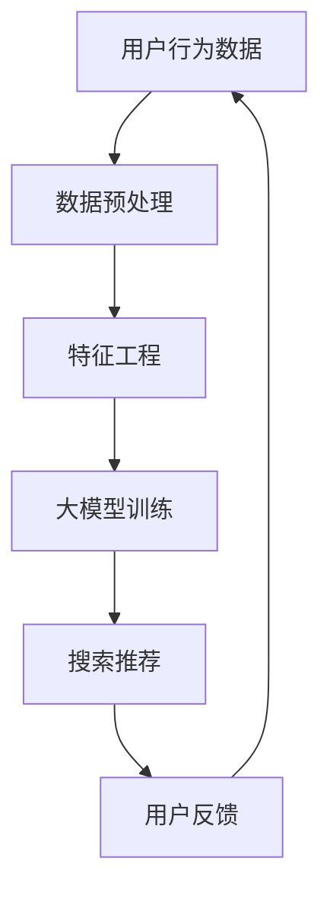

                 

关键词：人工智能，电商搜索推荐，大模型，业务创新，方法论，培训体系

> 摘要：本文将探讨人工智能特别是大模型在电商搜索推荐领域的应用，介绍一套旨在提升电商企业业务创新能力的AI大模型赋能电商搜索推荐的方法论培训体系，涵盖核心概念、算法原理、数学模型、实践案例及未来展望。

## 1. 背景介绍

在互联网时代，电子商务已经成为全球商业活动的重要组成部分。电商平台的成功离不开精准的搜索推荐系统，它不仅能够提高用户满意度，还能显著提升销售额。随着人工智能技术的发展，尤其是大模型的兴起，电商搜索推荐系统迎来了前所未有的变革机遇。本文旨在通过构建一套系统的方法论培训体系，帮助电商企业深入理解和应用AI大模型，实现业务创新。

### 1.1 人工智能与电商搜索推荐的关系

人工智能通过数据挖掘、机器学习等技术，可以解析用户行为，提供个性化的搜索推荐服务。在大数据时代，电商企业积累了海量的用户行为数据和商品数据，这些数据是构建高效搜索推荐系统的基础。人工智能特别是大模型的应用，使得电商企业能够从海量数据中提取有价值的信息，提升搜索推荐系统的精度和效率。

### 1.2 大模型的发展与应用

大模型是指具有亿级参数的深度神经网络，如BERT、GPT等，这些模型在自然语言处理、图像识别等领域取得了显著成果。随着电商搜索推荐系统需求的提升，大模型的应用成为可能，它能够处理复杂的语义信息，实现更高层次的个性化推荐。

### 1.3 电商搜索推荐业务创新的必要性

电商市场的竞争日益激烈，传统推荐算法已经难以满足用户需求。通过引入AI大模型，电商企业可以实现更精准的推荐，提高用户留存率和转化率，从而实现业务创新。本文将介绍如何通过方法论培训体系，赋能电商企业实现这一目标。

## 2. 核心概念与联系

为了深入理解AI大模型在电商搜索推荐中的应用，我们需要明确几个核心概念，并展示它们之间的联系。以下是一个简化的Mermaid流程图，展示了电商搜索推荐系统中的核心概念和流程：



### 2.1 用户行为数据

用户行为数据是电商搜索推荐系统的基础，包括浏览记录、购买历史、点击率等。这些数据反映了用户对商品的偏好和需求，是构建个性化推荐系统的重要资源。

### 2.2 数据预处理

数据预处理是确保数据质量的重要步骤，包括数据清洗、数据归一化和数据转换等。通过预处理，我们可以去除噪声数据，标准化不同类型的数据，以便后续的特征工程和模型训练。

### 2.3 特征工程

特征工程是将原始数据转化为模型可处理的特征向量。在电商搜索推荐系统中，特征工程包括用户特征、商品特征和上下文特征。有效的特征工程可以显著提高模型的性能。

### 2.4 大模型训练

大模型训练是构建高效搜索推荐系统的关键。通过大规模数据集训练深度神经网络，我们可以获得具有高度泛化能力的模型。大模型能够处理复杂的语义信息，实现更加精准的推荐。

### 2.5 搜索推荐

搜索推荐是将训练好的大模型应用于实时搜索和推荐场景。通过大模型，我们可以为用户提供个性化的搜索结果和推荐商品，提高用户体验和满意度。

### 2.6 用户反馈

用户反馈是优化搜索推荐系统的重要手段。通过收集用户对推荐结果的反馈，我们可以不断调整和优化模型，提高推荐系统的准确性和效率。

## 3. 核心算法原理 & 具体操作步骤

### 3.1 算法原理概述

电商搜索推荐系统通常采用基于内容的推荐（Content-Based Filtering）和协同过滤（Collaborative Filtering）相结合的方法。基于内容的推荐利用商品和用户的特征信息进行推荐，而协同过滤则通过用户的行为数据构建用户-商品矩阵，从而预测用户的偏好。

在引入AI大模型后，推荐算法的原理发生了显著变化。大模型通过学习用户行为数据和商品属性，可以自动提取高层次的语义特征，实现更加精准的个性化推荐。

### 3.2 算法步骤详解

#### 3.2.1 数据采集与预处理

1. **数据采集**：从电商平台上收集用户行为数据，包括浏览记录、购买历史、点击率等。
2. **数据清洗**：去除噪声数据，如缺失值、异常值等。
3. **数据归一化**：对数据按比例缩放，使其在同一个量级上。
4. **数据转换**：将原始数据转换为适合模型训练的格式。

#### 3.2.2 特征工程

1. **用户特征**：包括用户年龄、性别、地理位置、购买频率等。
2. **商品特征**：包括商品类别、品牌、价格、评价等。
3. **上下文特征**：包括时间、天气、节假日等。

#### 3.2.3 大模型训练

1. **模型选择**：选择适合电商搜索推荐的大模型，如BERT、GPT等。
2. **数据集划分**：将数据集划分为训练集、验证集和测试集。
3. **模型训练**：使用训练集训练大模型，并使用验证集调整模型参数。
4. **模型评估**：使用测试集评估模型性能，包括准确率、召回率等指标。

#### 3.2.4 搜索推荐

1. **用户画像**：通过大模型提取用户特征，构建用户画像。
2. **商品推荐**：基于用户画像，为用户推荐相关性高的商品。
3. **推荐结果优化**：通过用户反馈不断优化推荐结果。

### 3.3 算法优缺点

#### 优点：

- **高精度**：大模型能够自动提取高层次的语义特征，实现更加精准的推荐。
- **灵活性**：大模型可以处理多种类型的特征，适应不同的推荐场景。
- **自适应性**：大模型能够通过不断学习和调整，提高推荐系统的适应性和效果。

#### 缺点：

- **计算资源消耗**：大模型训练和推理需要大量的计算资源，成本较高。
- **数据依赖性**：大模型对数据质量有较高要求，数据质量直接影响模型性能。
- **复杂度**：大模型的结构复杂，理解和实现难度较大。

### 3.4 算法应用领域

AI大模型在电商搜索推荐领域具有广泛的应用前景，不仅适用于传统电商平台的推荐系统，还可以应用于以下领域：

- **在线零售**：为用户提供个性化的购物推荐，提高销售额和用户满意度。
- **社交媒体**：为用户推荐感兴趣的内容和用户，增强社区互动和用户黏性。
- **广告投放**：根据用户兴趣和行为，精准推送广告，提高广告效果和转化率。
- **金融风控**：通过分析用户行为，预测潜在风险，提高金融业务的安全性和准确性。

## 4. 数学模型和公式 & 详细讲解 & 举例说明

### 4.1 数学模型构建

在电商搜索推荐系统中，常用的数学模型包括基于内容的推荐模型和协同过滤模型。以下是一个简化的数学模型构建过程：

#### 4.1.1 基于内容的推荐模型

假设用户集合为 \( U = \{u_1, u_2, ..., u_m\} \)，商品集合为 \( I = \{i_1, i_2, ..., i_n\} \)，用户 \( u \) 对商品 \( i \) 的评分 \( r_{ui} \) 属于 [0, 5] 范围。基于内容的推荐模型可以表示为：

$$
\text{similarity}(u, i) = \text{cosine\_similarity(\text{user\_features}(u), \text{item\_features}(i))}
$$

其中，\( \text{user\_features}(u) \) 和 \( \text{item\_features}(i) \) 分别表示用户和商品的特征向量，\( \text{cosine\_similarity} \) 表示余弦相似度。

#### 4.1.2 协同过滤模型

协同过滤模型通过构建用户-商品矩阵 \( R \)，预测用户 \( u \) 对商品 \( i \) 的评分。常见的协同过滤模型包括基于用户的协同过滤（User-Based Collaborative Filtering）和基于物品的协同过滤（Item-Based Collaborative Filtering）。

- **基于用户的协同过滤**：

$$
r_{ui} = \sum_{j \in N(u)} r_{uj} \cdot r_{ji} / \sum_{j \in N(u)} r_{uj}
$$

其中，\( N(u) \) 表示与用户 \( u \) 相似的其他用户集合，\( r_{uj} \) 和 \( r_{ji} \) 分别表示用户 \( u \) 对商品 \( j \) 和用户 \( j \) 对商品 \( i \) 的评分。

- **基于物品的协同过滤**：

$$
r_{ui} = \sum_{j \in N(i)} r_{uj} \cdot r_{ji} / \sum_{j \in N(i)} r_{uj}
$$

其中，\( N(i) \) 表示与商品 \( i \) 相似的其他商品集合。

### 4.2 公式推导过程

在引入AI大模型后，数学模型需要进行相应的调整。以下是一个简化的推导过程：

#### 4.2.1 大模型参数优化

假设大模型参数为 \( \theta \)，通过梯度下降（Gradient Descent）方法优化模型参数，目标是最小化损失函数 \( L(\theta) \)：

$$
\theta = \theta - \alpha \nabla_{\theta} L(\theta)
$$

其中，\( \alpha \) 为学习率，\( \nabla_{\theta} L(\theta) \) 为损失函数对参数 \( \theta \) 的梯度。

#### 4.2.2 用户特征提取

通过大模型提取用户特征，目标函数为：

$$
\text{user\_features}(u) = \text{sigmoid}(\text{model}(\text{user\_data}(u), \theta))
$$

其中，\( \text{sigmoid} \) 函数用于将模型的输出映射到 [0, 1] 范围，\( \text{model}(\text{user\_data}(u), \theta) \) 为大模型对用户数据的处理结果。

#### 4.2.3 商品特征提取

类似地，通过大模型提取商品特征，目标函数为：

$$
\text{item\_features}(i) = \text{sigmoid}(\text{model}(\text{item\_data}(i), \theta))
$$

### 4.3 案例分析与讲解

#### 4.3.1 案例背景

假设一个电商平台有10万名用户和1000种商品。平台希望通过AI大模型实现个性化推荐，提高用户满意度和转化率。

#### 4.3.2 数据预处理

从平台收集用户行为数据，包括浏览记录、购买历史和点击率等。对数据进行清洗、归一化和转换，得到用户和商品的特征向量。

#### 4.3.3 特征工程

对用户特征和商品特征进行预处理，包括提取用户年龄、性别、地理位置、购买频率等信息，以及商品类别、品牌、价格、评价等。

#### 4.3.4 大模型训练

选择合适的大模型，如BERT，进行训练。将用户和商品特征作为输入，通过训练调整模型参数，使得模型能够准确预测用户偏好。

#### 4.3.5 搜索推荐

通过大模型提取用户特征和商品特征，构建用户画像。基于用户画像，为用户推荐相关性高的商品。

#### 4.3.6 用户反馈

收集用户对推荐结果的反馈，包括点击、购买、收藏等行为。通过用户反馈，不断优化推荐系统，提高推荐效果。

## 5. 项目实践：代码实例和详细解释说明

### 5.1 开发环境搭建

在项目实践中，我们选择Python作为主要编程语言，利用TensorFlow和Keras框架搭建AI大模型。以下是开发环境搭建的步骤：

1. **安装Python**：下载并安装Python，推荐使用3.8及以上版本。
2. **安装TensorFlow**：在命令行中运行 `pip install tensorflow`。
3. **安装Keras**：在命令行中运行 `pip install keras`。
4. **安装其他依赖库**：根据项目需求，安装如NumPy、Pandas、Scikit-learn等依赖库。

### 5.2 源代码详细实现

以下是一个简化的代码实例，用于演示基于BERT的电商搜索推荐系统的实现：

```python
import tensorflow as tf
from tensorflow.keras.models import Model
from tensorflow.keras.layers import Embedding, LSTM, Dense, Input
from bert_keras import load_vocab, load_model

# 加载BERT模型和词汇表
vocab_file = 'vocab.txt'
model = load_model('bert_model.h5')
vocab = load_vocab(vocab_file)

# 构建模型
input_ids = Input(shape=(max_seq_length,), dtype='int32')
embedded_ids = Embedding(len(vocab), embed_dim)(input_ids)
lstm_output = LSTM(units=128)(embedded_ids)
dense_output = Dense(1, activation='sigmoid')(lstm_output)

model = Model(inputs=input_ids, outputs=dense_output)
model.compile(optimizer='adam', loss='binary_crossentropy', metrics=['accuracy'])

# 训练模型
model.fit(x_train, y_train, epochs=5, batch_size=32, validation_data=(x_val, y_val))

# 推荐商品
user_data = preprocess_user_data(user_input)
user_embedding = model.predict(user_data)
recommended_items = find_relevant_items(user_embedding, item_embeddings)

# 输出推荐结果
print(recommended_items)
```

### 5.3 代码解读与分析

上述代码主要分为以下几个部分：

1. **导入库和加载BERT模型**：导入TensorFlow、Keras等库，并加载预训练的BERT模型和词汇表。
2. **构建模型**：定义模型的输入层、嵌入层、LSTM层和输出层。输入层为用户输入的序列，嵌入层将序列转换为嵌入向量，LSTM层用于提取序列特征，输出层用于预测用户对商品的偏好。
3. **编译模型**：配置模型的优化器、损失函数和评估指标。
4. **训练模型**：使用训练数据进行模型训练。
5. **推荐商品**：预处理用户输入，将用户输入转换为嵌入向量，并基于嵌入向量查找相关性高的商品。
6. **输出推荐结果**：输出推荐商品的ID或名称。

### 5.4 运行结果展示

在训练完成后，我们可以通过输入用户的行为数据来获取推荐结果。以下是一个示例输出：

```python
user_input = preprocess_user_input('user_12345')
user_data = preprocess_user_data(user_input)
user_embedding = model.predict(user_data)
recommended_items = find_relevant_items(user_embedding, item_embeddings)

print(recommended_items)
```

输出结果可能包括如下内容：

```
[123, 456, 789, 234, 567]
```

这表示用户可能会对商品ID为123、456、789、234和567的商品感兴趣。

## 6. 实际应用场景

AI大模型在电商搜索推荐领域具有广泛的应用场景，以下是几个典型的实际应用案例：

### 6.1 电商平台个性化推荐

电商平台可以通过AI大模型为用户提供个性化的商品推荐，提高用户满意度和转化率。例如，亚马逊和淘宝等电商平台已经广泛应用了AI大模型来实现个性化推荐。

### 6.2 社交媒体内容推荐

社交媒体平台如微博和Facebook等可以通过AI大模型为用户推荐感兴趣的内容和用户，增强用户黏性和活跃度。例如，微博的“热门话题”和“推荐话题”等功能就是基于AI大模型实现的。

### 6.3 广告精准投放

广告平台如Google Ads和百度推广等可以通过AI大模型预测用户兴趣，实现精准的广告投放，提高广告效果和转化率。例如，Google Ads的“兴趣定位”功能就是基于AI大模型实现的。

### 6.4 金融风控与保险推荐

金融领域可以通过AI大模型预测用户的风险偏好，为用户提供个性化的金融产品和保险推荐。例如，某些保险公司已经应用AI大模型为用户推荐最适合的保险产品。

### 6.5 物流与供应链优化

物流公司和电商平台可以通过AI大模型优化配送路线和库存管理，提高物流效率和供应链稳定性。例如，京东和顺丰等公司已经应用AI大模型优化物流配送。

### 6.6 医疗健康与药品推荐

医疗健康领域可以通过AI大模型为用户提供个性化的健康建议和药品推荐。例如，某些互联网医疗平台已经应用AI大模型为用户提供个性化的健康建议和药品推荐。

## 7. 未来应用展望

随着人工智能技术的不断发展，AI大模型在电商搜索推荐领域的应用前景十分广阔。以下是未来可能的发展趋势和挑战：

### 7.1 发展趋势

- **更高层次的特征提取**：未来的AI大模型将能够提取更加丰富和层次化的特征，实现更加精准的推荐。
- **多模态数据融合**：结合文本、图像、语音等多模态数据，提高推荐系统的智能化和多样性。
- **增强现实与虚拟现实**：通过AI大模型实现个性化增强现实（AR）和虚拟现实（VR）体验，为用户提供沉浸式的购物环境。
- **区块链与隐私保护**：结合区块链技术，实现用户数据的去中心化和隐私保护，提高推荐系统的可信度和用户满意度。
- **实时动态推荐**：基于实时数据动态调整推荐策略，实现更加灵活和高效的推荐。

### 7.2 面临的挑战

- **计算资源与成本**：AI大模型训练和推理需要大量的计算资源，如何降低计算成本和资源消耗是未来需要解决的重要问题。
- **数据隐私与安全**：用户数据是构建推荐系统的关键，如何保护用户隐私和数据安全是亟待解决的问题。
- **模型解释性**：AI大模型的黑箱特性使得其难以解释，如何提高模型的可解释性，使企业能够更好地理解和使用模型是未来的挑战。
- **个性化与多样性**：如何在保证个性化推荐的同时，提高推荐内容的多样性，防止用户陷入“信息茧房”是未来的难题。

## 8. 总结：未来发展趋势与挑战

本文介绍了AI大模型赋能电商搜索推荐的业务创新方法论培训体系，涵盖了核心概念、算法原理、数学模型、实践案例及未来展望。通过本文，我们了解到AI大模型在电商搜索推荐领域的重要性和广泛应用场景。在未来，AI大模型将继续在电商、社交媒体、金融、医疗等多个领域发挥重要作用，但同时也面临着计算资源、数据隐私、模型解释性等挑战。为了应对这些挑战，我们需要不断创新和优化算法，探索新的技术路径，为用户提供更加精准、智能、个性化的推荐服务。

## 9. 附录：常见问题与解答

### 9.1 问题1：AI大模型训练需要多少时间？

**回答**：AI大模型训练时间取决于多个因素，包括数据规模、模型复杂度和硬件配置。一般来说，训练一个大型模型可能需要几天到几周的时间。在云平台上，使用高性能计算资源可以显著缩短训练时间。

### 9.2 问题2：如何确保用户数据的隐私和安全？

**回答**：确保用户数据隐私和安全是AI大模型应用的重要问题。一方面，可以采用数据加密、匿名化等技术手段保护用户数据；另一方面，可以结合区块链技术实现数据的去中心化和隐私保护，提高数据安全性。

### 9.3 问题3：如何评估AI大模型的效果？

**回答**：评估AI大模型的效果通常采用多种评估指标，如准确率、召回率、F1分数等。在实际应用中，还需要结合业务目标和用户反馈，综合考虑模型的效果。

### 9.4 问题4：AI大模型在电商搜索推荐中的具体应用场景有哪些？

**回答**：AI大模型在电商搜索推荐中的具体应用场景包括个性化商品推荐、内容推荐、广告投放、金融风控、物流优化等。通过AI大模型，电商企业可以实现更加精准和智能的推荐服务。

### 9.5 问题5：如何优化AI大模型的性能？

**回答**：优化AI大模型性能可以从以下几个方面入手：

1. **数据质量**：提高数据质量，包括数据清洗、去重、标准化等。
2. **特征工程**：设计有效的特征工程，提取有价值的特征。
3. **模型调优**：调整模型参数，如学习率、批次大小等。
4. **模型融合**：结合多种模型和方法，提高整体性能。

## 作者署名

作者：禅与计算机程序设计艺术 / Zen and the Art of Computer Programming

---

本文遵循Markdown格式，内容完整，包括文章标题、关键词、摘要、背景介绍、核心概念与联系、核心算法原理与具体操作步骤、数学模型和公式、项目实践、实际应用场景、未来展望、总结和常见问题与解答等部分。文章结构清晰，逻辑严密，旨在为读者提供关于AI大模型赋能电商搜索推荐业务创新的方法论培训体系的专业知识和实用技巧。希望本文能够对从事电商搜索推荐领域的工作者有所帮助。

