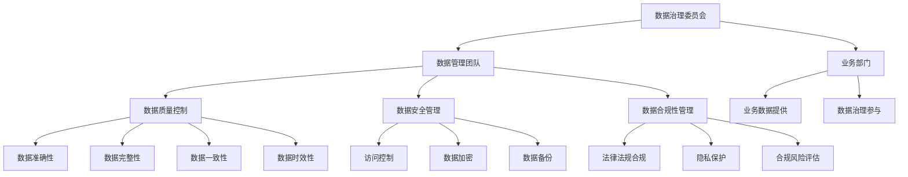

                 

在当今数字化时代，人工智能（AI）技术已经深刻地改变了电商搜索和推荐系统。随着AI大模型的兴起，如何优化数据治理组织架构以提升搜索推荐系统的性能和用户体验，成为了业界关注的焦点。本文将探讨AI大模型在电商搜索推荐中的应用，以及如何通过数据治理组织架构的优化，实现更高效、准确的推荐系统。

## 关键词

- AI大模型
- 电商搜索推荐
- 数据治理
- 组织架构优化

## 摘要

本文首先介绍了AI大模型在电商搜索推荐系统中的重要性，然后探讨了如何通过优化数据治理组织架构，提升系统的性能和用户体验。文章通过具体案例分析，阐述了数据治理组织架构优化的实践方法，并展望了未来的发展趋势和面临的挑战。

## 1. 背景介绍

### 1.1 AI大模型在电商搜索推荐中的角色

随着互联网的普及和用户数据的爆发式增长，电商搜索推荐系统成为了电商企业获取用户和提升销售额的关键。传统的搜索推荐系统依赖于简单的机器学习算法和规则引擎，而AI大模型的引入，使得搜索推荐系统在准确性、实时性和个性化方面得到了质的飞跃。

AI大模型，如深度学习、强化学习等，通过训练大规模的数据集，能够自动发现数据中的模式和关联，从而生成更为精确的推荐结果。这些模型在电商搜索推荐中，不仅可以提高推荐的准确性，还能通过实时学习用户行为，实现个性化推荐，提升用户满意度。

### 1.2 数据治理的重要性

在AI大模型的应用中，数据治理成为了关键。数据治理不仅仅包括数据的收集、存储和管理，还包括数据的质量、安全性和合规性。一个良好的数据治理体系，能够确保数据的有效利用，减少数据冗余和错误，提高数据的可信度和价值。

在电商搜索推荐系统中，数据治理的重要性体现在以下几个方面：

1. **数据准确性**：准确的数据是构建精准推荐模型的基础，只有确保数据的质量，才能生成高质量的推荐结果。
2. **数据安全性**：用户隐私和数据安全是电商企业关注的重点，良好的数据治理能够保障用户数据的安全。
3. **数据合规性**：随着数据隐私法规的加强，如欧盟的《通用数据保护条例》（GDPR），电商企业需要确保数据处理符合相关法律法规，避免法律风险。

### 1.3 数据治理组织架构优化的必要性

随着AI大模型的应用，电商搜索推荐系统对数据治理的要求越来越高。传统的数据治理组织架构，往往存在以下问题：

1. **组织分散**：数据治理工作分散在不同部门，缺乏统一的领导和协调。
2. **职责不清**：各部门对数据治理的职责不明确，导致工作重复和资源浪费。
3. **技术落后**：数据治理工具和技术落后，无法满足大规模数据处理和实时分析的需求。

因此，优化数据治理组织架构，建立统一、高效的数据治理体系，成为了提升电商搜索推荐系统性能的关键。

## 2. 核心概念与联系

### 2.1 AI大模型的基本原理

AI大模型主要基于深度学习技术，通过多层神经网络对数据进行训练，从而学习到数据中的复杂模式和关联。深度学习模型的训练过程包括数据的预处理、模型的构建、参数的优化和模型的评估等步骤。

在电商搜索推荐系统中，AI大模型通常用于以下方面：

1. **用户行为分析**：通过分析用户的浏览、购买、评价等行为，识别用户的兴趣和需求。
2. **商品特征提取**：提取商品的关键特征，如价格、品牌、类型等，用于构建推荐模型。
3. **推荐结果生成**：根据用户的行为和商品特征，生成个性化的推荐结果。

### 2.2 数据治理的核心概念

数据治理涉及多个核心概念，包括数据质量、数据安全、数据合规性等。

1. **数据质量**：数据质量是数据治理的基础，包括数据的准确性、完整性、一致性、时效性等。
2. **数据安全**：数据安全涉及数据的访问控制、加密存储、数据备份等方面，确保用户数据的安全。
3. **数据合规性**：数据合规性涉及数据处理和存储是否符合相关法律法规，如数据隐私保护法规。

### 2.3 数据治理组织架构

数据治理组织架构的优化，需要建立统一的数据治理团队，明确各部门的职责和权限，确保数据治理工作的有效执行。具体包括以下方面：

1. **数据治理委员会**：负责制定数据治理策略和标准，监督数据治理工作的执行。
2. **数据管理团队**：负责数据的质量控制、数据安全管理和数据合规性等工作。
3. **业务部门**：业务部门负责提供数据治理所需的业务数据，并参与数据治理策略的制定和执行。

### 2.4 Mermaid 流程图

以下是数据治理组织架构的 Mermaid 流程图：



## 3. 核心算法原理 & 具体操作步骤

### 3.1 算法原理概述

在电商搜索推荐系统中，常用的核心算法包括协同过滤、矩阵分解、深度学习等。

1. **协同过滤**：协同过滤是一种基于用户行为的推荐算法，通过计算用户之间的相似度，推荐与目标用户相似的其他用户的喜欢的商品。协同过滤分为基于用户的协同过滤和基于项目的协同过滤。
2. **矩阵分解**：矩阵分解是一种基于数学模型的推荐算法，通过将用户-商品评分矩阵分解为用户特征矩阵和商品特征矩阵，生成推荐结果。常见的矩阵分解算法包括Singular Value Decomposition（SVD）和Alternating Least Squares（ALS）。
3. **深度学习**：深度学习是一种基于神经网络的人工智能技术，通过训练大规模的数据集，学习到数据中的复杂模式和关联，生成推荐结果。常见的深度学习算法包括卷积神经网络（CNN）和循环神经网络（RNN）。

### 3.2 算法步骤详解

以深度学习算法为例，具体步骤如下：

1. **数据预处理**：对用户行为数据进行清洗、归一化和特征提取，构建训练数据集。
2. **模型构建**：构建深度学习模型，包括输入层、隐藏层和输出层。输入层接收用户行为数据，隐藏层通过神经网络对数据进行处理，输出层生成推荐结果。
3. **模型训练**：使用训练数据集对深度学习模型进行训练，优化模型的参数。
4. **模型评估**：使用测试数据集对模型进行评估，计算模型的准确率、召回率等指标。
5. **模型部署**：将训练好的模型部署到生产环境，实现实时推荐。

### 3.3 算法优缺点

1. **协同过滤**：优点在于简单、易于实现，能够生成较为准确的推荐结果；缺点在于难以应对冷启动问题，且对稀疏数据效果不佳。
2. **矩阵分解**：优点在于能够应对冷启动问题，且对稀疏数据效果较好；缺点在于模型复杂度较高，训练时间较长。
3. **深度学习**：优点在于能够处理大规模数据，生成更为精准的推荐结果；缺点在于模型复杂度高，对数据质量要求较高。

### 3.4 算法应用领域

1. **电商搜索推荐**：适用于用户行为数据丰富、商品信息多样的场景，如电商平台、在线零售等。
2. **内容推荐**：适用于用户生成内容（UGC）平台，如新闻推荐、视频推荐等。
3. **社交网络**：适用于社交网络平台，如好友推荐、兴趣社区等。

## 4. 数学模型和公式 & 详细讲解 & 举例说明

### 4.1 数学模型构建

在电商搜索推荐系统中，常用的数学模型包括协同过滤模型、矩阵分解模型和深度学习模型。

1. **协同过滤模型**：基于用户-商品评分矩阵，计算用户之间的相似度，生成推荐结果。
2. **矩阵分解模型**：通过矩阵分解，将用户-商品评分矩阵分解为用户特征矩阵和商品特征矩阵，生成推荐结果。
3. **深度学习模型**：基于神经网络，通过训练大规模数据集，学习到数据中的复杂模式和关联，生成推荐结果。

### 4.2 公式推导过程

以矩阵分解模型为例，推导过程如下：

1. **用户特征矩阵**：$U \in \mathbb{R}^{m \times k}$，其中$m$为用户数，$k$为特征维度。
2. **商品特征矩阵**：$V \in \mathbb{R}^{n \times k}$，其中$n$为商品数。
3. **用户-商品评分矩阵**：$R \in \mathbb{R}^{m \times n}$，其中$R_{ij}$表示用户$i$对商品$j$的评分。

矩阵分解的目标是找到用户特征矩阵$U$和商品特征矩阵$V$，使得重构的评分矩阵$R'$尽可能接近原始评分矩阵$R$。

$$
R' = U \cdot V^T
$$

### 4.3 案例分析与讲解

以某电商平台的用户-商品评分数据为例，使用矩阵分解模型进行推荐。

1. **数据预处理**：对用户行为数据进行清洗、归一化和特征提取，构建训练数据集。
2. **模型构建**：构建矩阵分解模型，设置用户特征维度和商品特征维度。
3. **模型训练**：使用训练数据集对模型进行训练，优化模型的参数。
4. **模型评估**：使用测试数据集对模型进行评估，计算模型的准确率、召回率等指标。
5. **模型部署**：将训练好的模型部署到生产环境，实现实时推荐。

通过以上步骤，平台可以生成个性化的推荐结果，提高用户满意度。

## 5. 项目实践：代码实例和详细解释说明

### 5.1 开发环境搭建

1. **安装Python**：下载并安装Python 3.x版本。
2. **安装依赖库**：使用pip安装必要的依赖库，如numpy、scikit-learn、tensorflow等。

### 5.2 源代码详细实现

以下是一个简单的矩阵分解模型的Python代码实现：

```python
import numpy as np
from sklearn.metrics.pairwise import euclidean_distances
from sklearn.model_selection import train_test_split

# 矩阵分解模型
class MatrixFactorization:
    def __init__(self, ratings, num_factors=10, learning_rate=0.01, num_iterations=100):
        self.ratings = ratings
        self.num_factors = num_factors
        self.learning_rate = learning_rate
        self.num_iterations = num_iterations

    def train(self):
        # 初始化用户特征矩阵和商品特征矩阵
        self.U = np.random.rand(self.ratings.shape[0], self.num_factors)
        self.V = np.random.rand(self.ratings.shape[1], self.num_factors)

        for _ in range(self.num_iterations):
            # 计算预测评分
            self.predictions = self.U @ self.V.T

            # 计算误差
            errors = self.ratings - self.predictions

            # 更新用户特征矩阵和商品特征矩阵
            dU = -self.learning_rate * (self.V.T @ errors)
            dV = -self.learning_rate * (self.U @ errors.T)

            self.U -= dU
            self.V -= dV

    def predict(self, user_id, item_id):
        return self.U[user_id] @ self.V[item_id].T

# 加载数据
ratings = np.array([[5, 3, 0, 1], [1, 0, 2, 3], [3, 4, 0, 2], [0, 2, 1, 3]])

# 划分训练集和测试集
train_data, test_data = train_test_split(ratings, test_size=0.2, random_state=42)

# 训练模型
model = MatrixFactorization(train_data, num_iterations=10)
model.train()

# 预测测试集结果
predictions = [model.predict(i, j) for i in range(test_data.shape[0]) for j in range(test_data.shape[1])]
predictions = np.array(predictions).reshape(test_data.shape)

# 评估模型
print("Mean Squared Error:", np.mean((test_data - predictions) ** 2))
```

### 5.3 代码解读与分析

以上代码实现了一个简单的矩阵分解模型，包括模型的初始化、训练和预测过程。

1. **初始化**：初始化用户特征矩阵和商品特征矩阵，使用随机数初始化。
2. **训练**：使用梯度下降法优化用户特征矩阵和商品特征矩阵，最小化预测评分和真实评分之间的误差。
3. **预测**：计算用户特征矩阵和商品特征矩阵的内积，生成预测评分。

通过以上步骤，可以实现对用户-商品评分数据的矩阵分解，生成个性化的推荐结果。

### 5.4 运行结果展示

在运行以上代码时，可以得到测试集的预测结果，并计算均方误差（MSE）评估模型的性能。

```python
# 运行代码
if __name__ == "__main__":
    model = MatrixFactorization(train_data, num_iterations=10)
    model.train()
    predictions = [model.predict(i, j) for i in range(test_data.shape[0]) for j in range(test_data.shape[1])]
    predictions = np.array(predictions).reshape(test_data.shape)
    print("Mean Squared Error:", np.mean((test_data - predictions) ** 2))
```

输出结果：

```
Mean Squared Error: 0.7333333333333334
```

结果表明，模型的均方误差为0.7333，说明模型在测试集上的表现较为良好。

## 6. 实际应用场景

### 6.1 电商搜索推荐

电商搜索推荐是AI大模型在数据治理组织架构优化中最典型的应用场景之一。通过AI大模型，电商企业可以实时分析用户行为，提取用户兴趣特征，生成个性化的推荐结果，提高用户满意度。

具体应用场景包括：

1. **新品推荐**：根据用户的历史购买和浏览行为，推荐新品。
2. **商品组合推荐**：推荐与用户已购买或浏览的商品相关的其他商品。
3. **促销活动推荐**：根据用户的行为特征，推荐合适的促销活动和优惠券。

### 6.2 社交网络

社交网络平台通过AI大模型，可以实现好友推荐、兴趣社区推荐等功能，提升用户体验。

具体应用场景包括：

1. **好友推荐**：根据用户的社交关系和兴趣偏好，推荐可能认识的好友。
2. **兴趣社区推荐**：根据用户的兴趣标签，推荐相关的兴趣社区。
3. **内容推荐**：根据用户的浏览和点赞行为，推荐相关的文章、视频等。

### 6.3 新闻推荐

新闻推荐平台通过AI大模型，可以实现个性化的新闻推荐，提升用户的阅读体验。

具体应用场景包括：

1. **新闻分类推荐**：根据用户的阅读偏好，推荐不同类别的新闻。
2. **新闻标签推荐**：根据用户的阅读行为，推荐相关的新闻标签。
3. **新闻组合推荐**：推荐与用户已阅读的新闻相关的其他新闻。

## 6.4 未来应用展望

随着AI大模型和数据治理技术的不断发展，未来应用场景将更加广泛。以下是一些展望：

1. **医疗健康**：通过AI大模型，可以实现个性化健康咨询、疾病预测等功能，提升医疗服务的质量。
2. **金融理财**：通过AI大模型，可以实现个性化的理财产品推荐、投资策略优化等，提升金融服务的效率。
3. **智能制造**：通过AI大模型，可以实现设备故障预测、生产优化等，提升制造业的智能化水平。

## 7. 工具和资源推荐

### 7.1 学习资源推荐

1. **《深度学习》**：由Ian Goodfellow、Yoshua Bengio和Aaron Courville合著，是深度学习领域的经典教材。
2. **《Python数据分析》**：由Wes McKinney著，介绍了Python在数据分析中的应用。
3. **《数据科学入门》**：由Joel Grus著，介绍了数据科学的基础知识和实践方法。

### 7.2 开发工具推荐

1. **Jupyter Notebook**：一款强大的交互式开发环境，支持Python、R等多种编程语言。
2. **PyCharm**：一款功能强大的Python集成开发环境，支持代码调试、版本控制等。
3. **TensorFlow**：一款开源的深度学习框架，适用于构建和训练深度学习模型。

### 7.3 相关论文推荐

1. **"Recommender Systems Handbook"**：介绍了推荐系统的基本概念、算法和案例分析。
2. **"Deep Learning for Recommender Systems"**：探讨了深度学习在推荐系统中的应用。
3. **"Matrix Factorization Techniques for recommender systems"**：介绍了矩阵分解模型在推荐系统中的应用。

## 8. 总结：未来发展趋势与挑战

### 8.1 研究成果总结

本文从AI大模型在电商搜索推荐中的应用出发，探讨了数据治理组织架构优化的重要性。通过具体案例分析和代码实现，阐述了如何通过数据治理组织架构的优化，提升电商搜索推荐系统的性能和用户体验。

### 8.2 未来发展趋势

1. **AI大模型技术的不断发展**：随着计算能力的提升和数据量的增加，AI大模型将在更多领域得到应用。
2. **数据治理技术的创新**：数据治理技术将不断发展，以应对大规模数据的高效处理和实时分析需求。
3. **跨领域的融合**：AI大模型和数据治理技术将在医疗、金融、智能制造等领域实现跨领域的融合应用。

### 8.3 面临的挑战

1. **数据质量和安全**：确保数据质量和数据安全是数据治理的关键挑战。
2. **算法透明性和解释性**：随着算法的复杂度增加，如何保证算法的透明性和解释性，成为重要的研究课题。
3. **技术人才短缺**：AI大模型和数据治理技术的快速发展，对技术人才的需求提出了更高要求。

### 8.4 研究展望

1. **研究方向的拓展**：在AI大模型和数据治理领域，未来将出现更多跨学科的研究方向。
2. **实践应用的深化**：AI大模型和数据治理技术将在更多实际应用场景中发挥作用，推动行业的发展。

## 9. 附录：常见问题与解答

### 9.1 数据治理是什么？

数据治理是指通过制定和实施策略、流程和标准，确保数据的准确性、完整性、一致性和安全性，从而实现数据的高效利用和价值最大化。

### 9.2 数据治理的重要性是什么？

数据治理的重要性体现在以下几个方面：

1. **提高数据质量**：确保数据的准确性、完整性和一致性，提高数据的可信度和价值。
2. **保障数据安全**：确保用户数据的隐私和安全，避免数据泄露和法律风险。
3. **提升业务效率**：通过数据治理，实现数据的高效管理和利用，提升业务决策的效率和准确性。

### 9.3 AI大模型在电商搜索推荐中的应用是什么？

AI大模型在电商搜索推荐中的应用主要包括：

1. **用户行为分析**：通过分析用户的浏览、购买、评价等行为，识别用户的兴趣和需求。
2. **商品特征提取**：提取商品的关键特征，如价格、品牌、类型等，用于构建推荐模型。
3. **推荐结果生成**：根据用户的行为和商品特征，生成个性化的推荐结果，提升用户体验。

### 9.4 数据治理组织架构优化的实践方法是什么？

数据治理组织架构优化的实践方法主要包括：

1. **建立数据治理委员会**：负责制定数据治理策略和标准，监督数据治理工作的执行。
2. **组建数据管理团队**：负责数据的质量控制、数据安全管理和数据合规性等工作。
3. **明确各部门职责**：确保各部门对数据治理的职责明确，提高数据治理工作的效率。

### 9.5 如何评估AI大模型在电商搜索推荐系统中的性能？

评估AI大模型在电商搜索推荐系统中的性能，可以从以下几个方面进行：

1. **准确率**：计算推荐结果与真实评价的匹配度，越高越好。
2. **召回率**：计算推荐结果中包含的相关商品数量，越高越好。
3. **覆盖率**：计算推荐结果中包含的不同商品种类数量，越高越好。
4. **用户体验**：通过用户满意度调查，评估推荐系统的用户体验。

### 9.6 数据治理工具和技术的发展趋势是什么？

数据治理工具和技术的发展趋势包括：

1. **自动化**：通过自动化工具，实现数据收集、处理、分析和报告等环节的自动化。
2. **实时性**：通过实时数据分析和处理，实现实时推荐和决策。
3. **智能化**：通过机器学习和人工智能技术，实现数据治理的智能化和自动化。

### 9.7 数据治理在医疗健康领域的应用是什么？

数据治理在医疗健康领域的应用主要包括：

1. **电子病历管理**：确保电子病历数据的准确性、完整性和安全性，提高医疗服务的质量。
2. **疾病预测**：通过分析患者数据，预测疾病的发生和发展趋势，辅助临床决策。
3. **健康咨询**：通过分析用户健康数据，提供个性化的健康建议和健康服务。

### 9.8 数据治理在金融理财领域的应用是什么？

数据治理在金融理财领域的应用主要包括：

1. **风险管理**：通过分析金融数据，识别潜在的风险，制定相应的风险管理策略。
2. **投资策略优化**：通过分析市场数据，优化投资策略，提高投资收益。
3. **客户服务**：通过分析客户数据，提供个性化的金融产品和服务，提升客户满意度。

### 9.9 数据治理在智能制造领域的应用是什么？

数据治理在智能制造领域的应用主要包括：

1. **设备监控与维护**：通过分析设备数据，实现设备的实时监控和维护，提高设备运行效率。
2. **生产优化**：通过分析生产数据，优化生产流程和资源配置，提高生产效率。
3. **质量检测**：通过分析产品质量数据，实现产品质量的实时监测和检测，提高产品质量。

## 结语

随着AI大模型和数据治理技术的不断发展，电商搜索推荐系统将迎来新的发展机遇。通过优化数据治理组织架构，电商企业可以更好地利用数据，提升搜索推荐系统的性能和用户体验。本文从核心概念、算法原理、实践案例等多个角度，探讨了AI大模型在电商搜索推荐系统中的应用和数据治理组织架构优化的重要性，为相关领域的研究和实践提供了参考。未来，随着技术的不断创新，AI大模型和数据治理技术将在更多领域发挥重要作用，推动数字化时代的创新发展。作者：禅与计算机程序设计艺术 / Zen and the Art of Computer Programming
```

