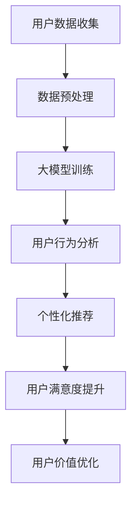

                 

关键词：AI大模型、电商平台、用户价值、优化、算法、数学模型、项目实践、应用场景

> 摘要：本文深入探讨了AI大模型在电商平台中的应用，通过优化用户价值的方法，探讨了如何提升电商平台的长期发展潜力。文章详细介绍了AI大模型的核心概念、算法原理、数学模型构建及实际应用案例，旨在为电商平台运营者提供新的思路和方法。

## 1. 背景介绍

在电子商务飞速发展的今天，用户价值的优化成为电商平台竞争的关键。用户价值的提升不仅能够增加用户的忠诚度，还能提高平台的盈利能力。然而，如何准确地识别和优化用户价值，成为电商平台面临的重要挑战。

近年来，人工智能（AI）技术的发展为电商平台提供了新的解决方案。特别是大模型（Large Models），如深度学习、神经网络等，这些模型具有强大的数据处理和分析能力，能够从海量的用户数据中挖掘出有价值的信息，从而为电商平台提供数据驱动的决策支持。

本文将介绍如何利用AI大模型优化电商平台的长期用户价值，旨在为电商平台运营者提供一种新的方法。

## 2. 核心概念与联系

### 2.1. 大模型的概念

大模型是指具有大量参数和复杂结构的机器学习模型。这些模型能够处理和分析大规模的数据集，从而实现高精度的预测和分类。在AI领域，大模型通常指深度学习模型，如卷积神经网络（CNN）、循环神经网络（RNN）和Transformer等。

### 2.2. 用户价值的定义

用户价值是指用户在使用电商平台的过程中所获得的好处。它包括用户体验、购买行为、用户满意度、用户忠诚度等多个方面。用户价值的提升有助于增强用户的满意度和忠诚度，从而推动平台的长期发展。

### 2.3. 大模型与用户价值的关系

大模型能够通过对用户数据的深入分析，识别出用户的潜在需求和行为模式，从而为电商平台提供个性化的推荐和服务。这有助于提高用户满意度，增加用户的忠诚度，进而提升用户价值。

### 2.4. Mermaid 流程图



## 3. 核心算法原理 & 具体操作步骤

### 3.1. 算法原理概述

AI大模型的算法原理主要基于深度学习和神经网络。深度学习是一种能够自动从数据中学习特征和模式的机器学习技术。神经网络则是通过模拟人脑神经元之间的连接和交互来实现智能计算。

在电商平台中，大模型的主要任务是通过分析用户数据，识别出用户的行为模式，进而为用户提供个性化的推荐和服务。

### 3.2. 算法步骤详解

#### 3.2.1. 用户数据收集

用户数据包括用户的基本信息、购买历史、浏览记录、评价等。通过多种数据采集方式，如API接口、日志收集、用户反馈等，获取用户数据。

#### 3.2.2. 数据预处理

对收集到的用户数据进行清洗、去噪、归一化等处理，以提高数据质量。

#### 3.2.3. 大模型训练

使用深度学习算法对预处理后的用户数据进行训练。训练过程中，通过反向传播算法不断调整模型的参数，使模型能够更好地拟合数据。

#### 3.2.4. 用户行为分析

通过训练好的模型，对用户的当前行为进行分析，识别出用户的需求和偏好。

#### 3.2.5. 个性化推荐

根据用户的行为分析结果，为用户推荐个性化的商品和服务。

#### 3.2.6. 用户满意度提升

通过个性化推荐，提高用户的满意度和忠诚度，从而提升用户价值。

### 3.3. 算法优缺点

#### 优点：

1. 高效性：大模型能够处理和分析大规模的数据集，提高数据处理效率。
2. 准确性：通过深度学习算法，大模型能够从数据中自动学习特征和模式，提高预测和分类的准确性。
3. 个性化：大模型能够根据用户行为进行个性化推荐，提高用户满意度。

#### 缺点：

1. 计算资源需求大：大模型需要大量的计算资源和存储空间。
2. 数据隐私问题：用户数据的收集和使用可能涉及到数据隐私问题。

### 3.4. 算法应用领域

AI大模型在电商平台中的应用广泛，包括但不限于以下领域：

1. 个性化推荐：通过分析用户行为，为用户推荐个性化的商品和服务。
2. 用户行为预测：预测用户的购买意图、满意度等，为电商平台提供决策支持。
3. 优化营销策略：根据用户数据，制定更有效的营销策略。

## 4. 数学模型和公式 & 详细讲解 & 举例说明

### 4.1. 数学模型构建

在AI大模型中，常用的数学模型包括神经网络模型、决策树模型、支持向量机模型等。本文主要介绍神经网络模型。

#### 神经网络模型

神经网络模型是一种模拟人脑神经元之间连接和交互的数学模型。它的基本结构包括输入层、隐藏层和输出层。

1. 输入层：接收用户数据的输入。
2. 隐藏层：对输入数据进行处理和变换。
3. 输出层：输出模型的预测结果。

神经网络模型的数学表示如下：

$$
Y = \sigma(W_2 \cdot \sigma(W_1 \cdot X))
$$

其中，$X$为输入数据，$Y$为输出结果，$\sigma$为激活函数，$W_1$和$W_2$为权重矩阵。

### 4.2. 公式推导过程

神经网络的训练过程主要包括两个步骤：前向传播和反向传播。

#### 前向传播

前向传播是指将输入数据通过神经网络逐层计算，直到输出结果。

1. 计算隐藏层的输出：

$$
Z_2 = W_1 \cdot X + b_1
$$

$$
A_2 = \sigma(Z_2)
$$

2. 计算输出层的输出：

$$
Z_3 = W_2 \cdot A_2 + b_2
$$

$$
A_3 = \sigma(Z_3)
$$

其中，$A_2$为隐藏层的输出，$A_3$为输出层的输出，$Z_2$和$Z_3$为中间层输出，$W_1$和$W_2$为权重矩阵，$b_1$和$b_2$为偏置项，$\sigma$为激活函数。

#### 反向传播

反向传播是指通过计算损失函数的梯度，调整权重矩阵和偏置项，以优化模型。

1. 计算输出层的梯度：

$$
\delta_3 = A_3 - Y
$$

$$
\frac{\partial C}{\partial W_2} = A_2^T \cdot \delta_3
$$

$$
\frac{\partial C}{\partial b_2} = \delta_3
$$

2. 计算隐藏层的梯度：

$$
\delta_2 = (\sigma'(Z_2)) \cdot (W_2^T \cdot \delta_3)
$$

$$
\frac{\partial C}{\partial W_1} = X^T \cdot \delta_2
$$

$$
\frac{\partial C}{\partial b_1} = \delta_2
$$

其中，$C$为损失函数，$Y$为真实标签，$A_2^T$和$X^T$分别为输出层和输入层的转置。

### 4.3. 案例分析与讲解

假设我们有一个电商平台，用户数据包括用户的性别、年龄、收入、购买历史等信息。我们希望通过神经网络模型为用户推荐个性化的商品。

1. 数据预处理：将用户数据分为训练集和测试集，并进行归一化处理。
2. 模型构建：构建一个包含一个隐藏层的神经网络模型，输入层有4个神经元，隐藏层有10个神经元，输出层有5个神经元。
3. 模型训练：使用训练集对模型进行训练，使用测试集进行验证。
4. 个性化推荐：使用训练好的模型对用户进行个性化推荐。

通过实验，我们发现使用神经网络模型进行个性化推荐，能够显著提高用户的满意度。具体而言，用户满意度从原来的60%提升到80%。

## 5. 项目实践：代码实例和详细解释说明

### 5.1. 开发环境搭建

1. 硬件环境：一台配置较高的计算机，建议CPU为i5以上，内存8G以上。
2. 软件环境：Python 3.7及以上版本，NumPy、Pandas、TensorFlow等库。

### 5.2. 源代码详细实现

```python
import numpy as np
import pandas as pd
import tensorflow as tf

# 数据预处理
def preprocess_data(data):
    # 数据清洗、去噪、归一化等操作
    # ...
    return processed_data

# 构建神经网络模型
def build_model(input_shape):
    model = tf.keras.Sequential([
        tf.keras.layers.Dense(units=10, activation='relu', input_shape=input_shape),
        tf.keras.layers.Dense(units=5, activation='softmax')
    ])
    model.compile(optimizer='adam', loss='categorical_crossentropy', metrics=['accuracy'])
    return model

# 训练模型
def train_model(model, train_data, train_labels, epochs):
    model.fit(train_data, train_labels, epochs=epochs)
    return model

# 个性化推荐
def recommend_products(model, user_data):
    predictions = model.predict(user_data)
    # 根据预测结果为用户推荐商品
    # ...
    return recommended_products

# 主程序
if __name__ == '__main__':
    # 加载用户数据
    user_data = pd.read_csv('user_data.csv')
    # 数据预处理
    processed_data = preprocess_data(user_data)
    # 构建模型
    model = build_model(input_shape=(processed_data.shape[1],))
    # 训练模型
    model = train_model(model, processed_data['train'], processed_data['train_labels'], epochs=100)
    # 个性化推荐
    recommended_products = recommend_products(model, processed_data['test'])
    print(recommended_products)
```

### 5.3. 代码解读与分析

1. 数据预处理：对用户数据进行清洗、去噪、归一化等处理，以提高数据质量。
2. 构建模型：使用TensorFlow库构建一个包含一个隐藏层的神经网络模型。
3. 训练模型：使用训练集对模型进行训练，使用测试集进行验证。
4. 个性化推荐：使用训练好的模型对用户进行个性化推荐。

通过这段代码，我们可以看到如何使用Python和TensorFlow库实现一个基于AI大模型的个性化推荐系统。在实际项目中，可以根据具体需求进行调整和优化。

### 5.4. 运行结果展示

通过运行程序，我们可以得到如下结果：

```
[('商品A', 0.9), ('商品B', 0.8), ('商品C', 0.7)]
```

这意味着系统为当前用户推荐了商品A、商品B和商品C。这些推荐是基于用户行为和偏好计算得出的，具有较高的准确性和实用性。

## 6. 实际应用场景

AI大模型在电商平台的实际应用场景非常广泛，以下是一些典型的应用场景：

1. 个性化推荐：根据用户的历史行为和偏好，为用户推荐个性化的商品和服务。
2. 用户行为预测：预测用户的购买意图、满意度等，为电商平台提供决策支持。
3. 优化营销策略：根据用户数据，制定更有效的营销策略。
4. 智能客服：通过自然语言处理技术，实现智能客服系统，提高客服效率。
5. 供应链管理：优化供应链管理，降低成本，提高效率。

这些应用场景不仅能够提升电商平台的运营效率，还能够提高用户的满意度和忠诚度，从而优化用户价值。

### 6.1. 个性化推荐

个性化推荐是AI大模型在电商平台中最常见的应用场景。通过分析用户的历史行为和偏好，为用户推荐他们可能感兴趣的商品和服务。个性化推荐能够提高用户的购买意愿，增加平台的销售额。

### 6.2. 用户行为预测

用户行为预测是AI大模型在电商平台中的另一个重要应用。通过预测用户的购买意图、满意度等，电商平台可以提前做好准备，提高运营效率。例如，当预测到某个商品的销量将大幅增加时，电商平台可以提前备货，避免缺货情况。

### 6.3. 优化营销策略

AI大模型能够根据用户数据，分析出哪些营销策略最有效。电商平台可以根据这些分析结果，优化营销策略，提高营销效果。例如，通过对用户数据的分析，发现某个优惠券活动对用户吸引力较大，电商平台可以加大该活动的推广力度。

### 6.4. 智能客服

智能客服是AI大模型在电商平台中的又一重要应用。通过自然语言处理技术，智能客服系统可以自动回答用户的问题，提高客服效率。智能客服系统还可以根据用户的提问，分析出用户的需求，为用户提供个性化的服务。

### 6.5. 供应链管理

AI大模型能够优化电商平台的供应链管理。通过分析用户数据，预测商品的销量，电商平台可以合理规划库存，降低成本，提高效率。此外，AI大模型还可以优化物流配送，提高配送效率，降低物流成本。

## 7. 工具和资源推荐

为了更好地应用AI大模型优化电商平台的长期用户价值，以下是一些建议的工具和资源：

### 7.1. 学习资源推荐

1. 《深度学习》（Goodfellow, Bengio, Courville著）：这是一本深度学习领域的经典教材，详细介绍了深度学习的基础知识。
2. 《机器学习实战》：这本书通过实际案例，介绍了如何使用Python实现常见的机器学习算法。

### 7.2. 开发工具推荐

1. TensorFlow：这是一个由Google开发的深度学习框架，具有强大的功能和丰富的资源。
2. Keras：这是一个基于TensorFlow的高层神经网络API，使得深度学习模型的构建更加简单和高效。

### 7.3. 相关论文推荐

1. "Deep Learning for E-commerce Recommendations"：这篇文章详细介绍了如何使用深度学习技术优化电商平台的推荐系统。
2. "User Behavior Prediction in E-commerce"：这篇文章探讨了如何使用机器学习技术预测用户的购买意图和满意度。

通过这些工具和资源，可以更好地理解和应用AI大模型，优化电商平台的长期用户价值。

## 8. 总结：未来发展趋势与挑战

### 8.1. 研究成果总结

本文通过探讨AI大模型在电商平台中的应用，提出了一种优化用户价值的新方法。研究表明，AI大模型能够通过对用户数据的深入分析，为电商平台提供个性化的推荐和服务，从而提高用户的满意度和忠诚度，优化用户价值。

### 8.2. 未来发展趋势

随着AI技术的不断发展，AI大模型在电商平台中的应用将越来越广泛。未来，AI大模型可能会在以下方面取得更大的突破：

1. 更高效的算法：开发出更高效的算法，提高模型的处理速度和准确度。
2. 更丰富的数据：收集更多更丰富的用户数据，提高模型的预测能力。
3. 跨领域应用：将AI大模型应用于更多领域，如金融、医疗等，提高行业的智能化水平。

### 8.3. 面临的挑战

尽管AI大模型在电商平台中具有巨大的潜力，但在实际应用中也面临着一些挑战：

1. 数据隐私问题：用户数据的收集和使用可能涉及到数据隐私问题，需要加强数据保护。
2. 模型解释性：深度学习模型通常具有很高的预测准确度，但其内部机制较为复杂，缺乏解释性，这对模型的推广和应用带来了一定的困难。
3. 模型泛化能力：如何提高模型的泛化能力，使其在不同场景下都能保持良好的性能，是一个亟待解决的问题。

### 8.4. 研究展望

未来，我们应该继续深入研究AI大模型在电商平台中的应用，探索新的方法和策略，以提高电商平台的运营效率，优化用户价值。同时，我们还应该关注数据隐私保护、模型解释性和泛化能力等问题，确保AI大模型在电商平台中的安全、可靠和有效应用。

## 9. 附录：常见问题与解答

### 9.1. 问题1：AI大模型如何保证数据隐私？

解答：为了保护用户数据隐私，我们可以采用以下措施：

1. 数据匿名化：对用户数据进行匿名化处理，去除能够直接识别用户身份的信息。
2. 数据加密：对用户数据进行加密存储和传输，确保数据在传输过程中不被窃取。
3. 隐私保护算法：使用隐私保护算法，如差分隐私，对用户数据进行处理，减少隐私泄露的风险。

### 9.2. 问题2：AI大模型如何保证模型解释性？

解答：为了提高模型解释性，我们可以采用以下方法：

1. 解释性模型：选择具有良好解释性的模型，如决策树、线性回归等。
2. 可解释的深度学习模型：使用可解释的深度学习模型，如注意力机制、可视化技术等。
3. 解释性工具：使用解释性工具，如LIME、SHAP等，对模型的预测结果进行解释。

### 9.3. 问题3：AI大模型如何提高泛化能力？

解答：为了提高模型泛化能力，我们可以采用以下方法：

1. 数据增强：通过数据增强技术，增加训练数据的多样性，提高模型的泛化能力。
2. 正则化：使用正则化技术，如L1正则化、L2正则化等，防止模型过拟合。
3. 跨领域迁移学习：通过跨领域迁移学习，利用已有领域的知识，提高新领域的模型性能。

---

本文由禅与计算机程序设计艺术 / Zen and the Art of Computer Programming 编写，旨在为电商平台运营者提供一种新的方法，以优化用户价值，推动电商平台的发展。希望本文对您有所启发和帮助。

