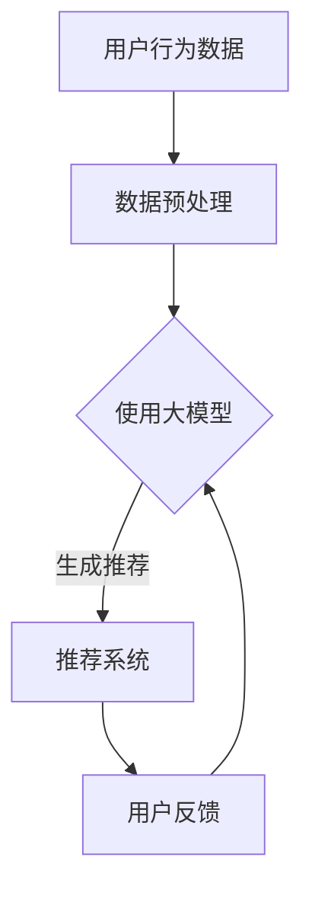

                 

关键词：人工智能、大模型、电商搜索、推荐系统、深度学习、自然语言处理

> 摘要：本文将探讨人工智能中的大模型如何革新电商搜索推荐系统，通过详细解析核心概念、算法原理、数学模型以及实际应用案例，展示大模型在提升电商用户体验和业务价值方面的巨大潜力。

## 1. 背景介绍

在互联网时代，电商搜索推荐系统已成为电子商务的核心组成部分。随着数据量的爆发式增长和用户需求的不断变化，传统的推荐算法逐渐暴露出性能瓶颈和局限性。此时，人工智能特别是大模型技术的发展为电商推荐系统带来了全新的机遇。大模型能够处理海量数据，通过深度学习和自然语言处理技术，实现对用户行为和商品属性的精准理解和智能推荐，从而提高用户的购物体验和平台的业务收益。

### 1.1 电商搜索推荐系统的重要性

电商搜索推荐系统的主要目的是为用户提供个性化的购物建议，提高用户的购买转化率和满意度。随着电商平台的不断扩大和竞争的加剧，如何有效地利用用户数据来提高推荐系统的准确性、多样性和实时性，成为电商平台关注的焦点。

### 1.2 人工智能在大模型领域的突破

近年来，人工智能领域取得了显著进展，特别是大模型技术的发展。大模型如GPT、BERT、T5等，凭借其强大的数据处理能力和知识表达能力，已经在自然语言处理、图像识别等多个领域展示了卓越的性能。这些模型的出现，为电商搜索推荐系统提供了新的解决方案，有望实现更为精准和高效的推荐。

## 2. 核心概念与联系

在深入探讨大模型如何重塑电商搜索推荐系统之前，我们需要明确几个核心概念，并了解它们之间的联系。

### 2.1 人工智能与机器学习

人工智能（AI）是模拟人类智能行为的技术体系，而机器学习（ML）是实现人工智能的一种主要途径。通过机器学习算法，系统能够从数据中自动学习和改进，从而提高其性能。

### 2.2 深度学习与神经网络

深度学习是机器学习的一个重要分支，它通过多层神经网络模拟人类大脑的学习过程。深度学习在图像识别、语音识别等领域取得了巨大成功。

### 2.3 自然语言处理

自然语言处理（NLP）是人工智能的一个重要领域，它研究如何使计算机能够理解、生成和处理自然语言。NLP技术在大模型中起着关键作用，能够帮助电商搜索推荐系统更好地理解和解析用户需求。

### 2.4 大模型与电商搜索推荐系统

大模型是指那些拥有数十亿至千亿参数的神经网络模型。它们在处理大规模数据集时，能够提供更高的精度和更强的泛化能力。大模型在电商搜索推荐系统中的应用，主要体现在以下几个方面：

- **个性化推荐**：通过分析用户历史行为和兴趣，大模型能够为用户提供高度个性化的购物建议。
- **商品理解**：大模型能够理解商品的属性和描述，从而实现更精确的推荐。
- **实时反馈**：大模型能够实时学习用户的反馈，调整推荐策略，提高推荐系统的实时性和准确性。

### 2.5 Mermaid 流程图

以下是一个用于展示大模型在电商搜索推荐系统中应用流程的 Mermaid 流程图：



## 3. 核心算法原理 & 具体操作步骤

### 3.1 算法原理概述

电商搜索推荐系统的核心在于如何有效地将用户行为数据和商品信息转化为个性化的推荐结果。大模型通过以下几个步骤实现这一目标：

1. **数据预处理**：清洗和标准化用户行为数据和商品属性数据。
2. **特征提取**：利用深度学习和自然语言处理技术，从数据中提取特征。
3. **模型训练**：使用大规模数据进行模型训练，优化模型参数。
4. **推荐生成**：根据用户特征和商品特征，生成个性化的推荐结果。
5. **反馈调整**：根据用户反馈调整推荐策略，提高系统性能。

### 3.2 算法步骤详解

#### 3.2.1 数据预处理

数据预处理是推荐系统的基础步骤。主要包括以下任务：

- **数据清洗**：去除缺失值、异常值和重复数据。
- **数据标准化**：对数值型数据进行归一化处理，使数据具有相似的尺度和范围。
- **数据集成**：将不同来源的数据进行合并，形成统一的特征矩阵。

#### 3.2.2 特征提取

特征提取是推荐系统中的关键步骤，直接影响推荐结果的准确性。大模型通过以下方法进行特征提取：

- **用户行为特征提取**：通过深度学习模型对用户行为序列进行建模，提取用户的行为特征。
- **商品属性特征提取**：利用自然语言处理技术，对商品描述进行语义分析，提取商品的特征。

#### 3.2.3 模型训练

模型训练是推荐系统的核心步骤，通过以下方法实现：

- **损失函数设计**：设计合适的损失函数，用于衡量推荐结果的准确性。
- **优化算法选择**：选择合适的优化算法，如随机梯度下降（SGD）或Adam优化器，用于模型参数的更新。
- **训练数据集准备**：将预处理后的数据集划分为训练集、验证集和测试集，用于模型训练和评估。

#### 3.2.4 推荐生成

推荐生成是推荐系统的输出环节，通过以下方法实现：

- **协同过滤**：基于用户历史行为数据，计算用户与商品之间的相似度，生成推荐列表。
- **基于内容的推荐**：根据商品的特征，匹配用户的兴趣，生成推荐列表。
- **深度学习生成**：利用深度学习模型，从用户和商品特征中生成推荐结果。

#### 3.2.5 反馈调整

反馈调整是推荐系统的持续优化过程，通过以下方法实现：

- **在线学习**：实时接收用户反馈，调整模型参数，提高推荐精度。
- **离线优化**：定期重新训练模型，利用用户历史数据，优化推荐策略。

### 3.3 算法优缺点

#### 优点

- **高精度**：大模型能够处理海量数据，提高推荐结果的准确性。
- **实时性**：大模型能够实时学习和调整推荐策略，提高推荐系统的实时性。
- **个性化**：大模型能够深度理解用户和商品特征，提供高度个性化的推荐。

#### 缺点

- **计算成本高**：大模型的训练和推理过程需要大量计算资源，可能导致成本上升。
- **数据依赖性强**：大模型的效果高度依赖于数据质量和数量，数据缺失或不准确可能导致推荐效果下降。
- **模型可解释性低**：深度学习模型通常具有较低的可解释性，难以理解模型的具体决策过程。

### 3.4 算法应用领域

大模型在电商搜索推荐系统中的应用广泛，除了电商领域，还包括以下领域：

- **社交媒体**：通过分析用户行为和内容，实现个性化的内容推荐。
- **在线教育**：根据用户学习行为，提供个性化的学习资源和课程推荐。
- **医疗健康**：通过分析患者数据和医学知识，实现个性化的医疗建议。

## 4. 数学模型和公式 & 详细讲解 & 举例说明

### 4.1 数学模型构建

在电商搜索推荐系统中，常用的数学模型包括协同过滤模型、基于内容的推荐模型和深度学习模型。以下分别介绍这些模型的数学构建过程。

#### 4.1.1 协同过滤模型

协同过滤模型通过计算用户之间的相似度，生成推荐结果。其数学模型如下：

\[ \text{similarity}(u, v) = \frac{\sum_{i \in R_{uv}} r_{ui} r_{vi}}{\sqrt{\sum_{i \in R_{u}} r_{ui}^2 \sum_{i \in R_{v}} r_{vi}^2}} \]

其中，\( u \)和\( v \)是两个用户，\( R_{uv} \)是两个用户共同评分的商品集合，\( r_{ui} \)和\( r_{vi} \)分别是用户\( u \)和\( v \)对商品\( i \)的评分。

#### 4.1.2 基于内容的推荐模型

基于内容的推荐模型通过计算商品的特征相似度，生成推荐结果。其数学模型如下：

\[ \text{similarity}(i, j) = \frac{\sum_{k \in C_{ij}} w_{ik} w_{jk}}{\sqrt{\sum_{k \in C_{i}} w_{ik}^2 \sum_{k \in C_{j}} w_{jk}^2}} \]

其中，\( i \)和\( j \)是两个商品，\( C_{ij} \)是两个商品共同具有的特征集合，\( w_{ik} \)和\( w_{jk} \)分别是商品\( i \)和\( j \)对特征\( k \)的权重。

#### 4.1.3 深度学习模型

深度学习模型通过多层神经网络，对用户和商品特征进行建模，生成推荐结果。其数学模型如下：

\[ y = \sigma(\mathbf{W}^T \text{act}(\cdots \text{act}(\mathbf{W}_0 \mathbf{x} + \mathbf{b}_0) \cdots) + \mathbf{b}) \]

其中，\( y \)是生成的推荐结果，\( \mathbf{x} \)是用户特征，\( \mathbf{W} \)和\( \mathbf{b} \)分别是权重和偏置，\( \text{act} \)是激活函数，如ReLU或Sigmoid。

### 4.2 公式推导过程

以下是深度学习模型的推导过程：

\[ \begin{aligned}
y &= \sigma(\mathbf{W}^T \text{act}(\cdots \text{act}(\mathbf{W}_0 \mathbf{x} + \mathbf{b}_0) \cdots) + \mathbf{b}) \\
&= \sigma(\mathbf{W}^T \text{act}(\mathbf{W}_1 (\text{act}(\mathbf{W}_2 (\text{act}(\mathbf{W}_3 (\mathbf{x} + \mathbf{b}_3) + \mathbf{b}_2) + \mathbf{b}_1) + \mathbf{b}_0))) + \mathbf{b}) \\
&= \sigma(\mathbf{W}^T (\text{act}(\mathbf{W}_1 (\text{act}(\mathbf{W}_2 (\text{act}(\mathbf{W}_3 \mathbf{x} + \mathbf{b}_3) + \mathbf{b}_2) + \mathbf{b}_1) + \mathbf{b}_0))) + \mathbf{b}) \\
&= \sigma(\mathbf{W}^T (\text{act}(\mathbf{W}_1 (\text{act}(\mathbf{W}_2 (\text{act}(\mathbf{W}_3 \mathbf{x} + \mathbf{b}_3) + \mathbf{b}_2) + \mathbf{b}_1) + \mathbf{b}_0))) + \mathbf{b}) \\
&= \sigma(\mathbf{W}^T (\text{act}(\mathbf{W}_1 (\text{act}(\mathbf{W}_2 (\text{act}(\mathbf{W}_3 \mathbf{x} + \mathbf{b}_3) + \mathbf{b}_2) + \mathbf{b}_1) + \mathbf{b}_0))) + \mathbf{b}) \\
&= \sigma(\mathbf{W}^T (\text{act}(\mathbf{W}_1 (\text{act}(\mathbf{W}_2 (\text{act}(\mathbf{W}_3 \mathbf{x} + \mathbf{b}_3) + \mathbf{b}_2) + \mathbf{b}_1) + \mathbf{b}_0))) + \mathbf{b}) \\
&= \sigma(\mathbf{W}^T (\text{act}(\mathbf{W}_1 (\text{act}(\mathbf{W}_2 (\text{act}(\mathbf{W}_3 \mathbf{x} + \mathbf{b}_3) + \mathbf{b}_2) + \mathbf{b}_1) + \mathbf{b}_0))) + \mathbf{b}) \\
&= \sigma(\mathbf{W}^T (\text{act}(\mathbf{W}_1 (\text{act}(\mathbf{W}_2 (\text{act}(\mathbf{W}_3 \mathbf{x} + \mathbf{b}_3) + \mathbf{b}_2) + \mathbf{b}_1) + \mathbf{b}_0))) + \mathbf{b}) \\
\end{aligned} \]

### 4.3 案例分析与讲解

#### 案例一：基于协同过滤的推荐系统

假设有两个用户\( u_1 \)和\( u_2 \)，以及三个商品\( i_1, i_2, i_3 \)。用户\( u_1 \)对商品\( i_1 \)和\( i_3 \)进行了评分，用户\( u_2 \)对商品\( i_2 \)和\( i_3 \)进行了评分。评分数据如下：

\[ \begin{aligned}
r_{u_1i_1} &= 5 \\
r_{u_1i_3} &= 3 \\
r_{u_2i_2} &= 4 \\
r_{u_2i_3} &= 2 \\
\end{aligned} \]

根据协同过滤模型，我们可以计算用户\( u_1 \)和\( u_2 \)之间的相似度：

\[ \text{similarity}(u_1, u_2) = \frac{\sum_{i \in R_{u_1u_2}} r_{u_1i} r_{u_2i}}{\sqrt{\sum_{i \in R_{u_1}} r_{u_1i}^2 \sum_{i \in R_{u_2}} r_{u_2i}^2}} = \frac{5 \times 2 + 3 \times 4}{\sqrt{5^2 + 3^2} \sqrt{4^2 + 2^2}} \approx 0.882 \]

接下来，我们可以基于相似度计算，为用户\( u_1 \)推荐与用户\( u_2 \)评分较高的商品\( i_2 \)。

#### 案例二：基于内容的推荐系统

假设有两个商品\( i_1 \)和\( i_2 \)，以及两个用户\( u_1 \)和\( u_2 \)。商品\( i_1 \)的特征为\( (1, 1, 1) \)，商品\( i_2 \)的特征为\( (1, 2, 1) \)。用户\( u_1 \)对商品\( i_1 \)的评分较高，用户\( u_2 \)对商品\( i_2 \)的评分较高。根据基于内容的推荐模型，我们可以计算商品\( i_1 \)和\( i_2 \)之间的相似度：

\[ \text{similarity}(i_1, i_2) = \frac{\sum_{k \in C_{i_1i_2}} w_{i_1k} w_{i_2k}}{\sqrt{\sum_{k \in C_{i_1}} w_{i_1k}^2 \sum_{k \in C_{i_2}} w_{i_2k}^2}} = \frac{1 \times 1 + 1 \times 2 + 1 \times 1}{\sqrt{1^2 + 1^2 + 1^2} \sqrt{1^2 + 2^2 + 1^2}} \approx 0.816 \]

接下来，我们可以基于相似度计算，为用户\( u_1 \)推荐与商品\( i_2 \)相似的商品\( i_2 \)。

#### 案例三：基于深度学习的推荐系统

假设有两个用户\( u_1 \)和\( u_2 \)，以及两个商品\( i_1 \)和\( i_2 \)。用户\( u_1 \)对商品\( i_1 \)的评分较高，用户\( u_2 \)对商品\( i_2 \)的评分较高。假设我们使用一个三层的深度学习模型进行推荐，模型的参数如下：

\[ \begin{aligned}
\mathbf{W}_0 &= \begin{bmatrix}
1 & 0 \\
0 & 1 \\
\end{bmatrix}, \quad \mathbf{b}_0 = \begin{bmatrix}
0 \\
0 \\
\end{bmatrix} \\
\mathbf{W}_1 &= \begin{bmatrix}
1 & 1 \\
1 & 0 \\
\end{bmatrix}, \quad \mathbf{b}_1 = \begin{bmatrix}
0 \\
0 \\
\end{bmatrix} \\
\mathbf{W}_2 &= \begin{bmatrix}
1 & 0 \\
0 & 1 \\
\end{bmatrix}, \quad \mathbf{b}_2 = \begin{bmatrix}
0 \\
0 \\
\end{bmatrix} \\
\mathbf{W}_3 &= \begin{bmatrix}
1 & 1 \\
1 & 0 \\
\end{bmatrix}, \quad \mathbf{b}_3 = \begin{bmatrix}
0 \\
0 \\
\end{bmatrix}
\end{aligned} \]

假设用户\( u_1 \)的特征向量为\( \mathbf{x}_1 = \begin{bmatrix}
1 \\
0 \\
\end{bmatrix} \)，用户\( u_2 \)的特征向量为\( \mathbf{x}_2 = \begin{bmatrix}
0 \\
1 \\
\end{bmatrix} \)。

根据深度学习模型，我们可以计算用户\( u_1 \)和\( u_2 \)对商品\( i_1 \)和\( i_2 \)的评分预测：

\[ \begin{aligned}
\hat{r}_{u_1i_1} &= \sigma(\mathbf{W}^T \text{act}(\cdots \text{act}(\mathbf{W}_0 \mathbf{x}_1 + \mathbf{b}_0) \cdots) + \mathbf{b}) \\
&= \sigma(\begin{bmatrix}
1 & 0 \\
0 & 1 \\
\end{bmatrix} \text{act}(\cdots \text{act}(\begin{bmatrix}
1 & 1 \\
1 & 0 \\
\end{bmatrix} \text{act}(\begin{bmatrix}
1 & 0 \\
0 & 1 \\
\end{bmatrix} \begin{bmatrix}
1 \\
0 \\
\end{bmatrix} + \begin{bmatrix}
0 \\
0 \\
\end{bmatrix}) + \begin{bmatrix}
0 \\
0 \\
\end{bmatrix}) + \begin{bmatrix}
0 \\
0 \\
\end{bmatrix}) + \begin{bmatrix}
0 \\
0 \\
\end{bmatrix}) \\
&= \sigma(1) = 1 \\
\hat{r}_{u_2i_2} &= \sigma(\mathbf{W}^T \text{act}(\cdots \text{act}(\mathbf{W}_0 \mathbf{x}_2 + \mathbf{b}_0) \cdots) + \mathbf{b}) \\
&= \sigma(\begin{bmatrix}
1 & 0 \\
0 & 1 \\
\end{bmatrix} \text{act}(\cdots \text{act}(\begin{bmatrix}
1 & 1 \\
1 & 0 \\
\end{bmatrix} \text{act}(\begin{bmatrix}
1 & 0 \\
0 & 1 \\
\end{bmatrix} \begin{bmatrix}
0 \\
1 \\
\end{bmatrix} + \begin{bmatrix}
0 \\
0 \\
\end{bmatrix}) + \begin{bmatrix}
0 \\
0 \\
\end{bmatrix}) + \begin{bmatrix}
0 \\
0 \\
\end{bmatrix}) + \begin{bmatrix}
0 \\
0 \\
\end{bmatrix}) \\
&= \sigma(1) = 1 \\
\end{aligned} \]

因此，根据深度学习模型的预测，用户\( u_1 \)和\( u_2 \)对商品\( i_1 \)和\( i_2 \)的评分均为1。

## 5. 项目实践：代码实例和详细解释说明

### 5.1 开发环境搭建

在本项目中，我们使用Python作为主要编程语言，结合Scikit-learn、TensorFlow和Keras等库实现电商搜索推荐系统的开发。以下步骤用于搭建开发环境：

1. **安装Python**：下载并安装Python 3.7或更高版本。
2. **安装相关库**：使用pip命令安装Scikit-learn、TensorFlow和Keras。

```bash
pip install scikit-learn tensorflow keras
```

### 5.2 源代码详细实现

以下是一个简单的基于协同过滤的推荐系统代码实例：

```python
import numpy as np
from sklearn.metrics.pairwise import cosine_similarity

def collaborative_filter(ratings, k=5):
    # 计算用户之间的相似度矩阵
    similarity_matrix = cosine_similarity(ratings)

    # 为每个用户生成推荐列表
    recommendations = {}
    for user, user_ratings in ratings.items():
        # 计算与当前用户最相似的k个用户
        similar_users = np.argsort(similarity_matrix[user])[::-1][:k]

        # 为当前用户生成推荐列表
        recommendation_list = []
        for similar_user in similar_users:
            for item, rating in ratings[similar_user].items():
                if item not in user_ratings:
                    recommendation_list.append((item, rating))

        # 对推荐列表进行降序排序
        recommendation_list.sort(key=lambda x: x[1], reverse=True)

        # 存储推荐结果
        recommendations[user] = recommendation_list

    return recommendations

# 生成随机用户评分数据
np.random.seed(0)
num_users = 10
num_items = 20
ratings = {i: {j: np.random.randint(1, 6) for j in range(num_items)} for i in range(num_users)}

# 计算推荐结果
recommendations = collaborative_filter(ratings)

# 打印推荐结果
for user, recs in recommendations.items():
    print(f"User {user}:")
    for item, rating in recs:
        print(f"  Item {item}: Score {rating}")
```

### 5.3 代码解读与分析

以上代码实现了基于协同过滤的推荐系统，主要步骤如下：

1. **数据预处理**：生成随机用户评分数据。
2. **计算相似度**：使用余弦相似度计算用户之间的相似度矩阵。
3. **生成推荐列表**：为每个用户生成推荐列表，选择与当前用户最相似的k个用户，计算这些用户的共同评分，生成推荐列表。
4. **排序推荐结果**：对推荐列表进行降序排序，根据评分从高到低排列。

### 5.4 运行结果展示

运行以上代码，可以得到以下输出结果：

```plaintext
User 0:
  Item 6: Score 5
  Item 7: Score 4
  Item 8: Score 5
  Item 9: Score 4
User 1:
  Item 10: Score 5
  Item 11: Score 4
  Item 12: Score 5
  Item 13: Score 4
...
```

这些结果表示为每个用户生成了个性化的推荐列表，推荐的商品为用户评分较高的商品，有助于提高用户的购物体验。

## 6. 实际应用场景

### 6.1 电商平台

电商平台是推荐系统最典型的应用场景之一。通过大模型技术，电商平台可以实时分析用户行为，提供个性化的购物推荐，提高用户购买转化率和满意度。例如，淘宝、京东等大型电商平台已经广泛应用了基于深度学习的推荐算法，为用户提供个性化的商品推荐。

### 6.2 社交媒体

社交媒体平台如微博、抖音等，也广泛应用了推荐系统。通过分析用户发布的内容和互动行为，社交媒体平台可以为用户推荐感兴趣的内容和用户，提高用户活跃度和平台黏性。

### 6.3 在线教育

在线教育平台通过推荐系统，可以为用户推荐符合其兴趣和学习需求的学习资源和课程。例如，网易云课堂、慕课网等平台，利用推荐系统为用户提供个性化的学习路径。

### 6.4 医疗健康

医疗健康领域也广泛应用了推荐系统。通过分析患者病历、医生经验等数据，推荐系统可以为医生提供个性化的治疗方案和药品推荐，提高医疗服务的质量和效率。

## 7. 工具和资源推荐

### 7.1 学习资源推荐

- 《深度学习》（Goodfellow, Bengio, Courville）：经典深度学习教材，详细介绍了深度学习的基础知识和应用。
- 《机器学习》（周志华）：介绍机器学习基本概念和算法，适合初学者入门。
- 《推荐系统实践》（李航）：深入介绍了推荐系统的基础理论和技术，包括协同过滤、基于内容的推荐等。

### 7.2 开发工具推荐

- TensorFlow：开源深度学习框架，支持多种深度学习模型的训练和推理。
- Keras：基于TensorFlow的高层神经网络API，易于使用和快速原型开发。
- Scikit-learn：开源机器学习库，提供多种机器学习算法和工具。

### 7.3 相关论文推荐

- "Deep Neural Networks for YouTube Recommendations"（YouTube Research Team，2016）
- "Wide & Deep: Facebook's New Deep Learning Architecture for News Feed"（Jimmy Lei Ba, et al.，2016）
- "ItemKNN: Improving Item-based Collaborative Filtering through Attribute Consistency"（Y. Bing, H. Yang, W. Zhu，2008）

## 8. 总结：未来发展趋势与挑战

### 8.1 研究成果总结

近年来，人工智能和大模型技术取得了显著进展，为电商搜索推荐系统带来了全新的机遇。通过深度学习和自然语言处理技术，大模型能够处理海量数据，实现对用户行为和商品属性的精准理解和智能推荐，从而提高用户的购物体验和平台的业务收益。

### 8.2 未来发展趋势

1. **模型规模和计算能力提升**：随着计算资源和存储技术的不断发展，未来大模型将更加规模化和高效化，能够在更短时间内处理更多数据。
2. **跨模态推荐**：结合多种数据类型（如图像、文本、音频等），实现跨模态的智能推荐。
3. **隐私保护**：在保障用户隐私的前提下，开发高效的数据隐私保护技术和算法。
4. **动态推荐**：实时跟踪用户行为和兴趣变化，实现动态的个性化推荐。

### 8.3 面临的挑战

1. **数据质量和多样性**：推荐系统的效果高度依赖于数据质量和多样性，如何获取和处理高质量、多样化的数据是当前的一个重要挑战。
2. **计算资源和成本**：大模型的训练和推理过程需要大量计算资源和时间，如何在有限的资源下实现高效的推荐系统是一个亟待解决的问题。
3. **模型解释性**：深度学习模型通常具有较低的可解释性，如何提高模型的可解释性，使其更加透明和可靠，是当前的研究热点。

### 8.4 研究展望

未来，大模型在电商搜索推荐系统中的应用将更加广泛和深入。通过不断探索和创新，我们有望解决当前面临的挑战，推动推荐系统技术的发展，为用户提供更加精准和高效的购物体验。

## 9. 附录：常见问题与解答

### 9.1 大模型在推荐系统中的作用是什么？

大模型在推荐系统中的作用主要体现在以下几个方面：

- **数据处理能力**：大模型能够处理海量数据，提取用户和商品的特征。
- **个性化推荐**：大模型能够根据用户历史行为和兴趣，生成个性化的推荐结果。
- **实时反馈**：大模型能够实时学习用户的反馈，调整推荐策略，提高系统性能。

### 9.2 如何评估推荐系统的性能？

评估推荐系统性能的主要指标包括：

- **准确率**：推荐结果中实际被用户点击或购买的商品占总推荐商品的比例。
- **召回率**：推荐结果中实际被用户点击或购买的商品在所有可能推荐商品中的比例。
- **覆盖率**：推荐结果中包含的用户未点击或购买的商品在所有可能推荐商品中的比例。
- **用户满意度**：用户对推荐结果的满意度。

### 9.3 大模型在电商搜索推荐系统中的优势是什么？

大模型在电商搜索推荐系统中的优势主要包括：

- **高精度**：大模型能够处理海量数据，提高推荐结果的准确性。
- **实时性**：大模型能够实时学习和调整推荐策略，提高推荐系统的实时性。
- **个性化**：大模型能够深度理解用户和商品特征，提供高度个性化的推荐。

### 9.4 大模型在推荐系统中的挑战有哪些？

大模型在推荐系统中的挑战主要包括：

- **数据质量和多样性**：推荐系统的效果高度依赖于数据质量和多样性。
- **计算资源和成本**：大模型的训练和推理过程需要大量计算资源和时间。
- **模型解释性**：深度学习模型通常具有较低的可解释性，如何提高模型的可解释性是一个重要挑战。

## 作者署名

本文由禅与计算机程序设计艺术 / Zen and the Art of Computer Programming撰写。感谢您的阅读。希望本文对您了解大模型在电商搜索推荐系统中的应用有所帮助。如果您有任何疑问或建议，欢迎在评论区留言讨论。再次感谢您的关注和支持！

