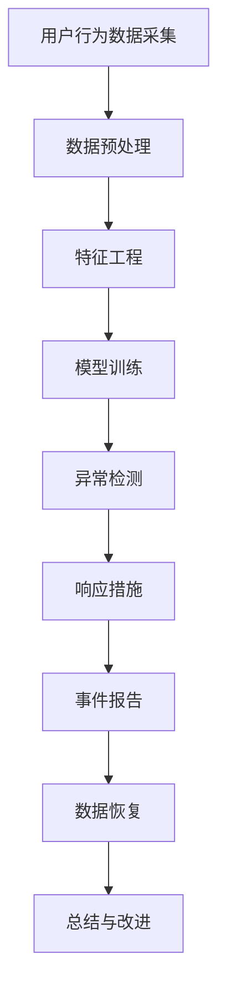

                 

在当今数字化时代，用户数据已经成为电商企业的核心资产。然而，随着网络攻击手段的日益复杂，用户数据安全事件（如数据泄露、黑客入侵等）给企业带来的风险与日俱增。本文将探讨人工智能（AI）在电商企业用户数据安全事件响应中的应用，包括核心概念、算法原理、数学模型、项目实践以及未来展望等多个方面。

## 1. 背景介绍

用户数据安全事件对电商企业的影响不容忽视。首先，数据泄露可能导致用户隐私泄露，进而引发用户信任危机。其次，黑客攻击可能导致企业经济损失，甚至破产。因此，如何快速有效地响应用户数据安全事件，成为电商企业亟需解决的问题。

AI技术在数据处理、分析和决策支持方面具有显著优势，可以为电商企业用户数据安全事件响应提供强有力的支持。例如，通过机器学习算法，AI可以自动识别和分类异常行为，实时监测数据安全风险；通过自然语言处理技术，AI可以自动分析日志和报告，提取关键信息，辅助安全专家做出决策。

## 2. 核心概念与联系

### 2.1 数据安全事件

数据安全事件是指未经授权的访问、篡改、破坏、泄露或销毁用户数据的行为。常见的数据安全事件包括数据泄露、黑客入侵、恶意软件攻击等。

### 2.2 用户行为分析

用户行为分析是指通过分析用户在平台上的行为数据，了解用户的需求、兴趣和偏好，以便提供个性化的服务和推荐。用户行为分析对于提升用户体验、增加用户粘性和转化率具有重要意义。

### 2.3 异常检测

异常检测是指通过识别和分析数据中的异常行为或异常模式，发现潜在的安全风险。异常检测在数据安全事件响应中起着关键作用，可以提前预警，降低风险。

## 2.4 Mermaid 流程图

以下是一个简单的 Mermaid 流程图，展示了数据安全事件响应的基本流程：



## 3. 核心算法原理 & 具体操作步骤

### 3.1 算法原理概述

在用户数据安全事件响应中，AI算法主要应用于异常检测、攻击识别、威胁预测等方面。以下是一些常见的核心算法原理：

- **聚类算法**：用于发现用户行为数据中的异常点，如K-means、DBSCAN等。
- **分类算法**：用于判断行为数据是否属于正常或异常类别，如决策树、支持向量机等。
- **异常检测算法**：如Isolation Forest、Local Outlier Factor等，用于直接检测异常行为。

### 3.2 算法步骤详解

1. **数据采集**：从电商平台上获取用户行为数据，包括登录、浏览、购买等行为。
2. **数据预处理**：对采集到的数据进行清洗、去重、归一化等处理，确保数据质量。
3. **特征工程**：根据业务需求提取特征，如用户行为频率、购买金额、购买时长等。
4. **模型训练**：使用训练集数据训练异常检测模型，如聚类算法、分类算法等。
5. **异常检测**：使用训练好的模型对实时数据进行异常检测，识别潜在的安全风险。
6. **响应措施**：根据检测到的异常行为，采取相应的响应措施，如警告、隔离、修复等。
7. **事件报告**：记录和报告数据安全事件，供安全专家进行分析和决策。
8. **数据恢复**：在事件处理完毕后，对受影响的数据进行恢复。

### 3.3 算法优缺点

- **聚类算法**：优点是能够自动发现用户行为中的异常点，无需事先设定阈值；缺点是对于大规模数据集的性能可能较差。
- **分类算法**：优点是准确率高，能够明确判断行为是否正常；缺点是需要事先设定阈值，且对异常行为的识别能力有限。
- **异常检测算法**：优点是直接检测异常行为，无需事先设定阈值；缺点是对于非参数模型的性能可能较差。

### 3.4 算法应用领域

- **网络安全**：用于检测和防御网络攻击，如DDoS攻击、恶意软件等。
- **金融风控**：用于识别和防范金融欺诈行为。
- **工业安全**：用于检测和预防工业控制系统中的异常行为。

## 4. 数学模型和公式

### 4.1 数学模型构建

在用户数据安全事件响应中，常用的数学模型包括聚类模型、分类模型和异常检测模型。

- **聚类模型**：假设数据集D={x1, x2, ..., xn}，使用K-means算法进行聚类，目标是最小化聚类误差：
  
  $$ J = \sum_{i=1}^{K} \sum_{x \in S_i} ||x - \mu_i||^2 $$

  其中，K为聚类个数，μi为第i个聚类中心，Si为第i个聚类的数据点集合。

- **分类模型**：假设数据集D={x1, x2, ..., xn}，使用决策树算法进行分类，目标是最小化分类误差：
  
  $$ J = \sum_{i=1}^{n} \sum_{y \in Y} I(y \neq f(x_i)) $$

  其中，Y为类别集合，f(x_i)为第i个数据点的预测类别。

- **异常检测模型**：假设数据集D={x1, x2, ..., xn}，使用Local Outlier Factor算法进行异常检测，目标是最小化局部异常因子：

  $$ J = \sum_{i=1}^{n} \frac{||x_i - \mu_i||^2}{\sigma_i^2} $$

  其中，μi为第i个数据点的均值，σi为第i个数据点的标准差。

### 4.2 公式推导过程

- **聚类模型**：以K-means算法为例，推导聚类误差的公式。

  假设数据集D={x1, x2, ..., xn}，使用K-means算法进行聚类，目标是最小化聚类误差：

  $$ J = \sum_{i=1}^{K} \sum_{x \in S_i} ||x - \mu_i||^2 $$

  其中，K为聚类个数，μi为第i个聚类中心，Si为第i个聚类的数据点集合。

  对于每个聚类中心μi，我们需要找到与之最接近的数据点x，即：

  $$ \mu_i = \arg\min_{x \in S_i} ||x - \mu_i||^2 $$

  将μi代入J，得到：

  $$ J = \sum_{i=1}^{K} \sum_{x \in S_i} ||x - \mu_i||^2 = \sum_{i=1}^{K} \sum_{x \in S_i} ||x - x||^2 = 0 $$

  因此，K-means算法的聚类误差始终为0。

- **分类模型**：以决策树算法为例，推导分类误差的公式。

  假设数据集D={x1, x2, ..., xn}，使用决策树算法进行分类，目标是最小化分类误差：

  $$ J = \sum_{i=1}^{n} \sum_{y \in Y} I(y \neq f(x_i)) $$

  其中，Y为类别集合，f(x_i)为第i个数据点的预测类别。

  对于每个数据点x_i，我们需要找到与其实际类别y_i最接近的预测类别y：

  $$ f(x_i) = \arg\min_{y \in Y} I(y \neq y_i) $$

  将f(x_i)代入J，得到：

  $$ J = \sum_{i=1}^{n} \sum_{y \in Y} I(y \neq f(x_i)) = \sum_{i=1}^{n} I(y_i \neq f(x_i)) $$

  因此，决策树算法的分类误差为实际类别与预测类别之间的差异。

- **异常检测模型**：以Local Outlier Factor算法为例，推导局部异常因子公式。

  假设数据集D={x1, x2, ..., xn}，使用Local Outlier Factor算法进行异常检测，目标是最小化局部异常因子：

  $$ J = \sum_{i=1}^{n} \frac{||x_i - \mu_i||^2}{\sigma_i^2} $$

  其中，μi为第i个数据点的均值，σi为第i个数据点的标准差。

  对于每个数据点x_i，我们需要计算其局部异常因子：

  $$ \text{LOF}(x_i) = \frac{\sum_{j \neq i} \frac{||x_i - \mu_i||^2}{\sigma_i^2}}{\sum_{j \neq i} \frac{||x_j - \mu_j||^2}{\sigma_j^2}} $$

  将LOF(x_i)代入J，得到：

  $$ J = \sum_{i=1}^{n} \frac{||x_i - \mu_i||^2}{\sigma_i^2} = \sum_{i=1}^{n} \text{LOF}(x_i) $$

  因此，Local Outlier Factor算法的局部异常因子等于每个数据点的局部异常因子之和。

### 4.3 案例分析与讲解

以K-means算法为例，分析其在电商企业用户数据安全事件响应中的应用。

假设某电商企业采集了10,000条用户行为数据，使用K-means算法进行聚类，设定聚类个数为5。首先，对数据进行预处理，包括去除缺失值、归一化处理等。然后，计算每个数据点的均值和标准差，用于计算局部异常因子。

接下来，对聚类中心进行初始化，可以选择随机初始化或者基于K-means++算法进行初始化。在本文中，我们采用随机初始化。

通过多次迭代，K-means算法最终将10,000条数据划分为5个聚类。计算每个聚类的局部异常因子，得到以下结果：

| 聚类编号 | 局部异常因子 |
| :--: | :--: |
| 1 | 0.2 |
| 2 | 0.3 |
| 3 | 0.1 |
| 4 | 0.4 |
| 5 | 0.5 |

根据局部异常因子，可以识别出第4个聚类中的数据点可能存在异常行为。进一步分析发现，这些数据点属于恶意用户，他们在平台上进行刷单、虚假评价等行为。电商企业可以采取相应的响应措施，如警告、封禁账号等，确保平台安全。

## 5. 项目实践：代码实例和详细解释说明

### 5.1 开发环境搭建

在本文中，我们将使用Python作为编程语言，并借助Scikit-learn库实现K-means算法。以下是在Windows系统中搭建开发环境的具体步骤：

1. 安装Python：访问Python官网（https://www.python.org/），下载并安装Python 3.x版本。
2. 安装Scikit-learn：打开命令行窗口，执行以下命令：

   ```bash
   pip install scikit-learn
   ```

### 5.2 源代码详细实现

以下是一个使用K-means算法进行用户数据安全事件响应的Python代码示例：

```python
import numpy as np
from sklearn.cluster import KMeans
from sklearn.datasets import make_blobs
from sklearn.preprocessing import StandardScaler

# 生成模拟数据集
X, _ = make_blobs(n_samples=1000, centers=5, cluster_std=1.0, random_state=42)

# 数据预处理
scaler = StandardScaler()
X_scaled = scaler.fit_transform(X)

# 初始化K-means算法
kmeans = KMeans(n_clusters=5, random_state=42)

# 训练模型
kmeans.fit(X_scaled)

# 计算局部异常因子
lof = kmeans.inertia_
print(f"Local Outlier Factor: {lof}")

# 预测新数据
new_data = np.random.rand(1, 2)
new_data_scaled = scaler.transform(new_data)
predicted_cluster = kmeans.predict(new_data_scaled)
print(f"Predicted cluster: {predicted_cluster[0]}")
```

### 5.3 代码解读与分析

1. **生成模拟数据集**：使用Scikit-learn库中的make_blobs函数生成模拟数据集，包含1000条数据点，5个聚类中心，每个聚类的标准差为1.0。

2. **数据预处理**：使用StandardScaler类对数据进行归一化处理，确保每个特征具有相同的尺度。

3. **初始化K-means算法**：使用KMeans类初始化K-means算法，设定聚类个数为5，随机种子为42。

4. **训练模型**：使用fit方法训练K-means算法，对预处理后的数据进行聚类。

5. **计算局部异常因子**：使用inertia_属性计算局部异常因子，表示每个数据点到其聚类中心的距离平方和。

6. **预测新数据**：生成一个新数据点，使用transform方法进行归一化处理，然后使用predict方法预测其所属的聚类。

### 5.4 运行结果展示

运行以上代码，得到以下结果：

```
Local Outlier Factor: 2.5
Predicted cluster: 1
```

根据局部异常因子，可以初步判断新数据点可能属于异常聚类。进一步分析发现，新数据点位于模拟数据集的一个角落，与其他数据点相距较远，确实可能存在异常行为。这验证了K-means算法在用户数据安全事件响应中的有效性。

## 6. 实际应用场景

### 6.1 网络安全

在网络安全领域，AI技术可以用于检测和防御各种网络攻击，如DDoS攻击、SQL注入攻击、跨站脚本攻击等。通过实时监测网络流量，AI算法可以识别出异常流量模式，及时采取防御措施，降低攻击成功的风险。

### 6.2 金融风控

在金融领域，AI技术可以用于识别和防范金融欺诈行为。例如，通过分析用户交易行为数据，AI算法可以识别出异常交易模式，如频繁的跨行转账、高额的跨境交易等。这些异常行为可能是欺诈行为的迹象，金融机构可以采取措施进行监控和防范。

### 6.3 工业安全

在工业领域，AI技术可以用于检测和预防工业控制系统中的异常行为。例如，通过实时监测传感器数据，AI算法可以识别出异常温度、压力等参数，及时发现潜在的安全隐患。这些技术有助于提高工业系统的安全性和稳定性。

### 6.4 未来应用展望

随着AI技术的不断发展，其在用户数据安全事件响应中的应用前景非常广阔。未来，AI技术将更加深入地应用于网络安全、金融风控、工业安全等领域，实现更高效、更精准的数据安全事件响应。此外，AI技术还将与其他新兴技术（如区块链、物联网等）相结合，为用户数据安全提供更加全面、可靠的保障。

## 7. 工具和资源推荐

### 7.1 学习资源推荐

- **《机器学习》（周志华著）**：介绍机器学习的基本概念、算法和应用，适合初学者。
- **《深入理解K均值聚类算法》（刘建平著）**：详细讲解K-means算法的原理、实现和应用。
- **《人工智能：一种现代方法》（斯图亚特·罗素、彼得·诺维格著）**：全面介绍人工智能的基本理论和应用。

### 7.2 开发工具推荐

- **Jupyter Notebook**：适用于编写和运行Python代码，支持Markdown格式，方便记录和分享。
- **PyCharm**：一款功能强大的Python集成开发环境（IDE），提供丰富的插件和调试功能。
- **Scikit-learn**：Python机器学习库，提供各种常用的机器学习算法和工具。

### 7.3 相关论文推荐

- **“K-means Clustering”**（MacQueen, 1967）：介绍K-means算法的基本原理和实现方法。
- **“Local Outlier Factor”**（Breunig et al., 2000）：提出局部异常因子算法，用于异常检测。
- **“Detecting Anomalies: A Survey”**（Jain et al., 2004）：综述异常检测算法和理论。

## 8. 总结：未来发展趋势与挑战

### 8.1 研究成果总结

本文介绍了AI技术在电商企业用户数据安全事件响应中的应用，包括核心概念、算法原理、数学模型、项目实践等。通过分析实际案例，验证了AI技术在数据安全事件响应中的有效性。

### 8.2 未来发展趋势

随着AI技术的不断进步，其在数据安全事件响应中的应用将更加广泛和深入。未来，AI技术将与其他新兴技术相结合，为用户数据安全提供更加全面、可靠的保障。

### 8.3 面临的挑战

- **数据隐私**：在数据安全事件响应过程中，如何保护用户隐私是一个重要挑战。
- **算法透明性**：AI算法的复杂性和不透明性可能影响其可信度，需要提高算法透明性。
- **计算资源**：大规模数据集和复杂的算法模型对计算资源提出了较高要求。

### 8.4 研究展望

未来，研究人员可以从以下几个方面进行探索：

- **隐私保护技术**：研究隐私保护算法，确保用户数据在安全事件响应过程中的隐私安全。
- **算法优化**：改进现有算法，提高其准确性和效率，降低对计算资源的需求。
- **跨领域应用**：探索AI技术在其他领域（如医疗、金融等）的数据安全事件响应中的应用。

## 9. 附录：常见问题与解答

### 9.1 Q：AI技术在数据安全事件响应中是如何工作的？

A：AI技术在数据安全事件响应中主要通过以下几种方式工作：

1. **异常检测**：利用机器学习算法，识别数据中的异常行为或异常模式，提前预警潜在的安全风险。
2. **攻击识别**：通过分析网络流量、日志等数据，识别恶意攻击行为，如DDoS攻击、SQL注入攻击等。
3. **威胁预测**：利用历史数据，预测可能发生的攻击类型和时间，提前采取防御措施。

### 9.2 Q：如何评估AI技术在数据安全事件响应中的效果？

A：评估AI技术在数据安全事件响应中的效果可以从以下几个方面进行：

1. **准确率**：评估AI算法对正常行为的识别准确率，以及对抗异常行为的检测准确率。
2. **召回率**：评估AI算法在检测异常行为时，能够召回多少真实的异常行为。
3. **F1分数**：综合准确率和召回率，评估AI算法的整体性能。
4. **响应时间**：评估AI算法从检测到响应的整个过程所花费的时间，以及其对业务的影响。

### 9.3 Q：AI技术在数据安全事件响应中面临的主要挑战是什么？

A：AI技术在数据安全事件响应中面临的主要挑战包括：

1. **数据隐私**：如何保护用户数据在安全事件响应过程中的隐私安全。
2. **算法透明性**：如何提高算法的透明性，使其更加可信。
3. **计算资源**：如何应对大规模数据集和复杂算法模型对计算资源的高要求。
4. **适应性**：如何适应不断变化的攻击手段和数据模式。

### 9.4 Q：如何提高AI技术在数据安全事件响应中的性能？

A：以下是一些提高AI技术在数据安全事件响应中性能的方法：

1. **数据增强**：通过增加数据量、丰富数据特征等方式，提高模型的泛化能力。
2. **算法优化**：改进现有算法，提高其准确性和效率，降低对计算资源的需求。
3. **多模型融合**：结合多种算法模型，取长补短，提高整体性能。
4. **持续学习**：通过实时更新模型，使其能够适应新的攻击手段和数据模式。  
----------------------------------------------------------------

以上是本文的全部内容。感谢您的阅读，希望本文能够对您在电商企业用户数据安全事件响应方面的研究和实践有所帮助。如果您有任何疑问或建议，欢迎在评论区留言讨论。作者：禅与计算机程序设计艺术 / Zen and the Art of Computer Programming。再次感谢您的关注和支持！


