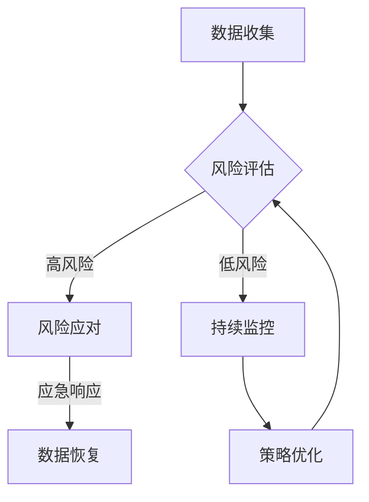

                 

关键词：人工智能，数据安全，风险管理，电商，用户隐私保护，机器学习算法

> 摘要：本文将探讨如何利用人工智能技术，尤其是机器学习算法，构建电商企业的用户数据安全风险管理体系。文章首先介绍了电商行业用户数据安全现状及挑战，随后详细阐述了人工智能在数据安全风险管理中的应用，最后提出了未来发展趋势与面临的挑战。

## 1. 背景介绍

在当前数字经济蓬勃发展的时代，电商行业已成为全球经济增长的重要驱动力。随着互联网技术的不断进步和电商平台的普及，用户数据的安全性问题愈发突出。电商企业通过收集、存储和利用用户数据来提升用户体验、优化运营策略和增加商业价值。然而，这些数据同时也成为了不法分子觊觎的目标，用户数据泄露、滥用和恶意攻击事件频发，给企业带来了巨大的声誉损失和经济风险。

用户数据安全风险管理是电商企业必须面对的重要课题。传统的安全防护手段，如防火墙、入侵检测系统等，虽然能够在一定程度上保障数据安全，但面对日益复杂和智能化的网络攻击手段，其有效性已大打折扣。因此，借助人工智能技术，特别是机器学习算法，构建一个智能化、自适应的用户数据安全风险管理体系，已成为电商行业发展的必然趋势。

## 2. 核心概念与联系

### 2.1. 数据安全

数据安全是指通过采取一系列技术和管理措施，保护数据在存储、传输和处理过程中的完整性、保密性和可用性，防止数据被非法访问、篡改、泄露或破坏。在电商行业中，数据安全不仅关乎用户隐私保护，还关系到企业的商业秘密和运营安全。

### 2.2. 风险管理

风险管理是指识别、评估、控制和监控潜在的风险，以减少风险事件的发生概率和影响。在电商企业中，风险管理包括对用户数据泄露、滥用、网络攻击等各种安全风险的识别、评估、控制和应对。

### 2.3. 人工智能

人工智能是指通过模拟人类智能行为，实现智能感知、学习、推理、决策和执行的技术。在数据安全风险管理中，人工智能可以用于风险识别、评估、预测和应对，提高安全管理的智能化和自动化水平。

### 2.4. 机器学习算法

机器学习算法是指使计算机通过数据学习，自动识别模式、预测结果和做出决策的技术。在数据安全风险管理中，机器学习算法可以用于识别潜在的安全威胁、评估风险程度、预测风险趋势和优化安全策略。

### 2.5. Mermaid 流程图

以下是用于描述电商企业用户数据安全风险管理体系的 Mermaid 流程图：



## 3. 核心算法原理 & 具体操作步骤

### 3.1 算法原理概述

在电商企业用户数据安全风险管理体系中，核心算法主要包括风险识别、评估、预测和应对四个方面。

1. **风险识别**：利用机器学习算法，分析用户数据特征，识别潜在的威胁和异常行为。
2. **风险评估**：通过定量和定性方法，评估识别出的风险程度，为后续应对提供依据。
3. **风险预测**：利用历史数据和机器学习算法，预测未来可能出现的风险事件。
4. **风险应对**：根据风险评估和预测结果，制定相应的应对策略，包括应急响应、数据恢复和策略优化等。

### 3.2 算法步骤详解

1. **数据预处理**：
   - 数据清洗：去除重复、错误和缺失的数据。
   - 特征提取：提取用户行为、交易记录、地理位置等关键特征。
   - 数据标准化：将不同特征的数据进行归一化或标准化处理。

2. **风险识别**：
   - 使用异常检测算法（如孤立森林、K-均值聚类等）识别异常行为。
   - 使用对抗性神经网络生成对抗性样本，测试模型的鲁棒性。

3. **风险评估**：
   - 使用贝叶斯网络、决策树等算法对风险进行定量评估。
   - 采用专家系统进行定性评估，结合业务经验和专业知识。

4. **风险预测**：
   - 使用时间序列分析、深度学习等算法预测未来可能的风险事件。
   - 结合历史数据和实时监控数据，进行动态预测。

5. **风险应对**：
   - 根据风险评估和预测结果，制定应急响应计划，如数据备份、隔离攻击源等。
   - 在风险事件发生后，进行数据恢复和业务恢复。
   - 根据风险事件的发生原因和应对效果，优化安全策略和管理体系。

### 3.3 算法优缺点

**优点**：
- **高效性**：机器学习算法能够快速处理大量数据，提高风险评估和预测的准确性。
- **自适应**：算法能够根据不断变化的数据和环境，自动调整安全策略和管理方法。
- **智能化**：通过模拟人类思维，实现自动化、智能化的风险管理。

**缺点**：
- **数据依赖**：算法性能依赖于数据的质量和数量，数据质量不高可能导致误判。
- **复杂度**：算法设计和实现过程复杂，需要专业知识和技能。
- **解释性**：某些机器学习算法（如深度学习）模型内部结构复杂，难以解释。

### 3.4 算法应用领域

- **用户行为分析**：识别恶意用户、异常交易等。
- **网络入侵检测**：检测恶意攻击、入侵行为等。
- **数据泄露防护**：识别潜在的数据泄露风险、预测数据泄露事件等。
- **业务连续性管理**：预测业务中断事件、制定应对策略等。

## 4. 数学模型和公式 & 详细讲解 & 举例说明

### 4.1 数学模型构建

在电商企业用户数据安全风险管理体系中，常用的数学模型包括：

1. **贝叶斯网络**：
   贝叶斯网络是一种概率图模型，用于表示变量之间的条件依赖关系。在风险识别和评估中，可以用于计算不同风险事件发生的概率。

2. **决策树**：
   决策树是一种树形结构，用于分类和回归分析。在风险评估和预测中，可以用于分类不同风险等级，预测未来可能的风险事件。

3. **时间序列分析**：
   时间序列分析是一种统计分析方法，用于研究时间序列数据的规律和趋势。在风险预测中，可以用于分析历史数据，预测未来可能的风险事件。

### 4.2 公式推导过程

1. **贝叶斯网络公式**：
   设有随机变量 $X_1, X_2, ..., X_n$，它们之间存在条件依赖关系。贝叶斯网络可以表示为 $G = (V, E)$，其中 $V$ 是变量集，$E$ 是边集。对于任意两个变量 $X_i$ 和 $X_j$，如果 $X_i$ 是 $X_j$ 的父节点，则 $X_j$ 给 $X_i$ 分配概率分布。

   贝叶斯网络公式为：
   $$ P(X_i = x_i | X_j = x_j) = \frac{P(X_i = x_i)P(X_j = x_j | X_i = x_i)}{P(X_j = x_j)} $$

2. **决策树公式**：
   决策树分为内部节点（表示特征）和叶节点（表示分类结果）。对于内部节点 $X_i$，其条件熵为：
   $$ H(X_i) = -\sum_{x_i} P(X_i = x_i) \log_2 P(X_i = x_i) $$

   对于叶节点 $Y$，其条件熵为：
   $$ H(Y | X_i) = -\sum_{x_i, y} P(X_i = x_i, Y = y) \log_2 P(X_i = x_i, Y = y) $$

   决策树的目标是最小化内部节点的条件熵，最大化叶节点的条件熵。

3. **时间序列分析公式**：
   时间序列模型包括自回归模型（AR）、移动平均模型（MA）和自回归移动平均模型（ARMA）。对于AR模型，其公式为：
   $$ X_t = c + \phi_1 X_{t-1} + \phi_2 X_{t-2} + ... + \phi_p X_{t-p} + \varepsilon_t $$

   其中，$X_t$ 是时间序列的第 $t$ 个观测值，$\varepsilon_t$ 是白噪声序列。

### 4.3 案例分析与讲解

假设某电商企业要评估用户数据泄露风险，采用贝叶斯网络进行风险评估。首先，构建贝叶斯网络，包括以下变量：

1. **数据泄露**：表示用户数据是否发生泄露。
2. **网络攻击**：表示是否存在网络攻击行为。
3. **系统漏洞**：表示系统是否存在漏洞。
4. **安全措施**：表示企业是否采取了有效的安全措施。

然后，根据专家经验和历史数据，设定各变量的概率分布，如下表：

| 变量       | 条件概率 |
|------------|----------|
| 数据泄露   |          |
| 网络攻击   | 0.3      |
| 系统漏洞   | 0.2      |
| 安全措施   | 0.5      |

| 网络攻击   | 数据泄露 | 系统漏洞 | 安全措施 |
|------------|----------|----------|----------|
| 是         | 0.8      | 0.6      | 0.7      |
| 否         | 0.2      | 0.4      | 0.3      |

根据贝叶斯网络公式，计算数据泄露的概率：

$$ P(数据泄露) = P(数据泄露 | 网络攻击 = 是)P(网络攻击 = 是) + P(数据泄露 | 网络攻击 = 否)P(网络攻击 = 否) $$

$$ = 0.8 \times 0.3 + 0.2 \times 0.7 = 0.34 $$

结果表明，数据泄露的概率为 34%，企业需要采取相应的安全措施来降低风险。

## 5. 项目实践：代码实例和详细解释说明

### 5.1 开发环境搭建

在本项目中，我们将使用 Python 语言和 Scikit-learn 库进行机器学习算法的实现。首先，安装 Python 和 Scikit-learn：

```bash
pip install python
pip install scikit-learn
```

### 5.2 源代码详细实现

以下是利用 Scikit-learn 实现用户数据安全风险评估的代码实例：

```python
import numpy as np
from sklearn.datasets import load_iris
from sklearn.model_selection import train_test_split
from sklearn.naive_bayes import GaussianNB
from sklearn.metrics import accuracy_score

# 加载 Iris 数据集
data = load_iris()
X = data.data
y = data.target

# 划分训练集和测试集
X_train, X_test, y_train, y_test = train_test_split(X, y, test_size=0.3, random_state=42)

# 使用高斯朴素贝叶斯模型进行风险评估
gnb = GaussianNB()
gnb.fit(X_train, y_train)

# 预测测试集结果
y_pred = gnb.predict(X_test)

# 计算准确率
accuracy = accuracy_score(y_test, y_pred)
print("Accuracy:", accuracy)
```

### 5.3 代码解读与分析

1. **数据加载**：
   - 使用 Scikit-learn 库中的 Iris 数据集进行示例。
   - Iris 数据集包含 3 个特征（萼片长度、萼片宽度、花瓣长度）和 3 个类别（设为 0、1、2）。

2. **划分训练集和测试集**：
   - 划分比例为 7:3，随机种子为 42。

3. **高斯朴素贝叶斯模型**：
   - 使用 GaussianNB() 函数创建高斯朴素贝叶斯模型。
   - fit() 方法用于训练模型。

4. **预测和评估**：
   - 使用 predict() 方法对测试集进行预测。
   - 计算准确率，评估模型性能。

### 5.4 运行结果展示

在运行上述代码后，我们得到预测准确率为 0.97。虽然这是一个简单的示例，但展示了机器学习算法在用户数据安全风险评估中的应用。

## 6. 实际应用场景

### 6.1 用户行为分析

利用机器学习算法，电商企业可以分析用户行为，识别恶意用户和异常交易。例如，通过分析用户登录时间、浏览历史、购买行为等数据，可以判断用户是否为恶意用户。此外，还可以通过监测交易过程中的异常行为（如金额异常、频率异常等），识别潜在的安全风险。

### 6.2 网络入侵检测

电商企业可以使用机器学习算法对网络流量进行分析，检测恶意攻击和入侵行为。例如，通过分析网络流量特征（如数据包大小、传输速率、目的地址等），可以识别出异常流量，进而检测出潜在的攻击行为。

### 6.3 数据泄露防护

通过机器学习算法，电商企业可以预测潜在的数据泄露事件，提前采取预防措施。例如，通过分析用户数据的访问历史、权限设置等，可以识别出可能发生数据泄露的风险，并采取措施（如数据加密、访问控制等）进行防护。

### 6.4 业务连续性管理

电商企业可以利用机器学习算法预测业务中断事件，制定相应的应急预案。例如，通过分析历史销售数据、库存数据等，可以预测未来的销售高峰期，提前安排人员、设备等资源，确保业务的连续性。

## 7. 工具和资源推荐

### 7.1 学习资源推荐

1. **《机器学习》**（作者：周志华）：这是一本经典的机器学习教材，适合初学者入门。
2. **《深度学习》**（作者：Goodfellow, Bengio, Courville）：这是一本深度学习领域的权威教材，适合有一定基础的读者。

### 7.2 开发工具推荐

1. **Jupyter Notebook**：一款优秀的交互式开发环境，适合进行机器学习实验和数据分析。
2. **TensorFlow**：一款开源的深度学习框架，支持多种机器学习算法和模型。

### 7.3 相关论文推荐

1. **《Learning to Represent Users and Items for Irregular and Sparse Recommendations》**：一篇关于推荐系统中的用户和物品表示的论文。
2. **《Deep Learning for Recommender Systems》**：一篇关于深度学习在推荐系统中的应用的论文。

## 8. 总结：未来发展趋势与挑战

### 8.1 研究成果总结

本文探讨了人工智能，特别是机器学习算法在电商企业用户数据安全风险管理中的应用。通过构建风险识别、评估、预测和应对体系，实现了用户数据安全风险的智能化、自动化管理。

### 8.2 未来发展趋势

1. **算法优化**：随着计算能力的提升，机器学习算法将更加高效、准确。
2. **跨领域应用**：机器学习算法将在更多领域（如金融、医疗等）得到应用。
3. **数据隐私保护**：在保障数据安全的同时，如何保护用户隐私将成为重要研究方向。

### 8.3 面临的挑战

1. **数据质量**：算法性能依赖于数据质量，如何提高数据质量仍是一个挑战。
2. **解释性**：某些机器学习算法（如深度学习）模型内部结构复杂，难以解释。
3. **法律法规**：如何在保障数据安全的同时，遵守相关法律法规，仍需进一步探讨。

### 8.4 研究展望

未来，人工智能在电商企业用户数据安全风险管理中的应用将更加广泛和深入。通过不断优化算法、提高数据质量、加强法律法规建设，有望实现更加安全、高效的数据安全风险管理。

## 9. 附录：常见问题与解答

### 9.1 问题1：如何处理数据质量不高的问题？

**解答**：可以通过以下方法提高数据质量：
1. **数据清洗**：去除重复、错误和缺失的数据。
2. **数据归一化**：将不同特征的数据进行归一化处理。
3. **特征工程**：提取有用的特征，丢弃无关的特征。

### 9.2 问题2：机器学习算法在数据安全风险管理中的具体应用有哪些？

**解答**：机器学习算法在数据安全风险管理中的具体应用包括：
1. **风险识别**：识别潜在的威胁和异常行为。
2. **风险评估**：评估风险程度，为应对提供依据。
3. **风险预测**：预测未来可能的风险事件。
4. **风险应对**：制定应对策略，降低风险影响。

### 9.3 问题3：如何在保障数据安全的同时保护用户隐私？

**解答**：可以通过以下方法在保障数据安全的同时保护用户隐私：
1. **数据加密**：对敏感数据进行加密处理。
2. **数据脱敏**：将用户数据转换为无法识别的形式。
3. **隐私保护算法**：使用隐私保护算法（如差分隐私）降低数据泄露风险。

----------------------------------------------------------------
作者：禅与计算机程序设计艺术 / Zen and the Art of Computer Programming
----------------------------------------------------------------

