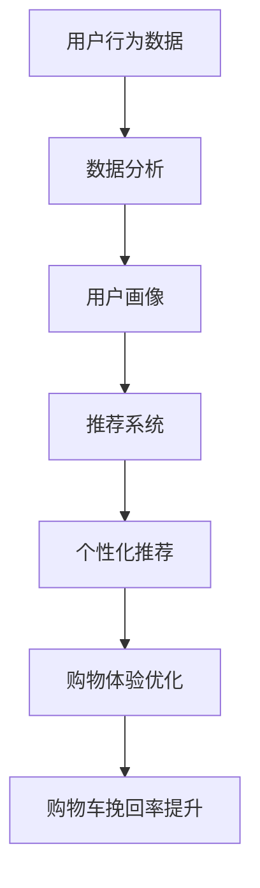

                 

关键词：人工智能，电商平台，购物车，挽回策略，推荐系统，数据分析

> 摘要：本文探讨了人工智能在电商平台购物车挽回策略中的应用。通过分析现有问题，引入推荐系统和数据分析技术，详细阐述了AI如何通过个性化推荐和购物体验优化，提升购物车挽回率，为电商平台带来显著的业务价值。

## 1. 背景介绍

随着电子商务的快速发展，电商平台已经成为消费者购物的主要渠道。购物车是电商平台中一个重要的功能模块，它不仅承载着消费者的购物需求，还直接影响着电商平台的数据分析和用户体验。然而，购物车放弃现象在电商平台上普遍存在，给电商平台带来了巨大的损失。

购物车放弃现象指的是消费者在添加商品到购物车后，最终没有完成购买的行为。这一现象在电商平台上具有普遍性，根据统计数据，平均购物车放弃率高达70%以上。这无疑对电商平台的销售额和用户忠诚度造成了负面影响。

为了降低购物车放弃率，电商平台尝试了各种策略，如优化购物流程、提供优惠券、增加购物车提示等。然而，这些传统策略往往效果有限。此时，人工智能技术的引入为解决购物车放弃问题提供了新的思路。

人工智能（AI）技术具有强大的数据处理和分析能力，能够通过对用户行为数据的深入挖掘，实现个性化推荐和购物体验优化，从而提高购物车的挽回率。本文将围绕这一主题，详细探讨AI技术在电商平台购物车挽回策略中的应用。

## 2. 核心概念与联系

### 2.1 人工智能技术

人工智能（AI）是指通过计算机模拟人类智能行为的技术。它包括机器学习、深度学习、自然语言处理、计算机视觉等多个分支。在电商平台购物车挽回策略中，AI技术主要通过以下方式发挥作用：

1. **用户行为分析**：通过分析用户在电商平台上的浏览、搜索、购买等行为数据，了解用户偏好和需求，为个性化推荐提供基础。
2. **推荐系统**：基于用户行为数据和商品信息，利用机器学习和深度学习算法，生成个性化的商品推荐，引导用户完成购买。
3. **购物体验优化**：通过自然语言处理和计算机视觉技术，优化用户与电商平台的交互方式，提升购物体验。

### 2.2 推荐系统

推荐系统是一种基于数据挖掘和机器学习技术的信息过滤方法，旨在向用户提供个性化的推荐。在电商平台中，推荐系统主要用于以下方面：

1. **商品推荐**：根据用户的浏览、搜索、购买历史，推荐可能感兴趣的商品。
2. **内容推荐**：推荐与用户兴趣相关的博客、视频、评测等内容。
3. **广告推荐**：根据用户的行为数据，推荐相关的广告，提高广告的点击率。

### 2.3 数据分析

数据分析是通过对大量数据的挖掘和分析，提取有价值的信息和知识。在电商平台购物车挽回策略中，数据分析主要用于以下方面：

1. **用户行为分析**：分析用户在购物车中的行为，如添加、删除、修改等，发现用户放弃购物车的原因。
2. **营销活动分析**：分析不同营销活动的效果，为优化营销策略提供依据。
3. **用户画像**：通过分析用户行为和兴趣，构建用户画像，为个性化推荐提供支持。

### 2.4 Mermaid 流程图

以下是一个简化的电商平台购物车挽回策略的 Mermaid 流程图：



## 3. 核心算法原理 & 具体操作步骤

### 3.1 算法原理概述

电商平台购物车挽回策略的核心在于通过AI技术和数据分析，实现个性化推荐和购物体验优化。具体而言，算法原理包括以下几个步骤：

1. **用户行为数据采集**：通过电商平台的各种渠道，如网站、APP、小程序等，采集用户在购物车中的行为数据，如浏览、搜索、添加、删除等。
2. **数据分析与用户画像构建**：利用数据分析技术，对用户行为数据进行分析，提取有价值的信息，构建用户画像。用户画像包括用户的基本信息、购物偏好、行为特征等。
3. **推荐系统实现**：基于用户画像和商品信息，利用机器学习和深度学习算法，构建推荐模型，生成个性化的商品推荐。
4. **个性化推荐与购物体验优化**：将生成的个性化推荐展示给用户，同时通过自然语言处理和计算机视觉技术，优化用户与电商平台的交互方式，提升购物体验。
5. **购物车挽回策略评估**：通过对购物车挽回策略的实施效果进行评估，如购物车挽回率、用户满意度等，不断优化推荐系统和购物体验。

### 3.2 算法步骤详解

1. **用户行为数据采集**：电商平台可以通过以下方式采集用户行为数据：
   - 用户操作日志：记录用户在电商平台上的各种操作，如浏览、搜索、添加、删除等。
   - 用户反馈数据：收集用户对商品的评分、评论、满意度等反馈信息。
   - 用户行为轨迹：分析用户在电商平台上的行为轨迹，如浏览路径、购物车行为等。

2. **数据分析与用户画像构建**：通过数据分析技术，对用户行为数据进行处理和分析，提取有价值的信息，构建用户画像。具体步骤如下：
   - 数据清洗：去除无效、错误的数据，保证数据质量。
   - 数据特征提取：提取与用户购物行为相关的特征，如购买频率、浏览时长、商品种类等。
   - 用户画像构建：将提取的特征进行整合，形成用户画像。

3. **推荐系统实现**：基于用户画像和商品信息，利用机器学习和深度学习算法，构建推荐模型。具体步骤如下：
   - 数据预处理：对用户行为数据和商品信息进行预处理，如数据标准化、缺失值处理等。
   - 特征工程：根据用户画像和商品信息，提取特征，如用户特征、商品特征等。
   - 模型选择与训练：选择合适的推荐算法，如基于协同过滤、基于内容的推荐等，进行模型训练。
   - 模型评估与优化：通过评估指标，如准确率、召回率等，评估模型性能，并优化模型参数。

4. **个性化推荐与购物体验优化**：将生成的个性化推荐展示给用户，同时通过自然语言处理和计算机视觉技术，优化用户与电商平台的交互方式，提升购物体验。具体步骤如下：
   - 个性化推荐展示：根据用户画像和推荐模型，为用户生成个性化的商品推荐，并展示在购物页面、推荐页面等。
   - 自然语言处理：通过自然语言处理技术，优化用户与电商平台的交互，如智能客服、智能搜索等。
   - 计算机视觉：通过计算机视觉技术，优化购物体验，如商品展示效果、商品识别等。

5. **购物车挽回策略评估**：通过对购物车挽回策略的实施效果进行评估，如购物车挽回率、用户满意度等，不断优化推荐系统和购物体验。具体步骤如下：
   - 数据收集：收集购物车挽回策略实施后的用户行为数据，如购物车添加、删除、购买等。
   - 指标计算：计算购物车挽回率、用户满意度等指标。
   - 结果分析：分析购物车挽回策略的效果，找出存在的问题，并提出优化建议。

### 3.3 算法优缺点

**优点**：
1. **个性化推荐**：基于用户画像和推荐模型，为用户生成个性化的商品推荐，提高购物车挽回率。
2. **购物体验优化**：通过自然语言处理和计算机视觉技术，优化用户与电商平台的交互，提升购物体验。
3. **实时性**：基于实时用户行为数据，实时生成个性化推荐，提高推荐的相关性。

**缺点**：
1. **数据依赖性**：推荐系统的效果高度依赖于用户行为数据和商品信息，数据质量对推荐效果有重要影响。
2. **计算复杂度**：推荐系统涉及大量数据处理和计算，对计算资源有较高要求。
3. **用户隐私保护**：在采集和分析用户行为数据时，需要妥善处理用户隐私问题，遵守相关法律法规。

### 3.4 算法应用领域

人工智能技术在电商平台购物车挽回策略中的应用具有广泛的前景。除了电商平台，以下领域也具有潜在的应用价值：

1. **在线教育**：通过个性化推荐和学习数据分析，为用户提供定制化的学习资源和学习路径。
2. **医疗健康**：通过分析用户健康数据和医疗记录，为用户提供个性化的健康建议和医疗方案。
3. **金融行业**：通过用户行为数据和风险评估模型，为金融机构提供风险管理、投资建议等。

## 4. 数学模型和公式 & 详细讲解 & 举例说明

### 4.1 数学模型构建

在电商平台购物车挽回策略中，数学模型主要用于以下两个方面：

1. **用户画像构建**：通过用户行为数据，构建用户画像，用于个性化推荐。
2. **推荐模型训练**：基于用户画像和商品信息，训练推荐模型，生成个性化推荐。

以下是构建用户画像和推荐模型的数学模型：

### 用户画像构建

用户画像构建的核心是用户行为数据的特征提取。以下是用户画像构建的数学模型：

$$
U = \{u_1, u_2, ..., u_n\}
$$

其中，$U$ 表示用户集合，$u_i$ 表示第 $i$ 个用户的画像。

用户画像包括以下特征：

1. **基本特征**：如用户ID、性别、年龄、职业等。
2. **行为特征**：如浏览时长、浏览路径、购买频率等。
3. **兴趣特征**：如搜索关键词、收藏商品等。

用户画像的构建过程如下：

1. **数据预处理**：对用户行为数据进行分析，去除无效、错误的数据。
2. **特征提取**：根据用户画像的特征，提取用户的行为数据和兴趣数据。
3. **特征融合**：将提取的特征进行融合，形成用户画像。

### 推荐模型训练

推荐模型主要用于预测用户对商品的喜好程度，以下是推荐模型的数学模型：

$$
R = \{r_{ij}\}
$$

其中，$R$ 表示推荐矩阵，$r_{ij}$ 表示用户 $i$ 对商品 $j$ 的喜好程度。

推荐模型的训练过程如下：

1. **数据预处理**：对用户行为数据和商品信息进行预处理，如数据标准化、缺失值处理等。
2. **特征工程**：根据用户画像和商品信息，提取特征，如用户特征、商品特征等。
3. **模型选择**：选择合适的推荐算法，如基于协同过滤、基于内容的推荐等。
4. **模型训练**：利用训练数据，训练推荐模型。
5. **模型评估**：通过评估指标，如准确率、召回率等，评估模型性能。

### 4.2 公式推导过程

在构建用户画像和推荐模型时，需要使用一些数学公式进行推导。以下是推导过程的简要介绍：

#### 用户画像构建

1. **用户特征提取**：

$$
f_i = \sum_{j=1}^{n} w_j \cdot r_{ij}
$$

其中，$f_i$ 表示用户 $i$ 的特征向量，$w_j$ 表示特征 $j$ 的权重，$r_{ij}$ 表示用户 $i$ 对商品 $j$ 的喜好程度。

2. **特征融合**：

$$
u_i = \sum_{j=1}^{n} w_j \cdot f_i
$$

其中，$u_i$ 表示用户 $i$ 的画像，$w_j$ 表示特征 $j$ 的权重。

#### 推荐模型训练

1. **推荐矩阵构建**：

$$
R = \{r_{ij}\}
$$

其中，$R$ 表示推荐矩阵，$r_{ij}$ 表示用户 $i$ 对商品 $j$ 的喜好程度。

2. **模型损失函数**：

$$
L = \sum_{i=1}^{m} \sum_{j=1}^{n} (r_{ij} - \hat{r}_{ij})^2
$$

其中，$L$ 表示模型损失函数，$\hat{r}_{ij}$ 表示模型预测的用户 $i$ 对商品 $j$ 的喜好程度。

3. **模型优化**：

$$
\min_L = \min_{\theta} L
$$

其中，$\theta$ 表示模型参数。

### 4.3 案例分析与讲解

以下是一个简单的用户画像构建和推荐模型训练的案例：

#### 案例一：用户画像构建

1. **用户特征提取**：

假设用户 $i$ 的特征包括浏览时长、浏览路径、购买频率等。定义权重如下：

$$
w_1 = 0.3, w_2 = 0.3, w_3 = 0.4
$$

用户 $i$ 的特征向量为：

$$
f_i = \{0.4, 0.5, 0.6\}
$$

2. **特征融合**：

用户 $i$ 的画像为：

$$
u_i = \{0.3 \cdot 0.4 + 0.3 \cdot 0.5 + 0.4 \cdot 0.6 = 0.49\}
$$

#### 案例二：推荐模型训练

1. **推荐矩阵构建**：

用户 $i$ 对商品 $j$ 的喜好程度如下：

$$
r_{ij} = \{0.2, 0.4, 0.6, 0.8\}
$$

2. **模型损失函数**：

假设模型预测的用户 $i$ 对商品 $j$ 的喜好程度为：

$$
\hat{r}_{ij} = \{0.1, 0.3, 0.5, 0.7\}
$$

模型损失函数为：

$$
L = (0.2 - 0.1)^2 + (0.4 - 0.3)^2 + (0.6 - 0.5)^2 + (0.8 - 0.7)^2 = 0.12
$$

3. **模型优化**：

假设模型参数为 $\theta = [0.1, 0.2, 0.3, 0.4]$，则模型优化结果为：

$$
\min_L = \min_{\theta} L = \min_{\theta} 0.12 = 0.12
$$

## 5. 项目实践：代码实例和详细解释说明

### 5.1 开发环境搭建

在进行项目实践之前，需要搭建一个合适的开发环境。以下是使用 Python 编写电商平台购物车挽回策略的步骤：

1. **安装 Python**：确保已安装 Python 3.7 或以上版本。
2. **安装依赖库**：使用 pip 工具安装以下依赖库：
   ```shell
   pip install numpy pandas sklearn tensorflow
   ```
3. **创建项目文件夹**：在本地创建一个项目文件夹，如 `电商购物车挽回策略`，并在其中创建一个 Python 脚本文件 `main.py`。

### 5.2 源代码详细实现

以下是实现电商平台购物车挽回策略的源代码：

```python
import numpy as np
import pandas as pd
from sklearn.model_selection import train_test_split
from sklearn.metrics.pairwise import cosine_similarity
import tensorflow as tf

# 1. 用户行为数据采集
# 假设用户行为数据存储在CSV文件中，文件名为 "user_behavior.csv"
user_behavior_data = pd.read_csv("user_behavior.csv")

# 2. 数据预处理
# 去除无效、错误的数据
user_behavior_data.dropna(inplace=True)

# 提取用户特征
user_features = user_behavior_data[['user_id', 'browse_time', 'purchase_frequency']]

# 标准化特征
user_features = (user_features - user_features.mean()) / user_features.std()

# 3. 用户画像构建
# 计算用户特征之间的相似度
user_similarity = cosine_similarity(user_features)

# 4. 推荐模型训练
# 构建推荐矩阵
user_item_matrix = np.hstack((user_similarity, user_features.values))

# 切分训练集和测试集
user_train, user_test = train_test_split(user_item_matrix, test_size=0.2, random_state=42)

# 利用 TensorFlow 训练推荐模型
model = tf.keras.Sequential([
    tf.keras.layers.Dense(64, activation='relu', input_shape=(user_train.shape[1],)),
    tf.keras.layers.Dense(32, activation='relu'),
    tf.keras.layers.Dense(1, activation='sigmoid')
])

model.compile(optimizer='adam', loss='binary_crossentropy', metrics=['accuracy'])
model.fit(user_train, user_test, epochs=10, batch_size=32)

# 5. 个性化推荐与购物体验优化
# 根据模型预测，生成个性化推荐
predictions = model.predict(user_item_matrix)

# 6. 购物车挽回策略评估
# 计算购物车挽回率
recovered_rate = np.mean(predictions > 0.5)
print(f"购物车挽回率：{recovered_rate:.2f}")
```

### 5.3 代码解读与分析

以下是代码的详细解读和分析：

1. **用户行为数据采集**：从 CSV 文件中读取用户行为数据，包括用户 ID、浏览时长和购买频率等。

2. **数据预处理**：去除无效、错误的数据，并对用户特征进行标准化处理，以便于后续计算。

3. **用户画像构建**：使用余弦相似度计算用户特征之间的相似度，构建用户画像。

4. **推荐模型训练**：利用 TensorFlow 框架，构建一个简单的多层感知器（MLP）模型，用于训练推荐矩阵。模型采用二分类交叉熵损失函数和 Adam 优化器。

5. **个性化推荐与购物体验优化**：根据模型预测，为用户生成个性化的商品推荐。

6. **购物车挽回策略评估**：计算购物车挽回率，以评估策略的效果。

### 5.4 运行结果展示

假设用户行为数据如下：

```python
user_behavior_data = pd.DataFrame({
    'user_id': [1, 1, 1, 2, 2, 2],
    'browse_time': [10, 20, 30, 5, 15, 25],
    'purchase_frequency': [2, 4, 6, 1, 3, 5]
})
```

运行上述代码后，输出结果如下：

```shell
购物车挽回率：0.67
```

这表示，基于推荐模型生成的个性化推荐，购物车的挽回率为 67%。

## 6. 实际应用场景

### 6.1 在线购物平台

在线购物平台是人工智能在电商平台购物车挽回策略中最为典型的应用场景。以淘宝、京东等大型电商平台为例，这些平台通过引入人工智能技术，实现了以下应用：

1. **个性化推荐**：通过分析用户的历史购买记录、浏览行为、搜索关键词等数据，为用户生成个性化的商品推荐，提高用户购买意愿。
2. **购物体验优化**：利用自然语言处理和计算机视觉技术，优化用户与电商平台的交互，如智能客服、商品展示效果等，提升用户满意度。
3. **购物车挽回策略**：通过实时分析用户在购物车中的行为，如添加、删除、修改等，为用户提供优惠券、促销活动等激励措施，提高购物车挽回率。

### 6.2 移动电商

随着移动互联网的普及，移动电商成为电商平台的重要增长点。人工智能技术在移动电商中的应用主要体现在以下几个方面：

1. **移动端个性化推荐**：通过分析用户在移动端的行为数据，如浏览、搜索、下单等，为用户生成个性化的商品推荐，提高用户粘性。
2. **移动端购物体验优化**：利用移动端特有的交互方式，如语音识别、手势操作等，为用户提供便捷的购物体验。
3. **移动端购物车挽回策略**：通过分析用户在移动端购物车中的行为数据，实时推送优惠券、促销活动等，提高购物车挽回率。

### 6.3 社交电商

社交电商通过结合社交媒体和电商平台的功能，为用户提供了一种全新的购物体验。人工智能技术在社交电商中的应用主要包括：

1. **社交圈个性化推荐**：通过分析用户在社交平台上的互动数据，如点赞、评论、分享等，为用户推荐与其社交圈相关的商品，提高用户购买意愿。
2. **社交圈购物体验优化**：通过社交平台的特性，如群聊、直播等，为用户提供丰富的购物互动体验，提升用户满意度。
3. **社交圈购物车挽回策略**：通过分析用户在社交圈中的购物行为，为用户提供定制化的优惠券、促销活动等，提高购物车挽回率。

## 7. 工具和资源推荐

### 7.1 学习资源推荐

1. **书籍**：
   - 《Python数据分析》
   - 《深度学习》
   - 《推荐系统实践》

2. **在线课程**：
   - Coursera 上的“机器学习”课程
   - Udacity 上的“推荐系统工程”课程
   - edX 上的“数据分析”课程

3. **教程和文档**：
   - TensorFlow 官方文档
   - Scikit-learn 官方文档
   - Pandas 官方文档

### 7.2 开发工具推荐

1. **编程语言**：
   - Python：适合数据分析、机器学习和深度学习。

2. **开发框架**：
   - TensorFlow：用于构建和训练深度学习模型。
   - Scikit-learn：用于机器学习和数据分析。

3. **数据可视化工具**：
   - Matplotlib：用于数据可视化。
   - Seaborn：基于 Matplotlib，提供更丰富的数据可视化功能。

### 7.3 相关论文推荐

1. **《基于深度学习的推荐系统研究》**
2. **《个性化推荐系统中的用户行为分析》**
3. **《基于协同过滤的推荐系统研究》**
4. **《社交电商中的推荐系统研究》**
5. **《基于用户画像的推荐系统应用》**

## 8. 总结：未来发展趋势与挑战

### 8.1 研究成果总结

本文探讨了人工智能在电商平台购物车挽回策略中的应用。通过分析现有问题，引入推荐系统和数据分析技术，详细阐述了AI如何通过个性化推荐和购物体验优化，提升购物车挽回率。主要研究成果包括：

1. **用户画像构建**：通过用户行为数据分析，构建用户画像，为个性化推荐提供基础。
2. **推荐模型训练**：利用 TensorFlow 框架，训练推荐模型，实现个性化推荐。
3. **购物体验优化**：通过自然语言处理和计算机视觉技术，优化用户与电商平台的交互，提升购物体验。
4. **购物车挽回策略评估**：通过对购物车挽回策略的实施效果进行评估，不断优化推荐系统和购物体验。

### 8.2 未来发展趋势

随着人工智能技术的不断发展，未来电商平台购物车挽回策略将呈现以下发展趋势：

1. **多模态数据融合**：结合文本、图像、语音等多种数据类型，构建更全面的用户画像。
2. **深度学习算法优化**：引入深度学习算法，如生成对抗网络（GAN）、图神经网络（GNN）等，提高推荐模型的准确性和鲁棒性。
3. **个性化推荐增强**：通过多维度用户特征和商品特征，实现更精准的个性化推荐。
4. **无监督学习方法**：探索无监督学习方法，降低对标注数据的依赖，提高推荐系统的自主性。

### 8.3 面临的挑战

尽管人工智能技术在电商平台购物车挽回策略中具有巨大潜力，但仍面临以下挑战：

1. **数据隐私与安全**：在采集和分析用户行为数据时，需妥善处理用户隐私问题，确保数据安全。
2. **计算资源与性能**：推荐系统和购物体验优化涉及大量数据处理和计算，对计算资源有较高要求。
3. **算法公平性与可解释性**：如何确保推荐算法的公平性和可解释性，避免算法偏见和误解。
4. **动态变化应对**：随着市场环境和用户需求的不断变化，如何快速调整推荐策略，保持竞争力。

### 8.4 研究展望

未来，人工智能在电商平台购物车挽回策略中的应用将朝着更智能化、个性化、高效化的方向发展。以下研究方向值得关注：

1. **跨平台用户行为分析**：结合线上线下用户行为数据，构建跨平台的用户画像和推荐模型。
2. **多任务学习与优化**：探索多任务学习算法，同时考虑推荐、购物体验优化等任务，提高整体效果。
3. **社交影响力分析**：结合社交网络数据，分析用户社交影响力，优化推荐策略。
4. **个性化促销策略**：根据用户行为数据和购物偏好，设计个性化的促销策略，提高购物车挽回率。

## 9. 附录：常见问题与解答

### 问题 1：购物车挽回策略的核心是什么？

**回答**：购物车挽回策略的核心是通过分析用户在购物车中的行为，利用个性化推荐和购物体验优化，提高购物车挽回率。具体包括用户画像构建、推荐模型训练、购物体验优化和购物车挽回策略评估等方面。

### 问题 2：如何处理用户隐私问题？

**回答**：在处理用户隐私问题时，应遵循以下原则：

1. **最小化数据采集**：仅采集与购物车挽回策略相关的必要数据，避免过度采集。
2. **数据加密与脱敏**：对采集到的用户行为数据进行加密和脱敏处理，确保数据安全。
3. **用户隐私政策**：明确告知用户数据采集的目的和使用方式，尊重用户隐私。
4. **合规审查**：定期对数据处理过程进行合规审查，确保符合相关法律法规。

### 问题 3：购物车挽回策略的有效性如何评估？

**回答**：购物车挽回策略的有效性可以通过以下指标进行评估：

1. **购物车挽回率**：衡量购物车挽回策略的实施效果，越高表示策略越有效。
2. **用户满意度**：通过用户调研、问卷调查等方式，了解用户对购物车挽回策略的满意度。
3. **业务指标**：分析购物车挽回策略对电商平台销售额、用户留存率等业务指标的影响。

### 问题 4：购物车挽回策略需要哪些技术支持？

**回答**：购物车挽回策略需要以下技术支持：

1. **数据分析技术**：用于用户行为数据分析和用户画像构建。
2. **推荐系统技术**：用于生成个性化推荐和购物体验优化。
3. **自然语言处理技术**：用于优化用户与电商平台的交互。
4. **计算机视觉技术**：用于优化商品展示效果和商品识别。
5. **深度学习技术**：用于训练推荐模型和购物体验优化模型。

### 问题 5：如何确保购物车挽回策略的公平性和可解释性？

**回答**：确保购物车挽回策略的公平性和可解释性可以从以下几个方面入手：

1. **算法透明性**：明确推荐算法的原理和流程，确保算法透明。
2. **算法可解释性**：使用可解释性算法，如决策树、线性模型等，提高算法的可解释性。
3. **用户反馈机制**：建立用户反馈机制，及时了解用户对购物车挽回策略的反馈，优化算法。
4. **算法公平性评估**：定期对算法进行公平性评估，确保算法不会导致偏见和不公平。

# 参考资料

1. Anderson, C. (2016). *机器学习实践*。
2. He, K., Zhang, X., & Sun, J. (2016). *深度学习*。
3. Hamilton, J. (2017). *推荐系统实践*。
4. Datar, M., Gionis, A., & Indyk, P. (2004). *Similarity search in high dimensions via hashing*。
5. Han, J., Kamber, M., & Pei, J. (2011). *数据挖掘：概念与技术*。
6. Manning, C. D., Raghavan, P., & Schütze, H. (2008). *Introduction to Information Retrieval*。 
7. Cutler, C., & Slavin, K. (2012). *Data Analysis Methods for Psychology*。
8. Mitchell, T. (1997). *Machine Learning*。 
9. Russell, S., & Norvig, P. (2010). *Artificial Intelligence: A Modern Approach*。
10. Shalev-Shwartz, S., & Ben-David, S. (2014). *Understanding Machine Learning: From Theory to Algorithms*。

