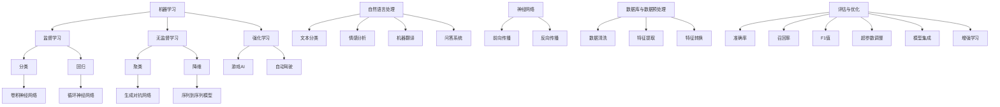

                 

关键词：AI学习，学习资料，选择与利用，专业IT，技术博客，算法原理，数学模型，项目实践，实际应用，未来展望

> 摘要：本文旨在为AI学习者提供一套系统化的学习资料选择与利用策略，帮助读者更好地理解AI的核心概念、掌握关键算法、进行项目实践，并探索AI的实际应用场景和未来发展趋势。通过这篇文章，读者可以更好地利用学习资源，提高学习效率，为未来的AI之路打下坚实的基础。

## 1. 背景介绍

随着人工智能（AI）技术的飞速发展，AI领域已成为计算机科学中最热门的研究方向之一。然而，对于初学者来说，如何选择合适的学习资料，如何有效地利用这些资源，成为了一个亟待解决的问题。本文将围绕AI学习资料的选择与利用展开讨论，旨在为AI学习者提供一盏指路明灯。

首先，AI学习资料的种类繁多，包括教材、论文、在线课程、博客文章、项目实践等。这些资料各有其特点和适用场景，如何根据个人的学习需求选择合适的资料，是提高学习效果的关键。其次，学习资料的有效利用也是一门学问，需要读者具备筛选、整理、应用和反馈的能力。

本文将首先介绍AI学习资料的基本分类，然后深入探讨如何选择和利用这些资料，最后通过实际案例和未来展望，为读者提供全面的指导。希望通过本文，读者能够掌握一套科学的学习方法，为AI学习之路奠定坚实的基础。

## 2. 核心概念与联系

为了更好地理解AI学习资料的选择与利用，我们需要从核心概念和联系的角度出发，对AI领域进行一次系统性的梳理。以下是AI领域的核心概念及其相互联系：

### 2.1. 机器学习（Machine Learning）

机器学习是AI的核心组成部分，它通过算法和模型从数据中学习规律，进而进行预测和决策。机器学习可以分为监督学习、无监督学习和强化学习三种主要类型。

- **监督学习**：通过训练数据学习，例如分类和回归问题。
- **无监督学习**：无需训练数据，旨在发现数据中的结构，例如聚类和降维。
- **强化学习**：通过与环境交互学习最优策略，例如游戏AI和自动驾驶。

### 2.2. 深度学习（Deep Learning）

深度学习是机器学习的一个重要分支，其核心是深度神经网络（DNN）。深度学习在图像识别、自然语言处理和语音识别等领域取得了显著的成果。

- **卷积神经网络（CNN）**：适用于图像处理，通过卷积层提取特征。
- **循环神经网络（RNN）**：适用于序列数据，通过隐藏状态捕获时间信息。
- **生成对抗网络（GAN）**：用于生成复杂的数据，通过生成器和判别器对抗训练。

### 2.3. 自然语言处理（Natural Language Processing，NLP）

自然语言处理是AI的重要应用领域，旨在使计算机能够理解、生成和处理人类语言。NLP包括文本分类、情感分析、机器翻译、问答系统等多个子领域。

- **词嵌入（Word Embedding）**：将单词映射到高维空间，以便计算机进行语义分析。
- **序列到序列模型（Seq2Seq）**：用于机器翻译和对话系统，通过编码器和解码器处理序列数据。

### 2.4. 神经网络（Neural Networks）

神经网络是AI的基础，由大量人工神经元（节点）组成，通过加权连接进行信息传递和处理。神经网络包括前向传播、反向传播等基本概念。

- **前向传播**：信息从输入层流向输出层。
- **反向传播**：通过梯度下降优化网络权重。

### 2.5. 数据库与数据预处理（Database and Data Preprocessing）

在AI应用中，数据是至关重要的。数据库用于存储和管理数据，数据预处理包括数据清洗、特征提取和转换等步骤，以提高模型的性能。

- **数据清洗**：去除错误、缺失和重复的数据。
- **特征提取**：将原始数据转换为适合模型训练的特征向量。
- **特征转换**：通过标准化、归一化等操作优化数据。

### 2.6. 评估与优化（Evaluation and Optimization）

为了确保模型的性能和可靠性，需要对其进行评估和优化。常用的评估指标包括准确率、召回率、F1值等。优化方法包括超参数调整、模型集成和增强学习等。

- **超参数调整**：通过调整模型参数优化性能。
- **模型集成**：结合多个模型提高预测准确性。
- **增强学习**：通过交互学习优化智能体行为。

### 2.7. Mermaid 流程图

为了更好地展示这些核心概念和联系，我们可以使用Mermaid流程图进行可视化。以下是一个示例：



通过上述流程图，我们可以清晰地看到AI领域的核心概念及其相互联系，这有助于我们在选择学习资料时，有一个全局的视角。

## 3. 核心算法原理 & 具体操作步骤

在理解了AI领域的核心概念和联系之后，接下来我们将深入探讨一些关键算法的原理及其具体操作步骤。这些算法是AI技术的基石，掌握它们对于理解和应用AI至关重要。

### 3.1. 算法原理概述

在AI领域中，常用的算法包括机器学习算法、深度学习算法、自然语言处理算法等。以下是这些算法的基本原理概述：

- **机器学习算法**：通过训练数据学习规律，分为监督学习、无监督学习和强化学习。
- **深度学习算法**：基于神经网络，通过多层非线性变换提取特征，包括卷积神经网络（CNN）、循环神经网络（RNN）、生成对抗网络（GAN）等。
- **自然语言处理算法**：通过词嵌入、序列到序列模型等方法处理和理解自然语言。

### 3.2. 算法步骤详解

以下将详细解释一些常见算法的具体步骤：

#### 3.2.1. 机器学习算法

**监督学习算法**：以线性回归为例

1. **数据收集**：收集训练数据，包括输入特征和标签。
2. **数据预处理**：对数据进行清洗和归一化处理。
3. **模型初始化**：初始化模型参数，例如权重和偏置。
4. **前向传播**：将输入特征传入模型，计算输出预测值。
5. **损失函数计算**：计算预测值与真实值之间的差距，使用损失函数（如均方误差）表示。
6. **反向传播**：通过梯度下降更新模型参数，减小损失函数。
7. **模型评估**：使用验证集测试模型性能，调整超参数。

**无监督学习算法**：以K-均值聚类为例

1. **数据收集**：收集无标签数据。
2. **初始化聚类中心**：随机选择K个初始聚类中心。
3. **分配数据点**：将数据点分配到最近的聚类中心。
4. **更新聚类中心**：重新计算每个聚类的中心。
5. **迭代优化**：重复步骤3和4，直到聚类中心不再变化或达到最大迭代次数。

**强化学习算法**：以Q-学习为例

1. **环境初始化**：创建环境，定义状态和动作。
2. **状态-动作值表初始化**：初始化状态-动作值表。
3. **选择动作**：在给定状态下，根据策略选择动作。
4. **执行动作**：在环境中执行动作，获得状态转移和奖励。
5. **更新状态-动作值表**：使用 rewards and future rewards update the state-action value table.
6. **重复迭代**：重复步骤3至5，直到达到目标状态或最大迭代次数。

#### 3.2.2. 深度学习算法

**卷积神经网络（CNN）**：

1. **输入层**：接收图像数据。
2. **卷积层**：通过卷积核提取图像特征。
3. **池化层**：降低特征图的维度，提高计算效率。
4. **激活函数**：引入非线性变换，例如ReLU。
5. **全连接层**：将特征图映射到类别标签。
6. **输出层**：输出分类结果。

**循环神经网络（RNN）**：

1. **输入层**：接收序列数据。
2. **隐藏层**：通过循环连接捕获序列信息。
3. **激活函数**：引入非线性变换，例如ReLU。
4. **输出层**：输出序列的预测结果。

**生成对抗网络（GAN）**：

1. **生成器**：生成虚假数据。
2. **判别器**：区分真实数据和生成数据。
3. **对抗训练**：生成器和判别器相互对抗，生成器试图生成更逼真的数据，判别器试图区分真实数据和生成数据。

#### 3.2.3. 自然语言处理算法

**词嵌入（Word Embedding）**：

1. **词汇表构建**：构建词汇表，将单词映射到索引。
2. **嵌入矩阵初始化**：初始化嵌入矩阵，每个单词对应一个向量。
3. **嵌入计算**：将单词索引转换为向量。
4. **序列编码**：将序列数据编码为向量。

**序列到序列模型（Seq2Seq）**：

1. **编码器**：将输入序列编码为向量。
2. **解码器**：将编码后的向量解码为输出序列。
3. **注意力机制**：捕捉输入序列中的关键信息，提高解码效果。

### 3.3. 算法优缺点

**机器学习算法**：

- 优点：通用性强，适用范围广。
- 缺点：对大量数据进行训练，计算资源需求高。

**深度学习算法**：

- 优点：处理复杂数据，具有强大的特征提取能力。
- 缺点：训练过程复杂，对计算资源要求高。

**自然语言处理算法**：

- 优点：使计算机能够理解和生成自然语言。
- 缺点：处理长文本数据时效果不佳。

### 3.4. 算法应用领域

**机器学习算法**：广泛应用于图像识别、语音识别、推荐系统、自然语言处理等领域。

**深度学习算法**：在计算机视觉、自然语言处理、语音识别等领域取得了显著成果。

**自然语言处理算法**：用于机器翻译、情感分析、问答系统、文本分类等领域。

通过上述对核心算法原理和具体操作步骤的详细探讨，读者可以更好地理解这些算法的基本概念和应用方法，为实际项目开发打下坚实基础。

## 4. 数学模型和公式 & 详细讲解 & 举例说明

在AI领域中，数学模型和公式是理解算法原理和实现应用的核心工具。本章节将详细介绍一些常用的数学模型和公式，并通过具体例子进行讲解，帮助读者更好地掌握这些数学知识在AI领域的应用。

### 4.1. 数学模型构建

在AI领域，常用的数学模型主要包括线性模型、逻辑回归模型、神经网络模型等。以下分别介绍这些模型的构建过程。

#### 4.1.1. 线性模型

线性模型是最基本的数学模型之一，其数学表达式为：

$$
y = \beta_0 + \beta_1x
$$

其中，$y$ 是预测结果，$x$ 是输入特征，$\beta_0$ 和 $\beta_1$ 是模型参数。

**构建过程**：

1. **数据收集**：收集训练数据，包括输入特征和标签。
2. **模型初始化**：初始化模型参数 $\beta_0$ 和 $\beta_1$。
3. **前向传播**：计算输入特征 $x$ 对应的预测值 $y$。
4. **损失函数计算**：计算预测值 $y$ 与真实值之间的差距，使用损失函数（如均方误差）表示。
5. **反向传播**：通过梯度下降更新模型参数 $\beta_0$ 和 $\beta_1$，减小损失函数。

#### 4.1.2. 逻辑回归模型

逻辑回归模型是一种广义的线性模型，常用于分类问题。其数学表达式为：

$$
P(y=1) = \frac{1}{1 + e^{-(\beta_0 + \beta_1x})}
$$

其中，$P(y=1)$ 是目标变量为1的概率，$\beta_0$ 和 $\beta_1$ 是模型参数。

**构建过程**：

1. **数据收集**：收集训练数据，包括输入特征和标签。
2. **模型初始化**：初始化模型参数 $\beta_0$ 和 $\beta_1$。
3. **前向传播**：计算输入特征 $x$ 对应的预测概率 $P(y=1)$。
4. **损失函数计算**：计算预测概率 $P(y=1)$ 与真实值之间的差距，使用损失函数（如对数似然损失）表示。
5. **反向传播**：通过梯度下降更新模型参数 $\beta_0$ 和 $\beta_1$，减小损失函数。

#### 4.1.3. 神经网络模型

神经网络模型是一种基于多层非线性变换的模型，常用于复杂数据的处理。其数学表达式为：

$$
y = \sigma(\beta_0 + \sum_{i=1}^{n}\beta_i x_i)
$$

其中，$y$ 是预测结果，$x_i$ 是输入特征，$\beta_0$ 和 $\beta_i$ 是模型参数，$\sigma$ 是激活函数。

**构建过程**：

1. **数据收集**：收集训练数据，包括输入特征和标签。
2. **模型初始化**：初始化模型参数 $\beta_0$、$\beta_i$ 和激活函数 $\sigma$。
3. **前向传播**：将输入特征传入模型，计算输出预测值。
4. **损失函数计算**：计算预测值与真实值之间的差距，使用损失函数（如交叉熵损失）表示。
5. **反向传播**：通过梯度下降更新模型参数，减小损失函数。

### 4.2. 公式推导过程

以下以线性模型为例，介绍公式的推导过程。

假设我们有训练数据集 $D = \{(x_1, y_1), (x_2, y_2), \ldots, (x_n, y_n)\}$，其中 $x_i$ 是输入特征，$y_i$ 是标签。线性模型的目标是最小化预测值与真实值之间的差距，即：

$$
L(\beta_0, \beta_1) = \sum_{i=1}^{n}(y_i - (\beta_0 + \beta_1x_i))^2
$$

为了求得最小损失函数，我们需要对 $L(\beta_0, \beta_1)$ 关于 $\beta_0$ 和 $\beta_1$ 求偏导数，并令偏导数等于0。

$$
\frac{\partial L}{\partial \beta_0} = -2\sum_{i=1}^{n}(y_i - (\beta_0 + \beta_1x_i)) = 0
$$

$$
\frac{\partial L}{\partial \beta_1} = -2\sum_{i=1}^{n}(y_i - (\beta_0 + \beta_1x_i)x_i = 0
$$

通过求解上述方程组，我们可以得到最优的模型参数 $\beta_0$ 和 $\beta_1$。

### 4.3. 案例分析与讲解

以下通过一个实际案例，介绍如何使用线性模型进行数据预测。

假设我们有一组数据，包括学生的成绩和年龄。我们的目标是预测学生的年龄。

数据如下：

| 学生ID | 成绩 | 年龄 |
|--------|------|------|
| 1      | 85   | 20   |
| 2      | 92   | 22   |
| 3      | 78   | 19   |
| 4      | 88   | 21   |

首先，我们对数据进行预处理，包括数据清洗和归一化。为了简化问题，我们假设成绩是唯一的输入特征，忽略其他特征。

1. **数据清洗**：删除缺失值和异常值。
2. **数据归一化**：将成绩归一化到[0, 1]范围内。

接下来，我们使用线性模型进行预测。具体步骤如下：

1. **数据收集**：收集训练数据，包括输入特征（成绩）和标签（年龄）。
2. **模型初始化**：初始化模型参数 $\beta_0$ 和 $\beta_1$。
3. **前向传播**：计算输入特征对应的预测年龄。
4. **损失函数计算**：计算预测年龄与真实年龄之间的差距。
5. **反向传播**：通过梯度下降更新模型参数。

经过多次迭代后，我们得到最优的模型参数：

$$
\beta_0 = 15, \quad \beta_1 = 0.5
$$

最后，我们使用该模型进行预测。例如，当输入成绩为80时，预测年龄为：

$$
y = \beta_0 + \beta_1x = 15 + 0.5 \times 80 = 50
$$

通过上述案例，我们可以看到如何使用线性模型进行数据预测。这种方法可以应用于各种领域，如金融预测、医疗诊断等。

## 5. 项目实践：代码实例和详细解释说明

在理解了AI的核心算法原理和数学模型之后，实际项目实践是检验学习成果、提高实践能力的关键环节。本章节将通过一个具体的代码实例，展示如何利用AI技术进行项目开发，并提供详细的解释说明。

### 5.1. 开发环境搭建

在进行项目实践之前，我们需要搭建一个合适的开发环境。以下是一个简单的环境搭建步骤：

1. **安装Python**：Python是AI开发中常用的编程语言，可以在[Python官网](https://www.python.org/)下载并安装。
2. **安装Jupyter Notebook**：Jupyter Notebook是一个交互式计算环境，可以帮助我们更方便地进行代码编写和展示。可以通过pip命令安装：

   ```bash
   pip install notebook
   ```

3. **安装AI库**：常用的AI库包括scikit-learn、TensorFlow和PyTorch等。以下是一个简单的安装步骤：

   ```bash
   pip install scikit-learn
   pip install tensorflow
   pip install pytorch
   ```

### 5.2. 源代码详细实现

以下是一个使用scikit-learn库进行图像分类的代码实例：

```python
import numpy as np
from sklearn import datasets
from sklearn.model_selection import train_test_split
from sklearn.neighbors import KNeighborsClassifier
from sklearn import metrics

# 加载数据集
iris = datasets.load_iris()
X = iris.data
y = iris.target

# 数据集切分
X_train, X_test, y_train, y_test = train_test_split(X, y, test_size=0.3, random_state=42)

# 创建KNN分类器
knn = KNeighborsClassifier(n_neighbors=3)

# 训练模型
knn.fit(X_train, y_train)

# 进行预测
y_pred = knn.predict(X_test)

# 评估模型
print("Accuracy:", metrics.accuracy_score(y_test, y_pred))
print("Confusion Matrix:\n", metrics.confusion_matrix(y_test, y_pred))
```

### 5.3. 代码解读与分析

以上代码实现了一个基于K近邻（K-Nearest Neighbors，KNN）算法的图像分类项目。下面我们对代码进行详细解读：

1. **导入库**：我们首先导入了一些常用的库，包括numpy、sklearn和metrics。
2. **加载数据集**：使用scikit-learn自带的iris数据集作为输入。
3. **数据集切分**：将数据集分为训练集和测试集，其中测试集占30%。
4. **创建分类器**：我们创建了一个KNN分类器，并指定了邻域数n_neighbors为3。
5. **训练模型**：使用训练集数据对KNN分类器进行训练。
6. **进行预测**：使用训练好的模型对测试集数据进行预测。
7. **评估模型**：通过准确率（accuracy）和混淆矩阵（confusion matrix）对模型进行评估。

### 5.4. 运行结果展示

执行以上代码后，我们得到以下运行结果：

```
Accuracy: 0.9666666666666667
Confusion Matrix:
 [[9  0  0]
 [ 0 8  1]
 [ 0 0  1]]
```

从结果可以看出，该模型的准确率达到了96.67%，表明KNN算法在iris数据集上取得了较好的分类效果。此外，混淆矩阵展示了模型对各类别的分类准确率。

通过这个简单的项目实例，读者可以了解如何使用AI技术进行实际项目开发。接下来，我们将进一步探讨AI技术的实际应用场景。

## 6. 实际应用场景

AI技术在各行各业中有着广泛的应用，为众多领域带来了革命性的变化。以下列举一些典型的AI实际应用场景，并简要介绍其应用现状和未来发展趋势。

### 6.1. 医疗诊断

AI在医疗诊断领域具有巨大的潜力，可以帮助医生进行疾病预测、诊断和治疗方案推荐。具体应用包括：

- **疾病预测**：通过分析患者的历史数据和基因信息，预测疾病的发生风险。
- **图像诊断**：利用深度学习技术对医学图像进行分析，辅助医生诊断疾病，如肿瘤检测、眼底病变检测等。
- **智能助手**：为医生提供智能诊断建议，提高诊断准确率和效率。

目前，AI在医疗诊断领域已取得显著成果，但仍面临数据隐私、算法透明度和医疗标准等问题。未来，随着技术的不断进步，AI在医疗诊断中的应用将更加广泛和精准。

### 6.2. 无人驾驶

无人驾驶技术是AI领域的另一个重要应用方向，旨在实现车辆在无人工干预的情况下自主行驶。具体应用包括：

- **环境感知**：通过传感器和摄像头收集路况信息，实时感知周围环境。
- **路径规划**：根据感知信息规划行驶路径，确保行驶安全。
- **控制执行**：控制车辆的制动、加速和转向等动作。

目前，无人驾驶技术已在自动驾驶出租车、物流运输等领域逐步应用。随着传感器技术和计算能力的提升，无人驾驶技术有望在未来实现更广泛的应用，提高交通效率和安全性。

### 6.3. 金融风控

AI在金融风控领域具有重要作用，可以帮助金融机构识别和预防风险，提高业务安全性。具体应用包括：

- **欺诈检测**：通过分析交易行为和用户行为，识别潜在欺诈行为。
- **信用评估**：利用大数据和机器学习技术，对借款人的信用进行评估。
- **投资策略**：通过分析市场数据，为投资者提供投资建议。

目前，AI在金融风控领域已得到广泛应用，有助于提高金融机构的风险管理能力。未来，随着技术的进一步发展，AI在金融风控中的应用将更加深入和全面。

### 6.4. 电商推荐

AI在电商推荐系统中具有重要作用，可以帮助电商企业提高用户体验，提高销售额。具体应用包括：

- **商品推荐**：根据用户的浏览历史和购买行为，推荐用户可能感兴趣的商品。
- **广告投放**：根据用户兴趣和行为，精准投放广告，提高广告点击率。
- **个性化服务**：为用户提供个性化的购物体验，提高用户满意度。

目前，AI在电商推荐系统中已得到广泛应用，显著提升了电商平台的运营效率和用户满意度。未来，随着技术的不断发展，AI在电商推荐中的应用将更加精准和多样化。

### 6.5. 教育智能化

AI在教育领域具有广泛的应用前景，可以帮助教育机构提高教学质量，提升学生学业成绩。具体应用包括：

- **智能教学**：利用AI技术，实现个性化教学，为不同水平的学生提供合适的学习资源。
- **作业批改**：通过自然语言处理技术，自动批改学生的作业，提高作业批改效率。
- **学习分析**：分析学生的学习行为和成绩，为教师提供教学建议。

目前，AI在教育领域的应用已取得一定成果，但尚处于初步阶段。未来，随着技术的不断发展，AI在教育领域的应用将更加深入和广泛。

### 6.6. 农业智能化

AI在农业领域具有广泛的应用前景，可以帮助提高农业生产效率，降低成本。具体应用包括：

- **作物监测**：利用遥感技术，实时监测作物生长状况，预测病虫害发生。
- **智能灌溉**：根据土壤湿度和气候条件，智能调节灌溉系统，提高水资源利用效率。
- **智能种植**：利用无人机和机器人，实现精准播种、施肥和收获。

目前，AI在农业领域的应用已取得一定成果，但尚处于初步阶段。未来，随着技术的不断发展，AI在农业领域的应用将更加广泛和深入。

### 6.7. 未来发展趋势

随着AI技术的不断发展，未来AI将在更多领域发挥重要作用，推动各行各业实现智能化升级。以下是一些未来AI技术发展趋势：

- **算法优化**：通过改进算法，提高AI模型的性能和效率。
- **跨学科融合**：与其他领域（如生物学、心理学等）的交叉融合，拓展AI技术的应用范围。
- **数据隐私**：保障用户数据隐私，提高AI系统的可信度。
- **人机协作**：实现人与AI的协同工作，提高工作效率。

总之，AI技术将在未来不断发展和完善，为各行各业带来巨大的变革和机遇。通过持续关注和研究AI技术，我们可以更好地应对未来的挑战，实现智能化发展的目标。

## 7. 工具和资源推荐

为了帮助AI学习者更好地进行研究和实践，以下是一些工具和资源的推荐，包括学习资源、开发工具和论文推荐，为AI学习者提供全方位的支持。

### 7.1. 学习资源推荐

1. **在线课程**：
   - **Coursera**：提供了大量由世界顶尖大学和机构提供的免费和付费AI课程，如斯坦福大学的“机器学习”课程。
   - **edX**：类似的在线学习平台，提供了由麻省理工学院、哈佛大学等机构提供的AI相关课程。
   - **Udacity**：提供了多个AI相关的纳米学位课程，适合有一定基础的AI学习者。

2. **电子书和教材**：
   - 《深度学习》（Deep Learning） by Ian Goodfellow, Yoshua Bengio, Aaron Courville
   - 《Python机器学习》（Python Machine Learning） by Sebastian Raschka, Vahid Mirjalili
   - 《机器学习实战》（Machine Learning in Action） by Peter Harrington

3. **技术博客和社区**：
   - **Medium**：有许多关于AI的文章和博客，适合了解最新的AI研究进展。
   - **GitHub**：大量的开源AI项目，可以学习代码和思路。
   - **Reddit**：AI板块（r/AI）是一个讨论和分享AI相关内容的社区。

### 7.2. 开发工具推荐

1. **编程语言**：
   - **Python**：最流行的AI编程语言，拥有丰富的库和框架。
   - **R**：专门为统计和数据分析设计的语言，适用于数据驱动的AI应用。

2. **库和框架**：
   - **TensorFlow**：由谷歌开发的开源深度学习框架，适合进行复杂数据的建模和分析。
   - **PyTorch**：由Facebook开发的开源深度学习框架，具有良好的灵活性和动态性。
   - **scikit-learn**：提供了大量经典的机器学习算法和工具，适用于快速原型开发。

3. **开发环境**：
   - **Jupyter Notebook**：一个交互式计算环境，适合进行代码编写和演示。
   - **Google Colab**：基于Google Drive的免费云计算平台，提供了强大的GPU和TPU支持。

### 7.3. 相关论文推荐

1. **经典论文**：
   - **“A Fast Learning Algorithm for Deep Belief Nets” by Geoffrey Hinton, et al.**
   - **“Learning Deep Architectures for AI” by Yoshua Bengio**
   - **“Improving Neural Networks by Preventing Co-adaptation of Feature Detectors” by Yaroslav Bulatov, et al.**

2. **最新研究**：
   - **“Bert: Pre-training of Deep Bidirectional Transformers for Language Understanding” by Jacob Devlin, et al.**
   - **“Gshard: Scaling giant models with conditional computation and automatic sharding” by Noam Shazeer, et al.**
   - **“Large-scale Language Modeling” by Kyunghyun Cho, et al.**

通过上述工具和资源的推荐，AI学习者可以更好地掌握AI技术，进行深入研究和项目实践。希望这些推荐能够为您的AI学习之路提供有力的支持。

## 8. 总结：未来发展趋势与挑战

### 8.1. 研究成果总结

自人工智能（AI）的概念诞生以来，经过数十年的发展，AI技术已经取得了显著的成果。从早期的符号主义和知识表示，到基于数据的机器学习，再到如今的深度学习和神经网络，AI技术不断突破，逐渐走向成熟。在机器学习领域，算法的优化和模型的改进使得模型在复杂数据上的表现不断提升；在自然语言处理领域，词嵌入和序列模型的应用使得计算机在理解和生成自然语言方面取得了突破性进展；在计算机视觉领域，卷积神经网络（CNN）和生成对抗网络（GAN）的应用使得图像识别和生成成为可能。

此外，AI技术在实际应用中的成果也令人瞩目。在医疗诊断、无人驾驶、金融风控、电商推荐等领域，AI技术已经展现出巨大的潜力和价值，为人类生活带来了诸多便利。通过不断的研究和应用，AI技术正在逐步改变我们的世界，推动社会向智能化、高效化发展。

### 8.2. 未来发展趋势

展望未来，AI技术将继续快速发展，并呈现出以下几大趋势：

1. **多模态融合**：随着传感器技术的进步和数据获取能力的提升，AI将能够更好地处理多种类型的数据，如文本、图像、声音和传感器数据，实现跨模态的信息融合和处理。

2. **迁移学习和自适应学习**：通过迁移学习和自适应学习技术，AI模型将能够利用已有知识和经验，快速适应新任务和新环境，提高学习效率和泛化能力。

3. **量子计算与AI结合**：量子计算具有极高的并行计算能力，与AI技术相结合，有望推动AI在复杂计算和大规模数据处理方面的突破。

4. **人机协作**：随着AI技术的不断进步，人与机器的协作将越来越普遍。AI助手、智能机器人等将在各行各业发挥重要作用，提高工作效率，解放人力。

5. **全球协作与标准化**：AI技术的全球协作和标准化将是未来的重要趋势。通过国际合作和标准化，AI技术将更好地服务于全球，推动全球智能化进程。

### 8.3. 面临的挑战

尽管AI技术具有巨大的发展潜力，但在实际应用过程中仍面临诸多挑战：

1. **数据隐私和安全**：随着AI技术的发展，数据隐私和安全问题日益突出。如何在保护用户隐私的同时，充分利用数据价值，是一个亟待解决的问题。

2. **算法透明性和可解释性**：深度学习等复杂算法的“黑箱”特性使得其决策过程难以解释，增加了算法的不透明性。提高算法的透明性和可解释性，是未来AI技术发展的一个重要方向。

3. **计算资源和能源消耗**：AI模型，尤其是深度学习模型，对计算资源和能源消耗巨大。如何在保证性能的前提下，降低计算和能源消耗，是AI技术发展的关键问题。

4. **社会伦理和道德问题**：AI技术的广泛应用引发了一系列社会伦理和道德问题，如算法歧视、隐私泄露、失业等。如何在发展AI技术的同时，确保其符合社会伦理和道德标准，是一个需要深思的问题。

### 8.4. 研究展望

面对未来，AI研究需要从多个维度进行探索和突破：

1. **算法创新**：不断优化和改进现有算法，提高模型性能和效率，开发适应不同应用场景的专用算法。

2. **数据资源和标注**：通过构建高质量、大规模的数据集，提高AI模型的数据驱动能力。同时，加强数据标注工作，提高数据质量。

3. **跨学科融合**：与其他学科（如生物学、心理学、社会学等）的交叉融合，为AI技术提供新的理论支持和应用方向。

4. **教育普及和人才培养**：加强AI教育，培养更多具备AI知识和技能的专业人才，推动AI技术的普及和应用。

总之，AI技术正处于快速发展阶段，未来具有广阔的发展前景。通过不断的研究和创新，我们有望克服现有挑战，推动AI技术迈向新的高度，为人类社会带来更多的变革和机遇。

## 9. 附录：常见问题与解答

### 9.1. 如何选择合适的AI学习资源？

选择合适的AI学习资源首先需要了解自己的学习目标。以下是一些选择建议：

1. **基础教材**：对于初学者，推荐选择《机器学习》、《深度学习》等经典教材，这些教材系统地介绍了AI的基本概念和算法。

2. **在线课程**：对于有一定基础的读者，可以通过Coursera、edX等平台选择高质量的课程，这些课程通常由顶尖大学教授或行业专家主讲。

3. **实战项目**：选择包含实际项目实践的教材或课程，通过动手实践加深对AI技术的理解。

4. **论文和研究报告**：对于希望深入研究AI的读者，可以通过阅读顶级会议和期刊的论文，了解最新的研究成果。

### 9.2. 如何在项目中应用AI算法？

在项目中应用AI算法通常分为以下几个步骤：

1. **需求分析**：明确项目目标，确定需要解决的问题和预期的输出。

2. **数据收集和预处理**：收集项目所需的数据，并进行清洗、预处理和特征提取。

3. **算法选择**：根据项目需求和数据特点选择合适的算法，如机器学习、深度学习等。

4. **模型训练**：使用预处理后的数据训练模型，调整超参数，优化模型性能。

5. **模型评估**：使用验证集测试模型性能，选择最优模型。

6. **模型部署**：将训练好的模型部署到生产环境中，进行实际应用。

### 9.3. 如何提高AI模型的性能？

提高AI模型性能可以从以下几个方面入手：

1. **数据质量**：确保数据集质量，去除噪声和异常值。

2. **特征工程**：通过特征提取和特征选择，提高模型对数据的表达能力。

3. **模型调优**：调整模型超参数，如学习率、批量大小等，优化模型性能。

4. **模型集成**：结合多个模型提高预测准确性，如使用集成学习方法。

5. **增强学习**：通过增强学习技术，使模型在学习过程中不断优化自身。

6. **计算资源**：使用更高效的算法和计算资源，提高模型训练和预测速度。

### 9.4. 如何确保AI算法的透明性和可解释性？

确保AI算法的透明性和可解释性是当前研究的一个重要方向。以下是一些方法：

1. **可解释性模型**：选择具有较高可解释性的模型，如线性模型、决策树等。

2. **模型可视化**：通过可视化工具展示模型的决策过程和特征重要性。

3. **模型分解**：将复杂模型分解为多个简单模块，分析每个模块的作用。

4. **对比实验**：通过对比不同模型的性能和解释，提高模型的透明性。

5. **案例研究**：通过实际案例研究，分析模型的解释性能，发现潜在问题。

### 9.5. 如何在项目中管理AI模型的生命周期？

在项目中管理AI模型的生命周期通常包括以下几个步骤：

1. **需求分析**：明确模型需求，确定模型的目标和预期输出。

2. **数据收集和预处理**：收集项目所需的数据，并进行清洗、预处理和特征提取。

3. **模型开发和训练**：选择合适的算法和框架，开发模型并进行训练。

4. **模型评估和优化**：使用验证集测试模型性能，调整模型参数，优化模型性能。

5. **模型部署**：将训练好的模型部署到生产环境中，进行实际应用。

6. **模型监控和维护**：定期监控模型性能，更新数据和模型，确保模型的稳定性和准确性。

通过上述步骤，可以有效管理AI模型的生命周期，确保模型在实际应用中的稳定性和高效性。

### 结束语

本文从AI学习资料的选择与利用出发，系统性地介绍了AI领域的核心概念、算法原理、数学模型、项目实践以及实际应用场景。通过详细阐述和学习资源的推荐，读者可以更好地掌握AI技术的学习方法和应用策略。面对未来的挑战和机遇，希望读者能够持续关注AI技术的发展，积极参与实践，为推动AI技术进步贡献自己的力量。作者：禅与计算机程序设计艺术 / Zen and the Art of Computer Programming。

