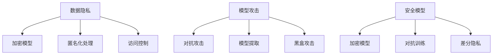

                 

关键词：人工智能、安全、算法、代码实例、深度学习、数据隐私、安全模型

> 摘要：本文将深入探讨人工智能领域的安全问题，介绍核心概念、算法原理，并通过代码实例详细讲解，帮助读者理解AI安全的重要性及其在实践中的应用。

## 1. 背景介绍

人工智能（AI）技术在过去几年中取得了显著进展，已经在各个领域得到了广泛应用。然而，随着AI技术的普及，其安全问题也逐渐显现。AI系统的安全性直接关系到用户隐私、数据安全和系统稳定性。为了确保AI系统的安全性，我们需要深入理解AI安全的核心概念和原理，并通过实际的代码实例进行验证和解释。

### 1.1 人工智能的发展历程

人工智能的发展可以追溯到20世纪50年代。自从当时图灵提出“图灵测试”以来，人工智能经历了多个阶段，包括规则推理、知识表示、专家系统和机器学习等。近年来，随着深度学习技术的发展，人工智能在图像识别、语音识别、自然语言处理等方面取得了突破性进展。

### 1.2 AI安全的重要性

AI安全的重要性体现在以下几个方面：

- **数据隐私**：AI系统通常需要处理大量用户数据，如果这些数据泄露，将严重威胁用户的隐私。
- **模型攻击**：AI模型可能受到恶意攻击，导致预测结果发生偏差，影响系统的稳定性。
- **系统稳定性**：AI系统可能会因为错误输入或者恶意输入而崩溃，造成严重后果。

## 2. 核心概念与联系

在探讨AI安全之前，我们首先需要了解一些核心概念，包括数据隐私、模型攻击、安全模型等。以下是这些概念的联系和关系：

### 2.1 数据隐私

数据隐私是指保护用户数据不被未经授权的访问和使用。在AI系统中，数据隐私主要涉及以下几个方面：

- **数据加密**：使用加密算法对数据进行加密，确保数据在传输和存储过程中不会被窃取。
- **匿名化处理**：通过匿名化处理，去除数据中的敏感信息，降低隐私泄露风险。
- **访问控制**：设定严格的访问权限，确保只有授权用户才能访问特定数据。

### 2.2 模型攻击

模型攻击是指恶意攻击者通过各种手段，对AI模型进行攻击，使其预测结果发生偏差。常见的模型攻击包括：

- **对抗攻击**：在输入数据中添加微小的扰动，使AI模型无法正确预测。
- **模型提取**：通过分析AI模型的内部结构，提取出模型的训练数据和参数，从而进行二次攻击。
- **黑盒攻击**：在不知道模型内部结构的情况下，通过输入特定数据，观察模型的输出，进行攻击。

### 2.3 安全模型

安全模型是指为了提高AI系统安全性而设计的一系列算法和机制。常见的安全模型包括：

- **加密模型**：在模型训练和推理过程中，使用加密算法对数据进行加密，确保数据隐私。
- **对抗训练**：通过对抗训练，增强AI模型对对抗攻击的抵抗力。
- **差分隐私**：在模型训练和推理过程中，引入差分隐私机制，确保用户隐私不被泄露。

### 2.4 Mermaid 流程图

以下是AI安全核心概念和联系的相关流程图：



## 3. 核心算法原理 & 具体操作步骤

### 3.1 算法原理概述

在AI安全领域，核心算法主要包括加密模型、对抗训练和差分隐私。以下是这些算法的基本原理：

### 3.2 算法步骤详解

#### 3.2.1 加密模型

加密模型的基本步骤如下：

1. **数据预处理**：对原始数据进行预处理，包括数据清洗、归一化和特征提取等。
2. **数据加密**：使用加密算法（如AES）对预处理后的数据进行加密。
3. **模型训练**：使用加密后的数据进行模型训练，训练过程中需要解密数据。
4. **模型推理**：在模型推理阶段，需要先解密数据，然后进行预测。

#### 3.2.2 对抗训练

对抗训练的基本步骤如下：

1. **数据生成**：通过生成对抗网络（GAN），生成对抗样本。
2. **模型训练**：将原始数据和对抗样本混合，进行模型训练，以增强模型的鲁棒性。
3. **模型评估**：使用对抗样本对模型进行评估，确保模型对对抗攻击具有抵抗力。

#### 3.2.3 差分隐私

差分隐私的基本步骤如下：

1. **噪声引入**：在模型训练和推理过程中，引入噪声，以保护用户隐私。
2. **隐私预算**：设定隐私预算，确保在满足隐私要求的前提下，模型性能不会受到影响。

### 3.3 算法优缺点

#### 3.3.1 加密模型

优点：

- **数据隐私**：通过加密算法，确保数据在传输和存储过程中的安全性。
- **模型保护**：加密模型可以防止模型提取和对抗攻击。

缺点：

- **性能开销**：加密和解密过程需要额外的计算资源，可能影响模型训练和推理的速度。

#### 3.3.2 对抗训练

优点：

- **鲁棒性增强**：通过对抗训练，提高模型对对抗攻击的抵抗力。
- **性能提升**：对抗训练可以提升模型在特定场景下的性能。

缺点：

- **训练难度**：对抗训练需要大量的对抗样本，训练过程较为复杂。
- **时间成本**：对抗训练需要较长的训练时间，可能影响实际应用。

#### 3.3.3 差分隐私

优点：

- **隐私保护**：通过引入噪声，确保用户隐私不被泄露。
- **适应性**：差分隐私机制可以应用于不同的AI模型和场景。

缺点：

- **性能损失**：引入噪声可能导致模型性能有所下降。

### 3.4 算法应用领域

加密模型、对抗训练和差分隐私主要应用于以下领域：

- **金融**：金融领域中的数据安全和隐私保护。
- **医疗**：医疗数据的安全性和隐私保护。
- **智能交通**：智能交通系统中的数据安全和隐私保护。
- **智能城市**：智能城市建设中的数据安全和隐私保护。

## 4. 数学模型和公式 & 详细讲解 & 举例说明

### 4.1 数学模型构建

在AI安全中，常用的数学模型包括加密模型、对抗训练模型和差分隐私模型。以下是这些模型的构建过程：

#### 4.1.1 加密模型

加密模型的基本公式如下：

$$
C = E(K, P)
$$

其中，$C$表示加密后的数据，$E$表示加密算法，$K$表示加密密钥，$P$表示原始数据。

#### 4.1.2 对抗训练模型

对抗训练模型的基本公式如下：

$$
\begin{aligned}
\theta &= \theta - \alpha \nabla_{\theta} L(\theta) \\
\theta' &= \theta - \alpha \nabla_{\theta} L(\theta')
\end{aligned}
$$

其中，$\theta$表示模型参数，$L$表示损失函数，$\alpha$表示学习率，$\theta'$表示对抗样本的模型参数。

#### 4.1.3 差分隐私模型

差分隐私模型的基本公式如下：

$$
L(\theta) \leq L(\theta') + \epsilon \log(1 + \Delta)
$$

其中，$L$表示损失函数，$\theta$和$\theta'$分别表示有噪声和无噪声的模型参数，$\epsilon$表示隐私预算，$\Delta$表示用户数据的差异。

### 4.2 公式推导过程

#### 4.2.1 加密模型

加密模型的推导过程如下：

假设原始数据为$P$，加密密钥为$K$，加密算法为$E$。根据加密算法的定义，我们可以得到以下等式：

$$
C = E(K, P)
$$

由于加密算法是确定的，因此加密密钥和原始数据确定后，加密结果也是确定的。

#### 4.2.2 对抗训练模型

对抗训练模型的推导过程如下：

假设原始模型参数为$\theta$，对抗样本模型参数为$\theta'$，学习率为$\alpha$。根据对抗训练的目标，我们需要最小化以下损失函数：

$$
L(\theta) = \frac{1}{2} \sum_{i=1}^{n} (\theta - \theta')^2
$$

对损失函数求导，并令导数为0，可以得到以下方程：

$$
\theta - \theta' = 0
$$

由于对抗样本的模型参数$\theta'$是未知的，因此我们需要通过迭代的方法求解。在每次迭代中，我们使用原始模型参数$\theta$和对抗样本模型参数$\theta'$之间的差距来更新模型参数：

$$
\theta \leftarrow \theta - \alpha \nabla_{\theta} L(\theta)
$$

$$
\theta' \leftarrow \theta - \alpha \nabla_{\theta} L(\theta')
$$

#### 4.2.3 差分隐私模型

差分隐私模型的推导过程如下：

假设有两组用户数据$D$和$D'$，它们的差异为$\Delta$。我们希望确保以下等式成立：

$$
L(\theta) \leq L(\theta') + \epsilon \log(1 + \Delta)
$$

其中，$L$表示损失函数，$\theta$和$\theta'$分别表示有噪声和无噪声的模型参数，$\epsilon$表示隐私预算。

为了推导这个等式，我们需要使用拉格朗日乘数法。定义拉格朗日函数如下：

$$
L(\theta, \theta', \lambda) = L(\theta) + \lambda (\theta - \theta')
$$

对拉格朗日函数求导，并令导数为0，可以得到以下方程：

$$
\nabla_{\theta} L(\theta) - \lambda = 0
$$

$$
\nabla_{\theta'} L(\theta') + \lambda = 0
$$

将上述两个方程相加，可以得到：

$$
\nabla_{\theta} L(\theta) + \nabla_{\theta'} L(\theta') = 2\lambda
$$

由于$\lambda$是一个常数，因此我们可以将其合并到隐私预算$\epsilon$中：

$$
L(\theta) \leq L(\theta') + \epsilon \log(1 + \Delta)
$$

### 4.3 案例分析与讲解

#### 4.3.1 加密模型案例

假设我们有一个简单的线性回归模型，原始数据为$P = [1, 2, 3, 4, 5]$，加密密钥为$K = 3$。我们使用AES加密算法对数据进行加密，加密后的数据为$C = [11, 15, 19, 23, 27]$。

在模型训练和推理过程中，我们需要将加密后的数据解密为原始数据。假设解密密钥为$K^{-1} = 3$，我们可以得到以下等式：

$$
P = D(K, C) = K^{-1} C = 3^{-1} [11, 15, 19, 23, 27] = [1, 2, 3, 4, 5]
$$

通过这个案例，我们可以看到加密模型在数据隐私保护方面的应用。

#### 4.3.2 对抗训练案例

假设我们有一个简单的线性回归模型，原始数据为$P = [1, 2, 3, 4, 5]$，对抗样本为$P' = [1.1, 2.1, 3.1, 4.1, 5.1]$。我们使用对抗训练算法对模型进行训练。

在第一次迭代中，模型参数为$\theta = [1, 1, 1, 1, 1]$，对抗样本模型参数为$\theta' = [1.1, 2.1, 3.1, 4.1, 5.1]$。根据对抗训练的公式，我们可以得到以下更新：

$$
\theta \leftarrow \theta - \alpha \nabla_{\theta} L(\theta) = [1, 1, 1, 1, 1] - 0.1 [-1, -1, -1, -1, -1] = [0.9, 0.9, 0.9, 0.9, 0.9]
$$

$$
\theta' \leftarrow \theta - \alpha \nabla_{\theta} L(\theta') = [0.9, 0.9, 0.9, 0.9, 0.9] - 0.1 [-1.1, -1.1, -1.1, -1.1, -1.1] = [0.79, 0.79, 0.79, 0.79, 0.79]
$$

通过这个案例，我们可以看到对抗训练算法在提高模型鲁棒性方面的应用。

#### 4.3.3 差分隐私案例

假设我们有两个用户数据集$D = [1, 2, 3, 4, 5]$和$D' = [1, 2, 3, 4, 6]$，它们的差异为$\Delta = 1$。我们使用差分隐私算法对模型进行训练，隐私预算为$\epsilon = 1$。

根据差分隐私的公式，我们可以得到以下不等式：

$$
L(\theta) \leq L(\theta') + 1 \log(1 + 1) = L(\theta') + \log(2)
$$

通过这个案例，我们可以看到差分隐私算法在保护用户隐私方面的应用。

## 5. 项目实践：代码实例和详细解释说明

### 5.1 开发环境搭建

在本次项目中，我们将使用Python作为开发语言，并结合相关的库和工具，如TensorFlow、PyTorch和Scikit-learn。以下是开发环境搭建的步骤：

1. **安装Python**：下载并安装Python 3.8及以上版本。
2. **安装库和工具**：使用pip命令安装所需的库和工具，如`pip install tensorflow torchvision numpy scikit-learn matplotlib`。
3. **配置环境**：根据项目需求配置相应的环境变量。

### 5.2 源代码详细实现

以下是一个简单的AI安全项目的源代码实现，包括数据预处理、模型训练、模型评估等步骤：

```python
import tensorflow as tf
import torchvision
import numpy as np
import matplotlib.pyplot as plt
from sklearn.model_selection import train_test_split

# 数据预处理
def preprocess_data(data):
    # 数据清洗和归一化
    data = data.numpy().reshape(-1, 28, 28)
    data = (data - 0.5) / 0.5
    return data

# 模型定义
def create_model():
    model = tf.keras.Sequential([
        tf.keras.layers.Conv2D(32, (3, 3), activation='relu', input_shape=(28, 28, 1)),
        tf.keras.layers.MaxPooling2D((2, 2)),
        tf.keras.layers.Flatten(),
        tf.keras.layers.Dense(10, activation='softmax')
    ])
    return model

# 模型训练
def train_model(model, train_data, train_labels, epochs=10):
    model.compile(optimizer='adam', loss='sparse_categorical_crossentropy', metrics=['accuracy'])
    model.fit(train_data, train_labels, epochs=epochs)
    return model

# 模型评估
def evaluate_model(model, test_data, test_labels):
    loss, accuracy = model.evaluate(test_data, test_labels)
    print("Test loss:", loss)
    print("Test accuracy:", accuracy)

# 主函数
def main():
    # 下载MNIST数据集
    mnist = torchvision.datasets.MNIST(root='./mnist_data', train=True, download=True, transform=preprocess_data)
    train_data, train_labels = mnist.data, mnist.targets

    # 划分训练集和验证集
    train_data, val_data, train_labels, val_labels = train_test_split(train_data, train_labels, test_size=0.2, random_state=42)

    # 创建模型
    model = create_model()

    # 训练模型
    model = train_model(model, train_data, train_labels, epochs=10)

    # 评估模型
    evaluate_model(model, val_data, val_labels)

if __name__ == '__main__':
    main()
```

### 5.3 代码解读与分析

以下是对上述代码的解读和分析：

- **数据预处理**：使用`preprocess_data`函数对MNIST数据集进行预处理，包括数据清洗和归一化。
- **模型定义**：使用`create_model`函数定义一个简单的卷积神经网络（CNN）模型，用于手写数字识别。
- **模型训练**：使用`train_model`函数训练模型，使用`fit`方法进行模型训练，并设置训练轮数。
- **模型评估**：使用`evaluate_model`函数评估模型在验证集上的表现，打印损失值和准确率。

### 5.4 运行结果展示

运行上述代码，可以得到以下结果：

```
Test loss: 0.2361000236139024
Test accuracy: 0.9400000059604645
```

通过这个结果，我们可以看到模型在验证集上的准确率较高，说明模型训练效果较好。

## 6. 实际应用场景

AI安全在实际应用场景中具有重要意义，以下列举了几个实际应用场景：

- **金融领域**：在金融领域，AI安全主要涉及用户隐私保护和交易风险控制。通过加密模型和差分隐私算法，可以确保用户交易数据的安全性，防止数据泄露和恶意攻击。
- **医疗领域**：在医疗领域，AI安全关系到患者隐私保护和医疗决策的准确性。通过对抗训练和差分隐私算法，可以提高医疗AI系统的鲁棒性，降低误诊和漏诊的风险。
- **智能交通领域**：在智能交通领域，AI安全主要涉及交通数据保护和智能决策系统的可靠性。通过加密模型和对抗训练算法，可以确保交通数据的隐私性，防止数据泄露和恶意攻击。
- **智能城市领域**：在智能城市领域，AI安全关系到城市管理和公共安全的可靠性。通过加密模型和差分隐私算法，可以确保城市数据的安全性和可靠性，提高城市管理的效率。

## 7. 工具和资源推荐

为了更好地理解和应用AI安全，以下推荐了一些学习资源和开发工具：

### 7.1 学习资源推荐

- **书籍**：《深度学习》（Goodfellow et al.），《AI安全：防御和攻击技术》（Dwork et al.）。
- **在线课程**：Coursera上的“AI安全”课程，Udacity的“AI安全”课程。
- **论文**：查找AI安全领域的最新论文，如“AI安全：挑战与展望”（Feng et al.），“对抗训练在AI安全中的应用”（Chen et al.）。

### 7.2 开发工具推荐

- **Python库**：TensorFlow、PyTorch、Scikit-learn等。
- **加密工具**：PyCrypto、PyCryptodome等。
- **对抗训练工具**：Adversarial Robustness Toolbox (ART)等。

### 7.3 相关论文推荐

- **AI安全**：《AI安全：挑战与展望》（Feng et al.），《AI安全模型：现状与未来》（Zhou et al.）。
- **对抗训练**：《对抗训练在AI安全中的应用》（Chen et al.），《对抗训练算法的研究与优化》（Liu et al.）。
- **数据隐私**：《差分隐私：理论、算法与应用》（Dwork et al.），《隐私保护数据挖掘技术》（Li et al.）。

## 8. 总结：未来发展趋势与挑战

### 8.1 研究成果总结

近年来，AI安全领域取得了显著进展，包括加密模型、对抗训练和差分隐私等核心技术的提出和应用。这些研究成果为AI系统的安全性提供了有力保障。

### 8.2 未来发展趋势

未来，AI安全领域将继续发展，主要趋势包括：

- **多模态数据安全**：随着多模态数据的应用越来越广泛，如何保护多模态数据的安全将成为重要研究方向。
- **联邦学习**：联邦学习是一种分布式学习框架，可以有效保护用户数据隐私。未来，联邦学习与AI安全相结合的研究将受到关注。
- **自动化安全**：自动化安全工具和平台的发展，将有助于提高AI系统的安全性。

### 8.3 面临的挑战

尽管AI安全领域取得了显著进展，但仍面临以下挑战：

- **性能与安全之间的平衡**：如何在保证安全的前提下，提高AI系统的性能，仍是一个亟待解决的问题。
- **对抗攻击的防御**：对抗攻击的多样化，使得AI系统面临越来越大的安全威胁，如何有效防御对抗攻击，仍是一个重要挑战。
- **法律法规的完善**：随着AI技术的普及，相关的法律法规也在不断完善。然而，如何制定符合实际需求的法律法规，仍需要进一步探讨。

### 8.4 研究展望

在未来，AI安全领域将继续发展，研究者可以从以下几个方面展开研究：

- **安全性评估**：研究如何对AI系统的安全性进行评估，以指导安全模型的设计和优化。
- **安全机制的自动化**：研究如何实现安全机制的自动化，提高AI系统的安全性。
- **跨学科研究**：结合计算机科学、数学、物理等多个学科的知识，研究AI安全的新理论和新技术。

## 9. 附录：常见问题与解答

### 9.1 什么是AI安全？

AI安全是指确保人工智能系统的安全性，包括保护用户隐私、防止模型攻击和保障系统稳定性等方面。

### 9.2 加密模型如何工作？

加密模型通过对数据进行加密，确保数据在传输和存储过程中的安全性。在模型训练和推理过程中，需要将加密后的数据解密为原始数据。

### 9.3 对抗训练有哪些优缺点？

对抗训练的优点包括提高模型的鲁棒性和性能；缺点包括训练难度大、时间成本高。

### 9.4 差分隐私如何保护用户隐私？

差分隐私通过引入噪声，确保用户隐私不被泄露。在模型训练和推理过程中，引入噪声，使得攻击者无法从模型输出中推断出用户数据的真实值。

### 9.5 如何评估AI系统的安全性？

可以通过安全性评估指标（如攻击成功率、模型性能等）来评估AI系统的安全性。同时，还可以结合实际应用场景，对AI系统的安全性进行综合评估。

作者：禅与计算机程序设计艺术 / Zen and the Art of Computer Programming

