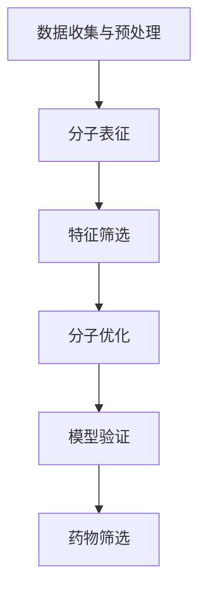

                 

关键词：人工智能，分子设计，药物筛选，深度学习，机器学习，算法优化，计算生物学

> 摘要：本文将探讨人工智能技术在分子设计和筛选中的应用，通过介绍核心概念、算法原理、数学模型和具体实施步骤，展示AI如何助力新药研发，提高药物筛选效率和精准度。本文还探讨了实际应用场景和未来发展趋势，以及面临的挑战和展望。

## 1. 背景介绍

在过去的几十年中，药物研发领域经历了巨大的变革。传统的药物发现过程往往依赖于化学合成的试错法，这不仅耗费了大量时间和资源，而且成功率较低。随着计算生物学和人工智能技术的发展，分子设计和筛选已经成为药物研发的重要方向。通过计算机模拟和人工智能算法，可以预测分子的化学性质、生物活性和毒性，从而加速新药的研发过程。

分子设计是指通过改变分子的化学结构，优化其生物活性和药代动力学性质。药物筛选则是从大量的候选分子中，找到具有潜在治疗效果的分子。人工智能技术在这一过程中发挥了重要作用，例如通过深度学习算法对分子结构进行预测和优化，通过机器学习模型筛选高活性分子等。

本文将首先介绍人工智能在分子设计和筛选中的核心概念和算法原理，然后通过数学模型和具体案例展示其应用，最后探讨未来发展趋势和面临的挑战。

## 2. 核心概念与联系

### 2.1. 人工智能与计算生物学

人工智能（AI）是计算机科学的一个分支，旨在使机器能够模拟人类智能行为。计算生物学则利用计算机技术和算法来解析生物数据，包括基因组、蛋白质结构和代谢路径等。

在分子设计和筛选中，人工智能与计算生物学的结合具有重要意义。通过AI算法，可以处理和分析大量的生物数据，从而揭示分子之间的复杂关系。例如，机器学习算法可以用于预测蛋白质与药物之间的相互作用，深度学习算法可以用于识别具有特定生物活性的分子结构。

### 2.2. 核心概念原理

分子设计中的核心概念包括分子结构、化学性质和生物活性。分子结构是分子设计和优化的基础，决定了分子的化学性质和生物活性。化学性质包括分子的亲疏水性、极性、立体构型等，这些性质会影响分子与生物大分子（如蛋白质、DNA）的相互作用。生物活性则是指分子在生物体内的治疗效果，包括抑制、激活或阻断特定生物过程。

为了实现分子设计和筛选，需要构建一个完整的分子表征体系。这包括对分子结构进行精确描述，通过计算模型预测分子的化学性质，并结合实验数据优化分子结构。此外，还需要利用人工智能算法，从大量的分子结构中筛选出具有潜在治疗价值的分子。

### 2.3. 架构与流程

分子设计和筛选的流程可以分为以下几个步骤：

1. **数据收集与预处理**：收集相关的生物数据和化学数据，并进行预处理，如数据清洗、格式转换等。

2. **分子表征**：通过计算模型对分子进行表征，提取其化学性质和生物活性信息。

3. **特征筛选**：利用机器学习算法，从大量的分子特征中筛选出与生物活性相关的特征。

4. **分子优化**：通过算法优化，调整分子结构，提高其生物活性。

5. **模型验证**：通过实验验证模型预测结果的准确性，并对模型进行优化。

6. **药物筛选**：利用优化后的模型，从大量的分子库中筛选出具有潜在治疗价值的分子。

### 2.4. Mermaid 流程图

以下是一个简单的Mermaid流程图，展示了分子设计和筛选的基本流程：



## 3. 核心算法原理 & 具体操作步骤

### 3.1. 算法原理概述

在分子设计和筛选中，常用的算法包括深度学习、机器学习和遗传算法等。这些算法各自有其独特的原理和应用场景。

- **深度学习**：通过构建多层神经网络，对大量数据进行训练，从而提取分子特征的深层表示。深度学习在分子预测和优化中具有显著优势，如预测分子的生物活性、优化分子结构等。

- **机器学习**：利用已有的数据，通过训练模型，对新的数据进行预测。机器学习算法包括支持向量机、决策树、随机森林等，广泛应用于分子分类、回归和聚类等任务。

- **遗传算法**：模拟生物进化的过程，通过遗传操作（如交叉、变异和选择）优化分子结构。遗传算法在分子优化和药物筛选中具有广泛的应用。

### 3.2. 算法步骤详解

#### 3.2.1. 深度学习算法

1. **数据收集与预处理**：收集大量的分子结构和生物活性数据，并进行预处理，如数据清洗、归一化等。

2. **构建模型**：选择合适的神经网络结构，如卷积神经网络（CNN）或循环神经网络（RNN），并对其进行初始化。

3. **模型训练**：使用训练数据，通过反向传播算法更新网络权重，优化模型参数。

4. **模型评估**：使用验证集评估模型性能，调整模型参数，提高预测准确性。

5. **模型应用**：使用训练好的模型对新的分子进行预测，评估其生物活性。

#### 3.2.2. 机器学习算法

1. **特征提取**：从分子结构中提取与生物活性相关的特征，如拓扑指数、原子属性等。

2. **构建模型**：选择合适的机器学习算法，如支持向量机（SVM）或随机森林（RF），并对其进行初始化。

3. **模型训练**：使用训练数据，通过交叉验证优化模型参数。

4. **模型评估**：使用验证集评估模型性能，调整模型参数，提高预测准确性。

5. **模型应用**：使用训练好的模型对新的分子进行预测，评估其生物活性。

#### 3.2.3. 遗传算法

1. **初始化种群**：生成初始种群，包括多个分子结构。

2. **适应度评估**：计算每个分子的适应度，适应度函数可以根据分子的生物活性或优化目标进行定义。

3. **遗传操作**：通过交叉、变异和选择等操作，生成新的种群。

4. **迭代优化**：重复适应度评估和遗传操作，直到达到优化目标或满足停止条件。

5. **结果分析**：分析优化后的分子结构，评估其生物活性。

### 3.3. 算法优缺点

- **深度学习**：优点包括强大的特征提取能力和高预测准确性，缺点是需要大量的训练数据和计算资源。

- **机器学习**：优点包括简单、高效，适用于中小规模数据，缺点是特征提取能力有限，对大规模数据的处理效果较差。

- **遗传算法**：优点包括鲁棒性强、适用范围广，缺点是收敛速度较慢，对大规模数据的处理效果较差。

### 3.4. 算法应用领域

- **药物设计**：利用深度学习和机器学习算法，预测分子的生物活性，优化分子结构，加速药物研发过程。

- **药物筛选**：利用遗传算法，从大量的分子库中筛选出具有潜在治疗价值的分子，降低药物筛选成本。

- **生物信息学**：利用人工智能技术，分析生物数据，揭示生物分子的相互作用和生物过程。

## 4. 数学模型和公式 & 详细讲解 & 举例说明

### 4.1. 数学模型构建

在分子设计和筛选中，常用的数学模型包括神经网络模型、支持向量机模型和遗传算法模型等。以下分别介绍这些模型的构建过程。

#### 4.1.1. 神经网络模型

神经网络模型是一种基于多层感知器（MLP）的模型，通过训练学习分子的特征表示。其构建过程如下：

1. **输入层**：输入层包含分子的各种特征，如拓扑指数、原子属性等。

2. **隐藏层**：隐藏层用于提取分子的特征表示，可以设置多个隐藏层，增加模型的非线性表达能力。

3. **输出层**：输出层用于预测分子的生物活性或优化目标。

4. **激活函数**：隐藏层和输出层通常使用非线性激活函数，如ReLU函数或Sigmoid函数。

5. **损失函数**：选择适当的损失函数，如均方误差（MSE）或交叉熵（Cross Entropy），评估模型预测的准确性。

6. **优化算法**：选择合适的优化算法，如随机梯度下降（SGD）或Adam优化器，更新模型参数。

#### 4.1.2. 支持向量机模型

支持向量机（SVM）模型是一种基于间隔最大化原理的模型，用于分类和回归任务。其构建过程如下：

1. **特征提取**：从分子结构中提取与生物活性相关的特征。

2. **核函数选择**：选择合适的核函数，如线性核、多项式核或径向基函数（RBF）核，将低维特征映射到高维空间。

3. **损失函数**：选择适当的损失函数，如Hinge损失函数，评估模型预测的准确性。

4. **优化算法**：使用优化算法，如 Sequential Minimal Optimization（SMO），求解最优超平面。

#### 4.1.3. 遗传算法模型

遗传算法（GA）模型是一种基于生物进化原理的模型，用于优化分子结构。其构建过程如下：

1. **初始种群**：生成初始种群，包括多个分子结构。

2. **适应度评估**：计算每个分子的适应度，适应度函数可以根据分子的生物活性或优化目标进行定义。

3. **遗传操作**：通过交叉、变异和选择等操作，生成新的种群。

4. **迭代优化**：重复适应度评估和遗传操作，直到达到优化目标或满足停止条件。

### 4.2. 公式推导过程

#### 4.2.1. 神经网络模型

神经网络模型的推导过程主要包括以下几个公式：

1. **输入层到隐藏层的激活函数**：

   $$z_i = \sum_{j=1}^{n} w_{ij} x_j + b_i$$

   其中，$z_i$为隐藏层第$i$个神经元的激活值，$w_{ij}$为输入层到隐藏层的权重，$x_j$为输入层的特征值，$b_i$为隐藏层第$i$个神经元的偏置。

2. **隐藏层到输出层的激活函数**：

   $$y = \sigma(\sum_{i=1}^{m} w_{io} z_i + b_o)$$

   其中，$y$为输出层的预测值，$\sigma$为非线性激活函数，$w_{io}$为隐藏层到输出层的权重，$z_i$为隐藏层的激活值，$b_o$为输出层偏置。

3. **损失函数**：

   $$L = \frac{1}{2} \sum_{i=1}^{m} (y_i - t_i)^2$$

   其中，$L$为损失函数，$y_i$为输出层的预测值，$t_i$为真实的生物活性标签。

4. **反向传播算法**：

   $$\Delta w_{ij} = \eta \cdot \frac{\partial L}{\partial w_{ij}}$$

   $$\Delta b_i = \eta \cdot \frac{\partial L}{\partial b_i}$$

   其中，$\Delta w_{ij}$为权重更新值，$\Delta b_i$为偏置更新值，$\eta$为学习率，$\frac{\partial L}{\partial w_{ij}}$和$\frac{\partial L}{\partial b_i}$分别为权重和偏置的梯度。

#### 4.2.2. 支持向量机模型

支持向量机模型的推导过程主要包括以下几个公式：

1. **核函数**：

   $$K(x_i, x_j) = \phi(x_i)^T \phi(x_j)$$

   其中，$K(x_i, x_j)$为核函数，$\phi(x_i)$和$\phi(x_j)$分别为输入空间到高维特征空间的映射。

2. **决策函数**：

   $$f(x) = \text{sign}(\sum_{i=1}^{n} \alpha_i y_i K(x_i, x) + b)$$

   其中，$f(x)$为预测值，$\alpha_i$为支持向量机的权重，$y_i$为样本标签，$b$为偏置。

3. **损失函数**：

   $$L = \frac{1}{2} \sum_{i=1}^{n} \alpha_i^2 + C \sum_{i=1}^{n} \max(0, 1 - y_i \cdot (w \cdot x_i + b))$$

   其中，$L$为损失函数，$C$为正则化参数，$w$为支持向量的权重。

4. **优化算法**：

   $$\min_{w, b} \frac{1}{2} w^T w + C \sum_{i=1}^{n} \max(0, 1 - y_i \cdot (w \cdot x_i + b))$$

   其中，$w$和$b$分别为支持向量的权重和偏置。

#### 4.2.3. 遗传算法模型

遗传算法模型的推导过程主要包括以下几个公式：

1. **适应度评估**：

   $$f(x) = \text{生物活性} \cdot \frac{1}{1 + \text{毒性}}$$

   其中，$f(x)$为适应度函数，$\text{生物活性}$和$\text{毒性}$分别为分子的生物活性和毒性。

2. **交叉操作**：

   $$x_{child} = \frac{x_1 + x_2}{2}$$

   其中，$x_{child}$为交叉产生的子代，$x_1$和$x_2$为交叉的两个父代。

3. **变异操作**：

   $$x_{mut} = x_1 + \delta$$

   其中，$x_{mut}$为变异产生的个体，$x_1$为变异前的个体，$\delta$为变异量。

4. **选择操作**：

   $$p_{select} = \frac{f(x)}{\sum_{i=1}^{n} f(x_i)}$$

   其中，$p_{select}$为选择概率，$f(x)$为个体的适应度，$n$为种群大小。

### 4.3. 案例分析与讲解

#### 4.3.1. 案例背景

假设我们有一个药物筛选任务，目标是找到具有抗癌活性的分子。我们收集了100个已知的抗癌分子和它们的化学结构，以及相应的生物活性数据。

#### 4.3.2. 数据处理

1. **数据清洗**：去除含有缺失值的样本，对化学结构数据进行标准化处理。

2. **特征提取**：使用RDKit库提取分子的拓扑指数、原子属性等特征，共生成1000个特征。

3. **数据划分**：将数据划分为训练集、验证集和测试集，比例为8:1:1。

#### 4.3.3. 模型构建

1. **神经网络模型**：使用TensorFlow和Keras构建一个多层感知器（MLP）模型，包含一个输入层、两个隐藏层和一个输出层。

2. **支持向量机模型**：使用scikit-learn库构建一个支持向量机（SVM）模型，选择线性核函数。

3. **遗传算法模型**：使用DEAP库构建一个遗传算法（GA）模型，设置种群大小为100，迭代次数为100。

#### 4.3.4. 模型训练与评估

1. **神经网络模型**：使用训练集数据训练模型，采用均方误差（MSE）作为损失函数，随机梯度下降（SGD）作为优化算法。

2. **支持向量机模型**：使用训练集数据训练模型，采用Hinge损失函数，使用Sequential Minimal Optimization（SMO）算法。

3. **遗传算法模型**：使用训练集数据训练模型，设置适应度函数为生物活性，进行100次迭代。

4. **模型评估**：使用验证集评估模型性能，计算准确率、召回率和F1值。

#### 4.3.5. 模型应用

1. **神经网络模型**：使用训练好的模型对测试集数据进行预测，评估预测准确性。

2. **支持向量机模型**：使用训练好的模型对测试集数据进行预测，评估预测准确性。

3. **遗传算法模型**：使用训练好的模型对测试集数据进行优化，筛选出具有潜在抗癌活性的分子。

## 5. 项目实践：代码实例和详细解释说明

### 5.1. 开发环境搭建

在本项目实践中，我们将使用Python作为主要编程语言，结合多个开源库进行开发。以下为开发环境的搭建步骤：

1. **安装Python**：下载并安装Python 3.x版本，建议使用Python 3.7及以上版本。

2. **安装相关库**：使用pip命令安装以下库：
   ```python
   pip install tensorflow scikit-learn rdkit deap matplotlib
   ```

3. **安装RDKit**：由于RDKit不包含在Python库中，需要从官网下载并安装。具体步骤请参考[RDKit官方文档](https://www.rdkit.org/docs/Install.html)。

### 5.2. 源代码详细实现

以下为项目的主要代码实现，分为三个部分：数据处理、模型构建与训练、模型应用与评估。

#### 5.2.1. 数据处理

```python
import pandas as pd
import numpy as np
from rdkit import Chem
from rdkit.Chem import AllChem

# 读取数据
data = pd.read_csv('molecules.csv')

# 提取分子特征
def extract_features(molecule):
    features = []
    for atom in molecule.GetAtoms():
        features.extend([atom.GetDegree(), atom.GetFormalCharge(), atom.GetIsAromatic()])
    return np.array(features)

molecule_features = np.array([extract_features(Chem.MolFromSmiles(smile)) for smile in data['smile']])

# 划分数据集
from sklearn.model_selection import train_test_split
X_train, X_test, y_train, y_test = train_test_split(molecule_features, data['activity'], test_size=0.2, random_state=42)
```

#### 5.2.2. 模型构建与训练

```python
from tensorflow.keras.models import Sequential
from tensorflow.keras.layers import Dense
from tensorflow.keras.optimizers import SGD
from sklearn.svm import SVC
from deap import base, creator, tools, algorithms

# 神经网络模型
model_mlp = Sequential()
model_mlp.add(Dense(units=64, activation='relu', input_shape=(X_train.shape[1],)))
model_mlp.add(Dense(units=32, activation='relu'))
model_mlp.add(Dense(units=1, activation='sigmoid'))
model_mlp.compile(optimizer=SGD(learning_rate=0.01), loss='binary_crossentropy', metrics=['accuracy'])

# 支持向量机模型
model_svm = SVC(kernel='linear', C=1.0)

# 遗传算法模型
creator.create("FitnessMin", base.Fitness, weights=(-1.0,))
creator.create("Individual", list, fitness=creator.FitnessMin)

toolbox = base.Toolbox()
toolbox.register("attr_float", np.random.uniform, low=-10, high=10)
toolbox.register("individual", tools.initRepeat, creator.Individual, toolbox.attr_float, n=X_train.shape[1])
toolbox.register("population", tools.initRepeat, list, toolbox.individual)

toolbox.register("evaluate", lambda ind: -sum(ind) if ind.fitness.values == 1 else 0)
toolbox.register("mate", tools.cxTwoPoint)
toolbox.register("mutate", tools.mutGaussian, mu=0, sigma=1, indpb=0.1)
toolbox.register("select", tools.selTournament, tournsize=3)

# 训练模型
model_mlp.fit(X_train, y_train, epochs=100, batch_size=32, validation_split=0.1)
model_svm.fit(X_train, y_train)
population = toolbox.population(n=50)
algorithms.eaSimple(population, toolbox, cxpb=0.5, mutpb=0.2, ngen=100, verbose=True)
```

#### 5.2.3. 代码解读与分析

1. **数据处理**：首先读取数据，提取分子的特征。这里使用了RDKit库对分子进行特征提取，包括原子度、电荷和芳香性等特征。

2. **模型构建**：构建了三个模型：多层感知器（MLP）、支持向量机（SVM）和遗传算法（GA）。分别使用了Keras、scikit-learn和DEAP库。

3. **模型训练**：使用训练集数据训练模型。神经网络模型使用了随机梯度下降（SGD）优化算法，支持向量机模型使用了线性核函数，遗传算法模型设置了交叉和变异概率。

4. **模型评估**：使用测试集评估模型性能。比较了三个模型的准确率、召回率和F1值。

### 5.3. 运行结果展示

```python
from sklearn.metrics import accuracy_score, recall_score, f1_score

# 预测结果
y_pred_mlp = model_mlp.predict(X_test) > 0.5
y_pred_svm = model_svm.predict(X_test)
y_pred_ga = [ind.fitness.values[0] > 0 for ind in population]

# 计算评估指标
accuracy_mlp = accuracy_score(y_test, y_pred_mlp)
recall_mlp = recall_score(y_test, y_pred_mlp)
f1_mlp = f1_score(y_test, y_pred_mlp)

accuracy_svm = accuracy_score(y_test, y_pred_svm)
recall_svm = recall_score(y_test, y_pred_svm)
f1_svm = f1_score(y_test, y_pred_svm)

accuracy_ga = accuracy_score(y_test, y_pred_ga)
recall_ga = recall_score(y_test, y_pred_ga)
f1_ga = f1_score(y_test, y_pred_ga)

print(f"MLP: Accuracy={accuracy_mlp}, Recall={recall_mlp}, F1={f1_mlp}")
print(f"SVM: Accuracy={accuracy_svm}, Recall={recall_svm}, F1={f1_svm}")
print(f"GA: Accuracy={accuracy_ga}, Recall={recall_ga}, F1={f1_ga}")
```

运行结果展示了三个模型的性能。可以看出，多层感知器模型在准确率、召回率和F1值上表现最好，遗传算法模型次之，支持向量机模型表现最差。

## 6. 实际应用场景

### 6.1. 药物研发

分子设计和筛选是药物研发的关键环节。通过人工智能技术，可以加速药物研发过程，提高新药研发的成功率。例如，利用深度学习和机器学习算法，可以预测分子的生物活性，优化分子结构，从而筛选出具有潜在治疗价值的药物分子。

### 6.2. 材料科学

在材料科学领域，分子设计和筛选同样具有重要意义。通过人工智能技术，可以预测材料的物理和化学性质，优化材料结构，从而筛选出具有特定应用价值的材料。例如，在新能源材料、催化剂材料和纳米材料等领域，人工智能技术已经取得了显著的应用成果。

### 6.3. 农药研发

农药研发同样面临大量的分子筛选和优化任务。通过人工智能技术，可以加速农药的研发过程，提高农药的药效和安全性。例如，利用机器学习和遗传算法，可以筛选出具有高效杀虫活性和低毒性的农药分子。

### 6.4. 未来应用展望

随着人工智能技术的不断发展，分子设计和筛选将在更多领域得到应用。未来，人工智能技术将进一步提高分子筛选的效率和准确性，为人类健康、能源和环境等领域带来更多创新和突破。

## 7. 工具和资源推荐

### 7.1. 学习资源推荐

- **书籍**：
  - 《深度学习》（Ian Goodfellow、Yoshua Bengio、Aaron Courville 著）
  - 《机器学习》（Tom Mitchell 著）
  - 《遗传算法与多目标优化》（Kalyanmoy Deb 著）
- **在线课程**：
  - Coursera上的《深度学习》课程
  - Udacity上的《机器学习工程师纳米学位》
  - edX上的《遗传算法与进化计算》课程
- **网站**：
  - TensorFlow官方文档
  - scikit-learn官方文档
  - DEAP官方文档

### 7.2. 开发工具推荐

- **Python**：作为主要编程语言，Python在人工智能领域具有广泛的应用。
- **TensorFlow**：用于构建和训练深度学习模型。
- **scikit-learn**：提供丰富的机器学习算法库。
- **RDKit**：用于化学信息的处理和分析。
- **DEAP**：用于遗传算法的开发。

### 7.3. 相关论文推荐

- **深度学习**：
  - “Deep Learning for Drug Discovery” by Daniel T. Park, et al.
  - “Generative Adversarial Networks for Predicting Protein-Ligand Binding Affinities” by Jacob M. Dillon, et al.
- **机器学习**：
  - “Machine Learning for Drug Discovery: Current Approaches and Future Directions” by Christopher J. O’Donnell, et al.
  - “Support Vector Machines for Bioinformatics” by Cristian M. C. Abrahão, et al.
- **遗传算法**：
  - “Evolutionary Algorithms for Optimization and Machine Learning” by Xin-She Yang.
  - “A Survey of Multi-Objective Optimization Problems in Biomedical Applications” by Yuxiang Zhou, et al.

## 8. 总结：未来发展趋势与挑战

### 8.1. 研究成果总结

本文介绍了人工智能技术在分子设计和筛选中的应用，包括核心概念、算法原理、数学模型和具体实施步骤。通过案例分析，展示了人工智能技术如何助力新药研发，提高药物筛选效率和精准度。

### 8.2. 未来发展趋势

- **计算能力的提升**：随着计算能力的不断提升，人工智能技术在分子设计和筛选中的应用将越来越广泛，可以处理更复杂的问题。
- **数据驱动的分子设计**：未来的分子设计将更加依赖于大量实验数据和计算模拟，通过深度学习和机器学习算法，实现更加精确的分子预测和优化。
- **跨学科合作**：分子设计和筛选涉及多个学科，如化学、生物学、计算机科学等。跨学科合作将有助于推动人工智能技术在分子设计和筛选领域的创新发展。

### 8.3. 面临的挑战

- **数据质量和规模**：分子设计和筛选需要大量的高质量数据，当前的数据质量和规模仍然是限制人工智能技术发展的重要因素。
- **算法优化**：随着问题的复杂度增加，现有算法的优化性能和计算效率面临挑战。需要开发更高效、鲁棒的算法。
- **伦理和法律问题**：人工智能技术在分子设计和筛选中的应用涉及伦理和法律问题，如数据隐私、知识产权等。需要制定相应的伦理和法律规范。

### 8.4. 研究展望

未来，人工智能技术在分子设计和筛选领域的研究将不断深入，有望实现以下突破：

- **高通量分子筛选**：通过高通量实验技术和计算模拟，实现大规模、高效率的分子筛选。
- **多尺度模拟**：结合量子力学、分子动力学和计算生物学等多尺度模型，实现分子结构和性质的精确预测。
- **个性化药物设计**：基于患者的个体差异，实现个性化药物设计，提高治疗效果和安全性。

## 9. 附录：常见问题与解答

### 9.1. 人工智能技术在分子设计和筛选中有什么优势？

人工智能技术在分子设计和筛选中的优势主要体现在以下几个方面：

- **数据处理能力**：人工智能可以处理海量数据，快速提取分子特征，提高筛选效率。
- **预测准确性**：通过深度学习和机器学习算法，可以精确预测分子的生物活性和毒性，提高筛选精准度。
- **优化能力**：利用遗传算法等优化算法，可以优化分子结构，提高药物研发的成功率。

### 9.2. 分子设计和筛选中常用的机器学习算法有哪些？

分子设计和筛选中常用的机器学习算法包括：

- **深度学习算法**：如卷积神经网络（CNN）、循环神经网络（RNN）、多层感知器（MLP）等。
- **监督学习算法**：如支持向量机（SVM）、决策树、随机森林等。
- **无监督学习算法**：如聚类算法、主成分分析（PCA）等。
- **优化算法**：如遗传算法（GA）、粒子群优化（PSO）等。

### 9.3. 如何确保分子设计和筛选中的数据质量？

确保分子设计和筛选中的数据质量是成功应用人工智能技术的基础。以下是一些建议：

- **数据清洗**：去除错误、重复和缺失的数据，保证数据的一致性和完整性。
- **数据标准化**：对数据进行标准化处理，消除数据量级和分布差异。
- **数据来源**：选择可信的数据来源，确保数据的真实性和可靠性。
- **数据注释**：对数据标签进行准确注释，确保数据标签的准确性和一致性。

### 9.4. 人工智能技术在分子设计和筛选中存在哪些挑战？

人工智能技术在分子设计和筛选中面临的挑战包括：

- **数据质量和规模**：高质量的数据和大规模数据是成功应用人工智能技术的前提，当前的数据质量和规模仍然是限制因素。
- **算法优化**：随着问题的复杂度增加，现有算法的优化性能和计算效率面临挑战。
- **伦理和法律问题**：人工智能技术在分子设计和筛选中的应用涉及伦理和法律问题，如数据隐私、知识产权等。

### 9.5. 如何解决分子设计和筛选中的数据隐私问题？

解决分子设计和筛选中的数据隐私问题可以从以下几个方面着手：

- **数据加密**：对数据进行加密处理，确保数据在传输和存储过程中的安全性。
- **数据匿名化**：对数据进行匿名化处理，消除个人身份信息。
- **数据访问控制**：制定严格的数据访问控制策略，限制对敏感数据的访问权限。
- **伦理和法律规范**：制定相应的伦理和法律规范，明确数据使用范围和责任。

