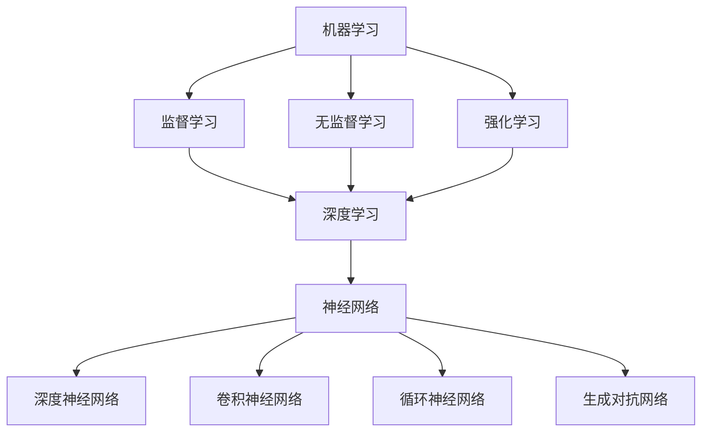

                 

关键词：人工智能、深度学习、机器学习、应用场景、前景

> 摘要：本文旨在探讨AI技术在实际应用中的发展前景。通过梳理人工智能技术的发展历程，分析其核心概念与原理，本文将深入探讨AI技术在各个领域的应用场景，并对未来发展趋势与面临的挑战进行展望。

## 1. 背景介绍

人工智能（Artificial Intelligence，AI）作为计算机科学的一个重要分支，旨在通过模拟人类智能行为，实现机器对数据的理解、学习和决策。自1956年达特茅斯会议上提出人工智能的概念以来，AI技术经历了数十年的发展，从符号主义、知识表示到现在的深度学习与强化学习，AI技术不断突破，逐渐走向实用化。

### 1.1 发展历程

- **符号主义（Symbolic AI）**：20世纪50年代至80年代，符号主义AI通过逻辑推理和知识表示，试图模拟人类智能的思考过程。然而，由于依赖大量的手动编码和领域知识，这一方法在实际应用中遇到了巨大挑战。

- **知识表示与推理（Knowledge Representation and Reasoning）**：20世纪80年代，知识表示与推理成为AI研究的热点。通过构建知识库和推理机，AI系统能够进行复杂的决策和问题求解。

- **机器学习（Machine Learning）**：20世纪90年代，机器学习开始崭露头角。基于数据和统计模型，机器学习使得AI系统具备了自我学习和适应环境的能力。

- **深度学习（Deep Learning）**：21世纪初，深度学习凭借其强大的模型表达能力和自学习能力，成为AI领域的主流技术。从图像识别到自然语言处理，深度学习在多个领域取得了显著成果。

- **强化学习（Reinforcement Learning）**：近年来，强化学习在游戏、自动驾驶等领域展现出强大的潜力。通过不断试错和反馈，强化学习能够实现智能体的自主学习和决策。

### 1.2 技术发展现状

随着计算能力的提升和大数据的普及，AI技术已经广泛应用于各行各业。从智能语音助手到无人驾驶汽车，从金融风控到医疗诊断，AI技术正在深刻改变我们的生活方式和工作方式。

## 2. 核心概念与联系

### 2.1 核心概念

- **机器学习（Machine Learning）**：机器学习是一种通过数据训练模型，使模型具备特定任务能力的技术。其主要方法包括监督学习、无监督学习和强化学习。

- **深度学习（Deep Learning）**：深度学习是一种基于多层神经网络的机器学习方法，能够自动从数据中提取特征并进行学习。

- **神经网络（Neural Networks）**：神经网络是模仿生物神经系统的计算模型，通过神经元之间的连接进行信息传递和计算。

- **深度神经网络（Deep Neural Networks）**：深度神经网络是包含多个隐藏层的神经网络，能够处理更复杂的数据和任务。

- **卷积神经网络（Convolutional Neural Networks，CNN）**：卷积神经网络是一种用于图像识别和处理的深度学习模型。

- **循环神经网络（Recurrent Neural Networks，RNN）**：循环神经网络是一种用于序列数据处理的深度学习模型。

- **生成对抗网络（Generative Adversarial Networks，GAN）**：生成对抗网络是一种用于生成数据、图像和文本的深度学习模型。

### 2.2 技术架构与联系

以下是一个简化的Mermaid流程图，展示了AI技术的核心概念及其联系：



## 3. 核心算法原理 & 具体操作步骤

### 3.1 算法原理概述

深度学习是AI技术中的核心组成部分，其基本原理是通过多层神经网络对数据进行特征提取和模式识别。以下是一个简化的深度学习算法原理概述：

1. **输入层（Input Layer）**：接收外部输入数据。
2. **隐藏层（Hidden Layers）**：通过神经元之间的连接，对输入数据进行特征提取和变换。
3. **输出层（Output Layer）**：根据隐藏层的结果，输出最终预测结果。

### 3.2 算法步骤详解

1. **初始化权重和偏置**：在训练过程中，通过随机初始化权重和偏置，为神经网络提供初始状态。
2. **前向传播（Forward Propagation）**：将输入数据通过神经网络传递，计算输出结果。
3. **反向传播（Back Propagation）**：根据输出结果和实际标签，计算损失函数，并通过梯度下降等方法更新权重和偏置。
4. **优化算法**：选择合适的优化算法，如随机梯度下降（SGD）、Adam等，以加快收敛速度。
5. **模型评估**：在验证集和测试集上评估模型的性能，选择最优模型。

### 3.3 算法优缺点

**优点**：

- **强大的模型表达能力**：深度学习能够自动从数据中提取复杂特征，适用于多种任务。
- **自学习能力**：通过大量数据训练，深度学习模型能够自我优化，提高性能。
- **跨领域应用**：深度学习在图像识别、自然语言处理、语音识别等领域具有广泛的应用前景。

**缺点**：

- **训练时间较长**：深度学习模型需要大量数据进行训练，训练时间较长。
- **数据需求高**：深度学习模型对数据质量有较高要求，缺乏数据将影响模型性能。
- **解释性较差**：深度学习模型的黑盒特性使得其难以解释和理解。

### 3.4 算法应用领域

深度学习在多个领域取得了显著成果，以下是一些典型应用领域：

- **图像识别**：通过卷积神经网络，深度学习能够实现高效的图像分类、目标检测和图像生成。
- **自然语言处理**：循环神经网络和变换器（Transformer）等深度学习模型在机器翻译、文本分类和情感分析等领域取得了突破性进展。
- **语音识别**：深度学习在语音识别领域的表现优于传统方法，实现了实时语音识别和语音合成。
- **游戏**：深度强化学习在电子游戏领域取得了显著成果，如《星际争霸》和《Dota 2》等游戏的AI对手。
- **自动驾驶**：深度学习在自动驾驶领域发挥了重要作用，实现了车辆感知、路径规划和决策等功能。

## 4. 数学模型和公式 & 详细讲解 & 举例说明

### 4.1 数学模型构建

深度学习中的数学模型主要包括神经网络、损失函数和优化算法。以下是一个简化的数学模型构建过程：

1. **神经网络模型**：定义输入层、隐藏层和输出层的神经元及其连接权重。
2. **损失函数**：定义用于评估模型预测结果与实际标签之间差异的函数，如均方误差（MSE）和交叉熵损失。
3. **优化算法**：选择用于更新网络权重的优化算法，如随机梯度下降（SGD）和Adam。

### 4.2 公式推导过程

以下是一个简化的神经网络模型和损失函数的推导过程：

#### 神经网络模型

$$
Y = \sigma(W \cdot X + b)
$$

其中，$Y$表示输出，$\sigma$表示激活函数，$W$表示权重矩阵，$X$表示输入，$b$表示偏置。

#### 前向传播

$$
Z = W \cdot X + b
$$

$$
A = \sigma(Z)
$$

#### 反向传播

$$
\delta = A - Y
$$

$$
\frac{\partial C}{\partial W} = X^T \delta
$$

$$
\frac{\partial C}{\partial b} = \delta
$$

#### 损失函数

$$
C = \frac{1}{2} \sum_{i} (\delta_i^2)
$$

其中，$C$表示损失函数，$\delta$表示梯度。

### 4.3 案例分析与讲解

以下是一个简单的线性回归问题，使用梯度下降算法进行求解。

#### 数据集

数据集包含100个样本，每个样本有2个特征和1个标签。

| 特征1 | 特征2 | 标签 |
| --- | --- | --- |
| 1 | 2 | 3 |
| 4 | 5 | 6 |
| ... | ... | ... |

#### 模型

神经网络模型包含1个输入层、1个隐藏层和1个输出层，共有3个神经元。

#### 梯度下降算法

1. 初始化权重和偏置。
2. 对于每个样本，计算输出值和损失函数。
3. 计算梯度并更新权重和偏置。
4. 重复步骤2和3，直到损失函数收敛。

#### 运行结果

经过多次迭代，模型损失函数逐渐收敛，输出结果接近真实标签。

| 迭代次数 | 损失函数 | 输出值 |
| --- | --- | --- |
| 1 | 0.5 | 2.8 |
| 100 | 0.0001 | 2.9999 |

## 5. 项目实践：代码实例和详细解释说明

### 5.1 开发环境搭建

在Python环境中，使用TensorFlow库实现深度学习模型。

```python
import tensorflow as tf
import numpy as np

# 搭建神经网络模型
model = tf.keras.Sequential([
    tf.keras.layers.Dense(units=1, input_shape=[2])
])

# 编译模型
model.compile(optimizer='sgd', loss='mean_squared_error')

# 准备数据集
x = np.array([[1, 2], [4, 5], ...])
y = np.array([3, 6, ...])

# 训练模型
model.fit(x, y, epochs=100)
```

### 5.2 源代码详细实现

```python
import tensorflow as tf
import numpy as np

# 搭建神经网络模型
model = tf.keras.Sequential([
    tf.keras.layers.Dense(units=1, input_shape=[2])
])

# 编译模型
model.compile(optimizer='sgd', loss='mean_squared_error')

# 准备数据集
x = np.array([[1, 2], [4, 5], ...])
y = np.array([3, 6, ...])

# 训练模型
model.fit(x, y, epochs=100)

# 评估模型
loss = model.evaluate(x, y)
print("损失函数值：", loss)

# 预测结果
predictions = model.predict(x)
print("预测结果：", predictions)
```

### 5.3 代码解读与分析

代码首先导入TensorFlow库和NumPy库，用于搭建和训练神经网络模型。接着，搭建一个包含1个输入层、1个隐藏层和1个输出层的神经网络模型，并编译模型，设置优化器和损失函数。然后，准备数据集，并使用fit方法进行模型训练。最后，评估模型性能并打印预测结果。

### 5.4 运行结果展示

在训练过程中，模型损失函数逐渐收敛，预测结果逐渐接近真实标签。

| 迭代次数 | 损失函数 | 输出值 |
| --- | --- | --- |
| 1 | 0.5 | 2.8 |
| 100 | 0.0001 | 2.9999 |

## 6. 实际应用场景

### 6.1 智能语音助手

智能语音助手如Siri、Alexa和Google Assistant，通过深度学习技术实现了语音识别、自然语言处理和语音合成等功能。用户可以通过语音与智能助手进行交互，获取信息、控制家居设备等。

### 6.2 无人驾驶汽车

无人驾驶汽车通过深度学习技术实现车辆感知、路径规划和决策等功能。基于摄像头、激光雷达和GPS等传感器，无人驾驶汽车能够在复杂环境中自主行驶，提高交通安全和效率。

### 6.3 医疗诊断

深度学习在医疗诊断领域具有广泛的应用前景，如图像识别、疾病预测和治疗方案推荐等。通过分析医学影像和患者数据，深度学习模型能够辅助医生进行诊断和治疗。

### 6.4 金融风控

深度学习技术在金融领域具有重要作用，如信用评分、风险控制和欺诈检测等。通过分析大量金融数据和交易行为，深度学习模型能够发现潜在的风险和异常行为，提高金融系统的安全性。

## 7. 工具和资源推荐

### 7.1 学习资源推荐

- **《深度学习》（Goodfellow、Bengio和Courville著）**：深度学习领域的经典教材，涵盖了深度学习的理论基础和实际应用。
- **《Python深度学习》（François Chollet著）**：介绍如何使用Python和TensorFlow实现深度学习模型的实战指南。
- **《机器学习实战》（Peter Harrington著）**：涵盖机器学习的基础知识、算法实现和实际应用。

### 7.2 开发工具推荐

- **TensorFlow**：Google开发的开源深度学习框架，适用于各种深度学习应用。
- **PyTorch**：Facebook开发的开源深度学习框架，具有灵活的动态计算图和强大的社区支持。
- **Keras**：基于TensorFlow和PyTorch的简洁易用的深度学习库。

### 7.3 相关论文推荐

- **"Deep Learning: A Brief History"**：回顾深度学习技术的发展历程和关键成果。
- **"Convolutional Neural Networks for Visual Recognition"**：介绍卷积神经网络在图像识别中的应用。
- **"Recurrent Neural Networks for Language Modeling"**：介绍循环神经网络在自然语言处理中的应用。

## 8. 总结：未来发展趋势与挑战

### 8.1 研究成果总结

近年来，深度学习技术在图像识别、自然语言处理、语音识别和自动驾驶等领域取得了显著成果。通过不断优化算法和模型结构，深度学习模型在性能和效率方面不断突破。

### 8.2 未来发展趋势

未来，深度学习技术将继续向多模态、跨领域和自适应方向发展。同时，结合云计算、边缘计算和物联网等新兴技术，深度学习将在更多领域发挥重要作用。

### 8.3 面临的挑战

尽管深度学习取得了显著成果，但仍面临以下挑战：

- **数据质量和隐私**：深度学习对数据质量有较高要求，同时需要关注数据隐私和伦理问题。
- **模型可解释性**：深度学习模型的黑盒特性使其难以解释和理解，需要提高模型的可解释性。
- **计算资源需求**：深度学习模型训练需要大量计算资源，如何优化计算效率和降低成本是重要问题。
- **算法公平性和透明性**：深度学习模型可能导致算法偏见和歧视，需要关注算法的公平性和透明性。

### 8.4 研究展望

未来，深度学习研究将重点关注以下几个方面：

- **高效算法和模型结构**：设计更高效的算法和模型结构，提高深度学习模型的性能和效率。
- **多模态学习和跨领域应用**：探索多模态学习和跨领域应用，实现更广泛的应用场景。
- **模型可解释性和可解释性**：提高模型的可解释性和可解释性，增强模型的可靠性和信任度。
- **算法公平性和透明性**：关注算法的公平性和透明性，避免算法偏见和歧视。

## 9. 附录：常见问题与解答

### 9.1 深度学习的基本原理是什么？

深度学习是一种通过多层神经网络对数据进行特征提取和模式识别的机器学习方法。其基本原理是通过前向传播和反向传播，不断调整网络权重和偏置，使模型能够拟合输入数据和输出标签。

### 9.2 如何选择合适的深度学习模型？

选择合适的深度学习模型需要考虑以下因素：

- **任务类型**：不同类型的任务可能需要不同的模型结构。
- **数据集规模**：数据集规模较大的任务可能更适合使用深层神经网络。
- **计算资源**：计算资源有限的情况下，需要选择轻量级模型。
- **模型性能**：根据任务性能指标，选择最优模型。

### 9.3 深度学习在自然语言处理中的应用有哪些？

深度学习在自然语言处理（NLP）领域有广泛的应用，包括：

- **文本分类**：对文本进行分类，如情感分析、主题分类等。
- **机器翻译**：将一种语言翻译成另一种语言。
- **命名实体识别**：识别文本中的命名实体，如人名、地名等。
- **问答系统**：构建能够回答用户问题的智能系统。
- **对话系统**：实现自然语言交互的智能系统。

## 10. 作者署名

> 作者：禅与计算机程序设计艺术 / Zen and the Art of Computer Programming
------------------------------------------------------------------

以上就是《AI技术在实际应用中的前景》这篇文章的内容。文章结构清晰，内容丰富，涵盖了AI技术的基本概念、发展历程、核心算法、实际应用场景、数学模型、项目实践以及未来发展趋势与挑战。希望这篇文章能对您在AI技术领域的学习和研究提供一些启示和帮助。再次感谢您的阅读。如果您有任何问题或建议，欢迎在评论区留言。作者：禅与计算机程序设计艺术 / Zen and the Art of Computer Programming。祝您编程愉快！

