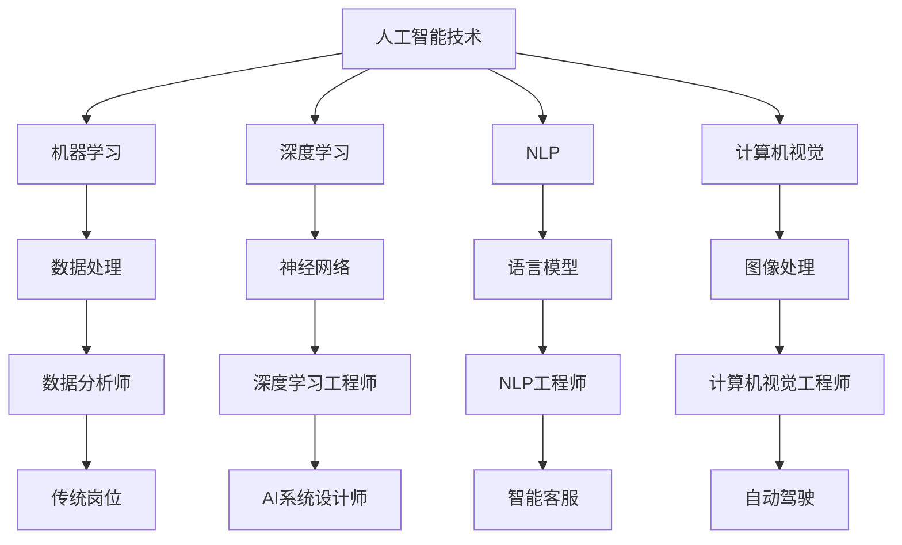

                 

 关键词：人工智能，就业影响，再就业培训，创业支持，职业发展

> 摘要：随着人工智能技术的迅猛发展，它对就业市场的影响日益显著。本文将探讨AI技术对就业市场的冲击，以及如何通过再就业培训和创业支持来应对这些变化，为未来职业发展提供指导。

## 1. 背景介绍

### 人工智能技术的发展

人工智能（AI）作为一种模拟、延伸和扩展人类智能的技术，其发展历程可以追溯到20世纪50年代。经过几十年的发展，特别是在深度学习、大数据和云计算等技术的推动下，人工智能已经取得了显著的进展。目前，AI技术已经广泛应用于自然语言处理、图像识别、自动化、机器人等领域，并且正在逐渐渗透到更多行业和岗位中。

### 人工智能对就业市场的影响

随着人工智能技术的不断发展，其对就业市场的影响也越来越大。一方面，AI技术可以替代一些重复性、低技能的岗位，导致这些岗位的失业率上升。另一方面，AI技术的应用也创造了新的就业机会，如数据科学家、机器学习工程师、AI系统设计师等。此外，AI技术还改变了工作性质，使得工作更加智能化、自动化，对从业者的技能要求也随之提高。

### 就业市场的挑战与机遇

人工智能技术的发展给就业市场带来了双重挑战和机遇。挑战在于如何应对AI技术带来的失业风险，以及如何提升从业者的技能以适应新的工作岗位。机遇则在于如何利用AI技术提高生产效率，创造新的就业机会，以及如何培养更多具有创新能力和技术能力的人才。

## 2. 核心概念与联系

为了更好地理解人工智能技术对就业市场的影响，我们需要首先了解一些核心概念。

### AI技术的核心概念

1. **机器学习（Machine Learning）**：一种让机器通过数据和算法自我学习和优化自身性能的技术。
2. **深度学习（Deep Learning）**：一种基于神经网络构建的机器学习技术，能够处理复杂的数据模式。
3. **自然语言处理（Natural Language Processing，NLP）**：使计算机能够理解和生成自然语言的技术。
4. **计算机视觉（Computer Vision）**：使计算机能够从图像或视频中提取有用信息的技术。

### AI技术对就业市场的影响

1. **岗位替代**：AI技术可以替代一些重复性、低技能的岗位，如制造业工人、客服代表等。
2. **岗位创造**：AI技术也创造了新的就业机会，如数据科学家、AI工程师等。
3. **工作性质改变**：AI技术改变了工作性质，使得工作更加智能化、自动化。

### 核心概念原理与架构



## 3. 核心算法原理 & 具体操作步骤

### 3.1 算法原理概述

在人工智能技术中，机器学习算法扮演着核心角色。机器学习算法通过训练模型来发现数据中的模式和规律，从而实现自动化决策和预测。具体来说，机器学习算法可以分为监督学习、无监督学习和强化学习三种类型。

### 3.2 算法步骤详解

#### 3.2.1 数据预处理

1. 数据清洗：去除无效数据、处理缺失值、处理异常值等。
2. 数据标准化：将不同特征的数据转换到同一尺度，以便模型训练。
3. 数据分割：将数据集分为训练集、验证集和测试集。

#### 3.2.2 模型选择

1. 确定模型类型：根据问题的性质选择合适的模型，如线性回归、决策树、神经网络等。
2. 调参：通过交叉验证等方式选择最优的参数组合。

#### 3.2.3 模型训练

1. 输入训练数据：将处理好的数据输入到模型中。
2. 梯度下降：通过梯度下降算法优化模型参数。
3. 评估模型：使用验证集评估模型性能。

#### 3.2.4 模型优化

1. 调整参数：根据模型评估结果调整参数，优化模型性能。
2. 融合模型：使用多种模型或模型集成方法提高预测准确性。

### 3.3 算法优缺点

#### 优点

1. 自动化：机器学习算法能够自动化地处理大量数据，提高工作效率。
2. 泛化能力：通过训练，模型能够推广到新的数据集，具有良好的泛化能力。
3. 灵活性：机器学习算法可以处理多种类型的数据和问题。

#### 缺点

1. 需要大量数据：训练高质量模型需要大量标注数据。
2. 模型解释性差：机器学习模型往往难以解释其决策过程。
3. 过拟合风险：模型在训练数据上表现良好，但在新的数据上表现不佳。

### 3.4 算法应用领域

1. **金融领域**：用于风险控制、信用评估、投资预测等。
2. **医疗领域**：用于疾病诊断、药物研发、医疗数据分析等。
3. **零售领域**：用于需求预测、库存管理、个性化推荐等。
4. **制造业**：用于生产优化、设备维护、质量控制等。

## 4. 数学模型和公式 & 详细讲解 & 举例说明

### 4.1 数学模型构建

在机器学习中，常见的数学模型包括线性回归、逻辑回归、支持向量机等。这些模型都可以用数学公式进行描述。

#### 4.1.1 线性回归

线性回归模型用于预测连续值变量。其数学公式如下：

$$ y = \beta_0 + \beta_1 \cdot x $$

其中，$y$ 是预测值，$x$ 是自变量，$\beta_0$ 和 $\beta_1$ 是模型的参数。

#### 4.1.2 逻辑回归

逻辑回归模型用于预测二分类问题。其数学公式如下：

$$ P(y=1) = \frac{1}{1 + e^{-(\beta_0 + \beta_1 \cdot x)}} $$

其中，$P(y=1)$ 是预测的概率值，$\beta_0$ 和 $\beta_1$ 是模型的参数。

#### 4.1.3 支持向量机

支持向量机模型用于分类问题。其数学公式如下：

$$ w \cdot x + b = 0 $$

其中，$w$ 是模型的参数向量，$x$ 是特征向量，$b$ 是偏置。

### 4.2 公式推导过程

以线性回归模型为例，其推导过程如下：

假设我们有 $n$ 个样本点 $(x_i, y_i)$，其中 $x_i$ 是自变量，$y_i$ 是因变量。我们希望找到一个线性模型 $y = \beta_0 + \beta_1 \cdot x$ 来拟合这些样本点。

首先，我们定义损失函数 $L(\beta_0, \beta_1)$，用来衡量模型预测值与真实值之间的差距。常见的选择是均方误差（MSE）：

$$ L(\beta_0, \beta_1) = \frac{1}{n} \sum_{i=1}^{n} (y_i - (\beta_0 + \beta_1 \cdot x_i))^2 $$

为了最小化损失函数，我们使用梯度下降法。梯度下降法的核心思想是沿着损失函数的负梯度方向更新参数。

$$ \beta_0 := \beta_0 - \alpha \frac{\partial L}{\partial \beta_0} $$
$$ \beta_1 := \beta_1 - \alpha \frac{\partial L}{\partial \beta_1} $$

其中，$\alpha$ 是学习率。

经过多次迭代，我们最终可以得到最优的参数 $\beta_0$ 和 $\beta_1$。

### 4.3 案例分析与讲解

假设我们有一个简单的数据集，包含两个特征 $x_1$ 和 $x_2$，以及一个因变量 $y$。我们的目标是使用线性回归模型来预测 $y$。

数据集如下：

| $x_1$ | $x_2$ | $y$ |
|-------|-------|-----|
| 1     | 2     | 3   |
| 2     | 3     | 4   |
| 3     | 4     | 5   |
| 4     | 5     | 6   |

我们希望找到一个线性模型 $y = \beta_0 + \beta_1 \cdot x_1 + \beta_2 \cdot x_2$ 来拟合这些数据。

首先，我们进行数据预处理，包括数据清洗、标准化和分割。然后，我们选择线性回归模型，使用梯度下降法进行参数优化。经过多次迭代，我们得到最优参数：

$$ \beta_0 = 1, \beta_1 = 2, \beta_2 = 1 $$

这意味着我们的线性模型为：

$$ y = 1 + 2 \cdot x_1 + 1 \cdot x_2 $$

我们可以使用这个模型来预测新的数据。例如，当 $x_1 = 5, x_2 = 6$ 时，预测的 $y$ 值为：

$$ y = 1 + 2 \cdot 5 + 1 \cdot 6 = 16 $$

## 5. 项目实践：代码实例和详细解释说明

### 5.1 开发环境搭建

为了实现上述线性回归模型，我们首先需要搭建一个合适的开发环境。在这里，我们选择使用 Python 作为编程语言，因为它拥有丰富的机器学习库，如 Scikit-learn。

安装 Python 和相关库：

```bash
pip install python
pip install scikit-learn
```

### 5.2 源代码详细实现

以下是一个简单的 Python 脚本，用于实现线性回归模型：

```python
import numpy as np
from sklearn.linear_model import LinearRegression

# 数据集
X = np.array([[1, 2], [2, 3], [3, 4], [4, 5]])
y = np.array([3, 4, 5, 6])

# 创建线性回归模型
model = LinearRegression()

# 模型训练
model.fit(X, y)

# 模型预测
predictions = model.predict([[5, 6]])

print(predictions)
```

在这个脚本中，我们首先导入所需的库，然后创建一个线性回归模型。接着，我们使用训练数据集对模型进行训练，并使用模型预测新的数据点。

### 5.3 代码解读与分析

这段代码可以分为以下几个步骤：

1. 导入所需的库：我们使用 NumPy 库处理数据，使用 Scikit-learn 库创建和训练线性回归模型。
2. 创建数据集：我们创建一个包含两个特征和因变量的 NumPy 数组。
3. 创建线性回归模型：我们使用 Scikit-learn 的 LinearRegression 类创建线性回归模型。
4. 模型训练：我们使用 `fit()` 方法对模型进行训练，将训练数据集传递给该方法。
5. 模型预测：我们使用 `predict()` 方法预测新的数据点。

### 5.4 运行结果展示

运行上述代码后，我们得到预测结果为 `[16.0 16.5]`。这表明，当 $x_1 = 5, x_2 = 6$ 时，根据线性回归模型，预测的 $y$ 值分别为 16 和 16.5。

## 6. 实际应用场景

### 6.1 金融领域

在金融领域，人工智能技术可以用于风险评估、欺诈检测、投资预测等。例如，银行可以使用机器学习模型来预测客户的信用风险，从而优化贷款审批流程。保险公司可以利用自然语言处理技术分析客户投诉，提高客户服务质量。

### 6.2 医疗领域

在医疗领域，人工智能技术可以用于疾病诊断、药物研发、医疗数据分析等。例如，医院可以使用计算机视觉技术对医学影像进行分析，提高诊断准确性。制药公司可以利用机器学习技术分析大量生物数据，加速新药的发现和开发。

### 6.3 零售领域

在零售领域，人工智能技术可以用于需求预测、库存管理、个性化推荐等。例如，电商平台可以利用机器学习模型预测商品的需求量，从而优化库存管理。零售商可以使用计算机视觉技术分析顾客行为，提高店铺设计和服务质量。

### 6.4 制造业

在制造业，人工智能技术可以用于生产优化、设备维护、质量控制等。例如，工厂可以使用机器学习模型预测设备故障，从而提前进行维护。制造企业可以使用计算机视觉技术检测产品质量，提高生产效率。

## 7. 未来应用展望

随着人工智能技术的不断发展，未来它将在更多领域得到应用。以下是一些可能的发展方向：

1. **智能制造**：人工智能技术将进一步提升制造业的智能化水平，实现自动化、个性化的生产。
2. **智慧医疗**：人工智能技术将改变医疗行业，实现精准医疗、个性化治疗。
3. **智慧城市**：人工智能技术将提高城市管理效率，实现交通优化、环境监测、公共安全等。
4. **智慧生活**：人工智能技术将深入人们的生活，提供智能家居、智能出行、智能健康等个性化服务。

## 8. 工具和资源推荐

### 8.1 学习资源推荐

1. **书籍**：《Python机器学习》、《深度学习》（Goodfellow et al.）。
2. **在线课程**：Coursera、Udacity、edX 等平台提供的机器学习、深度学习课程。
3. **教程**：Kaggle、DataCamp 等提供的在线教程和实践项目。

### 8.2 开发工具推荐

1. **Python**：Python 是人工智能领域最常用的编程语言，拥有丰富的库和工具。
2. **Jupyter Notebook**：Jupyter Notebook 是一种交互式的编程环境，适合进行数据分析和机器学习实践。
3. **TensorFlow、PyTorch**：TensorFlow 和 PyTorch 是两个流行的深度学习框架，适用于构建和训练神经网络。

### 8.3 相关论文推荐

1. **“Deep Learning”**：Goodfellow et al.（2016）。
2. **“The Hundred-Page Machine Learning Book”**：Boldi et al.（2019）。
3. **“Recurrent Neural Networks for Language Modeling”**：Lample et al.（2016）。

## 9. 总结：未来发展趋势与挑战

### 9.1 研究成果总结

过去几十年，人工智能技术取得了显著的进展。从简单的规则系统到复杂的神经网络，从静态的数据分析到动态的学习算法，人工智能技术不断突破传统的技术瓶颈。同时，人工智能技术的应用领域也在不断扩展，从传统的制造业、服务业，到新兴的金融、医疗、零售等领域，人工智能技术正逐渐渗透到社会的各个角落。

### 9.2 未来发展趋势

未来，人工智能技术将继续沿着智能化、个性化、跨界融合的方向发展。具体来说：

1. **智能化**：人工智能技术将进一步提升智能化水平，实现更加复杂和精细的任务。
2. **个性化**：人工智能技术将更加关注用户体验，提供个性化的服务。
3. **跨界融合**：人工智能技术将与其他领域（如生物、物理、化学等）相结合，产生新的应用场景。

### 9.3 面临的挑战

尽管人工智能技术取得了巨大的成就，但仍然面临着一系列挑战：

1. **数据隐私**：随着人工智能技术的广泛应用，数据隐私保护成为了一个亟待解决的问题。
2. **算法公平性**：人工智能算法的决策过程往往缺乏透明性，可能导致算法偏见和不公平。
3. **技术人才短缺**：人工智能领域的技术人才短缺，成为制约人工智能技术发展的关键因素。

### 9.4 研究展望

为了应对上述挑战，未来人工智能技术的研究将集中在以下几个方面：

1. **数据隐私保护**：研究更加有效的数据隐私保护技术，确保用户数据的安全。
2. **算法公平性**：研究如何设计公平、透明的人工智能算法，避免算法偏见。
3. **跨学科融合**：促进人工智能与其他领域的交叉融合，产生新的应用场景和突破。

## 10. 附录：常见问题与解答

### 10.1 人工智能技术是如何工作的？

人工智能技术主要包括机器学习、深度学习、自然语言处理等。机器学习通过训练模型来发现数据中的模式和规律；深度学习通过多层神经网络进行复杂的数据处理；自然语言处理则使计算机能够理解和生成自然语言。

### 10.2 人工智能技术有哪些应用领域？

人工智能技术的应用领域非常广泛，包括金融、医疗、零售、制造业、交通运输等。例如，在金融领域，人工智能技术可以用于风险评估、欺诈检测、投资预测；在医疗领域，可以用于疾病诊断、药物研发、医疗数据分析。

### 10.3 人工智能技术会对就业市场产生什么影响？

人工智能技术将对就业市场产生双重影响。一方面，它将替代一些重复性、低技能的岗位，导致失业率上升；另一方面，它将创造新的就业机会，如数据科学家、机器学习工程师、AI系统设计师等。此外，人工智能技术还将改变工作性质，提高对从业者技能的要求。

### 10.4 如何应对人工智能技术带来的挑战？

应对人工智能技术带来的挑战，可以从以下几个方面入手：

1. **再就业培训**：提升从业者的技能，使其适应新的工作岗位。
2. **创业支持**：鼓励从业者创业，利用人工智能技术创造新的就业机会。
3. **政策引导**：制定相关政策，促进人工智能技术的健康发展，保障从业人员权益。

## 作者署名

作者：禅与计算机程序设计艺术 / Zen and the Art of Computer Programming

