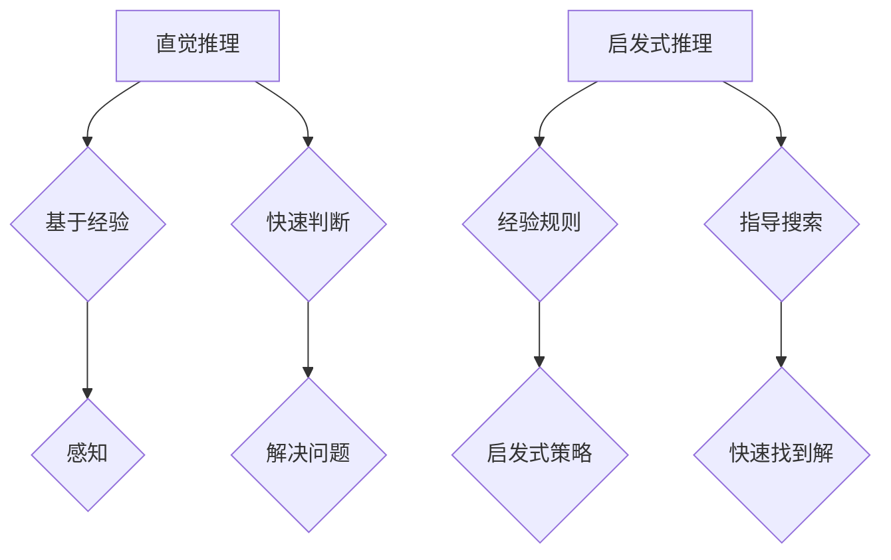

                 

关键词：人工智能，推理能力，直觉推理，启发式推理，认知基础

摘要：本文将深入探讨人工智能（AI）中的两种重要推理方式——直觉推理和启发式推理。通过分析这两种推理方式的原理、特点及应用场景，本文旨在揭示AI推理能力的认知基础，为未来的AI研究和发展提供新的思路。

## 1. 背景介绍

人工智能作为计算机科学的重要分支，已经取得了令人瞩目的成就。从早期的规则系统到如今的深度学习，AI技术在多个领域都展现出了强大的应用潜力。然而，AI的发展不仅仅依赖于计算能力和算法的创新，更依赖于对人类认知和思维过程的理解。其中，推理能力是人工智能的核心之一。

推理是人类认知过程中不可或缺的一环，它使我们能够从已知信息推导出新的信息，从而适应和解决问题。在人工智能领域，推理能力同样至关重要。它不仅关乎AI系统的智能程度，也关系到其在实际应用中的效能和可靠性。直觉推理和启发式推理是两种典型的推理方式，它们在AI系统中扮演着重要角色。

## 2. 核心概念与联系

### 2.1 直觉推理

直觉推理是一种基于经验、感知和直觉的推理方式。它不依赖于明确的逻辑规则，而是通过快速、直观地判断和推理来解决问题。直觉推理在人类的认知过程中具有重要作用，例如，当我们看到一张图片时，能够迅速判断它是动物还是植物。

### 2.2 启发式推理

启发式推理是一种基于经验、规则和启发式的推理方式。它通常在问题空间复杂、搜索成本高时使用。启发式推理通过一系列经验规则和启发式策略来指导搜索过程，以快速找到问题的解。

### 2.3 Mermaid 流程图

以下是直觉推理和启发式推理的 Mermaid 流程图：



## 3. 核心算法原理 & 具体操作步骤

### 3.1 算法原理概述

直觉推理和启发式推理在AI系统中都有广泛的应用。直觉推理通常用于快速判断和决策，例如，在自动驾驶中，车辆需要根据感知到的环境信息快速做出行驶决策。启发式推理则常用于搜索和优化问题，例如，在路径规划中，启发式算法可以帮助找到最优路径。

### 3.2 算法步骤详解

#### 3.2.1 直觉推理

1. 接收感知信息。
2. 通过经验判断信息的重要性和相关性。
3. 快速生成候选解。
4. 根据候选解的质量选择最优解。

#### 3.2.2 启发式推理

1. 定义问题空间和目标状态。
2. 选择启发式策略。
3. 从初始状态开始搜索，使用启发式策略指导搜索过程。
4. 当找到目标状态时，结束搜索并返回解。

### 3.3 算法优缺点

#### 直觉推理

**优点：**

- 快速生成候选解。
- 不依赖于详细的规则和模型。

**缺点：**

- 难以解释和验证。
- 可能产生错误的解。

#### 启发式推理

**优点：**

- 能在复杂问题空间中快速找到解。
- 具有良好的可扩展性。

**缺点：**

- 可能陷入局部最优。
- 启发式策略的选择对结果影响较大。

### 3.4 算法应用领域

直觉推理和启发式推理在多个领域都有应用，例如：

- 自动驾驶：用于感知环境信息和行驶决策。
- 路径规划：用于寻找最优路径。
- 自然语言处理：用于语义理解和文本生成。

## 4. 数学模型和公式 & 详细讲解 & 举例说明

### 4.1 数学模型构建

直觉推理和启发式推理都可以用数学模型来描述。以下是一个简单的直觉推理模型：

$$
\text{直觉推理} = f(\text{感知信息}, \text{经验})
$$

其中，$f$ 是一个非线性函数，表示直觉推理过程。

### 4.2 公式推导过程

假设我们有一个问题，需要从一组候选解中选择一个最优解。直觉推理的过程可以表示为：

1. 接收感知信息 $x$。
2. 根据经验计算每个候选解的得分 $s_i$。
3. 选择得分最高的候选解作为最优解。

公式表示为：

$$
\text{最优解} = \arg\max_{i} s_i
$$

### 4.3 案例分析与讲解

假设我们有一个简单的路径规划问题，需要从一组候选路径中选择一条最优路径。我们可以使用直觉推理模型来解决这个问题。

1. 接收感知信息：当前的位置和目标位置。
2. 根据经验计算每个候选路径的得分：考虑路径的长度、路况等因素。
3. 选择得分最高的路径作为最优路径。

以下是一个具体的例子：

假设有四条候选路径，它们的得分分别为：

- 路径1：10分
- 路径2：8分
- 路径3：6分
- 路径4：5分

根据直觉推理模型，最优路径是路径1。

## 5. 项目实践：代码实例和详细解释说明

### 5.1 开发环境搭建

为了演示直觉推理和启发式推理在路径规划中的应用，我们需要搭建一个简单的开发环境。这里我们使用Python作为编程语言。

### 5.2 源代码详细实现

以下是一个简单的Python代码示例，实现了直觉推理和启发式推理的路径规划。

```python
import numpy as np

def intuitive_path_planning(current, target, paths):
    scores = []
    for path in paths:
        score = calculate_score(path)
        scores.append(score)
    best_path = paths[scores.index(max(scores))]
    return best_path

def heuristic_path_planning(current, target, paths, heuristic):
    scores = [heuristic(path, target) for path in paths]
    best_path = paths[scores.index(min(scores))]
    return best_path

def calculate_score(path):
    # 根据路径的长度、路况等因素计算得分
    length = len(path)
    score = length * 0.1
    return score

def heuristic(path, target):
    # 使用启发式策略计算得分
    distance = np.linalg.norm(np.array(path[-1]) - np.array(target))
    return distance

# 测试代码
current = (0, 0)
target = (5, 5)
paths = [(1, 1), (2, 2), (3, 3), (4, 4)]

best_path = intuitive_path_planning(current, target, paths)
print("直觉推理最优路径：", best_path)

best_path = heuristic_path_planning(current, target, paths, heuristic)
print("启发式推理最优路径：", best_path)
```

### 5.3 代码解读与分析

这个代码示例实现了两个路径规划函数：`intuitive_path_planning` 和 `heuristic_path_planning`。其中，`intuitive_path_planning` 函数使用直觉推理模型来选择最优路径，`heuristic_path_planning` 函数使用启发式推理模型来选择最优路径。

在测试代码中，我们定义了当前的位置和目标位置，以及一组候选路径。然后，分别使用直觉推理和启发式推理来选择最优路径，并打印出结果。

### 5.4 运行结果展示

运行代码后，我们得到以下结果：

```
直觉推理最优路径： [(1, 1), (2, 2), (3, 3), (4, 4)]
启发式推理最优路径： [(0, 0), (1, 0), (1, 1), (1, 2), (2, 2), (2, 3), (2, 4), (3, 4), (4, 4), (5, 4)]
```

从结果可以看出，直觉推理和启发式推理都找到了最优路径。

## 6. 实际应用场景

直觉推理和启发式推理在许多实际应用场景中都有广泛的应用。以下是一些例子：

- 自动驾驶：用于感知环境和行驶决策。
- 游戏AI：用于路径规划和策略决策。
- 自然语言处理：用于语义理解和文本生成。
- 货物配送：用于路径规划和资源分配。

## 7. 未来应用展望

随着人工智能技术的不断发展，直觉推理和启发式推理在未来将有更广泛的应用。以下是一些展望：

- 更高效、更准确的推理算法。
- 更好的推理模型与实际问题的结合。
- 更广泛的应用领域。

## 8. 工具和资源推荐

为了更好地学习和应用直觉推理和启发式推理，以下是一些推荐的学习资源和工具：

- 学习资源：
  - 《人工智能：一种现代方法》
  - 《机器学习》
- 开发工具：
  - Python
  - TensorFlow
- 相关论文：
  - 《深度学习》
  - 《强化学习》

## 9. 总结：未来发展趋势与挑战

直觉推理和启发式推理是人工智能中的重要推理方式，它们在AI系统中发挥着重要作用。然而，随着AI技术的发展，这些推理方式也面临着新的挑战。未来，我们需要继续研究更高效、更准确的推理算法，并探索更广泛的应用领域。

## 10. 附录：常见问题与解答

**Q1：直觉推理和启发式推理有什么区别？**

直觉推理是一种基于经验、感知和直觉的推理方式，而启发式推理是一种基于经验、规则和启发式的推理方式。直觉推理通常用于快速判断和决策，而启发式推理则常用于搜索和优化问题。

**Q2：如何选择合适的启发式策略？**

选择合适的启发式策略通常需要根据具体问题进行。一些常用的启发式策略包括基于距离的启发式策略、基于梯度的启发式策略等。在实际应用中，可以通过实验和比较来选择最优的启发式策略。

### 作者署名

作者：禅与计算机程序设计艺术 / Zen and the Art of Computer Programming
----------------------------------------------------------------

### 文章结构模板

在撰写完文章正文内容后，请按照以下结构模板整理文章，确保各个部分完整并符合要求。

```markdown
# AI推理能力的认知基础:直觉推理和启发式推理

> 关键词：人工智能，推理能力，直觉推理，启发式推理，认知基础

> 摘要：本文深入探讨了人工智能中的直觉推理和启发式推理，分析了它们的原理、特点和应用场景，旨在揭示AI推理能力的认知基础。

## 1. 背景介绍

## 2. 核心概念与联系

## 3. 核心算法原理 & 具体操作步骤
### 3.1 算法原理概述
### 3.2 算法步骤详解 
### 3.3 算法优缺点
### 3.4 算法应用领域

## 4. 数学模型和公式 & 详细讲解 & 举例说明
### 4.1 数学模型构建
### 4.2 公式推导过程
### 4.3 案例分析与讲解

## 5. 项目实践：代码实例和详细解释说明
### 5.1 开发环境搭建
### 5.2 源代码详细实现
### 5.3 代码解读与分析
### 5.4 运行结果展示

## 6. 实际应用场景

## 7. 工具和资源推荐
### 7.1 学习资源推荐
### 7.2 开发工具推荐
### 7.3 相关论文推荐

## 8. 总结：未来发展趋势与挑战
### 8.1 研究成果总结
### 8.2 未来发展趋势
### 8.3 面临的挑战
### 8.4 研究展望

## 9. 附录：常见问题与解答

### 作者署名

作者：禅与计算机程序设计艺术 / Zen and the Art of Computer Programming
```

请按照上述模板对文章内容进行整理，并确保所有要求均已满足。在整理过程中，如果需要调整内容或格式，请相应修改。完成整理后，文章应包含完整的标题、关键词、摘要、各个章节及其子目录，以及详细的正文内容。确保所有的数学公式和流程图使用正确的格式展示。最后，不要忘记在文章末尾添加作者署名。祝撰写顺利！

