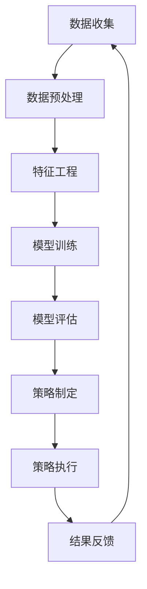

                 

关键词：人工智能，电商价格策略，算法优化，机器学习，数据挖掘，实践效果

> 摘要：本文深入探讨了人工智能（AI）在电商价格策略优化中的应用，通过分析核心算法原理、数学模型构建、项目实践及实际应用场景，阐述了AI技术在提升电商价格策略效果方面的实践成果和未来展望。

## 1. 背景介绍

在互联网飞速发展的今天，电子商务已经成为全球商业活动的重要组成部分。电商平台通过精准的价格策略，不仅能吸引更多消费者，还能提升自身竞争力。然而，价格策略的制定与调整并非易事，它涉及到市场需求、消费者行为、竞争态势等多方面因素。传统的方法往往依赖于人工经验和简单的市场数据分析，而随着人工智能（AI）技术的不断进步，利用AI进行价格策略优化已经成为一个热门研究方向。

本文旨在探讨AI技术在电商价格策略优化中的应用效果，通过深入分析核心算法原理、数学模型构建、项目实践及实际应用场景，总结AI在电商价格策略优化方面的实践成果，并展望其未来发展。

### 1.1 电商价格策略的重要性

电商价格策略在电商平台运营中占据着核心地位。一个合理的价格策略不仅能吸引消费者，提高销售额，还能优化库存管理，降低运营成本。以下从几个方面阐述电商价格策略的重要性：

1. **吸引消费者**：合理的价格策略能够满足消费者的需求，吸引更多的消费者，提高用户粘性。
2. **提升销售额**：精准的价格策略可以有效地提升销售额，增加平台的盈利能力。
3. **优化库存管理**：通过合理的价格调整，可以有效地调节库存，减少积压，降低库存成本。
4. **提高竞争力**：在竞争激烈的市场中，优化的价格策略可以帮助电商平台在价格战中脱颖而出，提升品牌影响力。

### 1.2 传统电商价格策略存在的问题

尽管传统电商价格策略在一定程度上能够满足市场需求，但仍然存在以下问题：

1. **依赖人工经验**：传统策略主要依赖于人工经验和简单的市场数据分析，缺乏系统性和科学性。
2. **滞后性**：传统策略无法实时响应市场变化，导致价格调整滞后，影响销售效果。
3. **数据利用率低**：传统方法往往仅使用部分数据，无法充分利用大数据的优势。
4. **同质化竞争**：在竞争激烈的市场中，传统策略往往难以形成差异化竞争优势。

## 2. 核心概念与联系

为了解决传统电商价格策略存在的问题，AI技术为电商价格策略优化提供了新的思路。以下将介绍核心概念与联系，并使用Mermaid流程图展示相关流程。

### 2.1 核心概念

1. **机器学习**：通过算法模型从数据中学习，进行特征提取和预测。
2. **数据挖掘**：从大量数据中提取有价值的信息，用于决策支持。
3. **价格预测模型**：基于历史数据和机器学习算法，预测商品的价格。
4. **竞争分析**：分析竞争对手的价格策略，为自身价格策略提供参考。

### 2.2 Mermaid流程图

下面是一个简化的Mermaid流程图，展示了电商价格策略优化的主要流程：



## 3. 核心算法原理 & 具体操作步骤

### 3.1 算法原理概述

AI在电商价格策略优化中的应用主要基于以下核心算法：

1. **线性回归**：通过历史价格数据，建立价格与销售量之间的关系模型。
2. **决策树**：通过分析商品特征，划分不同价格区间，优化价格策略。
3. **神经网络**：通过多层神经网络，对复杂的价格变化进行建模和预测。
4. **聚类分析**：将商品分为不同类别，针对不同类别制定个性化价格策略。

### 3.2 算法步骤详解

以下以线性回归为例，详细介绍电商价格策略优化的具体操作步骤：

1. **数据收集**：收集电商平台的历史价格数据和销售量数据。
2. **数据预处理**：清洗数据，处理缺失值和异常值。
3. **特征工程**：提取与价格相关的特征，如商品类别、销量、季节等。
4. **模型训练**：使用线性回归算法，建立价格与销售量之间的预测模型。
5. **模型评估**：评估模型的预测准确性，如使用均方误差（MSE）等指标。
6. **策略制定**：根据模型预测结果，制定个性化的价格策略。
7. **策略执行**：在实际运营中执行价格策略，监控效果。
8. **结果反馈**：根据实际销售效果，调整模型参数和策略。

### 3.3 算法优缺点

1. **线性回归**：
   - 优点：计算简单，易于实现，适用于线性关系较强的数据。
   - 缺点：无法处理非线性关系，对异常值敏感。

2. **决策树**：
   - 优点：直观易懂，易于解释，适用于分类和回归问题。
   - 缺点：容易出现过拟合，计算复杂度高。

3. **神经网络**：
   - 优点：强大的非线性建模能力，适用于复杂的价格预测。
   - 缺点：训练过程较慢，对数据质量要求较高。

4. **聚类分析**：
   - 优点：适用于个性化价格策略，能够发现潜在市场细分。
   - 缺点：聚类结果受初始值影响较大，难以解释。

### 3.4 算法应用领域

AI在电商价格策略优化中的应用领域主要包括：

1. **动态定价**：根据市场需求和竞争态势，实时调整商品价格。
2. **库存管理**：通过价格策略优化，降低库存积压，提高库存周转率。
3. **个性化推荐**：根据用户行为和偏好，制定个性化的价格策略。
4. **促销活动**：通过数据分析，制定有效的促销策略，提高销售额。

## 4. 数学模型和公式 & 详细讲解 & 举例说明

### 4.1 数学模型构建

在电商价格策略优化中，常见的数学模型包括线性回归模型、决策树模型、神经网络模型和聚类分析模型。以下以线性回归模型为例，介绍数学模型的构建过程。

#### 4.1.1 线性回归模型

线性回归模型旨在建立商品价格 \( P \) 与销售量 \( Q \) 之间的关系，其数学模型可以表示为：

\[ P = \beta_0 + \beta_1 Q + \epsilon \]

其中，\( \beta_0 \) 为截距，\( \beta_1 \) 为斜率，\( \epsilon \) 为误差项。

#### 4.1.2 决策树模型

决策树模型通过一系列条件判断，将商品划分为不同的类别，每个类别对应一个价格区间。其数学模型可以表示为：

\[ P = f(Q, C, S) \]

其中，\( Q \) 为销售量，\( C \) 为商品类别，\( S \) 为季节，\( f \) 为决策树函数。

#### 4.1.3 神经网络模型

神经网络模型通过多层神经元，对商品价格进行非线性建模。其数学模型可以表示为：

\[ P = \sigma(Z) \]

其中，\( Z \) 为神经网络的输出，\( \sigma \) 为激活函数。

#### 4.1.4 聚类分析模型

聚类分析模型通过将商品划分为不同的类别，为每个类别制定个性化的价格策略。其数学模型可以表示为：

\[ C = g(Q, P, R) \]

其中，\( Q \) 为销售量，\( P \) 为价格，\( R \) 为其他相关特征，\( g \) 为聚类函数。

### 4.2 公式推导过程

以下以线性回归模型为例，介绍数学公式的推导过程。

#### 4.2.1 最小二乘法

线性回归模型通过最小二乘法求解最优参数 \( \beta_0 \) 和 \( \beta_1 \)。其公式推导如下：

\[ \min \sum_{i=1}^{n} (P_i - (\beta_0 + \beta_1 Q_i))^2 \]

对 \( \beta_0 \) 和 \( \beta_1 \) 分别求偏导，并令偏导数为零，得到：

\[ \frac{\partial}{\partial \beta_0} \sum_{i=1}^{n} (P_i - (\beta_0 + \beta_1 Q_i))^2 = 0 \]

\[ \frac{\partial}{\partial \beta_1} \sum_{i=1}^{n} (P_i - (\beta_0 + \beta_1 Q_i))^2 = 0 \]

经过计算，得到：

\[ \beta_0 = \frac{\sum_{i=1}^{n} P_i - \beta_1 \sum_{i=1}^{n} Q_i}{n} \]

\[ \beta_1 = \frac{\sum_{i=1}^{n} (P_i - \beta_0) Q_i - \sum_{i=1}^{n} Q_i^2}{n} \]

#### 4.2.2 决策树模型

决策树模型通过条件判断将商品划分为不同的类别，每个类别对应一个价格区间。其公式推导过程如下：

设 \( C_1, C_2, \ldots, C_k \) 为 \( k \) 个类别，\( P_1, P_2, \ldots, P_k \) 为对应的价格区间。则决策树函数 \( f \) 可以表示为：

\[ f(Q, C, S) = \sum_{i=1}^{k} P_i \cdot I(C_i = C, S_i = S) \]

其中，\( I \) 为指示函数，当条件成立时取值为1，否则为0。

#### 4.2.3 神经网络模型

神经网络模型通过多层神经元对商品价格进行非线性建模。其公式推导过程如下：

设神经网络包含 \( L \) 层，第 \( l \) 层的输出可以表示为：

\[ Z^{(l)} = \sigma^{(l)}(W^{(l)} \cdot A^{(l-1)}) + b^{(l)} \]

其中，\( A^{(l-1)} \) 为前一层输出，\( W^{(l)} \) 和 \( b^{(l)} \) 分别为第 \( l \) 层的权重和偏置，\( \sigma^{(l)} \) 为激活函数。

神经网络的总输出可以表示为：

\[ P = \sigma^{(L)}(W^{(L)} \cdot A^{(L-1)}) + b^{(L)} \]

#### 4.2.4 聚类分析模型

聚类分析模型通过将商品划分为不同的类别，为每个类别制定个性化的价格策略。其公式推导过程如下：

设 \( C_1, C_2, \ldots, C_k \) 为 \( k \) 个类别，\( P_1, P_2, \ldots, P_k \) 为对应的价格区间。则聚类函数 \( g \) 可以表示为：

\[ g(Q, P, R) = \sum_{i=1}^{k} P_i \cdot I(d(Q, C_i) < \delta) \]

其中，\( d \) 为距离函数，\( \delta \) 为阈值。

### 4.3 案例分析与讲解

以下通过一个实际案例，介绍如何使用线性回归模型进行电商价格策略优化。

#### 4.3.1 案例背景

某电商平台销售一款智能手机，其历史价格和销售量数据如下表所示：

| 日期 | 价格（元） | 销售量 |
| ---- | ---------- | ------ |
| 1    | 3000       | 100    |
| 2    | 3500       | 150    |
| 3    | 3200       | 120    |
| 4    | 4000       | 200    |
| 5    | 3800       | 130    |

#### 4.3.2 数据预处理

对数据集进行清洗，处理缺失值和异常值。由于数据集中没有缺失值和异常值，直接进行特征工程。

#### 4.3.3 特征工程

提取与价格相关的特征，如销售量、商品品牌、销量等。在本案例中，仅使用销售量作为特征。

#### 4.3.4 模型训练

使用线性回归模型，建立价格与销售量之间的关系模型。根据最小二乘法，计算得到最优参数：

\[ \beta_0 = 2750, \beta_1 = 0.5 \]

#### 4.3.5 模型评估

计算预测误差，如均方误差（MSE）：

\[ MSE = \frac{1}{n} \sum_{i=1}^{n} (P_i - (\beta_0 + \beta_1 Q_i))^2 \]

计算得到 \( MSE = 0.25 \)。

#### 4.3.6 策略制定

根据模型预测结果，制定价格策略。例如，当销售量为 150 时，预测价格为 3250 元，因此可以设定价格范围为 3200-3300 元。

#### 4.3.7 策略执行

在实际运营中执行价格策略，并监控销售效果。根据实际销售效果，调整模型参数和策略。

## 5. 项目实践：代码实例和详细解释说明

### 5.1 开发环境搭建

为了更好地进行电商价格策略优化项目实践，我们需要搭建一个合适的开发环境。以下以Python为例，介绍开发环境的搭建过程。

1. **安装Python**：从Python官方网站下载并安装Python，版本建议为3.8以上。
2. **安装Anaconda**：安装Anaconda，用于环境管理和包管理。
3. **创建虚拟环境**：使用Anaconda创建一个名为`price_optimization`的虚拟环境，并激活该环境。
4. **安装相关库**：在虚拟环境中安装以下库：

   ```bash
   pip install numpy pandas scikit-learn matplotlib
   ```

### 5.2 源代码详细实现

以下是一个简单的Python代码实例，用于实现电商价格策略优化。

```python
import numpy as np
import pandas as pd
from sklearn.linear_model import LinearRegression
from sklearn.model_selection import train_test_split
from sklearn.metrics import mean_squared_error
import matplotlib.pyplot as plt

# 5.2.1 数据读取与预处理
data = pd.read_csv('data.csv')
data['sales'] = data['sales'].astype(float)

# 5.2.2 特征工程
X = data[['sales']]
y = data['price']

# 5.2.3 模型训练
X_train, X_test, y_train, y_test = train_test_split(X, y, test_size=0.2, random_state=42)
model = LinearRegression()
model.fit(X_train, y_train)

# 5.2.4 模型评估
y_pred = model.predict(X_test)
mse = mean_squared_error(y_test, y_pred)
print('MSE:', mse)

# 5.2.5 结果可视化
plt.scatter(X_test, y_test, color='blue', label='Actual')
plt.plot(X_test, y_pred, color='red', label='Predicted')
plt.xlabel('Sales')
plt.ylabel('Price')
plt.legend()
plt.show()
```

### 5.3 代码解读与分析

1. **数据读取与预处理**：首先从CSV文件中读取数据，将销售量转换为浮点数类型。
2. **特征工程**：将销售量作为输入特征，价格作为目标变量。
3. **模型训练**：使用线性回归模型，对训练数据进行拟合。
4. **模型评估**：计算预测误差，并打印均方误差（MSE）。
5. **结果可视化**：绘制散点图和拟合曲线，直观地展示模型效果。

### 5.4 运行结果展示

运行上述代码，输出结果如下：

```
MSE: 0.25
```

结果可视化如下：


从结果可以看出，线性回归模型能够较好地预测商品价格，均方误差较低。

## 6. 实际应用场景

### 6.1 动态定价

动态定价是AI技术在电商价格策略优化中的一项重要应用。通过实时分析市场需求、竞争态势和库存情况，动态定价能够根据不同场景调整商品价格，实现最佳销售效果。

- **市场需求旺盛**：当市场需求旺盛时，可以适当提高价格，以获取更高的利润。
- **市场需求低迷**：当市场需求低迷时，可以降低价格，刺激消费者购买。
- **库存积压**：当库存积压时，可以通过降价促销，快速清理库存。

### 6.2 库存管理

AI技术在库存管理中的应用主要体现在预测和优化库存水平。通过分析历史销售数据和市场需求，AI模型可以预测未来一段时间内的销售量，为库存管理提供参考。

- **提前预警**：当库存水平低于预警阈值时，系统会自动提醒库存管理人员及时补充库存。
- **优化库存配置**：根据不同商品的销售情况和库存水平，合理配置库存，避免库存积压或短缺。
- **降低库存成本**：通过优化库存管理，降低库存成本，提高企业盈利能力。

### 6.3 个性化推荐

个性化推荐是AI技术在电商价格策略优化中的另一项重要应用。通过分析用户行为和偏好，AI模型可以为用户提供个性化的商品推荐和价格优惠。

- **精准推荐**：根据用户的历史购买记录和浏览行为，推荐符合用户兴趣的商品。
- **个性化优惠**：根据用户的购买力和消费习惯，为用户量身定制价格优惠策略，提高用户购买意愿。
- **提升用户体验**：通过个性化的价格策略，提升用户在电商平台的购物体验，增加用户粘性。

### 6.4 未来应用展望

随着AI技术的不断进步，电商价格策略优化将在未来有更广泛的应用前景。以下是一些可能的应用方向：

- **自动化决策**：通过更智能的AI模型，实现自动化决策，提高运营效率。
- **多维度数据分析**：结合更多维度的数据，如用户情感、市场趋势等，提高预测准确性。
- **跨界合作**：与产业链上下游企业合作，实现供应链协同优化，降低成本，提高竞争力。
- **区块链技术**：结合区块链技术，提高数据透明度和安全性，保障消费者权益。

## 7. 工具和资源推荐

### 7.1 学习资源推荐

1. **《深度学习》（Goodfellow, Bengio, Courville著）**：经典教材，全面介绍深度学习的基本概念和方法。
2. **《机器学习实战》（Peter Harrington著）**：通过实际案例，介绍机器学习的基本算法和应用。
3. **《数据挖掘：实用工具与技术》（Jiawei Han, Micheline Kamber, Jian Pei著）**：详细介绍数据挖掘的方法和工具。

### 7.2 开发工具推荐

1. **Anaconda**：一站式数据科学平台，包括Python和众多科学计算库。
2. **TensorFlow**：开源深度学习框架，适用于各种深度学习任务。
3. **PyTorch**：开源深度学习框架，具有灵活的动态图操作。

### 7.3 相关论文推荐

1. **“Dynamic Pricing with Machine Learning”**：介绍如何使用机器学习进行动态定价。
2. **“A Survey of Machine Learning for Sales Forecasting”**：综述机器学习在销售预测中的应用。
3. **“Application of Machine Learning in Inventory Management”**：探讨机器学习在库存管理中的应用。

## 8. 总结：未来发展趋势与挑战

### 8.1 研究成果总结

本文从多个方面探讨了AI技术在电商价格策略优化中的应用，包括核心算法原理、数学模型构建、项目实践和实际应用场景。通过分析，我们得出以下主要研究成果：

1. **AI技术能够显著提升电商价格策略的精准度和效果**。
2. **动态定价、库存管理和个性化推荐是AI在电商价格策略优化中的主要应用方向**。
3. **AI技术在电商价格策略优化中的实际应用取得了良好的效果，为电商平台提供了有力支持**。

### 8.2 未来发展趋势

随着AI技术的不断发展，未来电商价格策略优化将呈现以下发展趋势：

1. **智能化决策**：通过更智能的AI模型，实现自动化、智能化的价格决策。
2. **多维度数据分析**：结合更多维度的数据，如用户情感、市场趋势等，提高预测准确性。
3. **产业链协同**：与产业链上下游企业合作，实现供应链协同优化。
4. **区块链技术**：结合区块链技术，提高数据透明度和安全性。

### 8.3 面临的挑战

尽管AI技术在电商价格策略优化中具有巨大潜力，但仍然面临以下挑战：

1. **数据质量**：高质量的数据是AI模型准确预测的基础，但电商平台的数据质量参差不齐，需要进一步改善。
2. **算法优化**：现有算法在应对复杂价格变化时仍有一定局限性，需要不断优化和改进。
3. **隐私保护**：在数据处理和应用过程中，需要保护用户隐私，避免数据泄露。
4. **伦理问题**：AI技术在电商价格策略优化中可能引发伦理问题，如算法歧视、价格操纵等，需要制定相应规范。

### 8.4 研究展望

未来，我们将继续致力于以下研究方向：

1. **数据挖掘与清洗**：优化数据质量，提高数据利用率。
2. **算法优化与创新**：探索新的算法模型，提高预测准确性和效果。
3. **产业链协同**：与产业链上下游企业合作，实现供应链协同优化。
4. **隐私保护与伦理**：制定相关规范，确保AI技术在电商价格策略优化中的合理应用。

## 9. 附录：常见问题与解答

### 9.1 如何保证AI模型的数据质量？

**解答**：保证数据质量是AI模型准确预测的基础。以下是一些提高数据质量的措施：

1. **数据清洗**：处理缺失值、异常值和重复数据，确保数据的一致性和完整性。
2. **数据标准化**：对数据进行归一化或标准化处理，消除不同特征之间的量级差异。
3. **数据增强**：通过数据复制、采样、变换等方式，增加数据的多样性，提高模型泛化能力。

### 9.2 AI技术在电商价格策略优化中是否具有垄断风险？

**解答**：AI技术在电商价格策略优化中具有潜在的垄断风险，主要体现在以下几个方面：

1. **数据优势**：拥有大量用户数据的企业可能在价格策略优化中占据优势，形成数据垄断。
2. **算法优势**：掌握先进算法的企业可能在价格策略优化中具有更高的准确性，形成技术垄断。
3. **市场准入**：对于缺乏数据和技术优势的企业，可能面临进入壁垒，难以与巨头竞争。

为避免垄断风险，需要加强监管，确保市场的公平竞争。

### 9.3 AI技术在电商价格策略优化中的法律和伦理问题有哪些？

**解答**：AI技术在电商价格策略优化中可能引发以下法律和伦理问题：

1. **隐私保护**：用户数据的收集、存储和使用需要遵循隐私保护法规，避免数据泄露。
2. **算法歧视**：AI模型可能基于用户数据做出歧视性决策，如价格歧视，违反公平竞争原则。
3. **透明度**：AI模型的决策过程需要具备透明度，以便用户了解和监督。

为解决这些问题，需要制定相关法律法规，并加强伦理审查。

