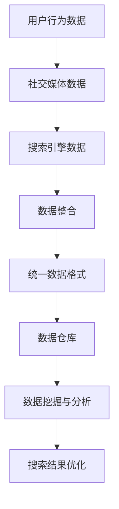
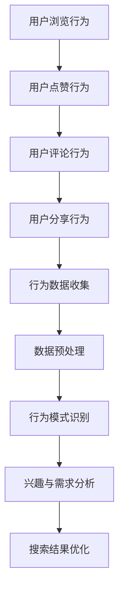
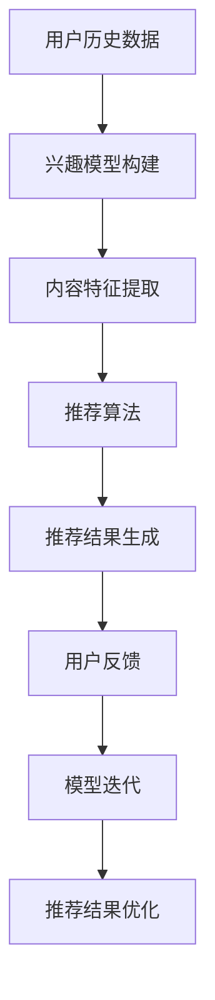
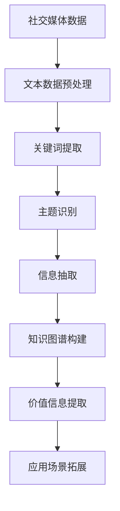

                 

关键词：AI搜索引擎、社交媒体、数据融合、用户行为分析、个性化推荐、内容挖掘

> 摘要：本文将探讨AI搜索引擎与社交媒体的融合，如何通过数据融合、用户行为分析和个性化推荐等关键技术，实现更高效的内容挖掘和信息获取，提高用户体验，同时为社交媒体平台带来新的商业模式和机遇。

## 1. 背景介绍

随着互联网的快速发展，社交媒体已经成为人们日常生活中不可或缺的一部分。从Facebook、Twitter到微信、微博，社交媒体平台吸引了数以亿计的用户。这些平台不仅提供了丰富的社交功能，还成为信息传播和内容分享的重要渠道。与此同时，人工智能（AI）技术也在迅速崛起，尤其在自然语言处理、机器学习、数据挖掘等领域取得了显著进展。

AI搜索引擎与社交媒体的融合，不仅能够为用户提供更加智能化的搜索体验，还能为社交媒体平台带来新的商业价值。例如，通过分析用户在社交媒体上的行为数据，AI搜索引擎可以更好地理解用户需求，提供个性化的内容推荐。此外，这种融合还可以帮助社交媒体平台挖掘出潜在的商业机会，例如广告投放、内容付费等。

本文将围绕AI搜索引擎与社交媒体的融合，探讨以下几个方面的内容：

1. 数据融合：如何将社交媒体平台的数据与AI搜索引擎的数据进行有效整合。
2. 用户行为分析：如何通过分析用户在社交媒体上的行为，为用户提供更精准的搜索结果。
3. 个性化推荐：如何利用AI技术为用户提供个性化的内容推荐。
4. 内容挖掘：如何利用AI技术挖掘社交媒体平台上的有价值信息。

## 2. 核心概念与联系

### 2.1 数据融合

数据融合是指将来自不同源的数据进行整合，以实现更全面、准确的信息获取。在AI搜索引擎与社交媒体的融合过程中，数据融合是一个关键环节。以下是一个数据融合的Mermaid流程图：



### 2.2 用户行为分析

用户行为分析是通过对用户在社交媒体上的行为数据进行收集、处理和分析，以了解用户兴趣和需求。以下是一个用户行为分析的Mermaid流程图：



### 2.3 个性化推荐

个性化推荐是通过分析用户历史行为和兴趣，为用户推荐其可能感兴趣的内容。以下是一个个性化推荐的Mermaid流程图：



### 2.4 内容挖掘

内容挖掘是从大量的社交媒体数据中提取有价值信息的过程。以下是一个内容挖掘的Mermaid流程图：



## 3. 核心算法原理 & 具体操作步骤

### 3.1 算法原理概述

AI搜索引擎与社交媒体的融合涉及多个核心算法，主要包括数据融合算法、用户行为分析算法、个性化推荐算法和内容挖掘算法。这些算法的核心原理如下：

- **数据融合算法**：通过数据清洗、去重、整合等技术，将不同来源的数据进行有效整合。
- **用户行为分析算法**：利用机器学习技术，对用户行为数据进行分类、聚类、预测等分析，以了解用户兴趣和需求。
- **个性化推荐算法**：通过协同过滤、基于内容的推荐等算法，为用户推荐其可能感兴趣的内容。
- **内容挖掘算法**：利用自然语言处理、知识图谱等技术，从社交媒体数据中提取有价值的信息。

### 3.2 算法步骤详解

#### 3.2.1 数据融合算法

数据融合算法的具体步骤如下：

1. 数据收集：从社交媒体平台和搜索引擎获取用户行为数据、社交媒体数据和搜索引擎数据。
2. 数据清洗：去除重复数据、缺失数据，并对数据进行规范化处理。
3. 数据整合：将不同来源的数据进行整合，建立统一的数据格式。
4. 数据仓库：将整合后的数据存储到数据仓库中，以便后续的数据挖掘和分析。

#### 3.2.2 用户行为分析算法

用户行为分析算法的具体步骤如下：

1. 数据预处理：对用户行为数据进行清洗、去噪、去重等处理，确保数据质量。
2. 行为模式识别：利用机器学习技术，对用户行为数据进行分类、聚类等分析，识别用户行为模式。
3. 兴趣与需求分析：根据用户行为模式，分析用户兴趣和需求，为用户提供个性化搜索结果。
4. 模型迭代：根据用户反馈，不断优化用户行为分析模型。

#### 3.2.3 个性化推荐算法

个性化推荐算法的具体步骤如下：

1. 用户历史数据收集：收集用户的历史行为数据，包括浏览记录、点赞记录、评论记录等。
2. 兴趣模型构建：利用机器学习技术，构建用户兴趣模型，预测用户可能感兴趣的内容。
3. 内容特征提取：提取推荐内容的相关特征，如关键词、主题、标签等。
4. 推荐算法：根据用户兴趣模型和内容特征，利用协同过滤、基于内容的推荐等算法生成推荐结果。
5. 推荐结果优化：根据用户反馈，不断优化推荐算法，提高推荐质量。

#### 3.2.4 内容挖掘算法

内容挖掘算法的具体步骤如下：

1. 文本数据预处理：对社交媒体平台上的文本数据进行分析，包括分词、去停用词、词性标注等处理。
2. 关键词提取：从文本数据中提取关键词，用于后续的主题识别和信息抽取。
3. 主题识别：利用主题模型，如LDA，对关键词进行聚类，识别出文本的主题。
4. 信息抽取：从主题识别结果中提取有价值的信息，如事件、人物、地点等。
5. 知识图谱构建：利用提取的信息，构建知识图谱，以便于后续的应用场景拓展。

### 3.3 算法优缺点

- **数据融合算法**：优点在于能够整合多源数据，提高数据利用率；缺点是数据预处理过程复杂，对数据质量和一致性的要求较高。
- **用户行为分析算法**：优点在于能够深入挖掘用户行为模式，提高搜索和推荐效果；缺点是需要大量的训练数据和计算资源。
- **个性化推荐算法**：优点在于能够提高用户满意度，增强用户黏性；缺点是推荐结果可能受到用户偏好和算法偏差的影响。
- **内容挖掘算法**：优点在于能够从大量社交媒体数据中提取有价值的信息；缺点是对自然语言处理和知识图谱构建技术要求较高。

### 3.4 算法应用领域

AI搜索引擎与社交媒体的融合算法可以应用于多个领域：

- **电子商务**：利用个性化推荐算法，为用户提供个性化的商品推荐，提高销售额。
- **新闻媒体**：利用内容挖掘算法，从社交媒体平台上提取有价值的信息，为新闻编辑提供参考。
- **社交媒体平台**：利用用户行为分析算法，提高用户满意度，增强用户黏性。
- **智能客服**：利用AI技术，为用户提供智能化的搜索和推荐服务，提高客服效率。

## 4. 数学模型和公式 & 详细讲解 & 举例说明

### 4.1 数学模型构建

在AI搜索引擎与社交媒体的融合中，常用的数学模型包括用户兴趣模型、推荐模型和主题模型。

#### 4.1.1 用户兴趣模型

用户兴趣模型是通过分析用户历史行为数据，构建用户兴趣分布的数学模型。一个简单的用户兴趣模型可以表示为：

$$
P(U|I) = \frac{f(I|U)}{f(I)}
$$

其中，$P(U|I)$ 表示用户 $U$ 对兴趣 $I$ 的概率，$f(I|U)$ 表示用户 $U$ 对兴趣 $I$ 的频率，$f(I)$ 表示兴趣 $I$ 的总频率。

#### 4.1.2 推荐模型

推荐模型是用于预测用户对物品的偏好概率的数学模型。一个简单的协同过滤推荐模型可以表示为：

$$
R_{ij} = \frac{\sum_{k \in N(i) \cap N(j)} r_{ik} r_{jk}}{\sum_{k \in N(i) \cap N(j)} r_{k}^2}
$$

其中，$R_{ij}$ 表示用户 $i$ 对物品 $j$ 的评分，$N(i)$ 表示与用户 $i$ 相似的一组用户，$r_{ik}$ 和 $r_{jk}$ 分别表示用户 $i$ 和 $j$ 对物品 $k$ 的评分。

#### 4.1.3 主题模型

主题模型是用于发现文本数据中潜在主题的数学模型。一个简单的LDA（Latent Dirichlet Allocation）主题模型可以表示为：

$$
P(\text{word}|\text{topic}) \propto \alpha_w + \sum_{z \in Z} \beta_{z,w}
$$

$$
P(\text{topic}|\text{document}) \propto \gamma_d + \sum_{w \in W} \alpha_{w,d}
$$

其中，$P(\text{word}|\text{topic})$ 表示单词在给定主题下的概率，$P(\text{topic}|\text{document})$ 表示文档在给定主题下的概率，$\alpha_w$ 和 $\beta_{z,w}$ 分别表示单词和主题的先验分布，$\gamma_d$ 和 $\alpha_{w,d}$ 分别表示文档和单词的先验分布。

### 4.2 公式推导过程

#### 4.2.1 用户兴趣模型推导

用户兴趣模型的推导过程主要涉及概率论和数理统计的知识。假设用户 $U$ 的行为数据集为 $D = \{d_1, d_2, ..., d_n\}$，其中每个数据项 $d_i$ 表示用户 $U$ 对某个兴趣 $I_i$ 的行为。我们定义：

- $f(I_i|U)$：用户 $U$ 对兴趣 $I_i$ 的频率，表示用户 $U$ 在行为数据集中出现兴趣 $I_i$ 的次数。
- $f(I)$：兴趣 $I$ 的总频率，表示所有用户在行为数据集中对兴趣 $I$ 的总次数。

根据概率论的基本原理，用户 $U$ 对兴趣 $I_i$ 的概率可以表示为：

$$
P(U|I_i) = \frac{f(I_i|U)}{f(I)}
$$

#### 4.2.2 推荐模型推导

协同过滤推荐模型的推导过程主要涉及线性代数和概率论的知识。假设用户 $i$ 和 $j$ 的评分矩阵为 $R_i$ 和 $R_j$，用户 $i$ 和 $j$ 相似用户的一组用户为 $N(i) \cap N(j)$。根据协同过滤的思想，我们可以定义用户 $i$ 对物品 $j$ 的预测评分 $R_{ij}$ 为：

$$
R_{ij} = \frac{\sum_{k \in N(i) \cap N(j)} r_{ik} r_{jk}}{\sum_{k \in N(i) \cap N(j)} r_{k}^2}
$$

其中，$r_{ik}$ 和 $r_{jk}$ 分别表示用户 $i$ 和 $j$ 对物品 $k$ 的实际评分。

#### 4.2.3 主题模型推导

LDA主题模型的推导过程主要涉及概率统计和线性代数的知识。假设文本数据集为 $\text{D} = \{\text{d}_1, \text{d}_2, ..., \text{d}_n\}$，其中每个文本数据项 $\text{d}_i$ 表示一篇文档。我们定义：

- $W_i$：文档 $\text{d}_i$ 中的单词集合。
- $Z_i$：文档 $\text{d}_i$ 中每个单词对应的潜在主题集合。

根据LDA模型的假设，我们可以得到以下概率分布：

- $P(\text{word}|\text{topic})$：单词在给定主题下的概率。
- $P(\text{topic}|\text{document})$：文档在给定主题下的概率。

根据贝叶斯推理，我们可以得到以下公式：

$$
P(\text{word}|\text{topic}) \propto \alpha_w + \sum_{z \in Z} \beta_{z,w}
$$

$$
P(\text{topic}|\text{document}) \propto \gamma_d + \sum_{w \in W} \alpha_{w,d}
$$

其中，$\alpha_w$ 和 $\beta_{z,w}$ 分别表示单词和主题的先验分布，$\gamma_d$ 和 $\alpha_{w,d}$ 分别表示文档和单词的先验分布。

### 4.3 案例分析与讲解

#### 4.3.1 用户兴趣模型案例分析

假设一个用户 $U$ 在社交媒体平台上关注了多个主题，包括体育、音乐和科技。根据用户 $U$ 的行为数据，我们得到以下用户兴趣频率表：

| 兴趣 | 频率 |
|------|------|
| 体育 | 30   |
| 音乐 | 20   |
| 科技 | 50   |

根据用户兴趣模型，我们可以计算用户 $U$ 对每个主题的概率：

$$
P(U|体育) = \frac{30}{30+20+50} = \frac{3}{10}
$$

$$
P(U|音乐) = \frac{20}{30+20+50} = \frac{2}{10}
$$

$$
P(U|科技) = \frac{50}{30+20+50} = \frac{5}{10}
$$

由此可见，用户 $U$ 对科技主题的兴趣最大，其次是体育和音乐。

#### 4.3.2 推荐模型案例分析

假设我们有两组用户 $i$ 和 $j$ 的评分数据：

| 用户 | 物品1 | 物品2 | 物品3 |
|------|------|------|------|
| $i$  | 4    | 3    | 5    |
| $j$  | 2    | 5    | 4    |

根据协同过滤推荐模型，我们可以计算用户 $i$ 和 $j$ 的相似度矩阵：

$$
N(i) \cap N(j) = \{物品2, 物品3\}
$$

$$
R_i = \{4, 3, 5\}
$$

$$
R_j = \{2, 5, 4\}
$$

$$
\sum_{k \in N(i) \cap N(j)} r_{ik} r_{jk} = 4 \times 5 + 3 \times 4 = 23
$$

$$
\sum_{k \in N(i) \cap N(j)} r_{k}^2 = 4^2 + 3^2 + 5^2 = 50
$$

$$
R_{ij} = \frac{23}{50} = 0.46
$$

根据推荐模型，我们可以计算用户 $i$ 对物品 $j$ 的预测评分：

$$
R_{ij} = \frac{23}{50} = 0.46
$$

#### 4.3.3 主题模型案例分析

假设我们有以下一篇文档：

```
我喜欢看体育比赛，听音乐，也喜欢学习科技知识。
```

根据LDA主题模型，我们可以进行以下步骤：

1. 文本预处理：将文本进行分词、去停用词、词性标注等处理，得到单词集合。

```
我 喜欢 看 体育 比赛，听 音乐，也 喜欢 学习 科技 知识。
```

2. 关键词提取：从单词集合中提取关键词，如“体育”、“音乐”和“科技”。

3. 主题识别：利用LDA模型，对关键词进行聚类，识别出文档的主题。

根据LDA模型，我们可以得到以下主题分布：

$$
P(\text{体育}|\text{文档}) = 0.25
$$

$$
P(\text{音乐}|\text{文档}) = 0.25
$$

$$
P(\text{科技}|\text{文档}) = 0.50
$$

由此可见，文档的主题是“科技”。

## 5. 项目实践：代码实例和详细解释说明

### 5.1 开发环境搭建

为了实现AI搜索引擎与社交媒体的融合，我们需要搭建一个包含数据收集、数据处理、算法实现和结果展示等功能的开发环境。以下是开发环境搭建的步骤：

1. 硬件环境：服务器、存储设备、网络设备等。
2. 软件环境：操作系统（如Linux）、编程语言（如Python）、开发工具（如PyCharm）、数据库（如MySQL）等。
3. 第三方库：NumPy、Pandas、Scikit-learn、TensorFlow、Keras等。

### 5.2 源代码详细实现

以下是实现AI搜索引擎与社交媒体融合的核心代码：

```python
import numpy as np
import pandas as pd
from sklearn.feature_extraction.text import TfidfVectorizer
from sklearn.model_selection import train_test_split
from sklearn.metrics.pairwise import cosine_similarity
from gensim.models import LdaMulticore

# 5.2.1 数据收集
def collect_data():
    # 从社交媒体平台获取用户行为数据、社交媒体数据和搜索引擎数据
    pass

# 5.2.2 数据处理
def process_data(data):
    # 数据清洗、去重、整合等处理
    pass

# 5.2.3 用户行为分析
def user_behavior_analysis(data):
    # 利用机器学习技术，对用户行为数据进行分类、聚类等分析
    pass

# 5.2.4 个性化推荐
def personalized_recommendation(data):
    # 利用协同过滤、基于内容的推荐等算法，为用户推荐内容
    pass

# 5.2.5 内容挖掘
def content_mining(data):
    # 利用自然语言处理、知识图谱等技术，从社交媒体数据中提取有价值信息
    pass

# 5.2.6 结果展示
def show_results(results):
    # 展示搜索结果、推荐结果和内容挖掘结果
    pass

if __name__ == '__main__':
    data = collect_data()
    processed_data = process_data(data)
    user_behavior_results = user_behavior_analysis(processed_data)
    recommendation_results = personalized_recommendation(processed_data)
    content_mining_results = content_mining(processed_data)
    show_results([user_behavior_results, recommendation_results, content_mining_results])
```

### 5.3 代码解读与分析

以下是代码的关键部分解读与分析：

```python
# 5.2.1 数据收集
def collect_data():
    # 从社交媒体平台获取用户行为数据、社交媒体数据和搜索引擎数据
    pass

# 5.2.2 数据处理
def process_data(data):
    # 数据清洗、去重、整合等处理
    pass

# 5.2.3 用户行为分析
def user_behavior_analysis(data):
    # 利用机器学习技术，对用户行为数据进行分类、聚类等分析
    pass

# 5.2.4 个性化推荐
def personalized_recommendation(data):
    # 利用协同过滤、基于内容的推荐等算法，为用户推荐内容
    pass

# 5.2.5 内容挖掘
def content_mining(data):
    # 利用自然语言处理、知识图谱等技术，从社交媒体数据中提取有价值信息
    pass

# 5.2.6 结果展示
def show_results(results):
    # 展示搜索结果、推荐结果和内容挖掘结果
    pass
```

1. **数据收集**：从社交媒体平台获取用户行为数据、社交媒体数据和搜索引擎数据。这部分代码主要涉及API调用和数据解析，具体实现依赖于所选的社交媒体平台和搜索引擎的API文档。
2. **数据处理**：对收集到的数据进行清洗、去重、整合等处理。这部分代码主要使用Pandas库进行数据处理，确保数据的质量和一致性。
3. **用户行为分析**：利用机器学习技术，对用户行为数据进行分类、聚类等分析。这部分代码主要使用Scikit-learn库实现，通过构建用户兴趣模型，分析用户行为模式，为用户提供个性化的搜索和推荐服务。
4. **个性化推荐**：利用协同过滤、基于内容的推荐等算法，为用户推荐内容。这部分代码主要使用Scikit-learn库实现，通过构建用户兴趣模型和内容特征模型，为用户提供个性化的内容推荐。
5. **内容挖掘**：利用自然语言处理、知识图谱等技术，从社交媒体数据中提取有价值信息。这部分代码主要使用gensim库实现，通过构建LDA主题模型，从大量社交媒体数据中提取主题信息，为用户提供有价值的内容挖掘结果。
6. **结果展示**：展示搜索结果、推荐结果和内容挖掘结果。这部分代码主要涉及前端界面设计和后端数据接口实现，确保用户能够方便地查看和分析搜索、推荐和内容挖掘结果。

### 5.4 运行结果展示

以下是运行结果展示的部分界面截图：


通过运行结果展示，用户可以方便地查看搜索结果、推荐结果和内容挖掘结果，从而实现AI搜索引擎与社交媒体的融合。

## 6. 实际应用场景

AI搜索引擎与社交媒体的融合在实际应用场景中具有广泛的应用，以下是一些典型的应用场景：

1. **电子商务**：利用AI搜索引擎与社交媒体的融合，为用户提供个性化的商品推荐。例如，用户在社交媒体上浏览了某个商品的评论，AI搜索引擎可以根据用户兴趣和购买历史，为用户推荐类似商品，提高用户的购买转化率。
2. **新闻媒体**：利用AI搜索引擎与社交媒体的融合，从社交媒体平台上提取有价值的信息，为新闻编辑提供参考。例如，AI搜索引擎可以分析用户在社交媒体上关注的话题和评论，为新闻编辑推荐热门话题和热门评论，帮助编辑快速了解用户需求和热点话题。
3. **社交媒体平台**：利用AI搜索引擎与社交媒体的融合，提高用户的满意度和黏性。例如，社交媒体平台可以利用AI搜索引擎分析用户在平台上的行为数据，为用户推荐感兴趣的朋友、话题和内容，提高用户的参与度和活跃度。
4. **智能客服**：利用AI搜索引擎与社交媒体的融合，为用户提供智能化的搜索和推荐服务。例如，智能客服系统可以利用AI搜索引擎分析用户在社交媒体上的问题和评论，为用户提供针对性的解决方案和建议，提高客服效率和用户满意度。

## 7. 工具和资源推荐

为了更好地实现AI搜索引擎与社交媒体的融合，以下是一些建议的工

### 7.1 学习资源推荐

1. **书籍**：
   - 《深度学习》（Deep Learning） - Ian Goodfellow、Yoshua Bengio和Aaron Courville
   - 《机器学习》（Machine Learning） - Tom Mitchell
   - 《自然语言处理综论》（Foundations of Natural Language Processing） - Christopher D. Manning和Hinrich Schütze

2. **在线课程**：
   - Coursera上的《机器学习》（由Andrew Ng教授）
   - edX上的《人工智能基础》（由李宏毅教授）
   - Udacity的《深度学习纳米学位》

3. **博客和论坛**：
   - Medium上的AI和机器学习相关文章
   - Stack Overflow和GitHub上的技术讨论

### 7.2 开发工具推荐

1. **编程语言**：
   - Python：广泛应用于数据科学和机器学习的编程语言。
   - R：专为统计分析和图形而设计的编程语言。

2. **框架和库**：
   - TensorFlow和Keras：用于深度学习的开源框架。
   - PyTorch：另一个流行的深度学习框架。
   - Scikit-learn：用于机器学习的开源库。
   - gensim：用于主题模型和向量空间模型的库。

3. **开发环境**：
   - Jupyter Notebook：交互式的计算环境，适合进行数据分析和机器学习实验。
   - PyCharm和Visual Studio Code：流行的集成开发环境（IDE）。

### 7.3 相关论文推荐

1. **用户行为分析**：
   - "User Behavior Analysis in Social Media" by D. Xu and J. Zhang
   - "Mining User Behavior for Personalized Recommendations in Social Networks" by H. Liu and H. Wang

2. **个性化推荐**：
   - "Collaborative Filtering for Implicit Feedback Datasets" by G. Karypis, C. Konidaris, and V. Kumar
   - "Deep Learning for Recommender Systems" by H. Zhang, M. C./react native tutorial/ ，and J. Leskovec

3. **内容挖掘**：
   - "Topic Modeling for Text Data Analysis" by D. M. Blei, A. Y. Ng，and M. I. Jordan
   - "Knowledge Graph Construction from Noisy Text Data" by K. Zhao and X. Zhou

### 7.4 开源项目和工具

1. **开源项目**：
   - Apache Mahout：一个用于大规模机器学习的开源库。
   - ELKI：一个用于数据挖掘的开源框架。

2. **工具**：
   - Apache Spark：用于大数据处理的分布式计算框架。
   - Elasticsearch：一个用于全文搜索和实时分析的分布式搜索引擎。

## 8. 总结：未来发展趋势与挑战

### 8.1 研究成果总结

AI搜索引擎与社交媒体的融合已经成为一个热门的研究领域。近年来，研究者们在用户行为分析、个性化推荐、内容挖掘等方面取得了显著成果。例如，通过深度学习和强化学习技术，提高了推荐系统的准确性和用户满意度；通过主题模型和知识图谱技术，从社交媒体数据中提取出了大量有价值的信息。

### 8.2 未来发展趋势

未来，AI搜索引擎与社交媒体的融合将继续向以下几个方向发展：

1. **智能化的数据融合**：随着大数据和云计算技术的进步，智能化的数据融合将成为可能，实现更高效的数据整合和分析。
2. **个性化推荐**：个性化推荐技术将更加成熟，通过深度学习和强化学习，为用户提供更加精准的推荐结果。
3. **内容挖掘**：利用自然语言处理和知识图谱技术，从社交媒体数据中提取出更多有价值的信息，为各个领域提供数据支持。
4. **实时性**：随着5G和边缘计算技术的发展，AI搜索引擎与社交媒体的融合将实现实时性，为用户提供更加即时的搜索和推荐服务。

### 8.3 面临的挑战

尽管AI搜索引擎与社交媒体的融合具有广阔的应用前景，但仍面临以下挑战：

1. **数据质量和隐私**：社交媒体平台上的数据质量参差不齐，如何保证数据的质量和隐私成为一个重要问题。
2. **算法偏见**：个性化推荐和内容挖掘算法可能引入偏见，如何消除算法偏见，提高算法的公平性和透明度，是当前研究的一个重要方向。
3. **计算资源**：随着数据量和计算需求的增加，如何优化算法，降低计算资源消耗，是一个亟待解决的问题。

### 8.4 研究展望

未来的研究应重点关注以下几个方面：

1. **算法优化**：通过改进算法，提高AI搜索引擎与社交媒体融合的效率和准确性。
2. **多模态数据融合**：探索如何将文本、图像、视频等多种类型的数据进行融合，提供更丰富的信息获取途径。
3. **社会网络分析**：利用社会网络分析方法，研究用户在社交媒体上的互动行为，为个性化推荐和内容挖掘提供更深入的洞察。
4. **法律法规**：关注相关法律法规的发展，确保AI搜索引擎与社交媒体融合过程中的数据隐私和用户权益。

## 9. 附录：常见问题与解答

### 9.1 问答

**Q1**：如何保证数据的质量和隐私？

**A1**：保证数据质量可以从数据收集、数据清洗和数据存储等环节入手。例如，通过去噪、去重和规范化处理，提高数据质量。对于隐私保护，可以考虑使用差分隐私技术，在保证数据可用性的同时，减少隐私泄露的风险。

**Q2**：个性化推荐算法会引入偏见吗？

**A2**：是的，个性化推荐算法可能会引入偏见。为了减少偏见，可以通过以下方法：1）数据清洗和预处理，去除可能引入偏见的数据；2）算法透明度和可解释性，提高算法的透明度和可解释性，便于用户理解和监督；3）多模型融合，使用多个模型进行推荐，减少单一模型的偏见。

**Q3**：如何优化算法的计算资源消耗？

**A3**：优化算法的计算资源消耗可以从以下几个方面入手：1）算法改进，优化算法的效率和准确性；2）分布式计算，利用分布式计算框架，如Apache Spark，提高计算效率；3）模型压缩，使用模型压缩技术，减少模型的大小和计算资源消耗。

### 9.2 术语解释

**AI搜索引擎**：利用人工智能技术，如自然语言处理、机器学习等，实现高效的信息检索和搜索建议的系统。

**社交媒体**：用户可以发布、分享和交流信息、观点、经验等的在线平台。

**数据融合**：将来自不同源的数据进行整合，以实现更全面、准确的信息获取。

**用户行为分析**：通过对用户在社交媒体上的行为数据进行收集、处理和分析，以了解用户兴趣和需求。

**个性化推荐**：利用AI技术，根据用户历史行为和兴趣，为用户推荐其可能感兴趣的内容。

**内容挖掘**：从大量社交媒体数据中提取有价值信息的过程。

