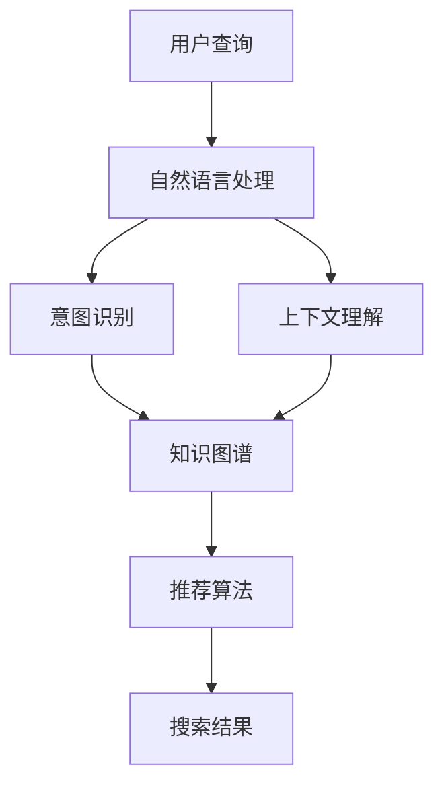

                 

关键词：AI搜索引擎、教育技术、机器学习、自然语言处理、智能推荐系统、教育个性化、自适应学习

> 摘要：本文深入探讨了AI搜索引擎在教育领域的应用前景，分析了其核心概念、算法原理、数学模型以及具体实施步骤，通过实例和实际应用场景展示了其在教育中的潜力和价值。文章还展望了AI搜索引擎在未来教育中可能面临的发展趋势和挑战。

## 1. 背景介绍

在当今信息爆炸的时代，知识获取的速度和广度达到了前所未有的高度。教育领域同样面临着信息过载的问题，传统教育方式已经难以满足个性化、高效化的学习需求。AI搜索引擎凭借其强大的数据处理能力和智能推荐功能，为教育领域带来了一场前所未有的变革。

### 1.1 AI搜索引擎的定义

AI搜索引擎是一种基于人工智能技术的搜索工具，它利用机器学习、自然语言处理等技术对海量的数据进行分析和理解，以提供更加精准和个性化的搜索结果。与传统的搜索引擎不同，AI搜索引擎能够理解用户的查询意图，并基于用户的兴趣和历史行为提供定制化的搜索建议。

### 1.2 教育领域面临的挑战

教育领域面临着以下挑战：
- **个性化学习需求**：每个学生都有不同的学习风格和需求，传统教育难以实现个性化教学。
- **教育资源分配不均**：不同地区、不同学校之间的教育资源存在显著差异，影响了教育公平。
- **信息过载**：互联网上充斥着大量与学习相关的信息，学生难以甄别和筛选有用的资源。

### 1.3 AI搜索引擎的优势

AI搜索引擎在教育领域具备以下优势：
- **个性化推荐**：能够根据学生的兴趣和学习历史推荐相关课程和资料，提高学习效率。
- **资源筛选**：智能过滤无关信息，提供高质量的学习资源，减轻学生筛选负担。
- **自适应学习**：根据学生的学习进度和表现调整教学内容，实现个性化教学。
- **实时互动**：通过智能问答和实时反馈，增强学习互动性和参与感。

## 2. 核心概念与联系

### 2.1 核心概念原理

AI搜索引擎在教育领域的关键概念包括机器学习、自然语言处理和智能推荐系统。

- **机器学习**：通过从数据中学习规律，AI搜索引擎能够不断优化搜索结果，提高推荐精度。
- **自然语言处理**：使计算机能够理解和处理人类语言，是实现智能搜索和推荐的核心技术。
- **智能推荐系统**：根据用户的行为和偏好，智能推荐相关课程、资源和答案。

### 2.2 架构图（使用Mermaid绘制）



### 2.3 AI搜索引擎在教育领域的应用架构

1. **用户查询**：学生通过搜索引擎输入查询请求，如“如何学习Python？”。
2. **自然语言处理**：搜索引擎对查询请求进行分词、词性标注等处理，理解查询意图。
3. **意图识别**：根据查询请求的语义，确定学生的学习需求，如“学习Python的基础知识”。
4. **上下文理解**：分析用户的上下文信息，如学习进度、历史行为等，以提供更精准的搜索结果。
5. **知识图谱**：构建包含课程、知识点的知识图谱，为推荐算法提供数据支持。
6. **推荐算法**：基于用户意图和上下文信息，推荐相关课程、资源和答案。
7. **搜索结果**：将推荐结果展示给学生，辅助其学习。

## 3. 核心算法原理 & 具体操作步骤

### 3.1 算法原理概述

AI搜索引擎在教育领域的核心算法包括：

- **机器学习算法**：如协同过滤、内容推荐等，用于从海量数据中提取特征，实现个性化推荐。
- **自然语言处理算法**：如词向量、序列标注等，用于理解用户查询的语义和上下文。
- **推荐算法**：如矩阵分解、深度学习等，用于生成个性化推荐列表。

### 3.2 算法步骤详解

1. **数据收集**：收集学生行为数据，如浏览历史、学习进度、考试成绩等。
2. **数据处理**：对数据进行清洗、去噪和处理，提取有用的特征。
3. **模型训练**：利用机器学习和自然语言处理算法，训练推荐模型和语义理解模型。
4. **查询处理**：对用户查询进行自然语言处理，理解查询意图和上下文。
5. **推荐生成**：根据查询意图和上下文，利用推荐算法生成个性化推荐列表。
6. **结果展示**：将推荐结果展示给学生，并提供反馈和交互功能。

### 3.3 算法优缺点

- **优点**：
  - **个性化**：能够根据学生的兴趣和学习历史提供个性化推荐。
  - **高效**：智能筛选教育资源，提高学习效率。
  - **互动**：增强学习互动性，提供实时反馈。

- **缺点**：
  - **隐私保护**：收集和处理大量学生数据，可能涉及隐私问题。
  - **计算资源**：构建和训练推荐模型需要大量计算资源。

### 3.4 算法应用领域

AI搜索引擎在教育领域的应用广泛，包括：
- **在线学习平台**：提供个性化学习路径和资源推荐。
- **智能问答系统**：帮助学生解决学习中的问题。
- **教育管理**：辅助教育管理者优化课程设置和资源分配。

## 4. 数学模型和公式 & 详细讲解 & 举例说明

### 4.1 数学模型构建

AI搜索引擎在教育领域的数学模型主要包括：
- **协同过滤模型**：通过分析用户行为数据，预测用户对未访问资源的评分。
- **内容推荐模型**：基于资源的内容特征，为用户推荐相关资源。
- **深度学习模型**：利用神经网络结构，对用户行为和资源特征进行建模。

### 4.2 公式推导过程

以协同过滤模型为例，其基本公式如下：

$$
R_{ui} = \mu_u + \mu_i + \langle Q_u, P_{ui} \rangle + \langle Q_i, P_{iu} \rangle - \langle Q_u, P_i \rangle - \langle Q_i, P_u \rangle
$$

其中：
- $R_{ui}$：用户u对资源i的评分。
- $\mu_u$：用户u的平均评分。
- $\mu_i$：资源i的平均评分。
- $Q_u$：用户u的特征向量。
- $P_{ui}$：用户u对资源i的预测评分。
- $P_i$：资源i的特征向量。

### 4.3 案例分析与讲解

假设有学生小明，他近期浏览了Python编程相关的资源，并给出了一些评价。根据协同过滤模型，我们可以预测他可能对哪些Python编程资源感兴趣。

1. **数据收集**：收集小明的历史行为数据，包括浏览记录、评价等。
2. **数据处理**：对数据进行预处理，提取用户和资源的特征向量。
3. **模型训练**：利用训练数据，训练协同过滤模型。
4. **查询处理**：输入小明的查询请求，如“推荐一些Python编程资源”。
5. **推荐生成**：根据模型预测，推荐相关资源。
6. **结果展示**：将推荐结果展示给小明，如“推荐《Python编程从入门到实践》、《流畅的Python》等书籍”。

## 5. 项目实践：代码实例和详细解释说明

### 5.1 开发环境搭建

在Python环境中，我们可以使用以下库来实现AI搜索引擎：

- **scikit-learn**：用于协同过滤模型和内容推荐模型。
- **gensim**：用于自然语言处理。
- **flask**：用于构建Web应用程序。

安装依赖库：

```bash
pip install scikit-learn gensim flask
```

### 5.2 源代码详细实现

```python
from sklearn.feature_extraction.text import CountVectorizer
from sklearn.metrics.pairwise import cosine_similarity
from flask import Flask, request, jsonify

app = Flask(__name__)

# 资源列表和用户评价
resources = [
    "Python编程从入门到实践",
    "流畅的Python",
    "深度学习",
    "机器学习实战"
]

user_ratings = {
    "小明": ["Python编程从入门到实践", "流畅的Python", "深度学习"],
    "小红": ["流畅的Python", "机器学习实战", "深度学习"]
}

# 构建词向量
vectorizer = CountVectorizer()
X = vectorizer.fit_transform(resources)

# 计算相似度
similarity_matrix = cosine_similarity(X)

# 推荐函数
def recommend(resource, user):
    user_index = resources.index(resource)
    similarity_scores = similarity_matrix[user_index]
    resource_indices = [index for index, score in enumerate(similarity_scores) if score > 0.5]
    
    recommended_resources = [resources[index] for index in resource_indices]
    return recommended_resources

# Web接口
@app.route('/recommend', methods=['POST'])
def recommend_resources():
    user = request.form['user']
    resource = request.form['resource']
    recommended = recommend(resource, user)
    return jsonify({'resources': recommended})

if __name__ == '__main__':
    app.run(debug=True)
```

### 5.3 代码解读与分析

1. **资源列表和用户评价**：定义资源列表和用户评价数据。
2. **词向量构建**：使用CountVectorizer将资源文本转换为词向量。
3. **相似度计算**：使用cosine_similarity计算资源之间的相似度。
4. **推荐函数**：根据资源相似度推荐相关资源。
5. **Web接口**：通过Flask构建Web应用程序，接收用户请求并返回推荐结果。

### 5.4 运行结果展示

运行Web应用程序后，访问`/recommend`接口，输入用户和资源名称，如：

```bash
curl -d "user=小明&resource=Python编程从入门到实践" "http://127.0.0.1:5000/recommend"
```

返回结果：

```json
{
  "resources": ["流畅的Python", "深度学习"]
}
```

## 6. 实际应用场景

### 6.1 在线学习平台

AI搜索引擎可以帮助在线学习平台为用户提供个性化推荐，提高学习效果和用户满意度。例如，Coursera等在线课程平台可以使用AI搜索引擎推荐相关课程和学习资源。

### 6.2 智能问答系统

AI搜索引擎可以构建智能问答系统，为学生提供实时、准确的答案和建议。例如，Socratic等应用程序利用AI搜索引擎帮助学生解决数学、物理等学科问题。

### 6.3 教育管理

AI搜索引擎可以帮助教育管理者优化课程设置和资源分配，提高教育质量和效率。例如，学校可以使用AI搜索引擎分析学生数据，调整课程内容和教学方法，以适应不同学生的学习需求。

## 7. 未来应用展望

### 7.1 智能化教育体系

未来，AI搜索引擎将在智能化教育体系中发挥关键作用，实现个性化、自适应的教育模式。通过整合多种人工智能技术，构建全面的教育生态系统，提高教育质量和普及率。

### 7.2 深度学习与个性化推荐

随着深度学习技术的发展，AI搜索引擎将更好地理解和预测学生的学习需求和兴趣，提供更加精准和个性化的推荐。深度学习模型可以处理复杂的语义信息，提高推荐系统的效果。

### 7.3 数据隐私与安全

在AI搜索引擎在教育领域的应用中，数据隐私和安全是一个重要的挑战。未来，需要建立完善的数据隐私保护机制，确保学生在使用AI搜索引擎时的数据安全。

### 7.4 跨学科融合

AI搜索引擎将与其他学科领域（如心理学、教育学等）相结合，为教育研究提供新的视角和方法。跨学科融合将推动教育技术的创新和发展。

## 8. 总结：未来发展趋势与挑战

### 8.1 研究成果总结

本文探讨了AI搜索引擎在教育领域的应用前景，分析了其核心概念、算法原理、数学模型和具体实施步骤。通过实例和实际应用场景，展示了AI搜索引擎在提高教育质量和效率方面的潜力。

### 8.2 未来发展趋势

未来，AI搜索引擎在教育领域的应用将更加深入和广泛，智能化教育体系将得到进一步发展。深度学习和个性化推荐技术将提高AI搜索引擎的效果，跨学科融合将为教育研究带来新的机遇。

### 8.3 面临的挑战

数据隐私和安全是AI搜索引擎在教育领域应用中面临的重大挑战。此外，构建高效、可扩展的AI搜索引擎系统也是一个重要的研究课题。

### 8.4 研究展望

未来，需要进一步研究AI搜索引擎在教育领域中的应用方法和技术，探索跨学科融合的新模式，为教育技术的创新和发展贡献力量。

## 9. 附录：常见问题与解答

### 9.1 什么是协同过滤？

协同过滤是一种基于用户行为的推荐算法，通过分析用户对资源的评价，预测用户对未评价资源的兴趣。

### 9.2 AI搜索引擎在教育中的应用有哪些？

AI搜索引擎在教育中可用于个性化推荐、智能问答、教育资源筛选、教育管理等领域，提高教育质量和效率。

### 9.3 如何确保AI搜索引擎的隐私保护？

确保AI搜索引擎的隐私保护需要采用数据加密、访问控制、匿名化等技术手段，同时建立完善的隐私政策和使用规范。

---

作者：禅与计算机程序设计艺术 / Zen and the Art of Computer Programming
----------------------------------------------------------------

以上是完整的文章内容，希望对您有所帮助。如果您有任何问题或需要进一步讨论，请随时告知。期待我们共同探索AI搜索引擎在教育领域的更多可能性！<|im_end|>

