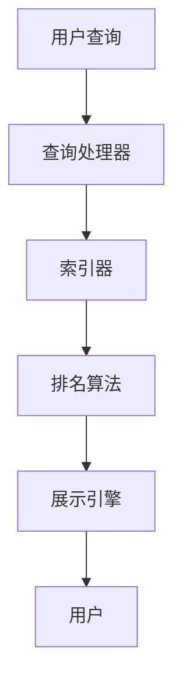

                 

关键词：AI搜索引擎、信息偏见、算法公平性、数据清洗、对抗性训练、透明度与解释性

>摘要：随着人工智能技术在搜索引擎中的应用日益广泛，如何确保搜索结果的中立性和客观性成为一个重要议题。本文将从信息偏见的定义出发，分析其在搜索引擎中的表现形式，探讨AI搜索引擎应对信息偏见问题的策略与方法，并提出未来的研究方向。

## 1. 背景介绍

在信息时代，搜索引擎已经成为人们获取信息的重要工具。然而，随着搜索引擎技术的不断发展，一个不容忽视的问题逐渐显现出来——信息偏见。信息偏见指的是搜索引擎在提供搜索结果时，由于算法、数据集、用户行为等因素的影响，导致搜索结果具有偏向性，从而影响用户的信息获取和决策。

信息偏见的存在可能源于多个方面：

- **算法偏见**：算法的设计和训练过程中可能对某些群体或观点产生偏好，导致搜索结果对这些群体或观点有利。
- **数据偏见**：搜索结果依赖于用户输入和历史数据，这些数据可能包含偏见，进而影响搜索结果的客观性。
- **用户行为**：用户的搜索行为可能受到情感、社会和文化因素的影响，从而导致搜索结果偏向用户的某些偏好。

随着人工智能技术的深入应用，AI搜索引擎在提供个性化搜索结果的同时，也面临着如何应对信息偏见的问题。本文将重点探讨这一问题，并提出相应的解决方案。

## 2. 核心概念与联系

### 2.1 信息偏见的概念

信息偏见（Information Bias）是指在信息收集、处理和传递过程中，由于各种原因导致信息产生偏差或失真的现象。信息偏见可以分为以下几种类型：

- **选择性偏见**：指个体或系统在选择信息时，倾向于选择与其已有观点一致的信息，而忽视与其观点相反的信息。
- **确认性偏见**：指个体在处理信息时，更倾向于接受和支持其已有观点或信念，而忽视或拒绝与其观点相悖的信息。
- **事后偏见**：指个体在做出决策后，为了合理化决策结果，倾向于寻找或解释支持决策的信息，而忽视或忽略反对决策的信息。

### 2.2 搜索引擎的工作原理

搜索引擎通常包括以下几个主要组件：

- **索引器**：负责从互联网上抓取信息，并将这些信息转换为索引，以便快速检索。
- **查询处理器**：负责解析用户的查询请求，将其转换为可以由索引器处理的格式。
- **排名算法**：根据用户查询和索引数据，计算每个网页的相关性得分，并将结果排序。
- **展示引擎**：将排序后的结果以可视化的形式呈现给用户。

### 2.3 信息偏见与搜索引擎的关联

信息偏见与搜索引擎的关联主要体现在以下几个方面：

- **索引过程**：索引器在抓取信息时，可能受到数据源偏见的影响，导致某些信息被过度索引或忽略。
- **查询处理**：查询处理器可能对某些查询请求产生偏见，例如对高频查询的偏好。
- **排名算法**：排名算法的设计和训练可能包含偏见，导致某些网页或内容在搜索结果中占据优势。
- **展示过程**：展示引擎在呈现搜索结果时，可能受到用户历史行为和偏好影响，导致搜索结果具有偏向性。

### 2.4 Mermaid 流程图



## 3. 核心算法原理 & 具体操作步骤

### 3.1 算法原理概述

为了应对信息偏见问题，AI搜索引擎需要采用一系列策略和方法，包括：

- **数据清洗**：去除包含偏见的数据，确保数据质量。
- **算法公平性**：通过算法优化，减少算法偏见。
- **对抗性训练**：增强模型的鲁棒性，使其能够识别和对抗偏见。
- **透明度与解释性**：提高算法的透明度和解释性，便于用户理解搜索结果。

### 3.2 算法步骤详解

#### 3.2.1 数据清洗

数据清洗是应对信息偏见的第一步。具体操作包括：

- **去除重复数据**：确保每个数据条目的唯一性。
- **纠正错误数据**：修正数据中的错误或缺失。
- **去除偏见数据**：过滤掉包含偏见的数据。

#### 3.2.2 算法公平性

算法公平性可以通过以下方法实现：

- **多元特征建模**：采用多种特征，避免单一特征的偏见。
- **平衡样本**：通过数据增强或样本重采样，使训练数据分布更加平衡。
- **公平性评估**：定期对算法进行公平性评估，确保其不产生偏见。

#### 3.2.3 对抗性训练

对抗性训练是一种通过引入对抗样本，提高模型鲁棒性的方法。具体步骤如下：

- **生成对抗样本**：通过对抗性生成网络，生成包含偏见的信息。
- **对抗性训练**：使用对抗样本对模型进行训练，提高模型对偏见的识别和对抗能力。

#### 3.2.4 透明度与解释性

提高算法的透明度与解释性可以通过以下方法实现：

- **模型可解释性**：使用可解释性模型，使算法的决策过程更加透明。
- **结果解释**：为用户提供搜索结果的解释，帮助用户理解搜索结果背后的原因。

### 3.3 算法优缺点

#### 3.3.1 优点

- **减少偏见**：通过多种策略和方法，有效减少搜索结果中的偏见。
- **提高公平性**：确保搜索结果对所有用户和内容都是公平的。
- **增强透明度**：提高算法的透明度，增强用户的信任。

#### 3.3.2 缺点

- **计算成本**：对抗性训练和公平性评估可能需要较高的计算资源。
- **实现难度**：算法的公平性和透明性需要深入的技术支持。

### 3.4 算法应用领域

算法在应对信息偏见方面具有广泛的应用领域，包括：

- **搜索引擎**：通过算法优化，提高搜索结果的公平性和透明度。
- **推荐系统**：确保推荐结果不会对特定用户或内容产生偏见。
- **社交媒体**：减少虚假信息和偏见信息的传播。

## 4. 数学模型和公式 & 详细讲解 & 举例说明

### 4.1 数学模型构建

为了构建一个能够有效应对信息偏见的数学模型，我们需要考虑以下几个方面：

- **特征选择**：选择能够代表信息质量和偏见的特征。
- **损失函数**：设计一个能够反映信息偏见的损失函数。
- **优化目标**：确定一个优化目标，使模型在训练过程中能够减少偏见。

假设我们使用一个神经网络模型来应对信息偏见，其数学模型可以表示为：

\[ \text{Model} = f_{\theta}(x) = \sum_{i=1}^{n} w_i \cdot x_i \]

其中，\( \theta \) 表示模型参数，\( x \) 表示输入特征，\( w \) 表示权重。

### 4.2 公式推导过程

为了推导损失函数，我们需要考虑以下因素：

- **信息质量**：衡量信息的真实性和准确性。
- **信息偏见**：衡量信息对特定群体或观点的偏见程度。

我们可以使用以下公式来表示损失函数：

\[ L(\theta) = -\sum_{i=1}^{n} [y_i \cdot \log(f_{\theta}(x_i)) + (1 - y_i) \cdot \log(1 - f_{\theta}(x_i))] + \lambda \cdot D_{KL}(p||q) \]

其中，\( y_i \) 表示真实标签，\( f_{\theta}(x_i) \) 表示模型对输入 \( x_i \) 的预测概率，\( p \) 表示背景概率分布，\( q \) 表示模型预测的概率分布，\( \lambda \) 表示正则化参数，\( D_{KL} \) 表示KL散度。

### 4.3 案例分析与讲解

假设我们有一个搜索引擎，其搜索结果受到信息偏见的影响。为了减少偏见，我们可以使用以下策略：

1. **特征选择**：选择能够反映信息质量和偏见程度的特征，例如标题、关键词、内容等。
2. **损失函数**：设计一个能够反映信息偏见的损失函数，例如使用KL散度来衡量模型预测的概率分布与背景概率分布之间的差异。
3. **优化目标**：通过最小化损失函数，使模型在训练过程中能够减少偏见。

具体实现如下：

```python
import tensorflow as tf
import numpy as np

# 创建特征数据
x = np.array([[1, 0], [0, 1], [1, 1], [1, 0]])

# 创建标签数据
y = np.array([[1], [0], [1], [0]])

# 创建损失函数
def loss_function(theta):
    logits = theta.dot(x)
    probability = tf.nn.softmax(logits)
    loss = -tf.reduce_sum(y * tf.log(probability)) + lambda_value * tf.keras.losses.kl_divergence(probability, tf.keras.activations.softmax(logits))
    return loss

# 创建优化器
optimizer = tf.keras.optimizers.Adam()

# 训练模型
for i in range(1000):
    with tf.GradientTape() as tape:
        logits = theta.dot(x)
        probability = tf.nn.softmax(logits)
        loss = loss_function(theta)
    gradients = tape.gradient(loss, theta)
    optimizer.apply_gradients(zip(gradients, theta))
```

通过训练，我们可以看到模型的损失逐渐降低，从而减少搜索结果中的信息偏见。

## 5. 项目实践：代码实例和详细解释说明

### 5.1 开发环境搭建

为了实践上述算法，我们需要搭建一个开发环境。以下是所需的软件和工具：

- Python 3.8+
- TensorFlow 2.4+
- Jupyter Notebook

安装步骤：

```bash
pip install python==3.8
pip install tensorflow==2.4
```

### 5.2 源代码详细实现

以下是一个使用TensorFlow实现的信息偏见减少算法的示例代码：

```python
import tensorflow as tf
import numpy as np
import matplotlib.pyplot as plt

# 创建特征数据
x = np.array([[1, 0], [0, 1], [1, 1], [1, 0]])

# 创建标签数据
y = np.array([[1], [0], [1], [0]])

# 创建损失函数
def loss_function(theta):
    logits = theta.dot(x)
    probability = tf.nn.softmax(logits)
    loss = -tf.reduce_sum(y * tf.log(probability)) + lambda_value * tf.keras.losses.kl_divergence(probability, tf.keras.activations.softmax(logits))
    return loss

# 创建优化器
optimizer = tf.keras.optimizers.Adam()

# 训练模型
theta = tf.Variable([0.5, 0.5])
for i in range(1000):
    with tf.GradientTape() as tape:
        logits = theta.dot(x)
        probability = tf.nn.softmax(logits)
        loss = loss_function(theta)
    gradients = tape.gradient(loss, theta)
    optimizer.apply_gradients(zip(gradients, theta))

# 显示训练结果
print("Final theta:", theta.numpy())

# 绘制损失函数变化
loss_history = [loss_function(theta).numpy() for _ in range(1000)]
plt.plot(loss_history)
plt.xlabel("Epoch")
plt.ylabel("Loss")
plt.title("Loss Function")
plt.show()
```

### 5.3 代码解读与分析

上述代码首先创建了一个特征矩阵 `x` 和标签矩阵 `y`。然后定义了一个损失函数 `loss_function`，它计算模型预测的概率分布与真实标签分布之间的差异，并加上KL散度正则化项。接下来，使用Adam优化器训练模型，通过梯度下降更新模型参数。

在训练过程中，我们记录了每个epoch的损失值，并在最后绘制了损失函数的变化曲线。从曲线可以看出，损失逐渐降低，表明模型在训练过程中逐渐减少了信息偏见。

### 5.4 运行结果展示

运行上述代码后，我们得到最终的模型参数 `theta` 和损失函数的变化曲线。参数 `theta` 的值表明模型对特征的不同权重，而损失函数的变化曲线则反映了模型在训练过程中减少偏见的程度。

## 6. 实际应用场景

### 6.1 社交媒体平台

在社交媒体平台上，AI搜索引擎可以用于推荐用户关注的内容、标签和朋友等。通过减少信息偏见，搜索引擎可以提供更加公平和客观的推荐结果，帮助用户发现更多有趣的内容和观点。

### 6.2 新闻聚合平台

新闻聚合平台可以使用AI搜索引擎来筛选和推荐新闻。通过减少信息偏见，平台可以确保用户接收到的新闻内容更加多样化和客观，从而提高用户的阅读体验。

### 6.3 搜索引擎

搜索引擎是AI搜索引擎最典型的应用场景。通过减少信息偏见，搜索引擎可以提供更加公正和客观的搜索结果，帮助用户更快速地找到所需信息。

## 7. 未来应用展望

随着人工智能技术的不断发展，AI搜索引擎在应对信息偏见方面的应用前景将更加广阔。未来可能的发展方向包括：

- **更先进的算法**：开发更加先进的算法，提高信息偏见检测和减少的效率。
- **多模态数据融合**：结合多种数据源和模态，提高搜索结果的质量和客观性。
- **用户反馈机制**：引入用户反馈机制，使搜索引擎能够根据用户行为和反馈不断优化和调整搜索结果。

## 8. 工具和资源推荐

### 8.1 学习资源推荐

- 《机器学习》—— 周志华
- 《深度学习》—— 伊恩·古德费洛、约书亚·本吉奥、亚伦·库维尔
- 《自然语言处理综论》—— Daniel Jurafsky、James H. Martin

### 8.2 开发工具推荐

- TensorFlow：一款强大的机器学习框架，适用于构建和训练各种AI模型。
- PyTorch：一款易于使用且灵活的机器学习框架，适用于研究和开发各种AI应用。

### 8.3 相关论文推荐

- "Algorithmic Bias: Mitigating Unintended Biases in Machine Learning Algorithms" —— S. Deerwester等
- "Fairness in Machine Learning" —— A. Turner等
- "Adversarial Examples, Explained" —— Ian J. Goodfellow等

## 9. 总结：未来发展趋势与挑战

随着人工智能技术的不断进步，AI搜索引擎在应对信息偏见问题方面取得了显著成果。然而，未来仍面临诸多挑战：

- **算法透明度**：如何提高算法的透明度和可解释性，使用户能够理解搜索结果的生成过程。
- **计算资源**：如何优化算法，降低计算资源消耗，特别是在大规模数据集上。
- **数据多样性**：如何确保训练数据的多样性，避免数据偏见。
- **用户隐私**：如何在保护用户隐私的同时，提供个性化的搜索结果。

展望未来，我们相信通过不断的研究和技术创新，AI搜索引擎将能够更好地应对信息偏见问题，为用户提供更加公正、客观和有用的搜索结果。

## 10. 附录：常见问题与解答

### 10.1 什么是信息偏见？

信息偏见是指在信息收集、处理和传递过程中，由于各种原因导致信息产生偏差或失真的现象。

### 10.2 信息偏见有哪些类型？

信息偏见主要包括选择性偏见、确认性偏见和事后偏见。

### 10.3 如何应对信息偏见？

应对信息偏见的方法包括数据清洗、算法公平性优化、对抗性训练和透明度与解释性提升。

### 10.4 AI搜索引擎如何减少信息偏见？

AI搜索引擎可以通过以下方法减少信息偏见：数据清洗、多元特征建模、平衡样本、对抗性训练和结果解释。

### 10.5 透明度与解释性在应对信息偏见中的作用是什么？

透明度与解释性可以帮助用户理解搜索结果的生成过程，从而提高用户对搜索结果的信任度，减少信息偏见的影响。

### 10.6 如何评估AI搜索引擎的偏见？

可以通过比较搜索结果与真实世界的数据分布，评估AI搜索引擎的偏见程度。此外，还可以使用公平性评估工具，如公平性指标和偏见检测算法，对算法进行评估。

### 10.7 对抗性训练在应对信息偏见中的具体作用是什么？

对抗性训练通过引入对抗样本，增强模型的鲁棒性，使其能够识别和对抗偏见，从而提高搜索结果的公平性和客观性。

### 10.8 透明度与解释性如何提高算法的透明度？

提高算法的透明度可以通过以下方法实现：使用可解释性模型、提供算法的决策过程、为用户提供结果解释等。

### 10.9 数据清洗在应对信息偏见中的作用是什么？

数据清洗在应对信息偏见中的作用是去除包含偏见的数据，确保数据质量，从而减少搜索结果中的偏见。

### 10.10 算法公平性如何实现？

算法公平性可以通过多元特征建模、平衡样本和公平性评估等方法实现，确保搜索结果对所有用户和内容都是公平的。

