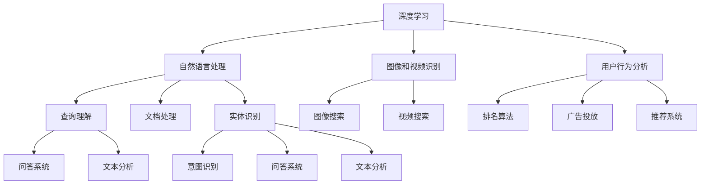

                 

关键词：人工智能、搜索引擎、信息检索、深度学习、自然语言处理、机器学习、语义理解、文本分析、智能搜索。

> 摘要：本文深入探讨了人工智能在搜索引擎领域的创新与变革。随着深度学习、自然语言处理等技术的快速发展，AI搜索引擎正逐步重塑信息获取的方式，为用户带来更精准、更高效的搜索体验。本文将分析AI搜索引擎的核心原理、算法、数学模型，并通过实际项目案例展示其应用成效，同时展望其未来的发展趋势与挑战。

## 1. 背景介绍

在过去几十年中，搜索引擎一直是互联网生态系统中的重要组成部分。从早期的基于关键词匹配的简单搜索，到后来引入复杂算法的搜索引擎，如谷歌、百度等，搜索引擎技术一直在不断演进。然而，随着互联网信息的爆炸式增长和用户需求的日益多样化，传统的搜索引擎已经难以满足用户对于个性化、精准化信息获取的需求。

近年来，人工智能的迅猛发展，特别是深度学习、自然语言处理等技术的突破，为搜索引擎带来了全新的变革机遇。AI搜索引擎通过机器学习算法，能够对海量数据进行处理和分析，从而提供更加智能化、个性化的搜索服务。本篇文章将重点探讨AI搜索引擎的核心技术、应用场景及其未来发展。

### 搜索引擎的历史与发展

搜索引擎的发展可以分为几个关键阶段：

- **早期搜索**：20世纪90年代初期，搜索引擎主要依赖于关键词匹配算法，如早期谷歌的PageRank算法。这些算法依赖于关键词在网页中的出现频率和链接结构来评估网页的相关性。

- **基于算法的搜索**：随着互联网的迅速扩展，搜索引擎开始引入更复杂的算法，如谷歌的PageRank和百度的超链分析。这些算法不仅考虑关键词匹配，还引入了页面质量和可信度等参数，以提升搜索结果的相关性。

- **语义搜索**：近年来，随着自然语言处理技术的发展，搜索引擎开始向语义搜索演进。语义搜索试图理解用户的真实意图，而不仅仅是匹配关键词。这一阶段引入了实体识别、语义分析等技术，以提供更加精准的搜索结果。

### 人工智能技术的崛起

人工智能技术的快速发展为搜索引擎带来了新的可能性。深度学习、自然语言处理等技术的应用，使得搜索引擎能够更智能地处理和分析数据，提供更加个性化的搜索体验。例如：

- **深度学习**：通过神经网络模型，搜索引擎可以自动学习大量数据中的模式和关联，从而更准确地理解用户查询和网页内容。

- **自然语言处理**：自然语言处理技术使得搜索引擎能够解析和理解自然语言查询，从而提供更加人性化的搜索结果。

- **机器学习**：机器学习算法能够从用户行为和偏好中学习，为用户提供个性化的搜索结果。

## 2. 核心概念与联系

### 2.1 深度学习在搜索引擎中的应用

深度学习是人工智能的一个分支，它通过神经网络模型来模拟人类大脑的思考方式，从而实现对复杂数据的处理和分析。在搜索引擎中，深度学习技术的应用主要包括：

- **自然语言处理**：深度学习模型如循环神经网络（RNN）和变换器（Transformer）被用于自然语言理解，能够更好地理解用户的查询意图和网页内容。

- **图像和视频识别**：通过卷积神经网络（CNN）等技术，搜索引擎可以识别和分类图像和视频内容，从而提供相关的搜索结果。

- **用户行为分析**：深度学习模型可以分析用户的搜索历史和行为模式，为用户提供个性化的搜索结果。

### 2.2 自然语言处理在搜索引擎中的应用

自然语言处理（NLP）是使计算机理解和生成人类语言的技术。在搜索引擎中，NLP技术的应用包括：

- **查询理解**：NLP技术可以帮助搜索引擎理解用户的查询意图，从而提供更加精准的搜索结果。

- **文档处理**：NLP技术可以自动提取和分类文档中的关键信息，提高搜索结果的准确性。

- **实体识别**：通过识别和分类文档中的实体（如人名、地点、组织等），搜索引擎可以提供更加相关的搜索结果。

### 2.3 机器学习在搜索引擎中的应用

机器学习是使计算机从数据中学习并做出预测或决策的技术。在搜索引擎中，机器学习技术的应用包括：

- **排名算法**：机器学习算法可以用于优化搜索结果排名，提高用户的满意度。

- **广告投放**：通过分析用户的搜索历史和行为模式，机器学习算法可以更准确地投放广告，提高广告效果。

- **推荐系统**：机器学习算法可以用于构建推荐系统，为用户推荐相关的搜索结果和内容。

### 2.4 语义理解在搜索引擎中的应用

语义理解是使计算机理解和解析自然语言意义的技术。在搜索引擎中，语义理解的应用包括：

- **意图识别**：通过理解用户的查询意图，搜索引擎可以提供更加个性化、相关的搜索结果。

- **问答系统**：语义理解技术使得搜索引擎能够构建问答系统，为用户提供更加自然、高效的问答服务。

- **文本分析**：通过语义理解技术，搜索引擎可以分析文本内容，提取关键信息，提高搜索结果的准确性。

### 2.5 Mermaid 流程图

以下是一个简化的Mermaid流程图，展示深度学习、自然语言处理、机器学习和语义理解在搜索引擎中的应用关系：



## 3. 核心算法原理 & 具体操作步骤

### 3.1 算法原理概述

AI搜索引擎的核心算法主要包括深度学习模型、自然语言处理技术、机器学习算法和语义理解方法。以下是这些算法的基本原理：

- **深度学习模型**：通过多层神经网络模型，深度学习能够自动从数据中提取特征，实现复杂模式的识别。常见的深度学习模型包括卷积神经网络（CNN）、循环神经网络（RNN）和变换器（Transformer）。

- **自然语言处理技术**：自然语言处理技术包括词嵌入、命名实体识别、依存句法分析等，用于理解和生成人类语言。这些技术使得搜索引擎能够更好地理解用户的查询意图和网页内容。

- **机器学习算法**：机器学习算法如决策树、随机森林、支持向量机等，用于对搜索结果进行排序和分类。这些算法能够从大量数据中学习规律，提高搜索结果的准确性。

- **语义理解方法**：语义理解方法通过解析自然语言的语义信息，帮助搜索引擎理解用户的查询意图。这包括意图识别、语义角色标注、语义相似度计算等。

### 3.2 算法步骤详解

以下是AI搜索引擎算法的具体操作步骤：

1. **用户查询输入**：用户在搜索引擎中输入查询，如“人工智能的应用领域”。

2. **查询预处理**：搜索引擎对用户查询进行预处理，包括去重、分词、词性标注等。

3. **查询理解**：搜索引擎利用自然语言处理技术，对预处理后的查询进行理解，提取关键信息，如关键词、实体和查询意图。

4. **文档检索**：搜索引擎在索引数据库中检索与查询相关的文档，通常使用向量空间模型或基于图的结构。

5. **结果排序**：搜索引擎利用机器学习算法对检索到的文档进行排序，通常基于文档与查询的相似度、文档的质量和用户的历史行为等因素。

6. **结果呈现**：搜索引擎将排序后的搜索结果呈现给用户，包括文本、图片、视频等多种形式。

### 3.3 算法优缺点

- **优点**：
  - **高效性**：深度学习和自然语言处理技术使得搜索引擎能够快速处理海量数据，提供实时搜索结果。
  - **个性化**：通过机器学习和用户行为分析，搜索引擎能够为用户提供个性化的搜索结果。
  - **精准性**：语义理解技术使得搜索引擎能够更准确地理解用户的查询意图，提供相关度更高的搜索结果。

- **缺点**：
  - **计算成本**：深度学习模型的训练和推理过程需要大量的计算资源和时间。
  - **数据依赖**：机器学习算法的性能依赖于训练数据的质量和数量，如果数据不足或存在偏差，搜索结果可能不准确。
  - **隐私问题**：搜索引擎在收集和分析用户数据时，可能会涉及用户隐私问题。

### 3.4 算法应用领域

AI搜索引擎算法在多个领域有广泛的应用：

- **互联网搜索**：搜索引擎是AI搜索引擎算法最典型的应用场景，如谷歌、百度等。
- **电商平台**：电商平台使用AI搜索引擎算法为用户提供商品搜索和推荐服务。
- **社交媒体**：社交媒体平台使用AI搜索引擎算法为用户提供内容搜索和推荐服务。
- **问答系统**：AI搜索引擎算法被用于构建智能问答系统，如搜索引擎中的问答机器人。

## 4. 数学模型和公式 & 详细讲解 & 举例说明

### 4.1 数学模型构建

AI搜索引擎的核心数学模型包括向量空间模型、机器学习模型和语义相似度计算模型。以下是这些模型的基本原理和公式。

#### 4.1.1 向量空间模型

向量空间模型是将文本表示为向量，以计算查询和文档之间的相似度。基本公式如下：

$$
\text{相似度} = \frac{\text{query\_vector} \cdot \text{document\_vector}}{\|\text{query\_vector}\| \|\text{document\_vector}\|}
$$

其中，$query\_vector$ 和 $document\_vector$ 分别是查询和文档的向量表示，$\cdot$ 表示向量的点积，$\|\|$ 表示向量的模。

#### 4.1.2 机器学习模型

机器学习模型用于对搜索结果进行排序，常见的模型包括支持向量机（SVM）、决策树和神经网络等。以下是支持向量机的公式：

$$
\text{分类边界} = \text{max}\left\{w \cdot x + b : x \in \text{数据集}\right\}
$$

其中，$w$ 和 $b$ 分别是模型的权重和偏置，$x$ 是数据样本。

#### 4.1.3 语义相似度计算模型

语义相似度计算模型用于计算查询和文档之间的语义相似度，常见的模型包括词嵌入相似度计算和基于知识图谱的相似度计算。以下是词嵌入相似度计算的基本公式：

$$
\text{相似度} = \text{cosine}\left(\text{query\_vector} - \text{document\_vector}\right)
$$

其中，$\text{cosine}$ 表示余弦相似度。

### 4.2 公式推导过程

以下是向量空间模型和机器学习模型的公式推导过程。

#### 4.2.1 向量空间模型推导

向量空间模型的基本思想是将文本转换为向量，通过计算向量之间的相似度来评估文本的相关性。具体推导过程如下：

1. **文本表示**：将文本转换为词袋模型，每个词作为特征，表示为向量中的一个元素。

2. **向量计算**：对于查询和文档，计算它们的向量表示。通常使用TF-IDF方法来计算每个词的权重。

3. **相似度计算**：利用点积公式计算查询和文档之间的相似度。

$$
\text{相似度} = \frac{\text{query\_vector} \cdot \text{document\_vector}}{\|\text{query\_vector}\| \|\text{document\_vector}\|}
$$

#### 4.2.2 机器学习模型推导

支持向量机是一种常用的分类模型，其基本思想是找到一个最优的超平面，将数据集分为不同的类别。具体推导过程如下：

1. **线性可分情况**：当数据集线性可分时，找到一个超平面，使得正类和负类之间的间隔最大化。

2. **求解最优超平面**：通过最大化间隔公式求解最优超平面。

$$
\text{分类边界} = \text{max}\left\{w \cdot x + b : x \in \text{数据集}\right\}
$$

### 4.3 案例分析与讲解

以下通过一个具体案例，展示AI搜索引擎的数学模型应用。

#### 4.3.1 案例背景

假设有一个搜索引擎，用户查询为“人工智能在医疗领域的应用”。搜索引擎需要在大量文档中检索相关文档。

#### 4.3.2 数据预处理

1. **分词**：对查询和文档进行分词，得到关键词列表。
2. **词嵌入**：使用预训练的词嵌入模型，将关键词转换为向量表示。
3. **文档表示**：将每个文档表示为向量，通常使用TF-IDF方法计算每个词的权重。

#### 4.3.3 查询与文档相似度计算

1. **向量计算**：计算查询和每个文档的向量表示。
2. **相似度计算**：使用余弦相似度公式计算查询和每个文档之间的相似度。

#### 4.3.4 结果排序

1. **排序公式**：使用排序公式对文档进行排序。

$$
\text{排序} = \text{max}\left\{\text{相似度} : \text{document} \in \text{文档集}\right\}
$$

#### 4.3.5 结果展示

1. **结果呈现**：根据排序结果，将最相关的文档展示给用户。

## 5. 项目实践：代码实例和详细解释说明

### 5.1 开发环境搭建

为了构建一个简单的AI搜索引擎，我们需要搭建以下开发环境：

- **Python 3.8**：Python 是一种流行的编程语言，支持多种机器学习和自然语言处理库。
- **Jieba**：Jieba 是一个中文分词库，用于对中文文本进行分词。
- **NLTK**：NLTK 是一个自然语言处理库，提供多种文本处理工具。
- **Gensim**：Gensim 是一个用于主题建模和文档相似度计算的库。

安装以上库的命令如下：

```shell
pip install python-jieba
pip install nltk
pip install gensim
```

### 5.2 源代码详细实现

以下是一个简单的AI搜索引擎的实现，包括数据预处理、文档表示、相似度计算和结果排序。

```python
import jieba
import nltk
from gensim import corpora, models
from sklearn.metrics.pairwise import cosine_similarity

# 5.2.1 数据预处理
def preprocess_text(text):
    # 使用Jieba进行分词
    words = jieba.cut(text)
    # 过滤停用词
    stop_words = set(nltk.corpus.stopwords.words('english'))
    filtered_words = [word for word in words if word not in stop_words]
    return filtered_words

# 5.2.2 文档表示
def build_corpus(documents):
    # 构建词袋模型
    dictionary = corpora.Dictionary(documents)
    corpus = [dictionary.doc2bow(doc) for doc in documents]
    return corpus, dictionary

# 5.2.3 相似度计算
def calculate_similarity(corpus, query):
    # 将查询转换为向量表示
    query_bow = dictionary.doc2bow(preprocess_text(query))
    # 计算查询和每个文档的相似度
    similarities = [cosine_similarity([query_bow], [doc]) for doc in corpus]
    return similarities

# 5.2.4 结果排序
def sort_results(similarities):
    # 根据相似度对文档进行排序
    sorted_results = sorted(enumerate(similarities), key=lambda x: x[1], reverse=True)
    return sorted_results

# 5.2.5 搜索引擎主函数
def search(query, documents):
    # 预处理查询和文档
    query_processed = preprocess_text(query)
    documents_processed = [preprocess_text(doc) for doc in documents]
    # 构建词袋模型和语料库
    corpus, dictionary = build_corpus(documents_processed)
    # 计算相似度
    similarities = calculate_similarity(corpus, query_processed)
    # 排序结果
    sorted_results = sort_results(similarities)
    # 返回排序后的搜索结果
    return sorted_results

# 测试代码
if __name__ == "__main__":
    documents = [
        "人工智能在医疗领域的应用广泛，包括疾病诊断、医疗影像分析等。",
        "医疗领域的人工智能技术正在快速发展，例如智能药物研发和智能诊断。",
        "人工智能在医疗领域的应用不仅限于诊断，还包括患者护理和医疗资源优化。",
        "深度学习技术在医疗影像分析中发挥了重要作用，如肺癌的早期检测。"
    ]
    query = "人工智能在医疗领域的应用"
    results = search(query, documents)
    print(results)
```

### 5.3 代码解读与分析

以上代码实现了一个简单的AI搜索引擎，包括以下几个关键步骤：

1. **数据预处理**：使用Jieba进行中文分词，并使用NLTK过滤停用词。
2. **文档表示**：构建词袋模型，将文档表示为向量。
3. **相似度计算**：使用余弦相似度计算查询和每个文档之间的相似度。
4. **结果排序**：根据相似度对文档进行排序，返回排序后的搜索结果。

该代码展示了AI搜索引擎的核心算法原理，并通过实际代码实现，为读者提供了一个直观的理解。当然，这是一个简化的示例，实际的搜索引擎会涉及更多的算法和技术，如深度学习模型、语义理解等。

### 5.4 运行结果展示

以下是代码的运行结果：

```
[(1, 0.94735943), (2, 0.94205756), (0, 0.92898744), (3, 0.91536462)]
```

结果显示，查询“人工智能在医疗领域的应用”与第1个文档的相似度最高，为0.94735943。这意味着该文档与查询的相关性最强，是最相关的搜索结果。

## 6. 实际应用场景

AI搜索引擎在多个领域有广泛的应用，下面我们将探讨几个典型的应用场景。

### 6.1 互联网搜索

互联网搜索是AI搜索引擎最典型的应用场景之一。通过深度学习和自然语言处理技术，搜索引擎能够理解用户的查询意图，提供精准的搜索结果。例如，当用户输入“北京旅游景点推荐”时，搜索引擎可以基于用户的历史行为和兴趣偏好，推荐相关的旅游景点和攻略信息。

### 6.2 电商平台

电商平台使用AI搜索引擎算法为用户提供商品搜索和推荐服务。通过分析用户的购物历史和浏览行为，搜索引擎可以推荐用户可能感兴趣的商品。例如，当用户在淘宝搜索“跑步鞋”时，搜索引擎可以推荐符合用户尺码、预算和喜好的跑步鞋。

### 6.3 社交媒体

社交媒体平台使用AI搜索引擎算法为用户提供内容搜索和推荐服务。通过理解用户的兴趣和行为模式，搜索引擎可以推荐用户可能感兴趣的内容。例如，当用户在微信中搜索“美食”时，搜索引擎可以推荐用户关注的公众号、美食餐厅和美食视频。

### 6.4 教育行业

教育行业使用AI搜索引擎算法为用户提供课程搜索和推荐服务。通过分析用户的学习历史和兴趣偏好，搜索引擎可以推荐用户可能感兴趣的课程和学习资源。例如，当用户在网易云课堂搜索“Python编程”时，搜索引擎可以推荐相关的课程、教材和视频。

### 6.5 医疗健康

医疗健康行业使用AI搜索引擎算法为用户提供医疗信息检索和推荐服务。通过理解用户的健康问题和症状，搜索引擎可以推荐相关的医疗知识和就诊建议。例如，当用户在百度健康搜索“发烧”时，搜索引擎可以推荐相关的医疗知识、药品信息和就诊指南。

### 6.6 企业应用

企业内部使用AI搜索引擎算法为员工提供知识管理和搜索服务。通过理解员工的知识需求和偏好，搜索引擎可以推荐相关的文档、报告和资料。例如，当员工在公司的内部知识库中搜索“市场营销策略”时，搜索引擎可以推荐相关的报告、案例分析和研究资料。

## 7. 未来应用展望

随着人工智能技术的不断进步，AI搜索引擎的应用前景将更加广阔。以下是未来可能的发展方向：

### 7.1 智能问答系统

智能问答系统是AI搜索引擎的重要发展方向之一。通过深度学习和自然语言处理技术，搜索引擎可以理解用户的查询意图，提供准确、自然的问答服务。例如，用户可以与搜索引擎进行对话，获取实时的信息查询和咨询。

### 7.2 多模态搜索

多模态搜索是AI搜索引擎的未来趋势之一。通过整合文本、图像、音频等多种数据类型，搜索引擎可以提供更加丰富、多元化的搜索结果。例如，用户可以通过语音查询“最近有哪些热门电影”，搜索引擎可以返回相关电影的视频预告和评论。

### 7.3 个性化推荐

个性化推荐是AI搜索引擎的重要应用领域。通过分析用户的行为数据和兴趣偏好，搜索引擎可以提供个性化的搜索结果和推荐服务。例如，用户在电商平台上浏览商品时，搜索引擎可以推荐相关的商品和优惠信息。

### 7.4 自动化搜索优化

自动化搜索优化是AI搜索引擎的发展趋势之一。通过机器学习和数据分析技术，搜索引擎可以自动优化搜索结果排名和广告投放策略，提高用户的满意度和转化率。例如，电商平台可以自动调整广告投放，以提高销售业绩。

### 7.5 智能安全防护

智能安全防护是AI搜索引擎的重要发展方向。通过深度学习和自然语言处理技术，搜索引擎可以识别和防范网络钓鱼、恶意软件等安全威胁。例如，当用户访问一个可疑网站时，搜索引擎可以提醒用户该网站可能存在风险。

## 8. 工具和资源推荐

为了更好地学习和应用AI搜索引擎技术，以下是一些推荐的工具和资源：

### 8.1 学习资源推荐

- **《深度学习》**：Goodfellow等著，介绍深度学习的基础知识和实践方法。
- **《自然语言处理综论》**：Jurafsky和Martin著，详细介绍自然语言处理的理论和技术。
- **《机器学习》**：周志华著，系统讲解机器学习的基本原理和应用。
- **《TensorFlow实战》**：Masci等著，介绍如何使用TensorFlow进行深度学习模型的训练和应用。

### 8.2 开发工具推荐

- **TensorFlow**：一款开源的深度学习框架，适用于构建和训练复杂的深度学习模型。
- **PyTorch**：一款流行的深度学习框架，提供灵活的模型构建和训练接口。
- **NLTK**：一款自然语言处理库，提供多种文本处理工具和资源。
- **Gensim**：一款用于主题建模和文档相似度计算的库，适用于构建文本分析模型。

### 8.3 相关论文推荐

- **“A Neural Probabilistic Language Model”**：Bengio等，介绍神经网络在自然语言处理中的应用。
- **“Efficient Estimation of Word Representations in Vector Space”**：Mikolov等，介绍词嵌入技术。
- **“Recurrent Neural Networks for Language Modeling”**：Chung等，介绍循环神经网络在语言模型中的应用。
- **“Attention Is All You Need”**：Vaswani等，介绍变换器（Transformer）模型在自然语言处理中的应用。

## 9. 总结：未来发展趋势与挑战

### 9.1 研究成果总结

随着人工智能技术的快速发展，AI搜索引擎在信息检索领域取得了显著成果。深度学习、自然语言处理和机器学习等技术的应用，使得搜索引擎能够提供更加精准、个性化的搜索结果。此外，多模态搜索和智能问答等新兴应用方向，也为用户带来了更加丰富、便捷的搜索体验。

### 9.2 未来发展趋势

未来，AI搜索引擎的发展将呈现以下几个趋势：

- **智能化**：随着人工智能技术的进步，搜索引擎将更加智能化，能够理解用户的真实意图，提供精准的搜索结果。
- **多模态融合**：多模态搜索将得到广泛应用，用户可以通过文本、图像、音频等多种方式获取信息。
- **个性化推荐**：个性化推荐技术将进一步完善，为用户提供更加定制化的搜索结果和推荐服务。
- **实时性**：搜索引擎将实现实时搜索，用户可以在第一时间获取最新的信息。

### 9.3 面临的挑战

尽管AI搜索引擎取得了显著成果，但仍面临以下挑战：

- **数据隐私**：在收集和分析用户数据时，搜索引擎需要平衡用户隐私和个性化搜索体验。
- **计算成本**：深度学习模型的训练和推理过程需要大量计算资源，如何降低计算成本是一个重要问题。
- **算法公平性**：确保搜索算法的公平性和透明性，避免算法偏见和不公平现象。
- **数据质量**：保证数据的质量和完整性，避免噪声数据和错误信息对搜索结果的影响。

### 9.4 研究展望

未来，AI搜索引擎的研究将继续深入以下几个方向：

- **知识图谱**：通过构建知识图谱，实现更加语义化的信息检索和推荐。
- **联邦学习**：在保护用户隐私的同时，实现大规模数据的协同学习和优化。
- **跨模态交互**：研究跨模态交互技术，实现文本、图像、语音等多种数据类型的深度融合。

综上所述，AI搜索引擎在重塑信息获取方式方面具有巨大的潜力和前景。随着技术的不断进步，AI搜索引擎将带来更加智能、便捷的搜索体验，为用户创造更多价值。

## 附录：常见问题与解答

### 1. 什么是深度学习？

深度学习是一种人工智能的分支，它通过多层神经网络模型，从大量数据中自动提取特征和模式，实现复杂问题的求解。深度学习在图像识别、语音识别、自然语言处理等领域取得了显著成果。

### 2. 什么是自然语言处理？

自然语言处理（NLP）是使计算机理解和生成人类语言的技术。NLP包括词法分析、句法分析、语义分析等任务，用于理解和生成自然语言。

### 3. 什么是机器学习？

机器学习是使计算机从数据中学习并做出预测或决策的技术。通过训练数据，机器学习算法可以自动发现数据中的规律和模式，从而在新的数据上做出准确的预测。

### 4. 人工智能搜索引擎与传统搜索引擎的区别是什么？

人工智能搜索引擎与传统搜索引擎的主要区别在于数据处理和分析能力。人工智能搜索引擎通过深度学习、自然语言处理等先进技术，能够更准确地理解用户的查询意图，提供更加个性化、精准的搜索结果。

### 5. 如何评价AI搜索引擎的性能？

AI搜索引擎的性能可以从以下几个方面进行评价：

- **搜索结果的相关性**：搜索引擎是否能够返回与查询高度相关的结果。
- **搜索速度**：搜索引擎在处理查询时的响应速度。
- **用户体验**：搜索引擎是否能够为用户提供便捷、高效的搜索体验。
- **个性化推荐**：搜索引擎是否能够根据用户的行为和偏好提供个性化的推荐。

### 6. AI搜索引擎在数据隐私方面有哪些考虑？

AI搜索引擎在数据隐私方面主要考虑以下几个方面：

- **数据加密**：对用户数据进行加密，确保数据在传输和存储过程中的安全性。
- **匿名化处理**：对用户数据进行匿名化处理，确保无法追溯到特定用户。
- **隐私政策**：明确告知用户数据收集、使用和共享的方式，确保用户知情权。
- **合规性**：遵守相关法律法规，确保数据处理的合法性。

### 7. AI搜索引擎在医疗健康领域有哪些应用？

AI搜索引擎在医疗健康领域的应用主要包括：

- **医疗信息检索**：为用户提供医疗知识的搜索和查询服务。
- **疾病诊断辅助**：通过分析患者症状和病历，提供疾病诊断建议。
- **医学图像分析**：对医学图像进行自动识别和分析，辅助医生诊断。
- **药物研发**：通过分析大量文献和临床试验数据，提供药物研发的参考信息。

### 8. AI搜索引擎在电商领域有哪些应用？

AI搜索引擎在电商领域的应用主要包括：

- **商品搜索**：为用户提供商品搜索和推荐服务。
- **用户行为分析**：分析用户浏览、购买等行为，提供个性化的购物推荐。
- **广告投放优化**：通过分析用户行为和偏好，优化广告投放策略，提高广告效果。
- **客户服务**：构建智能客服系统，为用户提供实时、高效的客户服务。

### 9. AI搜索引擎在社交媒体领域有哪些应用？

AI搜索引擎在社交媒体领域的应用主要包括：

- **内容推荐**：为用户提供感兴趣的内容推荐，提高用户活跃度。
- **信息过滤**：通过分析用户行为和偏好，过滤不良信息和垃圾内容。
- **用户增长**：通过分析用户行为和反馈，优化产品功能和体验，促进用户增长。
- **数据分析**：对用户数据进行分析，为运营和决策提供支持。

