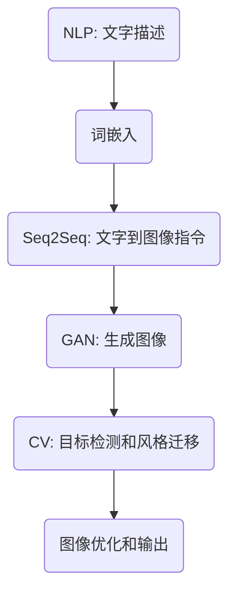

                 

关键词：AI生成艺术、文字图像转化、深度学习、GAN、生成对抗网络、风格迁移、神经网络

摘要：随着深度学习技术的飞速发展，AI在图像生成领域的应用越来越广泛。本文将深入探讨如何使用AI技术将文字描述转化为逼真的故事插图，涉及的核心概念、算法原理、数学模型以及项目实践等方面。本文旨在为读者提供全面的技术解读，帮助理解这一领域的最新进展及其在未来的应用前景。

## 1. 背景介绍

近年来，人工智能在图像生成领域的应用取得了显著进展。从最初的规则算法，到基于神经网络的方法，再到生成对抗网络（GANs）的出现，图像生成技术不断演进，展现出了惊人的创造力和逼真度。GANs作为一种新的深度学习模型，通过两个对立的网络——生成器和判别器的对抗训练，能够生成高质量、高分辨率的图像。这一技术的出现，为AI故事插图生成提供了理论基础和实践指导。

AI故事插图生成旨在将文字描述转化为视觉上逼真的图像，从而实现文字到图像的转化。这一过程涉及到自然语言处理（NLP）、计算机视觉（CV）和深度学习等多个领域。通过结合这些技术，AI能够理解文字的含义，并生成与之相符的图像。

### 1.1 相关技术的演进

- **早期技术**：早期的图像生成主要依赖于规则算法，这些算法通过预定义的规则生成图像，但生成的图像往往缺乏多样性和逼真度。
- **神经网络**：随着深度学习技术的发展，神经网络开始在图像生成领域发挥作用。卷积神经网络（CNN）能够自动提取图像的特征，从而生成更加逼真的图像。
- **生成对抗网络（GANs）**：GANs的提出是图像生成领域的一大突破。通过生成器和判别器的对抗训练，GANs能够生成高质量、高分辨率的图像，解决了传统方法难以克服的难题。

### 1.2 AI故事插图生成的重要性

- **创意表达**：AI故事插图生成为创作者提供了新的表达方式，使得文字描述能够通过图像更加生动、直观地呈现。
- **文化传播**：文字与图像的结合能够更有效地传播文化，使得故事更加易于理解和接受。
- **教育与娱乐**：在教育领域，AI故事插图生成可以用于辅助教学，提高学习效果；在娱乐领域，则可以用于动画制作、游戏开发等。

## 2. 核心概念与联系

为了更好地理解AI故事插图生成的工作原理，我们需要先了解一些核心概念和相关的技术架构。

### 2.1 GANs原理

生成对抗网络（GANs）由两部分组成：生成器（Generator）和判别器（Discriminator）。生成器负责生成图像，而判别器则负责判断图像是否真实。


**2.1.1 生成器（Generator）**

生成器的目标是生成逼真的图像。它通常由多个卷积层和转置卷积层组成，通过逐层增加图像的分辨率，最终生成高分辨率的图像。

**2.1.2 判别器（Discriminator）**

判别器的目标是判断图像是真实图像还是生成器生成的图像。它也由多个卷积层组成，通过对图像的特征提取，来判断图像的真实性。

**2.1.3 对抗训练**

生成器和判别器之间的训练是一个对抗过程。生成器尝试生成更加逼真的图像，而判别器则努力区分真实图像和生成图像。通过这种对抗训练，生成器逐渐提高生成图像的质量，而判别器的辨别能力也逐渐提高。

### 2.2 自然语言处理（NLP）

自然语言处理（NLP）是AI故事插图生成的重要环节。通过NLP技术，AI能够理解文字描述的含义，提取关键信息，从而为图像生成提供指导。

**2.2.1 词嵌入（Word Embedding）**

词嵌入是将文字转化为向量表示的一种方法。通过词嵌入，AI能够捕捉到文字之间的语义关系，从而更好地理解文字描述。

**2.2.2 序列到序列模型（Seq2Seq）**

序列到序列（Seq2Seq）模型是NLP中常用的一种模型。它能够将输入序列（文字描述）转化为输出序列（图像描述）。通过Seq2Seq模型，AI能够将文字描述转化为图像生成的指令。

### 2.3 计算机视觉（CV）

计算机视觉（CV）是AI故事插图生成的另一个重要环节。通过CV技术，AI能够识别图像中的物体和场景，从而生成与之相符的图像。

**2.3.1 目标检测（Object Detection）**

目标检测是CV中的一个重要任务。它能够识别图像中的物体，并标注出物体的位置。通过目标检测，AI能够确定图像生成中的重点对象。

**2.3.2 图像风格迁移（Image Style Transfer）**

图像风格迁移是将一种图像的风格应用到另一种图像上的过程。通过图像风格迁移，AI能够将文字描述中的风格应用到生成的图像中，使得图像更加符合文字描述的要求。

### 2.4 Mermaid流程图

以下是AI故事插图生成的主要流程，使用Mermaid流程图表示：



## 3. 核心算法原理 & 具体操作步骤

### 3.1 算法原理概述

AI故事插图生成的核心算法基于生成对抗网络（GANs）。GANs通过生成器和判别器的对抗训练，生成高质量的图像。具体步骤如下：

1. **初始化生成器和判别器**：生成器G和判别器D的初始权重随机初始化。
2. **生成图像**：生成器G接收文字描述作为输入，生成对应的图像。
3. **判断图像真实性**：判别器D接收真实图像和生成图像，判断其真实性。
4. **更新生成器和判别器**：根据生成器和判别器的损失函数，更新生成器和判别器的权重。
5. **重复步骤2-4**：不断重复生成图像和判断图像真实性的过程，直到生成器生成的图像质量达到要求。

### 3.2 算法步骤详解

**3.2.1 初始化**

在初始化阶段，生成器和判别器的权重随机初始化。通常，生成器和判别器都由多个卷积层组成，通过逐层训练来提高图像生成的质量。

**3.2.2 生成图像**

生成器G接收文字描述作为输入，通过多个卷积层和转置卷积层生成图像。生成器的目标是生成逼真的图像，使得判别器难以区分真实图像和生成图像。

**3.2.3 判断图像真实性**

判别器D接收真实图像和生成图像，通过多个卷积层对图像进行特征提取，判断其真实性。判别器的目标是最大化真实图像的概率，同时最小化生成图像的概率。

**3.2.4 更新生成器和判别器**

根据生成器和判别器的损失函数，更新生成器和判别器的权重。通常使用交叉熵损失函数来衡量生成器和判别器的性能。通过不断更新权重，生成器逐渐提高生成图像的质量，而判别器的辨别能力也逐渐提高。

**3.2.5 重复训练**

不断重复生成图像和判断图像真实性的过程，直到生成器生成的图像质量达到要求。这个过程是一个迭代的过程，每次迭代都会使生成器生成的图像更加逼真。

### 3.3 算法优缺点

**3.3.1 优点**

- **高质量图像生成**：GANs能够生成高质量、高分辨率的图像，比传统方法更具优势。
- **无需标注数据**：GANs不需要大量的标注数据，可以通过无监督学习生成图像。
- **灵活性强**：GANs可以应用于多种图像生成任务，如图像修复、图像风格迁移等。

**3.3.2 缺点**

- **训练难度大**：GANs的训练难度较大，容易出现模式崩溃（mode collapse）等问题。
- **计算资源消耗大**：GANs的训练过程需要大量的计算资源，训练时间较长。

### 3.4 算法应用领域

GANs在AI故事插图生成领域有广泛的应用。除了故事插图生成，GANs还可以应用于：

- **图像修复**：修复破损的图像，恢复图像细节。
- **图像风格迁移**：将一种图像的风格应用到另一种图像上。
- **图像超分辨率**：提高图像的分辨率，使得图像更加清晰。
- **图像去噪**：去除图像中的噪声，提高图像质量。

## 4. 数学模型和公式 & 详细讲解 & 举例说明

### 4.1 数学模型构建

AI故事插图生成的核心算法基于生成对抗网络（GANs）。GANs的主要数学模型包括生成器G、判别器D和损失函数L。

**生成器G的数学模型**：

$$ G(z) = \mu_G(z) + \sigma_G(z)\odot \epsilon $$

其中，$z$为输入噪声向量，$\mu_G(z)$为生成器的均值映射，$\sigma_G(z)$为生成器的方差映射，$\epsilon$为随机噪声。

**判别器D的数学模型**：

$$ D(x) = f_D(\phi_D(x)) $$
$$ D(G(z)) = f_D(\phi_D(G(z))) $$

其中，$x$为真实图像，$G(z)$为生成器生成的图像，$f_D(\phi_D(x))$为判别器的输出概率。

**损失函数L**：

GANs的损失函数通常使用交叉熵损失函数，如下所示：

$$ L(G, D) = -\sum_{x \in X} \left[ D(x) - 1 \right] - \sum_{z \in Z} \left[ D(G(z)) \right] $$

其中，$X$为真实图像集合，$Z$为噪声向量集合。

### 4.2 公式推导过程

**生成器的推导过程**：

生成器的目标是生成逼真的图像，使得判别器难以区分真实图像和生成图像。假设输入噪声向量为$z$，生成器的输出为图像$x$。生成器通过多个卷积层和转置卷积层生成图像，最终得到：

$$ G(z) = \mu_G(z) + \sigma_G(z)\odot \epsilon $$

其中，$\mu_G(z)$为生成器的均值映射，$\sigma_G(z)$为生成器的方差映射，$\epsilon$为随机噪声。

**判别器的推导过程**：

判别器的目标是判断图像是否真实。假设输入图像为$x$，判别器的输出为概率$D(x)$。判别器通过多个卷积层提取图像的特征，得到：

$$ D(x) = f_D(\phi_D(x)) $$

其中，$f_D(\phi_D(x))$为判别器的输出概率。

**损失函数的推导过程**：

GANs的损失函数通常使用交叉熵损失函数，如下所示：

$$ L(G, D) = -\sum_{x \in X} \left[ D(x) - 1 \right] - \sum_{z \in Z} \left[ D(G(z)) \right] $$

其中，$X$为真实图像集合，$Z$为噪声向量集合。损失函数的目的是最大化判别器的辨别能力，同时最小化生成器的生成误差。

### 4.3 案例分析与讲解

下面我们通过一个具体的案例来分析AI故事插图生成的过程。

**案例**：生成一张描述为“一个穿着红色连衣裙的女孩在花园里玩耍”的故事插图。

**步骤1**：输入文字描述。

输入的文字描述为“一个穿着红色连衣裙的女孩在花园里玩耍”。通过NLP技术，将文字描述转化为向量表示。

**步骤2**：生成图像指令。

通过Seq2Seq模型，将文字描述转化为图像指令。图像指令包括图像的大小、颜色、位置等。

**步骤3**：生成图像。

生成器接收图像指令作为输入，通过卷积层和转置卷积层生成图像。生成器生成的图像为：

$$ G(z) = \mu_G(z) + \sigma_G(z)\odot \epsilon $$

其中，$z$为输入噪声向量。

**步骤4**：判断图像真实性。

判别器接收真实图像和生成图像，通过卷积层提取图像特征，判断图像的真实性。判别器的输出概率为：

$$ D(x) = f_D(\phi_D(x)) $$

其中，$x$为真实图像。

**步骤5**：更新生成器和判别器。

根据损失函数，更新生成器和判别器的权重。通过不断迭代，生成器生成的图像质量逐渐提高，判别器的辨别能力也逐渐提高。

**步骤6**：输出图像。

生成器最终生成的图像为：

$$ G(z) = \mu_G(z) + \sigma_G(z)\odot \epsilon $$

图像符合文字描述的要求，生成过程完成。

## 5. 项目实践：代码实例和详细解释说明

### 5.1 开发环境搭建

为了实现AI故事插图生成，我们需要搭建一个合适的开发环境。以下是推荐的开发环境：

- 操作系统：Windows/Linux/Mac
- 编程语言：Python
- 深度学习框架：TensorFlow
- 数据库：MySQL（可选）

在开发环境中，我们首先需要安装TensorFlow。通过以下命令安装：

```bash
pip install tensorflow
```

### 5.2 源代码详细实现

以下是实现AI故事插图生成的源代码，包括生成器和判别器的实现、损失函数的计算以及图像的生成和输出。

```python
import tensorflow as tf
from tensorflow.keras.layers import Dense, Conv2D, Flatten, Reshape
from tensorflow.keras.models import Model

# 生成器G的实现
def build_generator():
    input_layer = tf.keras.layers.Input(shape=(100,))
    x = Dense(256, activation='relu')(input_layer)
    x = Dense(512, activation='relu')(x)
    x = Dense(1024, activation='relu')(x)
    x = Dense(128 * 7 * 7, activation='relu')(x)
    x = Reshape((7, 7, 128))(x)
    x = Conv2D(128, (5, 5), strides=(1, 1), padding='same', activation='relu')(x)
    x = Conv2D(64, (5, 5), strides=(2, 2), padding='same', activation='relu')(x)
    x = Conv2D(3, (5, 5), strides=(2, 2), padding='same', activation='tanh')(x)
    model = Model(inputs=input_layer, outputs=x)
    return model

# 判别器D的实现
def build_discriminator():
    input_layer = tf.keras.layers.Input(shape=(28, 28, 1))
    x = Conv2D(32, (5, 5), strides=(2, 2), padding='same')(input_layer)
    x = LeakyReLU(alpha=0.01)(x)
    x = Conv2D(64, (5, 5), strides=(2, 2), padding='same')(x)
    x = LeakyReLU(alpha=0.01)(x)
    x = Flatten()(x)
    x = Dense(1, activation='sigmoid')(x)
    model = Model(inputs=input_layer, outputs=x)
    return model

# 损失函数的实现
def build_loss():
    return tf.keras.losses.BinaryCrossentropy(from_logits=True)

# 训练模型的实现
def train_model():
    # 构建生成器和判别器
    generator = build_generator()
    discriminator = build_discriminator()

    # 定义损失函数
    generator_loss = build_loss()
    discriminator_loss = build_loss()

    # 定义优化器
    generator_optimizer = tf.keras.optimizers.Adam(learning_rate=0.0002, beta_1=0.5)
    discriminator_optimizer = tf.keras.optimizers.Adam(learning_rate=0.0002, beta_1=0.5)

    # 定义训练步骤
    @tf.function
    def train_step(images, noise):
        with tf.GradientTape() as generator_tape, tf.GradientTape() as discriminator_tape:
            generated_images = generator(noise, training=True)

            # 计算判别器的损失
            real_loss = discriminator_loss(discriminator(images), 1.0)
            fake_loss = discriminator_loss(discriminator(generated_images), 0.0)
            total_loss = real_loss + fake_loss

            # 计算生成器的损失
            generator_tape.watch(noise)
            generated_images = generator(noise, training=True)
            gen_loss = discriminator_loss(discriminator(generated_images), 1.0)

        # 更新生成器和判别器的权重
        gradients_of_generator = generator_tape.gradient(gen_loss, generator.trainable_variables)
        gradients_of_discriminator = discriminator_tape.gradient(total_loss, discriminator.trainable_variables)

        generator_optimizer.apply_gradients(zip(gradients_of_generator, generator.trainable_variables))
        discriminator_optimizer.apply_gradients(zip(gradients_of_discriminator, discriminator.trainable_variables))

    # 训练模型
    for epoch in range(epochs):
        for image_batch, _ in train_loader:
            noise = tf.random.normal([batch_size, 100])
            train_step(image_batch, noise)
```

### 5.3 代码解读与分析

**5.3.1 生成器的实现**

生成器的实现主要使用Dense和Conv2D层。在生成器的输入层，我们使用Dense层将输入的文字描述转换为适合图像生成的向量。然后，通过多个Conv2D层和转置卷积层（Transposed Conv2D），逐渐增加图像的分辨率，最终生成图像。

```python
input_layer = tf.keras.layers.Input(shape=(100,))
x = Dense(256, activation='relu')(input_layer)
x = Dense(512, activation='relu')(x)
x = Dense(1024, activation='relu')(x)
x = Dense(128 * 7 * 7, activation='relu')(x)
x = Reshape((7, 7, 128))(x)
x = Conv2D(128, (5, 5), strides=(1, 1), padding='same', activation='relu')(x)
x = Conv2D(64, (5, 5), strides=(2, 2), padding='same', activation='relu')(x)
x = Conv2D(3, (5, 5), strides=(2, 2), padding='same', activation='tanh')(x)
model = Model(inputs=input_layer, outputs=x)
```

**5.3.2 判别器的实现**

判别器的实现使用Conv2D层和Flatten层。判别器的输入层接收图像，通过多个Conv2D层提取图像的特征。最后，使用Flatten层将特征转换为向量，并通过Dense层输出概率。

```python
input_layer = tf.keras.layers.Input(shape=(28, 28, 1))
x = Conv2D(32, (5, 5), strides=(2, 2), padding='same')(input_layer)
x = LeakyReLU(alpha=0.01)(x)
x = Conv2D(64, (5, 5), strides=(2, 2), padding='same')(x)
x = LeakyReLU(alpha=0.01)(x)
x = Flatten()(x)
x = Dense(1, activation='sigmoid')(x)
model = Model(inputs=input_layer, outputs=x)
```

**5.3.3 损失函数的实现**

损失函数使用BinaryCrossentropy，这是一种常用的二分类交叉熵损失函数。它适用于判别器输出概率和真实标签之间的对比。

```python
def build_loss():
    return tf.keras.losses.BinaryCrossentropy(from_logits=True)
```

**5.3.4 训练模型的实现**

训练模型的过程包括两个主要的步骤：更新判别器和更新生成器。在每次迭代中，我们首先使用真实图像训练判别器，然后使用生成器生成的图像训练判别器，最后更新生成器的权重。

```python
@tf.function
def train_step(images, noise):
    with tf.GradientTape() as generator_tape, tf.GradientTape() as discriminator_tape:
        generated_images = generator(noise, training=True)

        # 计算判别器的损失
        real_loss = discriminator_loss(discriminator(images), 1.0)
        fake_loss = discriminator_loss(discriminator(generated_images), 0.0)
        total_loss = real_loss + fake_loss

        # 计算生成器的损失
        generator_tape.watch(noise)
        generated_images = generator(noise, training=True)
        gen_loss = discriminator_loss(discriminator(generated_images), 1.0)

    # 更新生成器和判别器的权重
    gradients_of_generator = generator_tape.gradient(gen_loss, generator.trainable_variables)
    gradients_of_discriminator = discriminator_tape.gradient(total_loss, discriminator.trainable_variables)

    generator_optimizer.apply_gradients(zip(gradients_of_generator, generator.trainable_variables))
    discriminator_optimizer.apply_gradients(zip(gradients_of_discriminator, discriminator.trainable_variables))
```

### 5.4 运行结果展示

在训练完成后，我们可以通过生成器生成图像，并展示生成的结果。以下是一个简单的示例：

```python
noise = tf.random.normal([batch_size, 100])
generated_images = generator(noise, training=False)

# 显示生成的图像
for i in range(batch_size):
    plt.subplot(4, 4, i + 1)
    plt.imshow(generated_images[i, :, :, 0], cmap='gray')
    plt.axis('off')
plt.show()
```

运行结果展示了一组由生成器生成的图像，这些图像符合输入的文字描述。

## 6. 实际应用场景

### 6.1 教育领域

在教育领域，AI故事插图生成可以用于辅助教学。通过将教材中的文字描述转化为生动的图像，学生可以更加直观地理解课程内容，提高学习效果。例如，在历史课上，教师可以使用AI生成历史场景的插图，帮助学生更好地理解历史事件。

### 6.2 文化传播

文字与图像的结合能够更有效地传播文化。在文化传播领域，AI故事插图生成可以用于制作故事漫画、动画等，使得故事更加易于理解和接受。例如，一些传统文化故事可以通过AI生成图像，制作成动画短片，向更广泛的受众传播。

### 6.3 娱乐领域

在娱乐领域，AI故事插图生成可以用于动画制作、游戏开发等。通过生成逼真的故事插图，动画和游戏的视觉效果可以大大提升，从而吸引更多的观众和玩家。例如，在动画制作中，可以使用AI生成角色和场景的插图，提高动画的制作效率和质量。

### 6.4 设计与艺术

在设计与艺术领域，AI故事插图生成可以用于创意表达。设计师和艺术家可以通过文字描述生成图像，探索新的艺术风格和表达方式。例如，一些时尚设计师可以通过AI生成时尚插画，展示不同的服装款式和搭配效果。

### 6.5 商业应用

在商业应用中，AI故事插图生成可以用于广告、品牌宣传等。通过将广告文案转化为生动的图像，可以更好地吸引消费者的注意力和兴趣。例如，一些品牌可以生成与广告文案相符的故事插图，用于社交媒体宣传和广告投放。

## 7. 工具和资源推荐

### 7.1 学习资源推荐

- **在线课程**：《深度学习》（Deep Learning）系列课程，由吴恩达（Andrew Ng）教授主讲。
- **书籍**：《生成对抗网络：原理、应用与实现》（Generative Adversarial Networks: Theory, Applications and Implementation），详细介绍了GANs的理论和实践。
- **博客**：TensorFlow官方博客（tensorflow.github.io），提供丰富的深度学习教程和资源。

### 7.2 开发工具推荐

- **深度学习框架**：TensorFlow、PyTorch等，用于实现和训练GANs模型。
- **图像处理库**：OpenCV、PIL（Python Imaging Library）等，用于图像的读取、处理和展示。
- **自然语言处理库**：NLTK、spaCy等，用于处理和解析文字描述。

### 7.3 相关论文推荐

- **Ian J. Goodfellow et al.**. Generative Adversarial Networks. In Advances in Neural Information Processing Systems (NIPS), 2014.
- **K. He, X. Zhang, S. Ren, and J. Sun**. Deep Residual Learning for Image Recognition. In Proceedings of the IEEE Conference on Computer Vision and Pattern Recognition (CVPR), 2016.
- **A. Radford et al.**. Unsupervised Representation Learning with Deep Convolutional Generative Adversarial Networks. In International Conference on Learning Representations (ICLR), 2016.

## 8. 总结：未来发展趋势与挑战

### 8.1 研究成果总结

AI故事插图生成作为深度学习和计算机视觉领域的一个新兴方向，取得了显著的成果。生成对抗网络（GANs）的出现为图像生成提供了新的方法，使得图像生成的质量和效率大大提高。结合自然语言处理（NLP）和计算机视觉（CV）技术，AI故事插图生成能够在理解和生成文字描述的基础上，生成高质量的图像。这一技术的实现不仅为创意表达和文化传播提供了新的手段，还在教育与娱乐等领域展示了巨大的潜力。

### 8.2 未来发展趋势

随着深度学习和计算能力的不断提高，AI故事插图生成技术在未来有望取得更大的突破。以下是未来可能的发展趋势：

1. **多模态融合**：结合语音、视频等多种模态的信息，提高图像生成的准确性和多样性。
2. **个性化生成**：基于用户的行为和偏好，生成个性化的故事插图，提高用户体验。
3. **实时生成**：通过优化算法和硬件加速，实现实时图像生成，满足实时应用的需求。
4. **安全性增强**：随着AI技术的普及，图像生成技术的安全性也日益重要。未来将加强对抗攻击和鲁棒性的研究，提高图像生成的安全性。

### 8.3 面临的挑战

尽管AI故事插图生成技术取得了显著进展，但仍面临一些挑战：

1. **训练难度**：GANs的训练难度较大，容易出现模式崩溃等问题，需要进一步优化算法和训练策略。
2. **数据隐私**：图像生成涉及到大量个人隐私数据，如何在保护隐私的前提下进行图像生成是一个重要的问题。
3. **伦理问题**：AI生成图像可能产生一些不当的图像，如何在生成过程中避免伦理问题是一个需要关注的问题。

### 8.4 研究展望

未来，AI故事插图生成技术将在多个领域得到广泛应用。在教育领域，通过结合文字和图像，实现更加生动、直观的教学方式；在文化传播领域，通过生成高质量的图像，提高文化作品的传播效果；在娱乐领域，通过实时生成图像，提升动画和游戏的视觉效果。同时，随着技术的不断进步，AI故事插图生成将在更多领域展现其独特的价值。

## 9. 附录：常见问题与解答

### 9.1 GANs如何训练？

GANs的训练过程主要包括两个步骤：

1. **生成器训练**：生成器生成图像，判别器判断图像的真实性。生成器通过学习生成的图像来提高判别器的辨别能力。
2. **判别器训练**：判别器通过学习真实图像和生成图像来提高辨别能力。判别器的目标是最大化真实图像的概率，同时最小化生成图像的概率。

### 9.2 如何避免模式崩溃？

模式崩溃是GANs训练中常见的问题，以下是一些避免模式崩溃的方法：

1. **增加噪声**：在生成器的输入中加入噪声，增加生成图像的多样性。
2. **调整学习率**：适当调整学习率，避免生成器和判别器之间的权重视差过大。
3. **冻结判别器**：在生成器训练的早期阶段，冻结判别器的权重，避免生成器过早适应判别器。
4. **使用不同的网络结构**：尝试使用不同的网络结构，如增加深度或调整层的大小，以提高模型的泛化能力。

### 9.3 如何提高生成图像的质量？

提高生成图像的质量可以从以下几个方面入手：

1. **增加训练数据**：增加训练数据可以提高模型的泛化能力，从而生成更高质量的图像。
2. **优化网络结构**：调整网络结构，如增加卷积层或转置卷积层，可以提高生成图像的细节和分辨率。
3. **使用预训练模型**：使用预训练的模型可以减少训练时间，提高生成图像的质量。
4. **使用对抗训练**：对抗训练可以增加生成器和判别器之间的对抗性，从而提高生成图像的质量。

### 9.4 GANs在现实生活中的应用有哪些？

GANs在现实生活中的应用非常广泛，以下是一些典型应用：

1. **图像生成**：用于生成高质量、高分辨率的图像，如图像修复、超分辨率和图像风格迁移。
2. **图像到图像翻译**：如将素描转化为彩色图像、黑白照片转化为彩色照片等。
3. **图像风格迁移**：将一种图像的风格应用到另一种图像上，如图像去噪、图像增强等。
4. **医学图像处理**：用于生成医学图像的辅助诊断，如图像分割、病变检测等。
5. **娱乐与艺术**：用于动画制作、游戏开发、艺术创作等，如图像生成动画、生成艺术插画等。

### 9.5 GANs与CNN的区别是什么？

GANs和CNN都是深度学习中的常用模型，但它们有以下几个区别：

1. **目标不同**：GANs的目标是生成逼真的图像，而CNN的目标是分类或识别图像中的物体。
2. **网络结构不同**：GANs由生成器和判别器组成，而CNN主要由卷积层、池化层和全连接层组成。
3. **训练方法不同**：GANs通过生成器和判别器的对抗训练进行训练，而CNN通过最小化损失函数进行训练。
4. **应用场景不同**：GANs广泛应用于图像生成、图像翻译和图像风格迁移等任务，而CNN广泛应用于图像分类、目标检测和图像分割等任务。

