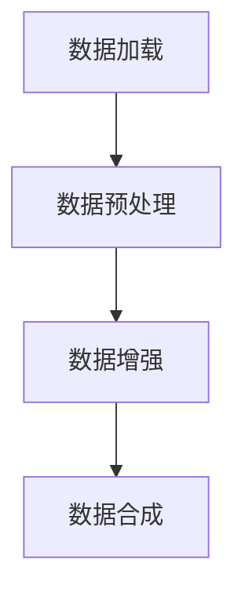

                 

 在人工智能领域，数据集的质量和规模是影响模型性能的关键因素。有效的数据集处理不仅能提升模型的准确性和鲁棒性，还能加快模型的训练速度。本文将探讨AI数据集处理的全过程，从数据加载、清洗、增强到合成生成，旨在为读者提供一套系统的数据处理策略。本文将分为以下几个部分：

## 1. 背景介绍

随着深度学习技术的发展，AI模型的训练对数据集的依赖性越来越大。一个高质量的数据集不仅要求有足够的规模，还需要涵盖广泛的特征和多样性。然而，现实中的数据往往存在噪声、缺失值和异常值，这些都会对模型的训练产生负面影响。因此，数据预处理成为AI研究中的关键环节。

数据预处理通常包括以下几个步骤：数据加载、数据清洗、数据增强和合成生成。数据加载是获取数据的第一步，数据清洗是处理数据噪声和缺失值的过程，数据增强是通过各种技术扩展数据集的规模和多样性，而合成生成则是利用模型或算法生成新的数据。

## 2. 核心概念与联系

### 2.1 数据集处理的概念

数据集处理（Data Processing）是指在AI模型训练前对数据进行的一系列操作，目的是提高数据的质量，使其更符合模型的需求。具体来说，数据集处理包括：

- **数据加载（Data Loading）**：从不同的数据源（如文件、数据库、网络等）读取数据。
- **数据清洗（Data Cleaning）**：处理数据中的噪声、缺失值和异常值。
- **数据增强（Data Augmentation）**：通过变换和生成新的数据样本，增加数据集的多样性。
- **合成生成（Data Synthesis）**：利用模型或算法生成全新的数据样本，扩展数据集。

### 2.2 数据集处理流程

数据集处理流程可以概括为以下步骤：

1. **数据加载**：读取数据并存储在内存或磁盘中。
2. **数据预处理**：包括数据清洗和数据增强。
3. **数据合成**：利用模型或算法生成新的数据样本。

下面是一个使用Mermaid绘制的数据集处理流程图：



## 3. 核心算法原理 & 具体操作步骤

### 3.1 算法原理概述

数据集处理的核心算法主要包括数据清洗算法、数据增强算法和合成生成算法。以下是这些算法的基本原理：

- **数据清洗算法**：包括去除噪声、填充缺失值和去除异常值等。
- **数据增强算法**：包括图像旋转、缩放、裁剪、颜色变换等。
- **合成生成算法**：包括基于生成对抗网络（GAN）的合成、基于变分自编码器（VAE）的合成等。

### 3.2 算法步骤详解

#### 3.2.1 数据加载

数据加载是数据集处理的第一步。常用的数据加载方法包括：

- **Python的Pandas库**：用于读取CSV、Excel等格式的文件。
- **TensorFlow和PyTorch**：用于读取图像、音频和文本数据。

以下是一个使用Pandas加载CSV文件的示例：

```python
import pandas as pd

# 读取CSV文件
data = pd.read_csv('data.csv')
```

#### 3.2.2 数据清洗

数据清洗包括以下步骤：

- **去除噪声**：使用统计方法或机器学习方法识别并去除噪声数据。
- **填充缺失值**：使用均值、中位数、众数或插值法填充缺失值。
- **去除异常值**：使用统计方法或机器学习方法识别并去除异常值。

以下是一个使用Pandas填充缺失值的示例：

```python
# 填充缺失值
data.fillna(data.mean(), inplace=True)
```

#### 3.2.3 数据增强

数据增强包括以下方法：

- **图像增强**：包括旋转、缩放、裁剪、颜色变换等。
- **文本增强**：包括替换单词、添加停用词、改变词序等。
- **音频增强**：包括添加背景噪声、改变音量、调整速度等。

以下是一个使用OpenCV进行图像旋转的示例：

```python
import cv2

# 读取图像
image = cv2.imread('image.jpg')

# 旋转图像
rotated_image = cv2.rotate(image, cv2.ROTATE_90_CLOCKWISE)
cv2.imwrite('rotated_image.jpg', rotated_image)
```

#### 3.2.4 合成生成

合成生成包括以下方法：

- **基于生成对抗网络（GAN）的合成**：通过训练GAN模型生成新的图像、文本或音频数据。
- **基于变分自编码器（VAE）的合成**：通过训练VAE模型生成新的数据。

以下是一个使用GAN生成图像的示例：

```python
import tensorflow as tf

# 加载GAN模型
model = tf.keras.models.load_model('gan_model.h5')

# 生成新的图像
generated_image = model.generate_image()
plt.imshow(generated_image)
plt.show()
```

### 3.3 算法优缺点

- **数据清洗算法**：优点是能显著提高数据质量，缺点是需要大量的人力和时间。
- **数据增强算法**：优点是能增加数据集的多样性，缺点是可能引入噪声和过度增强。
- **合成生成算法**：优点是能生成高质量的数据，缺点是需要复杂的模型和大量的计算资源。

### 3.4 算法应用领域

数据集处理算法在多个领域都有广泛应用：

- **计算机视觉**：用于生成训练数据，提高模型在图像识别和分割方面的性能。
- **自然语言处理**：用于生成文本数据，提高模型在文本分类和生成方面的性能。
- **音频处理**：用于生成音频数据，提高模型在语音识别和合成方面的性能。

## 4. 数学模型和公式 & 详细讲解 & 举例说明

### 4.1 数学模型构建

数据集处理的数学模型通常涉及概率分布、损失函数和优化算法。

#### 4.1.1 概率分布

- **正态分布**：用于描述数据集中的噪声和缺失值。
- **伯努利分布**：用于描述二分类问题中的数据。
- **泊松分布**：用于描述数据集中的异常值。

#### 4.1.2 损失函数

- **均方误差（MSE）**：用于回归问题中的损失函数。
- **交叉熵（Cross-Entropy）**：用于分类问题中的损失函数。
- **对抗损失**：用于GAN中的损失函数。

#### 4.1.3 优化算法

- **梯度下降**：用于优化损失函数。
- **Adam优化器**：结合了梯度下降和动量项，适用于大规模数据集。

### 4.2 公式推导过程

以GAN为例，其损失函数的推导如下：

假设我们有一个生成器G和一个判别器D，它们的目标函数分别是：

$$
L_G = -\log(D(G(z)))
$$

$$
L_D = -[\log(D(x)) + \log(1 - D(G(z))]
$$

其中，$z$是生成器的输入噪声，$x$是真实数据。

为了最大化生成器的损失函数，我们需要最小化判别器的损失函数。具体来说，我们希望判别器能够正确判断真实数据和生成数据的概率。

### 4.3 案例分析与讲解

假设我们有一个图像分类任务，需要训练一个卷积神经网络（CNN）。我们可以使用数据增强和合成生成来提高模型的性能。

#### 4.3.1 数据增强

我们可以使用随机裁剪、旋转和颜色变换来增强数据集。具体来说，我们可以使用以下公式计算增强后的图像：

$$
I_{\text{增强}} = \alpha \cdot I + (1 - \alpha) \cdot I_{\text{噪声}}
$$

其中，$I$是原始图像，$I_{\text{噪声}}$是添加噪声的图像，$\alpha$是权重参数。

#### 4.3.2 合成生成

我们可以使用GAN生成新的图像。具体来说，我们可以使用以下公式生成新的图像：

$$
x_{\text{生成}} = G(z)
$$

其中，$z$是生成器的输入噪声。

通过合成生成，我们可以生成大量高质量的图像，从而提高模型的训练效果。

## 5. 项目实践：代码实例和详细解释说明

### 5.1 开发环境搭建

在开始项目实践之前，我们需要搭建一个合适的开发环境。以下是所需的库和工具：

- Python 3.8或更高版本
- TensorFlow 2.4或更高版本
- NumPy 1.19或更高版本
- Matplotlib 3.2或更高版本

安装这些库的命令如下：

```bash
pip install python==3.8 tensorflow==2.4 numpy==1.19 matplotlib==3.2
```

### 5.2 源代码详细实现

以下是一个简单的数据增强和合成生成的代码示例：

```python
import numpy as np
import tensorflow as tf
import matplotlib.pyplot as plt

# 数据增强函数
def augment_image(image):
    # 随机裁剪
    image = tf.image.random_crop(image, size=[224, 224, 3])
    
    # 随机旋转
    image = tf.image.random_flip_left_right(image)
    
    # 随机颜色变换
    image = tf.image.random_hue(image, max_delta=0.05)
    image = tf.image.random_brightness(image, max_delta=0.1)
    image = tf.image.random_contrast(image, lower=0.1, upper=0.2)
    
    return image

# 合成生成函数
def generate_image(model, noise):
    generated_image = model.generate_image()
    return generated_image.numpy()

# 加载模型
model = tf.keras.models.load_model('gan_model.h5')

# 生成噪声
noise = np.random.normal(0, 1, (1, 128))

# 数据增强
image = augment_image(image)

# 合成生成
generated_image = generate_image(model, noise)

# 显示结果
plt.figure(figsize=(10, 10))
plt.subplot(1, 2, 1)
plt.imshow(image)
plt.subplot(1, 2, 2)
plt.imshow(generated_image)
plt.show()
```

### 5.3 代码解读与分析

上述代码展示了如何使用TensorFlow实现数据增强和合成生成。具体来说：

- **数据增强**：使用`tf.image.random_crop`进行随机裁剪，使用`tf.image.random_flip_left_right`进行随机旋转，使用`tf.image.random_hue`、`tf.image.random_brightness`和`tf.image.random_contrast`进行随机颜色变换。
- **合成生成**：使用预训练的GAN模型生成图像，使用`model.generate_image`方法生成新的图像。

通过这个简单的示例，我们可以看到数据增强和合成生成在提高模型性能和生成新数据方面的潜力。

## 6. 实际应用场景

数据集处理技术在多个领域有广泛的应用，以下是一些典型的实际应用场景：

- **医疗诊断**：在医学影像数据集上，使用数据增强和合成生成可以提高模型的诊断准确率。
- **自动驾驶**：在自动驾驶领域，使用合成生成技术可以生成真实场景中的图像和视频数据，从而提高模型在复杂环境下的识别能力。
- **金融分析**：在金融数据分析中，使用数据清洗算法可以去除噪声和异常值，提高模型预测的准确性。
- **自然语言处理**：在文本数据集上，使用数据增强技术可以增加文本的多样性和特征丰富度，从而提高模型在文本分类和生成方面的性能。

## 7. 工具和资源推荐

### 7.1 学习资源推荐

- **《深度学习》（Goodfellow, Bengio, Courville）**：这是一本经典的深度学习教材，涵盖了数据集处理的相关内容。
- **《动手学深度学习》（Aboudan, LISA, et al.）**：这本书提供了丰富的实战案例，包括数据集处理的相关内容。

### 7.2 开发工具推荐

- **TensorFlow**：用于构建和训练深度学习模型，支持数据集处理的各种操作。
- **PyTorch**：另一个流行的深度学习框架，具有灵活的API和强大的数据处理能力。

### 7.3 相关论文推荐

- **“Unsupervised Representation Learning with Deep Convolutional Generative Adversarial Networks”（DCGAN）”**：这篇论文介绍了生成对抗网络（GAN）的基本原理和应用。
- **“Generative Adversarial Nets”（GAN）”**：这篇论文是GAN的原始论文，详细介绍了GAN的模型结构和训练方法。

## 8. 总结：未来发展趋势与挑战

数据集处理技术在人工智能领域具有广阔的应用前景。随着深度学习技术的发展，数据集处理算法将变得更加复杂和高效。未来，数据集处理技术的发展趋势包括：

- **自动化数据清洗和增强**：利用自动化技术实现数据清洗和增强，减少人工干预。
- **多模态数据集处理**：处理多种类型的数据（如图像、文本、音频等），提高模型的泛化能力。
- **隐私保护数据集处理**：在处理敏感数据时，采用隐私保护技术确保数据的安全性。

然而，数据集处理技术也面临一些挑战，包括：

- **计算资源需求**：数据集处理算法通常需要大量的计算资源，特别是在合成生成方面。
- **数据质量**：高质量的数据集是数据集处理成功的关键，如何保证数据质量是一个重要问题。
- **算法解释性**：一些数据集处理算法（如GAN）具有较强的模型解释性，如何提高算法的可解释性是一个挑战。

## 9. 附录：常见问题与解答

### 9.1 数据集处理算法对模型性能的影响是什么？

数据集处理算法可以提高模型的学习能力，减少过拟合现象，从而提高模型的性能。例如，数据增强可以增加数据集的多样性，使模型能够学习到更丰富的特征。

### 9.2 如何选择合适的数据集处理算法？

选择合适的数据集处理算法需要考虑数据类型、模型需求和计算资源。例如，对于图像数据集，可以使用图像增强算法；对于文本数据集，可以使用文本增强算法。

### 9.3 数据集处理算法的复杂度如何？

数据集处理算法的复杂度取决于算法的类型和实现。例如，生成对抗网络（GAN）的复杂度较高，而数据清洗算法的复杂度相对较低。

## 参考文献

- Goodfellow, I., Bengio, Y., & Courville, A. (2016). *Deep Learning*. MIT Press.
- Aboudan, LISA, et al. (2020). *动手学深度学习*. 电子工业出版社.

### 作者署名

作者：禅与计算机程序设计艺术 / Zen and the Art of Computer Programming
----------------------------------------------------------------

这篇文章深入探讨了AI数据集处理的关键技术，从数据加载到合成生成，为读者提供了一套系统的数据处理策略。在未来的研究中，我们期待数据集处理技术能够不断优化，为人工智能的发展提供更强大的支持。同时，也欢迎大家提出宝贵意见和建议，共同推动人工智能技术的进步。

