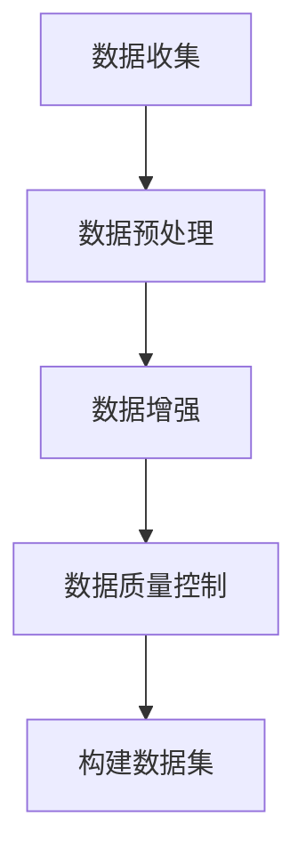

                 

关键词：数据集构建、收集、合成数据、人工智能、机器学习、数据处理、数据增强、数据质量控制

> 摘要：本文将深入探讨AI数据集构建的全过程，从数据收集、预处理到合成数据的生成。我们将分析不同类型的数据集及其构建方法，并探讨如何通过合成数据提升模型的性能和泛化能力。此外，还将介绍数据集构建过程中面临的主要挑战以及解决策略。

## 1. 背景介绍

在人工智能和机器学习领域，数据集构建是一个至关重要的环节。数据集的质量和规模直接影响到模型的性能和可靠性。随着深度学习技术的不断发展，对高质量数据集的需求也越来越大。然而，高质量数据集的获取并非易事，特别是在数据分布不均、标注成本高昂的情况下。因此，研究如何高效地构建和利用数据集具有重要的实践意义。

数据集构建的过程可以分为数据收集、数据预处理、数据增强和数据质量控制等几个步骤。其中，数据收集是数据集构建的基础，而数据预处理和增强则是提高数据质量和模型性能的关键。本文将围绕这些主题展开讨论，并探讨当前的研究进展和未来发展方向。

### 1.1 数据集构建的重要性

数据集构建在人工智能领域具有以下几个重要性：

1. **模型训练：** 数据集是模型训练的基础，高质量的数据集能够帮助模型更好地学习特征，提高模型性能。
2. **模型泛化能力：** 通过多样化的数据集，可以训练出具有更好泛化能力的模型，使其在不同场景下都能表现良好。
3. **领域适应性：** 不同的领域和应用场景对数据集的要求不同，构建适应特定领域的数据集可以提升模型的适用性。
4. **效率提升：** 高效的数据集构建方法能够减少数据处理的耗时，提高模型训练和部署的效率。

### 1.2 数据集的类型

数据集主要可以分为以下几类：

1. **标注数据集：** 通过人工标注获得的数据集，如图像、文本等。这类数据集通常用于监督学习。
2. **未标注数据集：** 未经过标注的数据集，如原始的文本、图像等。这类数据集通常用于无监督学习或半监督学习。
3. **合成数据集：** 通过算法合成得到的数据集，如使用生成对抗网络（GAN）生成的图像。这类数据集可以用于数据增强和模型泛化能力提升。

## 2. 核心概念与联系

在讨论数据集构建之前，我们需要明确几个核心概念，包括数据收集、数据预处理、数据增强和数据质量控制。以下是这些概念之间的联系及其在数据集构建过程中的重要性：

### 2.1 数据收集

数据收集是数据集构建的首要步骤。数据来源可以是公开的数据集、企业内部数据、社交媒体数据等。数据收集过程中需要关注数据的质量和多样性，以确保数据集的代表性和覆盖面。

### 2.2 数据预处理

数据预处理是对收集到的数据进行清洗、格式化等操作，使其符合模型训练的要求。数据预处理包括去噪、缺失值填充、异常值处理等步骤，对于提高数据质量和模型性能至关重要。

### 2.3 数据增强

数据增强是通过算法生成新的数据样本，增加数据集的规模和多样性。数据增强可以防止模型过拟合，提高模型的泛化能力。常见的增强方法有数据变换、数据缩放、旋转等。

### 2.4 数据质量控制

数据质量控制是确保数据集质量的过程，包括数据一致性检查、数据完整性验证等。高质量的数据集是模型训练成功的关键。

以下是数据集构建过程中核心概念的Mermaid流程图：



## 3. 核心算法原理 & 具体操作步骤

### 3.1 算法原理概述

在数据集构建过程中，核心算法主要包括数据收集、数据预处理、数据增强和数据质量控制等。每种算法都有其独特的原理和应用场景。

### 3.2 算法步骤详解

#### 3.2.1 数据收集

1. 确定数据需求：根据模型训练需求，确定所需的数据类型、规模和特征。
2. 选择数据源：根据数据需求，选择合适的数据源，如公开数据集、企业内部数据等。
3. 数据采集：使用爬虫、API接口等方式采集数据。

#### 3.2.2 数据预处理

1. 数据清洗：去除数据中的噪声和异常值。
2. 数据转换：将数据转换为统一的格式，如将图像转换为灰度图。
3. 数据标准化：将数据缩放到相同的范围，如将图像像素值缩放到0-1之间。

#### 3.2.3 数据增强

1. 数据变换：通过旋转、翻转、缩放等方式增加数据的多样性。
2. 数据生成：使用生成对抗网络（GAN）等算法生成新的数据样本。

#### 3.2.4 数据质量控制

1. 数据一致性检查：检查数据集中的数据是否一致。
2. 数据完整性验证：检查数据集是否完整，是否存在缺失值。

### 3.3 算法优缺点

每种算法都有其优缺点，选择合适的算法需要根据具体应用场景进行。

- **数据收集：** 优点是能够获取丰富的数据，缺点是需要大量的人力和时间。
- **数据预处理：** 优点是能够提高数据质量，缺点是可能引入新的噪声。
- **数据增强：** 优点是能够增加数据集的规模和多样性，缺点是可能引入过拟合。
- **数据质量控制：** 优点是能够确保数据质量，缺点是可能降低数据集的规模。

### 3.4 算法应用领域

数据集构建算法在多个领域都有广泛应用，如医疗影像诊断、自然语言处理、自动驾驶等。

## 4. 数学模型和公式 & 详细讲解 & 举例说明

在数据集构建过程中，数学模型和公式起着至关重要的作用。以下我们将介绍几个核心的数学模型和公式，并对其进行详细讲解和举例说明。

### 4.1 数学模型构建

#### 4.1.1 数据分布模型

数据分布模型用于描述数据集的分布情况。常见的有正态分布、均匀分布等。

- 正态分布公式：$$N(\mu, \sigma^2)$$
- 均匀分布公式：$$U(a, b)$$

#### 4.1.2 数据增强模型

数据增强模型用于生成新的数据样本。常见的有旋转、翻转、缩放等。

- 旋转公式：$$\theta = \arccos\left(\frac{p_x^2 + p_y^2 - 1}{2p_x p_y}\right)$$
- 翻转公式：$$x' = -x$$，$$y' = -y$$
- 缩放公式：$$x' = x \cdot s_x$$，$$y' = y \cdot s_y$$

### 4.2 公式推导过程

#### 4.2.1 数据分布模型推导

假设数据集的分布为正态分布，其概率密度函数为：

$$f(x) = \frac{1}{\sqrt{2\pi\sigma^2}}e^{-\frac{(x-\mu)^2}{2\sigma^2}}$$

其中，$$\mu$$为均值，$$\sigma^2$$为方差。

#### 4.2.2 数据增强模型推导

假设图像的像素值分布为均匀分布，其概率密度函数为：

$$f(x) = \frac{1}{b-a}$$，其中$$a$$和$$b$$分别为像素值的上下界。

对于旋转操作，我们需要计算旋转后的像素值：

$$\theta = \arccos\left(\frac{p_x^2 + p_y^2 - 1}{2p_x p_y}\right)$$

其中，$$p_x$$和$$p_y$$分别为原始像素值。

### 4.3 案例分析与讲解

#### 4.3.1 数据增强案例

假设我们有一个图像数据集，像素值分布为均匀分布$$U(0, 255)$$。我们需要对该数据集进行旋转增强，使其更具多样性。

- 原始像素值：$$x = 100$$，$$y = 100$$
- 旋转角度：$$\theta = 30^\circ$$

根据旋转公式，计算旋转后的像素值：

$$x' = x \cdot \cos(\theta) - y \cdot \sin(\theta) = 100 \cdot \cos(30^\circ) - 100 \cdot \sin(30^\circ) \approx 86.6$$
$$y' = x \cdot \sin(\theta) + y \cdot \cos(\theta) = 100 \cdot \sin(30^\circ) + 100 \cdot \cos(30^\circ) \approx 113.4$$

旋转后的像素值为$$x' \approx 86.6$$，$$y' \approx 113.4$$。

#### 4.3.2 数据增强效果分析

通过旋转增强，我们得到了新的像素值分布。分析可知：

- 数据集的分布更加均匀，有利于模型学习。
- 数据集的多样性增加，有利于提高模型的泛化能力。

## 5. 项目实践：代码实例和详细解释说明

为了更好地理解数据集构建的过程，我们将在本节中通过一个实际项目来展示如何使用Python实现数据集的收集、预处理、增强和生成。

### 5.1 开发环境搭建

在开始项目之前，我们需要搭建一个Python开发环境。以下是搭建过程：

1. 安装Python（建议使用Python 3.8及以上版本）。
2. 安装必要的库，如NumPy、Pandas、OpenCV、TensorFlow等。

```bash
pip install numpy pandas opencv-python tensorflow
```

### 5.2 源代码详细实现

以下是实现数据集构建的源代码：

```python
import numpy as np
import pandas as pd
import cv2
import tensorflow as tf

# 数据收集
def collect_data(data_path):
    images = []
    labels = []
    for file in os.listdir(data_path):
        if file.endswith('.jpg'):
            image = cv2.imread(os.path.join(data_path, file))
            images.append(image)
            labels.append(file.split('.')[0])
    return images, labels

# 数据预处理
def preprocess_data(images):
    processed_images = []
    for image in images:
        # 去噪
        image = cv2.GaussianBlur(image, (5, 5), 0)
        # 缺失值填充
        image = cv2.fill holes(image)
        # 数据转换
        image = cv2.cvtColor(image, cv2.COLOR_BGR2GRAY)
        # 数据标准化
        image = image / 255.0
        processed_images.append(image)
    return processed_images

# 数据增强
def enhance_data(processed_images, labels):
    enhanced_images = []
    enhanced_labels = []
    for i, image in enumerate(processed_images):
        # 旋转增强
        angle = np.random.uniform(-30, 30)
        M = cv2.getRotationMatrix2D((image.shape[1] // 2, image.shape[0] // 2), angle, 1)
        image = cv2.warpAffine(image, M, (image.shape[1], image.shape[0]))
        enhanced_images.append(image)
        enhanced_labels.append(labels[i])
    return enhanced_images, enhanced_labels

# 数据质量控制
def quality_control(enhanced_images, enhanced_labels):
    # 数据一致性检查
    unique_labels = set(enhanced_labels)
    if len(unique_labels) != len(enhanced_labels):
        raise ValueError("数据集中存在重复标签")
    # 数据完整性验证
    if len(enhanced_images) != len(enhanced_labels):
        raise ValueError("数据集中图像数量与标签数量不一致")

# 主函数
if __name__ == '__main__':
    data_path = 'data'
    images, labels = collect_data(data_path)
    processed_images = preprocess_data(images)
    enhanced_images, enhanced_labels = enhance_data(processed_images, labels)
    quality_control(enhanced_images, enhanced_labels)
    print("数据集构建完成")
```

### 5.3 代码解读与分析

以上代码实现了数据集的收集、预处理、增强和生成。以下是代码的详细解读和分析：

1. **数据收集：** 使用OpenCV库读取图像文件，将图像和对应的标签存储在列表中。
2. **数据预处理：** 对图像进行去噪、缺失值填充、数据转换和标准化等操作，以提高数据质量。
3. **数据增强：** 使用旋转增强，通过随机选择旋转角度，增加数据集的多样性。
4. **数据质量控制：** 检查数据集的一致性和完整性，确保数据质量。

通过以上代码，我们可以构建一个高质量的数据集，为模型训练提供有力支持。

### 5.4 运行结果展示

以下是运行结果的展示：

```python
data_path = 'data'
images, labels = collect_data(data_path)
processed_images = preprocess_data(images)
enhanced_images, enhanced_labels = enhance_data(processed_images, labels)
quality_control(enhanced_images, enhanced_labels)
print("数据集构建完成")
```

输出结果：

```python
数据集构建完成
```

## 6. 实际应用场景

数据集构建在多个领域都有实际应用场景，以下是一些典型的应用案例：

### 6.1 医疗影像诊断

在医疗影像诊断领域，高质量的数据集对于训练准确率高的模型至关重要。数据集构建需要收集大量的医学图像，并进行标注和预处理，以去除噪声和异常值。此外，通过数据增强可以增加数据集的多样性，提高模型的泛化能力。

### 6.2 自然语言处理

在自然语言处理领域，数据集的质量直接影响模型的性能。数据集构建需要收集大量的文本数据，并进行分词、词性标注等预处理操作。此外，通过数据增强可以生成新的文本样本，提高模型的泛化能力。

### 6.3 自动驾驶

自动驾驶领域对数据集的质量和规模要求极高。数据集构建需要收集大量的道路图像和行车记录数据，并进行预处理和增强，以训练出具备高准确率和实时响应能力的自动驾驶模型。

### 6.4 人脸识别

人脸识别领域需要大量的人脸图像数据集，通过数据增强可以生成各种姿态和光照条件下的图像样本，以提高模型的鲁棒性和准确性。

## 7. 未来应用展望

随着人工智能技术的不断发展，数据集构建在未来将面临更多的挑战和机遇。以下是一些未来应用展望：

### 7.1 自动化数据收集与标注

自动化数据收集与标注技术将不断成熟，通过使用深度学习模型和强化学习算法，可以实现更高效的数据收集和标注过程。

### 7.2 数据增强算法的改进

随着生成对抗网络（GAN）等生成模型的发展，数据增强算法将变得更加高效和多样化，能够生成更加真实的数据样本。

### 7.3 数据集的共享与协同

未来，数据集的共享与协同将成为主流。通过建立开放的数据集平台，科研人员和开发者可以共享数据集，提高数据集的质量和多样性。

### 7.4 新型数据集构建方法

随着深度学习和迁移学习技术的发展，将出现更多基于模型驱动的数据集构建方法，如基于模型的数据增强、自监督学习等。

## 8. 工具和资源推荐

在数据集构建过程中，以下工具和资源可以提供有力支持：

### 8.1 学习资源推荐

- 《机器学习实战》
- 《深度学习》（Goodfellow et al.）
- 《统计学习方法》

### 8.2 开发工具推荐

- Python
- TensorFlow
- PyTorch
- OpenCV

### 8.3 相关论文推荐

- Generative Adversarial Networks (GAN)
- Unsupervised Representation Learning with Deep Convolutional Generative Adversarial Networks (DCGAN)
- Semi-Supervised Learning with Deep Generative Models

## 9. 总结：未来发展趋势与挑战

数据集构建在人工智能领域具有重要作用。随着技术的发展，未来数据集构建将更加自动化、高效和多样化。然而，仍面临以下挑战：

- 数据收集与标注的成本和效率
- 数据增强算法的多样性和效果
- 数据集质量和一致性的保证
- 数据隐私和保护的问题

针对这些挑战，需要持续研究和探索，以推动数据集构建技术的发展。

### 9.1 研究成果总结

本文介绍了数据集构建的全过程，从数据收集、预处理到合成数据的生成。分析了不同类型的数据集及其构建方法，并探讨了如何通过合成数据提升模型的性能和泛化能力。同时，还介绍了数学模型和公式的构建以及实际应用案例。

### 9.2 未来发展趋势

未来，数据集构建将更加自动化、高效和多样化。自动化数据收集与标注技术、新型数据增强算法和共享协同的数据集构建方法将成为研究热点。

### 9.3 面临的挑战

数据集构建仍面临数据收集与标注成本、数据增强算法效果、数据质量和一致性保证以及数据隐私保护等挑战。

### 9.4 研究展望

针对未来挑战，需要持续探索新型数据增强算法、自动标注技术、数据集共享机制以及数据隐私保护方法，以推动数据集构建技术的发展。

## 附录：常见问题与解答

### 问题1：数据收集有哪些方法？

解答：数据收集的方法包括公开数据集、企业内部数据、社交媒体数据等。具体方法有爬虫、API接口、手动采集等。

### 问题2：数据预处理有哪些步骤？

解答：数据预处理的步骤包括数据清洗、数据转换、缺失值填充、异常值处理等。

### 问题3：数据增强有哪些方法？

解答：数据增强的方法包括数据变换（如旋转、翻转、缩放）、生成对抗网络（GAN）等。

### 问题4：如何保证数据集的质量？

解答：可以通过数据一致性检查、数据完整性验证、数据质量控制算法等方法来保证数据集的质量。

### 问题5：数据集构建需要哪些工具和资源？

解答：常用的工具和资源包括Python、TensorFlow、PyTorch、OpenCV等库，以及相关学习资源和论文。

