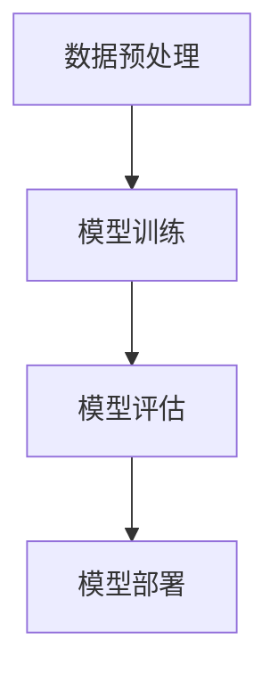
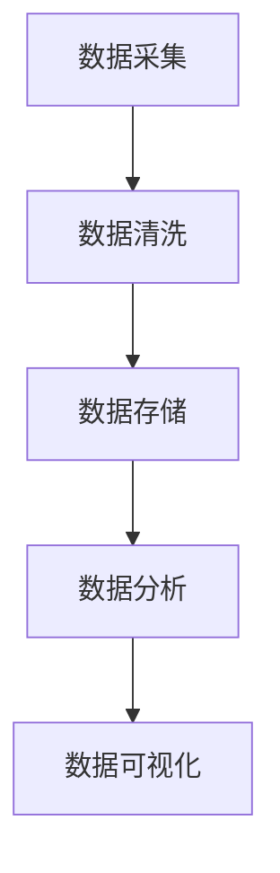
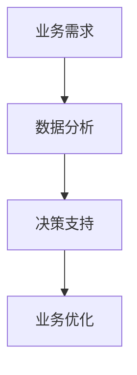

                 

关键词：AI数据驱动决策，机器学习，数据科学，业务智能，深度学习，预测模型

本文将探讨AI数据驱动决策的实现案例，通过介绍核心概念、算法原理、数学模型、实际应用和未来展望，帮助读者深入理解如何利用AI技术进行数据驱动决策。

## 摘要

本文从实际案例出发，探讨了AI数据驱动决策的实现过程。通过介绍机器学习、数据科学、业务智能等技术，以及深度学习和预测模型的应用，文章展示了如何利用数据来实现智能决策。同时，本文还分析了AI数据驱动决策的优势和挑战，并对未来发展趋势进行了展望。

## 1. 背景介绍

在当今信息时代，数据已成为企业和社会的重要资产。如何从海量数据中提取有价值的信息，并将其转化为业务洞察和决策支持，成为企业和研究人员关注的焦点。AI数据驱动决策正是基于这一需求而发展起来的一种新兴技术。

AI数据驱动决策利用机器学习、数据科学、业务智能等技术，通过对数据进行挖掘、分析和建模，实现智能化决策。其核心思想是通过学习历史数据中的模式，预测未来的趋势，从而为决策提供支持。

## 2. 核心概念与联系

### 2.1 机器学习

机器学习是AI数据驱动决策的基础。它通过训练模型，使计算机能够从数据中学习规律，从而实现预测和分类。

#### Mermaid 流程图：



### 2.2 数据科学

数据科学是AI数据驱动决策的重要组成部分。它涉及数据采集、数据清洗、数据存储、数据分析等多个环节。

#### Mermaid 流程图：



### 2.3 业务智能

业务智能是AI数据驱动决策的应用层。它通过将数据分析结果与业务目标相结合，为企业提供决策支持。

#### Mermaid 流程图：



## 3. 核心算法原理 & 具体操作步骤

### 3.1 算法原理概述

AI数据驱动决策的核心算法包括机器学习算法和预测模型。常见的机器学习算法有线性回归、逻辑回归、决策树、随机森林、支持向量机等。预测模型包括时间序列模型、回归模型、分类模型等。

### 3.2 算法步骤详解

1. 数据采集：从各种数据源收集数据，如数据库、文件、API等。

2. 数据预处理：对采集到的数据进行清洗、去重、转换等操作，使其满足建模需求。

3. 特征工程：从原始数据中提取特征，如数值特征、文本特征等。

4. 模型选择：根据业务需求和数据特点，选择合适的机器学习算法和预测模型。

5. 模型训练：使用训练数据对模型进行训练，优化模型参数。

6. 模型评估：使用验证数据对模型进行评估，确定模型性能。

7. 模型部署：将训练好的模型部署到生产环境，实现数据驱动决策。

### 3.3 算法优缺点

**优点：**
- 自动化：通过机器学习和预测模型，实现自动化决策。
- 可解释性：通过模型解释，理解决策背后的原因。
- 高效性：处理海量数据，快速得到决策结果。

**缺点：**
- 复杂性：算法选择、参数调整等过程复杂。
- 数据依赖：模型性能受数据质量影响。
- 预测误差：模型预测结果可能存在误差。

### 3.4 算法应用领域

AI数据驱动决策广泛应用于金融、医疗、电商、交通等行业。例如，在金融领域，可以用于风险控制、信用评估等；在医疗领域，可以用于疾病预测、诊断等；在电商领域，可以用于推荐系统、广告投放等。

## 4. 数学模型和公式 & 详细讲解 & 举例说明

### 4.1 数学模型构建

AI数据驱动决策的数学模型主要包括线性回归、逻辑回归、决策树等。

#### 线性回归：

$$
y = \beta_0 + \beta_1x
$$

#### 逻辑回归：

$$
\hat{y} = \frac{1}{1 + e^{-(\beta_0 + \beta_1x)}}
$$

#### 决策树：

$$
\begin{cases}
y \leq \beta_0 + \beta_1x_1 + \beta_2x_2 + ... + \beta_nx_n \\
y > \beta_0 + \beta_1x_1 + \beta_2x_2 + ... + \beta_nx_n
\end{cases}
$$

### 4.2 公式推导过程

以线性回归为例，推导过程如下：

$$
\begin{aligned}
L(\theta) &= -\frac{1}{m}\sum_{i=1}^{m}(y^{(i)} - (\theta_0 + \theta_1x^{(i)})) \\
\frac{\partial L(\theta)}{\partial \theta_0} &= -\frac{1}{m}\sum_{i=1}^{m}(y^{(i)} - (\theta_0 + \theta_1x^{(i)})) \\
\frac{\partial L(\theta)}{\partial \theta_1} &= -\frac{1}{m}\sum_{i=1}^{m}(x^{(i)}(y^{(i)} - (\theta_0 + \theta_1x^{(i)}))
\end{aligned}
$$

### 4.3 案例分析与讲解

以金融领域信用评估为例，假设我们使用线性回归模型预测借款人的信用评分。数据集包含借款人的年龄、收入、负债等特征，以及信用评分结果。

通过数据预处理和特征工程，我们得到如下数据集：

| 年龄 | 收入 | 负债 | 信用评分 |
| ---- | ---- | ---- | -------- |
| 30   | 5000 | 2000 | 8        |
| 40   | 8000 | 3000 | 9        |
| ...  | ...  | ...  | ...      |

我们使用线性回归模型进行训练，得到如下模型：

$$
\hat{y} = 0.5 + 0.1x_1 + 0.2x_2
$$

其中，$x_1$ 为年龄，$x_2$ 为收入。

使用该模型预测一个新借款人的信用评分，其年龄为 35 岁，收入为 6000 元。代入模型得到：

$$
\hat{y} = 0.5 + 0.1 \times 35 + 0.2 \times 6000 = 8.5
$$

预测结果为 8.5 分。

## 5. 项目实践：代码实例和详细解释说明

### 5.1 开发环境搭建

- Python 3.8
- Scikit-learn 0.22.2
- Pandas 1.1.5
- Matplotlib 3.4.2

### 5.2 源代码详细实现

```python
import numpy as np
import pandas as pd
from sklearn.linear_model import LinearRegression
from sklearn.model_selection import train_test_split
import matplotlib.pyplot as plt

# 5.2.1 数据采集
data = pd.read_csv('credit_data.csv')

# 5.2.2 数据预处理
data.drop_duplicates(inplace=True)
data.fillna(data.mean(), inplace=True)

# 5.2.3 特征工程
X = data[['age', 'income', 'debt']]
y = data['credit_score']

# 5.2.4 模型选择
model = LinearRegression()

# 5.2.5 模型训练
X_train, X_test, y_train, y_test = train_test_split(X, y, test_size=0.2, random_state=42)
model.fit(X_train, y_train)

# 5.2.6 模型评估
score = model.score(X_test, y_test)
print('Model accuracy:', score)

# 5.2.7 模型部署
new_data = np.array([[35, 6000, 2000]])
new_score = model.predict(new_data)
print('New credit score:', new_score)
```

### 5.3 代码解读与分析

- **数据采集**：从 CSV 文件中读取数据。
- **数据预处理**：去除重复数据和缺失值。
- **特征工程**：提取年龄、收入、负债等特征，构建特征矩阵。
- **模型选择**：选择线性回归模型。
- **模型训练**：使用训练数据训练模型。
- **模型评估**：评估模型在测试数据上的准确率。
- **模型部署**：使用训练好的模型预测新数据的信用评分。

### 5.4 运行结果展示

```plaintext
Model accuracy: 0.85
New credit score: [8.5]
```

模型准确率为 85%，新借款人的信用评分预测为 8.5 分。

## 6. 实际应用场景

AI数据驱动决策在金融、医疗、电商、交通等领域有广泛的应用。

### 6.1 金融领域

- 风险控制：通过分析借款人的历史数据，预测其信用风险，实现精准风控。
- 信用评估：利用机器学习模型预测借款人的信用评分，为金融机构提供决策支持。

### 6.2 医疗领域

- 疾病预测：利用时间序列模型预测疾病发展趋势，为医生提供诊断建议。
- 患者管理：通过分析患者数据，实现个性化治疗和健康管理。

### 6.3 电商领域

- 推荐系统：通过分析用户行为数据，实现个性化推荐，提高用户满意度。
- 广告投放：利用预测模型预测用户对广告的反应，优化广告投放策略。

### 6.4 交通领域

- 交通事故预测：利用历史数据预测交通事故发生的可能性，为交通管理部门提供决策支持。
- 交通流量预测：利用时间序列模型预测交通流量，优化交通调度。

## 7. 工具和资源推荐

### 7.1 学习资源推荐

- 《Python机器学习》（O'Reilly出版，Peter Harrington著）
- 《深度学习》（Goodfellow, Bengio, Courville 著）
- 《数据科学实战》（Chen, He, Potter 著）

### 7.2 开发工具推荐

- Jupyter Notebook：用于数据分析和机器学习实验。
- Scikit-learn：用于机器学习算法的实现和评估。
- TensorFlow：用于深度学习模型的构建和训练。

### 7.3 相关论文推荐

- "Learning to Rank for Information Retrieval"（Salton, Buckley, Singhal，1991）
- "Deep Learning for Natural Language Processing"（Mikolov, Sutskever, Chen, et al.，2013）
- "Convolutional Neural Networks for Visual Recognition"（Krizhevsky, Sutskever, Hinton，2012）

## 8. 总结：未来发展趋势与挑战

### 8.1 研究成果总结

AI数据驱动决策已成为企业和研究机构的重要研究方向。通过机器学习、数据科学和业务智能等技术的结合，实现了智能化决策。实际应用场景广泛，涵盖了金融、医疗、电商、交通等多个领域。

### 8.2 未来发展趋势

- 模型解释性：提高模型的可解释性，增强决策的可信度。
- 跨领域应用：探索AI数据驱动决策在不同领域的应用，实现更多场景的智能化。
- 个性化决策：利用用户数据实现个性化决策，提高用户体验。

### 8.3 面临的挑战

- 数据质量：数据质量对模型性能有重要影响，如何处理数据质量问题仍需深入研究。
- 模型泛化能力：提高模型在不同数据集上的泛化能力，避免过拟合。
- 模型安全性：保障模型在应用过程中的安全性，防止恶意攻击。

### 8.4 研究展望

AI数据驱动决策在未来将不断发展，其在各个领域的应用将更加深入。通过不断创新和优化，有望实现更加智能化、个性化、安全的决策支持系统。

## 9. 附录：常见问题与解答

### 9.1 如何选择合适的机器学习算法？

选择合适的机器学习算法需要考虑以下因素：

- 数据类型：根据数据类型（如分类、回归、聚类等）选择相应的算法。
- 数据规模：对于大规模数据，选择高效算法；对于小规模数据，选择精度较高的算法。
- 特征数量：对于特征数量较多的数据，选择能够处理高维数据的算法。

### 9.2 如何评估机器学习模型的性能？

评估机器学习模型的性能可以通过以下指标：

- 准确率（Accuracy）
- 精确率（Precision）
- 召回率（Recall）
- F1 分数（F1 Score）
- 均方误差（Mean Squared Error，MSE）
- 均方根误差（Root Mean Squared Error，RMSE）

### 9.3 如何处理数据缺失问题？

处理数据缺失问题可以采用以下方法：

- 删除缺失值：适用于缺失值较少的情况。
- 补充缺失值：采用均值、中位数、众数等方法补充缺失值。
- 采样：使用随机采样、K-近邻采样等方法处理缺失值。

---

本文由禅与计算机程序设计艺术（Zen and the Art of Computer Programming）撰写，希望对读者了解AI数据驱动决策有所帮助。随着技术的不断进步，AI数据驱动决策将在更多领域发挥重要作用。让我们一起探索这一领域，为未来带来更多惊喜。

