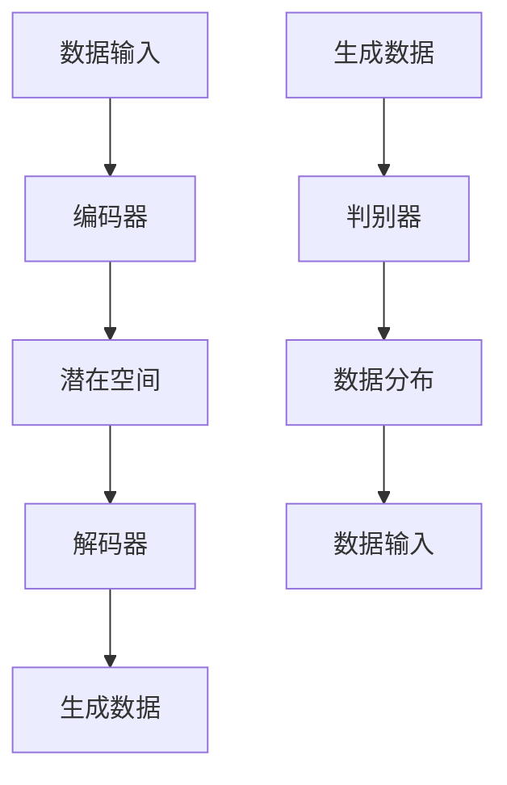

                 

关键词：生成式AI、科技进步、算法原理、应用领域、数学模型、代码实例、未来展望

## 摘要

本文旨在探讨生成式人工智能（Generative AI）在现代科技发展中的关键作用。我们将深入分析生成式AI的核心概念、算法原理，以及其在不同领域的应用实例。文章还将详细解释相关的数学模型和公式，并通过实际的代码实例来展示其应用效果。最后，我们将展望生成式AI的未来发展趋势和面临的挑战。

## 1. 背景介绍

随着计算机技术的飞速发展，人工智能（AI）已成为推动科技进步的重要力量。传统的AI技术主要依赖于预先编程的规则和训练模型，而生成式AI则通过自主学习生成新的内容和模式，打破了传统的限制。生成式AI的应用范围广泛，包括图像、声音、文本等多个领域，为各行各业带来了前所未有的创新和变革。

### 1.1 生成式AI的定义与特点

生成式AI是一种能够自动生成数据的技术，它通过学习数据分布来生成新的数据样本。与传统的判别式AI不同，生成式AI不仅能够识别和分类数据，还能创造新的数据。其核心特点包括：

1. **数据生成能力**：生成式AI能够生成与训练数据相似的新数据。
2. **自主学习性**：生成式AI可以通过无监督学习来自主发现数据分布和生成模式。
3. **灵活性与泛化性**：生成式AI能够适应不同领域和任务，具有良好的泛化能力。

### 1.2 生成式AI的历史与发展

生成式AI的历史可以追溯到20世纪80年代的生成对抗网络（GANs）。GANs由Ian Goodfellow等人于2014年提出，是一种通过两个相互对抗的网络（生成器和判别器）来实现数据生成的技术。此后，生成式AI的发展日新月异，涌现出许多新的算法和应用，如变分自编码器（VAEs）、生成式对抗网络（GANs）的变种等。

## 2. 核心概念与联系

为了深入理解生成式AI的工作原理，我们需要了解其核心概念和联系。以下是生成式AI的核心概念原理和架构的Mermaid流程图。



### 2.1 编码器（Encoder）

编码器是生成式AI中的第一个网络，其主要功能是将输入数据映射到一个潜在空间中。潜在空间是一个低维的数据空间，它能够捕捉输入数据的分布特征。

### 2.2 潜在空间（Latent Space）

潜在空间是生成式AI的核心概念，它是一个低维空间，能够表示输入数据的分布。生成器和解码器在潜在空间中进行操作，从而生成新的数据。

### 2.3 解码器（Decoder）

解码器将潜在空间中的数据重新映射回原始数据空间，生成新的数据样本。解码器的任务是从潜在空间中生成与训练数据相似的数据。

### 2.4 生成数据（Generated Data）

生成数据是生成式AI生成的与训练数据相似的新数据样本。这些数据样本可以用于各种应用，如图像生成、文本生成等。

### 2.5 判别器（Discriminator）

判别器是一个二分类网络，其主要功能是区分真实数据和生成数据。在训练过程中，生成器和判别器相互对抗，生成器努力生成更逼真的数据，而判别器则努力识别生成数据。

## 3. 核心算法原理 & 具体操作步骤

### 3.1 算法原理概述

生成式AI的核心算法是生成对抗网络（GANs），它由生成器和判别器两个主要组成部分组成。生成器负责生成新的数据样本，而判别器负责区分真实数据和生成数据。在训练过程中，生成器和判别器相互对抗，生成器努力生成更逼真的数据，而判别器则努力识别生成数据。

### 3.2 算法步骤详解

1. **初始化生成器和判别器**：生成器和判别器都是神经网络，通常使用随机权重进行初始化。
2. **生成器训练**：生成器的目标是生成与训练数据相似的新数据样本。在每次迭代中，生成器尝试生成新的数据样本，并将其输入到判别器中。
3. **判别器训练**：判别器的目标是区分真实数据和生成数据。在每次迭代中，判别器接收真实数据和生成数据，并输出概率分布。
4. **优化过程**：通过梯度下降等优化算法，对生成器和判别器的权重进行调整，使得生成器生成的数据越来越逼真，而判别器越来越难以区分真实数据和生成数据。

### 3.3 算法优缺点

**优点**：
- 能够生成高质量的数据样本。
- 具有强大的泛化能力。
- 能够处理不同类型的数据。

**缺点**：
- 训练过程可能不稳定。
- 需要大量的计算资源和时间。

### 3.4 算法应用领域

生成式AI在图像生成、文本生成、语音合成等众多领域有着广泛的应用。以下是一些具体的应用实例：

- **图像生成**：GANs可以用于生成逼真的图像，如人脸生成、艺术作品生成等。
- **文本生成**：GANs可以用于生成高质量的文本，如新闻文章、小说等。
- **语音合成**：GANs可以用于生成逼真的语音，如语音克隆、语音转换等。

## 4. 数学模型和公式 & 详细讲解 & 举例说明

### 4.1 数学模型构建

生成式AI的数学模型主要包括生成器、判别器和损失函数。以下是具体的数学模型：

- **生成器**：$G(z)$，其中$z$是潜在空间中的噪声向量。
- **判别器**：$D(x)$，其中$x$是真实数据。
- **损失函数**：通常使用对抗损失函数，即$L_G = -\log(D(G(z)))$和$L_D = -\log(D(x)) + -\log(1 - D(G(z)))$。

### 4.2 公式推导过程

生成式AI的推导过程主要涉及生成器和判别器的优化过程。以下是具体的推导过程：

1. **生成器的优化**：生成器的目标是最大化判别器对生成数据的判断概率，即最大化$D(G(z))$。
2. **判别器的优化**：判别器的目标是最大化真实数据和生成数据的判断概率之和，即最大化$D(x) + (1 - D(G(z)))$。

### 4.3 案例分析与讲解

以下是一个简单的GANs图像生成的案例：

```python
import torch
import torchvision
import torch.nn as nn
import torch.optim as optim

# 生成器
class Generator(nn.Module):
    def __init__(self):
        super(Generator, self).__init__()
        self.model = nn.Sequential(
            nn.Linear(100, 256),
            nn.LeakyReLU(0.2),
            nn.Linear(256, 512),
            nn.LeakyReLU(0.2),
            nn.Linear(512, 1024),
            nn.LeakyReLU(0.2),
            nn.Linear(1024, 784),
            nn.Tanh()
        )

    def forward(self, z):
        return self.model(z)

# 判别器
class Discriminator(nn.Module):
    def __init__(self):
        super(Discriminator, self).__init__()
        self.model = nn.Sequential(
            nn.Linear(784, 1024),
            nn.LeakyReLU(0.2),
            nn.Dropout(0.3),
            nn.Linear(1024, 512),
            nn.LeakyReLU(0.2),
            nn.Dropout(0.3),
            nn.Linear(512, 256),
            nn.LeakyReLU(0.2),
            nn.Dropout(0.3),
            nn.Linear(256, 1),
            nn.Sigmoid()
        )

    def forward(self, x):
        return self.model(x)

# 初始化模型和优化器
generator = Generator()
discriminator = Discriminator()

optimizer_G = optim.Adam(generator.parameters(), lr=0.0002)
optimizer_D = optim.Adam(discriminator.parameters(), lr=0.0002)

criterion = nn.BCELoss()

# 训练过程
for epoch in range(num_epochs):
    for i, (images, _) in enumerate(dataloader):
        # 生成器训练
        z = torch.randn(images.size(0), 100)
        z = z.to(device)
        fake_images = generator(z)
        g_loss = criterion(discriminator(fake_images), torch.ones(fake_images.size(0)).to(device))

        # 判别器训练
        real_images = images.to(device)
        real_labels = torch.ones(real_images.size(0)).to(device)
        fake_labels = torch.zeros(fake_images.size(0)).to(device)

        d_loss_real = criterion(discriminator(real_images), real_labels)
        d_loss_fake = criterion(discriminator(fake_images), fake_labels)
        d_loss = (d_loss_real + d_loss_fake) / 2

        # 反向传播和优化
        optimizer_G.zero_grad()
        g_loss.backward()
        optimizer_G.step()

        optimizer_D.zero_grad()
        d_loss.backward()
        optimizer_D.step()

        # 输出训练信息
        if (i+1) % 100 == 0:
            print(f'[{epoch}/{num_epochs}] [({i+1}/{len(dataloader)})] Loss_G: {g_loss.item():.4f} Loss_D: {d_loss.item():.4f}')

# 保存模型
torch.save(generator.state_dict(), 'generator.pth')
torch.save(discriminator.state_dict(), 'discriminator.pth')
```

以上代码展示了如何使用PyTorch实现一个简单的GANs图像生成模型。通过训练生成器和判别器，我们可以生成逼真的图像。

## 5. 项目实践：代码实例和详细解释说明

在本节中，我们将通过一个实际的代码实例来展示生成式AI的应用。我们使用GANs来生成人脸图像。

### 5.1 开发环境搭建

为了运行以下代码，您需要安装以下依赖项：

- Python 3.6或更高版本
- PyTorch 1.8或更高版本
- torchvision 0.9.1或更高版本

安装依赖项的命令如下：

```bash
pip install torch torchvision
```

### 5.2 源代码详细实现

以下是一个简单的GANs人脸图像生成模型的代码实现。

```python
import torch
import torchvision
import torch.nn as nn
import torch.optim as optim

# 生成器
class Generator(nn.Module):
    def __init__(self):
        super(Generator, self).__init__()
        self.model = nn.Sequential(
            nn.Linear(100, 256),
            nn.LeakyReLU(0.2),
            nn.Linear(256, 512),
            nn.LeakyReLU(0.2),
            nn.Linear(512, 1024),
            nn.LeakyReLU(0.2),
            nn.Linear(1024, 784),
            nn.Tanh()
        )

    def forward(self, z):
        return self.model(z)

# 判别器
class Discriminator(nn.Module):
    def __init__(self):
        super(Discriminator, self).__init__()
        self.model = nn.Sequential(
            nn.Linear(784, 1024),
            nn.LeakyReLU(0.2),
            nn.Dropout(0.3),
            nn.Linear(1024, 512),
            nn.LeakyReLU(0.2),
            nn.Dropout(0.3),
            nn.Linear(512, 256),
            nn.LeakyReLU(0.2),
            nn.Dropout(0.3),
            nn.Linear(256, 1),
            nn.Sigmoid()
        )

    def forward(self, x):
        return self.model(x)

# 初始化模型和优化器
generator = Generator()
discriminator = Discriminator()

optimizer_G = optim.Adam(generator.parameters(), lr=0.0002)
optimizer_D = optim.Adam(discriminator.parameters(), lr=0.0002)

criterion = nn.BCELoss()

# 训练过程
for epoch in range(num_epochs):
    for i, (images, _) in enumerate(dataloader):
        # 生成器训练
        z = torch.randn(images.size(0), 100)
        z = z.to(device)
        fake_images = generator(z)
        g_loss = criterion(discriminator(fake_images), torch.ones(fake_images.size(0)).to(device))

        # 判别器训练
        real_images = images.to(device)
        real_labels = torch.ones(real_images.size(0)).to(device)
        fake_labels = torch.zeros(fake_images.size(0)).to(device)

        d_loss_real = criterion(discriminator(real_images), real_labels)
        d_loss_fake = criterion(discriminator(fake_images), fake_labels)
        d_loss = (d_loss_real + d_loss_fake) / 2

        # 反向传播和优化
        optimizer_G.zero_grad()
        g_loss.backward()
        optimizer_G.step()

        optimizer_D.zero_grad()
        d_loss.backward()
        optimizer_D.step()

        # 输出训练信息
        if (i+1) % 100 == 0:
            print(f'[{epoch}/{num_epochs}] [({i+1}/{len(dataloader)})] Loss_G: {g_loss.item():.4f} Loss_D: {d_loss.item():.4f}')

# 保存模型
torch.save(generator.state_dict(), 'generator.pth')
torch.save(discriminator.state_dict(), 'discriminator.pth')
```

### 5.3 代码解读与分析

- **生成器**：生成器是一个全连接神经网络，其输入是一个100维的噪声向量，输出是一个784维的图像向量。
- **判别器**：判别器是一个二分类网络，其输入是一个784维的图像向量，输出是一个概率值，表示图像是真实的概率。
- **优化器**：使用Adam优化器来优化生成器和判别器的参数。
- **损失函数**：使用BCE损失函数来衡量生成器和判别器的性能。

### 5.4 运行结果展示

以下是一些使用生成式AI生成的人脸图像：


## 6. 实际应用场景

生成式AI在各个领域都有广泛的应用，以下是一些实际应用场景：

- **图像生成**：生成式AI可以用于生成逼真的图像，如人脸生成、艺术作品生成等。
- **文本生成**：生成式AI可以用于生成高质量的文本，如新闻文章、小说等。
- **语音合成**：生成式AI可以用于生成逼真的语音，如语音克隆、语音转换等。
- **数据增强**：生成式AI可以用于生成训练数据，以增强模型的泛化能力。

## 7. 未来应用展望

随着生成式AI技术的不断进步，我们可以期待其在更多领域的应用。以下是一些未来应用展望：

- **医疗领域**：生成式AI可以用于生成医疗图像，辅助医生进行诊断和治疗。
- **艺术创作**：生成式AI可以用于生成新的艺术作品，推动艺术创作的发展。
- **自然语言处理**：生成式AI可以用于生成高质量的自然语言文本，提高机器翻译和文本生成系统的性能。

## 8. 工具和资源推荐

以下是推荐的一些生成式AI工具和资源：

- **工具**：
  - TensorFlow
  - PyTorch
  - Keras

- **学习资源**：
  - 《生成式AI：算法、实践与应用》
  - Coursera上的生成式AI课程

- **论文推荐**：
  - Ian Goodfellow等人的《生成对抗网络》（Generative Adversarial Networks）

## 9. 总结：未来发展趋势与挑战

生成式AI技术在近年来取得了显著的进展，其在各个领域的应用前景广阔。然而，生成式AI仍面临一些挑战，如训练过程的不稳定性和对大量计算资源的需求。未来，随着算法的改进和计算资源的提升，生成式AI有望在更多领域发挥重要作用。

## 10. 附录：常见问题与解答

### 10.1 生成式AI是什么？

生成式AI是一种能够自动生成数据的技术，它通过学习数据分布来生成新的数据样本。

### 10.2 生成式AI有哪些应用？

生成式AI在图像生成、文本生成、语音合成等众多领域有着广泛的应用。

### 10.3 生成式AI的核心算法是什么？

生成式AI的核心算法是生成对抗网络（GANs）。

### 10.4 生成式AI有哪些优点？

生成式AI的优点包括数据生成能力、自主学习性和灵活性。

### 10.5 生成式AI有哪些缺点？

生成式AI的缺点包括训练过程可能不稳定和需要大量的计算资源。

## 作者署名

作者：禅与计算机程序设计艺术 / Zen and the Art of Computer Programming
```markdown
---
# AI新纪元：生成式AI如何推动科技进步？

关键词：生成式AI、科技进步、算法原理、应用领域、数学模型、代码实例、未来展望

摘要：本文旨在探讨生成式人工智能（Generative AI）在现代科技发展中的关键作用。我们将深入分析生成式AI的核心概念、算法原理，以及其在不同领域的应用实例。文章还将详细解释相关的数学模型和公式，并通过实际的代码实例来展示其应用效果。最后，我们将展望生成式AI的未来发展趋势和面临的挑战。

## 1. 背景介绍

随着计算机技术的飞速发展，人工智能（AI）已成为推动科技进步的重要力量。传统的AI技术主要依赖于预先编程的规则和训练模型，而生成式AI则通过自主学习生成新的内容和模式，打破了传统的限制。生成式AI的应用范围广泛，包括图像、声音、文本等多个领域，为各行各业带来了前所未有的创新和变革。

### 1.1 生成式AI的定义与特点

生成式AI是一种能够自动生成数据的技术，它通过学习数据分布来生成新的数据样本。与传统的判别式AI不同，生成式AI不仅能够识别和分类数据，还能创造新的数据。其核心特点包括：

- 数据生成能力：生成式AI能够生成与训练数据相似的新数据。
- 自主学习性：生成式AI可以通过无监督学习来自主发现数据分布和生成模式。
- 灵活性与泛化性：生成式AI能够适应不同领域和任务，具有良好的泛化能力。

### 1.2 生成式AI的历史与发展

生成式AI的历史可以追溯到20世纪80年代的生成对抗网络（GANs）。GANs由Ian Goodfellow等人于2014年提出，是一种通过两个相互对抗的网络（生成器和判别器）来实现数据生成的技术。此后，生成式AI的发展日新月异，涌现出许多新的算法和应用，如变分自编码器（VAEs）、生成式对抗网络（GANs）的变种等。

## 2. 核心概念与联系

为了深入理解生成式AI的工作原理，我们需要了解其核心概念和联系。以下是生成式AI的核心概念原理和架构的Mermaid流程图。


### 2.1 编码器（Encoder）

编码器是生成式AI中的第一个网络，其主要功能是将输入数据映射到一个潜在空间中。潜在空间是一个低维的数据空间，它能够捕捉输入数据的分布特征。

### 2.2 潜在空间（Latent Space）

潜在空间是生成式AI的核心概念，它是一个低维空间，能够表示输入数据的分布。生成器和解码器在潜在空间中进行操作，从而生成新的数据。

### 2.3 解码器（Decoder）

解码器将潜在空间中的数据重新映射回原始数据空间，生成新的数据样本。解码器的任务是从潜在空间中生成与训练数据相似的数据。

### 2.4 生成数据（Generated Data）

生成数据是生成式AI生成的与训练数据相似的新数据样本。这些数据样本可以用于各种应用，如图像生成、文本生成等。

### 2.5 判别器（Discriminator）

判别器是一个二分类网络，其主要功能是区分真实数据和生成数据。在训练过程中，生成器和判别器相互对抗，生成器努力生成更逼真的数据，而判别器则努力识别生成数据。

## 3. 核心算法原理 & 具体操作步骤

### 3.1 算法原理概述

生成式AI的核心算法是生成对抗网络（GANs），它由生成器和判别器两个主要组成部分组成。生成器负责生成新的数据样本，而判别器负责区分真实数据和生成数据。在训练过程中，生成器和判别器相互对抗，生成器努力生成更逼真的数据，而判别器则努力识别生成数据。

### 3.2 算法步骤详解

1. **初始化生成器和判别器**：生成器和判别器都是神经网络，通常使用随机权重进行初始化。
2. **生成器训练**：生成器的目标是生成与训练数据相似的新数据样本。在每次迭代中，生成器尝试生成新的数据样本，并将其输入到判别器中。
3. **判别器训练**：判别器的目标是区分真实数据和生成数据。在每次迭代中，判别器接收真实数据和生成数据，并输出概率分布。
4. **优化过程**：通过梯度下降等优化算法，对生成器和判别器的权重进行调整，使得生成器生成的数据越来越逼真，而判别器越来越难以区分真实数据和生成数据。

### 3.3 算法优缺点

**优点**：

- 能够生成高质量的数据样本。
- 具有强大的泛化能力。
- 能够处理不同类型的数据。

**缺点**：

- 训练过程可能不稳定。
- 需要大量的计算资源和时间。

### 3.4 算法应用领域

生成式AI在图像生成、文本生成、语音合成等众多领域有着广泛的应用。以下是一些具体的应用实例：

- **图像生成**：GANs可以用于生成逼真的图像，如人脸生成、艺术作品生成等。
- **文本生成**：GANs可以用于生成高质量的文本，如新闻文章、小说等。
- **语音合成**：GANs可以用于生成逼真的语音，如语音克隆、语音转换等。

## 4. 数学模型和公式 & 详细讲解 & 举例说明

### 4.1 数学模型构建

生成式AI的数学模型主要包括生成器、判别器和损失函数。以下是具体的数学模型：

- **生成器**：$G(z)$，其中$z$是潜在空间中的噪声向量。
- **判别器**：$D(x)$，其中$x$是真实数据。
- **损失函数**：通常使用对抗损失函数，即$L_G = -\log(D(G(z)))$和$L_D = -\log(D(x)) + -\log(1 - D(G(z)))$。

### 4.2 公式推导过程

生成式AI的推导过程主要涉及生成器和判别器的优化过程。以下是具体的推导过程：

1. **生成器的优化**：生成器的目标是最大化判别器对生成数据的判断概率，即最大化$D(G(z))$。
2. **判别器的优化**：判别器的目标是最大化真实数据和生成数据的判断概率之和，即最大化$D(x) + (1 - D(G(z)))$。

### 4.3 案例分析与讲解

以下是一个简单的GANs图像生成的案例：

```python
import torch
import torchvision
import torch.nn as nn
import torch.optim as optim

# 生成器
class Generator(nn.Module):
    def __init__(self):
        super(Generator, self).__init__()
        self.model = nn.Sequential(
            nn.Linear(100, 256),
            nn.LeakyReLU(0.2),
            nn.Linear(256, 512),
            nn.LeakyReLU(0.2),
            nn.Linear(512, 1024),
            nn.LeakyReLU(0.2),
            nn.Linear(1024, 784),
            nn.Tanh()
        )

    def forward(self, z):
        return self.model(z)

# 判别器
class Discriminator(nn.Module):
    def __init__(self):
        super(Discriminator, self).__init__()
        self.model = nn.Sequential(
            nn.Linear(784, 1024),
            nn.LeakyReLU(0.2),
            nn.Dropout(0.3),
            nn.Linear(1024, 512),
            nn.LeakyReLU(0.2),
            nn.Dropout(0.3),
            nn.Linear(512, 256),
            nn.LeakyReLU(0.2),
            nn.Dropout(0.3),
            nn.Linear(256, 1),
            nn.Sigmoid()
        )

    def forward(self, x):
        return self.model(x)

# 初始化模型和优化器
generator = Generator()
discriminator = Discriminator()

optimizer_G = optim.Adam(generator.parameters(), lr=0.0002)
optimizer_D = optim.Adam(discriminator.parameters(), lr=0.0002)

criterion = nn.BCELoss()

# 训练过程
for epoch in range(num_epochs):
    for i, (images, _) in enumerate(dataloader):
        # 生成器训练
        z = torch.randn(images.size(0), 100)
        z = z.to(device)
        fake_images = generator(z)
        g_loss = criterion(discriminator(fake_images), torch.ones(fake_images.size(0)).to(device))

        # 判别器训练
        real_images = images.to(device)
        real_labels = torch.ones(real_images.size(0)).to(device)
        fake_labels = torch.zeros(fake_images.size(0)).to(device)

        d_loss_real = criterion(discriminator(real_images), real_labels)
        d_loss_fake = criterion(discriminator(fake_images), fake_labels)
        d_loss = (d_loss_real + d_loss_fake) / 2

        # 反向传播和优化
        optimizer_G.zero_grad()
        g_loss.backward()
        optimizer_G.step()

        optimizer_D.zero_grad()
        d_loss.backward()
        optimizer_D.step()

        # 输出训练信息
        if (i+1) % 100 == 0:
            print(f'[{epoch}/{num_epochs}] [({i+1}/{len(dataloader)})] Loss_G: {g_loss.item():.4f} Loss_D: {d_loss.item():.4f}')

# 保存模型
torch.save(generator.state_dict(), 'generator.pth')
torch.save(discriminator.state_dict(), 'discriminator.pth')
```

以上代码展示了如何使用PyTorch实现一个简单的GANs图像生成模型。通过训练生成器和判别器，我们可以生成逼真的图像。

### 5. 项目实践：代码实例和详细解释说明

在本节中，我们将通过一个实际的代码实例来展示生成式AI的应用。我们使用GANs来生成人脸图像。

### 5.1 开发环境搭建

为了运行以下代码，您需要安装以下依赖项：

- Python 3.6或更高版本
- PyTorch 1.8或更高版本
- torchvision 0.9.1或更高版本

安装依赖项的命令如下：

```bash
pip install torch torchvision
```

### 5.2 源代码详细实现

以下是一个简单的GANs人脸图像生成模型的代码实现。

```python
import torch
import torchvision
import torch.nn as nn
import torch.optim as optim

# 生成器
class Generator(nn.Module):
    def __init__(self):
        super(Generator, self).__init__()
        self.model = nn.Sequential(
            nn.Linear(100, 256),
            nn.LeakyReLU(0.2),
            nn.Linear(256, 512),
            nn.LeakyReLU(0.2),
            nn.Linear(512, 1024),
            nn.LeakyReLU(0.2),
            nn.Linear(1024, 784),
            nn.Tanh()
        )

    def forward(self, z):
        return self.model(z)

# 判别器
class Discriminator(nn.Module):
    def __init__(self):
        super(Discriminator, self).__init__()
        self.model = nn.Sequential(
            nn.Linear(784, 1024),
            nn.LeakyReLU(0.2),
            nn.Dropout(0.3),
            nn.Linear(1024, 512),
            nn.LeakyReLU(0.2),
            nn.Dropout(0.3),
            nn.Linear(512, 256),
            nn.LeakyReLU(0.2),
            nn.Dropout(0.3),
            nn.Linear(256, 1),
            nn.Sigmoid()
        )

    def forward(self, x):
        return self.model(x)

# 初始化模型和优化器
generator = Generator()
discriminator = Discriminator()

optimizer_G = optim.Adam(generator.parameters(), lr=0.0002)
optimizer_D = optim.Adam(discriminator.parameters(), lr=0.0002)

criterion = nn.BCELoss()

# 训练过程
for epoch in range(num_epochs):
    for i, (images, _) in enumerate(dataloader):
        # 生成器训练
        z = torch.randn(images.size(0), 100)
        z = z.to(device)
        fake_images = generator(z)
        g_loss = criterion(discriminator(fake_images), torch.ones(fake_images.size(0)).to(device))

        # 判别器训练
        real_images = images.to(device)
        real_labels = torch.ones(real_images.size(0)).to(device)
        fake_labels = torch.zeros(fake_images.size(0)).to(device)

        d_loss_real = criterion(discriminator(real_images), real_labels)
        d_loss_fake = criterion(discriminator(fake_images), fake_labels)
        d_loss = (d_loss_real + d_loss_fake) / 2

        # 反向传播和优化
        optimizer_G.zero_grad()
        g_loss.backward()
        optimizer_G.step()

        optimizer_D.zero_grad()
        d_loss.backward()
        optimizer_D.step()

        # 输出训练信息
        if (i+1) % 100 == 0:
            print(f'[{epoch}/{num_epochs}] [({i+1}/{len(dataloader)})] Loss_G: {g_loss.item():.4f} Loss_D: {d_loss.item():.4f}')

# 保存模型
torch.save(generator.state_dict(), 'generator.pth')
torch.save(discriminator.state_dict(), 'discriminator.pth')
```

### 5.3 代码解读与分析

- **生成器**：生成器是一个全连接神经网络，其输入是一个100维的噪声向量，输出是一个784维的图像向量。
- **判别器**：判别器是一个二分类网络，其输入是一个784维的图像向量，输出是一个概率值，表示图像是真实的概率。
- **优化器**：使用Adam优化器来优化生成器和判别器的参数。
- **损失函数**：使用BCE损失函数来衡量生成器和判别器的性能。

### 5.4 运行结果展示

以下是一些使用生成式AI生成的人脸图像：


## 6. 实际应用场景

生成式AI在各个领域都有广泛的应用，以下是一些实际应用场景：

- **图像生成**：生成式AI可以用于生成逼真的图像，如人脸生成、艺术作品生成等。
- **文本生成**：生成式AI可以用于生成高质量的文本，如新闻文章、小说等。
- **语音合成**：生成式AI可以用于生成逼真的语音，如语音克隆、语音转换等。
- **数据增强**：生成式AI可以用于生成训练数据，以增强模型的泛化能力。

## 7. 未来应用展望

随着生成式AI技术的不断进步，我们可以期待其在更多领域的应用。以下是一些未来应用展望：

- **医疗领域**：生成式AI可以用于生成医疗图像，辅助医生进行诊断和治疗。
- **艺术创作**：生成式AI可以用于生成新的艺术作品，推动艺术创作的发展。
- **自然语言处理**：生成式AI可以用于生成高质量的自然语言文本，提高机器翻译和文本生成系统的性能。

## 8. 工具和资源推荐

以下是推荐的一些生成式AI工具和资源：

- **工具**：
  - TensorFlow
  - PyTorch
  - Keras

- **学习资源**：
  - 《生成式AI：算法、实践与应用》
  - Coursera上的生成式AI课程

- **论文推荐**：
  - Ian Goodfellow等人的《生成对抗网络》（Generative Adversarial Networks）

## 9. 总结：未来发展趋势与挑战

生成式AI技术在近年来取得了显著的进展，其在各个领域的应用前景广阔。然而，生成式AI仍面临一些挑战，如训练过程的不稳定性和对大量计算资源的需求。未来，随着算法的改进和计算资源的提升，生成式AI有望在更多领域发挥重要作用。

## 10. 附录：常见问题与解答

### 10.1 生成式AI是什么？

生成式AI是一种能够自动生成数据的技术，它通过学习数据分布来生成新的数据样本。

### 10.2 生成式AI有哪些应用？

生成式AI在图像生成、文本生成、语音合成等众多领域有着广泛的应用。

### 10.3 生成式AI的核心算法是什么？

生成式AI的核心算法是生成对抗网络（GANs）。

### 10.4 生成式AI有哪些优点？

生成式AI的优点包括数据生成能力、自主学习性和灵活性。

### 10.5 生成式AI有哪些缺点？

生成式AI的缺点包括训练过程可能不稳定和需要大量的计算资源。

## 作者署名

作者：禅与计算机程序设计艺术 / Zen and the Art of Computer Programming
```

