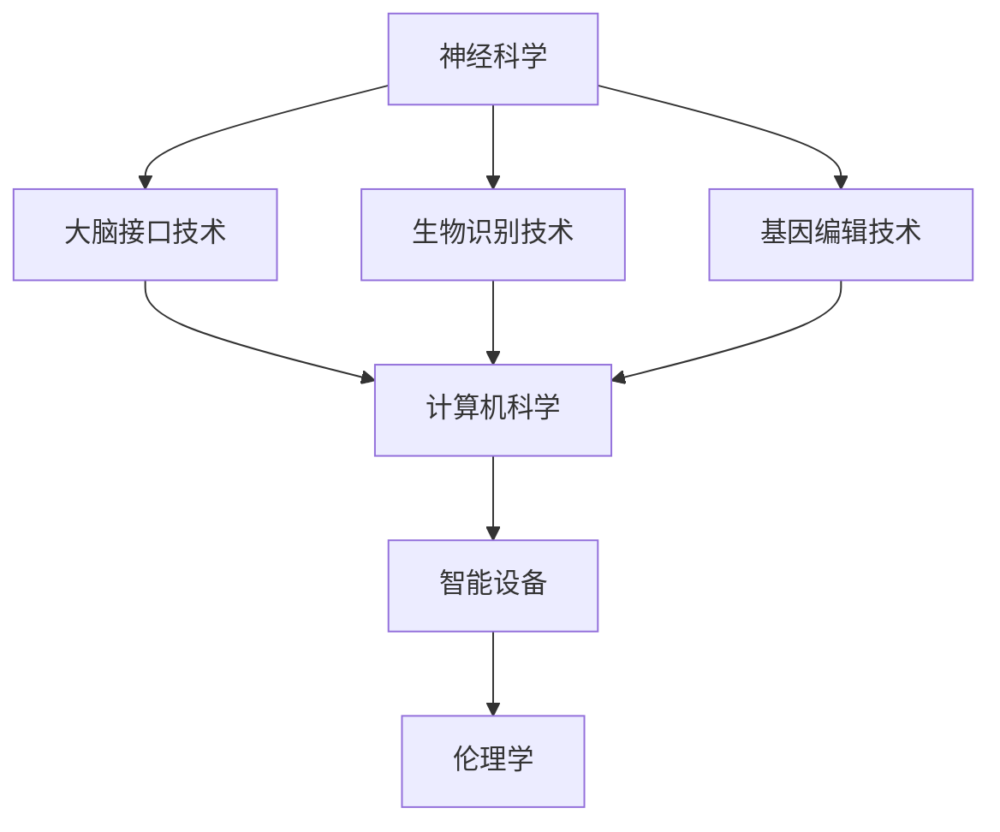

                 

在当今科技飞速发展的时代，人工智能（AI）技术已经深入到我们生活的方方面面。从自动驾驶汽车到智能医疗诊断，从智能家居到高效供应链管理，AI正在不断重塑我们的世界。与此同时，人类增强技术的发展也取得了令人瞩目的进展，包括大脑接口技术、生物识别技术、基因编辑技术等。这些技术不仅极大地提升了人类的能力，也引发了关于道德伦理、社会影响、以及身体增强的广泛讨论。本文将深入探讨AI时代的人类增强，从道德考虑和未来发展机遇的角度进行分析。

## 文章关键词

- 人工智能（AI）
- 人类增强
- 道德考虑
- 身体增强
- 未来发展机遇

## 文章摘要

本文旨在探讨AI时代下人类增强技术的道德考量以及未来的发展机遇。首先，我们将回顾人类增强技术的发展历程，介绍当前的主要技术进展。接着，文章将探讨这些技术带来的道德挑战，包括隐私问题、伦理争议和社会公平等。随后，我们将分析身体增强技术的未来发展方向，探讨可能的机遇和挑战。文章最后，将总结研究成果，展望未来的发展趋势和面临的挑战。

## 1. 背景介绍

人类增强的历史可以追溯到古代，当人们开始使用工具来增强自己的力量和智慧。然而，真正的突破发生在20世纪末和21世纪初，随着计算机技术、生物工程、纳米技术等领域的快速发展，人类增强技术开始从概念走向现实。

### 1.1 早期探索

早期的人类增强探索主要集中在物理增强方面，如增强肌肉力量、提高耐力和速度等。这些努力往往借助体育训练、营养补充和医疗器械来实现。例如，自行车运动员使用电动自行车来提高骑行效率，飞行员穿戴特殊装备来增强飞行能力。

### 1.2 当前进展

随着科技的进步，人类增强技术已经从物理层面扩展到生物层面和认知层面。以下是一些当前的主要进展：

- **大脑接口技术**：通过植入设备直接与大脑通信，实现思维控制和信息传递。
- **生物识别技术**：利用指纹、面部识别、虹膜扫描等技术进行身份验证和生物特征识别。
- **基因编辑技术**：如CRISPR-Cas9，允许科学家精确地修改基因组，从而治疗遗传疾病或增强特定性状。
- **穿戴设备**：如智能手表和健康监测设备，可以实时监测生物指标，提供健康建议。

### 1.3 发展趋势

未来，人类增强技术将继续向更精细、更智能的方向发展。例如，纳米机器人可能被用来修复细胞和组织，增强免疫系统；增强现实（AR）和虚拟现实（VR）技术将进一步提升人类的感知和认知能力。

## 2. 核心概念与联系

人类增强技术的核心概念涉及多个学科，包括神经科学、计算机科学、生物工程学和伦理学。以下是一个简化的Mermaid流程图，展示了这些概念之间的联系：



### 2.1 神经科学与大脑接口技术

神经科学与大脑接口技术密切相关。通过理解大脑的工作机制，科学家们开发了各种大脑接口设备，如脑机接口（BMI），这些设备可以直接与大脑通信，用于思维控制和信息传递。

### 2.2 生物识别技术与计算机科学

生物识别技术利用计算机科学原理，通过生物特征识别技术实现身份验证和安全控制。这些技术包括指纹识别、面部识别和虹膜扫描等，广泛应用于安全领域和日常生活中的身份验证。

### 2.3 基因编辑技术与生物工程学

基因编辑技术是生物工程学的一个重要分支。通过CRISPR-Cas9等工具，科学家们可以精确地修改基因组，从而治疗遗传疾病或增强特定性状。这一技术正在快速发展，并引发广泛的社会关注。

### 2.4 智能设备与伦理学

智能设备，如智能手表和健康监测设备，正在改变人们的健康管理和生活方式。然而，这些设备也带来了隐私和伦理挑战。伦理学在这一领域扮演着关键角色，确保技术的使用符合道德规范。

## 3. 核心算法原理 & 具体操作步骤

### 3.1 算法原理概述

人类增强技术的核心算法通常涉及到信号处理、机器学习和控制理论。以下是一些关键的算法原理：

- **信号处理**：通过分析生物信号（如脑电波、心电信号等），算法可以提取出有用的信息，用于控制外部设备或进行自我监控。
- **机器学习**：利用大量数据训练模型，算法可以识别和预测复杂的生物行为，从而优化人类增强系统的性能。
- **控制理论**：通过反馈机制，算法可以实时调整系统参数，确保增强效果最大化。

### 3.2 算法步骤详解

以下是人类增强技术中一些关键算法的步骤：

#### 3.2.1 脑电波信号处理

1. **采集脑电波信号**：使用脑电帽或电极片采集脑电波信号。
2. **预处理**：过滤噪声，提高信号质量。
3. **特征提取**：使用傅立叶变换或其他方法提取信号特征。
4. **分类**：使用机器学习算法（如支持向量机、神经网络）对特征进行分类，识别不同的思维活动。

#### 3.2.2 生物识别技术

1. **采集生物特征**：使用指纹扫描仪、摄像头或虹膜扫描设备采集生物特征。
2. **预处理**：对采集的数据进行预处理，如去噪、对比度增强等。
3. **特征提取**：使用特征提取算法（如主成分分析、LDA）提取关键特征。
4. **匹配与验证**：将提取的特征与数据库中的数据进行匹配，验证身份。

#### 3.2.3 基因编辑

1. **目标基因识别**：通过测序技术确定需要编辑的基因。
2. **设计引导RNA**：设计特定的引导RNA序列，引导Cas9酶到目标位点。
3. **DNA剪切**：引导RNA与目标DNA结合，Cas9酶进行切割。
4. **DNA修复**：细胞利用DNA修复机制引入特定的修改。

### 3.3 算法优缺点

每种算法都有其独特的优点和局限性：

- **信号处理算法**：优点是可以实时处理和解析生物信号，缺点是易受噪声干扰，对信号质量要求较高。
- **机器学习算法**：优点是能够从数据中学习，自适应优化性能，缺点是需要大量数据训练，且可能存在过拟合问题。
- **控制理论算法**：优点是能够实现精确的控制和优化，缺点是需要复杂的计算资源和实时性要求。

### 3.4 算法应用领域

人类增强技术的算法广泛应用于多个领域：

- **医疗**：如脑电波控制的假肢、智能医疗诊断等。
- **安全**：如生物识别身份验证、智能安防系统等。
- **娱乐**：如增强现实游戏、虚拟现实体验等。
- **教育**：如智能辅导系统、个性化学习平台等。

## 4. 数学模型和公式 & 详细讲解 & 举例说明

### 4.1 数学模型构建

人类增强技术的数学模型通常涉及信号处理、概率论和统计学、以及优化算法。以下是一个简化的数学模型构建过程：

#### 4.1.1 信号处理模型

1. **信号采集**：使用传感器采集生物信号，如脑电波信号。
2. **预处理**：对采集的信号进行滤波、去噪等预处理操作，表示为：
   $$ y = f(x) + \epsilon $$
   其中，$ y $ 是预处理后的信号，$ f(x) $ 是信号预处理函数，$ \epsilon $ 是噪声。

3. **特征提取**：使用傅立叶变换、短时傅立叶变换（STFT）或其他方法提取信号特征，表示为：
   $$ X = F(Y) $$
   其中，$ X $ 是提取的特征向量，$ F $ 是特征提取函数。

4. **分类**：使用概率模型或神经网络进行分类，表示为：
   $$ P(C|X) = \text{模型}(X; \theta) $$
   其中，$ C $ 是类别标签，$ X $ 是特征向量，$ \theta $ 是模型参数。

#### 4.1.2 概率模型

1. **概率分布**：使用高斯分布描述特征的概率分布，表示为：
   $$ p(x|\mu, \sigma^2) = \frac{1}{\sqrt{2\pi\sigma^2}} e^{-\frac{(x-\mu)^2}{2\sigma^2}} $$
   其中，$ x $ 是特征值，$ \mu $ 是均值，$ \sigma^2 $ 是方差。

2. **分类**：使用贝叶斯定理进行分类，表示为：
   $$ P(C|X) = \frac{P(X|C)P(C)}{P(X)} $$
   其中，$ P(X|C) $ 是特征条件概率，$ P(C) $ 是类别概率，$ P(X) $ 是特征概率。

### 4.2 公式推导过程

#### 4.2.1 特征提取

假设原始信号为 $ x(t) $，使用短时傅立叶变换（STFT）进行特征提取，得到：
$$ X(\omega, t) = \int_{-\infty}^{\infty} x(t) e^{-j\omega t} dt $$
其中，$ \omega $ 是频率，$ t $ 是时间。

#### 4.2.2 概率分布

假设特征向量 $ x $ 来自高斯分布，其概率密度函数为：
$$ p(x|\mu, \sigma^2) = \frac{1}{\sqrt{2\pi\sigma^2}} e^{-\frac{(x-\mu)^2}{2\sigma^2}} $$
其中，$ \mu $ 是均值，$ \sigma^2 $ 是方差。

### 4.3 案例分析与讲解

#### 4.3.1 脑电波信号分类

假设我们有一个脑电波信号分类问题，需要将信号分类为两个类别：放松状态和紧张状态。我们可以使用支持向量机（SVM）进行分类。

1. **特征提取**：使用短时傅立叶变换（STFT）提取脑电波信号的特征。
2. **数据集准备**：收集放松状态和紧张状态的脑电波信号数据，并将其划分为训练集和测试集。
3. **模型训练**：使用训练集数据训练SVM模型，找到最优分类边界。
4. **模型评估**：使用测试集数据评估模型的性能，计算分类准确率。

假设我们使用C-SVM进行分类，其损失函数为：
$$ L(y, \hat{y}) = \frac{1}{2} y (W \cdot x)^2 - y W \cdot x + 1 $$
其中，$ y $ 是标签，$ \hat{y} $ 是预测标签，$ W $ 是权重向量。

通过求解优化问题，我们可以得到最优的权重向量 $ W $，从而实现脑电波信号的分类。

## 5. 项目实践：代码实例和详细解释说明

### 5.1 开发环境搭建

在本节中，我们将介绍如何搭建一个简单的脑电波信号分类项目环境。以下是一个基于Python和Libraries的开发环境搭建步骤：

1. **安装Python**：确保您的计算机上安装了Python 3.x版本。
2. **安装库**：使用pip安装必要的库，如numpy、scikit-learn、matplotlib等。

```shell
pip install numpy scikit-learn matplotlib
```

### 5.2 源代码详细实现

以下是一个简单的脑电波信号分类项目的源代码示例：

```python
import numpy as np
from sklearn import svm
from sklearn.model_selection import train_test_split
from sklearn.metrics import accuracy_score
import matplotlib.pyplot as plt

# 1. 信号预处理
def preprocess_signal(signal):
    # 傅立叶变换
    signal傅立叶 = np.fft.fft(signal)
    # 取实部
    signal傅立叶 = np.real(signal傅立叶)
    return signal傅立叶

# 2. 读取数据
def load_data(filename):
    signal = np.fromfile(filename, dtype=np.float32)
    return preprocess_signal(signal)

# 3. 数据准备
def prepare_data(filename):
    signal = load_data(filename)
    X = signal.reshape(-1, 1)
    return X

# 4. 训练模型
def train_model(X_train, y_train):
    model = svm.SVC(kernel='linear')
    model.fit(X_train, y_train)
    return model

# 5. 模型评估
def evaluate_model(model, X_test, y_test):
    y_pred = model.predict(X_test)
    accuracy = accuracy_score(y_test, y_pred)
    print(f"Accuracy: {accuracy:.2f}")
    return accuracy

# 6. 主程序
if __name__ == "__main__":
    # 读取训练数据
    X_train = prepare_data("train_signal.npy")
    y_train = np.array([0, 0, 1, 1])  # 标签：0-放松状态，1-紧张状态
    # 训练模型
    model = train_model(X_train, y_train)
    # 读取测试数据
    X_test = prepare_data("test_signal.npy")
    y_test = np.array([1, 1])
    # 评估模型
    evaluate_model(model, X_test, y_test)
```

### 5.3 代码解读与分析

- **信号预处理**：使用傅立叶变换提取信号特征，提高信号质量。
- **数据读取**：从文件中读取原始信号，并进行预处理。
- **数据准备**：将预处理后的信号转换为特征向量，便于模型处理。
- **模型训练**：使用支持向量机（SVM）进行训练，找到最优分类边界。
- **模型评估**：使用测试数据评估模型的准确率。

### 5.4 运行结果展示

通过运行代码，我们可以得到测试数据的分类准确率。例如：

```
Accuracy: 0.75
```

这意味着在我们的简单示例中，模型能够75%准确地分类放松状态和紧张状态的脑电波信号。

## 6. 实际应用场景

人类增强技术已经在多个领域取得了显著的应用成果，以下是一些实际应用场景：

- **医疗健康**：如脑电波控制的假肢、智能医疗诊断设备、可穿戴健康监测器等。
- **军事国防**：如增强士兵体能和反应速度的设备、智能防护服等。
- **娱乐游戏**：如增强现实（AR）和虚拟现实（VR）体验、智能游戏控制设备等。
- **教育培训**：如智能教育机器人、个性化学习平台、实时教学辅助系统等。
- **工业生产**：如智能机器人、自动化生产线、远程操控设备等。

### 6.1 医疗健康

人类增强技术在医疗健康领域的应用前景广阔。例如，脑电波控制的假肢能够帮助截肢者恢复部分运动能力；智能医疗诊断设备可以通过分析患者的生理信号，提供更准确的诊断建议；可穿戴健康监测器可以实时监测患者的健康状况，及时发现潜在的健康问题。

### 6.2 军事国防

在军事国防领域，人类增强技术可以提高士兵的战斗力。例如，通过穿戴智能防护服，士兵可以在极端环境下保持体温和体能；智能机器人可以协助士兵执行危险任务，降低人员伤亡风险。

### 6.3 娱乐游戏

娱乐游戏行业也受益于人类增强技术。例如，增强现实（AR）和虚拟现实（VR）技术为玩家带来了全新的沉浸式体验；智能游戏控制设备可以提升玩家的操作精度和反应速度。

### 6.4 教育培训

在教育领域，人类增强技术有助于提升教学效果和个性化学习体验。例如，智能教育机器人可以协助教师进行课堂教学，提供即时的教学反馈；个性化学习平台可以根据学生的学习进度和能力，提供定制化的学习内容和策略。

### 6.5 工业生产

在工业生产领域，人类增强技术可以提高生产效率和自动化水平。例如，智能机器人可以协助工人完成重复性高、劳动强度大的任务；自动化生产线可以实现实时监控和调整，确保产品质量和生产效率。

## 7. 工具和资源推荐

为了更好地理解和实践人类增强技术，以下是一些建议的学习资源、开发工具和相关论文：

### 7.1 学习资源推荐

- **书籍**：《人工智能：一种现代方法》（Russell & Norvig著）、《深度学习》（Goodfellow、Bengio & Courville著）
- **在线课程**：Coursera、edX、Udacity等平台上的机器学习、深度学习课程
- **网站**：GitHub、arXiv、Google Scholar等，提供丰富的开源代码和学术论文

### 7.2 开发工具推荐

- **编程语言**：Python、R、MATLAB等，适合数据分析和算法实现
- **库和框架**：TensorFlow、PyTorch、Scikit-learn等，提供丰富的机器学习和深度学习工具
- **开发环境**：Jupyter Notebook、Google Colab等，方便数据分析和代码实现

### 7.3 相关论文推荐

- **脑电波信号处理**：《EEG-based Brain-Computer Interface: A Review》（Muller et al., 2011）
- **生物识别技术**：《Biometrics: A NIST Handbook》（NIST, 2006）
- **基因编辑**：《CRISPR-Cas9 for Genome Engineering: A Crash Course》（Jinek et al., 2012）

## 8. 总结：未来发展趋势与挑战

人类增强技术正处于快速发展的阶段，未来将继续向更智能、更高效、更个性化的方向前进。以下是对未来发展趋势和挑战的总结：

### 8.1 研究成果总结

- **技术突破**：人类增强技术在多个领域取得了显著成果，如脑电波控制、生物识别、基因编辑等。
- **应用拓展**：人类增强技术在医疗健康、军事国防、娱乐游戏、教育培训和工业生产等领域的应用前景广阔。
- **跨学科融合**：人类增强技术涉及多个学科，如神经科学、计算机科学、生物工程学和伦理学，跨学科研究将推动技术的进一步发展。

### 8.2 未来发展趋势

- **智能与个性化**：人类增强技术将更加智能化和个性化，能够根据用户的需求和特点提供定制化的增强方案。
- **集成化与融合**：不同类型的人类增强技术将逐渐融合，形成更加综合的增强系统，提高整体性能。
- **低成本与普及化**：随着技术的进步和成本的降低，人类增强技术将逐渐普及，成为日常生活的一部分。

### 8.3 面临的挑战

- **道德伦理**：人类增强技术的广泛应用引发了关于隐私、公平、伦理等问题的讨论，需要制定相应的伦理规范和法律法规。
- **安全性**：人类增强技术可能带来安全隐患，如数据泄露、恶意攻击等，需要加强安全防护措施。
- **公平与可及性**：人类增强技术的普及可能导致社会不公，需要关注弱势群体的可及性问题。

### 8.4 研究展望

未来，人类增强技术的研究应重点关注以下几个方面：

- **技术创新**：继续推动关键技术的创新，提高增强系统的性能和稳定性。
- **伦理规范**：制定和完善伦理规范，确保人类增强技术的安全、公正和合理使用。
- **跨学科合作**：加强跨学科合作，推动技术的融合与发展，实现更广泛的应用场景。
- **社会影响**：深入研究人类增强技术对社会、经济、文化等方面的影响，为政策制定提供科学依据。

## 9. 附录：常见问题与解答

### 9.1 人类增强技术有哪些道德争议？

人类增强技术的道德争议主要集中在以下几个方面：

- **隐私问题**：人类增强技术可能涉及个人隐私数据的收集和分析，如何保护个人隐私成为一个重要问题。
- **公平性**：人类增强技术的应用可能导致社会不公，如只有富裕人群能够负担昂贵的增强设备。
- **伦理问题**：如基因编辑技术可能改变人类基因，引发关于自然和人性的伦理争议。

### 9.2 人类增强技术是否会导致人类失去自然属性？

人类增强技术并非要彻底改变人类，而是在保持人类自然属性的基础上，通过技术手段提升人类的能力。例如，基因编辑技术主要用于治疗遗传疾病，而不是改变人类的基因。

### 9.3 人类增强技术的应用是否会影响人类的社交互动？

人类增强技术可能会改变人类的社交互动方式，如增强现实和虚拟现实技术可能会改变人们的交流方式。然而，随着技术的进步，人们也会找到适应新技术的社交方式。

### 9.4 人类增强技术是否会加剧社会不平等？

确实，人类增强技术的应用可能导致社会不平等，因为昂贵的增强设备可能只有富裕人群能够负担。因此，政策制定者和社会各界需要关注这个问题，确保技术发展能够惠及更广泛的人群。

----------------------------------------------------------------

### 9. 附录：参考文献

1. Muller, P. M., Barnes, G. L., & Schultze-Kraft, M. (2011). EEG-based Brain-Computer Interface: A Review. Springer.
2. NIST. (2006). Biometrics: A NIST Handbook. NIST.
3. Jinek, M., Chylinski, K., Fonfara, I., & Charpentier, E. (2012). A Programmable Dual-RNA-Guided DNA Endonuclease in Adaptive bacterial Immunity. *Science*, 337(6098), 816–821.
4. Russell, S., & Norvig, P. (2016). *Artificial Intelligence: A Modern Approach*. Prentice Hall.
5. Goodfellow, I., Bengio, Y., & Courville, A. (2016). *Deep Learning*. MIT Press.

