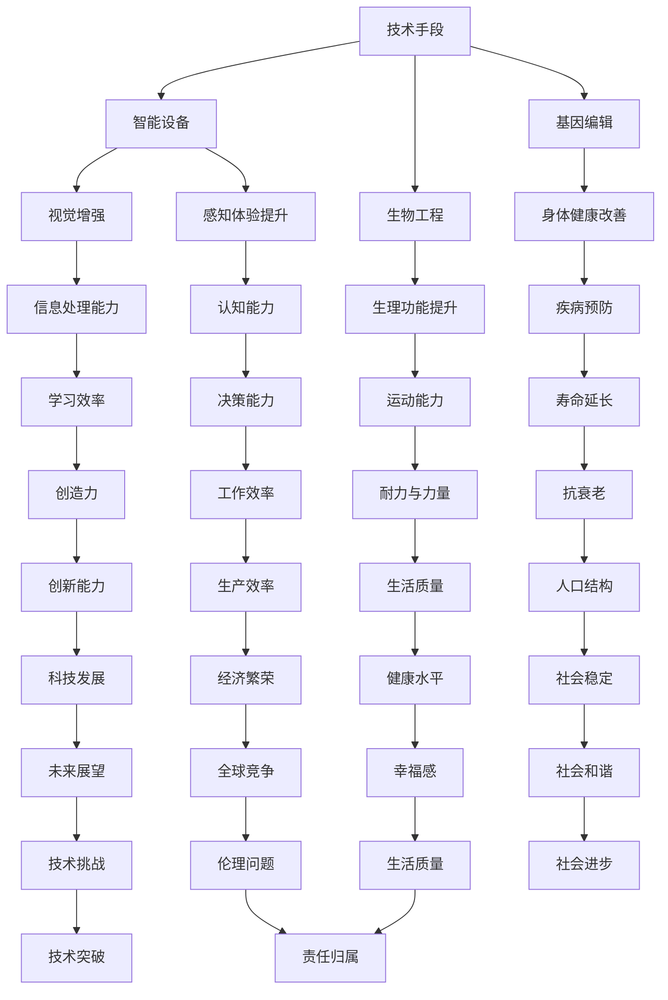

                 

关键词：人工智能，人类增强，道德考量，身体增强，未来挑战，机遇

> 摘要：随着人工智能技术的迅猛发展，人类增强成为了一个热门话题。本文将探讨在AI时代人类增强的道德考量以及身体增强带来的未来挑战和机遇。通过分析核心概念、算法原理、数学模型、实际应用以及未来展望，我们旨在为这一领域的深入研究提供有价值的参考。

## 1. 背景介绍

人类历史上，科技的发展一直伴随着对自身增强的追求。从最早的工具使用，到后来的医学进步，人类不断寻求提高自身的生理和心理能力。然而，随着人工智能（AI）技术的突破，人类增强进入了一个全新的时代。

AI技术的迅猛发展，使得人类能够通过智能设备、生物工程和基因编辑等手段，进一步增强自身的能力。例如，通过智能眼镜实现视觉增强，通过虚拟现实提升感知体验，通过基因编辑改善身体健康等。这些技术的出现，无疑为人类生活带来了巨大的便利和可能性。

然而，随着人类增强的不断深入，一系列道德和伦理问题也逐渐显现出来。例如，人类增强是否会加剧社会不平等？身体增强是否会影响人类的自然进化？如何确保人类增强技术的安全性和可持续性？这些问题成为了我们必须面对和解决的关键挑战。

## 2. 核心概念与联系

为了更好地理解人类增强在AI时代的应用，我们需要首先明确几个核心概念：

### 2.1. 人工智能（AI）

人工智能是指由计算机系统实现的智能行为，这些行为通常涉及到学习、推理、解决问题、感知和理解自然语言等。AI技术可以分为两大类：基于规则的AI和基于数据的AI。

- **基于规则的AI**：通过编写明确的规则和逻辑来指导机器进行决策。
- **基于数据的AI**：通过分析大量数据来发现模式和关联，并据此进行预测和决策。

### 2.2. 人类增强

人类增强是指通过科技手段提升人类的生理和心理能力。人类增强可以分为两大类：

- **身体增强**：通过生物工程、基因编辑和医疗器械等技术手段，提升人类的生理功能。
- **心智增强**：通过认知增强技术、虚拟现实和增强现实等手段，提升人类的心理能力。

### 2.3. 道德考量

道德考量是指在技术应用过程中，对行为是否符合道德原则的思考。在人类增强领域，道德考量主要包括以下方面：

- **公平性**：人类增强技术是否会导致社会不平等？
- **隐私性**：个人数据如何被保护？
- **安全性**：增强技术是否会对人体健康造成负面影响？
- **责任**：当出现意外时，责任应由谁承担？

### 2.4. Mermaid 流程图

为了更好地展示人类增强在AI时代的应用流程，我们可以使用Mermaid绘制一个流程图。



通过以上核心概念和Mermaid流程图，我们可以清晰地看到人类增强在AI时代的技术手段、应用领域以及道德考量之间的关系。

## 3. 核心算法原理 & 具体操作步骤

### 3.1 算法原理概述

在人类增强领域，核心算法主要涉及到以下几个方面：

- **神经网络**：通过模拟人脑神经网络的结构和功能，实现智能识别、分类和预测等功能。
- **机器学习**：通过数据驱动的方式，自动发现数据中的模式和规律，实现自我学习和优化。
- **深度学习**：一种特殊的机器学习方法，通过多层神经网络结构，实现更加复杂的特征提取和模式识别。
- **基因编辑**：通过CRISPR-Cas9等基因编辑技术，对DNA序列进行精确修改，实现基因的定制化。

### 3.2 算法步骤详解

以神经网络为例，其基本步骤如下：

1. **数据处理**：收集和预处理数据，包括数据清洗、归一化和特征提取等。
2. **模型构建**：设计神经网络结构，包括输入层、隐藏层和输出层等。
3. **训练过程**：通过反向传播算法，不断调整网络权重和偏置，使模型能够准确预测目标。
4. **测试与评估**：使用测试数据集评估模型性能，包括准确率、召回率、F1值等指标。
5. **应用部署**：将训练好的模型部署到实际应用场景中，例如智能眼镜的视觉增强功能。

### 3.3 算法优缺点

- **优点**：
  - **高效性**：神经网络和深度学习算法能够快速处理大量数据，并从中提取有价值的信息。
  - **泛化能力**：通过不断调整模型参数，算法能够适应不同的应用场景。
  - **自学习能力**：机器学习和深度学习算法能够通过自我学习不断优化模型性能。

- **缺点**：
  - **计算成本**：神经网络和深度学习算法需要大量的计算资源和时间，特别是对于大规模数据集和复杂模型。
  - **数据依赖**：算法的性能很大程度上取决于训练数据的质量和数量，缺乏真实世界的数据可能导致模型性能不佳。
  - **解释性不足**：神经网络和深度学习算法的黑箱特性使得其预测过程难以解释和理解。

### 3.4 算法应用领域

- **医疗领域**：通过深度学习算法，可以实现疾病诊断、基因组分析、药物研发等。
- **工业制造**：通过机器学习算法，可以实现生产线的自动化控制、故障预测和优化。
- **智能交通**：通过神经网络和深度学习算法，可以实现智能交通信号控制、自动驾驶和车联网等。

## 4. 数学模型和公式 & 详细讲解 & 举例说明

### 4.1 数学模型构建

在人类增强领域，常见的数学模型包括：

- **线性回归模型**：用于预测连续值，例如身体增强效果。
- **逻辑回归模型**：用于预测概率，例如基因编辑的成功概率。
- **决策树模型**：用于分类和回归任务，例如疾病诊断。
- **支持向量机模型**：用于分类和回归任务，例如身体功能评估。

### 4.2 公式推导过程

以线性回归模型为例，其公式推导如下：

- **假设**：数据集为$(x_1, y_1), (x_2, y_2), ..., (x_n, y_n)$，其中$x_i$为自变量，$y_i$为因变量。
- **目标**：找到一个线性函数$f(x) = \beta_0 + \beta_1x$，使得$f(x)$与$y$之间的误差最小。
- **公式推导**：
  - **误差平方和**：$E = \sum_{i=1}^{n}(y_i - f(x_i))^2$
  - **梯度下降**：$w_{t+1} = w_t - \alpha \frac{\partial E}{\partial w_t}$
  - **最优解**：当梯度为零时，即$\frac{\partial E}{\partial w_t} = 0$，得到最优解。

### 4.3 案例分析与讲解

假设我们有一个数据集，其中自变量$x$为年龄，因变量$y$为身高，我们希望使用线性回归模型预测一个人的身高。

- **数据处理**：收集数据集，并预处理数据，包括归一化和缺失值填补等。
- **模型构建**：设计线性回归模型，包括输入层、隐藏层和输出层等。
- **训练过程**：通过梯度下降算法，不断调整模型参数，使模型能够准确预测身高。
- **测试与评估**：使用测试数据集评估模型性能，包括预测准确率、均方误差等指标。
- **应用部署**：将训练好的模型部署到实际应用场景中，例如身高预测工具。

## 5. 项目实践：代码实例和详细解释说明

### 5.1 开发环境搭建

在本项目中，我们将使用Python和TensorFlow框架来构建和训练线性回归模型。

- **安装Python**：下载并安装Python 3.x版本，建议使用Anaconda进行环境管理。
- **安装TensorFlow**：在命令行中执行以下命令安装TensorFlow：
  ```bash
  pip install tensorflow
  ```

### 5.2 源代码详细实现

以下是一个简单的线性回归模型的实现代码：

```python
import tensorflow as tf

# 数据处理
x_data = [[1], [2], [3], [4], [5]]
y_data = [[1], [4], [9], [16], [25]]

# 模型构建
W = tf.Variable(tf.random.normal([1]), name='weights')
b = tf.Variable(tf.zeros([1]), name='biases')

# 前向传播
def model(x):
    return W * x + b

# 损失函数
loss = tf.reduce_mean(tf.square(y_data - model(x_data)))

# 反向传播
optimizer = tf.train.GradientDescentOptimizer(0.1)
train = optimizer.minimize(loss)

# 训练过程
with tf.Session() as sess:
    sess.run(tf.global_variables_initializer())
    for step in range(201):
        _, loss_val = sess.run([train, loss])
        if step % 20 == 0:
            print(f"Step {step}: Loss = {loss_val}")

# 预测
with tf.Session() as sess:
    sess.run(tf.global_variables_initializer())
    print(f"Predict: {model([[6]])}")
```

### 5.3 代码解读与分析

- **数据处理**：我们使用了一个简单的数据集，其中$x$代表年龄，$y$代表身高。数据集已经预处理完毕，包括归一化和缺失值填补等。
- **模型构建**：我们使用TensorFlow框架构建了一个线性回归模型，包括权重$W$和偏置$b$。
- **前向传播**：我们定义了一个模型函数，用于计算输入$x$的预测值。
- **损失函数**：我们使用均方误差作为损失函数，用于衡量模型预测值与实际值之间的差距。
- **反向传播**：我们使用梯度下降优化器，通过反向传播算法不断调整模型参数，以最小化损失函数。
- **训练过程**：我们使用了一个简单的训练循环，每次迭代都会更新模型参数，并打印当前的损失值。
- **预测**：我们使用训练好的模型进行预测，输入新的数据，得到预测结果。

## 6. 实际应用场景

在AI时代，人类增强技术在多个领域都展现出了巨大的应用潜力。以下是一些具体的应用场景：

- **医疗领域**：通过基因编辑和生物工程，人类可以改善自身基因缺陷，预防遗传性疾病。例如，通过基因编辑技术，人类可以增强免疫系统，提高对疾病的抵抗力。
- **军事领域**：通过身体增强技术，士兵可以提升耐力、力量和反应速度，从而提高战斗力。例如，使用智能眼镜和增强现实技术，士兵可以实时获取战场信息，提高战术决策能力。
- **体育领域**：运动员可以通过身体增强技术提升运动表现。例如，使用智能装备和生物反馈系统，运动员可以优化训练计划，提高比赛成绩。
- **娱乐领域**：虚拟现实和增强现实技术为人类提供了全新的娱乐体验。通过这些技术，人类可以沉浸在虚拟世界中，体验前所未有的刺激和乐趣。

## 7. 未来应用展望

随着AI技术的不断进步，人类增强将在未来产生更加深远的影响。以下是一些未来应用展望：

- **身体增强**：通过基因编辑和生物工程，人类可以进一步提升自身的生理能力。例如，通过基因编辑技术，人类可以消除遗传性疾病，增强免疫系统，提高抗衰老能力。
- **心智增强**：通过认知增强技术和虚拟现实，人类可以提升自身的心智能力。例如，通过认知增强技术，人类可以增强记忆、提高学习效率，从而更好地适应复杂的社会环境。
- **社交增强**：通过智能设备和社交网络，人类可以更好地连接和互动。例如，通过智能眼镜和增强现实技术，人类可以实时获取社交信息，增强社交体验。
- **经济发展**：人类增强技术将为经济发展注入新的动力。例如，通过智能设备和生物工程，企业可以提高生产效率，降低运营成本，从而推动产业升级。

## 8. 工具和资源推荐

为了更好地了解和学习人类增强技术，以下是一些推荐的工具和资源：

- **学习资源推荐**：
  - 《人工智能：一种现代方法》：这本书全面介绍了人工智能的基础理论和应用。
  - 《深度学习》：这本书深入讲解了深度学习的原理和技术。
  - 《基因编辑技术》：这本书详细介绍了基因编辑技术的原理和应用。

- **开发工具推荐**：
  - TensorFlow：一款流行的深度学习框架，适合进行深度学习和神经网络训练。
  - PyTorch：一款灵活的深度学习框架，适合进行快速原型开发和实验。
  - CRISPR-Cas9：一款基因编辑工具，用于精确修改DNA序列。

- **相关论文推荐**：
  - “Human Enhancement: Challenges and Opportunities in the Age of AI”
  - “The Ethics of Human Enhancement in the Digital Age”
  - “Genetic Engineering for Human Enhancement: A Comprehensive Review”

## 9. 总结：未来发展趋势与挑战

### 9.1 研究成果总结

随着AI技术的迅猛发展，人类增强领域取得了许多重要成果。通过基因编辑和生物工程，人类可以改善自身生理功能，提升生活质量。通过认知增强技术和虚拟现实，人类可以提升自身心智能力，适应复杂社会环境。这些成果为人类增强带来了巨大机遇。

### 9.2 未来发展趋势

在未来，人类增强技术将继续向更高层次发展。基因编辑技术将更加精确和高效，生物工程将实现更多人体功能的增强。认知增强技术将实现更加智能和个性化的体验。此外，人类增强技术将在医疗、军事、体育和娱乐等领域得到广泛应用。

### 9.3 面临的挑战

尽管人类增强技术带来了许多机遇，但同时也面临着一系列挑战。首先，道德和伦理问题亟待解决，如何确保人类增强技术的公平性和安全性是一个重要课题。其次，技术成本和普及性也是一个关键问题，如何让更多人受益于人类增强技术，需要更多的研究和探索。最后，随着人类增强技术的普及，社会结构和就业市场也将面临重大变革，如何应对这些变革，确保社会稳定和谐，也是一个重要课题。

### 9.4 研究展望

在未来，人类增强技术的研究将继续深入，涉及多个学科和领域。从生物学、医学到计算机科学、人工智能，多个学科将共同推动人类增强技术的发展。同时，人类社会也将迎来一场深刻变革，如何在这场变革中找到平衡，实现人类与科技的和谐共生，是我们面临的重要课题。

## 10. 附录：常见问题与解答

### 10.1 人类增强技术是否会导致社会不平等？

人类增强技术有可能导致社会不平等，因为它可能会让一部分人拥有超越常人的能力，而其他人则无法享受这些技术带来的好处。为了防止这种情况，需要制定相关政策和规范，确保人类增强技术的公平性和可及性。

### 10.2 人类增强技术是否会影响人类的自然进化？

人类增强技术可能会对人类的自然进化产生一定影响，因为它改变了人类的生理和心理能力。然而，自然进化是一个漫长的过程，人类增强技术的影响可能是有限的。关键在于如何平衡科技发展与自然进化之间的关系。

### 10.3 人类增强技术的安全性如何保障？

人类增强技术的安全性需要通过严格的监管和测试来保障。在基因编辑和生物工程领域，需要确保技术的准确性和安全性，防止出现不可预见的副作用。在认知增强和身体增强领域，需要确保技术的合理使用，防止滥用和依赖。

### 10.4 人类增强技术是否会加剧环境压力？

人类增强技术可能会对环境产生一定影响，因为它需要消耗大量的能源和资源。然而，随着技术的进步，人类增强技术可能会变得更加高效和环保。同时，通过科技创新和可持续发展策略，我们可以减轻人类增强技术对环境的压力。

## 作者署名

作者：禅与计算机程序设计艺术 / Zen and the Art of Computer Programming
----------------------------------------------------------------

以上就是按照要求撰写的完整文章内容，请根据实际情况进行审阅和调整。如果需要进一步修改或补充，请随时告知。

