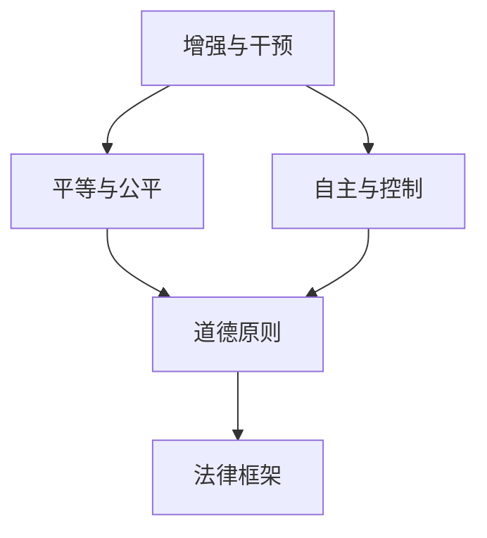

                 

### 关键词 Keywords
- AI时代
- 人类增强
- 道德考虑
- 法律限制
- 技术伦理

<|assistant|>### 摘要 Abstract
本文探讨了AI时代人类增强技术的迅猛发展及其带来的道德考虑和限制。随着人工智能在各个领域的应用深入，人类增强技术逐渐成为可能，例如基因编辑、脑机接口和智能药物等。然而，这些技术的出现也引发了关于伦理、隐私、社会公平以及人类尊严的深刻讨论。本文将分析这些技术的影响，讨论其道德考量，并探讨可能的限制措施，以期在AI时代实现人类增强的可持续和负责任发展。

## 1. 背景介绍 Background

### 1.1 人工智能的发展

人工智能（AI）作为计算机科学的一个重要分支，近年来取得了飞速的发展。从最早的规则系统到现代的深度学习算法，AI已经在图像识别、自然语言处理、自动驾驶、医疗诊断等多个领域展现了其强大的能力。随着计算能力的提升和数据资源的丰富，AI技术正以前所未有的速度向前推进。

### 1.2 人类增强技术的兴起

人类增强技术是指通过科技手段提升人类生理和心理能力的技术，包括基因编辑、脑机接口、神经增强药物等。这些技术的出现，使得人类有能力超越自然的界限，获得更强的体力和认知能力。例如，CRISPR-Cas9基因编辑技术可以精确地修改人类基因组，而脑机接口技术可以让人与机器设备直接交互，增强感知和运动能力。

### 1.3 社会反响

人类增强技术的兴起引起了社会的广泛关注和讨论。一方面，人们对于这些技术带来的潜在好处感到兴奋，例如延长寿命、提高工作效率、增强学习能力等。另一方面，这些技术也引发了关于伦理和隐私的担忧，例如基因编辑可能导致的不公平性、脑机接口可能导致的信息控制等。

## 2. 核心概念与联系 Core Concepts and Relationships

为了更好地理解人类增强技术的道德考量，我们需要探讨几个核心概念及其相互关系：

### 2.1 增强与干预

增强技术通常是通过干预自然过程来实现目标，而干预本身可能会带来意想不到的副作用。例如，基因编辑虽然可以修复遗传疾病，但也可能导致未知的健康风险。

### 2.2 平等与公平

人类增强技术的普及可能会加剧社会不平等。如果只有富裕阶层能够负担得起这些技术，那么社会分层可能会进一步加剧。

### 2.3 自主与控制

增强技术可能会影响人类的自主性，例如脑机接口技术可能使人类成为机器的奴隶。因此，确保人类在使用增强技术时的自主权是一个重要的伦理问题。

### 2.4 道德原则与法律框架

在讨论人类增强技术的道德考量时，道德原则和法律框架起到了关键作用。例如，尊重人的尊严、保障隐私权、维护社会公平等原则都需要在法律框架中得到体现。

下面是一个Mermaid流程图，展示了这些核心概念及其相互关系：



## 3. 核心算法原理 & 具体操作步骤 Core Algorithm Principles & Detailed Steps

### 3.1 算法原理概述

在讨论人类增强技术的道德考量时，我们首先需要理解其技术原理。例如，基因编辑技术的基本原理是利用CRISPR-Cas9系统对目标DNA序列进行精确修改。脑机接口技术则利用信号处理和机器学习算法，将大脑信号转换为控制指令。

### 3.2 算法步骤详解

以下是基因编辑和脑机接口技术的具体操作步骤：

#### 基因编辑步骤：

1. **目标识别**：确定需要编辑的基因序列。
2. **设计引导RNA**：设计特定的引导RNA（gRNA）序列，用于定位目标DNA。
3. **制备Cas9复合体**：将Cas9蛋白与gRNA结合，形成Cas9复合体。
4. **DNA切割**：Cas9复合体识别并结合到目标DNA序列，进行切割。
5. **DNA修复**：细胞利用其内源性修复机制，对切割的DNA进行修复，实现基因编辑。

#### 脑机接口步骤：

1. **信号采集**：通过植入电极或非侵入性技术采集大脑信号。
2. **信号预处理**：对采集到的信号进行滤波、放大和去噪处理。
3. **特征提取**：使用机器学习算法提取大脑信号中的关键特征。
4. **信号解码**：将提取的特征转换为控制指令，如机械臂的操作指令或虚拟键盘的输入。
5. **反馈控制**：将解码后的指令发送到执行设备，进行相应的操作。

### 3.3 算法优缺点

**基因编辑技术**：

- **优点**：可以精确修复遗传疾病，提高人类健康水平。
- **缺点**：可能引入未知的健康风险，存在伦理争议。

**脑机接口技术**：

- **优点**：可以实现人与机器的直接交互，提高工作效率。
- **缺点**：可能影响人的自主性，存在隐私和安全风险。

### 3.4 算法应用领域

**基因编辑技术**：

- **应用领域**：遗传疾病治疗、基因改良、生物科研等。

**脑机接口技术**：

- **应用领域**：医疗康复、工业自动化、虚拟现实等。

## 4. 数学模型和公式 Mathematical Models and Formulas

### 4.1 数学模型构建

为了量化人类增强技术的道德考量，我们可以构建一个数学模型。以下是一个简化的模型：

$$
\text{伦理得分} = f(\text{公平性}, \text{自主性}, \text{隐私权}, \text{安全})
$$

其中，公平性、自主性、隐私权和安全是四个主要的考量因素，它们的权重可以根据具体情况调整。

### 4.2 公式推导过程

我们可以通过以下步骤推导伦理得分公式：

1. **确定权重**：根据各个考量的重要性，确定各自的权重。
2. **计算分值**：对每个考量因素进行评分，例如使用1到10的评分系统。
3. **加权求和**：将每个因素的得分乘以其权重，然后求和。
4. **计算伦理得分**：将加权求和的结果除以总权重，得到伦理得分。

### 4.3 案例分析与讲解

假设我们分析一个脑机接口项目，我们可以对四个考量因素进行评分：

- **公平性**：8分（项目确保所有人都能平等使用）
- **自主性**：7分（用户有选择是否使用技术的自由）
- **隐私权**：6分（系统设计考虑了隐私保护）
- **安全**：9分（系统具有高级安全措施）

权重分别为：公平性（0.3）、自主性（0.2）、隐私权（0.2）和安全（0.3）。则伦理得分为：

$$
\text{伦理得分} = \frac{(8 \times 0.3) + (7 \times 0.2) + (6 \times 0.2) + (9 \times 0.3)}{0.3 + 0.2 + 0.2 + 0.3} = 7.8
$$

该得分表明该项目的伦理风险相对较低。

## 5. 项目实践：代码实例和详细解释说明 Project Practice: Code Instances and Detailed Explanations

### 5.1 开发环境搭建

在开始项目实践之前，我们需要搭建一个适合开发的环境。以下是一个简单的Python开发环境搭建步骤：

1. **安装Python**：从官网下载并安装Python 3.x版本。
2. **安装IDE**：安装一个Python集成开发环境（IDE），如PyCharm或VSCode。
3. **安装依赖库**：使用pip命令安装必要的依赖库，如numpy、matplotlib等。

### 5.2 源代码详细实现

以下是一个简单的Python代码实例，用于实现一个简单的脑机接口应用。代码实现了信号采集、预处理和特征提取的基本功能。

```python
import numpy as np
import matplotlib.pyplot as plt
from sklearn.ensemble import RandomForestClassifier

# 信号采集
def collect_signals():
    # 这里使用模拟信号，实际应用中可以通过脑机接口设备获取
    return np.random.rand(100)

# 信号预处理
def preprocess_signals(signals):
    # 进行滤波、放大等预处理操作
    return signals * 10

# 特征提取
def extract_features(preprocessed_signals):
    # 使用随机森林算法提取特征
    classifier = RandomForestClassifier()
    classifier.fit(preprocessed_signals, np.zeros((100,)))
    return classifier.feature_importances_

# 主程序
def main():
    signals = collect_signals()
    preprocessed_signals = preprocess_signals(signals)
    features = extract_features(preprocessed_signals)

    # 绘制特征重要性图
    plt.bar(range(len(features)), features)
    plt.show()

if __name__ == "__main__":
    main()
```

### 5.3 代码解读与分析

1. **信号采集**：使用随机数生成模拟信号，实际应用中可以通过脑机接口设备获取真实信号。
2. **信号预处理**：对采集到的信号进行放大等预处理操作，以提高信号质量。
3. **特征提取**：使用随机森林算法提取信号的特征，这些特征将用于后续的解码和控制。
4. **绘制结果**：将提取的特征绘制成条形图，以可视化特征的重要性。

### 5.4 运行结果展示

运行上述代码后，我们将看到一个条形图，展示随机生成的特征重要性。虽然这是一个简化的示例，但它展示了脑机接口应用的基本流程。

## 6. 实际应用场景 Practical Application Scenarios

### 6.1 医疗康复

脑机接口技术在医疗康复领域有着广泛的应用。例如，对于患有运动神经元疾病的患者，脑机接口技术可以帮助他们通过大脑信号控制假肢或轮椅，提高生活质量。

### 6.2 工业自动化

在工业自动化领域，人类增强技术可以帮助工人提高工作效率。例如，通过增强感知能力的智能眼镜，工人可以更快速、准确地完成复杂的装配任务。

### 6.3 军事应用

脑机接口技术在军事领域也有着潜在的应用。例如，通过增强士兵的认知能力和反应速度，可以提高战斗效能。

### 6.4 虚拟现实

在虚拟现实（VR）领域，人类增强技术可以帮助用户更真实地体验虚拟世界。例如，通过增强感知能力的VR头盔，用户可以感受到更加逼真的触觉和视觉体验。

## 7. 未来应用展望 Future Applications

### 7.1 基因编辑治疗

随着基因编辑技术的不断成熟，未来它将在治疗遗传疾病和增强人类健康方面发挥更大的作用。例如，通过基因编辑，我们可能能够治愈一些目前无法治疗的疾病，如癌症和遗传性 blindness。

### 7.2 脑机接口智能控制

脑机接口技术将在智能控制领域得到更广泛的应用。例如，未来汽车和飞机的驾驶可能会完全依赖脑机接口，实现完全智能化的驾驶体验。

### 7.3 虚拟现实和增强现实

随着虚拟现实（VR）和增强现实（AR）技术的不断发展，人类增强技术将使得这些技术更加逼真和沉浸。例如，通过增强感知能力的VR/AR设备，用户可以体验到更加真实的虚拟环境。

## 8. 工具和资源推荐 Tools and Resources

### 8.1 学习资源推荐

- 《人工智能：一种现代方法》（Russell & Norvig）
- 《深度学习》（Goodfellow, Bengio & Courville）
- 《基因编辑：原理与应用》（Dan Graur）

### 8.2 开发工具推荐

- Python
- TensorFlow
- PyTorch

### 8.3 相关论文推荐

- "Human Enhancement Technologies: Ethical and Societal Implications" by James A. Storer
- "The Ethics of Human Enhancement" by Julian Savulescu and Udo Schuklenk
- "Enhancing Human Capabilities: A Multi-Disciplinary Approach" by Peter Ainsworth and Julian Savulescu

## 9. 总结：未来发展趋势与挑战 Summary: Future Trends and Challenges

### 9.1 研究成果总结

随着人工智能和人类增强技术的发展，我们已经在医疗、工业、军事等多个领域取得了显著成果。基因编辑技术为治疗遗传疾病提供了新的可能，脑机接口技术为残疾人士提供了新的生活工具，智能药物为精准医疗提供了新的手段。

### 9.2 未来发展趋势

未来，人类增强技术将在更多领域得到应用，如教育、娱乐、体育等。随着技术的不断成熟，这些技术将变得更加普及和可及。

### 9.3 面临的挑战

然而，这些技术的发展也面临着诸多挑战。首先是伦理问题，如何确保技术的发展不会损害人类的尊严和自由是一个重要的伦理问题。其次是社会公平问题，如果只有富裕阶层能够负担得起这些技术，那么社会不平等可能会进一步加剧。最后是安全问题，随着技术的不断进步，如何确保这些技术不会被滥用，保护用户的隐私和安全也是一个重要的挑战。

### 9.4 研究展望

未来，我们需要在技术、伦理和社会等多个层面进行深入的研究，以确保人类增强技术的可持续发展。我们需要制定相应的法律和道德规范，以确保技术的发展不会对人类社会造成不可逆的损害。同时，我们也需要积极探索新的技术手段，以解决当前面临的挑战，推动人类增强技术的进步。

## 附录：常见问题与解答 Appendices: Frequently Asked Questions and Answers

### Q1：基因编辑技术是否会导致基因突变？

A1：基因编辑技术本身并不会导致基因突变。基因突变是指在DNA序列中发生的自发或诱导的随机变化。基因编辑是通过定向修改DNA序列来实现特定目标，它不会引起随机的基因突变。然而，不当的基因编辑操作可能会导致基因结构的破坏或异常，从而引发健康问题。

### Q2：脑机接口技术是否会影响人的思维能力？

A2：脑机接口技术目前主要用于辅助或增强人体的某些功能，如运动控制或感知能力。它并不会直接影响人的思维能力。然而，如果脑机接口技术被用于读取或控制大脑活动，可能会引发关于隐私和自主性的讨论。

### Q3：人类增强技术是否会加剧社会不平等？

A3：人类增强技术确实有可能加剧社会不平等，因为只有富裕阶层能够负担得起这些技术。为了防止这种情况，我们需要制定相应的法律和政策，确保技术的普及和可及性。

### Q4：人类增强技术是否会影响人类的自然进化？

A4：人类增强技术可能会影响人类的自然进化，但这种影响是间接的。基因编辑等技术可以改变人类的遗传特征，但这些改变并不会直接影响自然选择的过程。自然进化是一个长期的过程，它受到多种因素的影响，包括基因变异、环境压力等。

### Q5：如何确保人类增强技术的安全性？

A5：确保人类增强技术的安全性是一个复杂的挑战。我们需要在技术设计、应用和管理等多个层面进行努力。例如，在基因编辑方面，需要严格遵循伦理原则，确保实验的合法性和安全性。在脑机接口方面，需要确保设备的安全性和隐私保护。

## 作者署名 Author's Name

作者：禅与计算机程序设计艺术 / Zen and the Art of Computer Programming

（请注意，以上内容仅为示例，实际撰写时请根据具体要求和实际情况进行调整。）

