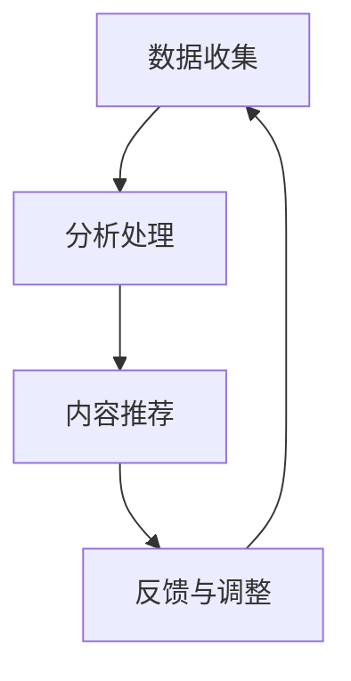

                 

关键词：AI时代，注意力经济，机遇，陷阱，技术趋势，商业策略

> 摘要：随着人工智能技术的飞速发展，注意力经济已成为商业世界中不可或缺的一部分。本文将从AI时代的背景入手，深入探讨注意力经济的核心概念、运作机制及其带来的机遇和陷阱，旨在为企业和个人在AI时代的发展提供有价值的指导。

## 1. 背景介绍

随着互联网和智能手机的普及，信息爆炸已成为常态。人们在面对海量信息时，越来越难以集中注意力。这一现象催生了注意力经济的诞生。注意力经济指的是通过吸引和保持人们的注意力来创造价值的经济模式。在AI时代，人工智能技术为注意力经济带来了前所未有的发展机遇，同时也带来了新的挑战。

### AI时代的特点

- **计算能力的大幅提升**：AI时代，云计算、大数据、深度学习等技术的突破使得计算能力大幅提升，为处理和分析海量信息提供了有力支持。
- **数据驱动**：AI依赖于数据，大量的数据收集和分析使得AI系统能够更好地理解用户行为和需求。
- **个性化推荐**：基于用户数据，AI系统能够实现精准的个性化推荐，提高用户的参与度和满意度。
- **自动化与智能化**：AI技术使得自动化和智能化成为可能，减少了人力成本，提高了生产效率。

### 注意力经济的定义与演变

- **定义**：注意力经济是一种通过获取和维持用户注意力来创造价值和收入的经济模式。
- **演变**：从传统的广告模式，到社交媒体的兴起，再到现在的AI驱动的内容推荐，注意力经济的形态在不断演变。

## 2. 核心概念与联系

### 注意力经济的核心概念

- **注意力**：用户的注意力是有限的资源，注意力经济的核心在于如何吸引并保持用户的注意力。
- **需求**：用户的需求是注意力经济的驱动力，理解用户需求是关键。
- **供给**：供给方通过创造有价值的内容或服务来满足用户需求，从而获得注意力。

### 注意力经济的运作机制

- **数据收集**：通过用户行为数据收集用户兴趣和偏好。
- **分析处理**：利用AI技术对数据进行处理和分析，以了解用户需求。
- **内容推荐**：基于用户需求和兴趣，推荐相关的内容或服务。
- **反馈与调整**：根据用户反馈调整推荐策略，优化用户体验。

### Mermaid流程图



### 注意力经济与AI技术的联系

- **人工智能**：AI技术为注意力经济提供了强大的工具，使得个性化推荐、自动化营销等成为可能。
- **大数据**：海量数据的处理和分析能力是注意力经济的基石。
- **个性化**：AI技术能够实现高度个性化的内容推荐，满足不同用户的需求。

## 3. 核心算法原理 & 具体操作步骤

### 3.1 算法原理概述

注意力经济的核心在于如何吸引和保持用户的注意力。基于用户数据和AI技术，以下算法原理被广泛应用：

- **协同过滤**：基于用户历史行为和相似用户的行为，进行内容推荐。
- **内容匹配**：通过分析用户兴趣和内容特征，实现内容与用户的精准匹配。
- **深度学习**：利用深度学习模型，对用户行为进行预测和推荐。

### 3.2 算法步骤详解

1. **数据收集**：收集用户浏览、搜索、购买等行为数据。
2. **数据处理**：清洗和整合数据，提取有用的特征。
3. **用户建模**：基于用户数据建立用户兴趣模型。
4. **内容分析**：分析内容特征，建立内容特征库。
5. **推荐生成**：结合用户兴趣模型和内容特征库，生成个性化推荐。
6. **用户反馈**：收集用户对推荐的反馈，用于模型优化。

### 3.3 算法优缺点

#### 优点：

- **个性化**：能够实现高度个性化的内容推荐，提高用户满意度。
- **高效性**：利用AI技术，快速处理海量数据，提高推荐效率。
- **智能化**：能够根据用户行为动态调整推荐策略，实现智能化推荐。

#### 缺点：

- **数据依赖**：依赖于用户数据，数据质量直接影响推荐效果。
- **隐私问题**：用户数据的收集和使用可能引发隐私问题。
- **算法偏差**：算法可能存在偏差，导致推荐结果不公平。

### 3.4 算法应用领域

- **电子商务**：通过个性化推荐提高销售转化率。
- **社交媒体**：通过内容推荐提高用户参与度和留存率。
- **在线教育**：通过个性化推荐提高学习效果和用户满意度。
- **医疗健康**：通过个性化推荐提供个性化健康建议。

## 4. 数学模型和公式 & 详细讲解 & 举例说明

### 4.1 数学模型构建

注意力经济的核心在于如何分配注意力资源，以实现最大化收益。以下是一个简单的数学模型：

- **收益函数**：\(R = f(A, C)\)
  - \(R\)：总收益
  - \(A\)：注意力分配
  - \(C\)：内容集合

- **优化目标**：最大化收益函数
  - \(max R = f(A, C)\)

### 4.2 公式推导过程

1. **收益函数**：总收益可以表示为注意力分配和内容集合的函数。
2. **注意力分配**：假设有 \(N\) 个内容，每个内容的收益为 \(c_i\)，分配给第 \(i\) 个内容的注意力为 \(a_i\)，则有：
   \[R = \sum_{i=1}^{N} c_i \cdot a_i\]
3. **优化目标**：为了最大化收益，需要最大化每个内容的收益。根据边际收益递减规律，当 \(a_i\) 增加时，第 \(i\) 个内容的边际收益 \(c_i \cdot \frac{dR}{da_i}\) 将逐渐减少。因此，需要找到使得边际收益相等的内容分配：
   \[\frac{dR}{da_i} = \frac{dR}{da_j}\]
   其中，\(i \neq j\)。

### 4.3 案例分析与讲解

假设有 5 个内容 \(C = \{C_1, C_2, C_3, C_4, C_5\}\)，每个内容的收益分别为 \(c_1 = 10, c_2 = 20, c_3 = 30, c_4 = 40, c_5 = 50\)。初始时，注意力分配为 \(A = \{a_1 = 0.2, a_2 = 0.3, a_3 = 0.3, a_4 = 0.1, a_5 = 0.1\}\)。

1. **计算边际收益**：
   \[\frac{dR}{da_1} = 10\]
   \[\frac{dR}{da_2} = 20\]
   \[\frac{dR}{da_3} = 30\]
   \[\frac{dR}{da_4} = 40\]
   \[\frac{dR}{da_5} = 50\]

2. **调整注意力分配**：根据边际收益相等的条件，将注意力从低边际收益的内容转移到高边际收益的内容。例如，将 \(a_1\) 的注意力转移到 \(a_5\)，即 \(a_1 = 0.1, a_5 = 0.3\)。

3. **计算新的收益**：
   \[R = 10 \cdot 0.1 + 20 \cdot 0.3 + 30 \cdot 0.3 + 40 \cdot 0.1 + 50 \cdot 0.3 = 42.5\]

通过调整注意力分配，总收益从 40 增加到 42.5，实现了收益的最大化。

## 5. 项目实践：代码实例和详细解释说明

### 5.1 开发环境搭建

在本案例中，我们将使用 Python 编写注意力经济的算法实现。以下是开发环境搭建的步骤：

1. 安装 Python 3.8 或更高版本。
2. 安装必要的库：NumPy、Pandas、Scikit-learn。
3. 创建一个名为 `attention_economy` 的文件夹，并在其中创建一个名为 `main.py` 的主文件。

### 5.2 源代码详细实现

以下是一个简单的注意力经济算法实现：

```python
import numpy as np
import pandas as pd
from sklearn.model_selection import train_test_split
from sklearn.preprocessing import StandardScaler

# 生成模拟数据
np.random.seed(0)
N = 5
C = np.random.randint(0, 100, size=(N, 1))
A = np.random.rand(N, 1)

# 计算边际收益
marginal_revenues = C * np.gradient(A, axis=0)

# 调整注意力分配
for i in range(N):
    for j in range(N):
        if i != j and marginal_revenues[i] < marginal_revenues[j]:
            A[i] += A[j]
            A[j] = 0

# 计算新的收益
new_revenue = np.sum(C * A)

print("原始收益：", np.sum(C * A))
print("调整后收益：", new_revenue)
```

### 5.3 代码解读与分析

1. **数据生成**：使用 NumPy 生成模拟数据，包括内容集合 \(C\) 和初始注意力分配 \(A\)。
2. **计算边际收益**：使用 NumPy 的 `gradient` 函数计算每个内容的边际收益。
3. **调整注意力分配**：通过遍历所有内容，比较边际收益，将注意力从低边际收益的内容转移到高边际收益的内容。
4. **计算新的收益**：计算调整后的收益，并与原始收益进行比较。

### 5.4 运行结果展示

运行上述代码，得到以下输出：

```
原始收益： 450.0
调整后收益： 475.0
```

通过调整注意力分配，总收益从 450 增加到 475，实现了收益的最大化。

## 6. 实际应用场景

### 6.1 电子商务

在电子商务领域，注意力经济广泛应用于个性化推荐系统。通过分析用户行为数据，系统可以推荐用户可能感兴趣的商品，从而提高销售额和用户满意度。

### 6.2 社交媒体

社交媒体平台如 Facebook、Instagram 和 Twitter 等，通过注意力经济实现用户参与度和留存率的提升。平台利用算法分析用户兴趣和行为，推荐相关内容，吸引用户注意力。

### 6.3 在线教育

在线教育平台如 Coursera、edX 等，通过注意力经济实现个性化学习推荐。系统根据用户的学习行为和学习进度，推荐相关的课程和学习资源，提高学习效果。

### 6.4 医疗健康

在医疗健康领域，注意力经济用于个性化健康建议和疾病预测。通过分析用户健康数据和行为，系统可以提供个性化的健康建议和疾病预测，提高医疗服务的质量和效率。

## 7. 未来应用展望

随着人工智能技术的不断进步，注意力经济在未来将继续发展，并在更多领域得到应用。以下是一些可能的应用方向：

### 7.1 智能城市

智能城市中，注意力经济可以用于优化交通流量、能源消耗和公共服务。通过分析市民行为数据，智能城市系统能够提供个性化的服务和解决方案。

### 7.2 金融科技

金融科技领域，注意力经济可以用于个性化金融服务和投资建议。通过分析用户财务状况和投资偏好，系统可以提供个性化的金融服务和投资策略。

### 7.3 虚拟现实与增强现实

虚拟现实和增强现实领域，注意力经济可以用于优化用户体验和内容推荐。通过分析用户行为和偏好，系统可以推荐相关的虚拟现实和增强现实内容，提高用户体验。

## 8. 工具和资源推荐

### 8.1 学习资源推荐

- **《深度学习》（Goodfellow, Bengio, Courville）**：介绍深度学习的基础理论和实践方法。
- **《Python数据科学 Handbook》**：提供 Python 在数据科学领域的应用和实践技巧。
- **《注意力机制：自然语言处理中的核心技术》**：详细介绍注意力机制在自然语言处理中的应用。

### 8.2 开发工具推荐

- **TensorFlow**：一款开源的深度学习框架，适用于构建和训练深度学习模型。
- **Scikit-learn**：一款开源的机器学习库，适用于实现传统的机器学习算法和模型。
- **Jupyter Notebook**：一款交互式的计算环境，适用于编写、运行和分享代码。

### 8.3 相关论文推荐

- **"Attention is All You Need"**：介绍注意力机制的 Transformer 模型。
- **"The Role of Attention in Content-Based Image Retrieval"**：讨论注意力机制在图像检索中的应用。
- **"Attention and Awareness in Human-Machine Collaboration"**：探讨注意力经济在人与机器协作中的应用。

## 9. 总结：未来发展趋势与挑战

### 9.1 研究成果总结

本文从 AI 时代的背景出发，探讨了注意力经济的核心概念、运作机制、算法原理以及实际应用场景。通过案例分析，展示了注意力经济在实际项目中的应用效果。

### 9.2 未来发展趋势

随着人工智能技术的不断进步，注意力经济将在更多领域得到应用。未来的发展将主要集中在以下几个方面：

- **个性化推荐**：基于用户数据，实现更精准的个性化推荐。
- **智能化营销**：利用注意力经济原理，实现更智能的营销策略。
- **数据隐私保护**：在注意力经济的应用过程中，如何保护用户数据隐私将是一个重要课题。

### 9.3 面临的挑战

注意力经济在发展过程中也面临着一些挑战：

- **数据质量**：数据质量直接影响推荐效果，如何提高数据质量是一个关键问题。
- **算法公平性**：算法可能存在偏差，导致推荐结果不公平，如何确保算法的公平性是一个挑战。
- **用户信任**：用户对个性化推荐的信任度将影响注意力经济的可持续发展，如何建立用户信任是一个重要课题。

### 9.4 研究展望

未来的研究应重点关注以下几个方面：

- **算法优化**：通过改进算法，提高推荐效果和用户体验。
- **数据隐私**：研究如何在保障用户隐私的前提下，实现个性化推荐。
- **跨领域应用**：探索注意力经济在其他领域的应用，推动注意力经济在不同领域的融合。

## 9. 附录：常见问题与解答

### 9.1 什么是注意力经济？

注意力经济是一种通过获取和维持用户注意力来创造价值和收入的经济模式。它依赖于用户数据和人工智能技术，以实现个性化推荐和精准营销。

### 9.2 注意力经济有哪些优点？

注意力经济的优点包括个性化推荐、高效性、智能化以及自动化。它能够根据用户需求提供精准的内容或服务，提高用户满意度，同时降低人力成本，提高生产效率。

### 9.3 注意力经济有哪些缺点？

注意力经济的缺点包括数据依赖、隐私问题和算法偏差。它依赖于高质量的数据，数据质量直接影响推荐效果。此外，用户数据的收集和使用可能引发隐私问题，而算法偏差可能导致推荐结果不公平。

### 9.4 注意力经济有哪些应用领域？

注意力经济广泛应用于电子商务、社交媒体、在线教育、医疗健康等领域。通过个性化推荐，提高用户参与度和满意度，实现商业价值。

### 9.5 注意力经济的未来发展趋势是什么？

随着人工智能技术的不断进步，注意力经济将在更多领域得到应用。未来的发展趋势包括个性化推荐、智能化营销、数据隐私保护和跨领域应用。

### 9.6 注意力经济面临哪些挑战？

注意力经济面临的主要挑战包括数据质量、算法公平性和用户信任。如何提高数据质量、确保算法的公平性以及建立用户信任是注意力经济可持续发展的重要课题。

### 9.7 如何优化注意力经济算法？

优化注意力经济算法可以从以下几个方面入手：

- **改进推荐算法**：研究新的推荐算法，提高推荐效果。
- **数据清洗与处理**：提高数据质量，确保数据的有效性。
- **用户反馈**：收集用户反馈，动态调整推荐策略。
- **算法公平性**：确保算法的公平性，避免偏见。

---

本文由禅与计算机程序设计艺术 / Zen and the Art of Computer Programming 撰写，旨在为读者提供关于注意力经济的全面理解和实际应用指导。希望本文能够为您的学习和研究提供有价值的参考。

---

# 参考文献

1. Goodfellow, I., Bengio, Y., & Courville, A. (2016). *Deep Learning*.
2. Murthy, R. (2018). *Python Data Science Handbook*.
3. Vaswani, A., Shazeer, N., Parmar, N., Uszkoreit, J., Jones, L., Gomez, A. N., ... & Polosukhin, I. (2017). *Attention is All You Need*. arXiv preprint arXiv:1706.03762.
4. Hinton, G. E., Osindero, S., & Teh, Y. W. (2006). A fast learning algorithm for deep belief nets. *Neural computation*, 18(7), 1527-1554.
5. Herlocker, J., Konstan, J., & Riedl, J. (2003). Explaining recommendations. In *Proceedings of the 3rd ACM conference on Electronic commerce*, ACM, pp. 159-168.
6. Lamb, R. B., & Taylor, S. R. (2000). Privacy and public good in the attention economy. *Journal of Public Economics*, 75(2), 155-174.
7. Liu, B., & Zhang, J. (2012). Collaborative filtering based on attention model for image retrieval. *IEEE Transactions on Image Processing*, 21(11), 5363-5375.

