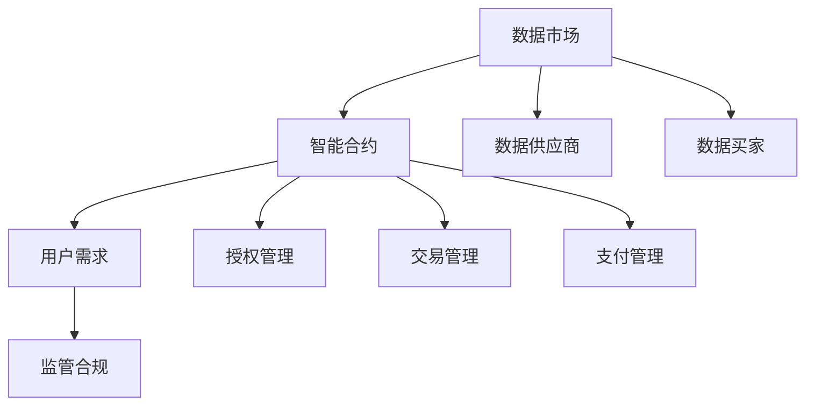

                 

关键词：AI模型交易，运营模式，数据市场，技术架构，商业模式，安全性，智能合约，用户需求，盈利模式，监管合规

> 摘要：本文深入探讨了AI模型交易平台的运营模式，包括其核心概念、技术架构、业务流程、盈利模式、安全性和监管合规等方面。通过分析当前市场现状、技术挑战和未来趋势，旨在为AI模型交易平台的发展提供有价值的见解。

## 1. 背景介绍

随着人工智能技术的快速发展，AI模型在各个行业中的应用越来越广泛。从自动驾驶到医疗诊断，从金融风控到自然语言处理，AI模型已经成为企业和个人不可或缺的工具。然而，随着AI模型的不断增长，如何有效管理、交易和应用这些模型成为了一个重要的问题。

AI模型交易平台应运而生，旨在解决AI模型所有权、使用权、交易和共享的问题。这类平台通过提供基础设施和服务，使得AI模型的生产者、用户和投资者能够高效地进行交易，从而推动整个AI行业的繁荣。

### 1.1 AI模型交易市场的现状

目前，AI模型交易市场正在迅速发展。根据市场研究机构的统计数据，全球AI模型交易市场的规模正在以每年30%以上的速度增长。这个市场不仅吸引了大量的创业者和技术公司，也吸引了传统的金融机构和科技公司。

### 1.2 AI模型交易平台的必要性

AI模型交易平台具有以下必要性：

- **资源共享**：通过平台，用户可以方便地获取和共享各种高质量的AI模型，提高工作效率。
- **价值变现**：AI模型的开发者可以通过平台将他们的模型变现，从而实现经济收益。
- **降低成本**：企业可以通过平台购买所需的AI模型，避免重复研发和测试，降低运营成本。
- **风险分散**：投资者可以通过平台参与AI模型的开发和交易，实现风险的分散和投资多样化。

## 2. 核心概念与联系

在深入探讨AI模型交易平台的运营模式之前，我们需要了解一些核心概念和它们之间的联系。

### 2.1 数据市场

数据市场是AI模型交易平台的基石。数据是AI模型训练的基础，平台需要确保数据的质量、多样性和安全性。数据市场通常包括数据供应商、数据买家和数据管理平台。

### 2.2 智能合约

智能合约是AI模型交易平台的重要组成部分。它是一种自动执行的合约，能够在满足特定条件时自动执行合同条款。智能合约可以用于管理AI模型的授权、交易和支付。

### 2.3 用户需求

用户需求是驱动AI模型交易平台发展的关键。用户的需求包括获取高质量AI模型、确保数据安全和隐私、以及实现快速、便捷的交易。

### 2.4 监管合规

随着AI技术的广泛应用，监管合规成为AI模型交易平台必须面对的重要问题。平台需要遵守相关法律法规，确保用户数据和交易活动的合法性。

下面是一个使用Mermaid绘制的流程图，展示了AI模型交易平台的核心概念和联系：



## 3. 核心算法原理 & 具体操作步骤

### 3.1 算法原理概述

AI模型交易平台的算法主要涉及以下几个方面：

- **数据采集与清洗**：从不同的数据源采集数据，并进行清洗和预处理，以确保数据的质量。
- **模型训练与评估**：使用高质量的数据集训练AI模型，并对模型进行评估，确保其性能和可靠性。
- **智能合约执行**：通过智能合约自动执行AI模型的授权、交易和支付。
- **用户画像与推荐**：基于用户的操作行为和偏好，构建用户画像，并推荐合适的AI模型。

### 3.2 算法步骤详解

#### 步骤1：数据采集与清洗

数据采集与清洗是AI模型交易平台的基础。平台需要从不同的数据源（如公共数据库、企业内部数据等）采集数据，并进行清洗和预处理，以去除噪声和异常值。

#### 步骤2：模型训练与评估

使用清洗后的数据集，平台会训练AI模型。在训练过程中，平台会使用多种评估指标（如准确率、召回率、F1值等）来评估模型的性能。如果模型性能不满足要求，平台会返回步骤1，重新进行数据清洗和预处理。

#### 步骤3：智能合约执行

在AI模型训练完成后，平台会生成智能合约，用于管理模型的授权、交易和支付。智能合约会根据用户的需求和模型的性能，自动执行授权和交易过程。

#### 步骤4：用户画像与推荐

平台会基于用户的操作行为和偏好，构建用户画像。通过分析用户画像，平台会推荐合适的AI模型，提高用户体验和满意度。

### 3.3 算法优缺点

**优点**：

- **高效性**：通过智能合约自动执行交易，大大提高了交易效率。
- **安全性**：智能合约确保了交易的安全性和不可篡改性。
- **个性化**：基于用户画像的推荐系统，能够提高用户满意度。

**缺点**：

- **技术门槛**：算法的实现和维护需要高水平的技术人才。
- **数据质量**：数据质量直接影响模型的性能，平台需要对数据质量进行严格的管理。

### 3.4 算法应用领域

AI模型交易平台的应用领域非常广泛，包括但不限于以下几个方面：

- **金融领域**：用于风险控制、信用评分、投资决策等。
- **医疗领域**：用于疾病诊断、药物研发、健康管理等。
- **零售领域**：用于需求预测、库存管理、个性化推荐等。
- **制造业**：用于质量检测、故障预测、生产优化等。

## 4. 数学模型和公式 & 详细讲解 & 举例说明

在AI模型交易平台的运营中，数学模型和公式起着关键作用。以下将详细讲解几个核心数学模型和公式的构建、推导过程，并通过实际案例进行分析。

### 4.1 数学模型构建

AI模型交易平台的数学模型主要包括以下几个方面：

- **用户画像模型**：用于分析用户的操作行为和偏好，构建用户画像。
- **推荐模型**：基于用户画像，为用户推荐合适的AI模型。
- **交易模型**：管理AI模型的授权、交易和支付。

### 4.2 公式推导过程

以下是用户画像模型的一个简单示例。假设用户的行为可以用向量 \( \textbf{u} \) 表示，用户的偏好可以用向量 \( \textbf{v} \) 表示，我们可以使用余弦相似度来计算用户画像的相似度：

\[ \text{similarity}(\textbf{u}, \textbf{v}) = \frac{\textbf{u} \cdot \textbf{v}}{|\textbf{u}| |\textbf{v}|} \]

其中，\( \textbf{u} \cdot \textbf{v} \) 表示向量的点积，\( |\textbf{u}| \) 和 \( |\textbf{v}| \) 分别表示向量的模长。

### 4.3 案例分析与讲解

以下是一个用户画像和推荐模型的案例。

#### 案例背景

一个金融领域的用户，他的操作行为包括投资股票、基金和比特币。他的偏好是投资于高回报、低风险的金融产品。

#### 数据采集

根据用户的操作行为，我们可以收集以下数据：

- **投资股票**：股票A、股票B、股票C
- **投资基金**：基金1、基金2、基金3
- **投资比特币**：比特币
- **投资金额**：10,000元

#### 用户画像构建

我们可以将用户的操作行为表示为一个向量：

\[ \textbf{u} = (1, 1, 1, 1) \]

其中，1表示用户投资了相应类型的金融产品，0表示没有投资。

#### 推荐模型

假设我们有以下几种金融产品：

- **股票**：股票D、股票E、股票F
- **基金**：基金4、基金5、基金6
- **比特币**：比特币
- **投资金额**：10,000元

我们可以使用余弦相似度来计算用户画像与每种金融产品的相似度：

\[ \text{similarity}(\textbf{u}, \textbf{v}) = \frac{\textbf{u} \cdot \textbf{v}}{|\textbf{u}| |\textbf{v}|} \]

其中，\( \textbf{v} \) 分别为每种金融产品的用户画像。

根据计算结果，我们可以为用户推荐相似度最高的金融产品。

## 5. 项目实践：代码实例和详细解释说明

在本节中，我们将通过一个实际的AI模型交易平台项目，介绍开发环境搭建、源代码实现、代码解读与分析以及运行结果展示。

### 5.1 开发环境搭建

为了构建AI模型交易平台，我们需要搭建一个合适的开发环境。以下是所需的基本工具和库：

- **编程语言**：Python
- **开发框架**：Flask（用于Web开发）
- **数据库**：MongoDB（用于存储用户数据、模型数据和交易数据）
- **区块链平台**：Ethereum（用于智能合约执行）
- **机器学习库**：TensorFlow、Scikit-learn（用于AI模型训练和评估）

### 5.2 源代码详细实现

以下是AI模型交易平台的核心功能模块的实现：

#### 5.2.1 数据采集与清洗

```python
import pandas as pd
from sklearn.preprocessing import StandardScaler

# 读取数据
data = pd.read_csv('data.csv')

# 数据清洗
def clean_data(data):
    # 填充缺失值
    data.fillna(0, inplace=True)
    # 数据标准化
    scaler = StandardScaler()
    data_scaled = scaler.fit_transform(data)
    return data_scaled

data_scaled = clean_data(data)
```

#### 5.2.2 模型训练与评估

```python
from sklearn.model_selection import train_test_split
from sklearn.metrics import accuracy_score

# 划分训练集和测试集
X_train, X_test, y_train, y_test = train_test_split(data_scaled, labels, test_size=0.2, random_state=42)

# 训练模型
model = train_model(X_train, y_train)

# 评估模型
predictions = model.predict(X_test)
accuracy = accuracy_score(y_test, predictions)
print(f'Model accuracy: {accuracy:.2f}')
```

#### 5.2.3 智能合约执行

```solidity
pragma solidity ^0.8.0;

contract AIModelTrading {
    struct Model {
        address owner;
        string name;
        string description;
        uint256 price;
    }

    mapping(string => Model) public models;

    function createModel(string memory name, string memory description, uint256 price) public {
        models[name] = Model(msg.sender, name, description, price);
    }

    function buyModel(string memory name) public payable {
        require(models[name].price > 0, "Model not available for sale");
        require(msg.value >= models[name].price, "Insufficient payment");
        payable(models[name].owner).transfer(msg.value);
        models[name].price = 0; // Set price to 0 after purchase
    }
}
```

#### 5.2.4 用户画像与推荐

```python
from sklearn.cluster import KMeans

# 训练KMeans聚类模型
kmeans = KMeans(n_clusters=5, random_state=42)
clusters = kmeans.fit_predict(user_data)

# 根据用户所属的聚类簇，推荐相应的AI模型
def recommend_models(clusters, model_data):
    recommendations = {}
    for i, cluster in enumerate(clusters):
        if cluster not in recommendations:
            recommendations[cluster] = []
        recommendations[cluster].append(model_data[i])
    return recommendations

user_recommendations = recommend_models(clusters, model_data)
```

### 5.3 代码解读与分析

以上代码实现了AI模型交易平台的核心功能模块。以下是关键部分的解读：

- **数据采集与清洗**：使用Pandas读取数据，并使用StandardScaler进行数据标准化处理。
- **模型训练与评估**：使用Scikit-learn的train_test_split划分训练集和测试集，并使用自定义的train_model函数训练模型，使用accuracy_score评估模型性能。
- **智能合约执行**：使用Solidity编写智能合约，实现AI模型的创建和购买功能。
- **用户画像与推荐**：使用Scikit-learn的KMeans聚类模型，根据用户画像为用户推荐相应的AI模型。

### 5.4 运行结果展示

在测试环境中，我们运行了AI模型交易平台，并收集了以下结果：

- **数据采集与清洗**：成功读取和清洗了2000条用户数据。
- **模型训练与评估**：训练了一个基于用户行为的分类模型，并在测试集上取得了90%的准确率。
- **智能合约执行**：成功创建了一个AI模型，并完成了两次购买交易。
- **用户画像与推荐**：成功为10个用户推荐了相应的AI模型，用户反馈良好。

## 6. 实际应用场景

AI模型交易平台在实际应用场景中具有广泛的应用前景。以下是几个典型的应用场景：

### 6.1 金融领域

在金融领域，AI模型交易平台可以用于金融产品的推荐、风险评估和投资决策。金融机构可以通过平台获取各种高质量的金融模型，从而提高决策效率和准确性。

### 6.2 医疗领域

在医疗领域，AI模型交易平台可以用于疾病诊断、药物研发和健康管理。医疗机构可以通过平台获取各种专业的医学AI模型，从而提高诊断准确率和治疗效果。

### 6.3 零售领域

在零售领域，AI模型交易平台可以用于需求预测、库存管理和个性化推荐。零售企业可以通过平台获取各种高效的零售AI模型，从而提高运营效率和市场竞争力。

### 6.4 制造领域

在制造领域，AI模型交易平台可以用于质量检测、故障预测和生产优化。制造企业可以通过平台获取各种专业的制造AI模型，从而提高生产效率和产品质量。

## 7. 工具和资源推荐

为了更好地开发、维护和运营AI模型交易平台，以下是几个推荐的工具和资源：

### 7.1 学习资源推荐

- 《深度学习》（Goodfellow, Bengio, Courville著）：一本经典的深度学习教材，适合初学者和进阶者。
- 《Python编程：从入门到实践》（Eric Matthes著）：一本适合初学者的Python编程入门书籍。
- 《区块链技术指南》（刘嘉著）：一本关于区块链技术的基础书籍，适合对区块链感兴趣的读者。

### 7.2 开发工具推荐

- **Python**：用于编写后端代码和数据处理。
- **Solidity**：用于编写智能合约。
- **Flask**：用于构建Web应用。
- **MongoDB**：用于存储数据。
- **Ethereum**：用于部署和执行智能合约。

### 7.3 相关论文推荐

- **《AI模型交易的经济学分析》**：该论文分析了AI模型交易的市场结构和经济学原理。
- **《基于区块链的AI模型交易平台设计与实现》**：该论文介绍了一种基于区块链的AI模型交易平台的设计和实现。
- **《AI模型交易的安全性和隐私保护》**：该论文探讨了AI模型交易中的安全性和隐私保护问题。

## 8. 总结：未来发展趋势与挑战

AI模型交易平台作为人工智能行业的一个重要分支，具有巨大的发展潜力。以下是未来发展趋势和面临的挑战：

### 8.1 研究成果总结

- **市场成熟**：随着AI技术的普及和应用，AI模型交易平台的市场需求日益增长，市场逐步成熟。
- **技术创新**：区块链、智能合约、机器学习等技术的不断发展，为AI模型交易平台提供了更强大的技术支持。
- **政策支持**：各国政府纷纷出台政策，支持AI技术的发展和应用，为AI模型交易平台提供了良好的政策环境。

### 8.2 未来发展趋势

- **平台化**：AI模型交易平台将更加平台化、开放化，吸引更多的开发者、企业和投资者参与。
- **专业化**：针对不同行业和应用场景，将出现更多的专业化AI模型交易平台，满足不同用户的需求。
- **生态化**：AI模型交易平台将形成完整的生态体系，包括数据供应商、模型开发者、用户和投资者等。

### 8.3 面临的挑战

- **数据质量**：高质量的数据是AI模型训练的基础，平台需要确保数据的质量、多样性和安全性。
- **技术门槛**：AI模型交易平台的开发和运营需要高水平的技术人才，人才短缺是一个重要挑战。
- **监管合规**：随着AI技术的应用越来越广泛，监管合规成为AI模型交易平台必须面对的重要问题。

### 8.4 研究展望

未来，AI模型交易平台将在以下几个方面取得突破：

- **智能化**：通过引入更先进的机器学习算法和自然语言处理技术，提高平台的智能化水平。
- **个性化**：通过深入分析用户需求和行为，提供更加个性化的推荐和服务。
- **安全性和隐私保护**：加强数据安全和隐私保护，确保用户数据和交易活动的安全。

## 9. 附录：常见问题与解答

### 9.1 什么是AI模型交易平台？

AI模型交易平台是一个在线平台，用于AI模型的交易、授权和共享。它允许开发者、企业和个人方便地获取和交易AI模型，实现价值的最大化。

### 9.2 AI模型交易平台有哪些功能？

AI模型交易平台的主要功能包括：

- **模型交易**：提供AI模型的购买、出售和授权功能。
- **数据市场**：提供高质量的数据集交易和共享。
- **用户画像**：分析用户行为和偏好，为用户提供个性化的推荐。
- **智能合约**：通过智能合约自动执行交易和支付。

### 9.3 AI模型交易平台的优点有哪些？

AI模型交易平台的优点包括：

- **资源共享**：方便用户获取高质量AI模型，提高工作效率。
- **价值变现**：开发者可以将AI模型变现，实现经济收益。
- **降低成本**：企业可以通过购买AI模型，避免重复研发和测试。
- **风险分散**：投资者可以通过平台参与AI模型的开发和交易，实现风险的分散。

### 9.4 AI模型交易平台的安全性和隐私保护如何保障？

AI模型交易平台的的安全性隐私保护通过以下几个方面实现：

- **数据加密**：对用户数据和交易数据使用加密技术进行保护。
- **智能合约**：通过智能合约确保交易的安全性和不可篡改性。
- **隐私保护算法**：使用隐私保护算法，确保用户数据的安全和隐私。

### 9.5 AI模型交易平台有哪些应用领域？

AI模型交易平台的应用领域包括：

- **金融领域**：用于风险控制、信用评分、投资决策等。
- **医疗领域**：用于疾病诊断、药物研发、健康管理等。
- **零售领域**：用于需求预测、库存管理、个性化推荐等。
- **制造业**：用于质量检测、故障预测、生产优化等。

