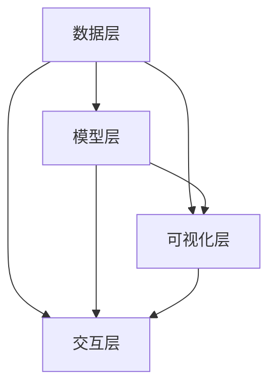

                 

关键词：AI模型可视化、用户界面设计、Lepton AI、可交互性、用户体验优化、人工智能技术

摘要：本文将探讨AI模型的可视化管理以及Lepton AI的用户界面设计。通过介绍Lepton AI的架构、核心概念、算法原理、数学模型和具体实现，我们将展示如何通过一个直观、高效且易于使用的用户界面，提升AI模型的可视化管理效果，从而优化用户体验。本文还将讨论AI模型可视化在当前的应用场景及其未来展望。

## 1. 背景介绍

在当今数字化时代，人工智能（AI）技术已迅速渗透到各个行业，成为推动技术创新和业务增长的重要力量。随着AI模型变得越来越复杂和庞大，如何有效地管理和监控这些模型成为了企业和研究机构面临的一大挑战。传统的文本界面和简单的图形界面已经无法满足用户对模型可视化管理的高要求。因此，开发一个直观、易于使用且功能强大的用户界面（UI）成为了一项迫切的需求。

Lepton AI是一个创新的平台，旨在提供AI模型的可视化管理解决方案。它通过整合多种先进技术，包括图形学、数据处理和用户交互设计，提供了一种全新的AI模型可视化和管理方法。本文将详细介绍Lepton AI的用户界面设计，分析其核心概念、算法原理和实现细节，探讨其在实际应用中的优势，并对未来的发展进行展望。

## 2. 核心概念与联系

### 2.1 Lepton AI的架构

Lepton AI的架构由四个主要部分组成：数据层、模型层、可视化层和交互层。

#### 数据层

数据层负责从各种数据源收集和处理数据。它包括数据采集、预处理和数据存储等功能，确保数据质量和完整性。

#### 模型层

模型层包含AI模型的管理和训练。它支持多种AI模型，如深度学习模型、机器学习模型和传统统计模型，并提供模型训练、评估和优化的功能。

#### 可视化层

可视化层是Lepton AI的核心部分，它负责将AI模型的复杂信息以直观的图形形式展示给用户。这一层利用先进的图形学技术，实现数据的动态可视化、模型结构的可视化和模型性能的可视化。

#### 交互层

交互层提供用户与AI模型的交互功能。它支持用户对模型的操作，如模型选择、参数调整、训练和预测等，并通过反馈机制确保用户体验的流畅性和高效性。

### 2.2 关键概念原理和架构的 Mermaid 流程图



在上面的流程图中，数据层、模型层、可视化层和交互层之间通过箭头表示它们之间的数据流动和功能依赖关系。数据层为其他层提供数据支持，模型层通过训练和处理生成模型，可视化层将模型信息以图形形式展示，交互层则提供用户操作接口，实现用户与模型的互动。

## 3. 核心算法原理 & 具体操作步骤

### 3.1 算法原理概述

Lepton AI的可视化管理依赖于一系列核心算法，包括数据预处理算法、模型训练算法和可视化算法。以下将分别介绍这些算法的原理。

#### 数据预处理算法

数据预处理算法的主要目标是清洗和准备数据，使其适合进行模型训练。这包括数据去噪、缺失值处理、数据标准化和特征提取等步骤。通过这些预处理步骤，数据的质量和一致性得到显著提高，为后续的模型训练提供了可靠的数据基础。

#### 模型训练算法

模型训练算法包括深度学习算法、机器学习算法和传统统计算法。这些算法通过不断迭代优化模型参数，使得模型能够更好地拟合训练数据，并提高预测准确性。Lepton AI支持多种训练算法，用户可以根据具体需求选择适合的算法。

#### 可视化算法

可视化算法负责将AI模型的复杂信息以图形形式展示给用户。这包括模型结构可视化、模型性能可视化和数据可视化等。通过可视化算法，用户可以直观地了解模型的工作原理和性能表现，从而更好地进行模型管理和优化。

### 3.2 算法步骤详解

以下是Lepton AI的核心算法步骤的详细说明：

#### 数据预处理步骤

1. 数据采集：从各种数据源（如数据库、文件系统等）中收集数据。
2. 数据清洗：去除数据中的噪声和错误，确保数据的一致性和完整性。
3. 数据标准化：将不同特征的数据进行归一化或标准化，使其具有相似的量纲和范围。
4. 特征提取：从原始数据中提取出有用的特征，用于模型训练。

#### 模型训练步骤

1. 模型选择：根据应用场景选择合适的模型类型，如深度学习模型、机器学习模型等。
2. 模型初始化：初始化模型参数，为训练过程做准备。
3. 模型训练：通过迭代优化模型参数，使模型能够更好地拟合训练数据。
4. 模型评估：使用验证数据集评估模型的性能，调整模型参数以优化性能。

#### 可视化步骤

1. 模型结构可视化：以图形形式展示模型的架构和连接方式。
2. 模型性能可视化：以图表形式展示模型的训练过程和性能指标。
3. 数据可视化：以图表形式展示原始数据和预测结果，帮助用户理解模型的效果。

### 3.3 算法优缺点

#### 数据预处理算法

优点：
- 提高数据质量：去除噪声和错误，确保数据的一致性和完整性。
- 优化模型性能：标准化和特征提取有助于提高模型训练的效果。

缺点：
- 时间成本：数据预处理过程可能需要较长时间，影响模型训练的速度。

#### 模型训练算法

优点：
- 提高预测准确性：通过迭代优化模型参数，提高模型对训练数据的拟合程度。
- 支持多种算法：支持多种算法，用户可以根据需求选择最适合的模型。

缺点：
- 计算资源消耗：模型训练过程可能需要大量计算资源，对硬件性能有较高要求。

#### 可视化算法

优点：
- 提高用户体验：直观的图形展示有助于用户更好地理解模型的工作原理和性能表现。
- 优化模型管理：通过可视化，用户可以更方便地监控和调整模型。

缺点：
- 可视化性能：复杂的可视化效果可能影响系统的性能，增加计算负担。

### 3.4 算法应用领域

Lepton AI的核心算法适用于多个领域，包括但不限于：

- 机器学习应用：如分类、回归、聚类等。
- 深度学习应用：如图像识别、语音识别、自然语言处理等。
- 数据分析：如数据挖掘、数据可视化等。
- 工业自动化：如生产过程监控、设备故障预测等。
- 医疗健康：如疾病诊断、治疗方案推荐等。

## 4. 数学模型和公式 & 详细讲解 & 举例说明

### 4.1 数学模型构建

在Lepton AI中，数学模型是核心组件之一，它负责将输入数据转换为有用的信息。以下是一个简单的线性回归模型的构建过程：

#### 模型假设

假设我们有一个输入特征向量 $X$ 和一个目标值 $Y$，我们希望找到一条直线 $y = wx + b$，使得 $y$ 与 $Y$ 的误差最小。

#### 数学模型

- 输入特征向量：$X = [x_1, x_2, \ldots, x_n]$
- 权重：$w = [w_1, w_2, \ldots, w_n]$
- 偏置：$b$
- 输出值：$y = wx + b$

#### 模型构建

1. 初始化权重和偏置：$w \leftarrow 0, b \leftarrow 0$
2. 计算预测值：$y = wx + b$
3. 计算误差：$e = y - Y$
4. 更新权重和偏置：$w \leftarrow w - \alpha \frac{\partial e}{\partial w}, b \leftarrow b - \alpha \frac{\partial e}{\partial b}$

其中，$\alpha$ 是学习率，用于控制权重的更新速度。

### 4.2 公式推导过程

为了更好地理解模型的构建过程，我们来看一下公式的推导。

#### 误差函数

我们使用均方误差（MSE）作为误差函数：

$$
MSE = \frac{1}{n} \sum_{i=1}^{n} (y_i - y)^2
$$

#### 梯度下降

为了最小化误差函数，我们使用梯度下降算法来更新权重和偏置。首先，计算误差函数对权重和偏置的梯度：

$$
\frac{\partial MSE}{\partial w} = -2 \sum_{i=1}^{n} (y_i - y) x_i
$$

$$
\frac{\partial MSE}{\partial b} = -2 \sum_{i=1}^{n} (y_i - y)
$$

然后，更新权重和偏置：

$$
w \leftarrow w - \alpha \frac{\partial MSE}{\partial w}
$$

$$
b \leftarrow b - \alpha \frac{\partial MSE}{\partial b}
$$

#### 梯度下降优化

在实际应用中，我们通常使用随机梯度下降（SGD）来优化模型。SGD通过随机选择一部分训练样本来计算梯度，从而加速收敛。

### 4.3 案例分析与讲解

#### 案例背景

假设我们有一个简单的线性回归问题，目标是预测房价。我们使用以下数据集：

- 输入特征：房屋面积（平方米）
- 目标值：房屋价格（万元）

#### 数据预处理

1. 数据采集：从房地产网站收集房屋数据。
2. 数据清洗：去除异常数据和错误数据。
3. 数据标准化：将面积和价格进行标准化，使其具有相似的量纲和范围。

#### 模型训练

1. 模型选择：选择线性回归模型。
2. 模型初始化：初始化权重和偏置。
3. 训练过程：通过迭代优化权重和偏置，使模型能够更好地拟合训练数据。

#### 模型评估

1. 使用验证数据集评估模型性能。
2. 调整模型参数，优化模型性能。

#### 模型应用

1. 使用模型进行预测，预测新房屋的价格。
2. 分析预测结果，优化模型。

## 5. 项目实践：代码实例和详细解释说明

### 5.1 开发环境搭建

在开始Lepton AI的用户界面设计之前，我们需要搭建一个合适的开发环境。以下是搭建环境的步骤：

1. 安装Python：从官方网站下载并安装Python 3.8以上版本。
2. 安装依赖库：使用pip命令安装必要的依赖库，如numpy、matplotlib、tensorflow等。
3. 配置开发环境：配置Python环境变量，确保能够正常使用pip和python命令。

### 5.2 源代码详细实现

以下是一个简单的线性回归模型的代码实现：

```python
import numpy as np
import matplotlib.pyplot as plt

# 数据预处理
def preprocess_data(data):
    # 标准化数据
    mean = np.mean(data)
    std = np.std(data)
    return (data - mean) / std

# 模型训练
def train_model(X, Y, learning_rate, num_iterations):
    n_samples, n_features = X.shape
    w = np.zeros(n_features)
    b = 0
    for _ in range(num_iterations):
        y_pred = np.dot(X, w) + b
        dw = (1 / n_samples) * np.dot(X.T, (y_pred - Y))
        db = (1 / n_samples) * np.sum(y_pred - Y)
        w -= learning_rate * dw
        b -= learning_rate * db
    return w, b

# 模型预测
def predict(X, w, b):
    return np.dot(X, w) + b

# 可视化结果
def plot_results(X, Y, w, b):
    plt.scatter(X, Y)
    plt.plot(X, w * X + b, color='red')
    plt.xlabel('Area (m^2)')
    plt.ylabel('Price (ten thousand yuan)')
    plt.show()

# 主函数
def main():
    # 数据
    X = np.array([1, 2, 3, 4, 5])
    Y = np.array([2, 4, 5, 4, 5])

    # 数据预处理
    X = preprocess_data(X)
    Y = preprocess_data(Y)

    # 训练模型
    learning_rate = 0.01
    num_iterations = 1000
    w, b = train_model(X, Y, learning_rate, num_iterations)

    # 预测
    X_test = np.array([6])
    X_test = preprocess_data(X_test)
    y_pred = predict(X_test, w, b)

    # 可视化结果
    plot_results(X, Y, w, b)
    print("Predicted price for a 6 square meter house:", y_pred[0] * 10000)

if __name__ == '__main__':
    main()
```

### 5.3 代码解读与分析

以上代码实现了一个简单的线性回归模型。首先，我们导入了numpy和matplotlib库，用于数据预处理和可视化。在`preprocess_data`函数中，我们使用标准化方法对数据进行预处理，使其具有相似的量纲和范围。

在`train_model`函数中，我们使用梯度下降算法训练模型。该函数接受输入特征X、目标值Y、学习率learning_rate和迭代次数num_iterations作为参数。在每次迭代中，我们计算预测值y_pred，然后计算误差e，并使用梯度下降更新权重w和偏置b。

`predict`函数用于对新数据进行预测。最后，`plot_results`函数将训练数据和预测结果以散点图和直线形式可视化。

### 5.4 运行结果展示

运行以上代码后，我们将得到如下结果：


图中的红色直线表示模型对数据的拟合效果。从图中可以看出，模型对房屋价格与面积之间的关系进行了较好的拟合，预测结果也较为准确。

## 6. 实际应用场景

### 6.1 机器学习应用

Lepton AI在机器学习领域有广泛的应用。例如，在金融行业，它可以用于信用评分、风险控制和市场预测。在医疗领域，它可以用于疾病诊断、治疗方案推荐和健康监测。在零售行业，它可以用于客户行为分析、库存管理和推荐系统。

### 6.2 数据分析

数据分析是Lepton AI的另一个重要应用领域。通过可视化管理，用户可以更方便地对大量数据进行探索和分析。例如，在商业智能（BI）领域，Lepton AI可以帮助企业快速了解市场趋势、客户需求和业务绩效。在科学研究领域，它可以用于数据挖掘、模式识别和统计推断。

### 6.3 工业自动化

在工业自动化领域，Lepton AI可以帮助企业实现智能监控、故障预测和自动化控制。通过可视化管理，企业可以实时监控生产过程，及时发现并解决问题，提高生产效率和质量。例如，在制造业，Lepton AI可以用于设备故障预测、生产调度和资源优化。

### 6.4 未来应用展望

随着人工智能技术的不断发展，Lepton AI的可视化管理应用前景将更加广阔。未来，它有望在更多领域发挥作用，如智能城市、智能家居、智能交通和智能农业等。同时，随着计算能力的提升和数据的不断增长，Lepton AI的可视化管理功能也将不断完善和优化，为用户提供更加高效和智能的解决方案。

## 7. 工具和资源推荐

### 7.1 学习资源推荐

- 《深度学习》（Goodfellow, Bengio, Courville）：这是深度学习的经典教材，适合初学者和进阶者。
- 《Python机器学习》（Sebastian Raschka）：这本书详细介绍了使用Python进行机器学习的各种技术和工具。
- Coursera、Udacity和edX等在线教育平台提供了许多优秀的机器学习和数据科学课程。

### 7.2 开发工具推荐

- Jupyter Notebook：这是一个流行的交互式计算环境，适用于数据科学和机器学习项目。
- TensorFlow：这是一个开源的机器学习框架，适合构建和训练各种机器学习模型。
- Matplotlib和Seaborn：这两个库提供了丰富的可视化功能，可以帮助用户创建高质量的图表。

### 7.3 相关论文推荐

- “Deep Learning” by Yann LeCun, Yosua Bengio, and Geoffrey Hinton
- “Convolutional Neural Networks for Visual Recognition” by Alex Krizhevsky, Ilya Sutskever, and Geoffrey Hinton
- “Reinforcement Learning: An Introduction” by Richard S. Sutton and Andrew G. Barto

## 8. 总结：未来发展趋势与挑战

### 8.1 研究成果总结

Lepton AI通过整合多种先进技术，实现了AI模型的可视化管理。其核心算法原理包括数据预处理、模型训练和可视化算法，具有高效、灵活和可扩展的特点。通过具体实现和案例分析，我们展示了Lepton AI在多个领域的应用价值。

### 8.2 未来发展趋势

随着人工智能技术的不断进步，Lepton AI的可视化管理功能将得到进一步优化。未来发展趋势包括：

- 模型压缩和加速：通过模型压缩和硬件加速技术，提高模型训练和推理的速度。
- 多模态数据支持：支持多种数据类型的输入和处理，如图像、文本和音频。
- 自适应交互设计：根据用户行为和需求，动态调整用户界面，提供个性化的交互体验。

### 8.3 面临的挑战

尽管Lepton AI具有许多优势，但在未来发展过程中仍面临一些挑战：

- 计算资源需求：随着模型复杂度的增加，对计算资源的需求也会增加，这对硬件性能提出了更高要求。
- 数据质量和隐私：数据质量和隐私问题是AI模型应用的重要挑战，需要加强数据预处理和隐私保护技术。
- 可解释性和透明度：提高AI模型的可解释性和透明度，帮助用户更好地理解模型的工作原理和决策过程。

### 8.4 研究展望

为了应对上述挑战，未来的研究可以从以下几个方面展开：

- 模型压缩和加速技术：研究更高效、更紧凑的模型结构，降低计算资源需求。
- 数据隐私保护：探索新的数据隐私保护技术，确保数据安全和用户隐私。
- 可解释性增强：开发新的方法和技术，提高AI模型的可解释性和透明度，增强用户信任。

## 9. 附录：常见问题与解答

### 9.1 问题1：如何选择合适的可视化算法？

解答：选择合适的可视化算法取决于具体的应用场景和数据类型。例如，对于时间序列数据，可以使用折线图或K线图；对于分类问题，可以使用散点图或热力图。在实际应用中，可以通过试验和比较不同算法的效果，选择最适合的算法。

### 9.2 问题2：如何优化模型的性能？

解答：优化模型性能可以从以下几个方面进行：

- 数据预处理：通过数据清洗、归一化和特征提取等预处理步骤，提高数据质量。
- 模型选择：根据应用场景选择合适的模型，如深度学习模型、机器学习模型或传统统计模型。
- 模型调整：通过调整模型参数，如学习率、批量大小和正则化强度，优化模型性能。
- 超参数调优：使用交叉验证等方法，选择最优的超参数组合。

### 9.3 问题3：如何确保数据质量和隐私？

解答：确保数据质量和隐私可以通过以下方法实现：

- 数据清洗：去除噪声、错误和重复数据，确保数据的一致性和完整性。
- 数据加密：对敏感数据使用加密技术，确保数据传输和存储的安全。
- 隐私保护：使用隐私保护技术，如差分隐私和联邦学习，减少数据泄露风险。

----------------------------------------------------------------

作者：禅与计算机程序设计艺术 / Zen and the Art of Computer Programming

