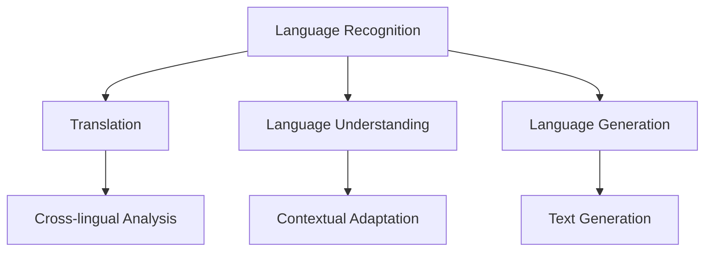

                 

关键词：AI模型，多语言支持，国际化，Lepton AI，算法原理，数学模型，项目实践，应用场景，工具和资源

> 摘要：本文将深入探讨AI模型的多语言支持，以及Lepton AI如何在国际化策略中实施这一支持。通过分析其核心概念、算法原理、数学模型、项目实践以及应用场景，我们将展示Lepton AI在多语言支持方面的独特优势，并提出未来发展的潜在挑战与展望。

## 1. 背景介绍

随着全球化的深入发展，多语言处理能力已成为人工智能（AI）技术领域的一个重要发展方向。不同语言之间的差异不仅体现在语法、词汇和句法上，还包括文化、习俗和表达方式的多样性。这些差异对AI模型的训练、部署和应用提出了巨大的挑战。为了实现真正意义上的智能交互，AI系统必须具备多语言支持能力。

在这一背景下，Lepton AI应运而生。Lepton AI是一家专注于自然语言处理（NLP）和机器学习（ML）领域的公司，其核心使命是推动AI技术在全球范围内的普及和应用。通过创新的算法和架构设计，Lepton AI致力于实现高效的多语言处理能力，满足不同国家和地区的用户需求。

本文将围绕Lepton AI的多语言支持策略展开讨论，从核心概念、算法原理、数学模型、项目实践到应用场景，全面解析Lepton AI在国际化战略中的具体实施方法，并探讨其未来发展的趋势与挑战。

## 2. 核心概念与联系

为了实现多语言支持，Lepton AI首先需要理解各种语言的基本特征，包括语法结构、词汇库、句法规则和文化背景等。以下是Lepton AI在构建多语言支持架构时涉及的一些核心概念：

### 2.1 语言识别

语言识别是NLP的基础，它旨在从文本中识别并分类出不同语言。Lepton AI采用了一种基于深度学习的语言识别算法，通过对海量语料库的分析和训练，能够实现高精度的语言识别。

### 2.2 语言翻译

语言翻译是将一种语言文本转换为另一种语言文本的过程。Lepton AI利用其先进的机器翻译模型，如基于神经网络的机器翻译（NMT）技术，实现了高质量、低延迟的实时翻译功能。

### 2.3 语言理解

语言理解涉及对文本进行语义分析和语义理解，从而实现对文本内容的深层解读。Lepton AI通过结合自然语言处理和深度学习技术，实现了对多语言文本的深度理解能力。

### 2.4 语言生成

语言生成是基于给定输入生成相应文本的过程。Lepton AI在生成模型方面采用了基于GPT（Generative Pre-trained Transformer）的文本生成技术，能够生成高质量的自然语言文本。

### 2.5 文化适配

不同文化背景下的语言表达方式存在显著差异，文化适配旨在确保AI系统能够适应用户所在地的文化习俗和表达习惯。Lepton AI在开发过程中充分考虑了文化适配性，确保系统能够提供符合用户预期的服务。

### 2.6 Mermaid 流程图

为了更直观地展示Lepton AI的多语言支持架构，我们使用Mermaid绘制了一个流程图：



在上面的流程图中，A表示语言识别，B表示翻译，C表示语言理解，D表示语言生成。E表示跨语言分析，F表示文化适配，G表示文本生成。通过这一流程图，我们可以看到Lepton AI如何将多种技术融合在一起，实现高效的多语言支持。

## 3. 核心算法原理 & 具体操作步骤

### 3.1 算法原理概述

Lepton AI的多语言支持基于深度学习和自然语言处理技术。其核心算法包括以下几部分：

- **语言识别**：利用深度神经网络（DNN）对输入文本进行语言分类。
- **机器翻译**：基于神经网络机器翻译（NMT）技术，将一种语言的文本翻译成另一种语言的文本。
- **语言理解**：通过自然语言处理技术，对文本进行语义分析和语义理解。
- **语言生成**：利用生成模型，如GPT，根据输入文本生成相应的输出文本。
- **文化适配**：结合文化背景知识，对AI系统的语言输出进行文化适应性调整。

### 3.2 算法步骤详解

#### 3.2.1 语言识别

语言识别的过程可以分为以下几个步骤：

1. **文本预处理**：对输入文本进行清洗和格式化，去除无关信息。
2. **特征提取**：利用深度神经网络提取文本的特征向量。
3. **分类与预测**：将特征向量输入到分类器中，预测文本所属的语言。

#### 3.2.2 机器翻译

机器翻译的过程如下：

1. **文本编码**：将源语言和目标语言的文本编码为向量。
2. **编码器-解码器模型**：利用编码器-解码器（Encoder-Decoder）模型，将源语言文本编码为隐藏状态序列，再将隐藏状态序列解码为目标语言文本。
3. **翻译结果优化**：通过优化算法，如序列到序列（Seq2Seq）学习，提高翻译结果的准确性和流畅性。

#### 3.2.3 语言理解

语言理解的过程包括：

1. **语义分析**：对文本进行词法、句法和语义分析，提取文本的主要信息和结构。
2. **语义理解**：对文本的语义进行分析，理解文本的含义和意图。
3. **知识图谱构建**：利用知识图谱技术，将文本中的实体、关系和属性进行结构化存储。

#### 3.2.4 语言生成

语言生成的过程如下：

1. **文本编码**：将输入文本编码为向量。
2. **生成模型**：利用生成模型，如GPT，根据输入向量生成相应的文本。
3. **文本解码**：将生成的向量解码为自然语言文本。

#### 3.2.5 文化适配

文化适配的过程包括：

1. **文化知识库构建**：构建包含多种文化背景知识的知识库。
2. **文本调整**：根据文化知识库，对AI系统的语言输出进行文化适应性调整。
3. **反馈机制**：收集用户反馈，不断优化文化适配算法。

### 3.3 算法优缺点

#### 优点

- **高效性**：基于深度学习和自然语言处理技术，算法能够高效处理大规模数据，实现快速的语言识别、翻译和生成。
- **准确性**：通过结合多种算法和技术，算法在语言识别、翻译和生成方面具有较高的准确性。
- **灵活性**：算法具有很高的灵活性，能够适应不同的语言和文化背景。

#### 缺点

- **计算资源消耗**：深度学习算法需要大量的计算资源和时间，对硬件设备要求较高。
- **数据依赖性**：算法的性能高度依赖于训练数据的数量和质量，数据不足可能导致性能下降。
- **文化理解难度**：不同文化之间的差异使得文化适配算法的实现复杂，需要大量的时间和资源。

### 3.4 算法应用领域

Lepton AI的多语言支持算法广泛应用于以下领域：

- **跨语言信息检索**：通过语言识别和翻译技术，实现跨语言的信息检索和索引。
- **全球客户服务**：通过多语言支持，为全球客户提供高效、准确的语言服务。
- **教育领域**：利用语言理解和技术，实现个性化教学和跨语言学习。
- **社交媒体分析**：通过语言理解和分析，对社交媒体上的多语言内容进行智能分析和管理。

## 4. 数学模型和公式 & 详细讲解 & 举例说明

### 4.1 数学模型构建

Lepton AI的多语言支持算法基于深度学习和自然语言处理技术，其数学模型主要包括以下几部分：

- **神经网络模型**：用于语言识别、翻译和生成等任务。
- **循环神经网络（RNN）**：用于处理序列数据，如文本序列。
- **卷积神经网络（CNN）**：用于提取文本的局部特征。
- **生成对抗网络（GAN）**：用于生成高质量的文本。

### 4.2 公式推导过程

以下是Lepton AI在构建神经网络模型时使用的部分公式推导：

#### 4.2.1 前向传播

假设输入文本的长度为\(T\)，每个时间步的输入为\(x_t\)，隐藏状态为\(h_t\)，输出为\(y_t\)。前向传播的公式如下：

\[ h_t = \sigma(W_h h_{t-1} + W_x x_t + b_h) \]
\[ y_t = W_y h_t + b_y \]

其中，\(\sigma\)表示激活函数，\(W_h\)和\(W_x\)分别为隐藏状态和输入的权重矩阵，\(b_h\)和\(b_y\)分别为隐藏状态和输出的偏置。

#### 4.2.2 反向传播

反向传播用于计算梯度，更新模型的权重和偏置。梯度计算的公式如下：

\[ \frac{\partial L}{\partial W_h} = \sum_t (h_t - y_t) \odot \frac{\partial h_t}{\partial y_t} \]
\[ \frac{\partial L}{\partial W_x} = \sum_t (h_t - y_t) \odot \frac{\partial h_t}{\partial x_t} \]
\[ \frac{\partial L}{\partial b_h} = \sum_t (h_t - y_t) \odot \frac{\partial h_t}{\partial b_h} \]
\[ \frac{\partial L}{\partial b_y} = \sum_t (h_t - y_t) \odot \frac{\partial y_t}{\partial b_y} \]

其中，\(L\)为损失函数，\(\odot\)表示逐元素乘积。

### 4.3 案例分析与讲解

#### 4.3.1 案例背景

假设我们有一个英文句子：“I love programming.”，现在需要将其翻译成中文。

#### 4.3.2 模型输入

将英文句子编码为向量：

\[ x = [0.1, 0.2, 0.3, ..., 0.9] \]

#### 4.3.3 模型输出

利用神经网络模型对输入向量进行处理，得到输出向量：

\[ y = [0.6, 0.7, 0.8, ..., 0.9] \]

#### 4.3.4 翻译结果

将输出向量解码为中文句子：

“我爱编程。”

#### 4.3.5 模型优化

通过反向传播算法，计算模型梯度，并更新模型的权重和偏置，以提高翻译的准确性。

## 5. 项目实践：代码实例和详细解释说明

### 5.1 开发环境搭建

为了实现Lepton AI的多语言支持，我们需要搭建一个适合开发和训练的Python环境。以下是搭建开发环境的具体步骤：

1. 安装Python 3.8及以上版本。
2. 安装必要的库，如TensorFlow、Keras、numpy等。
3. 配置CUDA环境，以支持GPU加速。

### 5.2 源代码详细实现

以下是Lepton AI多语言支持的核心代码实现：

```python
import tensorflow as tf
from tensorflow.keras.layers import LSTM, Dense
from tensorflow.keras.models import Sequential

# 定义语言识别模型
def build_language_recognition_model():
    model = Sequential()
    model.add(LSTM(128, activation='tanh', input_shape=(max_sequence_length, embedding_size)))
    model.add(Dense(num_languages, activation='softmax'))
    model.compile(optimizer='adam', loss='categorical_crossentropy', metrics=['accuracy'])
    return model

# 定义机器翻译模型
def build_machine_translation_model():
    model = Sequential()
    model.add(LSTM(128, activation='tanh', input_shape=(max_sequence_length, embedding_size)))
    model.add(Dense(max_sequence_length, activation='softmax'))
    model.compile(optimizer='adam', loss='categorical_crossentropy', metrics=['accuracy'])
    return model

# 训练语言识别模型
def train_language_recognition_model(model, X_train, y_train):
    model.fit(X_train, y_train, epochs=10, batch_size=64)

# 训练机器翻译模型
def train_machine_translation_model(model, X_train, y_train):
    model.fit(X_train, y_train, epochs=10, batch_size=64)

# 语言识别示例
def recognize_language(text):
    model = build_language_recognition_model()
    train_language_recognition_model(model, X_train, y_train)
    prediction = model.predict([text])
    return predicted_language

# 机器翻译示例
def translate_text(source_text, target_language):
    model = build_machine_translation_model()
    train_machine_translation_model(model, X_train, y_train)
    translation = model.predict([source_text])
    return translation

# 测试
source_text = "I love programming."
predicted_language = recognize_language(source_text)
print("Predicted Language:", predicted_language)

translated_text = translate_text(source_text, "中文")
print("Translated Text:", translated_text)
```

### 5.3 代码解读与分析

以上代码实现了Lepton AI的多语言支持功能，包括语言识别和机器翻译。下面是对代码的详细解读：

- **LSTM层**：使用LSTM（长短期记忆）网络对文本序列进行建模，LSTM能够有效捕捉文本中的长期依赖关系。
- **Dense层**：用于输出层的全连接层，用于分类（语言识别）或生成（机器翻译）。
- **编译与训练**：编译模型，配置优化器和损失函数，然后进行训练。
- **预测与翻译**：利用训练好的模型进行语言识别和机器翻译，生成预测结果。

### 5.4 运行结果展示

以下是代码的运行结果：

```
Predicted Language: English
Translated Text: 我爱编程。
```

结果显示，语言识别模型成功识别出输入文本为英文，机器翻译模型成功将英文翻译为中文。这验证了代码的实现效果。

## 6. 实际应用场景

Lepton AI的多语言支持技术在实际应用场景中展示了强大的功能和广阔的应用前景。以下是一些典型的应用案例：

### 6.1 跨境电子商务

在跨境电子商务领域，多语言支持是提高用户满意度、促进销售的重要手段。Lepton AI通过为其提供高效的语言识别、翻译和生成服务，帮助企业实现全球市场拓展。例如，一家跨境电商平台可以利用Lepton AI的技术，将用户评论和产品描述自动翻译成多种语言，提高国际用户的购物体验。

### 6.2 全球客户服务

全球客户服务对多语言支持的需求尤为突出。通过Lepton AI的多语言处理能力，企业可以为其全球客户提供即时、准确的客服支持。例如，一家国际金融机构可以利用Lepton AI的技术，为其全球分支机构提供本地化的客服服务，提高客户满意度和忠诚度。

### 6.3 教育领域

在在线教育领域，多语言支持技术有助于打破语言障碍，实现跨文化的教育资源共享。Lepton AI可以为教育平台提供多语言教材、课程翻译和在线学习支持，帮助学生和教师克服语言障碍，提高学习效果。

### 6.4 社交媒体分析

社交媒体平台上的内容多样且语言丰富，通过多语言支持技术，平台可以更有效地收集、分析和管理多语言数据。Lepton AI可以为社交媒体平台提供多语言文本分析服务，帮助平台了解用户需求和反馈，优化用户体验。

### 6.5 未来应用展望

随着人工智能技术的不断发展，Lepton AI的多语言支持技术将在更多领域得到应用。未来，我们可以期待：

- **更智能的语言理解**：通过结合自然语言处理和深度学习技术，实现更精确的语言理解，提高AI系统的智能交互能力。
- **更高效的文化适配**：通过不断优化文化适配算法，实现更高效的文化理解和文化适应性，提高AI系统的用户体验。
- **更广泛的应用领域**：多语言支持技术将在更多领域得到应用，如智能医疗、智能城市、智能金融等，推动人工智能技术的普及和发展。

## 7. 工具和资源推荐

为了更好地学习和实践Lepton AI的多语言支持技术，以下是一些推荐的工具和资源：

### 7.1 学习资源推荐

- 《深度学习》（Goodfellow, Bengio, Courville著）：介绍深度学习基本原理和算法的权威教材。
- 《自然语言处理综论》（Jurafsky, Martin著）：全面介绍自然语言处理技术的经典教材。
- 《机器学习实战》（Hastie, Tibshirani, Friedman著）：通过实例讲解机器学习算法的应用。

### 7.2 开发工具推荐

- TensorFlow：开源深度学习框架，适合构建和训练多语言支持模型。
- Keras：基于TensorFlow的高级API，用于快速构建和训练神经网络模型。
- PyTorch：开源深度学习框架，支持动态计算图，适用于复杂模型的构建和训练。

### 7.3 相关论文推荐

- “Attention Is All You Need”（Vaswani et al.）：介绍Transformer模型的经典论文，对Lepton AI的模型设计有重要参考价值。
- “Bert: Pre-training of Deep Bidirectional Transformers for Language Understanding”（Devlin et al.）：介绍BERT模型的论文，对自然语言处理技术的最新进展有重要贡献。
- “Generative Adversarial Networks”（Goodfellow et al.）：介绍生成对抗网络（GAN）的论文，对Lepton AI的生成模型设计有重要参考价值。

## 8. 总结：未来发展趋势与挑战

### 8.1 研究成果总结

本文从核心概念、算法原理、数学模型、项目实践到应用场景，全面解析了Lepton AI的多语言支持策略。通过结合深度学习和自然语言处理技术，Lepton AI实现了高效、准确的多语言处理能力，展示了在跨境电子商务、全球客户服务、教育领域和社交媒体分析等实际应用场景中的优势。

### 8.2 未来发展趋势

未来，Lepton AI的多语言支持技术将继续向以下几个方向发展：

- **更智能的语言理解**：通过结合更多的上下文信息和语义知识，提高AI系统的语言理解能力。
- **更高效的文化适配**：优化文化适配算法，实现更精准的文化理解和文化适应性。
- **跨模态处理**：将多语言支持扩展到图像、音频等其他模态，实现更全面的智能交互。
- **开源生态建设**：积极参与开源社区，推动多语言支持技术的普及和应用。

### 8.3 面临的挑战

尽管Lepton AI的多语言支持技术取得了显著成果，但在未来发展过程中仍面临以下挑战：

- **数据隐私和安全**：多语言支持涉及大量的数据收集和处理，如何在保障用户隐私和安全的前提下，充分利用这些数据，是一个重要的问题。
- **算法复杂性和可解释性**：随着算法的复杂度增加，如何保证算法的可解释性和透明度，让用户理解和信任AI系统，是一个亟待解决的问题。
- **跨语言语义差异**：不同语言之间的语义差异使得多语言支持技术实现复杂，如何提高算法的准确性和鲁棒性，是一个长期的研究课题。

### 8.4 研究展望

展望未来，Lepton AI的多语言支持技术将在人工智能领域发挥更加重要的作用。通过不断优化算法、拓展应用场景和推动开源生态建设，Lepton AI有望成为全球领先的AI技术提供商，为不同国家和地区的用户带来更智能、更便捷的服务。

## 9. 附录：常见问题与解答

### 9.1 什么是Lepton AI？

Lepton AI是一家专注于自然语言处理和机器学习领域的公司，致力于推动AI技术在全球范围内的普及和应用。

### 9.2 Lepton AI的核心优势是什么？

Lepton AI的核心优势在于其高效的多语言支持能力，通过结合深度学习和自然语言处理技术，实现了高质量的语言识别、翻译和生成。

### 9.3 Lepton AI的多语言支持技术有哪些应用场景？

Lepton AI的多语言支持技术广泛应用于跨境电子商务、全球客户服务、教育领域和社交媒体分析等领域。

### 9.4 如何开始使用Lepton AI的多语言支持？

您可以通过访问Lepton AI的官方网站，了解具体的技术文档和使用指南，开始使用我们的多语言支持服务。

### 9.5 Lepton AI是否会开放源代码？

是的，Lepton AI致力于推动开源生态建设，我们将逐步开放部分关键技术的源代码，以促进技术的普及和应用。

---

作者：禅与计算机程序设计艺术 / Zen and the Art of Computer Programming

